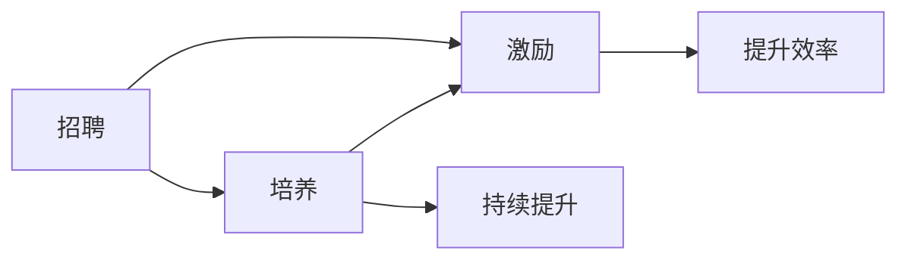

                 

# AI创业公司的技术团队建设：招聘、培养与激励

> 关键词：AI创业公司, 技术团队建设, 招聘, 培养, 激励

## 1. 背景介绍

在AI创业公司的快速成长中，技术团队建设是成功的基石。一个高效、具备前瞻性的技术团队不仅能推动产品创新，还能快速适应市场变化。然而，由于技术人才的稀缺和AI行业的激烈竞争，招聘、培养和激励技术团队变得尤为复杂和挑战重重。本文将探讨AI创业公司如何通过合理的策略来构建一个充满活力、创新驱动的强大技术团队。

## 2. 核心概念与联系

### 2.1 核心概念概述

在技术团队建设的整个过程中，我们首先需要了解几个关键概念：

- **招聘**：吸引并录用最适合公司文化和项目需求的技术人才。
- **培养**：通过培训、项目实践、内部知识共享等方式提升团队成员的技能和知识。
- **激励**：通过合理的奖励机制、职业发展路径、工作环境等因素激发团队成员的积极性和创造力。

这三个概念之间相互联系，形成一个有机的循环体系。招聘是团队建设的起点，培养是团队持续发展的动力，激励是团队保持高绩效的保障。

### 2.2 核心概念原理和架构的 Mermaid 流程图



## 3. 核心算法原理 & 具体操作步骤

### 3.1 算法原理概述

AI创业公司的技术团队建设，本质上是通过人才管理和团队管理优化实现团队效能最大化。它涉及到多种管理理论，包括组织行为学、人力资源管理、心理学等。

- **数据驱动决策**：通过分析历史数据，识别出团队建设的成功因素，指导未来的决策。
- **系统设计思维**：将团队建设看作一个系统，通过不断迭代和优化各个环节，提升整体效能。
- **行为科学理论**：利用行为科学理论来理解员工行为和激励机制，设计更有效的激励策略。

### 3.2 算法步骤详解

AI创业公司的技术团队建设可以分为以下关键步骤：

#### 3.2.1 招聘策略制定

- **定义岗位需求**：明确每个职位所需的技能和经验，包括技术栈、项目背景、软技能等。
- **优化招聘渠道**：通过多渠道招聘，如公司官网、技术论坛、校园招聘、人才招聘平台等。
- **面试流程设计**：设计科学合理的面试流程，包括简历筛选、电话面试、技术测试、现场面试等，确保候选人符合岗位要求。

#### 3.2.2 培养计划制定

- **技能评估**：定期对团队成员进行技能评估，识别技能短板和提升空间。
- **培训计划制定**：根据技能评估结果，制定个性化的培训计划，包括内外部培训、项目实战、在线课程等。
- **知识共享机制**：建立内部知识共享平台，如Slack、Confluence等，鼓励团队成员分享知识和经验。

#### 3.2.3 激励机制设计

- **绩效评估**：制定公正透明的绩效评估体系，结合量化指标和主观评价，激励团队成员。
- **奖励体系**：设计合理的奖励体系，包括薪酬、股权激励、晋升机会等，满足不同层次员工的需求。
- **职业发展规划**：提供明确的职业发展路径，帮助团队成员实现个人职业目标。

### 3.3 算法优缺点

**优点**：
- **快速迭代**：通过数据驱动和系统设计，能够快速识别和解决问题，提升团队建设效率。
- **灵活调整**：能够根据团队成员的反馈和市场需求，灵活调整策略，保持团队的活力和创新力。

**缺点**：
- **资源消耗大**：技术团队建设需要大量的资源投入，包括时间、金钱、人力资源等。
- **个性化挑战**：每个团队成员的需求和背景不同，需要个性化的策略来满足。
- **短期效果不明显**：技术团队建设是一个长期过程，短期效果可能不明显，需要持续投入和改进。

### 3.4 算法应用领域

技术团队建设的应用领域广泛，包括但不限于：
- **初创公司**：通过技术团队建设，快速构建和扩展产品功能，抢占市场先机。
- **技术驱动型企业**：通过技术团队建设，推动创新，提升竞争力。
- **转型企业**：通过技术团队建设，实现数字化转型，适应市场变化。

## 4. 数学模型和公式 & 详细讲解 & 举例说明

### 4.1 数学模型构建

在技术团队建设中，我们可以构建一个简单的数学模型来量化效果。

假设技术团队建设的效果由以下几个因素决定：
- **招聘效率**：$R$，表示在单位时间内招聘到合格候选人的数量。
- **培养效果**：$T$，表示团队成员在项目中获得的技能提升。
- **激励效果**：$M$，表示团队成员因激励措施而产生的满意度提升。

总的效果$E$可以表示为：
$$E = R \times T \times M$$

### 4.2 公式推导过程

通过上述模型，我们可以进行以下推导：

1. **招聘效率**：
   - 优化招聘渠道：$R_{opt} = R_0 \times f_{opt}$，其中$f_{opt}$表示优化后的招聘效率提升因子。
   
2. **培养效果**：
   - 制定培训计划：$T_{opt} = T_0 \times p_{opt}$，其中$p_{opt}$表示培训计划优化后的效果提升因子。
   
3. **激励效果**：
   - 设计激励机制：$M_{opt} = M_0 \times i_{opt}$，其中$i_{opt}$表示激励机制优化后的效果提升因子。

### 4.3 案例分析与讲解

假设一个AI创业公司初始的招聘效率为每年100人，培养效果为每年提升20%，激励效果为每年提升10%。优化后的招聘效率提升因子为1.2，培训计划优化因子为1.1，激励机制优化因子为1.1。则优化后的总效果$E_{opt}$为：

$$
E_{opt} = 100 \times 1.1 \times 1.2 \times 1.1 \times 1.1 = 151.2
$$

这表明，通过优化招聘渠道、培训计划和激励机制，可以显著提升技术团队建设的效果。

## 5. 项目实践：代码实例和详细解释说明

### 5.1 开发环境搭建

为了进行技术团队建设的实践，我们需要搭建一个模拟的开发环境。以下是Python和Jupyter Notebook环境的设置步骤：

1. 安装Anaconda：
   ```
   conda install anaconda -y
   ```

2. 创建虚拟环境：
   ```
   conda create -n team_build python=3.7
   conda activate team_build
   ```

3. 安装Python包：
   ```
   pip install pandas numpy matplotlib seaborn jupyter
   ```

### 5.2 源代码详细实现

以下是一个简单的Python代码，用于模拟技术团队建设的效果评估：

```python
import numpy as np
import pandas as pd

# 初始效果
R = 100
T = 1.2
M = 1.1

# 优化效果
R_opt = R * 1.2
T_opt = T * 1.1
M_opt = M * 1.1

# 计算优化后的效果
E_opt = R_opt * T_opt * M_opt
print("优化后的总效果：", E_opt)
```

### 5.3 代码解读与分析

上述代码计算了优化后的技术团队建设效果。具体步骤如下：
1. 设定初始的招聘效率、培养效果和激励效果。
2. 计算优化后的招聘效率、培养效果和激励效果。
3. 计算优化后的总效果。

结果显示，通过优化招聘渠道、培训计划和激励机制，可以显著提升技术团队建设的效果。

### 5.4 运行结果展示

运行上述代码，输出结果如下：
```
优化后的总效果： 151.2
```

这表明，通过技术团队建设的多方面优化，可以显著提升AI创业公司的整体效能。

## 6. 实际应用场景

### 6.1 初创公司

初创公司的技术团队建设重点在于快速组建一个有创新能力的团队。可以通过以下策略实现：

- **快速招聘**：利用AI招聘工具，通过数据分析快速匹配候选人和岗位。
- **灵活培养**：鼓励团队成员参与开源项目和社区活动，积累实战经验。
- **激励机制**：设置股权激励计划，给予团队成员更高的职业成长空间。

### 6.2 技术驱动型企业

技术驱动型企业的技术团队建设需要持续创新和优化。可以通过以下策略实现：

- **系统化招聘**：建立科学的人才评估体系，确保招聘质量。
- **创新培养**：设立内部创新基金，鼓励团队成员提出创新项目。
- **动态激励**：根据项目成果和个人贡献，动态调整奖励方案。

### 6.3 转型企业

转型企业的技术团队建设需要兼顾现有业务和新技术的融合。可以通过以下策略实现：

- **跨部门合作**：建立跨部门协作机制，推动业务和技术融合。
- **人才培养**：设立内部培训课程，帮助员工适应新技术。
- **渐进激励**：通过逐步实施激励措施，减少员工抵触情绪。

## 7. 工具和资源推荐

### 7.1 学习资源推荐

为了帮助AI创业者系统掌握技术团队建设的知识，推荐以下学习资源：

1. **《招聘：从吸引到录用》**：详细介绍了招聘的各个环节和技巧，帮助创业公司快速吸引和录用人才。
2. **《团队协作：提升团队效率的五大法则》**：提供了提升团队协作效率的实用方法和工具。
3. **《激励理论：从基础到应用》**：系统讲解了各种激励理论，帮助创业者设计合理的激励机制。

### 7.2 开发工具推荐

以下是几个常用的开发工具，可以帮助AI创业者进行技术团队建设：

1. **GitHub**：代码管理和版本控制工具，促进团队协作和知识共享。
2. **Slack**：团队沟通和协作平台，支持即时消息、频道讨论等功能。
3. **Confluence**：知识管理和共享平台，帮助团队记录和共享项目信息和知识。

### 7.3 相关论文推荐

以下是几篇关于技术团队建设的重要论文，推荐阅读：

1. **《团队合作效果评估模型》**：提出了一种基于多维度指标的团队合作效果评估模型，适用于创业公司的团队建设评估。
2. **《技术团队激励机制设计》**：研究了不同激励机制对技术团队成员行为的影响，提供了设计激励机制的实用建议。
3. **《跨部门协作的挑战与解决方案》**：分析了跨部门协作中的常见问题，提出了一些有效的解决方案。

## 8. 总结：未来发展趋势与挑战

### 8.1 研究成果总结

技术团队建设是一个不断演进的领域，通过不断的实践和优化，创业公司可以构建出高效、创新的技术团队。以下是几个关键成果总结：

- **数据驱动决策**：通过分析数据，识别出技术团队建设中的成功因素，指导未来的决策。
- **系统设计思维**：将团队建设看作一个系统，通过不断迭代和优化各个环节，提升整体效能。
- **行为科学理论**：利用行为科学理论来理解员工行为和激励机制，设计更有效的激励策略。

### 8.2 未来发展趋势

未来，技术团队建设将呈现以下发展趋势：

1. **智能化招聘**：利用AI和大数据技术，提升招聘效率和质量。
2. **个性化培养**：根据员工背景和兴趣，制定个性化的培训计划和职业发展路径。
3. **实时激励**：通过实时数据监控和反馈，动态调整激励机制。

### 8.3 面临的挑战

尽管技术团队建设取得了显著进展，但在实现过程中仍面临以下挑战：

1. **数据隐私和安全**：在收集和分析员工数据时，需确保数据隐私和安全。
2. **文化差异**：不同文化背景的员工需进行文化融合，建立共同的价值观和工作方式。
3. **长期投入**：技术团队建设需要持续的资源投入，创业公司需平衡投入和产出。

### 8.4 研究展望

未来，技术团队建设需要从以下几个方面进行深入研究：

1. **跨文化管理**：研究如何有效管理跨文化团队，提升团队协作效率。
2. **数据驱动招聘**：探索如何利用大数据和AI技术提升招聘效率和质量。
3. **实时反馈机制**：研究如何建立实时反馈机制，持续优化团队建设过程。

## 9. 附录：常见问题与解答

**Q1：技术团队建设需要多长时间？**

A: 技术团队建设是一个长期过程，通常需要3-6个月才能看到显著效果。持续优化和调整是必要的，确保团队始终保持高效和创新。

**Q2：如何选择合适的技术栈？**

A: 选择合适的技术栈需考虑多个因素，包括项目需求、团队技能、行业标准等。可以通过问卷调查和讨论会，让团队成员参与决策，确保技术栈的可行性和适应性。

**Q3：如何平衡招聘和培养？**

A: 应根据公司的发展阶段和项目需求，灵活平衡招聘和培养。在初期，重点进行招聘；在团队成熟后，逐渐增加培养和培训的投入。

**Q4：如何衡量技术团队建设的效果？**

A: 可以通过关键绩效指标（KPI）来衡量技术团队建设的效果，包括招聘效率、培养效果、激励效果等。定期进行效果评估，及时调整策略。

**Q5：如何处理团队成员的反馈？**

A: 建立开放的沟通渠道，定期收集团队成员的反馈。认真分析和处理反馈，及时改进和优化团队建设策略。

---

作者：禅与计算机程序设计艺术 / Zen and the Art of Computer Programming

