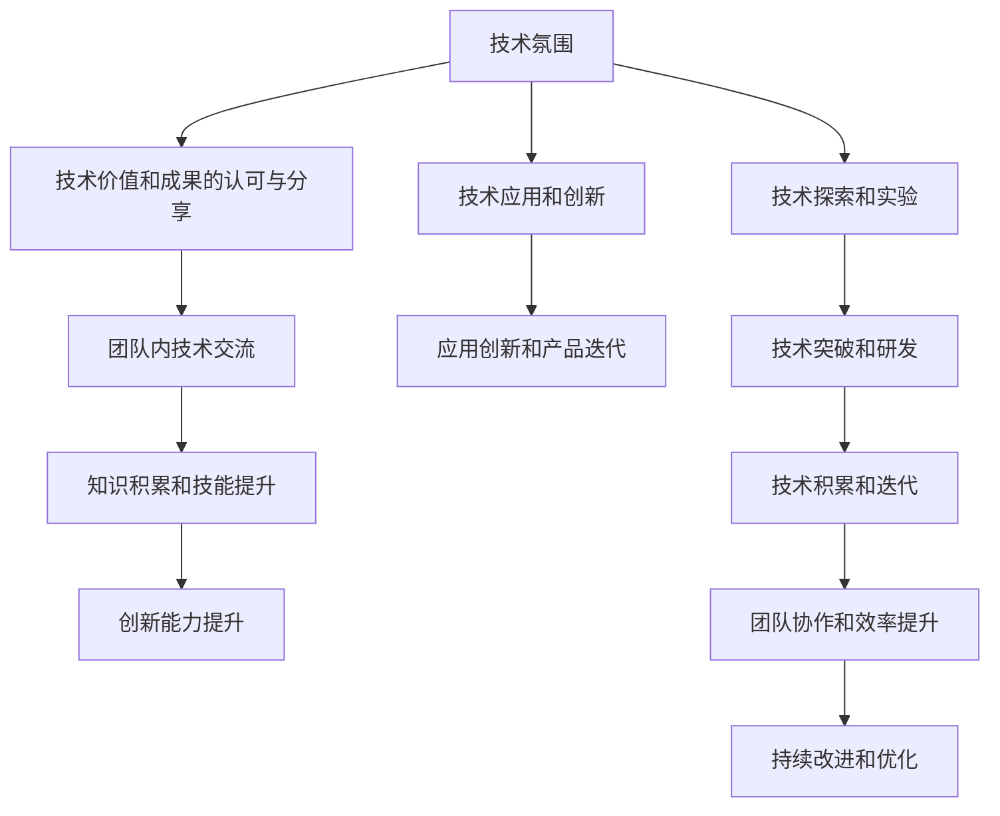

                 

# AI创业公司的技术团队文化建设：技术氛围、学习氛围与创新氛围

> 关键词：AI创业公司,技术团队文化,技术氛围,学习氛围,创新氛围

## 1. 背景介绍

在如今竞争激烈的技术领域，AI创业公司的成功不仅依赖于其产品的创新性，更依赖于其团队的文化建设。技术团队文化，作为AI创业公司的核心资产，不仅直接影响团队的协作效率和工作质量，更是塑造公司品牌和竞争力的关键。本文旨在探讨如何在AI创业公司中构建良好的技术团队文化，聚焦于技术氛围、学习氛围与创新氛围的建设，希望为业内同行提供有价值的参考和借鉴。

## 2. 核心概念与联系

### 2.1 核心概念概述

- **AI创业公司**：指以AI技术为核心的创业企业，致力于利用人工智能解决特定问题或提供智能化服务。
- **技术团队文化**：指AI创业公司技术团队内部的价值观、行为规范、工作习惯、创新氛围等软性因素的总和。
- **技术氛围**：指技术团队在技术探索、应用、创新等方面的整体氛围，强调技术价值和成果的认可和分享。
- **学习氛围**：指技术团队在知识积累、技能提升、技术交流等方面的整体氛围，强调学习精神和知识共享。
- **创新氛围**：指技术团队在技术突破、应用创新、产品迭代等方面的整体氛围，强调创新驱动和持续改进。

这三个氛围的构建，是AI创业公司技术团队文化建设的核心，它们相互促进，共同推动技术团队和公司的健康发展。

### 2.2 核心概念原理和架构的 Mermaid 流程图



这个流程图展示了技术氛围、学习氛围与创新氛围之间的关系和影响路径。技术价值和成果的认可与分享、技术应用和创新、技术探索和实验，共同构成了技术氛围；技术交流、知识积累和技能提升、创新能力提升，共同构成了学习氛围；应用创新和产品迭代、技术突破和研发、团队协作和效率提升，共同构成了创新氛围。三者相辅相成，共同推动技术团队的持续进步。

## 3. 核心算法原理 & 具体操作步骤

### 3.1 算法原理概述

AI创业公司的技术团队文化建设，虽然不涉及具体的算法原理，但其中的技术氛围、学习氛围与创新氛围的构建，实际上是一种多维度、多层次的算法工程。通过合理的设计和管理，可以实现技术团队内部的高效协作、持续学习和不断创新，从而提升团队的整体绩效。

### 3.2 算法步骤详解

构建良好的技术团队文化，需要经历以下关键步骤：

**Step 1: 制定明确的技术愿景和目标**

- 明确公司的技术愿景和目标，确定技术团队的发展方向和具体目标。
- 制定中长期的技术规划，确保技术团队的各项工作围绕既定目标展开。

**Step 2: 设计合理的技术架构和流程**

- 设计合理、灵活的技术架构，确保技术团队的各项工作能够高效协同。
- 制定清晰的技术流程和规范，确保技术团队的工作质量和一致性。

**Step 3: 建立技术交流和分享机制**

- 建立定期的技术分享会议，促进技术团队成员之间的知识交流。
- 建立内部技术博客或论坛，鼓励团队成员分享技术心得和项目经验。

**Step 4: 推动技术创新和应用**

- 鼓励技术团队成员提出技术创新建议，定期评估并实施有价值的创新项目。
- 引入外部技术交流和合作，拓展技术团队的视野和能力。

**Step 5: 培育持续学习和提升的文化**

- 提供定期的技术培训和课程，提升技术团队成员的技能水平。
- 鼓励技术团队成员阅读技术书籍、参加技术研讨会，持续学习最新的技术动态。

### 3.3 算法优缺点

构建良好的技术团队文化，其优点主要体现在：

1. **提升团队凝聚力**：通过共同的技术愿景和目标，技术团队成员更容易形成共同的价值观和行为准则，增强团队凝聚力。
2. **提高工作效率**：合理的技术架构和流程设计，可以提升技术团队的协作效率和工作质量。
3. **促进持续创新**：技术交流和分享机制，可以激发技术团队的创新潜力，推动技术不断突破和进步。
4. **增强竞争力**：持续学习和提升的文化，可以保持技术团队的领先地位，增强公司的竞争优势。

然而，该方法也存在一些缺点：

1. **投入成本高**：技术团队的建设和管理需要投入大量的时间、精力和资源，特别是对于初创公司而言，可能面临资金和人力资源的限制。
2. **需要高水平的管理**：技术团队文化的建设和管理，需要公司高层具备较高的管理能力和技术素养，这对于初创公司的高管团队是一个不小的挑战。
3. **变化适应性不足**：一旦技术团队文化建设完成，可能需要一定时间才能看到明显的效果，且在快速变化的市场环境中，可能难以快速调整和适应。

### 3.4 算法应用领域

构建良好的技术团队文化，不仅仅适用于AI创业公司，对于任何技术导向的公司都具有参考价值。特别是对于那些需要持续创新、技术驱动的公司，如互联网企业、高科技公司等，技术团队文化的建设更是至关重要。

## 4. 数学模型和公式 & 详细讲解 & 举例说明

### 4.1 数学模型构建

技术团队文化的建设，实际上是一种复杂的系统工程，无法用简单的数学模型描述。但为了更好地理解其构建过程，我们可以构建一个简化的数学模型。

假设技术团队由n个成员组成，每个成员的技术水平和创新能力分别为 $x_i$ 和 $y_i$，其中 $i=1,2,\dots,n$。技术团队的整体技术水平和创新能力分别为 $X$ 和 $Y$。则有：

$$
X = \frac{1}{n} \sum_{i=1}^n x_i
$$

$$
Y = \frac{1}{n} \sum_{i=1}^n y_i
$$

技术团队文化建设的目的是提升整体技术水平和创新能力，即最大化 $X$ 和 $Y$。

### 4.2 公式推导过程

通过上述模型，我们可以推导出如下公式：

$$
\max X, Y \Rightarrow \max \frac{1}{n} \sum_{i=1}^n x_i, \frac{1}{n} \sum_{i=1}^n y_i
$$

进一步简化，可以分解为：

$$
\max \sum_{i=1}^n x_i, \sum_{i=1}^n y_i
$$

这意味着，为了最大化技术团队的整体技术水平和创新能力，每个成员的技术水平和创新能力都需要得到提升。而提升的方式，可以通过技术交流、持续学习和推动创新来实现。

### 4.3 案例分析与讲解

假设某AI创业公司技术团队共有10名成员，经过一段时间的文化建设，成员的技术水平和创新能力提升如下：

| 成员编号 | 初始技术水平 | 提升后的技术水平 | 初始创新能力 | 提升后的创新能力 |
|--------|-------------|------------------|------------|------------------|
| 1      | 5           | 7                | 4          | 6                |
| 2      | 4           | 6                | 3          | 5                |
| ...    | ...         | ...              | ...        | ...              |

通过上述公式，我们可以计算出提升后的整体技术水平和创新能力：

$$
X' = \frac{1}{10} (7+6+...+6) = 5.5
$$

$$
Y' = \frac{1}{10} (6+5+...+5) = 4.5
$$

可以看出，通过技术交流、持续学习和推动创新，技术团队的整体技术水平和创新能力都有了显著提升。

## 5. 项目实践：代码实例和详细解释说明

### 5.1 开发环境搭建

为了构建良好的技术团队文化，需要进行系统的开发环境搭建。以下是搭建开发环境的详细步骤：

1. 安装Python：选择最新版本的Python安装，并确保其环境变量配置正确。
2. 安装必要的依赖库：包括numpy、pandas、scikit-learn等常用库。
3. 搭建开发工具：建议使用Jupyter Notebook或PyCharm等IDE进行开发。
4. 配置版本控制系统：如Git，方便团队成员进行代码管理和版本控制。
5. 部署内部代码仓库：如GitHub，用于存储和管理项目代码。

### 5.2 源代码详细实现

下面以技术团队文化建设的代码实现为例，展示如何通过编程方式推动技术交流和创新。

**Step 1: 构建技术交流平台**

首先，需要构建一个技术交流平台，用于团队成员之间的技术分享和交流。可以使用Python的Flask框架，搭建一个简单的Web应用：

```python
from flask import Flask, request, jsonify

app = Flask(__name__)

# 技术分享列表
technical_shares = []

@app.route('/share', methods=['POST'])
def share_technical():
    data = request.json
    share_content = data.get('content')
    share_author = data.get('author')
    technical_shares.append({'share_content': share_content, 'share_author': share_author})
    return jsonify({'message': '技术分享成功！'})

@app.route('/get-sharing-list', methods=['GET'])
def get_sharing_list():
    return jsonify(technical_shares)

if __name__ == '__main__':
    app.run(debug=True)
```

**Step 2: 实现技术交流平台**

其次，需要实现技术交流平台的前端展示和交互。可以使用HTML和JavaScript，配合Flask后端API，构建一个交互式技术交流页面：

```html
<!DOCTYPE html>
<html>
<head>
    <title>技术交流平台</title>
    <script src="https://cdn.jsdelivr.net/npm/axios/dist/axios.min.js"></script>
</head>
<body>
    <h1>技术交流平台</h1>
    <input type="text" id="input-share" placeholder="请输入技术分享内容">
    <button id="btn-share">提交分享</button>
    <ul id="list-shares"></ul>

    <script>
        const shareButton = document.getElementById('btn-share');
        const shareInput = document.getElementById('input-share');
        const listShares = document.getElementById('list-shares');

        shareButton.addEventListener('click', async () => {
            const shareContent = shareInput.value;
            const response = await axios.post('/share', {content: shareContent, author: 'John Doe'});
            const shares = response.data;
            shares.forEach(share => {
                const li = document.createElement('li');
                li.textContent = share.share_content;
                li.style['margin-top'] = '10px';
                listShares.appendChild(li);
            });
            shareInput.value = '';
        });
    </script>
</body>
</html>
```

**Step 3: 推动技术交流和创新**

最后，需要制定规则和激励机制，推动团队成员积极参与技术交流和创新。例如，可以定期评选技术分享优秀者，给予奖金或晋升机会。此外，还可以引入技术创新的KPI考核机制，激励团队成员提出和实施有价值的创新项目。

### 5.3 代码解读与分析

通过上述代码实现，我们可以看到，构建技术交流平台涉及前端和后端多个技术环节，需要团队成员之间的紧密协作。而通过规则和激励机制，可以进一步推动技术交流和创新的积极性。

## 6. 实际应用场景

### 6.1 技术交流平台

构建技术交流平台，可以极大地促进技术团队内部的知识共享和技术交流。例如，在Google，每周一次的Google全员会议（All Hands会议），就是一种典型的技术交流平台，通过现场演讲和直播，让团队成员分享最新的技术进展和项目经验。

### 6.2 技术创新激励

推动技术创新，需要建立明确的激励机制。例如，在Facebook，团队成员可以通过Hackathon、技术黑客周等方式，提出和实施技术创新项目，并根据项目的贡献和影响，获得相应的奖励和认可。

### 6.3 持续学习和培训

持续学习和培训，是提升团队技术水平的重要手段。例如，在微软，公司每年都会组织多次内部培训和技术研讨会，邀请行业专家和技术大牛进行分享，提升团队成员的技能水平。

### 6.4 未来应用展望

未来，随着AI技术的进一步发展，技术团队文化的建设将面临更多的挑战和机遇。通过引入更多的智能化工具和平台，如AI驱动的代码审查、自动化测试、持续集成等，可以进一步提升技术团队的工作效率和创新能力。

## 7. 工具和资源推荐

### 7.1 学习资源推荐

- **Google Developer Education**：提供丰富的Google Cloud和AI开发教程，涵盖从基础到高级的技术知识。
- **TensorFlow官方文档**：提供详尽的TensorFlow开发指南和案例，帮助开发者深入理解AI技术。
- **Deep Learning Specialization**：由Andrew Ng教授主讲的AI深度学习课程，系统讲解深度学习理论和实践。

### 7.2 开发工具推荐

- **Jupyter Notebook**：轻量级的开发环境，支持代码编写、执行和展示。
- **PyCharm**：功能强大的IDE，支持Python开发，提供代码高亮、调试和版本控制等功能。
- **GitHub**：全球最大的代码托管平台，支持版本控制和代码协作。

### 7.3 相关论文推荐

- **The Google AI Innovation Framework**：介绍Google如何通过创新机制和技术交流，推动公司的持续创新。
- **Deep Learning with Google Cloud**：讲解如何使用Google Cloud平台进行AI开发和部署，提升技术团队的效率和能力。
- **Building High-Performance Teams**：提供关于如何构建高效团队和提升团队绩效的实用建议。

## 8. 总结：未来发展趋势与挑战

### 8.1 研究成果总结

通过本文的系统梳理，可以看到，技术团队文化建设是AI创业公司成功的关键因素之一。通过构建良好的技术氛围、学习氛围和创新氛围，可以显著提升技术团队的工作效率和创新能力，推动公司的持续发展。

### 8.2 未来发展趋势

未来，技术团队文化的建设将面临更多的挑战和机遇：

1. **智能化工具普及**：随着AI技术的不断进步，更多智能化工具和平台将被引入技术团队文化建设，进一步提升工作效率和创新能力。
2. **跨领域协作加强**：技术团队文化建设将更加注重跨领域协作和知识整合，推动技术团队的全面发展。
3. **远程办公普及**：随着远程办公模式的普及，技术团队文化建设将更多地依赖于在线协作工具和平台。
4. **数据驱动决策**：通过数据分析和量化评估，技术团队文化建设将更加科学和数据驱动。

### 8.3 面临的挑战

尽管技术团队文化建设有许多优点，但在实际执行中也面临一些挑战：

1. **管理难度增加**：跨地域、跨部门的技术团队文化建设，管理难度更大。
2. **文化和价值观冲突**：不同背景的技术团队成员可能存在文化和价值观的差异，需要寻找共同点，构建统一的文化认同。
3. **资源投入较大**：技术团队文化建设需要投入大量时间和资源，特别是对于初创公司而言，可能面临资金和人力资源的限制。

### 8.4 研究展望

未来的研究需要在以下几个方面寻求新的突破：

1. **智能化技术应用**：引入更多的智能化工具和平台，如自动化代码审查、持续集成等，提升技术团队的工作效率和创新能力。
2. **跨领域协作机制**：建立更加灵活和开放的技术协作机制，促进跨领域知识的整合和共享。
3. **远程办公文化**：构建适应远程办公模式的团队文化，提升团队的协作效率和创新能力。
4. **数据驱动决策**：利用数据分析和量化评估，科学评估技术团队文化建设的绩效和效果，持续优化和改进。

## 9. 附录：常见问题与解答

**Q1: 如何构建良好的技术团队文化？**

A: 构建良好的技术团队文化，需要从以下几个方面入手：
1. **制定明确的技术愿景和目标**：明确公司的技术愿景和目标，确保团队的工作方向和目标一致。
2. **设计合理的技术架构和流程**：设计灵活、高效的技术架构和流程，确保团队的工作质量和一致性。
3. **建立技术交流和分享机制**：定期组织技术分享会议，构建内部技术博客或论坛，鼓励团队成员分享技术心得和项目经验。
4. **推动技术创新和应用**：鼓励团队成员提出技术创新建议，引入外部技术交流和合作，拓展技术团队的视野和能力。
5. **培育持续学习和提升的文化**：提供定期的技术培训和课程，鼓励团队成员阅读技术书籍、参加技术研讨会，持续学习最新的技术动态。

**Q2: 技术团队文化建设有哪些具体的措施？**

A: 技术团队文化建设的具体措施包括：
1. **制定明确的技术愿景和目标**：明确公司的技术愿景和目标，确保团队的工作方向和目标一致。
2. **设计合理的技术架构和流程**：设计灵活、高效的技术架构和流程，确保团队的工作质量和一致性。
3. **建立技术交流和分享机制**：定期组织技术分享会议，构建内部技术博客或论坛，鼓励团队成员分享技术心得和项目经验。
4. **推动技术创新和应用**：鼓励团队成员提出技术创新建议，引入外部技术交流和合作，拓展技术团队的视野和能力。
5. **培育持续学习和提升的文化**：提供定期的技术培训和课程，鼓励团队成员阅读技术书籍、参加技术研讨会，持续学习最新的技术动态。

**Q3: 技术团队文化建设中需要注意哪些问题？**

A: 技术团队文化建设中需要注意的问题包括：
1. **管理难度增加**：跨地域、跨部门的技术团队文化建设，管理难度更大，需要建立科学的管理机制。
2. **文化和价值观冲突**：不同背景的技术团队成员可能存在文化和价值观的差异，需要寻找共同点，构建统一的文化认同。
3. **资源投入较大**：技术团队文化建设需要投入大量时间和资源，特别是对于初创公司而言，可能面临资金和人力资源的限制。

**Q4: 如何推动技术团队文化建设？**

A: 推动技术团队文化建设可以从以下几个方面入手：
1. **制定明确的技术愿景和目标**：明确公司的技术愿景和目标，确保团队的工作方向和目标一致。
2. **设计合理的技术架构和流程**：设计灵活、高效的技术架构和流程，确保团队的工作质量和一致性。
3. **建立技术交流和分享机制**：定期组织技术分享会议，构建内部技术博客或论坛，鼓励团队成员分享技术心得和项目经验。
4. **推动技术创新和应用**：鼓励团队成员提出技术创新建议，引入外部技术交流和合作，拓展技术团队的视野和能力。
5. **培育持续学习和提升的文化**：提供定期的技术培训和课程，鼓励团队成员阅读技术书籍、参加技术研讨会，持续学习最新的技术动态。

**Q5: 如何评估技术团队文化建设的效果？**

A: 评估技术团队文化建设的效果可以从以下几个方面入手：
1. **技术水平和创新能力的提升**：通过定期的技术评估，监测技术团队的整体技术水平和创新能力的变化。
2. **团队协作效率的提升**：通过团队的协作效率指标，评估技术团队文化建设的效果。
3. **员工满意度和参与度**：通过员工满意度调查和参与度评估，了解技术团队文化建设的实际效果。
4. **技术交流和分享的数量和质量**：通过技术交流和分享的数量和质量，评估团队成员的参与度和技术交流效果。
5. **创新项目的数量和影响**：通过创新项目的数量和影响力，评估技术团队文化建设对技术创新的推动作用。

---

作者：禅与计算机程序设计艺术 / Zen and the Art of Computer Programming

