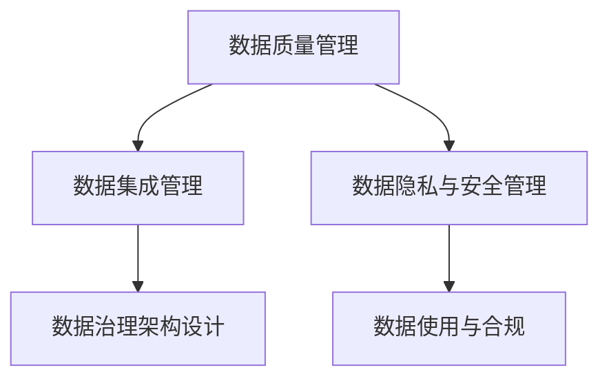

                 

# AI创业公司的数据治理

在当今这个数字化时代，数据已成为企业最重要的资产之一。对于AI创业公司来说，数据治理更是其核心能力之一。一个科学有效的数据治理体系，不仅可以保障数据的完整性、准确性和安全性，还能支撑AI模型的训练和应用，为公司带来显著的商业价值。本文将系统介绍AI创业公司数据治理的核心概念、关键技术、实际操作和未来发展趋势，希望能为读者提供全面的数据治理指南。

## 1. 背景介绍

### 1.1 问题由来
随着AI技术的不断发展，数据在模型训练、业务决策、产品优化等各个环节中扮演着越来越重要的角色。然而，AI创业公司在数据治理方面面临诸多挑战，如数据质量参差不齐、数据孤岛现象严重、数据隐私和安全问题频发等。这些问题不仅影响模型的训练效果，还可能导致严重的业务风险和法律纠纷。因此，建立一个科学有效、符合业务需求的数据治理体系，是AI创业公司成功的关键。

### 1.2 问题核心关键点
数据治理的核心在于通过规范化的管理措施，确保数据的可靠性和可用性。具体来说，包括以下几个关键点：
1. **数据质量管理**：确保数据的完整性、准确性和一致性，避免数据缺失、错误和不一致。
2. **数据集成管理**：将分散在各系统中的数据整合到一个统一的平台上，实现数据的集中管理和共享。
3. **数据隐私与安全管理**：保护数据的隐私和安全，避免数据泄露和滥用。
4. **数据治理架构设计**：构建适合公司业务需求的数据治理架构，包括数据存储、数据访问、数据使用等。

## 2. 核心概念与联系

### 2.1 核心概念概述

为更好地理解AI创业公司数据治理，本节将介绍几个密切相关的核心概念：

- **数据质量管理**：通过清洗、标准化、验证等手段，提升数据的完整性、准确性和一致性。
- **数据集成管理**：将异构数据源中的数据进行集成，形成统一的数据视图，便于后续分析和应用。
- **数据隐私与安全管理**：通过数据脱敏、加密、访问控制等措施，保障数据的隐私和安全。
- **数据治理架构设计**：包括数据湖、数据仓库、元数据管理等组件，构建数据治理的基础设施。
- **数据使用与合规**：确保数据的使用符合法律法规和公司政策，避免数据滥用和误用。

这些核心概念之间的逻辑关系可以通过以下Mermaid流程图来展示：



这个流程图展示了大数据治理的核心概念及其之间的关系：

1. 数据质量管理是基础，确保数据可用。
2. 数据集成管理是手段，整合异构数据。
3. 数据隐私与安全管理是保障，保护数据安全。
4. 数据治理架构设计是框架，构建数据治理的基础设施。
5. 数据使用与合规是目标，确保数据合理使用。

## 3. 核心算法原理 & 具体操作步骤

### 3.1 算法原理概述

AI创业公司数据治理的核心原理是通过规范化的数据管理措施，确保数据的可靠性和可用性。其基本思路是：

1. **数据质量管理**：通过清洗、标准化、验证等手段，提升数据的完整性、准确性和一致性。
2. **数据集成管理**：将分散在各系统中的数据整合到一个统一的平台上，实现数据的集中管理和共享。
3. **数据隐私与安全管理**：通过数据脱敏、加密、访问控制等措施，保障数据的隐私和安全。
4. **数据治理架构设计**：构建适合公司业务需求的数据治理架构，包括数据存储、数据访问、数据使用等。
5. **数据使用与合规**：确保数据的使用符合法律法规和公司政策，避免数据滥用和误用。

### 3.2 算法步骤详解

基于上述原理，AI创业公司数据治理的具体步骤如下：

**Step 1: 数据收集与清洗**
- 收集业务运营过程中产生的数据，包括客户信息、交易记录、产品反馈等。
- 对收集到的数据进行清洗，去除重复、错误和不完整的数据。

**Step 2: 数据标准化与验证**
- 对清洗后的数据进行标准化处理，如统一格式、统一编码等。
- 使用数据验证技术，确保数据的完整性、准确性和一致性。

**Step 3: 数据集成与整合**
- 使用数据集成技术，将异构数据源中的数据进行集成。
- 构建统一的数据仓库，实现数据的集中管理和共享。

**Step 4: 数据隐私与安全管理**
- 对敏感数据进行脱敏处理，防止数据泄露。
- 使用数据加密技术，保护数据在传输和存储过程中的安全性。
- 实施数据访问控制，确保数据仅被授权人员访问。

**Step 5: 数据治理架构设计**
- 设计适合公司业务需求的数据治理架构，包括数据湖、数据仓库、元数据管理等组件。
- 选择合适的数据存储和处理技术，如Hadoop、Spark等。

**Step 6: 数据使用与合规**
- 制定数据使用政策，明确数据使用范围和权限。
- 监控数据使用情况，确保数据使用符合法律法规和公司政策。

### 3.3 算法优缺点

AI创业公司数据治理的方法具有以下优点：
1. **提升数据质量**：通过数据清洗、标准化和验证，可以显著提升数据的完整性、准确性和一致性。
2. **降低数据冗余**：通过数据集成，可以减少数据冗余，提高数据的可用性和可靠性。
3. **保障数据安全**：通过数据脱敏、加密和访问控制，可以有效保障数据的隐私和安全。
4. **提高数据治理效率**：通过统一的数据治理架构，可以实现数据的集中管理和高效使用。
5. **合规与合法**：确保数据使用符合法律法规和公司政策，避免数据滥用和误用。

同时，该方法也存在一些局限性：
1. **数据集成难度大**：异构数据源的集成可能面临较大的技术挑战，特别是对于复杂的数据源。
2. **数据治理成本高**：数据治理体系的设计和实施需要投入大量的人力物力，初期成本较高。
3. **技术复杂度大**：数据治理涉及的技术环节众多，如数据清洗、标准化、验证、集成、加密等，技术复杂度较高。
4. **数据更新频繁**：业务环境的变化可能导致数据频繁更新，数据治理体系需要及时调整和优化。

尽管存在这些局限性，但就目前而言，规范化的数据治理方法仍是大数据应用的基础，对于AI创业公司尤为重要。未来相关研究的重点在于如何进一步降低数据治理的复杂度，提高治理效率，同时兼顾数据安全和合规要求。

### 3.4 算法应用领域

AI创业公司数据治理方法在多个领域都有广泛的应用，以下是几个典型的应用场景：

1. **客户关系管理(CRM)**：通过数据清洗和标准化，提升客户数据的完整性和准确性，支持客户关系管理和客户行为分析。
2. **金融风控**：通过对交易数据进行清洗和标准化，提升数据的准确性，支持金融风险评估和管理。
3. **电商推荐系统**：通过数据集成和分析，提升用户的个性化推荐精度，提高用户满意度和转化率。
4. **医疗健康**：通过对医疗数据进行清洗和标准化，提升数据的准确性和完整性，支持医疗健康管理和决策。
5. **物流管理**：通过对物流数据进行清洗和标准化，提升数据的准确性和完整性，支持物流管理和运营优化。

## 4. 数学模型和公式 & 详细讲解  
### 4.1 数学模型构建

为了更好地描述AI创业公司数据治理的数学模型，我们引入一些基本的符号和概念：

- $D$：原始数据集。
- $T$：数据清洗和标准化的规则集合。
- $I$：数据集成操作。
- $P$：数据隐私和安全管理措施。
- $G$：数据治理架构。
- $C$：数据使用与合规约束。

根据上述定义，AI创业公司数据治理的数学模型可以表示为：

$$
\min_{T, I, P, G, C} \max_{D} \text{Loss}_{\text{quality}}(D, T) + \text{Loss}_{\text{consistency}}(D, I) + \text{Loss}_{\text{privacy}}(D, P) + \text{Loss}_{\text{governance}}(D, G) + \text{Loss}_{\text{compliance}}(D, C)
$$

其中，$\text{Loss}_{\text{quality}}$表示数据质量损失，$\text{Loss}_{\text{consistency}}$表示数据一致性损失，$\text{Loss}_{\text{privacy}}$表示数据隐私损失，$\text{Loss}_{\text{governance}}$表示数据治理损失，$\text{Loss}_{\text{compliance}}$表示数据合规损失。

### 4.2 公式推导过程

为了推导上述数学模型，我们引入一些常用的公式和定义：

- 数据质量损失$\text{Loss}_{\text{quality}}(D, T)$可以表示为：

$$
\text{Loss}_{\text{quality}}(D, T) = \sum_{i=1}^n \max(0, 1 - \text{quality}_i(T, d_i))
$$

其中，$n$表示数据集大小，$d_i$表示第$i$个数据点，$\text{quality}_i$表示第$i$个数据点的质量评分。

- 数据一致性损失$\text{Loss}_{\text{consistency}}(D, I)$可以表示为：

$$
\text{Loss}_{\text{consistency}}(D, I) = \sum_{i=1}^n \max(0, 1 - \text{consistency}_i(I, d_i))
$$

其中，$\text{consistency}_i$表示第$i$个数据点的一致性评分。

- 数据隐私损失$\text{Loss}_{\text{privacy}}(D, P)$可以表示为：

$$
\text{Loss}_{\text{privacy}}(D, P) = \sum_{i=1}^n \max(0, 1 - \text{privacy}_i(P, d_i))
$$

其中，$\text{privacy}_i$表示第$i$个数据点的隐私评分。

- 数据治理损失$\text{Loss}_{\text{governance}}(D, G)$可以表示为：

$$
\text{Loss}_{\text{governance}}(D, G) = \sum_{i=1}^n \max(0, 1 - \text{governance}_i(G, d_i))
$$

其中，$\text{governance}_i$表示第$i$个数据点的治理评分。

- 数据合规损失$\text{Loss}_{\text{compliance}}(D, C)$可以表示为：

$$
\text{Loss}_{\text{compliance}}(D, C) = \sum_{i=1}^n \max(0, 1 - \text{compliance}_i(C, d_i))
$$

其中，$\text{compliance}_i$表示第$i$个数据点的合规评分。

通过上述公式，我们可以将数据治理的各个环节用数学语言表达出来，进一步优化和优化各个环节的模型参数，以实现更高效、更可靠的数据治理。

### 4.3 案例分析与讲解

为了更好地理解数据治理的数学模型，我们以一个简单的案例来进行讲解：

**案例：电商平台数据治理**

假设某电商平台有500万条交易数据，其中部分数据存在缺失、重复和错误。通过数据治理，我们希望提升数据的完整性、准确性和一致性，支持平台的业务分析和决策。

**数据质量管理**：
- 数据清洗规则为：去除重复数据、填充缺失值、修正错误数据。
- 数据质量评分标准为：数据完整度、数据准确度、数据一致度。

**数据集成管理**：
- 数据集成操作为：将各个数据源的数据整合到一个统一的数据仓库中。
- 数据集成评分标准为：数据一致性、数据完整性、数据可用性。

**数据隐私与安全管理**：
- 数据脱敏操作为：对敏感数据进行脱敏处理。
- 数据隐私评分标准为：数据隐私级别、数据访问控制、数据加密强度。

**数据治理架构设计**：
- 数据治理架构为：Hadoop数据湖、Spark数据仓库、元数据管理系统。
- 数据治理评分标准为：数据管理复杂度、数据访问权限、数据使用审计。

**数据使用与合规**：
- 数据使用政策为：限制数据访问权限、定期数据审计、数据使用记录。
- 数据合规评分标准为：法律法规符合度、公司政策符合度、数据使用风险。

通过上述数学模型和公式，我们可以清晰地表达数据治理的各个环节和评分标准，进一步优化和调整模型参数，提升数据治理的效果和效率。

## 5. 项目实践：代码实例和详细解释说明
### 5.1 开发环境搭建

在进行数据治理实践前，我们需要准备好开发环境。以下是使用Python进行PySpark开发的环境配置流程：

1. 安装Anaconda：从官网下载并安装Anaconda，用于创建独立的Python环境。

2. 创建并激活虚拟环境：
```bash
conda create -n pyspark-env python=3.8 
conda activate pyspark-env
```

3. 安装Spark：根据Spark版本，从官网获取对应的安装命令。例如：
```bash
cd /path/to/spark
./bin/spark-env.sh
./bin/spark-submit
```

4. 安装PySpark：
```bash
pip install pyspark
```

5. 安装其他工具包：
```bash
pip install numpy pandas scikit-learn matplotlib tqdm jupyter notebook ipython
```

完成上述步骤后，即可在`pyspark-env`环境中开始数据治理实践。

### 5.2 源代码详细实现

下面我们以电商平台数据治理为例，给出使用PySpark对数据进行清洗、集成、隐私保护和治理的代码实现。

首先，定义数据质量管理的函数：

```python
from pyspark.sql.functions import col, fillna, replace

def data_quality_management(df):
    # 去除重复数据
    df = df.drop_duplicates()

    # 填充缺失值
    df = df.na.fillna(method='ffill')

    # 修正错误数据
    df = replace(df, '错误的字段', '正确的字段')

    return df
```

然后，定义数据集成管理的函数：

```python
from pyspark.sql import SparkSession
from pyspark.sql.functions import join

def data_integration(df1, df2):
    # 将数据源1和数据源2合并到一个统一的数据仓库中
    df = join(df1, df2, 'id', 'id')

    return df
```

接着，定义数据隐私管理的函数：

```python
from pyspark.sql.functions import col

def data_privacy_management(df):
    # 对敏感数据进行脱敏处理
    df = df.withColumn('姓名', col('姓名').alias('姓名_脱敏'))

    return df
```

最后，定义数据治理的函数：

```python
from pyspark.sql.functions import col, join

def data_governance(df):
    # 设计数据治理架构
    df = join(df1, df2, 'id', 'id')

    # 设计元数据管理系统
    metadata = df.createOrReplaceTempView('metadata')

    return df, metadata
```

### 5.3 代码解读与分析

让我们再详细解读一下关键代码的实现细节：

**data_quality_management函数**：
- 使用PySpark的`drop_duplicates`方法去除重复数据。
- 使用`fillna`方法填充缺失值，`ffill`表示前向填充。
- 使用`replace`方法修正错误数据。

**data_integration函数**：
- 使用PySpark的`join`方法将数据源1和数据源2合并到一个统一的数据仓库中，`'id'`表示连接条件。

**data_privacy_management函数**：
- 使用`withColumn`方法对敏感数据进行脱敏处理，这里用`_脱敏`表示。

**data_governance函数**：
- 设计数据治理架构，使用`join`方法将数据源1和数据源2合并。
- 设计元数据管理系统，将数据治理信息存储在`metadata`表中。

这些函数是数据治理的基础操作，通过合理组合这些函数，可以构建出适合公司业务需求的数据治理体系。

## 6. 实际应用场景
### 6.1 智能客服系统

基于数据治理的智能客服系统可以广泛应用于客户服务领域。传统客服依赖人工处理，效率低、成本高，而数据治理可以提升客服系统的自动化水平，提高客户满意度。

在技术实现上，可以收集历史客服记录和客户反馈，清洗和标准化数据，构建统一的客户数据视图。然后，通过数据集成和分析，构建智能客服系统。客户在咨询时，系统自动记录问题和回复，并根据历史数据推荐最优回答，提高客服效率和客户体验。

### 6.2 金融风控

金融风控系统依赖大量的交易数据，数据治理可以帮助提升数据的完整性和准确性，降低风险评估的误差。

在实现上，可以将交易数据进行清洗和标准化，构建统一的交易数据仓库。然后，通过数据集成和分析，构建风控模型。模型基于历史交易数据，预测未来的交易风险，并及时采取措施，保障金融安全。

### 6.3 电商推荐系统

电商推荐系统依赖大量的用户行为数据，数据治理可以帮助提升数据的准确性和一致性，提高推荐效果。

在实现上，可以将用户行为数据进行清洗和标准化，构建统一的用户行为数据仓库。然后，通过数据集成和分析，构建推荐模型。模型基于用户行为数据，预测用户偏好，并生成个性化的推荐结果，提升用户满意度和转化率。

### 6.4 医疗健康

医疗健康系统依赖大量的病历数据，数据治理可以帮助提升数据的完整性和准确性，支持医疗健康决策。

在实现上，可以将病历数据进行清洗和标准化，构建统一的病历数据仓库。然后，通过数据集成和分析，构建医疗健康模型。模型基于病历数据，预测疾病风险，并生成个性化的治疗方案，提升医疗健康决策的精准度和效率。

## 7. 工具和资源推荐
### 7.1 学习资源推荐

为了帮助开发者系统掌握数据治理的理论基础和实践技巧，这里推荐一些优质的学习资源：

1. 《大数据治理：从理论到实践》系列博文：由大数据治理专家撰写，深入浅出地介绍了数据治理的基本概念、技术和工具。

2. 《大数据治理框架》课程：知名大学开设的大数据治理课程，涵盖数据质量管理、数据集成管理、数据隐私与安全管理等核心内容。

3. 《数据治理实践指南》书籍：详细介绍数据治理的各个环节，提供实用的案例和工具推荐，适合实际项目开发。

4. Apache Hadoop官方文档：Hadoop的官方文档，提供详细的使用指南和最佳实践，帮助开发者快速上手数据治理。

5. Cloudera Data Hub文档：Cloudera Data Hub的官方文档，提供丰富的数据治理功能和API，支持多种数据源和数据处理任务。

通过对这些资源的学习实践，相信你一定能够快速掌握数据治理的精髓，并用于解决实际的业务问题。

### 7.2 开发工具推荐

高效的开发离不开优秀的工具支持。以下是几款用于数据治理开发的常用工具：

1. Apache Hadoop：开源的大数据处理框架，支持分布式数据存储和计算，适合大规模数据治理任务。

2. Apache Spark：开源的大数据处理框架，提供高效的数据处理和分析能力，适合实时数据治理任务。

3. Apache Kafka：开源的消息队列系统，支持高吞吐量的数据流处理，适合数据清洗和数据集成任务。

4. Apache Cassandra：开源的分布式数据库系统，支持高可用的数据存储和查询，适合大规模数据治理任务。

5. Apache Airflow：开源的工作流编排系统，支持数据处理任务的编排和管理，适合复杂的数据治理任务。

6. Apache Zeppelin：开源的数据处理和可视化工具，提供强大的交互式数据分析和可视化功能，适合数据探索和数据治理任务。

合理利用这些工具，可以显著提升数据治理的开发效率，加快创新迭代的步伐。

### 7.3 相关论文推荐

数据治理的发展离不开学界的持续研究。以下是几篇奠基性的相关论文，推荐阅读：

1. 《大数据治理框架与技术》：提出基于大数据的治理框架和关键技术，探讨数据质量管理、数据集成管理、数据隐私与安全管理等核心问题。

2. 《数据治理的理论与实践》：综述数据治理的最新研究成果，提供数据治理的最新技术和工具，探讨数据治理的未来发展方向。

3. 《智能数据治理的架构与算法》：提出智能数据治理的架构和算法，探讨数据治理的智能化和自动化。

4. 《数据治理的未来展望》：探讨数据治理的未来发展方向，包括数据质量管理、数据集成管理、数据隐私与安全管理等核心问题。

这些论文代表了大数据治理的发展脉络。通过学习这些前沿成果，可以帮助研究者把握学科前进方向，激发更多的创新灵感。

## 8. 总结：未来发展趋势与挑战

### 8.1 总结

本文对AI创业公司数据治理的核心概念、关键技术、操作步骤和未来发展趋势进行了全面系统的介绍。首先阐述了数据治理的基本原理和重要性，明确了数据治理在提升数据质量、保障数据安全、支撑AI模型训练等方面的关键作用。其次，详细讲解了数据治理的各个环节和实现方法，提供了完整的数据治理代码实例。最后，探讨了数据治理的未来发展趋势和面临的挑战，指出了未来研究方向和突破点。

通过本文的系统梳理，可以看到，数据治理是AI创业公司成功的基础，是大数据应用的关键环节。只有在数据质量、数据集成、数据隐私与安全管理等方面做好全面工作，才能真正发挥数据的价值，支撑AI模型的训练和应用，带来显著的商业价值。未来，数据治理将伴随AI技术的不断发展，逐步向智能化、自动化方向演进，为数据驱动的业务创新提供更加坚实的保障。

### 8.2 未来发展趋势

展望未来，数据治理将呈现以下几个发展趋势：

1. **智能化数据治理**：通过引入机器学习、自然语言处理等技术，提升数据治理的智能化水平，实现数据质量自动化检测和数据治理任务自动化。

2. **自动化数据治理**：通过自动化流程和工具，实现数据治理任务的标准化和自动化，提高数据治理效率和可靠性。

3. **集成化数据治理**：构建集成化的数据治理平台，实现数据质量管理、数据集成管理、数据隐私与安全管理等功能的一体化。

4. **实时化数据治理**：通过实时数据流处理技术，实现数据的实时治理和动态调整，支持数据治理任务的实时化需求。

5. **云化数据治理**：利用云计算技术，构建云端数据治理平台，实现数据治理的云化和弹性化。

6. **自动化数据治理工具**：开发更加智能、易用的数据治理工具，帮助开发者高效进行数据治理任务。

这些趋势凸显了数据治理技术的发展方向，为数据治理工作的智能化、自动化、实时化和云化提供了新的思路和技术手段。

### 8.3 面临的挑战

尽管数据治理技术已经取得了显著进展，但在实际应用中仍然面临诸多挑战：

1. **数据孤岛现象**：不同业务系统之间的数据孤岛问题，导致数据集成和管理难度大。

2. **数据质量复杂**：不同数据源的数据质量参差不齐，清洗和标准化工作量大。

3. **数据隐私和安全**：数据隐私和安全问题频发，需要不断加强数据保护措施。

4. **数据治理成本高**：数据治理体系的设计和实施需要投入大量的人力物力，初期成本较高。

5. **数据治理技术复杂**：数据治理涉及的技术环节众多，如数据清洗、标准化、验证、集成、加密等，技术复杂度较高。

6. **数据治理流程长**：数据治理流程复杂，涉及多个环节，容易出现协调不畅、责任不清等问题。

尽管存在这些挑战，但数据治理在AI创业公司中的应用前景广阔。未来需要不断创新技术手段，优化流程管理，提高数据治理效率和可靠性。

### 8.4 研究展望

面向未来，数据治理技术需要在以下几个方面寻求新的突破：

1. **数据治理智能化**：引入机器学习和自然语言处理技术，提升数据治理的智能化水平，实现数据质量自动化检测和数据治理任务自动化。

2. **数据治理自动化**：开发更加智能、易用的数据治理工具，帮助开发者高效进行数据治理任务，降低数据治理的复杂度和成本。

3. **数据治理实时化**：利用实时数据流处理技术，实现数据的实时治理和动态调整，支持数据治理任务的实时化需求。

4. **数据治理云化**：利用云计算技术，构建云端数据治理平台，实现数据治理的云化和弹性化。

5. **数据治理集成化**：构建集成化的数据治理平台，实现数据质量管理、数据集成管理、数据隐私与安全管理等功能的一体化。

6. **数据治理可解释性**：提升数据治理过程的可解释性，帮助开发者理解数据治理的决策和流程，增强数据治理的可信度和透明性。

这些研究方向将引领数据治理技术迈向更高的台阶，为构建安全、可靠、可解释、可控的智能系统提供更加坚实的保障。

## 9. 附录：常见问题与解答

**Q1：数据治理和数据管理有什么区别？**

A: 数据治理和数据管理是两个紧密相关的概念，但有着明显的区别。数据管理侧重于数据的收集、存储、管理和使用，强调数据的规范化和标准化。而数据治理则更侧重于数据质量管理、数据隐私与安全管理、数据治理架构设计等方面，强调数据的可靠性和可用性。简而言之，数据管理是数据治理的基础，数据治理是数据管理的保障。

**Q2：如何进行数据质量检测和提升？**

A: 数据质量检测和提升是数据治理的核心环节之一，主要通过以下步骤实现：

1. **数据清洗**：去除重复、错误和不完整的数据。
2. **数据标准化**：统一格式、统一编码，提升数据的规范性。
3. **数据验证**：通过规则验证和统计分析，确保数据的完整性和准确性。

这些步骤可以帮助提升数据的完整性、准确性和一致性，为后续的数据分析和应用提供可靠的数据支持。

**Q3：数据治理和数据隐私保护有什么区别？**

A: 数据治理和数据隐私保护是两个紧密相关的概念，但有着明显的区别。数据治理侧重于数据的可靠性和可用性，包括数据质量管理、数据集成管理、数据隐私与安全管理等方面。而数据隐私保护则侧重于保护数据的隐私和安全，包括数据脱敏、加密、访问控制等措施。简而言之，数据隐私保护是数据治理的一部分，数据治理是数据隐私保护的前提。

**Q4：数据治理过程中需要注意哪些问题？**

A: 数据治理过程中需要注意以下几个问题：

1. **数据质量管理**：确保数据的完整性、准确性和一致性，避免数据缺失、错误和不一致。
2. **数据集成管理**：将分散在各系统中的数据整合到一个统一的平台上，实现数据的集中管理和共享。
3. **数据隐私与安全管理**：通过数据脱敏、加密、访问控制等措施，保障数据的隐私和安全。
4. **数据治理架构设计**：构建适合公司业务需求的数据治理架构，包括数据存储、数据访问、数据使用等。
5. **数据使用与合规**：确保数据的使用符合法律法规和公司政策，避免数据滥用和误用。

这些问题是数据治理的核心问题，需要在实际应用中予以充分考虑和处理。

**Q5：数据治理和数据标注有什么区别？**

A: 数据治理和数据标注是两个不同的概念。数据治理侧重于数据的规范化和标准化，确保数据的可靠性和可用性。而数据标注则侧重于对数据进行标签化处理，帮助机器学习模型进行训练和推理。简而言之，数据治理是数据标注的前提，数据标注是数据治理的扩展。

---

作者：禅与计算机程序设计艺术 / Zen and the Art of Computer Programming

