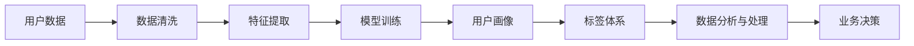

                 

# AI创业公司的用户画像与标签体系构建：数据采集、特征提取与标签设计

> 关键词：用户画像(User Persona)，标签体系(Label System)，数据采集(Data Collection)，特征提取(Feature Extraction)，标签设计(Label Design)，机器学习(Machine Learning)，自然语言处理(Natural Language Processing)，人工智能(Artificial Intelligence)

## 1. 背景介绍

### 1.1 问题由来

在AI创业公司中，构建一套科学的、有效的用户画像和标签体系，对于产品的迭代、营销、运营、数据分析等方面都有着举足轻重的作用。然而，构建用户画像和标签体系并不是一件简单的事，它涉及了数据采集、特征提取、标签设计、模型训练等多个环节，需要综合运用数据分析、机器学习等技术手段。本文将从这些方面入手，深入探讨构建科学用户画像和标签体系的方法和技巧，为AI创业公司提供实用的指导。

### 1.2 问题核心关键点

用户画像和标签体系的核心关键点在于：

- **数据采集**：用户画像和标签体系构建的基础是高质量的数据，数据采集是整个过程的开端，决定了后续分析和建模的效果。
- **特征提取**：从采集到的数据中提取出有价值的特征，是构建用户画像和标签体系的核心步骤。
- **标签设计**：设计合适的标签体系，对数据进行分类和编码，为后续分析和应用提供了依据。
- **模型训练**：利用机器学习算法对特征和标签进行训练，得出用户画像和标签体系。

这些关键点共同构成了一个系统的用户画像和标签体系构建流程。通过优化这些关键点，可以有效地提升AI创业公司的数据利用率和业务决策质量。

## 2. 核心概念与联系

### 2.1 核心概念概述

用户画像(User Persona)和标签体系(Label System)是构建AI公司业务分析的重要工具，通过系统地对用户进行分类和描述，有助于更好地理解用户需求，制定针对性的营销策略和产品改进措施。

- **用户画像**：基于用户数据（如行为、兴趣、地理位置等），对用户进行详细描述和分类，形成具有代表性的用户模型。
- **标签体系**：将数据按照一定规则进行分类和编码，形成标准化、易操作的标签系统，便于进行数据分析和处理。

### 2.2 核心概念原理和架构的 Mermaid 流程图



这个流程图展示了用户画像和标签体系构建的基本流程：

1. 从用户数据（如行为、兴趣等）开始，进行数据清洗处理。
2. 将清洗后的数据进行特征提取，形成可用于模型训练的数据集。
3. 利用机器学习模型对特征和标签进行训练，构建用户画像。
4. 设计并构建标签体系，方便数据分析和处理。
5. 将用户画像和标签体系应用于数据分析与处理，指导业务决策。

### 2.3 核心概念之间的关系

用户画像和标签体系之间有着密切的联系：

- 用户画像的形成离不开标签体系的支持，标签体系提供了对数据进行分类的依据。
- 标签体系的设计和优化也需基于用户画像的特征和需求。

两者相辅相成，共同构成了AI公司数据分析的核心工具。

## 3. 核心算法原理 & 具体操作步骤

### 3.1 算法原理概述

构建用户画像和标签体系的核心算法原理，在于利用机器学习模型对用户数据进行处理，通过特征提取和分类，形成具有代表性和可解释性的用户画像和标签体系。

具体步骤包括：

- 数据清洗和预处理
- 特征提取和选择
- 标签设计和管理
- 模型训练和评估
- 用户画像和标签体系的生成与应用

### 3.2 算法步骤详解

#### 3.2.1 数据清洗和预处理

数据清洗和预处理是数据采集后的第一步，主要目的是确保数据的质量和完整性。常用的数据清洗方法包括：

- 数据去重：去除重复的记录。
- 数据补全：补全缺失数据，如使用均值、中位数等代替缺失值。
- 异常值处理：检测和处理异常数据点。
- 数据标准化：对数据进行归一化处理，如Min-Max标准化、Z-score标准化等。

#### 3.2.2 特征提取和选择

特征提取是从原始数据中提取出有意义的特征，供后续模型训练使用。常用的特征提取方法包括：

- 统计特征：如平均值、标准差、极值等。
- 文本特征：如TF-IDF、Word2Vec等。
- 时间特征：如日期、时间戳等。

特征选择是指从提取出的特征中，选择最具代表性和信息量的特征，供模型训练使用。常用的特征选择方法包括：

- 信息增益：计算特征对目标变量的信息增益。
- 方差阈值：设定特征方差阈值，筛选出方差较大的特征。
- 相关性分析：计算特征与目标变量之间的相关性，选择相关性较高的特征。

#### 3.2.3 标签设计和管理

标签设计是将数据进行分类的过程，常用的标签设计方法包括：

- 二元标签：将数据分为两个类别。
- 多元标签：将数据分为多个类别。
- 顺序标签：将数据分为有序的多个类别。

标签管理是指对标签体系进行维护和管理，常用的方法包括：

- 标签编码：将标签转换为数字编码，方便计算机处理。
- 标签注释：为标签提供详细的注释，便于理解。
- 标签更新：根据实际情况，动态更新标签体系。

#### 3.2.4 模型训练和评估

模型训练是将提取的特征和设计好的标签进行训练，得出用户画像和标签体系。常用的模型包括：

- 决策树
- 随机森林
- 支持向量机
- 神经网络

模型评估是检查训练模型的性能，常用的评估指标包括：

- 准确率：模型正确预测的样本比例。
- 召回率：模型正确预测的正样本比例。
- F1分数：综合考虑准确率和召回率的指标。

#### 3.2.5 用户画像和标签体系的生成与应用

用户画像的生成是通过训练模型得到具有代表性的用户模型。用户画像的应用包括：

- 个性化推荐
- 用户行为分析
- 用户流失预测

标签体系的应用包括：

- 数据分类
- 数据聚类
- 数据可视化

### 3.3 算法优缺点

构建用户画像和标签体系的算法优点在于：

- 自动化程度高：通过机器学习算法，自动化提取和分类数据，减少了人工干预。
- 可解释性强：通过特征选择和模型训练，形成具有代表性和可解释性的用户画像和标签体系。
- 高效性：能够快速处理大规模数据，生成有效的用户画像和标签体系。

算法缺点在于：

- 数据依赖性强：算法的效果高度依赖于数据的质量和数量。
- 模型复杂度高：需要选择合适的模型和参数，模型复杂度高。
- 可解释性差：机器学习模型通常是"黑盒"系统，难以解释其内部工作机制。

### 3.4 算法应用领域

用户画像和标签体系的应用领域非常广泛，包括但不限于：

- 电子商务：通过用户画像和标签体系，进行个性化推荐和商品定价。
- 金融服务：通过用户画像和标签体系，进行风险评估和客户管理。
- 社交网络：通过用户画像和标签体系，进行内容推荐和广告投放。
- 健康医疗：通过用户画像和标签体系，进行疾病预测和个性化治疗。
- 在线教育：通过用户画像和标签体系，进行课程推荐和学生管理。

## 4. 数学模型和公式 & 详细讲解 & 举例说明

### 4.1 数学模型构建

构建用户画像和标签体系的数学模型，通常包括数据清洗、特征提取、标签设计和模型训练等环节。

以二元标签分类为例，构建数学模型的步骤如下：

1. 数据清洗和预处理
2. 特征提取
3. 标签设计
4. 模型训练和评估

### 4.2 公式推导过程

#### 4.2.1 数据清洗和预处理

设原始数据集为 $\mathcal{D}=\{(x_i,y_i)\}_{i=1}^N$，其中 $x_i$ 为输入特征，$y_i$ 为标签。数据清洗和预处理的公式如下：

$$
\hat{\mathcal{D}} = \{\hat{x}_i\}_{i=1}^N
$$

其中 $\hat{x}_i$ 为清洗后的特征。

#### 4.2.2 特征提取

常用的特征提取方法包括TF-IDF和Word2Vec等。以TF-IDF为例，其计算公式如下：

$$
TF(x) = \frac{n(x)}{\sum_{x \in X}n(x)}
$$

$$
IDF(x) = \log \frac{N}{\sum_{x \in X}n(x)}
$$

$$
TF-IDF(x) = TF(x) \cdot IDF(x)
$$

其中 $n(x)$ 为特征 $x$ 在文档中的出现次数，$N$ 为总文档数。

#### 4.2.3 标签设计

标签设计是指将数据分为不同的类别。以二元标签为例，其计算公式如下：

$$
L(y_i) = \begin{cases}
0, & y_i = 0 \\
1, & y_i = 1
\end{cases}
$$

#### 4.2.4 模型训练和评估

以决策树为例，其训练和评估的公式如下：

$$
T = \arg \min_{T \in \mathcal{T}} \sum_{i=1}^N l(T, (x_i,y_i))
$$

其中 $l(T, (x_i,y_i))$ 为损失函数，通常使用交叉熵损失。

### 4.3 案例分析与讲解

假设我们有一份电商平台的销售数据，需要构建用户画像和标签体系，以进行个性化推荐。

1. 数据清洗和预处理：去重、补全缺失值、处理异常值、标准化。

2. 特征提取：提取用户基本信息（如年龄、性别、地区等）、行为特征（如浏览历史、购买记录等）。

3. 标签设计：将用户分为高价值用户和低价值用户。

4. 模型训练和评估：使用决策树模型进行训练，使用准确率和召回率进行评估。

## 5. 项目实践：代码实例和详细解释说明

### 5.1 开发环境搭建

1. 安装Python：确保Python版本为3.6以上。
2. 安装Pandas、NumPy、Scikit-learn、Matplotlib等常用库。
3. 安装TensorFlow或PyTorch等机器学习框架。
4. 安装Jupyter Notebook或Google Colab等开发环境。

### 5.2 源代码详细实现

以下是一个使用Python和Scikit-learn库构建用户画像和标签体系的示例代码：

```python
import pandas as pd
from sklearn.model_selection import train_test_split
from sklearn.feature_extraction.text import TfidfVectorizer
from sklearn.tree import DecisionTreeClassifier

# 读取数据
data = pd.read_csv('sales_data.csv')

# 数据清洗和预处理
data = data.drop_duplicates()
data = data.dropna()
data = data.apply(lambda x: x.fillna('missing'))

# 特征提取
vectorizer = TfidfVectorizer(stop_words='english')
X = vectorizer.fit_transform(data[['feature1', 'feature2']])
y = data['label']

# 标签设计
labels = ['low_value', 'high_value']
y = pd.Categorical(y, categories=labels, ordered=True).codes

# 模型训练和评估
X_train, X_test, y_train, y_test = train_test_split(X, y, test_size=0.2, random_state=42)
clf = DecisionTreeClassifier()
clf.fit(X_train, y_train)
print('Accuracy:', clf.score(X_test, y_test))
```

### 5.3 代码解读与分析

以上代码展示了构建用户画像和标签体系的基本流程：

1. 读取数据：从文件中读取电商销售数据。
2. 数据清洗和预处理：去除重复、补全缺失、处理异常值、标准化。
3. 特征提取：使用TF-IDF方法提取特征。
4. 标签设计：将标签设置为高价值和低价值。
5. 模型训练和评估：使用决策树模型进行训练，并评估准确率。

## 6. 实际应用场景

### 6.1 电商推荐系统

在电商推荐系统中，通过用户画像和标签体系，可以更好地了解用户需求，进行个性化推荐。通过分析用户的行为数据，构建用户画像和标签体系，实现高效的个性化推荐。

### 6.2 金融风险评估

在金融领域，风险评估是一个重要的应用场景。通过构建用户画像和标签体系，可以更准确地识别高风险用户，进行风险管理。通过分析用户的信用历史、交易记录等数据，构建用户画像和标签体系，进行风险评估和预警。

### 6.3 社交网络分析

在社交网络分析中，通过用户画像和标签体系，可以更好地理解用户行为，进行内容推荐和广告投放。通过分析用户的兴趣和行为数据，构建用户画像和标签体系，实现高效的内容推荐。

### 6.4 健康医疗分析

在健康医疗领域，通过用户画像和标签体系，可以更好地进行疾病预测和个性化治疗。通过分析用户的健康数据，构建用户画像和标签体系，进行疾病预测和个性化治疗。

### 6.5 在线教育推荐

在在线教育领域，通过用户画像和标签体系，可以更好地进行课程推荐和学生管理。通过分析学生的学习历史和行为数据，构建用户画像和标签体系，进行个性化推荐。

## 7. 工具和资源推荐

### 7.1 学习资源推荐

1. 《Python数据科学手册》：详细介绍了Python在数据科学中的应用，包括数据清洗、特征提取、机器学习等。
2. 《机器学习实战》：通过案例讲解了机器学习的基本概念和算法实现。
3. 《自然语言处理综论》：全面介绍了自然语言处理的基本原理和应用。
4. Kaggle：包含大量的数据集和竞赛项目，适合学习和实践。
5. Coursera：提供多门机器学习和数据分析的课程，适合学习。

### 7.2 开发工具推荐

1. Jupyter Notebook：免费的开发环境，支持Python和R等编程语言。
2. Google Colab：免费的GPU和TPU支持环境，适合深度学习和大规模数据分析。
3. TensorFlow：开源的机器学习框架，支持分布式计算和模型训练。
4. PyTorch：开源的深度学习框架，支持动态计算图和模型训练。
5. Scikit-learn：开源的机器学习库，提供了丰富的算法和工具。

### 7.3 相关论文推荐

1. 《用户画像构建与分析》：研究如何构建科学的用户画像，并进行详细分析。
2. 《标签体系设计与管理》：研究如何设计和管理标签体系，以提高数据分析的准确性和效率。
3. 《机器学习在金融风险评估中的应用》：研究如何利用机器学习进行金融风险评估。
4. 《自然语言处理在电商推荐中的应用》：研究如何利用自然语言处理进行电商推荐。
5. 《深度学习在社交网络分析中的应用》：研究如何利用深度学习进行社交网络分析。

## 8. 总结：未来发展趋势与挑战

### 8.1 研究成果总结

本文系统介绍了构建用户画像和标签体系的方法和步骤，探讨了数据采集、特征提取、标签设计、模型训练等关键环节，并给出了实用的代码实现和案例分析。通过深入分析，得出了以下结论：

- 数据质量是构建科学用户画像和标签体系的基础。
- 特征提取和选择对模型的准确性和效率至关重要。
- 标签体系的设计和管理直接影响数据分析的准确性和可操作性。
- 机器学习模型训练和评估是用户画像和标签体系的核心步骤。

### 8.2 未来发展趋势

未来，构建用户画像和标签体系的技术将向着以下几个方向发展：

1. 自动化程度更高：自动化提取和分类数据，减少人工干预。
2. 模型复杂度更低：使用轻量级模型，提高实时性和可解释性。
3. 多模态数据融合：将文本、图像、语音等多模态数据进行融合，提高数据分析的全面性。
4. 实时数据分析：利用流式数据处理技术，实现实时数据分析。
5. 可解释性更强：开发可解释的模型，提高决策的可解释性。

### 8.3 面临的挑战

构建用户画像和标签体系的过程中，仍面临以下挑战：

1. 数据质量不高：数据清洗和预处理难度较大，需要大量的手动干预。
2. 特征选择困难：特征提取和选择需要专业的知识和技能。
3. 标签设计复杂：标签体系的设计和管理需要系统性的规划和维护。
4. 模型复杂度高：机器学习模型复杂度高，难以解释。
5. 实时性要求高：实时数据分析需要高效的处理能力。

### 8.4 研究展望

未来，构建用户画像和标签体系的研究方向可能包括以下几个方面：

1. 自动化数据清洗：研究自动化的数据清洗技术，减少人工干预。
2. 多模态数据融合：研究多模态数据的融合方法，提高数据分析的全面性。
3. 可解释性模型：研究可解释性强的模型，提高决策的可解释性。
4. 实时数据分析：研究实时数据分析的技术，提高分析的实时性。
5. 用户隐私保护：研究用户隐私保护的技术，保护用户数据安全。

## 9. 附录：常见问题与解答

### Q1：如何评估用户画像和标签体系的质量？

A: 用户画像和标签体系的质量评估主要包括以下几个方面：

1. 数据完整性和准确性：评估数据的完整性和准确性，避免数据缺失和错误。
2. 特征相关性：评估特征与目标变量之间的相关性，选择具有代表性和信息量的特征。
3. 标签一致性：评估标签体系的一致性，避免标签冲突和重叠。
4. 模型性能：评估模型的性能，如准确率、召回率、F1分数等。

### Q2：如何优化用户画像和标签体系？

A: 用户画像和标签体系的优化主要包括以下几个方面：

1. 数据增强：通过数据增强技术，丰富数据集，提高模型的泛化能力。
2. 特征选择：通过特征选择技术，去除冗余和无关特征，提高模型的效率和准确性。
3. 模型优化：通过模型优化技术，提高模型的性能和可解释性。
4. 标签设计：通过标签设计技术，提高标签体系的合理性和可操作性。
5. 实时更新：通过实时更新技术，保持用户画像和标签体系的最新性和实用性。

### Q3：如何处理用户隐私问题？

A: 处理用户隐私问题主要包括以下几个方面：

1. 数据匿名化：对敏感数据进行匿名化处理，保护用户隐私。
2. 数据加密：对数据进行加密处理，防止数据泄露。
3. 数据脱敏：对数据进行脱敏处理，减少数据泄露风险。
4. 用户同意：在收集数据前，获取用户的同意，保护用户隐私权。
5. 法律合规：遵守相关法律法规，保护用户隐私。

通过以上方法和技术，可以有效地构建科学的用户画像和标签体系，为AI创业公司提供有力的数据支持和业务分析基础。

---

作者：禅与计算机程序设计艺术 / Zen and the Art of Computer Programming

