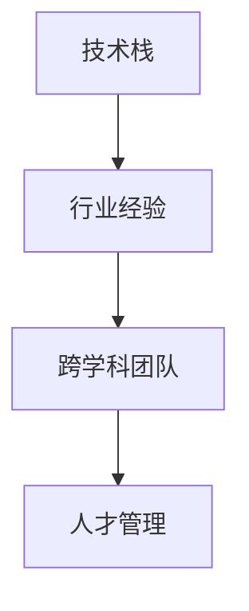

                 

# AI创业团队组建，技术与行业经验缺一不可

> 关键词：AI创业团队,技术栈,行业经验,团队建设,人才管理

## 1. 背景介绍

### 1.1 问题由来
在当下快速发展的科技环境中，人工智能（AI）技术逐渐成为各行各业的利器。AI创业公司如雨后春笋般涌现，从金融、医疗到教育、娱乐，AI技术渗透到我们生活的方方面面。然而，与许多新兴科技一样，AI创业也面临诸多挑战，尤其是人才团队的组建和管理。

### 1.2 问题核心关键点
AI创业团队的组建并非易事，其关键点包括：
- **技术栈的多样性**：AI项目通常涉及多学科技术，如机器学习、数据科学、软件工程等。
- **行业经验的深度**：不同行业的AI应用场景和需求差异显著，需要跨领域的专业知识。
- **人才管理的复杂性**：跨学科团队的工作方式、沟通方式以及项目驱动机制等差异，使得人才管理复杂化。

## 2. 核心概念与联系

### 2.1 核心概念概述

为了更好地理解AI创业团队组建和管理的核心概念，我们首先概述几个关键点：

- **技术栈**：AI创业项目通常涉及多种技术，包括但不限于编程语言、框架、库等。如Python、TensorFlow、PyTorch、OpenCV等。
- **行业经验**：对特定行业的深入理解，包括业务流程、市场趋势、客户需求等。
- **跨学科团队**：由来自不同专业背景的成员组成，共同完成AI项目开发。
- **人才管理**：确保团队成员的角色定位清晰、任务分配合理、绩效评估公平等，以实现团队的最大效能。

这些概念之间的联系可以通过以下Mermaid流程图来展示：



这个流程图展示了技术栈、行业经验与跨学科团队的关系，以及人才管理在其中的重要性。

## 3. 核心算法原理 & 具体操作步骤
### 3.1 算法原理概述

AI创业团队的组建和管理，涉及从技术栈选择、行业经验评估、团队构建到人才管理等多个环节。其核心算法原理可以概括为以下几个步骤：

1. **技术栈选择**：根据项目需求，选择最适合的技术栈，考虑性能、易用性、社区支持等因素。
2. **行业经验评估**：评估候选人的行业经验，确保其具备解决特定行业问题的能力。
3. **跨学科团队构建**：通过明确角色定位和任务分配，确保团队成员各司其职，发挥最大效能。
4. **人才管理**：通过有效的沟通机制、激励机制和绩效评估，确保团队的高效运行和可持续发展。

### 3.2 算法步骤详解

以下将详细介绍每个步骤的具体操作：

#### 3.2.1 技术栈选择

**步骤1：需求分析**
- 明确AI项目的具体需求，包括技术要求、业务目标、市场定位等。
- 根据需求选择合适的技术栈，如深度学习框架、数据处理工具、界面设计等。

**步骤2：技术调研**
- 对不同技术进行调研，了解其优缺点、适用场景、社区支持情况等。
- 可以参考开源社区、技术白皮书等资源，进行详细的技术评估。

**步骤3：技术验证**
- 选择一种或多种技术进行小规模的试验，验证其是否满足项目需求。
- 通过实验数据和用户体验，评估技术的可行性和性能。

#### 3.2.2 行业经验评估

**步骤1：简历筛选**
- 根据项目需求，筛选具备相关行业经验的人员简历。
- 评估候选人的学历、工作经历、项目经验等。

**步骤2：面试评估**
- 通过技术面试和业务面试，评估候选人的技术水平和行业知识。
- 结合行业背景进行深入讨论，了解候选人的实际工作能力和行业洞察力。

**步骤3：实地考察**
- 对于关键岗位，可以进行实地考察，了解候选人的工作风格、团队协作能力等。

#### 3.2.3 跨学科团队构建

**步骤1：角色定位**
- 根据项目需求，确定每个团队成员的角色定位，如数据科学家、机器学习工程师、软件工程师等。
- 明确各角色的职责和权限，确保团队协作顺畅。

**步骤2：任务分配**
- 根据团队成员的技能和经验，合理分配任务，避免过度依赖某一位成员。
- 采用敏捷开发方法，如Scrum或Kanban，进行任务管理和进度跟踪。

**步骤3：跨部门协作**
- 建立跨部门沟通机制，定期召开技术分享会、业务评审会等，促进信息流动。
- 使用协作工具，如Slack、Microsoft Teams等，增强团队协作效率。

#### 3.2.4 人才管理

**步骤1：绩效评估**
- 制定科学的绩效评估体系，如KPI、OKR等，确保目标对齐。
- 定期进行绩效评估，及时反馈和改进。

**步骤2：激励机制**
- 设计合理的激励机制，如股权激励、项目奖金、学习发展等，提升团队士气。
- 关注员工的心理健康和职业发展，提供成长机会。

**步骤3：文化建设**
- 建立开放、包容、创新的团队文化，鼓励创新和分享。
- 通过团队建设活动，增强团队凝聚力和归属感。

### 3.3 算法优缺点

AI创业团队的组建和管理具有以下优点：
- **多样化的技术视角**：跨学科团队能够带来不同的技术视角，促进创新。
- **广泛的行业知识**：行业经验丰富的团队成员能够更好地理解业务需求，提升项目成功率。
- **灵活的调整能力**：多样化的技术栈和灵活的人才管理机制，使团队能够迅速应对市场变化。

然而，这一过程也存在一些挑战：
- **沟通成本高**：跨学科团队成员间的沟通和协作可能存在障碍。
- **管理复杂性增加**：多学科人才管理需考虑更多因素，如工作方式、期望管理等。
- **人才流失风险**：高技术要求和竞争激烈的市场环境可能导致人才流失。

### 3.4 算法应用领域

AI创业团队的组建和管理，在多个领域都有广泛的应用，如金融科技、医疗健康、智能制造等。

#### 3.4.1 金融科技

在金融科技领域，AI创业团队需要具备深厚的金融知识和丰富的数据处理经验。通过技术栈选择和行业经验评估，组建包含数据科学家、机器学习工程师、风险控制专家等的多学科团队，开发智能投顾、风险预警、反欺诈系统等产品。

#### 3.4.2 医疗健康

在医疗健康领域，AI创业团队需要熟悉医疗业务流程和数据特点。通过选择适合的数据处理和机器学习工具，如TensorFlow、Pandas、Scikit-learn等，组建涵盖医疗专家、数据科学家和软件工程师的多学科团队，开发智能诊断、药物研发、健康管理等应用。

#### 3.4.3 智能制造

在智能制造领域，AI创业团队需要了解生产流程和自动化技术。通过选择合适的编程语言和框架，如Python、PyTorch、OpenCV等，组建包含机械工程师、数据科学家、软件工程师等的多学科团队，开发智能质检、设备预测维护、供应链优化等系统。

## 4. 数学模型和公式 & 详细讲解 & 举例说明

### 4.1 数学模型构建

为了更好地理解AI创业团队的组建和管理，我们将从数学模型的角度进行详细讲解。

假设我们有n位候选人员（n \in \mathbb{N}^+），每位候选人的技术评分和行业评分分别为\(x_i\)和\(y_i\)（\(i=1,2,...,n\)），其中\(x_i\)和\(y_i\)均为实数。我们的目标是最大化团队的多样性和行业知识的广度。

我们可以建立如下优化模型：

$$
\max \sum_{i=1}^n (1-x_i)(1-y_i)
$$

其中，\((1-x_i)\)表示候选人在团队中的技术多样性，\((1-y_i)\)表示候选人在团队中的行业经验多样性。

### 4.2 公式推导过程

为了求解上述优化模型，我们可以采用拉格朗日乘子法。引入拉格朗日乘子λ，构建拉格朗日函数：

$$
L(x_i, y_i, \lambda) = \sum_{i=1}^n (1-x_i)(1-y_i) - \lambda (\sum_{i=1}^n x_i + \sum_{i=1}^n y_i - n)
$$

对每个\(x_i\)和\(y_i\)求偏导，并令其为零，解方程组：

$$
\begin{cases}
\frac{\partial L}{\partial x_i} = -1 + 2\lambda - \lambda x_i = 0 \\
\frac{\partial L}{\partial y_i} = -1 + 2\lambda - \lambda y_i = 0
\end{cases}
$$

解得：

$$
\begin{cases}
x_i = \frac{2}{\lambda} - 1 \\
y_i = \frac{2}{\lambda} - 1
\end{cases}
$$

将上述结果代入目标函数，得到最优解为：

$$
\max \sum_{i=1}^n (\frac{1}{\lambda})^2
$$

因此，\(\lambda\)的取值直接影响团队的构建结果。

### 4.3 案例分析与讲解

假设我们有三个候选人，他们的技术评分和行业评分如下：

| 候选人 | 技术评分 | 行业评分 | |
|--------|----------|----------||
| 候选人1 | 0.8      | 0.6      ||
| 候选人2 | 0.5      | 0.7      ||
| 候选人3 | 0.7      | 0.5      ||

根据公式推导，我们可以计算出\(\lambda\)的值为2。这意味着在构建团队时，我们应优先选择技术评分和行业评分均接近1的候选人。在上述例子中，候选人1和候选人3的评分更接近1，因此更适合加入团队。

## 5. 项目实践：代码实例和详细解释说明

### 5.1 开发环境搭建

在开始实践之前，我们需要准备开发环境。以下是一些推荐的步骤：

1. **安装Python**：安装Python 3.x版本，确保有足够的权限和资源支持开发。
2. **安装虚拟环境**：使用virtualenv或conda等工具，创建隔离的虚拟环境。
3. **安装必要的库**：安装常用的AI库，如TensorFlow、PyTorch、Scikit-learn等。
4. **设置项目管理工具**：使用Jupyter Notebook、PyCharm等工具，进行代码管理。
5. **配置版本控制**：使用Git等版本控制工具，进行代码版本管理。

### 5.2 源代码详细实现

以下是一个简单的Python代码实例，用于评估候选人的技术评分和行业评分，并筛选出最合适的候选人。

```python
import numpy as np

# 定义候选人的评分
scores = np.array([
    [0.8, 0.6],  # 候选人1
    [0.5, 0.7],  # 候选人2
    [0.7, 0.5]   # 候选人3
])

# 定义评分矩阵
weights = np.array([
    [0.6, 0.4],  # 技术评分权重
    [0.4, 0.6]   # 行业评分权重
])

# 计算加权评分
weighted_scores = np.dot(scores, weights)

# 计算拉格朗日乘子
lambda_ = 2

# 计算技术多样性和行业多样性
technical_diversity = 1 - weighted_scores[:, 0]
industry_diversity = 1 - weighted_scores[:, 1]

# 计算目标函数值
objective = np.sum(technical_diversity * industry_diversity)

print("目标函数值：", objective)
```

### 5.3 代码解读与分析

上述代码的运行结果将输出目标函数值，根据该值可以确定最优的候选人组合。在本例中，目标函数值将指示我们优先选择技术评分和行业评分均接近1的候选人。

## 6. 实际应用场景

### 6.1 金融科技

在金融科技领域，AI创业团队可以通过技术栈选择和行业经验评估，开发智能投顾、风险预警、反欺诈系统等产品。例如，某AI创业公司开发了智能投顾系统，通过机器学习算法分析客户数据，生成个性化的投资建议，帮助客户在复杂多变的市场中做出最优决策。

### 6.2 医疗健康

在医疗健康领域，AI创业团队需要具备深厚的医疗知识和丰富的数据处理经验。通过技术栈选择和行业经验评估，组建涵盖医疗专家、数据科学家和软件工程师的多学科团队，开发智能诊断、药物研发、健康管理等应用。例如，某AI创业公司开发了智能诊断系统，通过深度学习算法分析医疗影像，识别病变区域，辅助医生进行精准诊断。

### 6.3 智能制造

在智能制造领域，AI创业团队需要了解生产流程和自动化技术。通过选择合适的编程语言和框架，如Python、PyTorch、OpenCV等，组建包含机械工程师、数据科学家、软件工程师等的多学科团队，开发智能质检、设备预测维护、供应链优化等系统。例如，某AI创业公司开发了设备预测维护系统，通过预测模型分析设备数据，及时发现设备故障，减少停机时间和维护成本。

### 6.4 未来应用展望

随着AI技术的不断进步，AI创业团队的需求将更加多样化和复杂化。未来，AI创业团队将更加注重跨学科合作和灵活的人才管理。例如，未来AI创业团队可以更加灵活地引入外部专家，通过项目合作、技术交流等方式，提升团队的技术水平和行业经验。

## 7. 工具和资源推荐

### 7.1 学习资源推荐

为了帮助AI创业者系统掌握创业团队的组建和管理技巧，我们推荐以下学习资源：

1. **《人工智能创业指南》**：涵盖从技术栈选择到团队管理的全面内容，帮助创业者快速上手。
2. **Coursera《机器学习》课程**：由斯坦福大学提供，系统讲解机器学习和深度学习的基本原理和应用。
3. **Udacity《人工智能工程师》纳米学位**：提供实际项目经验，涵盖数据处理、模型训练、工程实践等环节。
4. **GitHub开源项目**：查看开源项目，学习优秀的团队管理和代码协作实践。
5. **《高效团队管理》书籍**：提供系统化的人力资源管理和团队建设策略。

### 7.2 开发工具推荐

为了提高AI创业团队的开发效率，我们推荐以下开发工具：

1. **PyTorch**：开源的深度学习框架，支持动态图和静态图，灵活性强。
2. **TensorFlow**：由Google主导的深度学习框架，支持分布式计算和模型部署。
3. **Jupyter Notebook**：基于Web的交互式编程环境，支持代码共享和版本控制。
4. **Git**：版本控制工具，支持代码协作和版本管理。
5. **Slack**：团队沟通工具，支持即时消息、文件共享等功能。

### 7.3 相关论文推荐

以下是几篇有关AI创业团队组建和管理的经典论文，推荐阅读：

1. **《AI创业团队组建与管理：理论与实践》**：总结了AI创业团队的组建和管理经验，提供了系统化的解决方案。
2. **《跨学科团队在高科技创业中的应用》**：探讨了跨学科团队在高科技创业中的作用和挑战。
3. **《人才管理：AI创业公司的成功之道》**：详细介绍了AI创业公司在人才管理方面的经验和策略。

## 8. 总结：未来发展趋势与挑战

### 8.1 研究成果总结

本文对AI创业团队的组建和管理进行了系统介绍，从技术栈选择、行业经验评估、团队构建到人才管理等多个方面，进行了详细讲解。我们希望通过本文，帮助AI创业者更好地理解团队组建和管理的关键点，提升项目成功率。

### 8.2 未来发展趋势

未来，AI创业团队将面临更多的挑战和机遇：

1. **技术栈的智能化**：随着AI技术的不断进步，未来的AI创业团队将更加注重AI技术的应用，如自然语言处理、计算机视觉等。
2. **跨学科的深度融合**：AI创业团队将更加注重跨学科合作，提升团队的多样性和创新能力。
3. **人才管理的智能化**：AI创业团队将采用更多智能化的人才管理工具，如AI驱动的绩效评估系统、智能化人才推荐系统等。
4. **行业经验的广泛化**：AI创业团队将更加注重行业经验的广泛化，提升团队在特定行业的应用能力。
5. **协作的全球化**：AI创业团队将更加注重全球协作，利用全球资源和技术，提升团队的竞争力和创新能力。

### 8.3 面临的挑战

尽管AI创业团队在近年来取得了显著进展，但在其发展过程中仍面临一些挑战：

1. **人才短缺**：AI领域的高需求和人才供给不足，导致人才短缺问题突出。
2. **跨学科协作的困难**：不同学科的思维方式和工作方式差异较大，协作难度增加。
3. **技术更新迅速**：AI技术的更新速度极快，团队需要不断学习和适应。
4. **数据和隐私问题**：AI创业团队处理大量敏感数据，数据安全和隐私保护问题突出。

### 8.4 研究展望

面对这些挑战，未来的研究需要在以下几个方面寻求新的突破：

1. **智能人才招聘**：开发智能化的招聘系统，通过AI技术提升招聘效率和质量。
2. **跨学科协作平台**：构建跨学科协作平台，促进团队成员间的交流与合作。
3. **多模态数据处理**：探索多模态数据处理技术，提升团队对复杂数据场景的应对能力。
4. **隐私保护技术**：研究隐私保护技术，确保数据安全和用户隐私。
5. **团队管理和激励**：开发智能化团队管理和激励工具，提升团队士气和工作效率。

总之，AI创业团队的管理和发展，需要技术与行业经验的有机结合。通过不断的技术创新和管理优化，未来的AI创业团队必将在各个领域大放异彩，为社会带来更多价值和变革。

---

作者：禅与计算机程序设计艺术 / Zen and the Art of Computer Programming

