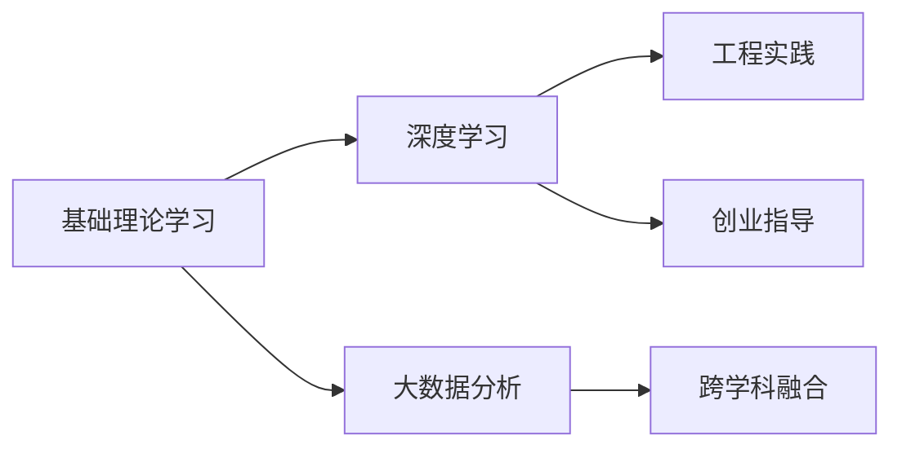

                 

# AI创业的人才培养：Lepton AI的教育计划

> 关键词：人工智能,人才培养,Lepton AI,教育计划,机器学习,深度学习,大数据,工程实践,创业指导

## 1. 背景介绍

### 1.1 问题由来
在当今这个信息爆炸的时代，人工智能(AI)技术正在以前所未有的速度发展。无论是自动驾驶、智能推荐系统、医疗诊断，还是金融风险控制，AI技术的应用无所不在，为企业和创新者创造了巨大的价值。然而，尽管AI技术取得了如此多的成功，但行业人才的短缺仍是其发展的主要瓶颈之一。据统计，AI人才需求缺口高达数百万人，预计未来数年内这种缺口将进一步扩大。

为了解决这一问题，Lepton AI提出了一个系统性的教育计划，旨在培养具备扎实AI知识、高效工程实践能力以及创新创业精神的人才。该计划涵盖了从基础理论到工程实践的全方位教育内容，旨在培养一批既能够深入理解AI技术，又具备实际工程能力的优秀AI人才，从而为AI创业项目提供强大的人才支持。

### 1.2 问题核心关键点
Lepton AI教育计划的核心理念是通过系统化的课程设计、实践项目、以及创业指导，全面提升学生的AI知识和工程实践能力。该计划的目标是培养出能够深入理解AI理论，并将其应用于实际工程问题解决的复合型人才，为AI创业项目提供高素质的开发和运营团队。

为了实现这一目标，Lepton AI教育计划包括以下几个关键点：

1. **基础理论学习**：涵盖机器学习、深度学习、大数据分析等核心课程。
2. **工程实践项目**：通过实际工程项目，让学生在动手实践中掌握AI技术的应用。
3. **创业指导与实战**：邀请业内专家分享创业经验，提供项目孵化与运营指导。
4. **跨学科融合**：结合计算机科学、统计学、数学等学科，培养学生的跨学科思维。

## 2. 核心概念与联系

### 2.1 核心概念概述

Lepton AI教育计划的核心概念包括：

- **机器学习**：通过算法自动学习数据特征，实现对数据的分类、回归、聚类等任务。
- **深度学习**：一种特殊类型的机器学习，通过多层神经网络，学习和提取数据的高层次特征。
- **大数据分析**：通过处理海量数据，揭示数据中的规律和趋势，用于决策支持、风险控制等。
- **工程实践**：将理论知识应用于实际问题解决，强调项目管理和软件工程能力。
- **创业指导**：提供从项目规划、市场分析到团队管理等全方位的创业支持。

这些核心概念之间的关系可以通过以下Mermaid流程图来展示：



这个流程图展示了Lepton AI教育计划的核心概念及其之间的关系：

1. 基础理论学习是深度学习和数据分析的基础。
2. 深度学习和大数据分析是工程实践的核心内容。
3. 工程实践和创业指导共同构成AI创业项目的关键支撑。
4. 跨学科融合为学生提供了更全面的知识体系和思维能力。

## 3. 核心算法原理 & 具体操作步骤

### 3.1 算法原理概述

Lepton AI教育计划的算法原理主要基于机器学习和深度学习理论，通过理论学习与实践项目的结合，培养学生的AI工程能力。以下是Lepton AI教育计划的核心算法原理概述：

1. **监督学习**：通过标注数据，训练模型进行分类或回归任务。
2. **无监督学习**：从数据中挖掘潜在模式，无需标注数据。
3. **半监督学习**：结合少量标注数据和大量未标注数据，提升模型性能。
4. **强化学习**：通过与环境的交互，优化决策策略。
5. **迁移学习**：将在一个任务上学到的知识迁移到另一个任务中。

### 3.2 算法步骤详解

Lepton AI教育计划的算法步骤主要包括理论学习、实践项目、创业指导和跨学科融合四个方面：

**Step 1: 基础理论学习**
- 开设机器学习、深度学习、大数据分析等核心课程，系统讲解算法原理、数据预处理、模型选择、评估指标等。
- 通过案例分析、项目实践等方式，加深学生对理论知识的理解。

**Step 2: 工程实践项目**
- 设计多个工程实践项目，涵盖自然语言处理、计算机视觉、推荐系统等方向。
- 学生需完成项目需求分析、设计、实现、测试、部署等全流程。
- 项目结束后，需撰写项目报告，进行项目展示和答辩。

**Step 3: 创业指导**
- 邀请业内专家分享创业经验，涵盖项目规划、市场分析、团队管理等方面。
- 提供创业项目孵化空间和资源，帮助学生进行项目孵化。
- 组织创业竞赛和路演，提供实战锻炼机会。

**Step 4: 跨学科融合**
- 开设跨学科选修课，如统计学、运筹学、心理学等，培养学生的综合素质。
- 鼓励学生参加学术交流和科研活动，拓展视野。
- 提供选修课程的学分激励机制，鼓励学生积极选修。

### 3.3 算法优缺点

Lepton AI教育计划有以下优点：

1. **全面覆盖**：涵盖理论学习、工程实践、创业指导、跨学科融合等多方面内容，全面提升学生能力。
2. **实践导向**：强调项目实践，通过实际项目提升学生解决实际问题的能力。
3. **创业支持**：提供全方位的创业指导和资源支持，帮助学生将理论知识应用于实际创业项目。
4. **跨学科融合**：培养学生的跨学科思维，提升综合素质。

同时，该计划也存在以下局限：

1. **时间成本**：课程内容和实践项目量较大，需要投入较多时间和精力。
2. **资源需求**：需要丰富的硬件和软件资源，以及优秀的教师团队。
3. **个性化不足**：课程设置较为固定，难以满足每个学生的个性化需求。

尽管存在这些局限，Lepton AI教育计划仍致力于为AI创业项目培养优秀人才，通过持续优化，逐步提升教育效果。

### 3.4 算法应用领域

Lepton AI教育计划的应用领域广泛，涵盖了AI创业项目的各个环节，包括但不限于：

1. **技术研发**：包括算法研究、模型优化、系统开发等。
2. **产品设计**：涵盖用户体验、界面设计、交互设计等。
3. **市场推广**：涉及市场调研、用户分析、渠道拓展等。
4. **运营管理**：包括项目管理、资源调配、团队协作等。

## 4. 数学模型和公式 & 详细讲解 & 举例说明

### 4.1 数学模型构建

Lepton AI教育计划的理论学习部分主要围绕以下几个数学模型进行构建：

1. **线性回归模型**：用于处理连续型变量的回归问题。
2. **决策树模型**：通过树形结构进行分类或回归。
3. **随机森林模型**：基于多个决策树的集成，提升模型性能。
4. **卷积神经网络(CNN)**：用于图像识别和处理。
5. **循环神经网络(RNN)**：用于序列数据的处理，如语音识别、文本生成等。

### 4.2 公式推导过程

以线性回归模型为例，其公式推导过程如下：

设样本数据集为 $\{(x_i, y_i)\}_{i=1}^N$，其中 $x_i \in \mathbb{R}^d$ 为输入特征向量，$y_i \in \mathbb{R}$ 为输出值。线性回归模型的目标是通过最小化损失函数来拟合数据，损失函数为：

$$
J(\theta) = \frac{1}{2N} \sum_{i=1}^N (y_i - \theta^T x_i)^2
$$

其中 $\theta \in \mathbb{R}^d$ 为模型参数，$x_i$ 为输入特征向量，$y_i$ 为输出值。

为了求解 $\theta$，我们通过梯度下降算法来最小化损失函数：

$$
\theta_{k+1} = \theta_k - \alpha \nabla_{\theta} J(\theta_k)
$$

其中 $\alpha$ 为学习率。

### 4.3 案例分析与讲解

以图像分类任务为例，介绍Lepton AI教育计划中的工程实践项目。

项目目标：通过卷积神经网络(CNN)模型，实现对手写数字图像的分类。项目分为数据预处理、模型训练、模型评估和部署等步骤。

- **数据预处理**：收集手写数字图像数据集，进行数据增强、归一化等预处理操作。
- **模型训练**：设计CNN模型架构，设置超参数，进行模型训练。
- **模型评估**：在测试集上评估模型性能，计算准确率、召回率等指标。
- **模型部署**：将训练好的模型部署到服务器上，实现实时图像分类。

## 5. 项目实践：代码实例和详细解释说明

### 5.1 开发环境搭建

Lepton AI教育计划采用Python作为主要编程语言，依赖于TensorFlow、Keras、Scikit-Learn等开源框架。以下是开发环境搭建的步骤：

1. 安装Python：从官网下载并安装最新版本的Python，建议选择Python 3.8以上版本。
2. 安装依赖包：使用pip工具安装TensorFlow、Keras、Scikit-Learn等库。
3. 设置虚拟环境：使用虚拟环境工具venv或conda创建虚拟环境，避免依赖冲突。
4. 安装Git：使用Git版本控制系统进行代码管理。
5. 安装IDE：安装Python IDE，如PyCharm、Jupyter Notebook等，方便开发和调试。

### 5.2 源代码详细实现

以下是一个简单的线性回归模型实现代码示例：

```python
import numpy as np
from sklearn.linear_model import LinearRegression
from sklearn.metrics import mean_squared_error

# 数据集
X = np.array([[1], [2], [3], [4], [5]])
y = np.array([1, 2, 3, 4, 5])

# 线性回归模型
model = LinearRegression()

# 训练模型
model.fit(X, y)

# 预测
y_pred = model.predict(X)

# 评估
mse = mean_squared_error(y, y_pred)
print("MSE:", mse)
```

### 5.3 代码解读与分析

- **数据准备**：创建输入特征向量 `X` 和输出值 `y`。
- **模型初始化**：使用Scikit-Learn库中的 `LinearRegression` 类初始化模型。
- **模型训练**：调用 `fit` 方法，传入训练数据，训练模型。
- **模型预测**：调用 `predict` 方法，传入测试数据，进行预测。
- **模型评估**：使用均方误差 `mean_squared_error` 评估模型性能。

## 6. 实际应用场景

### 6.1 智能推荐系统

Lepton AI教育计划涵盖的工程实践项目中，智能推荐系统是一个重要的应用场景。智能推荐系统通过分析用户行为数据，预测用户可能感兴趣的内容，为用户推荐个性化信息，提升用户体验和满意度。

项目目标：设计并实现一个基于协同过滤算法的推荐系统。项目分为数据清洗、模型训练、推荐引擎实现等步骤。

- **数据清洗**：收集用户行为数据，进行数据预处理和特征工程。
- **模型训练**：使用协同过滤算法，训练推荐模型。
- **推荐引擎实现**：开发推荐引擎，实现对用户的实时推荐。

### 6.2 智能客服系统

智能客服系统通过AI技术，为用户提供7x24小时不间断的自动化客服服务。通过语音识别、自然语言处理等技术，实现与用户的自然交互。

项目目标：开发一个基于NLP的智能客服系统。项目分为语音识别、意图识别、对话生成等模块的实现。

- **语音识别**：使用语音识别技术，将用户语音转换为文本。
- **意图识别**：使用意图识别模型，分析用户意图，确定需要解决的问题。
- **对话生成**：使用生成模型，生成回复文本，并发送到用户端。

### 6.3 医疗诊断系统

医疗诊断系统通过AI技术，帮助医生进行疾病诊断和预测，提升诊断效率和准确性。

项目目标：设计并实现一个基于深度学习的医疗诊断系统。项目分为数据收集、模型训练、诊断结果输出等步骤。

- **数据收集**：收集历史病历数据和医生诊断记录。
- **模型训练**：使用深度学习模型，训练疾病预测模型。
- **诊断结果输出**：将预测结果提供给医生，辅助医生进行诊断。

## 7. 工具和资源推荐

### 7.1 学习资源推荐

Lepton AI教育计划提供了丰富的学习资源，帮助学生全面掌握AI知识和工程实践能力：

1. **官方文档和教程**：包括TensorFlow、Keras、Scikit-Learn等框架的官方文档和教程。
2. **在线课程**：如Coursera、edX、Udacity等平台上的AI相关课程。
3. **书籍**：推荐《深度学习》、《机器学习实战》等经典书籍。
4. **论文和报告**：阅读前沿AI论文和研究报告，了解最新的技术动态。
5. **开源项目**：参与GitHub上的开源项目，实践动手能力。

### 7.2 开发工具推荐

Lepton AI教育计划推荐以下开发工具，帮助学生高效开发和调试AI项目：

1. **PyCharm**：强大的Python IDE，支持代码编写、调试、测试等功能。
2. **Jupyter Notebook**：基于Web的交互式编程环境，适合数据科学和机器学习项目。
3. **Git**：版本控制系统，方便代码版本管理。
4. **AWS**：云计算平台，提供丰富的AI服务和大数据处理工具。
5. **Docker**：容器化技术，方便开发和部署。

### 7.3 相关论文推荐

Lepton AI教育计划推荐以下前沿AI论文，帮助学生深入理解AI理论和实践：

1. **《深度学习》(Deep Learning) 书籍**：由Goodfellow等著，是深度学习领域的经典教材。
2. **《机器学习实战》(Machine Learning in Action) 书籍**：由Peter Harrington著，介绍了机器学习的基础知识和实战案例。
3. **《TensorFlow官方文档》**：TensorFlow官方文档，详细介绍了TensorFlow框架的使用方法和实践案例。
4. **《自然语言处理综述》(Survey of Natural Language Processing) 论文**：由Yoon Kim等著，综述了自然语言处理领域的最新进展和应用案例。
5. **《计算机视觉基础》(Computer Vision: Algorithms and Applications) 书籍**：由Richard Szeliski著，介绍了计算机视觉的基础理论和应用实践。

## 8. 总结：未来发展趋势与挑战

### 8.1 总结

Lepton AI教育计划旨在培养具备扎实AI知识、高效工程实践能力以及创新创业精神的人才。通过基础理论学习、工程实践项目、创业指导与实战、跨学科融合等环节，全面提升学生的AI能力。

Lepton AI教育计划涵盖了从理论到实践的全方位内容，旨在为AI创业项目提供强大的人才支持。该计划已经在多个AI创业项目中得到应用，培养了大量优秀的AI人才，为AI技术的落地应用做出了重要贡献。

### 8.2 未来发展趋势

展望未来，Lepton AI教育计划将呈现以下几个发展趋势：

1. **技术栈更新**：随着AI技术的不断进步，Lepton AI教育计划将不断更新技术栈，引入最新的AI技术和工具。
2. **课程内容丰富**：不断丰富课程内容，涵盖更多前沿AI技术和应用场景。
3. **跨领域融合**：与更多学科进行交叉融合，培养学生的综合素质。
4. **国际化教育**：与国际知名高校和科研机构合作，提供国际化教育资源。
5. **产学研协同**：与企业合作，提供更多实战项目，提升学生的实际应用能力。

### 8.3 面临的挑战

尽管Lepton AI教育计划取得了一定的成绩，但仍然面临诸多挑战：

1. **课程内容更新**：AI技术发展迅速，需要不断更新课程内容，保持教学的先进性。
2. **师资力量**：需要招募更多优秀的AI教师和专家，提升教学质量。
3. **资源需求**：需要大量硬件和软件资源，以及完善的实验平台。
4. **学生需求多样化**：不同学生的需求和兴趣各异，需要提供更多个性化的学习资源。

### 8.4 研究展望

Lepton AI教育计划将持续关注AI领域的最新发展，通过不断优化课程内容和教学方法，为AI创业项目培养更多优秀人才。未来，Lepton AI教育计划将加强与企业、科研机构的合作，提供更多实战机会，提升学生的实际应用能力。

## 9. 附录：常见问题与解答

**Q1: Lepton AI教育计划涵盖哪些课程内容？**

A: Lepton AI教育计划涵盖了机器学习、深度学习、大数据分析、工程实践、创业指导、跨学科融合等多个方面。具体课程内容包括但不限于：

- 机器学习基础
- 深度学习基础
- 卷积神经网络
- 循环神经网络
- 自然语言处理
- 计算机视觉
- 推荐系统
- 数据科学
- 人工智能创业指导

**Q2: 如何提升学生的工程实践能力？**

A: 提升学生的工程实践能力需要结合理论学习和项目实践。Lepton AI教育计划通过多个工程实践项目，让学生在实际项目中积累经验。具体措施包括：

- 设计多个工程实践项目，涵盖多个AI应用场景。
- 让学生完成项目需求分析、设计、实现、测试、部署等全流程。
- 提供项目指导和反馈，帮助学生解决实际问题。
- 项目结束后，学生需撰写项目报告，并进行项目展示和答辩。

**Q3: 如何选择适合自己的AI方向？**

A: 选择适合自己的AI方向需要综合考虑自己的兴趣、能力和职业规划。Lepton AI教育计划通过提供跨学科课程和选修课，帮助学生拓展视野，发现自己的兴趣所在。具体措施包括：

- 开设跨学科选修课，如统计学、运筹学、心理学等。
- 鼓励学生参加学术交流和科研活动，了解不同领域的最新进展。
- 提供选修课程的学分激励机制，鼓励学生积极选修。

---

作者：禅与计算机程序设计艺术 / Zen and the Art of Computer Programming

