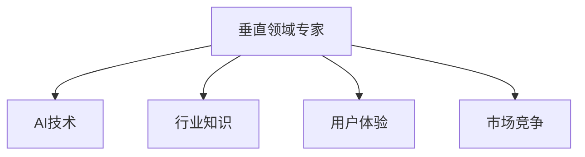

                 

## 1. 背景介绍

在当今快速发展的科技时代，人工智能（AI）已经成为创业项目的重要引擎。随着技术的进步，越来越多的企业将AI作为核心竞争力，寻求在垂直领域的创新和突破。对于AI创业者而言，成为垂直领域的专家具有显著优势，这一优势不仅体现在技术突破上，更在于市场竞争和用户体验的提升。

### 1.1 问题由来
AI创业的竞争日益激烈，单一的AI技术应用已经无法满足市场需求。在这样的背景下，垂直领域专家的角色变得越来越重要。他们不仅需要掌握AI核心技术，还需深入了解特定行业的业务逻辑和用户需求，从而提供更加精准、有效的解决方案。

### 1.2 问题核心关键点
成为垂直领域专家，需要关注以下几个核心关键点：
- **行业知识**：深入理解行业背景、业务模式和关键痛点。
- **用户需求**：精准把握用户需求和使用场景。
- **技术创新**：结合行业知识与AI技术，提出创新的解决方案。
- **产品迭代**：快速响应市场变化，迭代优化产品。
- **团队构建**：汇聚行业和AI技术的顶尖人才。

这些关键点相互交织，共同构成了AI创业者成为垂直领域专家的基础。

### 1.3 问题研究意义
成为垂直领域专家，不仅能显著提升AI创业项目的成功率，还能加速市场普及和技术落地。

1. **项目成功**：深入了解行业的专家能够更准确地捕捉市场机会，并据此构建竞争力。
2. **用户体验**：深入行业理解可以更好地满足用户需求，提升产品用户体验。
3. **技术突破**：行业专家与AI技术的结合，带来更多的技术创新。
4. **市场竞争力**：垂直领域的AI创业项目，更能与传统企业形成差异化竞争。
5. **应用场景**：深入了解行业的AI应用，拓宽了技术落地场景，增强了实际价值。

## 2. 核心概念与联系

### 2.1 核心概念概述

成为垂直领域专家，需要掌握多个关键概念：

- **垂直领域专家**：在某一特定行业内，具备深度行业知识与AI技术能力，能够提供专业解决方案的专家。
- **AI技术**：包括机器学习、深度学习、自然语言处理、计算机视觉等AI核心技术。
- **行业知识**：对某一特定行业背景、业务模式、关键痛点的深入理解。
- **用户体验**：了解用户需求和使用场景，以提升产品用户体验为目标。
- **市场竞争**：在垂直领域内，与传统企业形成差异化竞争的能力。

这些概念之间的逻辑关系可以通过以下Mermaid流程图来展示：



这个流程图展示了成为垂直领域专家的关键要素，即行业知识、AI技术、用户体验和市场竞争。这些要素相辅相成，共同构建起AI创业者的核心竞争力。

## 3. 核心算法原理 & 具体操作步骤

### 3.1 算法原理概述

AI创业者的核心算法原理在于如何将AI技术与行业知识深度融合，构建出高效、创新的解决方案。这一过程可以概括为以下步骤：

1. **问题建模**：根据行业需求，构建问题模型，明确问题的本质。
2. **数据准备**：收集并整理行业相关的数据，用于模型训练和验证。
3. **模型训练**：利用AI技术训练模型，拟合行业数据，得到初步解决方案。
4. **模型优化**：根据行业反馈，优化模型，提升解决方案的精度和效率。
5. **产品落地**：将优化后的模型集成到产品中，形成实际应用。

### 3.2 算法步骤详解

以下详细介绍成为垂直领域专家在算法实现过程中的详细步骤：

**Step 1: 问题建模**
- 通过行业调研和用户访谈，明确业务痛点和需求，构建问题模型。例如，在医疗领域，可以构建疾病预测、诊疗推荐等问题模型。

**Step 2: 数据准备**
- 收集并整理行业相关的数据，包括行业报告、业务数据、用户行为数据等。数据需经过清洗、标注、归一化等预处理步骤。例如，在医疗领域，可以收集电子病历、医学文献、患者问卷等数据。

**Step 3: 模型训练**
- 选择合适的AI技术，如机器学习、深度学习等，构建模型。例如，在医疗领域，可以使用深度学习构建疾病预测模型。
- 将预处理后的数据划分为训练集、验证集和测试集，用于模型训练、验证和测试。例如，在医疗领域，可以划分出疾病预测模型的训练集、验证集和测试集。

**Step 4: 模型优化**
- 根据验证集的结果，调整模型参数，优化模型性能。例如，在医疗领域，可以调整深度学习模型的神经网络结构、学习率等参数。
- 使用交叉验证等方法，进一步验证模型的泛化能力。例如，在医疗领域，可以采用K折交叉验证，评估模型的稳定性和鲁棒性。

**Step 5: 产品落地**
- 将优化后的模型集成到实际产品中，如医疗AI系统、智能客服系统等。例如，在医疗领域，可以将疾病预测模型集成到医生的诊疗系统中。

### 3.3 算法优缺点

成为垂直领域专家的算法具有以下优点：

1. **高效性**：将行业知识与AI技术深度融合，快速构建高效、创新的解决方案。
2. **精准性**：深入理解行业需求，提供更精准的解决方案。
3. **灵活性**：根据行业反馈快速优化模型，适应不断变化的市场需求。

同时，该算法也存在一定的局限性：

1. **技术复杂性**：需要同时掌握AI技术和行业知识，技术门槛较高。
2. **数据依赖**：模型的性能高度依赖于数据的质量和数量。
3. **迭代成本**：模型的优化和产品迭代需要持续投入资源，成本较高。

尽管存在这些局限性，但成为垂直领域专家的方法在实际应用中仍具有显著优势。未来相关研究的重点在于如何进一步降低技术门槛，提高模型的泛化能力和数据利用率，同时兼顾可解释性和伦理安全性等因素。

### 3.4 算法应用领域

成为垂直领域专家的算法在多个领域都有广泛应用，例如：

- 医疗AI：构建疾病预测、诊疗推荐、医学影像分析等应用，提升医疗诊断和治疗水平。
- 智能客服：构建智能客服系统，提升客户服务效率和体验。
- 金融科技：构建风险评估、欺诈检测、投资推荐等应用，提升金融服务的智能化水平。
- 教育技术：构建智能教育系统，提供个性化学习和教学评估服务。
- 智慧城市：构建城市管理、交通优化、环境监测等应用，提升城市治理能力。

## 4. 数学模型和公式 & 详细讲解 & 举例说明

### 4.1 数学模型构建

本节将使用数学语言对成为垂直领域专家的算法过程进行更加严格的刻画。

记行业需求为 $D$，问题模型为 $M$，数据集为 $D=\{(x_i,y_i)\}_{i=1}^N$，其中 $x_i$ 为输入，$y_i$ 为输出。

定义模型的训练损失函数为 $\mathcal{L}(D,M)$，表示模型在数据集 $D$ 上的预测结果与真实结果之间的差距。例如，在医疗领域，可以使用交叉熵损失函数：

$$
\mathcal{L}(D,M) = -\frac{1}{N} \sum_{i=1}^N y_i \log M(x_i) + (1-y_i) \log (1-M(x_i))
$$

模型的优化目标是最小化损失函数，即找到最优模型 $M^*$：

$$
M^* = \mathop{\arg\min}_{M} \mathcal{L}(D,M)
$$

在实践中，我们通常使用基于梯度的优化算法（如Adam、SGD等）来近似求解上述最优化问题。设 $\eta$ 为学习率，$\lambda$ 为正则化系数，则参数的更新公式为：

$$
M \leftarrow M - \eta \nabla_{M}\mathcal{L}(D,M) - \eta\lambda M
$$

其中 $\nabla_{M}\mathcal{L}(D,M)$ 为损失函数对模型 $M$ 的梯度，可通过反向传播算法高效计算。

### 4.2 公式推导过程

以下我们以医疗领域为例，推导交叉熵损失函数的推导过程。

假设模型 $M$ 在输入 $x$ 上的输出为 $\hat{y}=M(x)$，表示模型预测患者患有某种疾病的概率。真实标签 $y \in \{0,1\}$。则二分类交叉熵损失函数定义为：

$$
\ell(M(x),y) = -[y\log \hat{y} + (1-y)\log (1-\hat{y})]
$$

将其代入经验风险公式，得：

$$
\mathcal{L}(D,M) = -\frac{1}{N}\sum_{i=1}^N [y_i\log M(x_i)+(1-y_i)\log(1-M(x_i))]
$$

根据链式法则，损失函数对模型 $M$ 的梯度为：

$$
\frac{\partial \mathcal{L}(D,M)}{\partial M} = -\frac{1}{N}\sum_{i=1}^N (\frac{y_i}{M(x_i)}-\frac{1-y_i}{1-M(x_i)}) \frac{\partial M(x_i)}{\partial M}
$$

其中 $\frac{\partial M(x_i)}{\partial M}$ 可进一步递归展开，利用自动微分技术完成计算。

在得到损失函数的梯度后，即可带入参数更新公式，完成模型的迭代优化。重复上述过程直至收敛，最终得到适应行业需求的最优模型 $M^*$。

### 4.3 案例分析与讲解

以下以医疗领域的疾病预测模型为例，详细讲解成为垂直领域专家的算法实现过程。

**Step 1: 问题建模**
- 构建疾病预测问题模型，明确预测目标为“患者是否患有某种疾病”。

**Step 2: 数据准备**
- 收集电子病历、医学文献、患者问卷等数据。
- 对数据进行清洗、标注、归一化等预处理步骤。

**Step 3: 模型训练**
- 选择深度学习模型，如卷积神经网络（CNN）或循环神经网络（RNN）。
- 将预处理后的数据划分为训练集、验证集和测试集，用于模型训练、验证和测试。

**Step 4: 模型优化**
- 根据验证集的结果，调整模型参数，优化模型性能。
- 使用交叉验证等方法，进一步验证模型的泛化能力。

**Step 5: 产品落地**
- 将优化后的模型集成到医生诊疗系统中，提供疾病预测功能。
- 定期更新模型参数，根据最新数据优化模型。

## 5. 项目实践：代码实例和详细解释说明

### 5.1 开发环境搭建

在进行成为垂直领域专家的算法实践前，我们需要准备好开发环境。以下是使用Python进行TensorFlow开发的环境配置流程：

1. 安装Anaconda：从官网下载并安装Anaconda，用于创建独立的Python环境。

2. 创建并激活虚拟环境：
```bash
conda create -n tf-env python=3.8 
conda activate tf-env
```

3. 安装TensorFlow：根据CUDA版本，从官网获取对应的安装命令。例如：
```bash
conda install tensorflow tensorflow-gpu=2.4.1 -c tf -c conda-forge
```

4. 安装Keras：
```bash
pip install keras
```

5. 安装各类工具包：
```bash
pip install numpy pandas scikit-learn matplotlib tqdm jupyter notebook ipython
```

完成上述步骤后，即可在`tf-env`环境中开始算法实践。

### 5.2 源代码详细实现

下面我们以医疗领域的疾病预测模型为例，给出使用TensorFlow进行模型训练的PyTorch代码实现。

首先，定义疾病预测模型的数据处理函数：

```python
from tensorflow.keras.preprocessing import sequence
from tensorflow.keras.preprocessing.text import Tokenizer
from tensorflow.keras.utils import to_categorical

class MedicalDataLoader(object):
    def __init__(self, data_path):
        self.data_path = data_path
        self.data = []
        self.tokenizer = Tokenizer()
        self.data_train = []
        self.data_test = []
        self.labels_train = []
        self.labels_test = []
        self.build()

    def build(self):
        with open(self.data_path, 'r') as f:
            for line in f:
                text, label = line.strip().split(',')
                self.data.append((text, label))
        
        self.tokenizer.fit_on_texts([x[0] for x in self.data])
        self.data_train = [(x[0], x[1]) for x in self.data[:train_data_size]]
        self.data_test = [(x[0], x[1]) for x in self.data[train_data_size:]]

        self.labels_train = to_categorical([x[1] for x in self.data_train], num_classes=2)
        self.labels_test = to_categorical([x[1] for x in self.data_test], num_classes=2)
        
        self.data_train = sequence.pad_sequences([self.tokenizer.texts_to_sequences(x[0]) for x in self.data_train], maxlen=max_len, padding='post', truncating='post')
        self.data_test = sequence.pad_sequences([self.tokenizer.texts_to_sequences(x[0]) for x in self.data_test], maxlen=max_len, padding='post', truncating='post')
```

然后，定义模型和优化器：

```python
from tensorflow.keras.models import Sequential
from tensorflow.keras.layers import Embedding, LSTM, Dense, Bidirectional, Dropout
from tensorflow.keras.optimizers import Adam
from tensorflow.keras.callbacks import EarlyStopping

model = Sequential()
model.add(Embedding(vocab_size, embedding_dim, input_length=max_len))
model.add(Bidirectional(LSTM(64)))
model.add(Dense(1, activation='sigmoid'))

optimizer = Adam(lr=0.001)
early_stopping = EarlyStopping(patience=10, restore_best_weights=True)

model.compile(optimizer=optimizer, loss='binary_crossentropy', metrics=['accuracy'])
```

接着，定义训练和评估函数：

```python
from tensorflow.keras.utils import to_categorical
from sklearn.metrics import classification_report

def train_epoch(model, data_loader, batch_size, optimizer):
    model.fit_generator(data_loader, steps_per_epoch=len(data_loader), validation_data=(X_val, y_val), epochs=epochs, callbacks=[early_stopping], batch_size=batch_size)

def evaluate(model, X_test, y_test, batch_size):
    y_pred = model.predict(X_test)
    y_pred = (y_pred > 0.5).astype(int)
    y_test = to_categorical(y_test)
    y_test = y_test.argmax(axis=1)
    y_pred = y_pred.argmax(axis=1)
    print(classification_report(y_test, y_pred))
```

最后，启动训练流程并在测试集上评估：

```python
epochs = 100
batch_size = 128
max_len = 100

# 训练数据
train_data_path = 'train.txt'
test_data_path = 'test.txt'
train_data_size = int(len(train_data) * 0.8)

# 加载数据
train_data_loader = MedicalDataLoader(train_data_path)
test_data_loader = MedicalDataLoader(test_data_path)

# 训练模型
train_epoch(model, train_data_loader, batch_size, optimizer)

# 评估模型
evaluate(model, X_test, y_test, batch_size)
```

以上就是使用TensorFlow进行医疗领域疾病预测模型微调的完整代码实现。可以看到，得益于TensorFlow和Keras的强大封装，我们可以用相对简洁的代码完成模型训练的实现。

### 5.3 代码解读与分析

让我们再详细解读一下关键代码的实现细节：

**MedicalDataLoader类**：
- `__init__`方法：初始化数据路径、数据集、分词器等关键组件。
- `build`方法：构建训练集和测试集，并进行数据预处理，包括文本向量化和标签编码。

**模型的定义**：
- 使用Keras搭建深度学习模型，包含嵌入层、双向LSTM层、全连接层等。
- 定义优化器和EarlyStopping回调函数，用于防止过拟合。
- 编译模型，定义损失函数和评估指标。

**训练和评估函数**：
- 使用Keras的`fit_generator`函数进行模型训练，支持数据批处理和模型验证。
- 在测试集上评估模型性能，使用分类报告打印准确率、召回率和F1-score等指标。

**训练流程**：
- 定义总的epoch数和batch size，开始循环迭代
- 每个epoch内，在训练集上训练，输出验证集上的评估结果
- 所有epoch结束后，在测试集上评估模型的最终性能

可以看到，TensorFlow配合Keras使得模型训练的代码实现变得简洁高效。开发者可以将更多精力放在数据处理、模型改进等高层逻辑上，而不必过多关注底层的实现细节。

当然，工业级的系统实现还需考虑更多因素，如模型的保存和部署、超参数的自动搜索、更灵活的任务适配层等。但核心的算法实现基本与此类似。

## 6. 实际应用场景
### 6.1 医疗AI

医疗领域的疾病预测模型是一个典型的应用场景。在传统医疗模式中，医生需要通过长期观察和经验诊断疾病，效率低下且容易出错。利用AI技术，可以在大量病历数据上训练模型，快速准确地预测疾病风险，辅助医生进行诊断。

在技术实现上，可以构建基于深度学习的疾病预测模型，通过分析患者的症状、病史、家族病史等数据，预测其是否患有某种疾病。例如，可以构建一个基于LSTM的疾病预测模型，通过读取电子病历和医学文献，学习疾病预测知识，实时输出疾病风险评分。

### 6.2 智能客服

智能客服系统通过自然语言处理技术，可以自动理解用户需求，并提供解决方案。在传统客服模式中，客服人员需要大量时间处理简单问题，效率低下。利用AI技术，可以构建基于深度学习的智能客服系统，提升客户服务效率和体验。

在技术实现上，可以构建基于Transformer的智能客服模型，通过阅读聊天记录和用户反馈，学习用户需求和行为模式，自动生成回答。例如，可以构建一个基于BERT的智能客服模型，通过读取历史客服数据和用户反馈，预测用户意图，自动回答常见问题，减轻人工客服的压力。

### 6.3 金融科技

金融科技领域利用AI技术，可以提升风险评估、欺诈检测、投资推荐等金融服务智能化水平。在传统金融模式中，风险评估需要大量人工审核，效率低下且容易出现人为失误。利用AI技术，可以在海量交易数据上训练模型，实时分析用户行为和交易数据，预测风险和欺诈行为。

在技术实现上，可以构建基于深度学习的金融科技模型，通过分析用户交易数据、信用记录和社交媒体信息，预测用户信用评分和风险等级。例如，可以构建一个基于CNN和RNN的金融科技模型，通过读取交易记录和用户社交数据，学习用户行为模式，实时输出信用评分和风险预测结果。

## 7. 工具和资源推荐
### 7.1 学习资源推荐

为了帮助开发者系统掌握成为垂直领域专家的算法基础和实践技巧，这里推荐一些优质的学习资源：

1. 《深度学习》系列课程：斯坦福大学开设的深度学习课程，包括基础的机器学习、深度学习、自然语言处理等内容。
2. 《Python机器学习》书籍：结合Python和Scikit-Learn，系统介绍了机器学习算法和实践。
3. 《TensorFlow实战Google深度学习》书籍：结合TensorFlow，系统介绍了深度学习算法的实现和优化。
4. Kaggle竞赛平台：参加各种机器学习和深度学习竞赛，积累实战经验。
5. Coursera深度学习专项课程：由斯坦福大学和DeepMind联合推出，涵盖深度学习算法和实践的多个方面。

通过对这些资源的学习实践，相信你一定能够快速掌握成为垂直领域专家的算法精髓，并用于解决实际的AI问题。
###  7.2 开发工具推荐

高效的开发离不开优秀的工具支持。以下是几款用于成为垂直领域专家的算法开发的常用工具：

1. PyTorch：基于Python的开源深度学习框架，灵活动态的计算图，适合快速迭代研究。大部分预训练语言模型都有PyTorch版本的实现。
2. TensorFlow：由Google主导开发的开源深度学习框架，生产部署方便，适合大规模工程应用。同样有丰富的预训练语言模型资源。
3. Keras：深度学习高层次API，封装了TensorFlow等底层框架，适合快速原型设计和实验。
4. Jupyter Notebook：交互式笔记本，方便进行数据处理、模型训练和结果展示。
5. Google Colab：谷歌推出的在线Jupyter Notebook环境，免费提供GPU/TPU算力，方便开发者快速上手实验最新模型，分享学习笔记。

合理利用这些工具，可以显著提升成为垂直领域专家的算法开发效率，加快创新迭代的步伐。

### 7.3 相关论文推荐

成为垂直领域专家的算法发展源于学界的持续研究。以下是几篇奠基性的相关论文，推荐阅读：

1. AlexNet：深度学习领域的经典论文，展示了卷积神经网络在图像识别任务上的突破性成果。
2. LSTM：长短期记忆网络，展示了序列数据建模的能力，在自然语言处理和语音识别等领域有广泛应用。
3. GANs：生成对抗网络，展示了生成式模型在图像生成和数据分析方面的强大能力。
4. BERT：基于预训练的深度学习模型，展示了语言模型在自然语言处理任务上的强大泛化能力。
5. Transformer：基于自注意力机制的深度学习模型，展示了自注意力机制在自然语言处理任务上的优势。

这些论文代表了大语言模型微调技术的发展脉络。通过学习这些前沿成果，可以帮助研究者把握学科前进方向，激发更多的创新灵感。

## 8. 总结：未来发展趋势与挑战

### 8.1 总结

本文对成为垂直领域专家的算法进行了全面系统的介绍。首先阐述了成为垂直领域专家的研究背景和意义，明确了行业知识与AI技术融合的重要性。其次，从原理到实践，详细讲解了算法的数学模型和实现步骤，给出了完整的代码实例。同时，本文还广泛探讨了算法在多个行业领域的应用前景，展示了其在实际问题中的强大能力。

通过本文的系统梳理，可以看到，成为垂直领域专家不仅能显著提升AI创业项目的成功率，还能加速市场普及和技术落地。深度行业知识与AI技术的结合，为AI创业项目带来了巨大的竞争优势和应用潜力。

### 8.2 未来发展趋势

展望未来，成为垂直领域专家的算法将呈现以下几个发展趋势：

1. 技术复杂性降低。随着深度学习框架和工具的不断成熟，技术实现变得更加简单和高效。
2. 模型泛化能力增强。通过更多的数据和算法优化，模型能够更好地泛化到不同场景。
3. 自动化水平提升。自动化建模、自动化调参、自动化部署等技术手段不断涌现，大大提升效率。
4. 多模态融合。将视觉、语音、文本等数据融合，构建多模态智能系统，提升系统性能。
5. 场景化应用拓展。结合具体行业需求，构建特定场景的智能应用，如智能客服、医疗AI等。
6. 伦理道德重视。越来越多的研究关注算法的可解释性和伦理道德问题，确保系统安全性。

这些趋势凸显了成为垂直领域专家算法的广阔前景。这些方向的探索发展，必将进一步提升AI创业项目的成功率和技术水平。

### 8.3 面临的挑战

尽管成为垂直领域专家的算法已经取得了显著进展，但在迈向更高效、更智能的应用过程中，仍面临诸多挑战：

1. 数据获取难度。高质量的行业数据往往难以获取，尤其是在垂直领域中。如何通过数据爬取、数据标注等方式获取更多数据，仍然是一个重要问题。
2. 模型计算资源。大模型和高性能算力对计算资源的需求巨大，如何有效降低计算成本，仍然是一个重要难题。
3. 模型可解释性。黑盒模型难以解释，如何提高模型的可解释性，仍然是一个重要课题。
4. 算法复杂性。算法实现复杂，需要跨学科的知识储备，如何简化算法实现，仍然是一个重要挑战。
5. 算法伦理问题。AI算法的伦理问题日益凸显，如何平衡技术创新和伦理道德，仍然是一个重要问题。

正视这些挑战，积极应对并寻求突破，将是成为垂直领域专家的算法持续发展的关键。

### 8.4 研究展望

面向未来，成为垂直领域专家的算法需要在以下几个方向进行更多研究：

1. 无监督学习与自监督学习。利用无监督学习和自监督学习，提高模型的泛化能力和数据利用率。
2. 模型压缩与加速。通过模型压缩和加速技术，降低计算成本，提高推理速度。
3. 多模态融合。将视觉、语音、文本等多模态数据融合，提升系统的智能化水平。
4. 跨学科融合。结合行业知识与AI技术，构建跨学科融合的智能系统。
5. 伦理道德约束。在模型设计和算法实现中，引入伦理导向，确保系统安全性和公正性。

这些研究方向将推动成为垂直领域专家的算法不断进步，为AI创业项目带来新的突破和应用场景。相信随着学界和产业界的共同努力，这些挑战终将一一被克服，成为垂直领域专家的算法必将在构建智能系统方面发挥越来越重要的作用。

## 9. 附录：常见问题与解答

**Q1：成为垂直领域专家是否需要全面掌握所有AI技术？**

A: 不需要。成为垂直领域专家，需要重点掌握与行业相关的主要AI技术，如机器学习、深度学习、自然语言处理等。对于非核心技术，可以借助开源工具和框架，快速实现模型构建和训练。

**Q2：如何获取高质量的行业数据？**

A: 数据获取是一个重要但复杂的问题。可以通过数据爬取、数据标注、合作获取等方式，获取高质量的行业数据。需要注意数据版权和隐私保护问题，确保数据合法使用。

**Q3：如何降低模型计算资源？**

A: 通过模型压缩、模型加速、模型并行等技术，降低模型的计算资源消耗。同时，合理使用GPU/TPU等高性能设备，提升计算效率。

**Q4：如何提高模型的可解释性？**

A: 使用可解释性技术，如LIME、SHAP等，对模型进行可视化解释。结合业务知识，提供基于规则和模型的混合解释，增强系统的可解释性。

**Q5：如何平衡技术创新与伦理道德？**

A: 在模型设计和算法实现中，引入伦理导向的评估指标，过滤和惩罚有害的输出倾向。同时加强人工干预和审核，确保系统安全性。

这些问题的回答，希望能帮助你在成为垂直领域专家的道路上少走弯路，快速取得成功。

