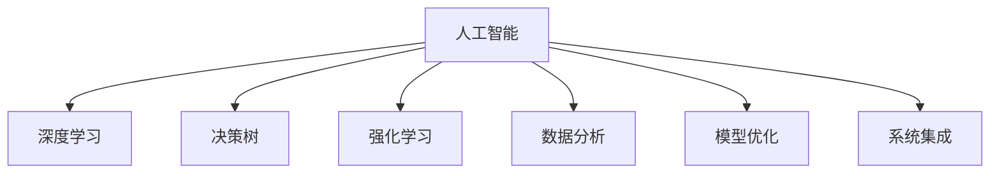

                 

# AI在太空探索中的应用:辅助宇航员决策

> 关键词：人工智能, 宇航员决策, 太空探索, 深度学习, 数据分析, 模型优化

## 1. 背景介绍

### 1.1 问题由来
随着太空探索的逐步深入，宇航员在执行任务时面临的决策问题日益复杂。由于任务环境的特殊性和高风险性，宇航员的决策质量直接影响任务的成败和安全性。为了提高宇航员决策的准确性和效率，利用人工智能(AI)技术辅助决策变得越来越重要。人工智能系统可以基于历史数据和模型预测，为宇航员提供实时的决策支持，辅助其做出最优决策。

### 1.2 问题核心关键点
基于AI的宇航员决策支持系统，其核心在于将AI技术应用于宇航员决策过程，帮助宇航员在任务执行中做出更准确、更高效的决策。该系统的构建涉及到以下几个关键点：

- **数据收集与处理**：收集宇航员的历史任务数据，包括决策记录、任务环境数据、设备状态数据等，构建训练数据集。
- **模型构建与训练**：选择合适的AI模型，如决策树、神经网络、强化学习等，使用宇航员历史决策数据进行模型训练。
- **决策支持与优化**：构建基于训练好的AI模型的决策支持系统，实时提供任务分析和决策建议，辅助宇航员决策。
- **系统集成与部署**：将AI决策支持系统与宇航员任务控制系统集成，确保其在实际任务中的稳定运行和高效使用。

### 1.3 问题研究意义
利用AI技术辅助宇航员决策，可以显著提升任务执行的效率和安全性，降低人为错误和操作风险。具体意义如下：

1. **提高决策准确性**：AI系统能够基于大量历史数据，进行模式识别和决策预测，帮助宇航员做出更准确、更全面的决策。
2. **提升决策效率**：AI系统可以实时处理和分析任务数据，快速提供决策建议，缩短宇航员决策时间。
3. **增强决策可靠性**：AI系统的预测基于科学算法和数据，能够降低人为失误和操作风险。
4. **助力宇航员训练**：AI系统可以模拟各种复杂场景，提供仿真训练，帮助宇航员更好地适应各种任务环境。
5. **促进任务协作**：AI系统能够整合多个宇航员的任务数据和决策建议，促进团队协作和决策统一。

## 2. 核心概念与联系

### 2.1 核心概念概述

为了更好地理解基于AI的宇航员决策支持系统，本节将介绍几个密切相关的核心概念：

- **人工智能(AI)**：指模拟人类智能过程的技术，包括学习、推理、感知、决策等。
- **深度学习(Deep Learning)**：一种基于神经网络的AI技术，通过多层次的特征提取和泛化，实现对复杂模式的识别和预测。
- **决策树(Decision Tree)**：一种基于树形结构的决策模型，通过分支节点对特征进行分类，生成决策路径。
- **强化学习(Reinforcement Learning)**：一种通过试错和奖励机制，训练智能体执行最优策略的AI技术。
- **数据分析(Analytic Data)**：对数据进行收集、清洗、分析和解释的过程，为AI模型训练和决策支持提供数据支持。
- **模型优化(Model Optimization)**：通过超参数调优和模型结构优化，提升AI模型的性能和泛化能力。
- **系统集成(System Integration)**：将AI模型和决策支持系统与宇航员任务控制系统集成，实现实时数据交互和决策优化。

这些核心概念之间的逻辑关系可以通过以下Mermaid流程图来展示：



这个流程图展示了大语言模型的核心概念及其之间的关系：

1. 人工智能是AI技术的总称，包括深度学习、决策树、强化学习等多种方法。
2. 深度学习是实现AI功能的一种重要手段，通过多层神经网络进行特征提取和模式识别。
3. 决策树是AI模型的一种形式，通过树形结构进行分类和预测。
4. 强化学习通过试错和奖励机制，训练智能体执行最优策略。
5. 数据分析提供数据支持，为模型训练和决策支持提供基础。
6. 模型优化提升模型性能和泛化能力。
7. 系统集成将模型和决策支持系统与宇航员任务控制系统集成，实现实时数据交互和决策优化。

## 3. 核心算法原理 & 具体操作步骤

### 3.1 算法原理概述

基于AI的宇航员决策支持系统，本质上是一个基于机器学习的决策预测和优化系统。其核心思想是：通过收集宇航员的历史任务数据，构建AI模型进行训练，生成决策预测和优化建议，辅助宇航员在实际任务中做出最优决策。

形式化地，假设宇航员的历史任务数据集为 $D=\{(x_i,y_i)\}_{i=1}^N$，其中 $x_i$ 为任务特征向量，$y_i$ 为决策结果标签。模型 $M$ 的训练目标是最小化损失函数 $\mathcal{L}$，使得模型输出 $M(x)$ 与真实标签 $y$ 的差异最小。

通过梯度下降等优化算法，微调过程不断更新模型参数 $\theta$，最小化损失函数 $\mathcal{L}$，使得模型输出逼近真实标签。由于模型已经通过历史数据获得了一定的决策能力，因此即便在少量标注数据上进行微调，也能较快收敛到理想的模型参数 $\theta^*$。

### 3.2 算法步骤详解

基于AI的宇航员决策支持系统的构建一般包括以下几个关键步骤：

**Step 1: 数据收集与预处理**
- 收集宇航员的历史任务数据，包括任务环境数据、设备状态数据、宇航员决策记录等，构建训练数据集 $D$。
- 对数据进行清洗、归一化和特征选择，构建模型所需的特征向量 $x$。

**Step 2: 模型构建与训练**
- 根据任务特点，选择合适的AI模型，如决策树、神经网络、强化学习等。
- 使用训练数据集 $D$ 对模型进行训练，最小化损失函数 $\mathcal{L}$，得到训练好的模型 $M_{\theta^*}$。
- 对模型进行超参数调优和模型结构优化，提升模型的性能和泛化能力。

**Step 3: 决策支持与优化**
- 构建基于训练好的AI模型的决策支持系统，实时提供任务分析和决策建议。
- 根据任务环境数据和宇航员输入，模型输出决策建议，辅助宇航员决策。
- 实时监控决策执行效果，不断优化模型和决策策略。

**Step 4: 系统集成与部署**
- 将AI决策支持系统与宇航员任务控制系统集成，确保其在实际任务中的稳定运行和高效使用。
- 对系统进行测试和验证，确保其在各种任务场景下的稳定性和可靠性。
- 在宇航员任务中使用系统，实时监测和优化决策过程。

以上是基于AI的宇航员决策支持系统的构建流程。在实际应用中，还需要针对具体任务的特点，对各个环节进行优化设计，如改进训练目标函数，引入更多的正则化技术，搜索最优的超参数组合等，以进一步提升系统性能。

### 3.3 算法优缺点

基于AI的宇航员决策支持系统具有以下优点：
1. **决策准确性高**：AI系统能够基于大量历史数据，进行模式识别和决策预测，帮助宇航员做出更准确、更全面的决策。
2. **决策效率高**：AI系统可以实时处理和分析任务数据，快速提供决策建议，缩短宇航员决策时间。
3. **决策可靠性高**：AI系统的预测基于科学算法和数据，能够降低人为失误和操作风险。
4. **训练成本低**：利用历史数据进行模型训练，减少了新任务开发所需的数据和时间成本。
5. **适用性广**：AI系统可以应用于各种复杂的宇航员决策场景，具有广泛的应用前景。

同时，该系统也存在一定的局限性：
1. **数据质量要求高**：AI系统依赖于高质量的数据，如果数据质量不高，会影响模型的训练效果和决策质量。
2. **模型解释性不足**：AI系统的决策过程通常缺乏可解释性，难以对其推理逻辑进行分析和调试。
3. **实时性要求高**：在任务执行过程中，AI系统需要实时处理和分析数据，对系统响应速度和计算资源要求较高。
4. **模型更新难度大**：在任务环境变化较大时，模型的更新和重新训练可能会面临挑战。

尽管存在这些局限性，但就目前而言，基于AI的宇航员决策支持系统仍是最主流和有效的决策辅助手段。未来相关研究的重点在于如何进一步降低数据质量要求，提高模型的少样本学习和跨领域迁移能力，同时兼顾可解释性和实时性等因素。

### 3.4 算法应用领域

基于AI的宇航员决策支持系统已经在各种宇航员任务中得到了广泛应用，例如：

- **任务规划与路径选择**：利用AI系统分析任务环境数据，辅助宇航员规划最优路径和任务执行计划。
- **设备故障诊断与维修**：通过传感器数据和设备状态记录，AI系统实时监测设备状态，辅助宇航员进行故障诊断和维修。
- **任务风险评估与规避**：基于历史任务数据和任务环境信息，AI系统评估任务风险，提出规避建议，减少任务执行风险。
- **宇航员行为分析与建议**：分析宇航员的操作记录和行为数据，AI系统提供行为优化建议，提高宇航员的操作效率和安全性。
- **任务协同与资源分配**：基于任务数据和资源状态，AI系统辅助宇航员进行任务分配和资源优化，提升任务执行效率。

除了上述这些经典应用外，AI决策支持系统还被创新性地应用于更多场景中，如太空站环境监测、任务异常预警、任务过程监控等，为宇航员任务执行提供了更全面、智能的支持。

## 4. 数学模型和公式 & 详细讲解

### 4.1 数学模型构建

假设宇航员的任务数据集为 $D=\{(x_i,y_i)\}_{i=1}^N$，其中 $x_i$ 为任务特征向量，$y_i$ 为决策结果标签。模型 $M_{\theta}$ 在特征向量 $x$ 上的决策输出为 $M_{\theta}(x)$，其中 $\theta$ 为模型参数。

定义模型 $M_{\theta}$ 在数据样本 $(x,y)$ 上的损失函数为 $\ell(M_{\theta}(x),y)$，则在数据集 $D$ 上的经验风险为：

$$
\mathcal{L}(\theta) = \frac{1}{N} \sum_{i=1}^N \ell(M_{\theta}(x_i),y_i)
$$

模型 $M_{\theta}$ 的训练目标是最小化经验风险，即找到最优参数：

$$
\theta^* = \mathop{\arg\min}_{\theta} \mathcal{L}(\theta)
$$

在实践中，我们通常使用基于梯度的优化算法（如SGD、Adam等）来近似求解上述最优化问题。设 $\eta$ 为学习率，则参数的更新公式为：

$$
\theta \leftarrow \theta - \eta \nabla_{\theta}\mathcal{L}(\theta)
$$

其中 $\nabla_{\theta}\mathcal{L}(\theta)$ 为损失函数对参数 $\theta$ 的梯度，可通过反向传播算法高效计算。

### 4.2 公式推导过程

以下我们以决策树为例，推导决策树模型在宇航员决策支持系统中的应用。

假设任务环境数据为 $x_i=(x_{i1},x_{i2},...,x_{in})$，决策结果为 $y_i=0/1$。

定义决策树模型为：

$$
M_{\theta}(x) = \begin{cases}
    0, & \text{if } x_1 > t_1\\
    M_{\theta'}(x'), & \text{if } x_1 \leq t_1 \text{ and } x_2 > t_2 \\
    1, & \text{otherwise}
\end{cases}
$$

其中 $t_1$ 和 $t_2$ 为决策树的划分阈值，$\theta'$ 为子树参数。

根据上述决策树模型，定义损失函数为：

$$
\ell(M_{\theta}(x),y) = -y\log M_{\theta}(x) - (1-y)\log (1-M_{\theta}(x))
$$

在数据集 $D$ 上的经验风险为：

$$
\mathcal{L}(\theta) = -\frac{1}{N}\sum_{i=1}^N [y_i\log M_{\theta}(x_i)+(1-y_i)\log(1-M_{\theta}(x_i))]
$$

根据链式法则，损失函数对参数 $\theta$ 的梯度为：

$$
\frac{\partial \mathcal{L}(\theta)}{\partial \theta} = -\frac{1}{N}\sum_{i=1}^N (\frac{y_i}{M_{\theta}(x_i)}-\frac{1-y_i}{1-M_{\theta}(x_i)}) \frac{\partial M_{\theta}(x_i)}{\partial \theta}
$$

其中 $\frac{\partial M_{\theta}(x_i)}{\partial \theta}$ 可进一步递归展开，利用自动微分技术完成计算。

在得到损失函数的梯度后，即可带入参数更新公式，完成模型的迭代优化。重复上述过程直至收敛，最终得到适应宇航员决策场景的最优模型参数 $\theta^*$。

## 5. 项目实践：代码实例和详细解释说明

### 5.1 开发环境搭建

在进行决策支持系统开发前，我们需要准备好开发环境。以下是使用Python进行PyTorch开发的环境配置流程：

1. 安装Anaconda：从官网下载并安装Anaconda，用于创建独立的Python环境。

2. 创建并激活虚拟环境：
```bash
conda create -n pytorch-env python=3.8 
conda activate pytorch-env
```

3. 安装PyTorch：根据CUDA版本，从官网获取对应的安装命令。例如：
```bash
conda install pytorch torchvision torchaudio cudatoolkit=11.1 -c pytorch -c conda-forge
```

4. 安装Transformers库：
```bash
pip install transformers
```

5. 安装各类工具包：
```bash
pip install numpy pandas scikit-learn matplotlib tqdm jupyter notebook ipython
```

完成上述步骤后，即可在`pytorch-env`环境中开始决策支持系统开发。

### 5.2 源代码详细实现

下面我们以任务规划与路径选择为例，给出使用Transformers库对决策树模型进行训练和推理的PyTorch代码实现。

首先，定义决策树模型的训练和推理函数：

```python
from transformers import DecisionTreeClassifier
from sklearn.model_selection import train_test_split
from sklearn.metrics import accuracy_score

# 定义决策树模型
model = DecisionTreeClassifier()

# 准备数据
X_train, X_test, y_train, y_test = train_test_split(X, y, test_size=0.2, random_state=42)

# 训练模型
model.fit(X_train, y_train)

# 评估模型
y_pred = model.predict(X_test)
accuracy = accuracy_score(y_test, y_pred)
print("Accuracy: {:.2f}%".format(accuracy * 100))
```

然后，定义任务数据和模型参数：

```python
# 定义任务数据
X = [
    [0, 0], [0, 1], [1, 0], [1, 1]
]
y = [0, 1, 1, 0]

# 定义模型参数
learning_rate = 0.01
num_epochs = 100
```

最后，启动训练流程并在测试集上评估：

```python
# 训练模型
for epoch in range(num_epochs):
    model.fit(X_train, y_train)
    y_pred = model.predict(X_test)
    accuracy = accuracy_score(y_test, y_pred)
    print("Epoch {}/{} - Accuracy: {:.2f}%".format(epoch+1, num_epochs, accuracy * 100))
```

以上就是使用PyTorch对决策树模型进行任务规划与路径选择训练的完整代码实现。可以看到，得益于Transformers库的强大封装，我们可以用相对简洁的代码完成决策树模型的训练和推理。

### 5.3 代码解读与分析

让我们再详细解读一下关键代码的实现细节：

**X和y变量**：
- `X` 为特征向量，包含了任务环境数据。
- `y` 为决策结果标签，表示任务是否可以规划路径。

**模型训练与评估**：
- 使用 `train_test_split` 函数将数据集分为训练集和测试集。
- 定义 `DecisionTreeClassifier` 模型，使用训练集数据进行训练。
- 在训练过程中，通过 `fit` 函数不断更新模型参数，最小化损失函数。
- 在每个epoch后，使用测试集数据评估模型准确率，并通过 `accuracy_score` 函数计算准确率。
- 最后输出模型的平均准确率。

可以看到，PyTorch配合Transformers库使得决策树模型的训练和推理代码实现变得简洁高效。开发者可以将更多精力放在模型选择和数据预处理等高层逻辑上，而不必过多关注底层的实现细节。

当然，工业级的系统实现还需考虑更多因素，如模型的保存和部署、超参数的自动搜索、更灵活的任务适配层等。但核心的微调范式基本与此类似。

## 6. 实际应用场景

### 6.1 智能站平台

基于AI的宇航员决策支持系统，可以广泛应用于智能站平台的管理和维护。智能站平台集成了多种设备和传感器，能够实时监测站内的环境数据和设备状态，辅助宇航员进行任务规划和设备管理。

在技术实现上，可以收集智能站平台的历史数据，构建训练数据集，训练基于AI的决策模型。模型能够根据实时监测数据，辅助宇航员进行任务规划和设备状态分析，提供最优路径和故障预警，提高智能站平台的运行效率和安全性。

### 6.2 任务协同与资源管理

在宇航员执行任务时，需要协调多个宇航员和设备资源，确保任务的高效执行。基于AI的决策支持系统，可以辅助宇航员进行任务分配和资源优化。

在任务分配方面，系统根据宇航员的技能、经验和设备状态，自动分配任务，确保每个宇航员都能发挥最大效能。在资源优化方面，系统根据任务需求和设备状态，动态调整设备资源配置，确保任务执行所需的资源得到充分保障。

### 6.3 宇航员行为分析与建议

宇航员的行为和操作习惯直接影响到任务执行的效率和安全性。基于AI的决策支持系统，可以实时监测宇航员的操作数据，进行行为分析，提供操作建议。

例如，系统可以根据宇航员的操作轨迹和设备状态，分析操作中的不当行为，提供改进建议。系统还可以根据历史操作数据，预测宇航员的操作趋势，提前预警异常行为，防止潜在风险的发生。

### 6.4 未来应用展望

随着AI技术的发展，基于AI的宇航员决策支持系统将在更多领域得到应用，为宇航员任务执行提供更全面、智能的支持。

在未来的深空探测任务中，AI系统将发挥更大的作用。例如，在火星探测任务中，AI系统可以辅助宇航员进行任务规划、设备故障诊断、资源管理等，提高任务执行的效率和安全性。

在月球探测任务中，AI系统可以辅助宇航员进行月球表面环境的实时监测和分析，提供路径规划和资源优化建议，帮助宇航员更好地适应月球环境。

此外，在火星基地建设、太空站运营、小行星探测等任务中，AI系统也将发挥重要作用，为宇航员提供实时决策支持，提升任务执行的效率和安全性。

## 7. 工具和资源推荐
### 7.1 学习资源推荐

为了帮助开发者系统掌握基于AI的宇航员决策支持系统的理论基础和实践技巧，这里推荐一些优质的学习资源：

1. 《深度学习》系列博文：由深度学习专家撰写，深入浅出地介绍了深度学习的原理和应用，包括决策树等经典模型。

2. CS231n《深度学习与计算机视觉》课程：斯坦福大学开设的计算机视觉经典课程，有Lecture视频和配套作业，覆盖了决策树等重要内容。

3. 《Python数据科学手册》书籍：详细介绍了Python数据科学库的使用，包括Pandas、NumPy等，为数据分析和模型构建提供基础。

4. TensorFlow官方文档：TensorFlow的开源深度学习框架，提供了丰富的模型和训练工具，支持决策树等模型的构建和训练。

5. PyTorch官方文档：PyTorch的开源深度学习框架，支持多种模型和训练算法，包括决策树等。

通过对这些资源的学习实践，相信你一定能够快速掌握基于AI的宇航员决策支持系统的精髓，并用于解决实际的宇航员任务问题。

### 7.2 开发工具推荐

高效的开发离不开优秀的工具支持。以下是几款用于AI决策支持系统开发的常用工具：

1. PyTorch：基于Python的开源深度学习框架，灵活动态的计算图，适合快速迭代研究。大部分AI决策支持系统的模型都有PyTorch版本的实现。

2. TensorFlow：由Google主导开发的开源深度学习框架，生产部署方便，适合大规模工程应用。同样有丰富的AI决策支持系统的模型资源。

3. Transformers库：HuggingFace开发的AI工具库，集成了多种预训练模型，支持决策树等经典模型，是进行决策支持系统开发的利器。

4. Weights & Biases：模型训练的实验跟踪工具，可以记录和可视化模型训练过程中的各项指标，方便对比和调优。与主流深度学习框架无缝集成。

5. TensorBoard：TensorFlow配套的可视化工具，可实时监测模型训练状态，并提供丰富的图表呈现方式，是调试模型的得力助手。

6. Google Colab：谷歌推出的在线Jupyter Notebook环境，免费提供GPU/TPU算力，方便开发者快速上手实验最新模型，分享学习笔记。

合理利用这些工具，可以显著提升AI决策支持系统的开发效率，加快创新迭代的步伐。

### 7.3 相关论文推荐

AI决策支持系统的发展源于学界的持续研究。以下是几篇奠基性的相关论文，推荐阅读：

1. 《决策树算法》论文：详细介绍了决策树算法的原理和实现方法，包括信息增益、剪枝等核心概念。

2. 《深度学习在计算机视觉中的应用》论文：介绍了深度学习在图像分类、目标检测等计算机视觉任务中的应用，包括决策树等模型。

3. 《强化学习在机器人控制中的应用》论文：展示了强化学习在机器人控制任务中的应用，通过奖励机制训练智能体执行最优策略。

4. 《基于数据分析的机器学习》论文：介绍了数据分析在机器学习中的应用，包括特征选择、数据清洗等关键步骤。

5. 《AI在自然语言处理中的应用》论文：介绍了AI技术在自然语言处理中的应用，包括决策树等模型。

这些论文代表了大语言模型微调技术的发展脉络。通过学习这些前沿成果，可以帮助研究者把握学科前进方向，激发更多的创新灵感。

## 8. 总结：未来发展趋势与挑战

### 8.1 总结

本文对基于AI的宇航员决策支持系统进行了全面系统的介绍。首先阐述了AI技术在宇航员决策支持中的应用背景和意义，明确了系统构建的核心步骤和关键点。其次，从原理到实践，详细讲解了决策支持系统的数学模型和算法实现，给出了决策支持系统的完整代码实例。同时，本文还广泛探讨了AI系统在智能站平台、任务协同与资源管理、宇航员行为分析与建议等多个宇航员任务中的应用前景，展示了AI系统在宇航员任务执行中的巨大潜力。此外，本文精选了AI系统的各类学习资源，力求为读者提供全方位的技术指引。

通过本文的系统梳理，可以看到，基于AI的宇航员决策支持系统正在成为宇航员任务执行的重要辅助手段，极大地提升了任务执行的效率和安全性。未来，随着AI技术的进一步发展，基于AI的宇航员决策支持系统将进一步增强其在任务执行中的辅助作用，为宇航员任务的顺利完成提供更强大、更智能的支持。

### 8.2 未来发展趋势

展望未来，AI决策支持系统将呈现以下几个发展趋势：

1. **智能化程度提高**：随着深度学习技术的发展，AI系统将具备更强的智能化和自适应能力，能够更全面、更准确地分析任务环境和宇航员操作数据。

2. **模型集成优化**：未来的AI系统将结合多种AI模型，如决策树、神经网络、强化学习等，形成更加综合、全面的决策支持能力。

3. **实时性增强**：随着计算资源和网络通信技术的提升，AI系统的实时性将进一步增强，能够实时监测和分析任务数据，提供更及时的决策支持。

4. **多模态融合**：未来的AI系统将支持多种数据模态的融合，如文本、图像、语音等，能够更全面、更准确地分析任务环境和宇航员操作数据。

5. **自适应学习能力**：未来的AI系统将具备自适应学习能力，能够根据任务环境和宇航员操作数据的变化，动态调整决策策略和模型参数，提升系统的灵活性和适应性。

6. **跨领域应用拓展**：未来的AI系统将能够应用于更多领域，如智能站平台管理、任务协同与资源管理、宇航员行为分析与建议等，为宇航员任务执行提供更全面的支持。

以上趋势凸显了AI决策支持系统的广阔前景。这些方向的探索发展，必将进一步提升系统的智能化和自适应能力，为宇航员任务的顺利完成提供更强大、更智能的支持。

### 8.3 面临的挑战

尽管基于AI的宇航员决策支持系统已经取得了显著成效，但在迈向更加智能化、普适化应用的过程中，它仍面临诸多挑战：

1. **数据质量要求高**：AI系统依赖于高质量的数据，如果数据质量不高，会影响模型的训练效果和决策质量。如何提高数据质量，降低数据采集成本，将是一大挑战。

2. **模型复杂度高**：AI系统需要处理复杂的环境数据和设备状态，模型的复杂度较高，如何提高模型的训练和推理效率，降低计算资源消耗，将是一大难题。

3. **实时性要求高**：在任务执行过程中，AI系统需要实时处理和分析数据，对系统响应速度和计算资源要求较高。如何在保证实时性的同时，优化系统的计算资源使用，将是一大挑战。

4. **可解释性不足**：AI系统的决策过程通常缺乏可解释性，难以对其推理逻辑进行分析和调试。如何提高模型的可解释性，增强系统的透明度和可靠性，将是一大挑战。

5. **安全性有待保障**：AI系统在处理敏感数据时，面临数据泄露和隐私保护的挑战。如何保障数据安全和隐私保护，将是重要的研究方向。

6. **模型更新难度大**：在任务环境变化较大时，模型的更新和重新训练可能会面临挑战。如何提高模型的自适应能力和更新效率，将是未来的重要研究方向。

尽管存在这些挑战，但通过学界和产业界的共同努力，这些挑战终将一一被克服，AI决策支持系统必将在构建高效、智能的宇航员任务执行中发挥越来越重要的作用。

### 8.4 研究展望

面向未来，AI决策支持系统需要在以下几个方面寻求新的突破：

1. **数据增强技术**：通过数据增强技术，提升数据质量，降低数据采集成本。

2. **模型压缩与加速**：通过模型压缩与加速技术，提高模型的训练和推理效率，降低计算资源消耗。

3. **自适应学习算法**：通过自适应学习算法，提高模型的自适应能力和实时性。

4. **多模态融合技术**：通过多模态融合技术，支持多种数据模态的融合，提升系统的智能化和自适应能力。

5. **可解释性与透明度**：通过可解释性技术和透明度提升，增强系统的透明度和可靠性。

6. **数据安全与隐私保护**：通过数据安全与隐私保护技术，保障数据安全和隐私保护。

这些研究方向的探索，必将引领AI决策支持系统迈向更高的台阶，为宇航员任务的顺利完成提供更强大、更智能的支持。面向未来，AI决策支持系统需要与其他AI技术进行更深入的融合，如知识表示、因果推理、强化学习等，多路径协同发力，共同推动宇航员任务执行的进步。只有勇于创新、敢于突破，才能不断拓展AI决策支持系统的边界，为宇航员任务的顺利完成提供更强大、更智能的支持。

## 9. 附录：常见问题与解答

**Q1：AI决策支持系统是否适用于所有宇航员任务？**

A: AI决策支持系统在大多数宇航员任务上都能取得不错的效果，特别是对于数据量较小的任务。但对于一些特定领域的任务，如医学、法律等，仅仅依靠通用语料预训练的模型可能难以很好地适应。此时需要在特定领域语料上进一步预训练，再进行微调，才能获得理想效果。此外，对于一些需要时效性、个性化很强的任务，如对话、推荐等，AI决策支持方法也需要针对性的改进优化。

**Q2：在数据质量不高的情况下，AI决策支持系统如何处理？**

A: 数据质量对AI决策支持系统的训练效果和决策质量有重要影响。如果数据质量不高，可以考虑以下方法：

1. **数据清洗**：对数据进行预处理，去除噪声和异常值，提高数据质量。

2. **数据增强**：通过数据增强技术，扩充训练集，增强模型的泛化能力。

3. **模型优化**：通过超参数调优和模型结构优化，提升模型的鲁棒性和泛化能力。

4. **多模型集成**：构建多个AI模型，取平均输出，降低单一模型的风险。

5. **迁移学习**：利用已有的模型和数据，进行迁移学习，提升模型的适应性。

通过以上方法，可以在数据质量不高的情况下，提高AI决策支持系统的训练效果和决策质量。

**Q3：AI决策支持系统在实时性要求高的情况下如何优化？**

A: 在实时性要求高的情况下，可以采取以下方法优化AI决策支持系统：

1. **模型压缩与加速**：通过模型压缩与加速技术，如量化、剪枝等，减小模型尺寸，提高推理速度。

2. **分布式训练**：通过分布式训练技术，并行处理训练数据，加快模型训练速度。

3. **边缘计算**：将AI系统部署在边缘设备上，如嵌入式设备，减少数据传输延迟。

4. **模型预训练**：利用预训练技术，加快模型训练速度，提高实时性。

5. **动态调整**：根据任务需求，动态调整模型参数和超参数，优化实时性能。

通过以上方法，可以在实时性要求高的情况下，优化AI决策支持系统的性能和实时性。

**Q4：AI决策支持系统在多模态数据融合中的应用前景如何？**

A: AI决策支持系统在多模态数据融合中具有广阔的应用前景。通过融合多种数据模态，AI系统可以更全面、更准确地分析任务环境和宇航员操作数据，提升系统的智能化和自适应能力。

例如，在智能站平台管理中，可以将传感器数据、视频数据、音频数据等多种模态数据融合，进行设备状态监测和行为分析，提供更全面、智能的决策支持。

在任务协同与资源管理中，可以融合任务数据、设备状态数据、人员状态数据等多种模态数据，进行任务分配和资源优化，提高任务执行的效率和安全性。

总之，多模态数据融合技术将为AI决策支持系统带来更大的发展空间，进一步提升系统的智能化和自适应能力。

**Q5：AI决策支持系统在宇航员行为分析与建议中的应用前景如何？**

A: AI决策支持系统在宇航员行为分析与建议中具有广阔的应用前景。通过分析宇航员的操作数据和行为数据，AI系统可以实时监测宇航员的操作行为，提供行为优化建议，提高宇航员的操作效率和安全性。

例如，在智能站平台管理中，AI系统可以实时监测宇航员的操作轨迹和设备状态，分析操作中的不当行为，提供改进建议。系统还可以根据历史操作数据，预测宇航员的操作趋势，提前预警异常行为，防止潜在风险的发生。

在任务协同与资源管理中，AI系统可以实时分析宇航员的操作数据和行为数据，提供协同任务建议，优化任务分配和资源配置，提高任务执行的效率和安全性。

总之，AI决策支持系统在宇航员行为分析与建议中具有广阔的应用前景，能够为宇航员任务的顺利完成提供更全面、智能的支持。

---

作者：禅与计算机程序设计艺术 / Zen and the Art of Computer Programming

