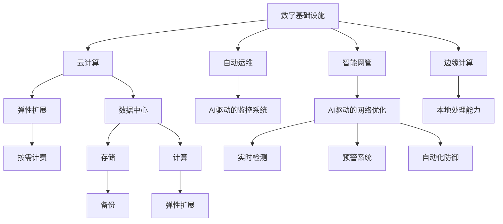

                 

# AI在数字基础设施中的应用

> 关键词：人工智能,数字基础设施,自动运维,智能网管,边缘计算,云计算,网络安全

## 1. 背景介绍

### 1.1 问题由来
在当今数字化时代，数字基础设施（Digital Infrastructure）已经成为了支撑全球经济社会发展的重要基石。从云计算、大数据、物联网、5G通信到区块链、边缘计算，各类数字技术正不断改变我们的工作和生活方式。然而，随着数字基础设施规模的不断扩大，运维管理的复杂性和难度也随之增加，传统的“人工运维+人工管理”模式已经难以满足日益增长的业务需求。

人工智能（AI）技术的兴起为解决这一问题提供了新的思路。通过将AI应用于数字基础设施的各个环节，可以实现自动化运维、智能网管、边缘计算、网络安全等领域的智能化转型，大幅提升数字基础设施的运营效率和用户体验。

### 1.2 问题核心关键点
本文聚焦于AI在数字基础设施中的应用，系统阐述了如何将AI技术应用到自动运维、智能网管、边缘计算和网络安全等场景中，提升基础设施的智能化水平和业务处理能力。

## 2. 核心概念与联系

### 2.1 核心概念概述

为更好地理解AI在数字基础设施中的应用，本节将介绍几个密切相关的核心概念：

- 人工智能(AI)：通过模拟人类的认知过程，让机器具备学习、推理、决策等智能能力的技术。
- 数字基础设施(Digital Infrastructure)：包括云计算、大数据、物联网、5G通信等各类数字技术，是支撑数字经济发展的基础设施。
- 自动运维(Automated Operations)：通过AI技术，实现服务器、网络、应用等基础设施的自动化监控、诊断、故障处理和性能优化。
- 智能网管(Intelligent Network Management)：应用AI技术对网络资源进行智能调度、路由优化和故障预测，提升网络效率和安全性。
- 边缘计算(Edge Computing)：在靠近数据源的本地设备上处理数据，减少延迟，提升响应速度。
- 云计算(Cloud Computing)：通过互联网提供按需计算资源，支持弹性扩展和按使用量付费。
- 网络安全(Cybersecurity)：通过AI技术实现网络攻击的实时检测、预警和防御，保护数据安全。

这些核心概念之间的逻辑关系可以通过以下Mermaid流程图来展示：



这个流程图展示了大语言模型的核心概念及其之间的关系：

1. 数字基础设施通过云计算、自动运维、智能网管、边缘计算等技术进行智能化转型。
2. 云计算提供弹性的计算资源，自动运维实现基础设施的自动化管理。
3. 智能网管优化网络资源配置，边缘计算提升数据处理效率。
4. 网络安全通过AI技术实现实时检测和防御，保护数据安全。

这些概念共同构成了数字基础设施的智能化发展框架，使得基础设施能够更加高效、稳定地服务于各类应用。

## 3. 核心算法原理 & 具体操作步骤
### 3.1 算法原理概述

AI在数字基础设施中的应用，本质上是将AI技术嵌入到基础设施的各个环节中，实现自动化、智能化和高效化。其核心思想是利用机器学习、深度学习、自然语言处理等AI技术，对基础设施的运行数据进行分析和挖掘，自动实现监控、诊断、预测和决策等功能。

具体而言，AI在数字基础设施中的应用主要包括以下几个关键技术：

- 机器学习：利用历史数据训练模型，预测未来趋势，实现智能决策。
- 深度学习：处理大规模复杂数据，提取高级特征，提升识别和推理能力。
- 自然语言处理：理解和生成自然语言，实现智能交互和信息检索。
- 计算机视觉：识别和理解图像、视频等视觉数据，实现自动监控和识别。
- 强化学习：通过与环境互动，优化系统策略，提升自动运维能力。

### 3.2 算法步骤详解

AI在数字基础设施中的应用流程一般包括以下几个关键步骤：

**Step 1: 数据收集与预处理**
- 收集基础设施的运行数据，如服务器性能指标、网络流量、应用日志等。
- 对数据进行清洗、归一化和特征提取，为后续建模提供数据支持。

**Step 2: 模型训练与调优**
- 选择合适的机器学习或深度学习模型，如随机森林、深度神经网络等。
- 利用历史数据对模型进行训练，并通过交叉验证等技术进行调优。
- 应用迁移学习、半监督学习等技术，减少训练样本需求。

**Step 3: 模型部署与监控**
- 将训练好的模型部署到数字基础设施中，进行实时监控和预测。
- 设置模型监控指标，如准确率、召回率、延迟等，确保模型运行效果。
- 定期更新模型参数，优化模型性能。

**Step 4: 应用与优化**
- 将模型应用于自动运维、智能网管、边缘计算和网络安全等场景中。
- 根据应用效果进行优化，如调整模型参数、引入新特征等。
- 持续迭代，提升模型在实际应用中的效果。

### 3.3 算法优缺点

AI在数字基础设施中的应用具有以下优点：
1. 自动化程度高。利用AI技术可以大幅减少人工干预，提升运营效率。
2. 实时性能力强。通过实时监控和预测，可以及时发现和解决问题。
3. 决策精准性高。基于数据的AI模型能够提供更科学、更准确的决策建议。
4. 安全性高。AI驱动的监控和预警系统能够及时检测和防御网络攻击。

同时，该方法也存在一定的局限性：
1. 数据依赖性强。模型的效果高度依赖于数据的质量和数量，数据获取成本较高。
2. 模型复杂度高。复杂模型需要大量计算资源，难以快速部署。
3. 模型解释性差。AI模型通常被视为“黑盒”，难以解释决策过程。
4. 偏见与公平性问题。AI模型可能会学习到数据中的偏见，导致不公平的决策。

尽管存在这些局限性，但就目前而言，AI技术在数字基础设施中的应用仍然具有巨大的发展潜力。未来相关研究的重点在于如何进一步降低数据依赖，提高模型解释性，同时兼顾模型的公平性和安全性等因素。

### 3.4 算法应用领域

AI在数字基础设施中的应用已经涵盖了从自动化运维到智能网管、从边缘计算到网络安全等多个领域，为数字基础设施的智能化转型提供了有力支持。

- 自动运维：利用AI技术实现服务器、网络、应用等基础设施的自动化监控、诊断、故障处理和性能优化。常见应用包括异常检测、自动故障恢复、性能调优等。
- 智能网管：应用AI技术对网络资源进行智能调度、路由优化和故障预测，提升网络效率和安全性。常见应用包括网络流量预测、路由策略优化、网络异常检测等。
- 边缘计算：通过在本地设备上处理数据，减少延迟，提升响应速度。常见应用包括实时图像处理、智能推荐系统、边缘存储等。
- 网络安全：通过AI技术实现网络攻击的实时检测、预警和防御，保护数据安全。常见应用包括入侵检测、恶意行为预测、自动化防御等。

此外，AI技术还广泛应用于智能客服、供应链管理、交通优化等众多领域，为数字基础设施带来了全新的应用场景和价值提升。

## 4. 数学模型和公式 & 详细讲解  
### 4.1 数学模型构建

本节将使用数学语言对AI在数字基础设施中的应用过程进行更加严格的刻画。

记数字基础设施的运行数据为 $D=\{(x_i, y_i)\}_{i=1}^N$，其中 $x_i$ 为输入特征，$y_i$ 为标签。设模型为 $f: X \rightarrow Y$，其中 $X$ 为输入空间，$Y$ 为输出空间。假设模型为线性回归模型，形式为 $f(x) = w_0 + w_1x_1 + \ldots + w_nx_n$，其中 $w_k$ 为模型参数。

定义模型在数据集 $D$ 上的经验风险为：

$$
\mathcal{L}(w) = \frac{1}{N} \sum_{i=1}^N (y_i - f(x_i))^2
$$

最小化经验风险即可得到模型的参数：

$$
\hat{w} = \mathop{\arg\min}_{w} \mathcal{L}(w)
$$

### 4.2 公式推导过程

以下我们以智能网管中网络流量预测为例，推导线性回归模型的预测公式及其梯度计算。

假设模型 $f$ 在输入 $x$ 上的输出为 $\hat{y}=f(x) = w_0 + w_1x_1 + \ldots + w_nx_n$，表示对网络流量的预测。真实标签 $y \in \mathbb{R}$。则网络流量预测的损失函数定义为：

$$
\ell(f(x),y) = (y - \hat{y})^2
$$

将其代入经验风险公式，得：

$$
\mathcal{L}(w) = \frac{1}{N}\sum_{i=1}^N (y_i - f(x_i))^2
$$

根据链式法则，损失函数对模型参数 $w_k$ 的梯度为：

$$
\frac{\partial \mathcal{L}(w)}{\partial w_k} = -\frac{2}{N}\sum_{i=1}^N (y_i - f(x_i))x_i^k
$$

在得到损失函数的梯度后，即可带入模型参数更新公式，完成模型的迭代优化。重复上述过程直至收敛，最终得到适应网络流量预测的模型参数 $\hat{w}$。

### 4.3 案例分析与讲解

以自动运维中的服务器异常检测为例，进行详细讲解。

在自动运维中，服务器异常检测是重要的应用场景之一。通过AI技术，可以实时监控服务器的各项指标，如CPU利用率、内存占用率、磁盘IO等，并判断是否存在异常。

首先，收集服务器的各项指标作为输入特征 $x_i = (x_{i1}, x_{i2}, \ldots, x_{in})$，其中 $x_{ik}$ 为第 $k$ 个特征的取值。然后，通过历史数据训练一个二分类模型 $f(x)$，判断服务器是否存在异常。

假设模型为逻辑回归模型，形式为 $f(x) = \frac{1}{1+e^{-w_0-\sum_{k=1}^n w_kx_{ik}}}$，其中 $w_0, w_1, \ldots, w_n$ 为模型参数。模型的预测结果 $\hat{y} \in \{0, 1\}$，表示服务器是否存在异常。

定义模型在数据集 $D$ 上的经验风险为：

$$
\mathcal{L}(w) = -\frac{1}{N}\sum_{i=1}^N (y_i \log \hat{y_i} + (1-y_i) \log (1-\hat{y_i}))
$$

最小化经验风险即可得到模型的参数：

$$
\hat{w} = \mathop{\arg\min}_{w} \mathcal{L}(w)
$$

通过梯度下降等优化算法，微调过程不断更新模型参数 $w$，最小化损失函数 $\mathcal{L}$，使得模型输出逼近真实标签。重复上述过程直至收敛，最终得到适应服务器异常检测的模型参数 $\hat{w}$。

## 5. 项目实践：代码实例和详细解释说明
### 5.1 开发环境搭建

在进行AI在数字基础设施中的应用实践前，我们需要准备好开发环境。以下是使用Python进行TensorFlow开发的环境配置流程：

1. 安装Anaconda：从官网下载并安装Anaconda，用于创建独立的Python环境。

2. 创建并激活虚拟环境：
```bash
conda create -n tf-env python=3.8 
conda activate tf-env
```

3. 安装TensorFlow：根据CUDA版本，从官网获取对应的安装命令。例如：
```bash
conda install tensorflow -c conda-forge
```

4. 安装TensorBoard：用于可视化模型训练状态。
```bash
pip install tensorboard
```

5. 安装各类工具包：
```bash
pip install numpy pandas scikit-learn matplotlib tqdm jupyter notebook ipython
```

完成上述步骤后，即可在`tf-env`环境中开始AI在数字基础设施中的应用实践。

### 5.2 源代码详细实现

下面我们以智能网管中网络流量预测为例，给出使用TensorFlow进行模型训练的PyTorch代码实现。

首先，定义网络流量预测的数据处理函数：

```python
import tensorflow as tf
import pandas as pd

def read_data(file_path):
    data = pd.read_csv(file_path)
    return data['timestamp'], data['flow_rate']

# 读取数据集
train_timestamps, train_flow_rates = read_data('train.csv')
test_timestamps, test_flow_rates = read_data('test.csv')
```

然后，定义模型和优化器：

```python
from tensorflow.keras import models, layers, optimizers

# 定义模型
model = models.Sequential([
    layers.Dense(64, activation='relu', input_shape=(n_features,)),
    layers.Dense(1)
])

# 定义优化器
optimizer = optimizers.Adam()
```

接着，定义训练和评估函数：

```python
from sklearn.metrics import mean_squared_error

def train_model(model, train_timestamps, train_flow_rates, test_timestamps, test_flow_rates):
    train_dataset = tf.data.Dataset.from_tensor_slices((train_timestamps, train_flow_rates)).shuffle(10000).batch(32)
    test_dataset = tf.data.Dataset.from_tensor_slices((test_timestamps, test_flow_rates)).batch(32)

    model.compile(optimizer=optimizer, loss='mse', metrics=['mae'])
    model.fit(train_dataset, epochs=100, validation_data=test_dataset)

    test_loss = model.evaluate(test_dataset)[0]
    test_mae = mean_squared_error(test_flow_rates, model.predict(test_timestamps))

    return test_loss, test_mae

# 训练模型
test_loss, test_mae = train_model(model, train_timestamps, train_flow_rates, test_timestamps, test_flow_rates)
```

最后，启动训练流程并在测试集上评估：

```python
print(f'Test loss: {test_loss:.4f}')
print(f'Test MAE: {test_mae:.4f}')
```

以上就是使用TensorFlow对智能网管中网络流量预测进行模型训练的完整代码实现。可以看到，得益于TensorFlow的强大封装，我们可以用相对简洁的代码完成网络流量预测模型的训练。

### 5.3 代码解读与分析

让我们再详细解读一下关键代码的实现细节：

**read_data函数**：
- 读取数据集，返回时间戳和流量数据。

**模型定义**：
- 使用Keras框架定义一个包含两个全连接层的模型，其中第一层为64个神经元的ReLU激活函数层，第二层为1个神经元的线性层。

**训练函数train_model**：
- 将时间戳和流量数据转化为TensorFlow可用的格式，定义训练和测试集，使用Adam优化器和均方误差损失函数进行模型训练。
- 设置100个epochs，并在测试集上评估模型表现。

**运行结果展示**：
- 打印出测试集上的损失和MAE（平均绝对误差）。

通过上述代码，我们可以快速搭建并训练一个智能网管中网络流量预测的模型。在实际应用中，还可以根据具体场景，对模型进行更深入的优化和调整。

## 6. 实际应用场景
### 6.1 智能网管

智能网管是AI在数字基础设施中的重要应用场景之一。通过AI技术，可以对网络资源进行智能调度、路由优化和故障预测，提升网络效率和安全性。

在实际应用中，智能网管可以收集网络设备的各项指标，如流量、延迟、丢包率等，并使用机器学习模型对这些指标进行分析，预测网络流量变化趋势，优化网络资源配置，提升网络性能和稳定性。

例如，通过实时监控网络流量，可以及时发现异常流量，并进行自动路由调整，避免网络拥塞和故障。同时，通过预测未来流量，可以提前进行资源扩容，保障网络服务质量。

### 6.2 自动运维

自动运维是AI在数字基础设施中的另一个重要应用场景。通过AI技术，可以实现服务器、网络、应用等基础设施的自动化监控、诊断、故障处理和性能优化，大幅提升运维效率和用户体验。

在实际应用中，自动运维系统可以收集服务器的各项指标，如CPU利用率、内存占用率、磁盘IO等，并使用机器学习模型对这些指标进行分析，判断服务器是否存在异常。一旦发现异常，系统可以自动进行故障处理，如重启服务器、扩容资源等，保障服务稳定运行。

例如，通过实时监控服务器各项指标，可以及时发现CPU负载过高、内存不足等问题，并进行自动扩容，避免系统崩溃。同时，通过预测未来负载，可以提前进行资源调整，避免资源浪费和成本增加。

### 6.3 边缘计算

边缘计算是AI在数字基础设施中的新兴应用场景。通过在本地设备上处理数据，减少延迟，提升响应速度，可以实现更加高效、智能的数据处理和分析。

在实际应用中，边缘计算系统可以将数据在本地进行处理和分析，减少数据传输时间和带宽消耗，提升处理速度和实时性。同时，通过AI技术，可以对数据进行实时监控和分析，发现异常并进行自动处理。

例如，在智能交通系统中，可以通过边缘计算对摄像头采集的实时视频数据进行分析，识别出车辆和行人，并进行自动监控和报警。同时，通过预测车辆和行人行为，可以提前进行交通管制，提升交通安全性。

### 6.4 网络安全

网络安全是AI在数字基础设施中的关键应用场景。通过AI技术，可以实现网络攻击的实时检测、预警和防御，保护数据安全，提升网络安全水平。

在实际应用中，网络安全系统可以实时监控网络流量，识别出异常流量和攻击行为，并进行自动预警和防御。同时，通过机器学习模型对历史攻击数据进行分析，可以预测未来的攻击行为，提前进行防御。

例如，在金融系统中，可以通过网络安全系统实时监控交易数据，识别出异常交易行为，并进行自动预警和防御。同时，通过预测未来交易行为，可以提前进行风险控制，保障金融安全。

## 7. 工具和资源推荐
### 7.1 学习资源推荐

为了帮助开发者系统掌握AI在数字基础设施中的应用理论基础和实践技巧，这里推荐一些优质的学习资源：

1. 《深度学习》系列书籍：由斯坦福大学教授Andrew Ng所著，涵盖深度学习的基本概念和前沿技术，是入门深度学习的首选教材。
2. TensorFlow官方文档：TensorFlow的官方文档，提供了丰富的API和教程，帮助开发者快速上手TensorFlow。
3. Kaggle数据科学竞赛平台：提供大量高质量的数据集和机器学习竞赛，帮助开发者提升实践能力。
4. Coursera机器学习课程：由斯坦福大学教授Andrew Ng主讲的机器学习课程，涵盖机器学习的基本概念和应用。
5. GitHub开源项目：GitHub上众多优秀的AI项目和代码库，提供丰富的学习资源和实践案例。

通过对这些资源的学习实践，相信你一定能够快速掌握AI在数字基础设施中的应用精髓，并用于解决实际的AI问题。

### 7.2 开发工具推荐

高效的开发离不开优秀的工具支持。以下是几款用于AI在数字基础设施中应用的常用工具：

1. TensorFlow：由Google主导开发的开源深度学习框架，生产部署方便，适合大规模工程应用。
2. PyTorch：基于Python的开源深度学习框架，灵活动态的计算图，适合快速迭代研究。
3. Jupyter Notebook：交互式开发环境，支持多语言混合编程，方便开发者进行代码调试和测试。
4. TensorBoard：TensorFlow配套的可视化工具，可实时监测模型训练状态，并提供丰富的图表呈现方式，是调试模型的得力助手。
5. Keras：高层次的神经网络API，基于TensorFlow和Theano，提供简单易用的界面，适合快速原型开发。

合理利用这些工具，可以显著提升AI在数字基础设施中应用的开发效率，加快创新迭代的步伐。

### 7.3 相关论文推荐

AI在数字基础设施中的应用源于学界的持续研究。以下是几篇奠基性的相关论文，推荐阅读：

1. Deep Learning with TensorFlow 2.0：TensorFlow 2.0官方文档，介绍了TensorFlow 2.0的新特性和API，是TensorFlow学习的入门书籍。
2. Neural Network Models and Deep Learning：深度学习基础知识，涵盖了深度学习的基本概念和算法，适合初学者学习。
3. AutoML for Large-Scale Deep Learning：介绍AutoML技术在深度学习中的应用，涵盖自动化模型选择、自动化超参数调优等。
4. Deep Learning for Network Security：深度学习在网络安全中的应用，涵盖深度学习在入侵检测、异常检测等安全领域的应用。
5. Reinforcement Learning for Network Management：强化学习在网络管理中的应用，涵盖网络管理中的自动化和智能决策。

这些论文代表了大语言模型微调技术的发展脉络。通过学习这些前沿成果，可以帮助研究者把握学科前进方向，激发更多的创新灵感。

## 8. 总结：未来发展趋势与挑战
### 8.1 总结

本文对AI在数字基础设施中的应用进行了全面系统的介绍。首先阐述了AI在数字基础设施中的应用背景和意义，明确了AI技术在自动运维、智能网管、边缘计算和网络安全等场景中的独特价值。其次，从原理到实践，详细讲解了AI技术在各个场景中的应用流程和技术细节，给出了AI在数字基础设施中的应用完整代码实例。同时，本文还广泛探讨了AI技术在实际应用中的未来发展趋势和面临的挑战，为未来研究指明了方向。

通过本文的系统梳理，可以看到，AI技术在数字基础设施中的应用前景广阔，通过与大数据、云计算、边缘计算、物联网等技术的深度融合，可以实现智能化、高效化的运营管理，推动数字基础设施的全面升级。未来，伴随AI技术的持续进步，数字基础设施必将迎来新的变革，为经济社会发展和人类进步注入新的动力。

### 8.2 未来发展趋势

展望未来，AI在数字基础设施中的应用将呈现以下几个发展趋势：

1. 模型规模持续增大。随着算力成本的下降和数据规模的扩张，AI模型的参数量还将持续增长。超大规模AI模型蕴含的丰富知识，有望支撑更加复杂多变的应用场景。

2. 智能运维成为常态。AI技术将实现对基础设施的实时监控、故障诊断和自动优化，提升运营效率和用户体验。

3. 决策过程透明化。AI模型将更加注重可解释性，通过引入因果分析和决策图等技术，提升决策的透明性和可解释性。

4. 跨模态融合加速。AI技术将突破视觉、文本、语音等模态的界限，实现多模态数据的融合，提升系统的综合处理能力。

5. 安全保障更加全面。AI技术将结合区块链、零信任架构等安全技术，构建更加全面、高效的安全防护体系。

以上趋势凸显了AI技术在数字基础设施中的广阔前景。这些方向的探索发展，必将进一步提升数字基础设施的智能化水平和业务处理能力，为经济社会发展注入新的动力。

### 8.3 面临的挑战

尽管AI在数字基础设施中的应用已经取得了显著成果，但在迈向更加智能化、普适化应用的过程中，仍面临诸多挑战：

1. 数据隐私问题。AI技术需要大量数据进行训练，数据隐私和安全成为重要问题。如何在保障数据隐私的前提下，利用数据提升AI模型的性能，是需要进一步解决的问题。

2. 算法公平性问题。AI模型可能会学习到数据中的偏见，导致不公平的决策。如何在模型训练和应用中，避免偏见和歧视，保障公平性，需要更多理论和实践的积累。

3. 模型复杂性问题。大型AI模型需要大量的计算资源进行训练和推理，如何优化模型结构，降低计算复杂度，是未来需要突破的技术难题。

4. 模型解释性问题。AI模型通常被视为“黑盒”，难以解释决策过程。如何在保障模型效果的同时，提升模型的可解释性，是未来需要解决的重要问题。

5. 系统安全性问题。AI系统可能面临恶意攻击和数据篡改等风险，如何在模型设计和应用中，增强系统的鲁棒性和安全性，是未来需要解决的关键问题。

尽管存在这些挑战，但AI技术在数字基础设施中的应用仍然具有巨大的发展潜力。未来研究需要在数据隐私、算法公平性、模型复杂性、模型解释性和系统安全性等方面进行更多探索和突破，推动AI技术在数字基础设施中的广泛应用。

### 8.4 研究展望

面对AI在数字基础设施中所面临的挑战，未来的研究需要在以下几个方面寻求新的突破：

1. 数据隐私保护。采用差分隐私、联邦学习等技术，保护数据隐私，同时保障模型训练和应用效果。

2. 模型公平性提升。引入公平性约束、公平性损失函数等技术，提升模型的公平性和可解释性，避免偏见和歧视。

3. 模型结构优化。采用模型压缩、稀疏化存储等技术，优化模型结构，降低计算复杂度，提升模型性能。

4. 模型解释性增强。引入因果分析、决策图等技术，增强模型决策的透明性和可解释性，提升用户信任度。

5. 系统安全性增强。引入区块链、零信任架构等安全技术，构建更加安全可靠的系统，保障系统稳定运行。

这些研究方向的探索，必将引领AI在数字基础设施中的研究进入新的阶段，为构建智能、安全、可靠的数字基础设施铺平道路。面向未来，AI技术还需要与其他人工智能技术进行更深入的融合，如知识表示、因果推理、强化学习等，多路径协同发力，共同推动数字基础设施的全面智能化转型。只有勇于创新、敢于突破，才能不断拓展AI技术的应用边界，为人类社会带来更多的福祉。

## 9. 附录：常见问题与解答

**Q1：AI在数字基础设施中的应用是否适用于所有场景？**

A: AI在数字基础设施中的应用具有广泛的应用前景，但并非所有场景都适用。例如，对于一些需要高度精确性和可靠性的应用，如医疗、金融等，AI技术还需要进一步完善和优化。此外，对于一些需要深度人类理解的任务，如艺术创作、伦理决策等，AI技术目前仍难以完全替代人类。因此，在实际应用中，需要根据具体场景和需求，选择合适的人工智能解决方案。

**Q2：AI在数字基础设施中的应用是否存在安全风险？**

A: AI在数字基础设施中的应用确实存在一定的安全风险，包括模型偏见、数据隐私泄露、模型攻击等。例如，AI模型可能会学习到数据中的偏见，导致不公平的决策。数据隐私泄露问题则涉及大规模数据的存储和传输，可能成为网络攻击的靶标。模型攻击则包括对抗样本攻击、模型逆向工程等，会对模型的安全性和可靠性构成威胁。因此，在实际应用中，需要综合考虑安全因素，并采取相应的安全措施，如数据加密、模型对抗训练、安全审计等。

**Q3：AI在数字基础设施中的应用是否需要大规模数据？**

A: AI在数字基础设施中的应用确实需要大量数据进行训练，以提升模型的准确性和泛化能力。然而，并非所有场景都需要大规模数据。对于一些特定的任务，如异常检测、故障诊断等，可以利用少样本学习、迁移学习等技术，在少量数据上进行有效训练。此外，数据增强、数据合成等技术也可以有效缓解数据不足的问题。因此，在实际应用中，需要根据具体任务和数据情况，灵活选择数据获取和处理策略。

**Q4：AI在数字基础设施中的应用是否需要大量计算资源？**

A: 大型AI模型确实需要大量的计算资源进行训练和推理，但可以通过模型压缩、模型并行等技术，优化模型结构和资源消耗，降低计算复杂度。同时，云计算平台提供了弹性扩展和按需计费的服务，可以在需要时快速获取计算资源，满足AI应用的需求。因此，在实际应用中，可以通过合理配置计算资源，提升AI在数字基础设施中的应用效率。

**Q5：AI在数字基础设施中的应用是否需要专业知识？**

A: 尽管AI在数字基础设施中的应用需要一定的专业知识和技能，但通过学习和实践，可以通过在线课程、开源项目、工具库等资源快速掌握相关技术。例如，TensorFlow、PyTorch等深度学习框架提供了丰富的API和教程，帮助开发者快速上手。此外，Kaggle、GitHub等平台提供了大量的开源项目和数据集，帮助开发者进行学习和实践。因此，在实际应用中，可以通过不断学习和实践，逐步掌握相关技术，提升AI在数字基础设施中的应用能力。

---

作者：禅与计算机程序设计艺术 / Zen and the Art of Computer Programming

