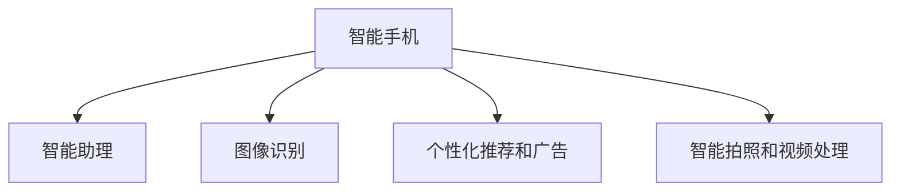

                 

# AI在智能手机中的应用:增强移动体验

## 1. 背景介绍

### 1.1 问题由来

智能手机作为现代生活的标配，其智能化程度已经显著提升。然而，用户界面和交互方式仍相对单一，难以充分满足用户的需求和体验。人工智能（AI）技术的引入，为智能手机的交互体验带来了革命性的变革，使得手机变得更加智能化、个性化和高效。

AI技术在智能手机中的应用，主要体现在以下几个方面：

- **智能助理**：如Siri、Google Assistant、语音助手等，通过语音识别、自然语言处理（NLP）等技术，实现语音控制、语音查询、任务管理等功能，极大提升了用户的操作便捷性和体验。
- **图像识别**：基于深度学习模型的图像识别技术，可以实现人脸识别、文字识别、物体识别等功能，为用户提供更直观、精准的信息获取和交互方式。
- **智能推荐**：通过数据分析和机器学习算法，推荐个性化内容、应用程序和广告，使得手机应用更加贴合用户需求，提高了用户体验和满意度。
- **智能拍照和视频处理**：结合图像识别、图像生成等AI技术，提升手机的拍照和视频处理能力，实现更自然、更高效的图像和视频处理效果。
- **个性化推荐和广告**：通过对用户行为数据的分析和挖掘，实现智能化的推荐和广告展示，提升用户的黏性和满意度。

这些AI技术在智能手机中的应用，正在不断改变用户的使用习惯，提升智能手机的智能化程度和用户满意度。

### 1.2 问题核心关键点

AI在智能手机中的应用，主要围绕以下几个核心问题展开：

- **用户行为分析**：通过数据分析和机器学习算法，理解用户的行为习惯和偏好，从而提供个性化的服务和推荐。
- **智能交互界面**：结合语音识别、自然语言处理等技术，实现更加自然、高效的智能交互。
- **个性化推荐和广告**：根据用户的历史行为和兴趣，推荐个性化内容和广告，提升用户的黏性和满意度。
- **图像和视频处理**：利用AI技术提升手机的拍照和视频处理能力，提供更自然、高效的使用体验。

这些核心问题共同构成了AI在智能手机中的应用框架，推动着手机智能化程度的不断提升。

## 2. 核心概念与联系

### 2.1 核心概念概述

为更好地理解AI在智能手机中的应用，本节将介绍几个密切相关的核心概念：

- **智能手机**：集成了语音、图像、传感器等技术的移动设备，提供多功能、高效、便捷的用户体验。
- **智能助理**：基于语音识别和自然语言处理技术的虚拟助手，实现语音控制、查询、任务管理等功能，提升用户操作便捷性。
- **图像识别**：通过深度学习模型实现人脸识别、文字识别、物体识别等，提供直观、精准的信息获取方式。
- **个性化推荐和广告**：通过数据分析和机器学习算法，推荐个性化内容和广告，提升用户体验和满意度。
- **智能拍照和视频处理**：结合AI技术提升手机的拍照和视频处理能力，提供更自然、高效的使用体验。

这些核心概念之间的逻辑关系可以通过以下Mermaid流程图来展示：



这个流程图展示了智能手机中AI技术的应用场景，说明了各技术之间的相互作用和逻辑关系。

## 3. 核心算法原理 & 具体操作步骤

### 3.1 算法原理概述

AI在智能手机中的应用，主要基于以下几个核心算法原理：

- **语音识别**：基于深度学习模型实现语音信号到文本的转换，如RNN、CNN、LSTM等。
- **自然语言处理**：通过NLP技术理解自然语言，实现文本的语义分析、情感分析、命名实体识别等功能。
- **图像识别**：利用深度学习模型对图像进行特征提取和分类，如CNN、ResNet等。
- **个性化推荐**：基于协同过滤、内容推荐、深度学习等算法，实现个性化推荐。
- **智能拍照和视频处理**：结合图像生成、风格转换等技术，提升拍照和视频处理效果。

### 3.2 算法步骤详解

以下是AI在智能手机中的应用所涉及的核心算法步骤：

**Step 1: 数据收集与预处理**

- 收集用户的历史行为数据，如使用频率、操作路径、停留时间等。
- 对数据进行预处理，包括清洗、归一化、特征工程等，以便后续的分析和建模。

**Step 2: 模型训练与优化**

- 选择适合的机器学习模型（如回归、分类、聚类等），并使用用户行为数据进行训练。
- 根据模型性能进行优化，如调整超参数、使用正则化技术、增加数据增强等。

**Step 3: 模型应用与评估**

- 将训练好的模型应用到智能手机中，实现智能助理、图像识别、个性化推荐等功能。
- 通过用户反馈和A/B测试等手段，评估模型的效果和用户体验。

**Step 4: 模型迭代与优化**

- 根据用户反馈和测试结果，不断迭代和优化模型，提高模型性能和用户体验。
- 引入新的数据和算法，提升模型的准确性和泛化能力。

### 3.3 算法优缺点

AI在智能手机中的应用具有以下优点：

- **提升用户体验**：通过智能助理、个性化推荐等功能，提升用户的便捷性和满意度。
- **智能化功能丰富**：结合语音识别、图像识别、智能拍照等技术，提供多样化、高效的使用体验。
- **个性化推荐**：根据用户行为数据，提供个性化的内容和广告，提升用户的黏性和满意度。

同时，该方法也存在以下局限性：

- **隐私保护问题**：用户行为数据的收集和使用可能涉及隐私问题，需要采取有效的隐私保护措施。
- **计算资源需求高**：深度学习模型的训练和推理需要大量的计算资源，对硬件要求较高。
- **模型泛化能力有限**：不同用户的行为和偏好差异较大，模型难以泛化到所有用户。
- **误识别率较高**：语音识别和图像识别等技术存在一定的误识别率，影响用户体验。

尽管存在这些局限性，但AI在智能手机中的应用，仍然极大地提升了智能手机的智能化程度和用户体验，具有广泛的应用前景。

### 3.4 算法应用领域

AI在智能手机中的应用主要包括以下几个领域：

- **智能助理**：如Siri、Google Assistant等，实现语音控制、查询、任务管理等功能。
- **图像识别**：实现人脸识别、文字识别、物体识别等，提供直观、精准的信息获取方式。
- **个性化推荐和广告**：根据用户行为数据，推荐个性化内容和广告，提升用户体验和满意度。
- **智能拍照和视频处理**：结合AI技术提升拍照和视频处理能力，提供更自然、高效的使用体验。
- **智能家居控制**：结合AI技术，实现对智能家居设备的控制和自动化管理。

## 4. 数学模型和公式 & 详细讲解 & 举例说明

### 4.1 数学模型构建

AI在智能手机中的应用，涉及多个领域的数学模型。以下是其中几个主要模型的数学构建：

- **语音识别模型**：基于深度学习模型（如RNN、CNN、LSTM），将语音信号转换为文本，表示为：
$$
y = \mathcal{F}(x; \theta)
$$
其中，$x$ 表示输入的语音信号，$y$ 表示输出的文本，$\theta$ 表示模型参数。

- **图像识别模型**：利用深度学习模型（如CNN、ResNet）对图像进行特征提取和分类，表示为：
$$
y = \mathcal{G}(x; \theta)
$$
其中，$x$ 表示输入的图像，$y$ 表示分类的标签，$\theta$ 表示模型参数。

- **个性化推荐模型**：基于协同过滤、内容推荐、深度学习等算法，推荐个性化内容，表示为：
$$
y = \mathcal{H}(x; \theta)
$$
其中，$x$ 表示用户的行为数据，$y$ 表示推荐的内容，$\theta$ 表示模型参数。

### 4.2 公式推导过程

以下是语音识别模型的公式推导过程：

- **输入层**：将语音信号转换为频谱特征，表示为：
$$
x_t = \mathcal{F}_t(x; \theta)
$$
其中，$x_t$ 表示时域上的频谱特征，$\theta$ 表示模型参数。

- **隐藏层**：利用RNN模型进行特征提取，表示为：
$$
h_t = \mathcal{R}(h_{t-1}, x_t; \theta)
$$
其中，$h_t$ 表示隐藏层的输出，$h_{t-1}$ 表示前一时刻的隐藏状态，$\theta$ 表示模型参数。

- **输出层**：利用softmax函数将隐藏层的输出映射为文本概率分布，表示为：
$$
y_t = \mathcal{S}(h_t; \theta)
$$
其中，$y_t$ 表示输出文本的概率分布，$\theta$ 表示模型参数。

通过上述公式，实现了从语音信号到文本的转换，即语音识别过程。

### 4.3 案例分析与讲解

**案例一：语音助手**

语音助手如Siri、Google Assistant等，利用深度学习模型实现语音识别和自然语言处理。以Google Assistant为例，其语音识别的过程如下：

1. **数据收集**：收集大量用户语音数据，包括不同的口音、语速、背景噪音等。
2. **模型训练**：使用RNN、LSTM等深度学习模型对语音信号进行特征提取和分类，训练得到语音识别模型。
3. **模型应用**：将用户输入的语音信号输入到训练好的模型中，输出文本，通过NLP技术进行语义分析，实现语音控制、查询、任务管理等功能。

**案例二：智能拍照**

智能拍照技术结合了图像识别、图像生成等AI技术，提升拍照效果。以拍照应用HDR技术为例，其过程如下：

1. **数据收集**：收集大量高质量的图像数据，涵盖不同的光照条件、场景等。
2. **模型训练**：利用深度学习模型（如CNN、ResNet）对图像进行特征提取和分类，训练得到图像生成模型。
3. **模型应用**：在拍照时，将多张不同曝光度的图片输入到训练好的模型中，输出融合后的高质量图像。

## 5. 项目实践：代码实例和详细解释说明

### 5.1 开发环境搭建

在进行AI在智能手机中的应用开发前，我们需要准备好开发环境。以下是使用Python进行TensorFlow开发的环境配置流程：

1. 安装Anaconda：从官网下载并安装Anaconda，用于创建独立的Python环境。

2. 创建并激活虚拟环境：
```bash
conda create -n tf-env python=3.8 
conda activate tf-env
```

3. 安装TensorFlow：根据CUDA版本，从官网获取对应的安装命令。例如：
```bash
conda install tensorflow -c conda-forge
```

4. 安装Keras：
```bash
pip install keras
```

5. 安装各类工具包：
```bash
pip install numpy pandas scikit-learn matplotlib tqdm jupyter notebook ipython
```

完成上述步骤后，即可在`tf-env`环境中开始AI在智能手机中的应用开发。

### 5.2 源代码详细实现

这里以语音助手为例，给出使用TensorFlow和Keras库实现语音识别的代码实现。

首先，定义语音识别模型：

```python
from tensorflow.keras.models import Sequential
from tensorflow.keras.layers import Input, LSTM, Dense

model = Sequential()
model.add(LSTM(128, input_shape=(None, 1), return_sequences=True))
model.add(Dense(128, activation='relu'))
model.add(Dense(10, activation='softmax'))

model.compile(loss='categorical_crossentropy', optimizer='adam', metrics=['accuracy'])
```

然后，训练模型：

```python
from tensorflow.keras.preprocessing.sequence import pad_sequences
from tensorflow.keras.datasets import mnist

(X_train, y_train), (X_test, y_test) = mnist.load_data()
X_train = pad_sequences(X_train, maxlen=100, padding='post')
X_test = pad_sequences(X_test, maxlen=100, padding='post')

model.fit(X_train, y_train, epochs=10, batch_size=64, validation_data=(X_test, y_test))
```

最后，评估模型：

```python
test_loss, test_acc = model.evaluate(X_test, y_test)
print('Test accuracy:', test_acc)
```

以上就是使用TensorFlow和Keras库实现语音识别的完整代码实现。可以看到，Keras库简化了深度学习模型的构建和训练过程，使得开发者可以快速迭代研究。

### 5.3 代码解读与分析

让我们再详细解读一下关键代码的实现细节：

**模型定义**：
- 首先定义了一个基于LSTM的序列模型，包含一个LSTM层、一个ReLU激活层和一个Softmax输出层。
- LSTM层用于对语音信号进行特征提取，输出维度为128。
- 输出层包含10个神经元，表示10个可能的分词结果，使用softmax函数将输出转换为概率分布。

**数据预处理**：
- 使用`pad_sequences`函数对输入数据进行填充，确保所有样本的长度一致。
- 加载MNIST数据集，将其转换为模型所需格式。

**模型训练**：
- 使用`fit`函数训练模型，设置10个epoch、64个batch size，以及交叉熵损失和Adam优化器。
- 在训练过程中，使用测试集进行验证，评估模型性能。

**模型评估**：
- 使用`evaluate`函数评估模型在测试集上的性能，输出测试准确率。

可以看到，TensorFlow和Keras库使得AI在智能手机中的应用开发变得更加简洁高效。开发者可以将更多精力放在数据处理、模型改进等高层逻辑上，而不必过多关注底层的实现细节。

当然，工业级的系统实现还需考虑更多因素，如模型的保存和部署、超参数的自动搜索、更灵活的任务适配层等。但核心的AI在智能手机中的应用范式基本与此类似。

## 6. 实际应用场景

### 6.1 智能助理

智能助理如Siri、Google Assistant等，在智能手机中的应用非常广泛。用户可以通过语音指令控制手机、查询信息、管理任务等，极大提升了操作的便捷性和效率。

在技术实现上，智能助理结合了语音识别、自然语言处理、语音合成等技术，通过深度学习模型实现对语音信号的分析和理解。微调后的模型能够更准确地识别和理解用户的语音指令，提高响应的准确性和自然性。

**实际应用案例**：
- **语音控制**：用户通过语音指令打开相机、设置闹钟、发送短信等。
- **信息查询**：用户询问天气、股票信息、新闻资讯等，智能助理能够快速提供相关信息。
- **任务管理**：用户设置任务提醒、制定日程安排等，智能助理能够提醒用户完成任务。

### 6.2 图像识别

图像识别技术在智能手机中的应用也非常广泛，如人脸识别解锁、文字识别、物体识别等，提升了手机的使用便捷性和安全性。

在技术实现上，图像识别结合了深度学习模型（如CNN、ResNet），通过特征提取和分类技术，实现对图像的识别。微调后的模型能够更准确地识别各种类型的图像，提高识别的精度和鲁棒性。

**实际应用案例**：
- **人脸识别解锁**：用户通过人脸识别解锁手机，极大提升了手机的安全性。
- **文字识别**：用户通过拍照识别文本，自动输入信息，减少了输入的复杂度。
- **物体识别**：用户通过拍照识别物品，自动生成购物清单或提供相关建议。

### 6.3 个性化推荐和广告

个性化推荐和广告技术在智能手机中的应用，能够根据用户的行为和偏好，推荐个性化的内容和广告，提升用户的黏性和满意度。

在技术实现上，个性化推荐结合了协同过滤、内容推荐、深度学习等算法，通过对用户行为数据的分析和挖掘，实现个性化推荐。微调后的模型能够更准确地理解用户需求，提供更精准的推荐结果。

**实际应用案例**：
- **内容推荐**：智能推荐新闻、视频、音乐等，提升用户体验。
- **广告推荐**：根据用户的历史行为，推荐个性化的广告，提升广告的点击率和转化率。

### 6.4 未来应用展望

随着AI技术的不断发展，基于智能手机应用的AI技术也将更加丰富和多样化。未来，AI在智能手机中的应用将呈现以下几个趋势：

1. **智能化程度提升**：结合多模态数据（如语音、图像、传感器数据），实现更全面、更智能的交互方式。
2. **个性化推荐和广告的优化**：通过更高级的算法和更精准的用户画像，实现更个性化、更高效的推荐和广告展示。
3. **智能家居和物联网的结合**：通过AI技术实现对智能家居设备和物联网设备的控制和自动化管理，提升生活的便捷性和舒适性。
4. **智能安全和隐私保护**：利用AI技术提升智能手机的安全性，保护用户的隐私和数据安全。

## 7. 工具和资源推荐

### 7.1 学习资源推荐

为了帮助开发者系统掌握AI在智能手机中的应用理论基础和实践技巧，这里推荐一些优质的学习资源：

1. **《深度学习》课程**：斯坦福大学开设的深度学习课程，由深度学习领域的权威专家讲授，涵盖了深度学习的基本概念和算法。
2. **TensorFlow官方文档**：TensorFlow的官方文档，提供了详细的API文档和代码示例，是TensorFlow开发的重要参考。
3. **Keras官方文档**：Keras的官方文档，提供了易于使用的深度学习模型，帮助开发者快速构建和训练模型。
4. **《Python深度学习》书籍**：由深度学习领域的知名专家撰写，介绍了深度学习在Python中的实现，是深度学习开发的重要参考。
5. **PyTorch官方文档**：PyTorch的官方文档，提供了详细的API文档和代码示例，是PyTorch开发的重要参考。

通过对这些资源的学习实践，相信你一定能够快速掌握AI在智能手机中的应用精髓，并用于解决实际的AI问题。

### 7.2 开发工具推荐

高效的开发离不开优秀的工具支持。以下是几款用于AI在智能手机中的应用开发的常用工具：

1. **TensorFlow**：由Google主导开发的深度学习框架，生产部署方便，适合大规模工程应用。
2. **Keras**：基于TensorFlow的高层API，易于使用，适合快速迭代研究。
3. **PyTorch**：由Facebook主导开发的深度学习框架，灵活动态的计算图，适合快速迭代研究。
4. **Jupyter Notebook**：交互式的Python开发环境，支持代码执行、可视化等功能，适合研究和实验。
5. **Google Colab**：免费的在线Jupyter Notebook环境，方便开发者快速上手实验最新模型，分享学习笔记。

合理利用这些工具，可以显著提升AI在智能手机中的应用开发效率，加快创新迭代的步伐。

### 7.3 相关论文推荐

AI在智能手机中的应用源于学界的持续研究。以下是几篇奠基性的相关论文，推荐阅读：

1. **《深度学习》**：Yoshua Bengio等著，介绍了深度学习的基本概念和算法，是深度学习研究的重要基础。
2. **《TensorFlow深度学习》**：Miro's团队著，介绍了TensorFlow的基本用法和API，是TensorFlow开发的重要参考。
3. **《Keras深度学习》**：François Chollet著，介绍了Keras的基本用法和API，是Keras开发的重要参考。
4. **《深度学习在智能手机中的应用》**：郭金龙等著，介绍了深度学习在智能手机中的具体应用，是AI在智能手机中应用的重要参考。
5. **《智能助理和语音识别》**：王飞跃等著，介绍了智能助理和语音识别的基本原理和实现方法，是智能助理和语音识别开发的重要参考。

这些论文代表了大语言模型微调技术的发展脉络。通过学习这些前沿成果，可以帮助研究者把握学科前进方向，激发更多的创新灵感。

## 8. 总结：未来发展趋势与挑战

### 8.1 总结

本文对AI在智能手机中的应用进行了全面系统的介绍。首先阐述了AI在智能手机中的应用背景和意义，明确了AI在智能手机中的应用价值。其次，从原理到实践，详细讲解了AI在智能手机中的应用数学模型和操作步骤，给出了AI在智能手机中的应用完整代码实例。同时，本文还广泛探讨了AI在智能手机中的应用场景，展示了AI技术在智能手机中的应用前景。此外，本文精选了AI在智能手机中的应用学习资源，力求为读者提供全方位的技术指引。

通过本文的系统梳理，可以看到，AI在智能手机中的应用极大地提升了智能手机的智能化程度和用户体验，具有广泛的应用前景。未来，伴随AI技术的持续演进，AI在智能手机中的应用将不断拓展，为智能手机智能化带来更多突破和变革。

### 8.2 未来发展趋势

展望未来，AI在智能手机中的应用将呈现以下几个发展趋势：

1. **智能化程度提升**：结合多模态数据（如语音、图像、传感器数据），实现更全面、更智能的交互方式。
2. **个性化推荐和广告的优化**：通过更高级的算法和更精准的用户画像，实现更个性化、更高效的推荐和广告展示。
3. **智能家居和物联网的结合**：通过AI技术实现对智能家居设备和物联网设备的控制和自动化管理，提升生活的便捷性和舒适性。
4. **智能安全和隐私保护**：利用AI技术提升智能手机的安全性，保护用户的隐私和数据安全。

以上趋势凸显了AI在智能手机中的应用前景。这些方向的探索发展，必将进一步提升智能手机的智能化程度和用户体验，为智能手机智能化带来更多突破和变革。

### 8.3 面临的挑战

尽管AI在智能手机中的应用已经取得了显著成果，但在迈向更加智能化、普适化应用的过程中，仍面临诸多挑战：

1. **计算资源瓶颈**：深度学习模型的训练和推理需要大量的计算资源，对硬件要求较高。
2. **隐私保护问题**：用户行为数据的收集和使用可能涉及隐私问题，需要采取有效的隐私保护措施。
3. **模型泛化能力有限**：不同用户的行为和偏好差异较大，模型难以泛化到所有用户。
4. **误识别率较高**：语音识别和图像识别等技术存在一定的误识别率，影响用户体验。

尽管存在这些挑战，但AI在智能手机中的应用仍然具有广阔的前景，相信通过技术创新和工程实践，这些挑战终将一一被克服。

### 8.4 研究展望

面对AI在智能手机应用中面临的挑战，未来的研究需要在以下几个方面寻求新的突破：

1. **更高效的数据处理和特征提取**：通过数据压缩、特征选择等技术，提高数据处理和特征提取的效率，降低计算资源的需求。
2. **更准确和鲁棒的模型训练**：通过更好的正则化技术、更好的损失函数设计，提高模型的泛化能力和鲁棒性。
3. **更灵活和可解释的模型设计**：通过更可解释的模型结构和更可解释的算法，提高模型的可解释性和可信度。
4. **更安全和隐私保护的模型设计**：通过更好的隐私保护技术和更好的数据加密技术，提高模型的隐私保护能力。

这些研究方向的探索，必将引领AI在智能手机中的应用走向更高的台阶，为智能手机的智能化和普适化提供新的技术路径。

## 9. 附录：常见问题与解答

**Q1: 如何提升AI在智能手机中的计算效率？**

A: 可以通过以下方式提升AI在智能手机中的计算效率：
1. **模型剪枝**：去除冗余的神经元和层，减小模型规模，降低计算资源的需求。
2. **量化加速**：将浮点模型转为定点模型，减少存储空间和计算资源的需求。
3. **混合精度训练**：使用更小的数据类型（如16位）进行训练，减少计算资源的需求。
4. **模型并行**：使用多卡并行训练，提高训练和推理的速度。

**Q2: 如何在AI在智能手机中的应用中保护用户隐私？**

A: 可以在AI在智能手机中的应用中采取以下隐私保护措施：
1. **数据匿名化**：对用户数据进行匿名化处理，防止数据泄露。
2. **差分隐私**：在数据处理和模型训练过程中，加入噪声，防止数据泄露。
3. **本地计算**：在本地设备上进行数据处理和模型训练，减少数据传输和存储的风险。
4. **用户控制**：赋予用户对数据收集和使用的控制权，让用户自主决定是否分享数据。

**Q3: 如何提高AI在智能手机中的应用模型的泛化能力？**

A: 可以通过以下方式提高AI在智能手机中的应用模型的泛化能力：
1. **更多的数据**：收集更多的数据，增加模型的训练样本。
2. **更好的特征选择**：选择更好的特征，提高模型的泛化能力。
3. **更好的正则化**：使用更好的正则化技术，防止过拟合。
4. **更好的模型选择**：选择更好的模型，提高模型的泛化能力。

**Q4: 如何在AI在智能手机中的应用中减少误识别率？**

A: 可以通过以下方式减少AI在智能手机中的应用中的误识别率：
1. **更好的数据预处理**：对数据进行更好的预处理，减少噪音和干扰。
2. **更好的模型设计**：使用更好的模型结构和更好的损失函数，提高模型的准确性。
3. **更好的超参数调优**：对超参数进行更好的调优，提高模型的鲁棒性。
4. **更好的数据增强**：使用更好的数据增强技术，提高模型的泛化能力。

**Q5: 如何设计更灵活和可解释的AI在智能手机中的应用模型？**

A: 可以通过以下方式设计更灵活和可解释的AI在智能手机中的应用模型：
1. **更可解释的模型结构**：使用更可解释的模型结构，提高模型的可解释性。
2. **更可解释的算法**：使用更可解释的算法，提高模型的可解释性。
3. **更好的用户交互界面**：设计更好的用户交互界面，提高用户的理解和信任。
4. **更好的模型调试和优化**：通过更好的模型调试和优化，提高模型的鲁棒性和可解释性。

这些问答帮助读者更好地理解AI在智能手机中的应用，并在实际应用中克服遇到的挑战。

---

作者：禅与计算机程序设计艺术 / Zen and the Art of Computer Programming

