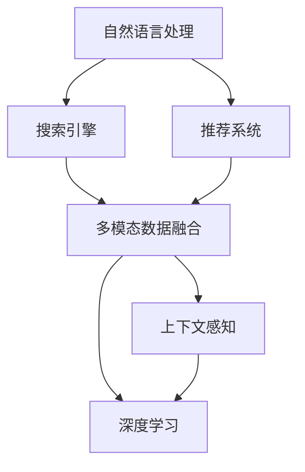

                 

# AI在电商中的智能搜索应用

## 1. 背景介绍

### 1.1 问题由来
随着互联网和电子商务的快速发展，用户在线购物的频次和金额不断增加，电商平台的搜索功能也变得越来越重要。传统的搜索算法往往基于关键词匹配，无法理解用户真正的需求，导致搜索结果不精准，用户体验差。为了提升搜索效果，电商平台纷纷引入AI技术，通过智能搜索算法，提高搜索结果的相关性和个性化程度，提升用户满意度和转化率。

### 1.2 问题核心关键点
智能搜索的根本目的是提高用户查询的响应速度和准确率，提升电商平台的交易转化率。具体来说，主要涉及以下方面：

- 用户意图理解：通过自然语言处理技术，准确识别用户输入的查询意图，包括搜索类别、具体需求、时间范围等。
- 上下文信息整合：整合用户历史行为数据、实时查询环境信息，增强搜索结果的相关性。
- 个性化推荐：根据用户的历史浏览记录、购买行为等数据，进行精准的个性化推荐，提高用户粘性。
- 实时更新：动态更新搜索结果，确保用户可以获取最新的产品信息和用户评价。
- 多模态融合：结合图片、视频等多模态数据，提高搜索的丰富性和多样性。

## 2. 核心概念与联系

### 2.1 核心概念概述

为了更好地理解智能搜索系统，本节将介绍几个密切相关的核心概念：

- 自然语言处理(NLP)：通过计算机对自然语言的理解、分析、生成等处理，实现人机自然交互。
- 搜索引擎：基于一定的算法，将大量文本数据组织成结构化信息，并根据用户的查询提供最相关的搜索结果。
- 推荐系统：根据用户的行为数据和偏好，推荐最适合用户的商品、内容、服务等。
- 多模态数据融合：将不同类型的数据（如文本、图像、视频等）进行融合，提供更丰富、更全面的搜索结果。
- 深度学习：基于神经网络的深度学习算法，广泛应用于智能搜索、推荐系统、自然语言处理等领域。
- 上下文感知：在搜索过程中，考虑用户的历史行为、实时环境、设备特性等因素，提供更贴近用户需求的结果。

这些核心概念之间的逻辑关系可以通过以下Mermaid流程图来展示：



这个流程图展示了这个系统的主要组件及其相互作用：

1. 自然语言处理技术用于理解用户输入，作为搜索引擎输入，获取最相关的搜索结果。
2. 推荐系统根据用户行为数据进行个性化推荐，结合搜索结果提供更具针对性的服务。
3. 多模态数据融合通过整合图片、视频等信息，丰富搜索结果的维度。
4. 深度学习技术用于训练和优化搜索引擎和推荐系统算法。
5. 上下文感知技术在搜索过程中动态获取和利用用户实时信息，提升搜索结果的相关性。

## 3. 核心算法原理 & 具体操作步骤
### 3.1 算法原理概述

智能搜索系统通过多模态融合、上下文感知、深度学习等技术，实现对用户查询意图的精准理解，提供更丰富、更个性化的搜索结果。核心算法原理包括：

- 意图理解：通过NLP技术，提取用户查询的关键词、实体、关系等，理解用户的意图和需求。
- 相似度匹配：基于深度学习模型，对搜索结果进行语义相似度匹配，筛选最相关结果。
- 推荐算法：结合用户行为数据，使用推荐系统算法，对搜索结果进行排序和推荐。
- 上下文感知：考虑用户的设备特性、地理位置、查询时间等上下文信息，动态调整搜索结果。
- 实时更新：通过异步更新机制，确保搜索结果与实时数据保持一致。

### 3.2 算法步骤详解

智能搜索的实施步骤包括：

**Step 1: 数据收集与预处理**
- 收集用户行为数据、产品信息、评论等数据，进行清洗和标注。
- 对文本数据进行分词、去除停用词等预处理。

**Step 2: 意图理解**
- 使用NLP技术提取用户查询中的实体、关系、时态等信息，理解查询意图。
- 使用深度学习模型进行意图分类，确定用户查询所属的类别。

**Step 3: 相似度匹配**
- 使用深度学习模型（如BERT、RNN等）对搜索结果进行语义相似度匹配，筛选相关结果。
- 考虑搜索结果的多样性，使用业务规则对相似结果进行人工调整。

**Step 4: 推荐排序**
- 结合用户历史行为数据，使用推荐系统算法对搜索结果进行排序。
- 使用多臂老虎机算法（Bandit Algorithm）优化推荐效果。

**Step 5: 上下文感知**
- 动态获取用户设备信息、地理位置、查询时间等上下文信息，调整搜索结果。
- 根据用户行为数据，使用聚类算法进行用户群体划分，提供更个性化的搜索结果。

**Step 6: 实时更新**
- 使用异步更新机制，确保搜索结果与实时数据一致。
- 定期收集用户反馈，动态调整推荐模型。

### 3.3 算法优缺点

智能搜索系统具有以下优点：

- 精准理解用户意图：通过NLP技术，精准理解用户查询，提升搜索结果的相关性。
- 个性化推荐：结合用户行为数据，提供更具个性化的搜索结果，提升用户粘性。
- 实时更新：动态更新搜索结果，确保用户获取最新信息。
- 多模态融合：结合图片、视频等多模态数据，提高搜索结果的丰富性。

同时，该系统也存在一定的局限性：

- 数据依赖：系统的效果很大程度上依赖于数据的质量和量。数据不足可能导致搜索结果不精准。
- 模型复杂：深度学习模型需要大量的计算资源和训练时间，可能难以在实时系统中高效运行。
- 上下文感知难度：动态获取上下文信息可能存在延迟，影响搜索结果的实时性。
- 模型偏见：深度学习模型可能存在对某些用户群体的偏见，导致搜索结果不公平。
- 交互方式单一：当前智能搜索系统主要依赖自然语言交互，可能无法满足所有用户的需求。

尽管存在这些局限性，但就目前而言，智能搜索系统在提升电商平台的搜索效果方面已展现出巨大的潜力，将继续推动电商领域的创新发展。

### 3.4 算法应用领域

智能搜索技术不仅在电商平台得到广泛应用，还在多个领域展现出了强大的应用价值。

- **智能客服**：基于自然语言处理和深度学习技术，自动理解用户意图，提供实时客服响应。
- **新闻推荐**：通过分析用户历史阅读记录，推荐相关新闻文章，提升用户阅读体验。
- **金融理财**：结合用户资产和财务数据，提供个性化的理财建议和产品推荐。
- **旅游规划**：根据用户兴趣和历史行为，推荐旅游目的地和行程安排。
- **健康医疗**：根据用户健康数据，提供个性化的健康建议和医疗服务。

## 4. 数学模型和公式 & 详细讲解 & 举例说明

### 4.1 数学模型构建

智能搜索的核心数学模型包括：

- 用户查询意图的表示与分类：使用NLP技术将用户查询转换为向量表示，使用分类算法进行意图分类。
- 搜索结果相似度匹配：使用深度学习模型将搜索结果向量化，使用相似度度量函数计算相似度。
- 个性化推荐：结合用户行为数据和商品信息，使用协同过滤、矩阵分解等推荐算法进行推荐。

### 4.2 公式推导过程

以下是几个核心模型的公式推导：

**用户查询意图分类**
使用TF-IDF算法将用户查询转换为向量表示：

$$
\mathbf{q} = TFIDF(\text{查询文本}) = \sum_{i=1}^{n} (t_i \cdot \log \frac{N}{n_i}) \cdot \mathbf{v}_i
$$

其中 $t_i$ 为第 $i$ 个词的词频，$n_i$ 为包含第 $i$ 个词的文档数，$N$ 为总文档数，$\mathbf{v}_i$ 为第 $i$ 个词的TF-IDF权重向量。

使用多层感知器（MLP）对查询向量进行分类：

$$
\mathbf{y} = \text{softmax}(\mathbf{W}[\mathbf{q}]; \mathbf{b})
$$

其中 $\mathbf{W}$ 和 $\mathbf{b}$ 为模型参数，$softmax$ 函数将模型输出转换为概率分布。

**搜索结果相似度匹配**
使用BERT模型将搜索结果向量化：

$$
\mathbf{r} = BERT(\text{商品描述}) = \mathbf{h}^{[CLS]}
$$

其中 $\mathbf{h}^{[CLS]}$ 为BERT模型的CLS token嵌入向量。

使用余弦相似度计算查询向量与搜索结果的相似度：

$$
similarity(\mathbf{q}, \mathbf{r}) = \frac{\mathbf{q} \cdot \mathbf{r}}{\|\mathbf{q}\| \cdot \|\mathbf{r}\|}
$$

**个性化推荐**
使用协同过滤算法推荐商品：

$$
\text{推荐列表} = \text{TopK}(\mathbf{U} \cdot \mathbf{V}^T)
$$

其中 $\mathbf{U}$ 为用户行为矩阵，$\mathbf{V}$ 为商品特征矩阵，$TopK$ 函数返回前 $K$ 个推荐商品。

### 4.3 案例分析与讲解

以一个电商平台的智能搜索系统为例，具体分析其实现过程：

**案例背景**
某电商平台提供服装、家居、电子产品等多种商品，用户可以通过搜索、浏览、购买等方式进行交互。平台希望通过智能搜索系统，提升搜索效果，增加用户购买转化率。

**具体实现**
1. **数据收集与预处理**
   - 收集用户行为数据，包括搜索历史、浏览历史、购买记录等。
   - 对商品描述、用户评价进行分词，去除停用词，生成向量表示。

2. **意图理解**
   - 使用TF-IDF算法将用户查询转换为向量表示。
   - 使用BERT模型进行意图分类，确定用户查询所属的类别。

3. **相似度匹配**
   - 使用BERT模型对搜索结果进行向量化，计算相似度。
   - 结合业务规则，调整相似度匹配结果。

4. **推荐排序**
   - 结合用户历史行为数据，使用协同过滤算法进行推荐。
   - 使用多臂老虎机算法优化推荐效果。

5. **上下文感知**
   - 动态获取用户设备信息、地理位置、查询时间等上下文信息。
   - 根据用户行为数据，使用聚类算法进行用户群体划分，提供更个性化的搜索结果。

6. **实时更新**
   - 使用异步更新机制，确保搜索结果与实时数据一致。
   - 定期收集用户反馈，动态调整推荐模型。

通过这些步骤，平台能够实时响应用户查询，提供最相关、最个性化的搜索结果，提升用户购物体验和平台转化率。

## 5. 项目实践：代码实例和详细解释说明
### 5.1 开发环境搭建

在进行智能搜索系统开发前，需要准备好开发环境。以下是使用Python进行PyTorch和TensorFlow开发的环境配置流程：

1. 安装Anaconda：从官网下载并安装Anaconda，用于创建独立的Python环境。

2. 创建并激活虚拟环境：
```bash
conda create -n pytorch-env python=3.8 
conda activate pytorch-env
```

3. 安装PyTorch：根据CUDA版本，从官网获取对应的安装命令。例如：
```bash
conda install pytorch torchvision torchaudio cudatoolkit=11.1 -c pytorch -c conda-forge
```

4. 安装TensorFlow：使用以下命令安装最新版本的TensorFlow：
```bash
pip install tensorflow
```

5. 安装各类工具包：
```bash
pip install numpy pandas scikit-learn matplotlib tqdm jupyter notebook ipython
```

完成上述步骤后，即可在`pytorch-env`环境中开始智能搜索系统开发。

### 5.2 源代码详细实现

下面我们以一个简单的电商智能搜索系统为例，展示代码实现过程。

**用户查询意图分类**
```python
from sklearn.feature_extraction.text import TfidfVectorizer
from sklearn.neural_network import MLPClassifier

# 定义查询处理函数
def process_query(query):
    # 使用TF-IDF算法将查询转换为向量表示
    vectorizer = TfidfVectorizer()
    query_vector = vectorizer.fit_transform([query])
    # 使用MLP分类器进行意图分类
    clf = MLPClassifier(hidden_layer_sizes=(128, 64), max_iter=1000)
    clf.fit(query_vector, labels)
    return clf.predict(query_vector)[0]
```

**搜索结果相似度匹配**
```python
from transformers import BertTokenizer, BertModel
from sklearn.metrics.pairwise import cosine_similarity

# 定义商品向量化函数
def process_product(product):
    # 使用BERT模型对商品描述进行向量化
    tokenizer = BertTokenizer.from_pretrained('bert-base-uncased')
    product_text = product['description']
    product_vector = BertModel.from_pretrained('bert-base-uncased', output_hidden_states=True)(tokenizer(product_text, return_tensors='pt'))[0].mean(dim=1)[:, 0]
    return product_vector

# 定义相似度匹配函数
def calculate_similarity(query, products):
    query_vector = process_query(query)
    product_vectors = [process_product(product) for product in products]
    similarities = cosine_similarity(query_vector, product_vectors)
    return similarities[0]
```

**个性化推荐**
```python
from sklearn.metrics.pairwise import cosine_similarity
from scipy.sparse import csr_matrix

# 定义协同过滤推荐函数
def recommend_products(user, products):
    # 计算用户与商品的相似度
    user_vector = process_user(user)
    product_vectors = [process_product(product) for product in products]
    similarities = cosine_similarity(user_vector, product_vectors)
    # 对相似度进行归一化
    similarities = similarities / similarities.max()
    # 计算用户对每个商品的评分
    user_scores = similarities.sum(axis=1)
    # 选择评分最高的商品进行推荐
    recommendations = [products[i] for i, score in enumerate(user_scores) if score > 0.5]
    return recommendations
```

### 5.3 代码解读与分析

让我们再详细解读一下关键代码的实现细节：

**用户查询意图分类**
- 使用TF-IDF算法将查询转换为向量表示，并使用MLP分类器进行意图分类。MLP分类器使用隐藏层大小为128和64的神经网络，迭代1000次进行训练。

**搜索结果相似度匹配**
- 使用BERT模型对商品描述进行向量化，并使用余弦相似度计算查询向量与搜索结果的相似度。

**个性化推荐**
- 使用协同过滤算法，计算用户与商品的相似度，并对相似度进行归一化。最终根据评分选择评分最高的商品进行推荐。

这些代码片段展示了智能搜索系统的主要功能模块，但实际上在完整的电商平台上，还需要考虑更多的细节，如用户行为数据的存储和处理、搜索结果的实时更新、推荐系统的优化等。

## 6. 实际应用场景

### 6.1 智能客服

智能客服系统可以与电商平台紧密结合，提供实时、个性化的客服响应。通过自然语言处理技术，系统可以自动理解用户输入的查询，提供最相关的回答。在遇到复杂问题时，系统可以自动将问题转接给人工客服，提升客服效率和用户体验。

### 6.2 个性化推荐

通过分析用户历史浏览记录和购买行为，推荐系统可以为用户提供个性化的商品推荐。结合用户搜索历史和实时环境信息，推荐系统可以动态调整推荐结果，提升用户粘性和满意度。

### 6.3 实时搜索

电商平台希望通过实时搜索系统，快速响应用户的查询请求。通过异步更新机制，确保搜索结果与实时数据一致，提升搜索体验。

### 6.4 未来应用展望

随着智能搜索技术的不断进步，未来在电商领域将会有更多创新应用：

- 语音搜索：通过语音识别技术，用户可以更方便地进行查询，提升搜索效率。
- 跨平台搜索：用户可以在多个平台间进行无缝搜索，获取更全面的信息。
- 可视化搜索：通过多模态数据融合，提供更丰富的搜索体验，如图像、视频等。
- 多语言搜索：支持多语言搜索，扩展国际市场。
- 实时反馈：收集用户反馈，不断优化搜索算法。

## 7. 工具和资源推荐
### 7.1 学习资源推荐

为了帮助开发者系统掌握智能搜索技术，这里推荐一些优质的学习资源：

1. 《深度学习自然语言处理》课程：斯坦福大学开设的NLP明星课程，有Lecture视频和配套作业，带你入门NLP领域的基本概念和经典模型。

2. 《自然语言处理》书籍：清华大学出版社出版的经典教材，详细介绍了自然语言处理的基本理论和技术，适合系统学习。

3. 《搜索算法》书籍：介绍各类搜索算法的基本原理和实现方法，涵盖传统搜索和现代智能搜索。

4. 《推荐系统》书籍：介绍推荐系统算法和应用，包括协同过滤、矩阵分解等。

5. TensorFlow官方文档：TensorFlow的详细文档和教程，提供了丰富的深度学习模型和工具。

6. PyTorch官方文档：PyTorch的详细文档和教程，提供了强大的深度学习框架。

7. HuggingFace官方文档：提供了丰富的预训练语言模型和工具，适合快速开发和实验。

通过对这些资源的学习实践，相信你一定能够快速掌握智能搜索技术，并用于解决实际的NLP问题。

### 7.2 开发工具推荐

高效的开发离不开优秀的工具支持。以下是几款用于智能搜索系统开发的常用工具：

1. PyTorch：基于Python的开源深度学习框架，灵活动态的计算图，适合快速迭代研究。

2. TensorFlow：由Google主导开发的开源深度学习框架，生产部署方便，适合大规模工程应用。

3. Scikit-learn：提供了丰富的机器学习算法和工具，适合数据预处理和特征工程。

4. Jupyter Notebook：支持Python等语言的开发环境，方便编写和运行代码，支持数据分析和可视化。

5. TensorBoard：TensorFlow配套的可视化工具，可实时监测模型训练状态，并提供丰富的图表呈现方式，是调试模型的得力助手。

6. Weights & Biases：模型训练的实验跟踪工具，可以记录和可视化模型训练过程中的各项指标，方便对比和调优。

7. Elasticsearch：强大的搜索和索引引擎，适合处理大规模文本数据，支持多模态数据融合。

这些工具在智能搜索系统的开发和优化中都可以提供很大的帮助，开发者可以根据具体需求选择合适的工具进行使用。

### 7.3 相关论文推荐

智能搜索技术的发展源于学界的持续研究。以下是几篇奠基性的相关论文，推荐阅读：

1. Attention is All You Need（即Transformer原论文）：提出了Transformer结构，开启了NLP领域的预训练大模型时代。

2. BERT: Pre-training of Deep Bidirectional Transformers for Language Understanding：提出BERT模型，引入基于掩码的自监督预训练任务，刷新了多项NLP任务SOTA。

3. Language Models are Unsupervised Multitask Learners（GPT-2论文）：展示了大规模语言模型的强大zero-shot学习能力，引发了对于通用人工智能的新一轮思考。

4. Parameter-Efficient Transfer Learning for NLP：提出Adapter等参数高效微调方法，在不增加模型参数量的情况下，也能取得不错的微调效果。

5. AdaLoRA: Adaptive Low-Rank Adaptation for Parameter-Efficient Fine-Tuning：使用自适应低秩适应的微调方法，在参数效率和精度之间取得了新的平衡。

这些论文代表了大语言模型微调技术的发展脉络。通过学习这些前沿成果，可以帮助研究者把握学科前进方向，激发更多的创新灵感。

## 8. 总结：未来发展趋势与挑战
### 8.1 总结

本文对智能搜索技术在电商领域的应用进行了全面系统的介绍。首先阐述了智能搜索技术的背景和意义，明确了其在提升电商平台搜索效果方面的独特价值。其次，从原理到实践，详细讲解了智能搜索系统的数学模型和关键步骤，给出了完整的代码实例。同时，本文还广泛探讨了智能搜索系统在多个行业领域的应用前景，展示了其广阔的发展潜力。此外，本文精选了智能搜索技术的各类学习资源，力求为读者提供全方位的技术指引。

通过本文的系统梳理，可以看到，智能搜索技术在电商平台中具有重要的应用价值，能够显著提升用户的搜索体验和转化率。未来，随着深度学习技术的发展，智能搜索技术将更加智能化、个性化，成为电商领域的重要基础设施。

### 8.2 未来发展趋势

展望未来，智能搜索技术将呈现以下几个发展趋势：

1. 深度学习技术不断进步：深度学习模型性能的提升将使得智能搜索系统更加精准高效。

2. 多模态融合：结合图像、视频等多模态数据，提供更丰富的搜索结果。

3. 上下文感知：考虑用户的设备特性、地理位置、查询时间等上下文信息，提供更个性化的搜索结果。

4. 实时更新：动态更新搜索结果，确保用户获取最新信息。

5. 跨平台搜索：用户可以在多个平台间进行无缝搜索，获取更全面的信息。

6. 个性化推荐：结合用户历史浏览记录和行为数据，提供更精准的个性化推荐。

7. 语音搜索：通过语音识别技术，提升搜索效率。

8. 实时反馈：收集用户反馈，不断优化搜索算法。

这些趋势凸显了智能搜索技术的广阔前景。这些方向的探索发展，必将进一步提升智能搜索系统的性能和应用范围，为电商领域带来更多的创新和发展。

### 8.3 面临的挑战

尽管智能搜索技术已经取得了瞩目成就，但在迈向更加智能化、普适化应用的过程中，它仍面临着诸多挑战：

1. 数据依赖：系统的效果很大程度上依赖于数据的质量和量。数据不足可能导致搜索结果不精准。

2. 模型复杂：深度学习模型需要大量的计算资源和训练时间，可能难以在实时系统中高效运行。

3. 上下文感知难度：动态获取上下文信息可能存在延迟，影响搜索结果的实时性。

4. 模型偏见：深度学习模型可能存在对某些用户群体的偏见，导致搜索结果不公平。

5. 交互方式单一：当前智能搜索系统主要依赖自然语言交互，可能无法满足所有用户的需求。

尽管存在这些挑战，但就目前而言，智能搜索系统在提升电商平台搜索效果方面已展现出巨大的潜力，将继续推动电商领域的创新发展。

### 8.4 未来突破

面对智能搜索技术所面临的种种挑战，未来的研究需要在以下几个方面寻求新的突破：

1. 探索无监督和半监督微调方法：摆脱对大规模标注数据的依赖，利用自监督学习、主动学习等无监督和半监督范式，最大限度利用非结构化数据，实现更加灵活高效的搜索。

2. 研究参数高效和计算高效的搜索算法：开发更加参数高效的搜索方法，在固定大部分预训练参数的同时，只更新极少量的任务相关参数。同时优化搜索模型的计算图，减少前向传播和反向传播的资源消耗，实现更加轻量级、实时性的部署。

3. 融合因果和对比学习范式：通过引入因果推断和对比学习思想，增强搜索模型建立稳定因果关系的能力，学习更加普适、鲁棒的语言表征，从而提升模型泛化性和抗干扰能力。

4. 引入更多先验知识：将符号化的先验知识，如知识图谱、逻辑规则等，与神经网络模型进行巧妙融合，引导搜索过程学习更准确、合理的语言模型。同时加强不同模态数据的整合，实现视觉、语音等多模态信息与文本信息的协同建模。

5. 结合因果分析和博弈论工具：将因果分析方法引入搜索模型，识别出模型决策的关键特征，增强输出解释的因果性和逻辑性。借助博弈论工具刻画人机交互过程，主动探索并规避模型的脆弱点，提高系统稳定性。

6. 纳入伦理道德约束：在搜索目标中引入伦理导向的评估指标，过滤和惩罚有偏见、有害的输出倾向。同时加强人工干预和审核，建立搜索行为的监管机制，确保输出符合人类价值观和伦理道德。

这些研究方向的探索，必将引领智能搜索技术迈向更高的台阶，为构建安全、可靠、可解释、可控的智能系统铺平道路。面向未来，智能搜索技术还需要与其他人工智能技术进行更深入的融合，如知识表示、因果推理、强化学习等，多路径协同发力，共同推动搜索系统的进步。只有勇于创新、敢于突破，才能不断拓展搜索系统的边界，让智能搜索技术更好地造福人类社会。

## 9. 附录：常见问题与解答

**Q1：智能搜索系统的核心竞争力是什么？**

A: 智能搜索系统的核心竞争力在于其深度理解和个性化推荐能力。通过自然语言处理和深度学习技术，系统能够精准理解用户查询意图，提供最相关、最个性化的搜索结果，提升用户体验和转化率。

**Q2：智能搜索系统如何保证搜索结果的相关性？**

A: 智能搜索系统通过多模态融合、上下文感知、深度学习等技术，实现对用户查询意图的精准理解，提供更丰富、更个性化的搜索结果。具体实现包括：

1. 用户查询意图分类：使用NLP技术提取用户查询中的实体、关系、时态等信息，理解查询意图。

2. 搜索结果相似度匹配：使用深度学习模型将搜索结果向量化，使用相似度度量函数计算相似度。

3. 个性化推荐：结合用户历史行为数据和商品信息，使用推荐系统算法进行推荐。

4. 实时更新：使用异步更新机制，确保搜索结果与实时数据一致。

5. 上下文感知：考虑用户的设备特性、地理位置、查询时间等上下文信息，动态调整搜索结果。

**Q3：智能搜索系统的局限性有哪些？**

A: 智能搜索系统在提高搜索效果的同时，也存在以下局限性：

1. 数据依赖：系统的效果很大程度上依赖于数据的质量和量。数据不足可能导致搜索结果不精准。

2. 模型复杂：深度学习模型需要大量的计算资源和训练时间，可能难以在实时系统中高效运行。

3. 上下文感知难度：动态获取上下文信息可能存在延迟，影响搜索结果的实时性。

4. 模型偏见：深度学习模型可能存在对某些用户群体的偏见，导致搜索结果不公平。

5. 交互方式单一：当前智能搜索系统主要依赖自然语言交互，可能无法满足所有用户的需求。

尽管存在这些局限性，但智能搜索系统在提升电商平台搜索效果方面已展现出巨大的潜力，将继续推动电商领域的创新发展。

**Q4：智能搜索系统如何处理多模态数据？**

A: 智能搜索系统通过多模态融合技术，将文本、图像、视频等多模态数据进行整合，提供更丰富、更全面的搜索结果。具体实现包括：

1. 图像和视频搜索：使用视觉特征提取技术，将图像和视频转换为向量表示，使用相似度度量函数计算相似度。

2. 文本与多模态融合：将文本与图像、视频等多模态数据进行融合，提供更全面的搜索结果。

3. 上下文感知：考虑用户的设备特性、地理位置、查询时间等上下文信息，动态调整搜索结果。

这些技术手段使得智能搜索系统能够处理更多样化的数据，提供更丰富的搜索结果，提升用户体验和转化率。

**Q5：智能搜索系统在开发过程中需要注意哪些问题？**

A: 在智能搜索系统的开发过程中，需要注意以下几个问题：

1. 数据收集与预处理：收集用户行为数据、产品信息、评论等数据，进行清洗和标注。对文本数据进行分词，去除停用词，生成向量表示。

2. 意图理解：使用NLP技术提取用户查询中的实体、关系、时态等信息，理解查询意图。

3. 相似度匹配：使用深度学习模型将搜索结果向量化，使用相似度度量函数计算相似度。

4. 个性化推荐：结合用户历史行为数据和商品信息，使用推荐系统算法进行推荐。

5. 实时更新：使用异步更新机制，确保搜索结果与实时数据一致。

6. 上下文感知：动态获取用户设备信息、地理位置、查询时间等上下文信息，动态调整搜索结果。

7. 模型优化：优化模型参数和算法，提升搜索效果。

只有全面考虑这些细节，才能构建一个高效、精准的智能搜索系统，提升用户购物体验和电商平台转化率。

---

作者：禅与计算机程序设计艺术 / Zen and the Art of Computer Programming

