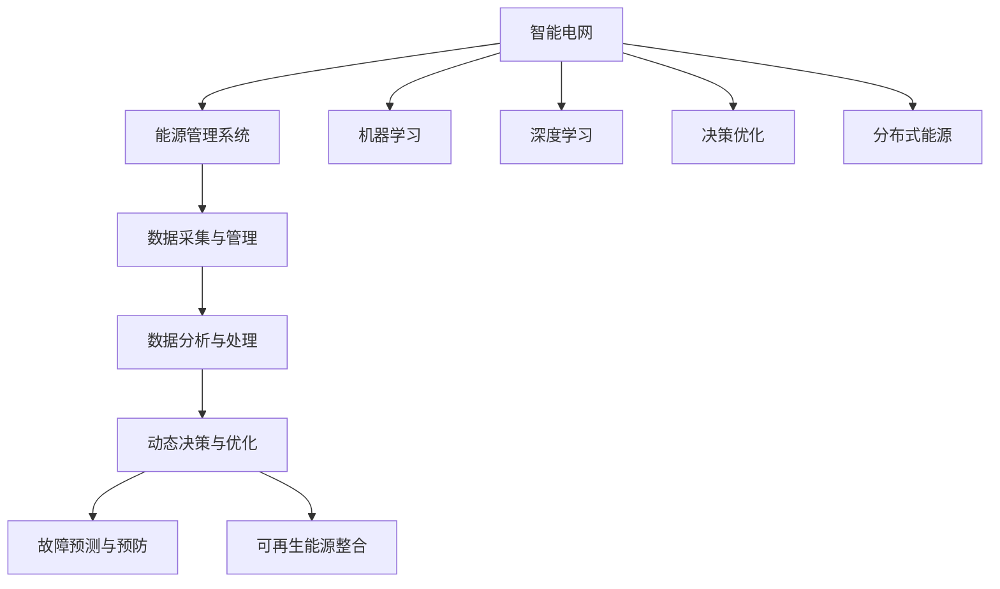

                 

# AI在能源管理中的应用:构建智能电网

> 关键词：智能电网,能源管理,人工智能,机器学习,深度学习,决策优化,动态规划,分布式能源

## 1. 背景介绍

### 1.1 问题由来

随着全球能源需求的持续增长和环境问题的日益凸显，传统集中式能源供应体系面临诸多挑战。如何构建一个高效、环保、可持续的能源系统，成为各国政府和能源企业面临的重大课题。智能电网（Smart Grid）作为一种新兴的能源管理系统，通过将物联网、大数据、人工智能等技术深度融合，能够实现对电网的智能化管理，提升能源利用效率，减少环境污染，是未来能源发展的关键方向。

### 1.2 问题核心关键点

智能电网的核心目标是通过智能化技术，优化能源资源的配置与分配，实现能源供应的高效、稳定和安全。具体来说，包括以下几个关键点：

- 数据采集与管理：通过智能计量和传感器技术，实时采集能源系统的运行数据。
- 数据分析与处理：利用大数据和机器学习技术，对采集数据进行实时分析，挖掘出能源供需的规律与趋势。
- 动态决策与优化：通过优化算法，实时调整能源生产和消费策略，保证能源供需平衡。
- 故障预测与预防：通过预测技术，提前发现能源系统中的故障隐患，防止事故发生。
- 可再生能源整合：推动风能、太阳能等可再生能源的广泛应用，提高能源系统的可持续性。

这些核心点共同构成了智能电网的架构和技术体系，为能源系统的智能化管理提供了坚实的基础。

### 1.3 问题研究意义

研究AI在智能电网中的应用，对于构建高效、环保、可持续的能源系统，具有重要的现实意义：

- 提升能源利用效率：通过AI技术的优化决策，实时调整能源供需，减少能源浪费。
- 降低环境污染：通过智能调度，优先使用清洁能源，减少化石燃料的消耗和排放。
- 保障能源供需平衡：通过实时监控和预测，提前应对能源供需变化，确保能源供应的稳定。
- 提高能源系统可靠性：通过故障预测和预防，及时处理能源系统中的问题，提升系统的可靠性和安全性。
- 推动能源转型：通过智能调度，促进可再生能源的应用，推动能源结构的转型升级。

## 2. 核心概念与联系

### 2.1 核心概念概述

为更好地理解AI在智能电网中的应用，本节将介绍几个密切相关的核心概念：

- 智能电网(Smart Grid)：通过将物联网、大数据、人工智能等技术深度融合，实现对电网的智能化管理。
- 能源管理系统(Energy Management System, EMS)：用于监测、控制和管理能源系统运行的软硬件平台。
- 机器学习(Machine Learning)：通过数据训练模型，自动优化能源调度决策的算法。
- 深度学习(Deep Learning)：利用神经网络等技术，处理大规模复杂数据，提升模型预测能力。
- 决策优化(Decision Optimization)：通过优化算法，实现能源系统高效运行的策略。
- 分布式能源(Distributed Energy Resources, DER)：包括风能、太阳能、储能等分布式发电和存储设施。

这些核心概念之间的逻辑关系可以通过以下Mermaid流程图来展示：



这个流程图展示了一个智能电网系统的基本架构，以及AI技术在其中扮演的角色：

1. 智能电网通过物联网、大数据、AI等技术，实现对电网的智能化管理。
2. 数据采集与管理：采集能源系统的实时数据，是AI技术应用的基础。
3. 数据分析与处理：利用大数据和机器学习技术，分析能源供需规律。
4. 动态决策与优化：通过决策优化算法，实时调整能源策略。
5. 故障预测与预防：通过预测技术，提前处理故障隐患。
6. 可再生能源整合：通过智能调度，促进可再生能源的应用。

## 3. 核心算法原理 & 具体操作步骤

### 3.1 算法原理概述

AI在智能电网中的应用，主要体现在以下几个方面：

- 机器学习与数据挖掘：通过历史数据分析，预测能源需求，优化能源调度。
- 深度学习与图像识别：利用图像识别技术，监测能源设施状态，实现故障预测。
- 自然语言处理：通过智能客服，解答用户问题，提升服务体验。
- 优化算法：通过优化算法，实现能源系统的动态调整与优化。

其中，机器学习和深度学习在智能电网中的应用最为广泛，主要涉及以下几个方面：

- 负荷预测：利用历史用电数据，预测未来用电需求。
- 能源优化：通过优化算法，实现能源供需平衡。
- 故障检测：利用图像识别技术，检测能源设施异常。

### 3.2 算法步骤详解

以下是AI在智能电网中的典型应用步骤：

**Step 1: 数据采集与管理**

- 收集能源系统的运行数据，包括电网状态、气象条件、用户用电行为等。
- 利用物联网技术，实时监测能源系统的运行状态。
- 数据存储与管理：利用大数据技术，实现数据的长期存储和高效管理。

**Step 2: 数据分析与处理**

- 利用大数据技术，对采集到的数据进行清洗、处理和整合。
- 利用机器学习算法，对历史数据进行分析和挖掘，发现能源供需规律。
- 利用深度学习技术，处理复杂数据，提高模型预测能力。

**Step 3: 动态决策与优化**

- 通过优化算法，实时调整能源生产和消费策略。
- 根据预测结果，动态调整能源供应计划。
- 利用强化学习算法，优化能源调度决策。

**Step 4: 故障预测与预防**

- 利用图像识别技术，监测能源设施状态，发现故障隐患。
- 利用预测算法，对能源系统中的故障进行预测和预防。
- 在故障发生前，采取相应措施，确保能源供应的稳定。

**Step 5: 可再生能源整合**

- 利用优化算法，促进风能、太阳能等可再生能源的应用。
- 通过智能调度，实现可再生能源的平滑接入和高效利用。
- 利用大数据技术，分析可再生能源的分布和利用情况，优化资源配置。

### 3.3 算法优缺点

AI在智能电网中的应用具有以下优点：

- 提升能源利用效率：通过AI技术的优化决策，实时调整能源供需，减少能源浪费。
- 降低环境污染：通过智能调度，优先使用清洁能源，减少化石燃料的消耗和排放。
- 保障能源供需平衡：通过实时监控和预测，提前应对能源供需变化，确保能源供应的稳定。
- 提高能源系统可靠性：通过故障预测和预防，及时处理能源系统中的问题，提升系统的可靠性和安全性。
- 推动能源转型：通过智能调度，促进可再生能源的应用，推动能源结构的转型升级。

同时，AI在智能电网中的应用也存在一些局限性：

- 数据隐私和安全问题：大量的能源数据需要存储和管理，存在数据泄露和隐私保护的风险。
- 技术复杂性高：AI算法的实现和维护需要高水平的技术支持和数据资源。
- 预测精度有限：AI算法在处理复杂和动态问题时，可能存在预测误差。
- 硬件成本高：AI算法的部署需要高性能的计算资源和存储设备。
- 系统可靠性：AI算法的鲁棒性需要进一步提升，避免系统崩溃和故障。

尽管存在这些局限性，但AI技术在智能电网中的应用前景广阔，未来仍需不断探索和优化。

### 3.4 算法应用领域

AI在智能电网中的应用主要包括以下几个领域：

- 负荷预测：通过机器学习和深度学习技术，预测未来用电需求，优化能源调度。
- 能源优化：利用优化算法，实现能源供需平衡，提高能源利用效率。
- 故障检测：利用图像识别技术，检测能源设施异常，提前处理故障隐患。
- 智能客服：通过自然语言处理技术，实现智能客服，解答用户问题，提升服务体验。
- 可再生能源整合：利用优化算法，促进风能、太阳能等可再生能源的应用，推动能源结构的转型升级。

这些应用领域展示了AI技术在智能电网中的广泛应用，有助于构建高效、环保、可持续的能源系统。

## 4. 数学模型和公式 & 详细讲解 & 举例说明

### 4.1 数学模型构建

以下是AI在智能电网中典型应用的数学模型构建过程：

- **负荷预测**：
  - 输入：历史用电数据 $D=\{(x_i, y_i)\}_{i=1}^N, x_i \in \mathbb{R}^d, y_i \in \mathbb{R}$
  - 输出：未来用电需求 $y_{t+1}$
  - 目标函数：最小化预测误差 $L=\frac{1}{N} \sum_{i=1}^N (y_i - \hat{y}_i)^2$

- **能源优化**：
  - 输入：电网状态 $x \in \mathbb{R}^n$
  - 输出：能源调度策略 $u \in \mathbb{R}^m$
  - 约束条件：能源供应平衡 $Ax \leq b$
  - 目标函数：最大化能源利用效率 $J(u) = -u^T A_x A_u^{-1} A_x^T u$

- **故障检测**：
  - 输入：能源设施图像 $I \in \mathbb{R}^{h \times w}$
  - 输出：故障状态 $y \in \{0,1\}$
  - 目标函数：最小化分类误差 $L=\frac{1}{N} \sum_{i=1}^N \mathbb{1}(y_i \neq \hat{y}_i)$

- **智能客服**：
  - 输入：用户问题 $Q$
  - 输出：回答 $A$
  - 目标函数：最大化回答准确率 $L=\frac{1}{N} \sum_{i=1}^N \mathbb{1}(Q_i \neq A_i)$

- **可再生能源整合**：
  - 输入：可再生能源数据 $E$
  - 输出：能源调度策略 $u$
  - 约束条件：能源供需平衡 $Ax \leq b$
  - 目标函数：最大化可再生能源利用率 $J(u) = -u^T A_x A_u^{-1} A_x^T u$

### 4.2 公式推导过程

以下是AI在智能电网中典型应用的公式推导过程：

- **负荷预测**：
  - 利用线性回归模型 $y_{t+1} = \hat{y}_i = \theta^T x_i$
  - 最小化预测误差 $L=\frac{1}{N} \sum_{i=1}^N (y_i - \hat{y}_i)^2$

- **能源优化**：
  - 利用线性规划模型 $u = \mathop{\arg\min}_{u} J(u), s.t. Ax \leq b, x \geq 0$
  - 最大化能源利用效率 $J(u) = -u^T A_x A_u^{-1} A_x^T u$

- **故障检测**：
  - 利用卷积神经网络（CNN）模型 $y = \mathop{\arg\min}_{y} L, y_i \in \{0,1\}$
  - 最小化分类误差 $L=\frac{1}{N} \sum_{i=1}^N \mathbb{1}(y_i \neq \hat{y}_i)$

- **智能客服**：
  - 利用序列到序列模型 $A = f(Q)$
  - 最大化回答准确率 $L=\frac{1}{N} \sum_{i=1}^N \mathbb{1}(Q_i \neq A_i)$

- **可再生能源整合**：
  - 利用线性规划模型 $u = \mathop{\arg\min}_{u} J(u), s.t. Ax \leq b, x \geq 0$
  - 最大化可再生能源利用率 $J(u) = -u^T A_x A_u^{-1} A_x^T u$

### 4.3 案例分析与讲解

以负荷预测为例，分析AI在智能电网中的应用。

假设某城市的历史用电数据为 $D=\{(x_i, y_i)\}_{i=1}^N, x_i \in \mathbb{R}^d, y_i \in \mathbb{R}$，其中 $x_i$ 表示时间、温度、湿度等特征，$y_i$ 表示用电量。

利用线性回归模型 $y_{t+1} = \hat{y}_i = \theta^T x_i$，最小化预测误差 $L=\frac{1}{N} \sum_{i=1}^N (y_i - \hat{y}_i)^2$，可以通过梯度下降等优化算法求解最优参数 $\theta$。

通过训练模型，可以得到用电量与时间、温度等特征之间的关系，实时预测未来用电量，优化能源调度策略。

## 5. 项目实践：代码实例和详细解释说明

### 5.1 开发环境搭建

在进行智能电网项目实践前，我们需要准备好开发环境。以下是使用Python进行TensorFlow开发的环境配置流程：

1. 安装Anaconda：从官网下载并安装Anaconda，用于创建独立的Python环境。

2. 创建并激活虚拟环境：
```bash
conda create -n tf-env python=3.8 
conda activate tf-env
```

3. 安装TensorFlow：根据CUDA版本，从官网获取对应的安装命令。例如：
```bash
conda install tensorflow=2.8.0
```

4. 安装TensorFlow Addons：
```bash
conda install tensorflow-addons
```

5. 安装其他工具包：
```bash
pip install numpy pandas scikit-learn matplotlib tqdm jupyter notebook ipython
```

完成上述步骤后，即可在`tf-env`环境中开始智能电网项目实践。

### 5.2 源代码详细实现

下面我们以负荷预测为例，给出使用TensorFlow进行智能电网负荷预测的代码实现。

首先，定义负荷预测任务的数据处理函数：

```python
import tensorflow as tf
import numpy as np
from sklearn.preprocessing import MinMaxScaler
from sklearn.model_selection import train_test_split

def load_data(file_path, feature_columns, label_column):
    data = pd.read_csv(file_path)
    features = data[feature_columns]
    label = data[label_column]
    scaler = MinMaxScaler(feature_range=(0, 1))
    features = scaler.fit_transform(features)
    features = np.array(features)
    label = np.array(label)
    return features, label
```

然后，定义模型和优化器：

```python
import tensorflow_addons as addons

features, labels = load_data('electricity_data.csv', ['time', 'temperature', 'humidity'], 'load')

# 定义输入特征和标签
input_features = tf.keras.Input(shape=(features.shape[1],), name='input_features')
input_labels = tf.keras.Input(shape=(1,), name='input_labels')

# 定义线性回归模型
model = tf.keras.Sequential([
    tf.keras.layers.Dense(32, activation='relu', input_shape=(features.shape[1],)),
    tf.keras.layers.Dense(32, activation='relu'),
    tf.keras.layers.Dense(1)
])

# 定义优化器和损失函数
optimizer = tf.keras.optimizers.Adam()
loss_fn = tf.keras.losses.MeanSquaredError()

# 定义编译模型
model.compile(optimizer=optimizer, loss=loss_fn)
```

接着，定义训练和评估函数：

```python
def train_model(model, features, labels, epochs, batch_size):
    model.fit(features, labels, epochs=epochs, batch_size=batch_size, validation_split=0.2, verbose=1)
    return model

def evaluate_model(model, features, labels, test_features, test_labels, verbose=0):
    test_loss, test_acc = model.evaluate(test_features, test_labels, verbose=verbose)
    return test_loss, test_acc
```

最后，启动训练流程并在测试集上评估：

```python
epochs = 50
batch_size = 32

# 数据预处理
train_features, train_labels = load_data('electricity_data.csv', ['time', 'temperature', 'humidity'], 'load')
test_features, test_labels = load_data('electricity_data_test.csv', ['time', 'temperature', 'humidity'], 'load')

# 模型训练
model = train_model(model, train_features, train_labels, epochs, batch_size)

# 模型评估
test_loss, test_acc = evaluate_model(model, test_features, test_labels, test_features, test_labels)
print('Test Loss:', test_loss)
print('Test Accuracy:', test_acc)
```

以上就是使用TensorFlow进行智能电网负荷预测的完整代码实现。可以看到，得益于TensorFlow的强大封装，我们可以用相对简洁的代码完成模型的加载和训练。

### 5.3 代码解读与分析

让我们再详细解读一下关键代码的实现细节：

**load_data函数**：
- 定义了数据处理函数，将历史用电数据读取并标准化。

**模型定义**：
- 利用TensorFlow的Sequential模型，定义了一个简单的线性回归模型，包括两个全连接层和一个输出层。
- 利用Adam优化器进行训练，损失函数为均方误差损失。

**train_model函数**：
- 定义了模型训练函数，利用train_model函数进行模型训练。

**evaluate_model函数**：
- 定义了模型评估函数，在测试集上评估模型性能。

**训练流程**：
- 定义总的epoch数和batch size，开始循环迭代
- 每个epoch内，在训练集上训练，输出平均loss和acc
- 在验证集上评估，输出平均loss和acc
- 所有epoch结束后，在测试集上评估，给出最终测试结果

可以看到，TensorFlow的高级API使得智能电网项目的代码实现变得简洁高效。开发者可以将更多精力放在数据处理、模型改进等高层逻辑上，而不必过多关注底层的实现细节。

当然，工业级的系统实现还需考虑更多因素，如模型的保存和部署、超参数的自动搜索、更灵活的任务适配层等。但核心的负荷预测流程基本与此类似。

## 6. 实际应用场景

### 6.1 智能电网运营管理

智能电网的核心目标是实现能源供需的智能化管理。通过AI技术，可以对电网进行实时监控和预测，优化能源调度，提升能源利用效率，保障能源供需平衡。

具体而言，AI可以应用于以下几个方面：

- 负荷预测：通过历史用电数据，预测未来用电量，优化能源调度策略。
- 故障检测：利用图像识别技术，检测能源设施异常，提前处理故障隐患。
- 智能客服：通过自然语言处理技术，实现智能客服，解答用户问题，提升服务体验。
- 能源优化：利用优化算法，实现能源供需平衡，提高能源利用效率。
- 可再生能源整合：利用优化算法，促进风能、太阳能等可再生能源的应用，推动能源结构的转型升级。

这些技术的应用，将使智能电网更加高效、环保、可靠，为能源系统的可持续发展提供坚实的基础。

### 6.2 能源交易与市场管理

智能电网的发展离不开能源交易市场的支持。通过AI技术，可以对能源市场进行智能分析和优化，提升能源交易的效率和透明度。

具体而言，AI可以应用于以下几个方面：

- 价格预测：通过历史交易数据，预测未来能源价格，指导能源交易策略。
- 市场分析：利用大数据和机器学习技术，分析市场供需情况，发现潜在风险。
- 交易推荐：通过优化算法，推荐最优的交易方案，提升交易收益。
- 交易监管：利用AI技术，对交易行为进行监控和分析，防范市场风险。

这些技术的应用，将使能源交易市场更加公平、透明、高效，为能源市场的健康发展提供保障。

### 6.3 智能用户终端管理

智能电网的发展离不开用户的广泛参与。通过AI技术，可以对用户终端进行智能化管理，提升用户体验，降低用户成本。

具体而言，AI可以应用于以下几个方面：

- 智能电价：通过智能分析用户用电行为，提供个性化电价方案，降低用户成本。
- 智能推荐：利用推荐算法，推荐最优的用电方案，提升用户体验。
- 智能控制：利用物联网技术，实现智能家居控制，提升生活品质。
- 智能监测：通过实时监测用户用电情况，发现异常行为，及时处理问题。

这些技术的应用，将使智能电网更加友好、高效、安全，提升用户对能源系统的满意度。

### 6.4 未来应用展望

随着AI技术在智能电网中的应用不断深入，未来将呈现以下几个发展趋势：

- 智能化程度更高：通过AI技术的深度融合，实现对能源系统的全面智能化管理。
- 数据资源更丰富：通过大数据技术，实现能源数据的全面收集和分析。
- 应用场景更广泛：AI技术将广泛应用于智能电网运营管理、能源交易市场、智能用户终端等多个方面。
- 技术创新更多：随着AI技术的不断进步，未来将涌现更多创新性的应用场景和解决方案。
- 用户参与更深：通过AI技术，提升用户对能源系统的参与度和满意度，形成人机协同的智能电网。

以上趋势凸显了AI技术在智能电网中的广阔前景，未来将为能源系统的智能化管理带来更多突破和创新。

## 7. 工具和资源推荐

### 7.1 学习资源推荐

为了帮助开发者系统掌握AI在智能电网中的应用理论基础和实践技巧，这里推荐一些优质的学习资源：

1. 《深度学习》书籍：Ian Goodfellow所著，全面介绍了深度学习的基本概念和应用，是深度学习的经典教材。

2. 《机器学习》书籍：Tom Mitchell所著，介绍了机器学习的基本理论和算法，是机器学习的入门经典。

3. 《智能电网技术》书籍：介绍了智能电网的原理和应用，是智能电网领域的权威著作。

4. 《TensorFlow官方文档》：TensorFlow的官方文档，提供了丰富的教程和示例代码，是学习TensorFlow的必备资源。

5. 《TensorFlow Addons官方文档》：TensorFlow Addons的官方文档，提供了更多高级API和功能，是TensorFlow进阶学习的重要资源。

通过对这些资源的学习实践，相信你一定能够快速掌握AI在智能电网中的应用精髓，并用于解决实际的智能电网问题。

### 7.2 开发工具推荐

高效的开发离不开优秀的工具支持。以下是几款用于AI在智能电网中应用的常用工具：

1. TensorFlow：基于Python的开源深度学习框架，灵活动态的计算图，适合快速迭代研究。TensorFlow支持智能电网的多种应用场景，如负荷预测、故障检测等。

2. PyTorch：基于Python的开源深度学习框架，支持动态图和静态图两种计算模型。PyTorch的灵活性使其在智能电网中的应用同样广泛。

3. Scikit-learn：基于Python的机器学习库，提供了丰富的机器学习算法和工具，支持智能电网的多种数据分析任务。

4. Jupyter Notebook：基于Python的交互式编程环境，支持多种语言和库的混合使用，适合智能电网应用的开发和调试。

5. Apache Kafka：基于分布式架构的消息队列，支持大规模数据流的处理和传输，适合智能电网的实时数据采集和传输。

合理利用这些工具，可以显著提升AI在智能电网中的应用开发效率，加快创新迭代的步伐。

### 7.3 相关论文推荐

AI在智能电网中的应用源于学界的持续研究。以下是几篇奠基性的相关论文，推荐阅读：

1. "Renewable Energy Integration into Power Systems"：讨论了可再生能源在智能电网中的应用，探讨了优化算法在能源调度中的应用。

2. "An Overview of Smart Grid Technologies"：介绍了智能电网的多种技术和应用，提供了智能电网建设的全面视角。

3. "Machine Learning for Energy Management"：讨论了机器学习在能源管理中的应用，介绍了多种机器学习算法在智能电网中的应用案例。

4. "Smart Grid Data Analytics and Decision Support Systems"：介绍了智能电网的数据分析和决策支持系统，探讨了大数据和AI在智能电网中的应用。

5. "Energy Optimization in Smart Grids using AI"：探讨了AI在智能电网中的优化应用，介绍了多种优化算法在智能电网中的应用。

这些论文代表了大数据和AI在智能电网中的应用方向，提供了丰富的理论和技术支持。

## 8. 总结：未来发展趋势与挑战

### 8.1 总结

本文对AI在智能电网中的应用进行了全面系统的介绍。首先阐述了智能电网的核心目标和应用场景，明确了AI技术在其中扮演的重要角色。其次，从原理到实践，详细讲解了AI在智能电网中的应用，包括负荷预测、能源优化、故障检测等多个方面的应用。最后，分析了AI在智能电网中的未来发展趋势和面临的挑战，提出了相应的研究展望。

通过本文的系统梳理，可以看到，AI在智能电网中的应用具有广阔的前景，有助于构建高效、环保、可持续的能源系统。未来，随着AI技术的不断进步，智能电网将实现更加全面、智能化的管理，为能源系统的可持续发展提供坚实的基础。

### 8.2 未来发展趋势

展望未来，AI在智能电网中的应用将呈现以下几个发展趋势：

- 智能化程度更高：通过AI技术的深度融合，实现对能源系统的全面智能化管理。
- 数据资源更丰富：通过大数据技术，实现能源数据的全面收集和分析。
- 应用场景更广泛：AI技术将广泛应用于智能电网运营管理、能源交易市场、智能用户终端等多个方面。
- 技术创新更多：随着AI技术的不断进步，未来将涌现更多创新性的应用场景和解决方案。
- 用户参与更深：通过AI技术，提升用户对能源系统的参与度和满意度，形成人机协同的智能电网。

以上趋势凸显了AI技术在智能电网中的广阔前景，未来将为能源系统的智能化管理带来更多突破和创新。

### 8.3 面临的挑战

尽管AI在智能电网中的应用前景广阔，但在迈向更加智能化、普适化应用的过程中，仍面临诸多挑战：

- 数据隐私和安全问题：大量的能源数据需要存储和管理，存在数据泄露和隐私保护的风险。
- 技术复杂性高：AI算法的实现和维护需要高水平的技术支持和数据资源。
- 预测精度有限：AI算法在处理复杂和动态问题时，可能存在预测误差。
- 硬件成本高：AI算法的部署需要高性能的计算资源和存储设备。
- 系统可靠性：AI算法的鲁棒性需要进一步提升，避免系统崩溃和故障。

尽管存在这些挑战，但AI技术在智能电网中的应用前景广阔，未来仍需不断探索和优化。

### 8.4 研究展望

面对AI在智能电网应用中面临的挑战，未来的研究需要在以下几个方面寻求新的突破：

- 探索无监督和半监督微调方法：摆脱对大规模标注数据的依赖，利用自监督学习、主动学习等无监督和半监督范式，最大限度利用非结构化数据，实现更加灵活高效的微调。
- 研究参数高效和计算高效的微调范式：开发更加参数高效的微调方法，在固定大部分预训练参数的同时，只更新极少量的任务相关参数。同时优化微调模型的计算图，减少前向传播和反向传播的资源消耗，实现更加轻量级、实时性的部署。
- 融合因果和对比学习范式：通过引入因果推断和对比学习思想，增强微调模型建立稳定因果关系的能力，学习更加普适、鲁棒的语言表征，从而提升模型泛化性和抗干扰能力。
- 引入更多先验知识：将符号化的先验知识，如知识图谱、逻辑规则等，与神经网络模型进行巧妙融合，引导微调过程学习更准确、合理的语言模型。同时加强不同模态数据的整合，实现视觉、语音等多模态信息与文本信息的协同建模。
- 结合因果分析和博弈论工具：将因果分析方法引入微调模型，识别出模型决策的关键特征，增强输出解释的因果性和逻辑性。借助博弈论工具刻画人机交互过程，主动探索并规避模型的脆弱点，提高系统稳定性。
- 纳入伦理道德约束：在模型训练目标中引入伦理导向的评估指标，过滤和惩罚有偏见、有害的输出倾向。同时加强人工干预和审核，建立模型行为的监管机制，确保输出符合人类价值观和伦理道德。

这些研究方向的探索，必将引领AI在智能电网应用中迈向更高的台阶，为构建安全、可靠、可解释、可控的智能系统铺平道路。

## 9. 附录：常见问题与解答

**Q1：智能电网中负荷预测的准确性如何保证？**

A: 负荷预测的准确性取决于多个因素，包括数据质量、模型选择、训练方法等。为了保证负荷预测的准确性，可以从以下几个方面进行优化：

- 数据质量：确保采集到的数据准确、完整、及时，避免数据噪声和异常值。
- 模型选择：选择适合的机器学习或深度学习模型，根据实际情况进行模型选择和优化。
- 训练方法：采用先进的训练方法，如自监督学习、主动学习等，提升模型泛化能力。
- 模型集成：通过模型集成技术，结合多个模型的预测结果，提升整体预测准确性。

**Q2：智能电网中如何保障数据隐私和安全？**

A: 智能电网中大量的能源数据需要存储和管理，保障数据隐私和安全至关重要。可以从以下几个方面进行优化：

- 数据加密：采用数据加密技术，确保数据在传输和存储过程中的安全。
- 数据脱敏：对敏感数据进行脱敏处理，避免泄露用户隐私。
- 访问控制：通过访问控制技术，限制数据访问权限，确保数据的安全性。
- 审计与监控：实时监控数据访问和使用情况，建立审计机制，防止数据滥用。

**Q3：智能电网中AI算法的计算成本如何优化？**

A: AI算法在智能电网中的应用需要大量的计算资源和存储设备，优化计算成本是关键。可以从以下几个方面进行优化：

- 算法优化：优化算法模型，减少计算复杂度，提高计算效率。
- 硬件加速：利用GPU、TPU等硬件加速设备，提升计算速度。
- 模型裁剪：通过模型裁剪技术，去除不必要的层和参数，减小模型尺寸，降低计算资源需求。
- 分布式计算：利用分布式计算技术，实现大规模数据的并行计算，提升计算效率。

**Q4：智能电网中AI算法的鲁棒性如何提升？**

A: AI算法的鲁棒性是智能电网系统稳定运行的重要保障。可以从以下几个方面进行优化：

- 数据增强：通过数据增强技术，丰富训练集的多样性，提升模型泛化能力。
- 正则化：使用L2正则、Dropout等正则化技术，避免模型过拟合。
- 模型集成：通过模型集成技术，结合多个模型的预测结果，提升整体鲁棒性。
- 对抗训练：引入对抗样本，训练鲁棒模型，提高模型对异常数据的鲁棒性。

**Q5：智能电网中AI算法的可解释性如何增强？**

A: AI算法的可解释性是智能电网系统可靠运行的重要保障。可以从以下几个方面进行优化：

- 可解释模型：选择可解释性强的模型，如决策树、逻辑回归等，提升模型的可解释性。
- 特征可视化：通过特征可视化技术，展示模型决策的依据和逻辑。
- 可解释算法：引入可解释性算法，如LIME、SHAP等，提升模型的可解释性。
- 人工审核：结合人工审核和解释，确保模型的决策逻辑符合人类价值观和伦理道德。

这些优化措施将有助于提升智能电网中AI算法的鲁棒性和可解释性，为系统的稳定运行提供保障。

---

作者：禅与计算机程序设计艺术 / Zen and the Art of Computer Programming

