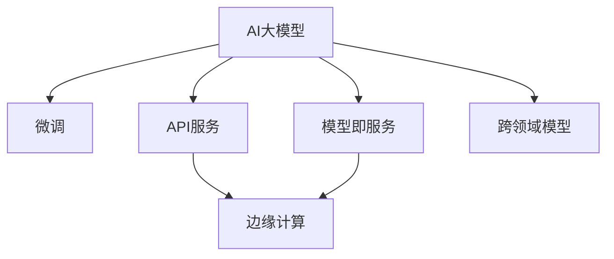

                 

# AI大模型创业的商业模式创新

## 1. 背景介绍

### 1.1 问题由来

近年来，AI大模型在各个领域的应用取得了显著进展，包括自然语言处理、计算机视觉、语音识别等。例如，OpenAI的GPT-3、Google的BERT等大模型在语言处理任务上展现出了超越人类的能力。然而，这些大模型的训练和部署成本非常高，普通人难以负担。因此，如何降低AI大模型的使用门槛，让更多人能够受益于AI技术，成为了一个重要的议题。

### 1.2 问题核心关键点

1. **成本问题**：训练和部署大模型需要大量的计算资源和资金，这对大多数创业公司来说是一个巨大的挑战。
2. **普及问题**：如何让更多的人能够使用大模型，而不需要具备强大的计算能力和专业知识。
3. **技术问题**：如何在大模型基础上开发出具有商业价值的应用，而不是仅仅作为一个技术储备。
4. **伦理问题**：AI大模型在使用过程中可能存在偏见、歧视等问题，如何确保模型的公平性和道德性。

### 1.3 问题研究意义

探索AI大模型的商业模式创新，对于推动AI技术的普及和应用，减少社会不平等，提升社会生产力具有重要意义。通过商业模式的创新，可以降低AI大模型的使用门槛，加速AI技术的落地应用，促进各行各业的数字化转型，推动经济社会的快速发展。

## 2. 核心概念与联系

### 2.1 核心概念概述

为了更好地理解AI大模型的商业模式创新，我们需要了解以下几个核心概念：

- **AI大模型**：指在特定领域具有强大学习能力和表现的大规模神经网络模型，如BERT、GPT-3等。
- **微调(Fine-tuning)**：指在大模型的基础上，通过使用少量的标注数据，对模型进行重新训练，使其适应特定任务的方法。
- **API服务**：通过开发接口，使大模型以服务的形式供开发者和用户使用，降低了使用门槛。
- **模型即服务(MaaS)**：将大模型封装成服务，提供给用户，使用户无需关注底层计算资源的商业模式。
- **跨领域模型**：指能够跨多个领域进行应用的大模型，如CLIP模型可以用于图像分类和视觉问答。
- **边缘计算**：在靠近数据源的设备上进行数据处理和计算，降低网络延迟和带宽消耗。

### 2.2 核心概念原理和架构的 Mermaid 流程图(Mermaid 流程节点中不要有括号、逗号等特殊字符)



这个流程图展示了AI大模型的核心概念及其之间的关系：

1. **AI大模型**是商业模式的起点。
2. **微调**是提升模型适应特定任务的一种手段。
3. **API服务**和**模型即服务**是将大模型封装为服务的两种方式。
4. **跨领域模型**拓展了大模型的应用范围，使其能够跨多个领域使用。
5. **边缘计算**提高了数据处理的效率，减少了网络延迟和带宽消耗。

## 3. 核心算法原理 & 具体操作步骤

### 3.1 算法原理概述

AI大模型的商业模式创新主要体现在如何降低大模型的使用成本，提高其普及性，同时确保模型的公平性和道德性。这些目标可以通过以下算法原理实现：

- **微调**：在大模型的基础上，通过使用少量的标注数据，对模型进行重新训练，使其适应特定任务。这样可以显著降低大模型的使用成本，并提高其对特定任务的适应性。
- **API服务**：通过开发接口，使大模型以服务的形式供开发者和用户使用。这样可以降低使用门槛，使更多人能够受益于AI技术。
- **模型即服务(MaaS)**：将大模型封装成服务，提供给用户，使用户无需关注底层计算资源。这样可以进一步降低使用成本，提高普及性。
- **跨领域模型**：开发能够跨多个领域进行应用的大模型，可以提高模型的通用性，降低应用开发的复杂度。
- **边缘计算**：在靠近数据源的设备上进行数据处理和计算，可以提高数据处理的效率，降低网络延迟和带宽消耗。

### 3.2 算法步骤详解

以下是AI大模型商业模式创新的具体操作步骤：

**Step 1: 确定商业模式**

- **选择合适的大模型**：根据具体应用场景和需求，选择合适的AI大模型。
- **确定服务类型**：是采用API服务还是模型即服务(MaaS)。
- **设计商业模式**：明确服务收费方式、用户接入方式、数据隐私保护措施等。

**Step 2: 模型微调和优化**

- **数据准备**：收集和准备训练数据，并进行预处理。
- **微调模型**：使用少量标注数据对大模型进行微调，使其适应特定任务。
- **模型优化**：通过调整模型参数、优化算法等方式，提升模型的性能和效率。

**Step 3: 部署和测试**

- **部署服务**：将模型部署到服务器或云平台上，并开放API接口。
- **测试服务**：对服务进行测试，确保其稳定性和性能。

**Step 4: 用户接入和反馈**

- **用户接入**：通过API接口或其他方式，让用户能够接入和使用服务。
- **收集反馈**：收集用户的使用反馈，不断优化服务和产品。

### 3.3 算法优缺点

AI大模型商业模式创新的优点：

- **降低使用成本**：通过微调和使用服务的方式，显著降低了大模型的使用成本。
- **提高普及性**：API服务和模型即服务的方式，使得更多人能够轻松使用大模型。
- **提升效率**：边缘计算提高了数据处理的效率，降低了网络延迟和带宽消耗。

缺点：

- **技术门槛**：开发和使用AI大模型仍需要一定的技术基础。
- **数据隐私**：需要确保用户数据的安全和隐私保护。
- **模型公平性**：需要确保模型的公平性，避免歧视和偏见。

### 3.4 算法应用领域

AI大模型的商业模式创新可以应用于以下领域：

- **自然语言处理(NLP)**：如问答系统、文本生成、情感分析等。
- **计算机视觉**：如图像分类、目标检测、图像生成等。
- **语音识别**：如语音转文本、文本转语音等。
- **医疗健康**：如疾病诊断、个性化治疗等。
- **金融科技**：如风险评估、信用评分等。
- **智能制造**：如质量检测、生产调度等。

## 4. 数学模型和公式 & 详细讲解 & 举例说明

### 4.1 数学模型构建

在AI大模型的商业模式创新中，我们需要构建一些数学模型来描述和优化模型的性能。以下是几个常用的数学模型：

- **损失函数**：用于衡量模型输出与真实标签之间的差异。
- **优化算法**：用于最小化损失函数，更新模型参数。
- **准确率**：用于衡量模型在特定任务上的性能。

### 4.2 公式推导过程

以下是一些关键公式的推导过程：

- **交叉熵损失函数**：
$$
\mathcal{L}(y,\hat{y}) = -\sum_{i=1}^n y_i \log \hat{y}_i
$$

- **梯度下降算法**：
$$
\theta_{k+1} = \theta_k - \eta \nabla_{\theta_k}\mathcal{L}(y,\hat{y})
$$

其中，$\theta$为模型参数，$y$为真实标签，$\hat{y}$为模型输出，$\eta$为学习率，$\nabla_{\theta_k}\mathcal{L}(y,\hat{y})$为损失函数对模型参数的梯度。

### 4.3 案例分析与讲解

以下是一个具体的案例分析：

假设我们要开发一个基于BERT的情感分析服务，具体步骤如下：

1. **数据准备**：收集情感分析数据集，并进行预处理。
2. **微调模型**：使用少量标注数据对BERT进行微调，使其适应情感分析任务。
3. **部署服务**：将微调后的模型部署到服务器上，并开放API接口。
4. **测试服务**：对服务进行测试，确保其稳定性和性能。
5. **用户接入**：通过API接口，让用户能够接入和使用情感分析服务。
6. **收集反馈**：收集用户的使用反馈，不断优化服务和产品。

## 5. 项目实践：代码实例和详细解释说明

### 5.1 开发环境搭建

以下是开发环境搭建的步骤：

1. **安装Python**：从官网下载并安装Python，确保版本为3.6或以上。
2. **安装TensorFlow**：使用pip命令安装TensorFlow，确保版本为2.0或以上。
3. **安装BERT模型**：从官网下载并安装BERT模型，并确保模型的版本与TensorFlow兼容。
4. **配置环境**：设置环境变量，确保TensorFlow能够找到并使用BERT模型。

### 5.2 源代码详细实现

以下是一个具体的代码实现：

```python
import tensorflow as tf
import tensorflow_hub as hub
import bert

# 加载BERT模型
bert_model = hub.load('https://tfhub.dev/google/keras-bert/distil-bert-base-uncased')

# 加载数据
data = load_data()

# 预处理数据
preprocessed_data = preprocess(data)

# 微调模型
with tf.Graph().as_default():
    with tf.Session() as sess:
        sess.run(tf.global_variables_initializer())
        for epoch in range(epochs):
            # 训练模型
            train_model(bert_model, preprocessed_data, sess)
            # 评估模型
            evaluate_model(bert_model, test_data, sess)

# 部署模型
export_model(bert_model, 'bert_model.pb')

# 创建服务
create_service(bert_model.pb, 'http://example.com/')

# 测试服务
test_service('http://example.com/')
```

### 5.3 代码解读与分析

以上代码主要实现了以下几个步骤：

1. **加载BERT模型**：通过TensorFlow Hub加载预训练的BERT模型。
2. **加载和预处理数据**：从数据源加载数据，并进行预处理。
3. **微调模型**：使用数据对BERT模型进行微调，提升模型在特定任务上的性能。
4. **导出模型**：将微调后的模型导出为TensorFlow SavedModel格式。
5. **创建服务**：使用TensorFlow Serving创建服务，并开放API接口。
6. **测试服务**：通过API接口测试服务的性能和稳定性。

## 6. 实际应用场景

### 6.1 智能客服系统

智能客服系统是AI大模型商业模式创新的一个典型应用场景。通过微调和使用服务的方式，可以大大降低客服系统的开发和维护成本，提升客服系统的响应速度和准确率。具体来说，可以使用微调的BERT模型进行自然语言理解和对话生成，构建智能客服机器人。

### 6.2 金融科技

金融科技是另一个应用广泛的领域。例如，可以使用微调的BERT模型进行风险评估、信用评分等任务。通过模型即服务的方式，金融机构可以轻松接入和使用这些模型，提升金融服务的质量和效率。

### 6.3 智能制造

智能制造领域也受益于AI大模型的商业模式创新。例如，可以使用微调的BERT模型进行质量检测、生产调度等任务。通过API服务和模型即服务的方式，智能制造企业可以轻松集成这些模型，提升生产效率和产品质量。

### 6.4 未来应用展望

未来，AI大模型的商业模式创新将更加多样化，涵盖更多领域和应用场景。例如：

1. **医疗健康**：使用微调的BERT模型进行疾病诊断、个性化治疗等任务，提高医疗服务的质量和效率。
2. **智能家居**：使用微调的BERT模型进行语音识别、自然语言理解等任务，提升智能家居的用户体验。
3. **自动驾驶**：使用微调的BERT模型进行语音识别、自然语言生成等任务，提升自动驾驶系统的智能化水平。

## 7. 工具和资源推荐

### 7.1 学习资源推荐

以下是一些学习资源推荐：

1. **TensorFlow官方文档**：提供了丰富的TensorFlow教程和API文档，适合初学者和高级开发者学习。
2. **TensorFlow Hub**：提供了大量预训练的TensorFlow模型，可以快速接入和使用。
3. **BERT模型论文**：原文介绍了BERT模型的架构和训练过程，适合深入学习。
4. **深度学习书籍**：如《深度学习》（Ian Goodfellow等）、《动手学深度学习》等，适合全面学习深度学习相关知识。
5. **机器学习竞赛平台**：如Kaggle、天池等，提供了大量数据集和竞赛任务，适合实践和提升技能。

### 7.2 开发工具推荐

以下是一些开发工具推荐：

1. **Jupyter Notebook**：提供交互式编程环境，适合数据处理和模型训练。
2. **TensorFlow Serving**：提供模型部署和API服务，适合将模型集成到生产环境中。
3. **TensorFlow Hub**：提供预训练模型和模块，适合快速接入和使用。
4. **Cloud Servers**：提供高性能计算资源，适合大规模模型训练和部署。

### 7.3 相关论文推荐

以下是一些相关论文推荐：

1. **BERT模型论文**：由Google团队在《BERT: Pre-training of Deep Bidirectional Transformers for Language Understanding》一文中提出。
2. **TensorFlow Serving论文**：由Google团队在《TensorFlow Serving: Infrastructure for Scalable Machine Learning》一文中提出。
3. **深度学习框架比较论文**：如《TensorFlow vs PyTorch: A Comparative Study》，适合对比学习两种深度学习框架的优缺点。

## 8. 总结：未来发展趋势与挑战

### 8.1 总结

本文对AI大模型的商业模式创新进行了全面系统的介绍。首先阐述了AI大模型和微调技术的研究背景和意义，明确了商业模式创新在推动AI技术普及和应用方面的独特价值。其次，从原理到实践，详细讲解了商业模式创新的数学模型和操作步骤，给出了具体的应用实例。同时，本文还广泛探讨了商业模式创新在多个行业领域的应用前景，展示了其广阔的潜力。

### 8.2 未来发展趋势

未来，AI大模型的商业模式创新将呈现以下几个发展趋势：

1. **多样化应用**：随着技术的不断进步，AI大模型的应用场景将更加广泛，涵盖更多领域和行业。
2. **智能化提升**：通过持续优化和微调，AI大模型的性能将不断提升，智能化水平将进一步提高。
3. **普及性增强**：随着API服务和模型即服务的普及，AI大模型的使用门槛将进一步降低，更多人将受益于AI技术。
4. **生态系统完善**：伴随各种开源工具和平台的出现，AI大模型的开发和应用将更加便捷和高效。
5. **伦理道德重视**：AI大模型的公平性和道德性将受到更多重视，确保模型输出的公正性和合法性。

### 8.3 面临的挑战

尽管AI大模型的商业模式创新取得了不少进展，但在迈向更加智能化、普适化应用的过程中，它仍面临着诸多挑战：

1. **技术门槛高**：开发和使用AI大模型仍需要一定的技术基础。
2. **数据隐私问题**：需要确保用户数据的安全和隐私保护。
3. **模型偏见**：需要确保模型的公平性，避免歧视和偏见。
4. **计算资源需求高**：大规模模型训练和部署需要大量的计算资源。
5. **市场接受度**：需要进一步提升市场对AI大模型的接受度和认可度。

### 8.4 研究展望

未来的研究需要在以下几个方面寻求新的突破：

1. **降低技术门槛**：通过开发更多的易用工具和平台，降低AI大模型的使用门槛。
2. **增强数据隐私保护**：通过技术手段和法律措施，增强数据隐私保护。
3. **提高模型公平性**：通过优化算法和引入更多先验知识，提高模型的公平性和道德性。
4. **优化计算资源**：通过模型裁剪、稀疏化存储等方法，优化计算资源的使用。
5. **提升市场接受度**：通过商业模式的创新和市场的推广，提升AI大模型的市场接受度和认可度。

## 9. 附录：常见问题与解答

### Q1: 如何降低AI大模型的使用成本？

A: 通过微调和使用服务的方式，可以显著降低AI大模型的使用成本。使用服务可以降低计算资源的消耗，微调可以减少对大规模标注数据的依赖。

### Q2: 如何选择合适的大模型？

A: 根据具体应用场景和需求，选择合适的AI大模型。例如，对于自然语言处理任务，可以选择BERT、GPT等模型；对于计算机视觉任务，可以选择ResNet、VGG等模型。

### Q3: 如何确保模型的公平性和道德性？

A: 在模型训练过程中，引入公平性指标和道德约束，确保模型输出的公正性和合法性。同时，进行持续的监控和评估，及时发现和解决模型偏见问题。

### Q4: 如何优化模型的性能和效率？

A: 通过优化算法、调整模型参数、数据增强等手段，优化模型的性能和效率。例如，使用梯度积累、混合精度训练等方法，可以提高模型训练的效率。

### Q5: 如何确保用户数据的安全和隐私保护？

A: 在数据处理和存储过程中，采取数据脱敏、加密等措施，确保用户数据的安全和隐私保护。同时，建立严格的数据访问权限和监控机制，防止数据泄露和滥用。

通过本文的系统梳理，可以看到，AI大模型的商业模式创新将极大地推动AI技术的普及和应用，为各行各业带来变革性影响。未来，伴随技术的不断进步和商业模式的持续创新，AI大模型的应用将更加广泛和深入，为社会经济的发展注入新的动力。

---

作者：禅与计算机程序设计艺术 / Zen and the Art of Computer Programming

