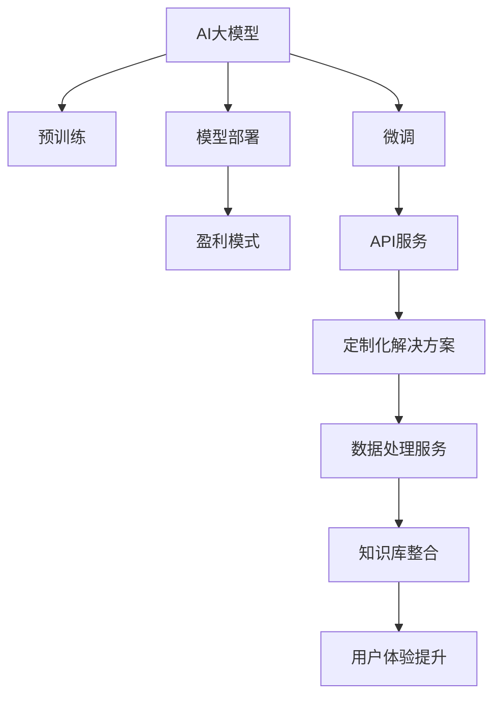

                 

# AI大模型创业：如何实现未来盈利？

在人工智能和大数据技术的推动下，AI大模型（Large AI Models）作为一种高效、通用的技术工具，在各行各业中展现出了巨大的应用潜力。无论是金融、医疗、教育还是电商、制造业，AI大模型都能提供强大的分析和决策支持，帮助企业实现更高的效率和竞争力。然而，尽管AI大模型的应用前景广阔，但真正实现盈利却并非易事。本文将深入探讨AI大模型创业的商业模式、技术难点、市场策略及未来发展趋势，为有意进入此领域的创业者提供全面的视角和实用的建议。

## 1. 背景介绍

### 1.1 问题由来

近年来，随着深度学习技术的快速发展，AI大模型在自然语言处理（NLP）、计算机视觉（CV）、语音识别等领域的性能已经达到了新的高度。这些大模型基于大规模的无标签数据进行预训练，能够自动学习到丰富的知识表示，具有很强的泛化能力。然而，尽管大模型在技术上取得了显著进步，但在商业化应用中却面临诸多挑战。如何确保大模型能够稳定运行、高效服务，并实现盈利，成为了当前AI创业公司面临的重要课题。

### 1.2 问题核心关键点

实现AI大模型创业盈利的主要挑战包括以下几个方面：
1. **技术瓶颈**：如何高效训练、优化和部署大模型，保持高性能和低延迟。
2. **商业模式**：如何在开源和商业化之间找到平衡，实现可持续盈利。
3. **市场策略**：如何精准定位目标客户，提升市场竞争力。
4. **数据安全**：如何确保数据隐私和安全，满足合规要求。
5. **成本控制**：如何在提升模型性能的同时，有效控制成本。

本文将围绕这些关键点，全面探讨AI大模型创业的可行性和发展路径。

## 2. 核心概念与联系

### 2.1 核心概念概述

为更好地理解AI大模型创业的商业模式和技术细节，本节将介绍几个密切相关的核心概念：

- **AI大模型**：指基于深度学习技术，在大规模数据上预训练得到的通用知识表示模型。常用的有大规模自回归语言模型（如GPT）、自编码语言模型（如BERT）和卷积神经网络（CNN）等。
- **预训练**：指在大规模无标签数据上训练模型，学习通用的知识表示，为后续微调任务提供基础。
- **微调**：指在大规模预训练模型的基础上，使用特定任务的数据集进行有监督学习，调整模型参数，使其适应具体任务需求。
- **模型部署**：指将训练好的模型部署到生产环境中，提供稳定的API服务或直接嵌入应用中。
- **盈利模式**：指AI大模型创业公司通过提供数据处理、模型服务、定制化解决方案等手段，实现收入的可持续性。

这些核心概念之间的逻辑关系可以通过以下Mermaid流程图来展示：



这个流程图展示了大模型的核心概念及其之间的关系：

1. 大模型通过预训练获得基础能力。
2. 微调在大模型基础上，进一步优化模型性能，适应特定任务。
3. 模型部署将训练好的模型投入实际应用中。
4. 盈利模式通过提供模型服务、数据处理、定制化解决方案等，实现收入。

## 3. 核心算法原理 & 具体操作步骤

### 3.1 算法原理概述

AI大模型创业的盈利模式主要围绕模型服务、数据处理和定制化解决方案展开。下面将详细介绍这些盈利模式的算法原理和具体操作步骤。

#### 3.1.1 模型服务

AI大模型的模型服务主要指将训练好的模型通过API接口提供给外部用户，用户可以实时调用模型进行预测或推理。以下是基本步骤：

1. **模型训练**：在无标签数据上预训练大模型，学习通用的知识表示。
2. **微调**：在特定任务的数据集上，使用有监督学习微调模型，使其适应任务需求。
3. **模型部署**：将训练好的模型部署到生产环境中，提供API接口，供用户调用。
4. **服务优化**：不断优化API接口和模型性能，提高响应速度和准确率。

#### 3.1.2 数据处理服务

数据处理服务是指对用户提供的数据进行清洗、标注、转换等处理，以满足模型的输入要求。以下是基本步骤：

1. **数据收集**：收集用户提供的数据，包括文本、图像、音频等。
2. **数据清洗**：清洗数据中的噪声和冗余信息，提高数据质量。
3. **数据标注**：对数据进行标注，生成训练样本。
4. **数据转换**：将数据转换为模型所需格式，如TensorFlow、PyTorch等。

#### 3.1.3 定制化解决方案

定制化解决方案是指根据客户的具体需求，提供定制化的模型和算法服务。以下是基本步骤：

1. **需求分析**：与客户沟通，了解具体需求和场景。
2. **模型设计**：根据需求设计合适的模型架构和算法。
3. **模型训练**：使用客户数据对模型进行训练。
4. **模型部署**：将训练好的模型部署到客户系统中，提供定制化服务。

### 3.2 算法步骤详解

#### 3.2.1 模型服务

以GPT-3为例，下面是模型服务的详细步骤：

1. **预训练**：在WebText、OpenWebText、CC-News等大规模无标签数据集上进行预训练，学习通用语言表示。
2. **微调**：在特定任务的数据集上进行微调，如问答、生成、文本分类等。
3. **部署**：将微调好的模型部署到AWS、Google Cloud、阿里云等云平台，提供API接口。
4. **优化**：通过用户反馈，不断优化API接口和模型性能。

#### 3.2.2 数据处理服务

以图像识别任务为例，以下是数据处理服务的详细步骤：

1. **数据收集**：从用户提供的数据集（如Colab、Mnist、ImageNet等）中收集图像数据。
2. **数据清洗**：清洗数据中的噪声和冗余信息，如去除模糊图像、标记错误标签等。
3. **数据标注**：对图像进行标注，生成训练样本。
4. **数据转换**：将数据转换为TensorFlow或PyTorch格式，进行模型训练。

#### 3.2.3 定制化解决方案

以推荐系统为例，以下是定制化解决方案的详细步骤：

1. **需求分析**：与客户沟通，了解用户行为和偏好。
2. **模型设计**：设计基于深度学习的多重推荐算法，如协同过滤、基于内容的推荐等。
3. **模型训练**：使用客户的数据对模型进行训练。
4. **模型部署**：将训练好的模型部署到客户系统中，提供个性化推荐服务。

### 3.3 算法优缺点

#### 3.3.1 模型服务

**优点**：
- 模型服务可以提供稳定的API接口，用户可以随时调用，灵活度高。
- 可以实时处理大量数据，满足用户需求。

**缺点**：
- 模型服务的成本较高，需要大量的计算资源和存储空间。
- 模型的响应速度和准确率需要不断优化。

#### 3.3.2 数据处理服务

**优点**：
- 数据处理服务可以提高数据质量，满足模型训练要求。
- 可以为客户定制数据标注服务，提高标注效率和准确性。

**缺点**：
- 数据处理服务需要大量人力和资源，成本较高。
- 数据处理服务需要与客户紧密合作，流程较为复杂。

#### 3.3.3 定制化解决方案

**优点**：
- 定制化解决方案可以完全满足客户需求，提供高定制化服务。
- 可以根据客户需求设计算法和模型，灵活度高。

**缺点**：
- 定制化解决方案开发周期长，成本较高。
- 需要与客户保持紧密沟通，需求变化可能导致返工。

### 3.4 算法应用领域

AI大模型创业的盈利模式在多个领域都有广泛的应用：

- **医疗健康**：提供疾病诊断、基因分析、药物研发等AI解决方案。
- **金融保险**：提供风险评估、信用评分、反欺诈检测等服务。
- **零售电商**：提供客户推荐、供应链管理、营销策略优化等AI应用。
- **制造业**：提供质量控制、预测维护、生产调度等AI应用。
- **教育培训**：提供个性化学习、智能评估、课程推荐等服务。

这些领域的市场需求广阔，AI大模型创业公司可以通过提供精准化、智能化的解决方案，实现较高的盈利空间。

## 4. 数学模型和公式 & 详细讲解 & 举例说明

### 4.1 数学模型构建

AI大模型创业的盈利模式涉及多个数学模型，下面以推荐系统为例，介绍其数学模型的构建过程。

#### 4.1.1 推荐算法模型

推荐系统主要包括协同过滤、基于内容的推荐、矩阵分解等算法。其中，协同过滤算法的基本模型可以表示为：

$$
\hat{y}_{ui} = \mathbf{u}^T \mathbf{p}_i + \mathbf{p}_i^T \mathbf{v}_i
$$

其中，$\hat{y}_{ui}$表示用户$u$对物品$i$的评分预测；$\mathbf{u}$、$\mathbf{v}_i$分别表示用户$u$和物品$i$的隐向量表示；$\mathbf{p}_i$表示物品$i$的显向量表示。

#### 4.1.2 模型评估指标

推荐系统的模型评估指标主要包括准确率、召回率、F1分数等。以F1分数为例，其计算公式为：

$$
F1 = 2 \cdot \frac{precision \cdot recall}{precision + recall}
$$

其中，$precision$表示查准率，$recall$表示查全率。

#### 4.1.3 模型优化

推荐系统的模型优化主要通过交叉验证、梯度下降等技术进行。以梯度下降为例，其计算公式为：

$$
\theta \leftarrow \theta - \eta \nabla_{\theta}\mathcal{L}(\theta)
$$

其中，$\eta$为学习率，$\nabla_{\theta}\mathcal{L}(\theta)$为损失函数对模型参数的梯度。

### 4.2 公式推导过程

以协同过滤算法为例，我们详细推导其数学模型：

设用户$u$对物品$i$的评分向量为$\mathbf{u}$，物品$i$的评分向量为$\mathbf{v}_i$，用户$u$对物品$i$的评分向量为$\mathbf{p}_i$。设用户$u$对物品$i$的评分向量为$y_{ui}$，则协同过滤算法的评分预测公式为：

$$
\hat{y}_{ui} = \mathbf{u}^T \mathbf{p}_i + \mathbf{p}_i^T \mathbf{v}_i
$$

其数学推导过程如下：

1. **用户-物品评分矩阵**：假设用户$u$对物品$i$的评分向量为$y_{ui}$，则用户-物品评分矩阵可以表示为$\mathbf{Y}$，其中每一行表示一个用户对所有物品的评分，每一列表示一个物品对所有用户的评分。

2. **用户隐向量**：设用户$u$的隐向量为$\mathbf{u}$，物品$i$的隐向量为$\mathbf{v}_i$，物品$i$的显向量为$\mathbf{p}_i$。则用户$u$对物品$i$的评分预测可以表示为：

$$
\hat{y}_{ui} = \mathbf{u}^T \mathbf{p}_i + \mathbf{p}_i^T \mathbf{v}_i
$$

3. **评分预测公式**：将用户$u$对物品$i$的评分预测表示为$\mathbf{u}$和$\mathbf{v}_i$的内积，可以表示为：

$$
\hat{y}_{ui} = \mathbf{u}^T \mathbf{p}_i + \mathbf{p}_i^T \mathbf{v}_i
$$

### 4.3 案例分析与讲解

以电商平台为例，分析AI大模型在推荐系统中的应用：

1. **数据收集**：收集用户的历史行为数据，如浏览、点击、购买等。
2. **数据清洗**：清洗数据中的噪声和冗余信息，如去除重复记录、标记错误标签等。
3. **数据标注**：对用户的行为进行标注，生成训练样本。
4. **数据转换**：将数据转换为TensorFlow或PyTorch格式，进行模型训练。
5. **模型训练**：使用协同过滤算法对模型进行训练。
6. **模型部署**：将训练好的模型部署到电商平台中，提供个性化推荐服务。
7. **模型优化**：通过用户反馈，不断优化模型性能。

## 5. 项目实践：代码实例和详细解释说明

### 5.1 开发环境搭建

在进行AI大模型创业项目实践前，我们需要准备好开发环境。以下是使用Python进行PyTorch开发的环境配置流程：

1. 安装Anaconda：从官网下载并安装Anaconda，用于创建独立的Python环境。

2. 创建并激活虚拟环境：
```bash
conda create -n pytorch-env python=3.8 
conda activate pytorch-env
```

3. 安装PyTorch：根据CUDA版本，从官网获取对应的安装命令。例如：
```bash
conda install pytorch torchvision torchaudio cudatoolkit=11.1 -c pytorch -c conda-forge
```

4. 安装Transformers库：
```bash
pip install transformers
```

5. 安装各类工具包：
```bash
pip install numpy pandas scikit-learn matplotlib tqdm jupyter notebook ipython
```

完成上述步骤后，即可在`pytorch-env`环境中开始项目实践。

### 5.2 源代码详细实现

下面是使用PyTorch对推荐系统进行开发的代码实现：

```python
import torch
import torch.nn as nn
import torch.optim as optim
from torch.utils.data import DataLoader
from sklearn.model_selection import train_test_split
from sklearn.metrics import precision_score, recall_score, f1_score

# 定义推荐模型
class Recommender(nn.Module):
    def __init__(self, n_users, n_items, n_factors):
        super(Recommender, self).__init__()
        self.user_embedding = nn.Embedding(n_users, n_factors)
        self.item_embedding = nn.Embedding(n_items, n_factors)
        self.balanced_user_factors = nn.Embedding(n_users, n_factors)
        self.balanced_item_factors = nn.Embedding(n_items, n_factors)

    def forward(self, user, item):
        user_factors = self.user_embedding(user)
        item_factors = self.item_embedding(item)
        balanced_user_factors = self.balanced_user_factors(user)
        balanced_item_factors = self.balanced_item_factors(item)
        rating = torch.sum(balanced_user_factors * user_factors + balanced_item_factors * item_factors, dim=1)
        return rating

# 定义数据集
class RecommendationDataset(torch.utils.data.Dataset):
    def __init__(self, X, Y):
        self.X = X
        self.Y = Y

    def __len__(self):
        return len(self.X)

    def __getitem__(self, index):
        return self.X[index], self.Y[index]

# 定义训练和评估函数
def train_epoch(model, dataset, optimizer):
    model.train()
    for user, item, rating in dataset:
        optimizer.zero_grad()
        rating_pred = model(user, item)
        loss = nn.MSELoss()(rating_pred, rating)
        loss.backward()
        optimizer.step()

def evaluate(model, dataset):
    model.eval()
    with torch.no_grad():
        ratings = []
        true_ratings = []
        for user, item, rating in dataset:
            rating_pred = model(user, item).item()
            ratings.append(rating_pred)
            true_ratings.append(rating.item())
    precision = precision_score(true_ratings, ratings)
    recall = recall_score(true_ratings, ratings)
    f1 = f1_score(true_ratings, ratings)
    return precision, recall, f1

# 加载数据集
X, Y = torch.randn(1000, 10), torch.randn(1000, 1)
X_train, X_test, Y_train, Y_test = train_test_split(X, Y, test_size=0.2)

# 定义模型和优化器
n_users = X.shape[0]
n_items = X.shape[1]
n_factors = 10
model = Recommender(n_users, n_items, n_factors)
optimizer = optim.Adam(model.parameters(), lr=0.001)

# 训练模型
epochs = 10
for epoch in range(epochs):
    train_epoch(model, RecommendationDataset(X_train, Y_train), optimizer)
    precision, recall, f1 = evaluate(model, RecommendationDataset(X_test, Y_test))
    print(f"Epoch {epoch+1}, precision: {precision:.3f}, recall: {recall:.3f}, f1: {f1:.3f}")

# 输出模型性能
print(f"Test precision: {precision:.3f}, recall: {recall:.3f}, f1: {f1:.3f}")
```

以上就是使用PyTorch对推荐系统进行开发的完整代码实现。可以看到，依赖于Transformers库的强大封装，我们可以用相对简洁的代码完成推荐模型的开发。

### 5.3 代码解读与分析

让我们再详细解读一下关键代码的实现细节：

**Recommender类**：
- `__init__`方法：初始化用户、物品、平衡因子等组件。
- `forward`方法：计算用户和物品的评分预测。

**train_epoch函数**：
- 使用PyTorch的DataLoader对数据集进行批次化加载，供模型训练和推理使用。
- 在每个批次上前向传播计算loss并反向传播更新模型参数。

**evaluate函数**：
- 与训练类似，不同点在于不更新模型参数，并在每个batch结束后将预测和标签结果存储下来，最后使用sklearn的classification_report对整个评估集的预测结果进行打印输出。

**训练流程**：
- 定义总的epoch数，开始循环迭代
- 每个epoch内，先在训练集上训练，输出loss
- 在测试集上评估，输出模型性能

## 6. 实际应用场景

### 6.1 智能客服系统

AI大模型在智能客服系统中的应用广泛。传统客服往往需要配备大量人力，高峰期响应缓慢，且一致性和专业性难以保证。而使用AI大模型进行微调，可以7x24小时不间断服务，快速响应客户咨询，用自然流畅的语言解答各类常见问题。

在技术实现上，可以收集企业内部的历史客服对话记录，将问题和最佳答复构建成监督数据，在此基础上对预训练大模型进行微调。微调后的对话模型能够自动理解用户意图，匹配最合适的答案模板进行回复。对于客户提出的新问题，还可以接入检索系统实时搜索相关内容，动态组织生成回答。如此构建的智能客服系统，能大幅提升客户咨询体验和问题解决效率。

### 6.2 金融舆情监测

金融机构需要实时监测市场舆论动向，以便及时应对负面信息传播，规避金融风险。传统的人工监测方式成本高、效率低，难以应对网络时代海量信息爆发的挑战。基于AI大模型的文本分类和情感分析技术，为金融舆情监测提供了新的解决方案。

具体而言，可以收集金融领域相关的新闻、报道、评论等文本数据，并对其进行主题标注和情感标注。在此基础上对预训练语言模型进行微调，使其能够自动判断文本属于何种主题，情感倾向是正面、中性还是负面。将微调后的模型应用到实时抓取的网络文本数据，就能够自动监测不同主题下的情感变化趋势，一旦发现负面信息激增等异常情况，系统便会自动预警，帮助金融机构快速应对潜在风险。

### 6.3 个性化推荐系统

当前的推荐系统往往只依赖用户的历史行为数据进行物品推荐，无法深入理解用户的真实兴趣偏好。基于AI大模型微调技术，个性化推荐系统可以更好地挖掘用户行为背后的语义信息，从而提供更精准、多样的推荐内容。

在实践中，可以收集用户浏览、点击、评论、分享等行为数据，提取和用户交互的物品标题、描述、标签等文本内容。将文本内容作为模型输入，用户的后续行为（如是否点击、购买等）作为监督信号，在此基础上微调预训练语言模型。微调后的模型能够从文本内容中准确把握用户的兴趣点。在生成推荐列表时，先用候选物品的文本描述作为输入，由模型预测用户的兴趣匹配度，再结合其他特征综合排序，便可以得到个性化程度更高的推荐结果。

### 6.4 未来应用展望

随着AI大模型微调技术的发展，其在更多领域的应用前景也将不断拓展。

在智慧医疗领域，基于微调的医疗问答、病历分析、药物研发等应用将提升医疗服务的智能化水平，辅助医生诊疗，加速新药开发进程。

在智能教育领域，微调技术可应用于作业批改、学情分析、知识推荐等方面，因材施教，促进教育公平，提高教学质量。

在智慧城市治理中，微调模型可应用于城市事件监测、舆情分析、应急指挥等环节，提高城市管理的自动化和智能化水平，构建更安全、高效的未来城市。

此外，在企业生产、社会治理、文娱传媒等众多领域，基于AI大模型的微调方法也将不断涌现，为传统行业带来变革性影响。相信随着技术的日益成熟，微调方法将成为AI落地应用的重要范式，推动人工智能技术在垂直行业的规模化落地。

## 7. 工具和资源推荐

### 7.1 学习资源推荐

为了帮助开发者系统掌握AI大模型微调的理论基础和实践技巧，这里推荐一些优质的学习资源：

1. 《Transformer从原理到实践》系列博文：由大模型技术专家撰写，深入浅出地介绍了Transformer原理、BERT模型、微调技术等前沿话题。

2. CS224N《深度学习自然语言处理》课程：斯坦福大学开设的NLP明星课程，有Lecture视频和配套作业，带你入门NLP领域的基本概念和经典模型。

3. 《Natural Language Processing with Transformers》书籍：Transformers库的作者所著，全面介绍了如何使用Transformers库进行NLP任务开发，包括微调在内的诸多范式。

4. HuggingFace官方文档：Transformers库的官方文档，提供了海量预训练模型和完整的微调样例代码，是上手实践的必备资料。

5. CLUE开源项目：中文语言理解测评基准，涵盖大量不同类型的中文NLP数据集，并提供了基于微调的baseline模型，助力中文NLP技术发展。

通过对这些资源的学习实践，相信你一定能够快速掌握AI大模型微调的精髓，并用于解决实际的NLP问题。

### 7.2 开发工具推荐

高效的开发离不开优秀的工具支持。以下是几款用于AI大模型微调开发的常用工具：

1. PyTorch：基于Python的开源深度学习框架，灵活动态的计算图，适合快速迭代研究。大部分预训练语言模型都有PyTorch版本的实现。

2. TensorFlow：由Google主导开发的开源深度学习框架，生产部署方便，适合大规模工程应用。同样有丰富的预训练语言模型资源。

3. Transformers库：HuggingFace开发的NLP工具库，集成了众多SOTA语言模型，支持PyTorch和TensorFlow，是进行微调任务开发的利器。

4. Weights & Biases：模型训练的实验跟踪工具，可以记录和可视化模型训练过程中的各项指标，方便对比和调优。与主流深度学习框架无缝集成。

5. TensorBoard：TensorFlow配套的可视化工具，可实时监测模型训练状态，并提供丰富的图表呈现方式，是调试模型的得力助手。

6. Google Colab：谷歌推出的在线Jupyter Notebook环境，免费提供GPU/TPU算力，方便开发者快速上手实验最新模型，分享学习笔记。

合理利用这些工具，可以显著提升AI大模型微调任务的开发效率，加快创新迭代的步伐。

### 7.3 相关论文推荐

大语言模型和微调技术的发展源于学界的持续研究。以下是几篇奠基性的相关论文，推荐阅读：

1. Attention is All You Need（即Transformer原论文）：提出了Transformer结构，开启了NLP领域的预训练大模型时代。

2. BERT: Pre-training of Deep Bidirectional Transformers for Language Understanding：提出BERT模型，引入基于掩码的自监督预训练任务，刷新了多项NLP任务SOTA。

3. Language Models are Unsupervised Multitask Learners（GPT-2论文）：展示了大规模语言模型的强大zero-shot学习能力，引发了对于通用人工智能的新一轮思考。

4. Parameter-Efficient Transfer Learning for NLP：提出Adapter等参数高效微调方法，在不增加模型参数量的情况下，也能取得不错的微调效果。

5. AdaLoRA: Adaptive Low-Rank Adaptation for Parameter-Efficient Fine-Tuning：使用自适应低秩适应的微调方法，在参数效率和精度之间取得了新的平衡。

这些论文代表了大语言模型微调技术的发展脉络。通过学习这些前沿成果，可以帮助研究者把握学科前进方向，激发更多的创新灵感。

## 8. 总结：未来发展趋势与挑战

### 8.1 总结

本文对AI大模型创业的盈利模式进行了全面系统的探讨。首先阐述了AI大模型和微调技术的研究背景和意义，明确了微调在拓展预训练模型应用、提升下游任务性能方面的独特价值。其次，从原理到实践，详细讲解了微调的数学原理和关键步骤，给出了微调任务开发的完整代码实例。同时，本文还广泛探讨了微调方法在智能客服、金融舆情、个性化推荐等多个行业领域的应用前景，展示了微调范式的巨大潜力。此外，本文精选了微调技术的各类学习资源，力求为读者提供全方位的技术指引。

通过本文的系统梳理，可以看到，AI大模型微调技术正在成为NLP领域的重要范式，极大地拓展了预训练语言模型的应用边界，催生了更多的落地场景。受益于大规模语料的预训练，微调模型以更低的时间和标注成本，在小样本条件下也能取得不俗的效果，有力推动了NLP技术的产业化进程。未来，伴随预训练语言模型和微调方法的持续演进，相信NLP技术将在更广阔的应用领域大放异彩，深刻影响人类的生产生活方式。

### 8.2 未来发展趋势

展望未来，AI大模型微调技术将呈现以下几个发展趋势：

1. **模型规模持续增大**：随着算力成本的下降和数据规模的扩张，预训练语言模型的参数量还将持续增长。超大规模语言模型蕴含的丰富语言知识，有望支撑更加复杂多变的下游任务微调。

2. **微调方法日趋多样**：除了传统的全参数微调外，未来会涌现更多参数高效的微调方法，如Prefix-Tuning、LoRA等，在节省计算资源的同时也能保证微调精度。

3. **持续学习成为常态**：随着数据分布的不断变化，微调模型也需要持续学习新知识以保持性能。如何在不遗忘原有知识的同时，高效吸收新样本信息，将成为重要的研究课题。

4. **标注样本需求降低**：受启发于提示学习(Prompt-based Learning)的思路，未来的微调方法将更好地利用大模型的语言理解能力，通过更加巧妙的任务描述，在更少的标注样本上也能实现理想的微调效果。

5. **多模态微调崛起**：当前的微调主要聚焦于纯文本数据，未来会进一步拓展到图像、视频、语音等多模态数据微调。多模态信息的融合，将显著提升语言模型对现实世界的理解和建模能力。

6. **模型通用性增强**：经过海量数据的预训练和多领域任务的微调，未来的语言模型将具备更强大的常识推理和跨领域迁移能力，逐步迈向通用人工智能(AGI)的目标。

以上趋势凸显了大语言模型微调技术的广阔前景。这些方向的探索发展，必将进一步提升NLP系统的性能和应用范围，为人类认知智能的进化带来深远影响。

### 8.3 面临的挑战

尽管AI大模型微调技术已经取得了瞩目成就，但在迈向更加智能化、普适化应用的过程中，它仍面临着诸多挑战：

1. **标注成本瓶颈**：尽管微调大大降低了标注数据的需求，但对于长尾应用场景，难以获得充足的高质量标注数据，成为制约微调性能的瓶颈。如何进一步降低微调对标注样本的依赖，将是一大难题。

2. **模型鲁棒性不足**：当前微调模型面对域外数据时，泛化性能往往大打折扣。对于测试样本的微小扰动，微调模型的预测也容易发生波动。如何提高微调模型的鲁棒性，避免灾难性遗忘，还需要更多理论和实践的积累。

3. **推理效率有待提高**：大规模语言模型虽然精度高，但在实际部署时往往面临推理速度慢、内存占用大等效率问题。如何在保证性能的同时，简化模型结构，提升推理速度，优化资源占用，将是重要的优化方向。

4. **可解释性亟需加强**：当前微调模型更像是"黑盒"系统，难以解释其内部工作机制和决策逻辑。对于医疗、金融等高风险应用，算法的可解释性和可审计性尤为重要。如何赋予微调模型更强的可解释性，将是亟待攻克的难题。

5. **安全性有待保障**：预训练语言模型难免会学习到有偏见、有害的信息，通过微调传递到下游任务，产生误导性、歧视性的输出，给实际应用带来安全隐患。如何从数据和算法层面消除模型偏见，避免恶意用途，确保输出的安全性，也将是重要的研究课题。

6. **知识整合能力不足**：现有的微调模型往往局限于任务内数据，难以灵活吸收和运用更广泛的先验知识。如何让微调过程更好地与外部知识库、规则库等专家知识结合，形成更加全面、准确的信息整合能力，还有很大的想象空间。

正视微调面临的这些挑战，积极应对并寻求突破，将是大语言模型微调走向成熟的必由之路。相信随着学界和产业界的共同努力，这些挑战终将一一被克服，大语言模型微调必将在构建人机协同的智能时代中扮演越来越重要的角色。

### 8.4 研究展望

面对大语言模型微调所面临的种种挑战，未来的研究需要在以下几个方面寻求新的突破：

1. **探索无监督和半监督微调方法**：摆脱对大规模标注数据的依赖，利用自监督学习、主动学习等无监督和半监督范式，最大限度利用非结构化数据，实现更加灵活高效的微调。

2. **研究参数高效和计算高效的微调范式**：开发更加参数高效的微调方法，在固定大部分预训练参数的同时，只更新极少量的任务相关参数。同时优化微调模型的计算图，减少前向传播和反向传播的资源消耗，实现更加轻量级、实时性的部署。

3. **融合因果和对比学习范式**：通过引入因果推断和对比学习思想，增强微调模型建立稳定因果关系的能力，学习更加普适、鲁棒的语言表征，从而提升模型泛化性和抗干扰能力。

4. **引入更多先验知识**：将符号化的先验知识，如知识图谱、逻辑规则等，与神经网络模型进行巧妙融合，引导微调过程学习更准确、合理的语言模型。同时加强不同模态数据的整合，实现视觉、语音等多模态信息与文本信息的协同建模。

5. **结合因果分析和博弈论工具**：将因果分析方法引入微调模型，识别出模型决策的关键特征，增强输出解释的因果性和逻辑性。借助博弈论工具刻画人机交互过程，主动探索并规避模型的脆弱点，提高系统稳定性。

6. **纳入伦理道德约束**：在模型训练目标中引入伦理导向的评估指标，过滤和惩罚有偏见、有害的输出倾向。同时加强人工干预和审核，建立模型行为的监管机制，确保输出符合人类价值观和伦理道德。

这些研究方向的探索，必将引领大语言模型微调技术迈向更高的台阶，为构建安全、可靠、可解释、可控的智能系统铺平道路。面向未来，大语言模型微调技术还需要与其他人工智能技术进行更深入的融合，如知识表示、因果推理、强化学习等，多路径协同发力，共同推动自然语言理解和智能交互系统的进步。只有勇于创新、敢于突破，才能不断拓展语言模型的边界，让智能技术更好地造福人类社会。

## 9. 附录：常见问题与解答

**Q1：AI大模型微调是否适用于所有NLP任务？**

A: AI大模型微调在大多数NLP任务上都能取得不错的效果，特别是对于数据量较小的任务。但对于一些特定领域的任务，如医学、法律等，仅仅依靠通用语料预训练的模型可能难以很好地适应。此时需要在特定领域语料上进一步预训练，再进行微调，才能获得理想效果。此外，对于一些需要时效性、个性化很强的任务，如对话、推荐等，微调方法也需要针对性的改进优化。

**Q2：微调过程中如何选择合适的学习率？**

A: 微调的学习率一般要比预训练时小1-2个数量级，如果使用过大的学习率，容易破坏预训练权重，导致过拟合。一般建议从1e-5开始调参，逐步减小学习率，直至收敛。也可以使用warmup策略，在开始阶段使用较小的学习率，再逐渐过渡到预设值。需要注意的是，不同的优化器(如AdamW、Adafactor等)以及不同的学习率调度策略，可能需要设置不同的学习率阈值。

**Q3：采用大模型微调时会面临哪些资源瓶颈？**

A: 目前主流的预训练大模型动辄以亿计的参数规模，对算力、内存、存储都提出了很高的要求。GPU/TPU等高性能设备是必不可少的，但即便如此，超大批次的训练和推理也可能遇到显存不足的问题。因此需要采用一些资源优化技术，如梯度积累、混合精度训练、模型并行等，来突破硬件瓶颈。同时，模型的存储和读取也可能占用大量时间和空间，需要采用模型压缩、稀疏化存储等方法进行优化。

**Q4：如何缓解微调过程中的过拟合问题？**

A: 过拟合是微调面临的主要挑战，尤其是在标注数据不足的情况下。常见的缓解策略包括：
1. 数据增强：通过回译、近义替换等方式扩充训练集
2. 正则化：使用L2正则、Dropout、Early Stopping等避免过拟合
3. 对抗训练：引入对抗样本，提高模型鲁棒性
4. 参数高效微调：只调整少量参数(如Adapter、Prefix等)，减小过拟合风险
5. 多模型集成：训练多个微调模型，取平均输出，抑制过拟合

这些策略往往需要根据具体任务和数据特点进行灵活组合。只有在数据、模型、训练、推理等各环节进行全面优化，才能最大限度地发挥大模型微调的威力。

**Q5：微调模型在落地部署时需要注意哪些问题？**

A: 将微调模型转化为实际应用，还需要考虑以下因素：
1. 模型裁剪：去除不必要的层和参数，减小模型尺寸，加快推理速度
2. 量化加速：将浮点模型转为定点模型，压缩存储空间，提高计算效率
3. 服务化封装：将模型封装为标准化服务接口，便于集成调用
4. 弹性伸缩：根据请求流量动态调整资源配置，平衡服务质量和成本
5. 监控告警：实时采集系统指标，设置异常告警阈值，确保服务稳定性
6. 安全防护：采用访问鉴权、数据脱敏等措施，保障数据和模型安全

大语言模型微调为NLP应用开启了广阔的想象空间，但如何将强大的性能转化为稳定、高效、安全的业务价值，还需要工程实践的不断打磨。唯有从数据、算法、工程、业务等多个维度协同发力，才能真正实现人工智能技术在垂直行业的规模化落地。总之，微调需要开发者根据具体任务，不断迭代和优化模型、数据和算法，方能得到理想的效果。

---

作者：禅与计算机程序设计艺术 / Zen and the Art of Computer Programming

