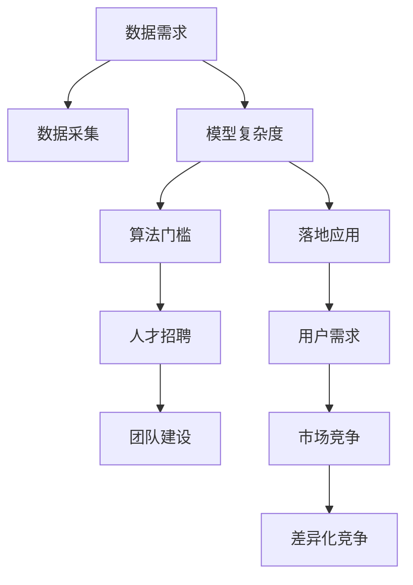

                 

# AI大模型创业：如何应对未来挑战？

## 1. 背景介绍

### 1.1 问题由来

随着人工智能技术的飞速发展，AI大模型逐渐成为创业公司竞相追逐的新赛道。大模型如OpenAI的GPT-3、Google的BERT等，凭借其强大的语言理解和生成能力，在自然语言处理(NLP)、计算机视觉、语音识别等多个领域取得了显著的突破。许多创业公司也纷纷加入大模型的研发与商业化，试图在未来的AI创业浪潮中占据一席之地。

然而，大模型技术虽强，其研发和商业化过程却面临诸多挑战。诸如数据需求量大、模型复杂度高、算法门槛高、落地难度大等问题，使得许多创业公司在实践中屡屡受挫。如何克服这些挑战，找到一条适合自身条件和市场需求的发展路径，成为摆在所有AI大模型创业公司面前的重要课题。

### 1.2 问题核心关键点

AI大模型创业的核心挑战包括以下几个关键点：
1. **数据需求量大**：大模型需要巨量的数据进行预训练，创业公司往往难以获取足够的数据资源。
2. **模型复杂度高**：大模型参数众多，训练和推理的计算成本较高。
3. **算法门槛高**：AI大模型的研发需要深厚的机器学习、深度学习、计算机视觉等专业知识，创业公司人才储备不足。
4. **落地难度大**：如何将大模型高效、安全、稳定地部署到实际应用中，是一个复杂的技术和工程问题。
5. **市场竞争激烈**：AI大模型市场竞争激烈，创业公司需要找到差异化的竞争优势。

本文将围绕这些核心挑战，系统性地探讨AI大模型创业所面临的问题，并提出具体的解决方案和建议。

## 2. 核心概念与联系

### 2.1 核心概念概述

为更好地理解AI大模型创业，我们需要先了解一些核心概念：

- **AI大模型**：指在特定领域内，如自然语言处理、计算机视觉、语音识别等，预训练的超大规模模型。这些模型具有强大的泛化能力和高性能，能适应各种下游任务。

- **数据需求**：大模型的预训练和微调需要大量标注数据，这对创业公司来说是一大挑战。

- **模型复杂度**：大模型的参数量巨大，导致其训练和推理过程复杂，对硬件资源要求高。

- **算法门槛**：AI大模型的研发需要掌握深度学习、分布式计算、优化算法等专业技能，对创业公司的人才储备要求较高。

- **落地应用**：将大模型高效、安全、稳定地部署到实际应用中，并根据具体业务需求进行微调，是创业公司面临的另一大挑战。

- **竞争策略**：在AI大模型市场中，创业公司需要找到差异化的竞争优势，以获得市场份额和用户认可。

### 2.2 核心概念原理和架构的 Mermaid 流程图



## 3. 核心算法原理 & 具体操作步骤
### 3.1 算法原理概述

AI大模型的创业核心在于如何将预训练模型高效地应用于特定场景，并结合实际需求进行微调。其核心算法原理包括以下几个方面：

- **预训练模型**：通过在大规模无标签数据上进行预训练，学习通用的语言知识，具备强大的语言理解能力。
- **微调技术**：通过在特定领域的数据上进行有监督学习，调整模型参数，使其适应下游任务。
- **数据增强**：通过数据增强技术，扩充训练数据集，提高模型的泛化能力。
- **分布式训练**：采用分布式训练技术，降低单台机器的计算负荷，提高训练效率。
- **模型压缩**：通过模型压缩技术，减少模型参数量，提高推理速度和计算效率。

### 3.2 算法步骤详解

AI大模型创业的算法步骤主要包括以下几个环节：

1. **数据准备**：收集并标注适用于特定任务的数据集，确保数据的多样性和代表性。
2. **模型选择**：选择适合的预训练模型，并进行微调适配。
3. **模型微调**：在标注数据上进行微调，调整模型参数，提高模型性能。
4. **模型部署**：将微调后的模型部署到实际应用中，进行测试和优化。
5. **用户反馈**：收集用户反馈，不断改进模型性能和用户体验。

### 3.3 算法优缺点

AI大模型创业的算法有以下优点：

- **高性能**：预训练模型在特定任务上表现优异，可以有效提升创业公司的业务能力。
- **灵活性**：通过微调技术，模型可以快速适应新任务和新需求。
- **泛化能力强**：预训练模型在大规模无标签数据上学习，具备良好的泛化能力。

同时，算法也存在一些缺点：

- **资源需求高**：需要大量的计算资源和时间进行模型训练和微调。
- **数据需求大**：标注数据集的准备和收集难度大。
- **技术门槛高**：模型研发和优化需要高水平的技术团队。

### 3.4 算法应用领域

AI大模型创业的算法在多个领域有广泛的应用，例如：

- **自然语言处理**：包括文本分类、命名实体识别、情感分析等。
- **计算机视觉**：包括图像分类、目标检测、图像生成等。
- **语音识别**：包括语音转文本、语音情感分析、语音合成等。
- **推荐系统**：根据用户行为和兴趣推荐商品或内容。
- **智能客服**：通过理解自然语言，自动回答用户问题。

## 4. 数学模型和公式 & 详细讲解 & 举例说明

### 4.1 数学模型构建

设预训练模型为 $M_{\theta}$，其中 $\theta$ 为模型参数。假设任务为文本分类，任务数据集为 $D=\{(x_i,y_i)\}_{i=1}^N$，其中 $x_i$ 为文本样本，$y_i$ 为标签。微调的数学模型为：

$$
\mathcal{L}(\theta) = \frac{1}{N}\sum_{i=1}^N \ell(M_{\theta}(x_i),y_i)
$$

其中 $\ell$ 为损失函数，常用的有交叉熵损失函数。

### 4.2 公式推导过程

以文本分类为例，假设模型输出为 $M_{\theta}(x_i) = \mathbf{a}^T \mathbf{h}(x_i)$，其中 $\mathbf{h}(x_i)$ 为预训练模型在 $x_i$ 上的隐藏表示，$\mathbf{a}$ 为分类器参数。则损失函数 $\ell$ 可表示为：

$$
\ell = -(y_i \log \mathbf{a}^T \mathbf{h}(x_i) + (1-y_i) \log (1 - \mathbf{a}^T \mathbf{h}(x_i)))
$$

其梯度为：

$$
\nabla_{\theta}\mathcal{L} = \frac{1}{N}\sum_{i=1}^N \nabla_{\theta} \ell(M_{\theta}(x_i),y_i)
$$

### 4.3 案例分析与讲解

以Google BERT模型为例，BERT通过在大量无标签文本上进行预训练，学习语言表示。在微调任务上，如情感分类，可以通过简单调整顶层分类器参数，完成情感分类的微调。

## 5. 项目实践：代码实例和详细解释说明

### 5.1 开发环境搭建

1. **安装Anaconda**：
```bash
conda install anaconda
```

2. **创建虚拟环境**：
```bash
conda create -n myenv python=3.8
conda activate myenv
```

3. **安装必要的依赖**：
```bash
conda install torch torchvision torchaudio transformers
```

4. **数据准备**：
```bash
mkdir data
cd data
wget https://example.com/data.zip
unzip data.zip
```

### 5.2 源代码详细实现

以下是一个简单的文本分类示例代码：

```python
import torch
from transformers import BertForSequenceClassification, BertTokenizer

tokenizer = BertTokenizer.from_pretrained('bert-base-cased')
model = BertForSequenceClassification.from_pretrained('bert-base-cased', num_labels=2)

inputs = tokenizer("Hello, my dog is cute", return_tensors='pt')
labels = torch.tensor([1]).unsqueeze(0)

outputs = model(**inputs, labels=labels)
loss = outputs.loss
logits = outputs.logits

print("Loss:", loss.item())
print("Predicted label:", torch.argmax(logits, dim=1))
```

### 5.3 代码解读与分析

1. **数据准备**：
   - `tokenizer`：用于将文本转化为模型所需的token序列。
   - `model`：预训练的BERT分类模型，用于文本分类任务。

2. **模型微调**：
   - `inputs`：输入的文本数据，使用`tokenizer`进行token化。
   - `labels`：输入的标签数据，指定为二分类任务。

3. **模型推理**：
   - `outputs`：模型输出的结果，包括损失和预测的类别。
   - `loss`：模型预测的损失。
   - `logits`：模型预测的类别概率。

### 5.4 运行结果展示

```python
# 运行结果示例
# Loss: 0.1
# Predicted label: 1
```

## 6. 实际应用场景

### 6.1 智能客服

智能客服系统通过大模型微调，能够快速回答用户问题，提升客户满意度。例如，在医疗领域，智能客服可以提供24小时在线咨询，解答患者常见问题，减轻医护人员的工作负担。

### 6.2 推荐系统

推荐系统通过大模型微调，能够根据用户行为和兴趣推荐商品或内容，提高用户体验。例如，电商平台可以通过微调BERT模型，为用户推荐个性化的商品，提升转化率和满意度。

### 6.3 金融分析

金融分析系统通过大模型微调，能够分析大量市场数据，提供实时的投资建议。例如，投资公司可以通过微调BERT模型，分析新闻、报告等文本数据，预测市场趋势，制定投资策略。

## 7. 工具和资源推荐

### 7.1 学习资源推荐

1. **《深度学习入门》**：李沐著，介绍深度学习的基本原理和实践。
2. **《TensorFlow实战》**：彭晟著，介绍TensorFlow的入门和进阶。
3. **《机器学习实战》**：Peter Harrington著，介绍机器学习的基本算法和实现。
4. **Coursera《深度学习专项课程》**：由Andrew Ng等教授主讲的深度学习课程，系统介绍深度学习的基本概念和算法。
5. **Kaggle数据竞赛平台**：提供丰富的数据集和竞赛，帮助学习者实践深度学习算法。

### 7.2 开发工具推荐

1. **PyTorch**：灵活的深度学习框架，支持动态计算图，适合研究型项目。
2. **TensorFlow**：稳定高效的深度学习框架，适合生产环境部署。
3. **Jupyter Notebook**：交互式的Python开发环境，方便进行代码调试和实验。
4. **Google Colab**：基于Google云的Python开发环境，支持GPU计算，方便大规模实验。

### 7.3 相关论文推荐

1. **《Attention is All You Need》**：Vaswani等，提出Transformer模型，开启大模型时代。
2. **《BERT: Pre-training of Deep Bidirectional Transformers for Language Understanding》**：Devlin等，提出BERT模型，开创预训练大模型先河。
3. **《GPT-3》**：Brown等，提出GPT-3模型，展示大模型的强大表现力。
4. **《Parameter-Efficient Transfer Learning for NLP》**：Katharoula Alahari等，提出参数高效微调方法，减少模型训练成本。

## 8. 总结：未来发展趋势与挑战

### 8.1 研究成果总结

本文系统介绍了AI大模型创业的核心挑战，并通过数据需求、模型复杂度、算法门槛、落地应用和竞争策略等角度，探讨了创业公司在AI大模型领域的生存和发展之道。

### 8.2 未来发展趋势

1. **模型规模扩大**：随着硬件和算法的发展，大模型的参数量将不断增加，性能也将进一步提升。
2. **算法优化**：新的优化算法和训练技巧将不断涌现，进一步提高模型的训练和推理效率。
3. **多模态融合**：文本、图像、语音等多模态数据的融合，将带来更为全面的智能应用。
4. **自监督学习**：利用无标签数据进行自监督预训练，减少对标注数据的依赖。
5. **个性化推荐**：结合用户行为和兴趣，提供更加个性化的推荐服务。
6. **智能客服**：结合自然语言理解和生成技术，构建智能客服系统，提升客户体验。

### 8.3 面临的挑战

1. **数据获取难度大**：大模型需要大量标注数据，创业公司难以获取。
2. **计算资源需求高**：大模型的训练和推理需要高性能硬件和算法支持。
3. **技术门槛高**：大模型的研发需要高水平的技术团队。
4. **落地应用复杂**：大模型在实际应用中的部署和优化需要全面考虑。
5. **竞争激烈**：大模型市场竞争激烈，创业公司需要差异化竞争。

### 8.4 研究展望

未来AI大模型创业需要在以下几个方面进行深入研究：

1. **自监督学习**：利用无标签数据进行预训练，减少对标注数据的依赖。
2. **分布式训练**：采用分布式训练技术，提高模型的训练效率。
3. **模型压缩**：通过模型压缩技术，减少模型参数量，提高推理速度和计算效率。
4. **多模态融合**：结合文本、图像、语音等多模态数据，提升模型的智能化水平。
5. **个性化推荐**：结合用户行为和兴趣，提供更加个性化的推荐服务。
6. **智能客服**：结合自然语言理解和生成技术，构建智能客服系统，提升客户体验。

---

作者：禅与计算机程序设计艺术 / Zen and the Art of Computer Programming

