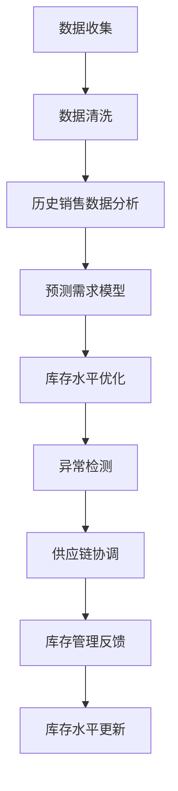

                 

## 1. 背景介绍

### 1.1 问题由来
电商企业的库存管理是业务运营中极为重要的一环，其核心在于如何最大化利润，并避免库存积压或缺货。传统上，库存管理依赖于人工计算和经验决策，但这种依赖既容易出错，效率也低。随着人工智能（AI）技术的飞速发展，AI正逐渐成为电商企业优化库存管理的重要工具。

### 1.2 问题核心关键点
AI库存管理主要通过以下关键技术实现：
- **预测需求**：利用历史销售数据和市场趋势，通过机器学习算法预测未来销量，避免过量或不足库存。
- **库存优化**：根据预测需求和供应链状况，自动调整库存水平和订货策略。
- **异常检测**：通过监控库存数据，及时发现异常情况，比如需求波动、供应延迟等。
- **供应链协调**：协同供应商、物流、仓储等多方资源，优化库存配置。

这些技术在AI的助力下，使得库存管理更加精准、高效、及时。

### 1.3 问题研究意义
通过引入AI，电商企业能够：
- 减少库存成本，提升资金周转率。
- 降低缺货或过量库存的风险，保障客户满意度。
- 快速响应市场变化，保持竞争力。
- 自动化库存管理流程，解放人力资源。
- 提升整体运营效率，为企业带来长期的经济效益。

本文旨在探讨AI如何通过预测需求、优化库存、异常检测和供应链协调等功能，帮助电商企业实现高效、智能的库存管理。

## 2. 核心概念与联系

### 2.1 核心概念概述
1. **AI**：通过模拟人类智能过程的人工智能系统，包括机器学习、深度学习、自然语言处理（NLP）等技术。
2. **预测需求**：利用AI算法，通过分析历史数据，预测未来销售情况。
3. **库存优化**：根据预测结果，自动调整库存水平和订货策略。
4. **异常检测**：通过实时监控库存数据，识别潜在的异常情况。
5. **供应链协调**：通过AI系统，协调供应商、物流、仓储等多方资源。

这些核心概念共同构成了一个完整的AI库存管理系统。

### 2.2 核心概念原理和架构的 Mermaid 流程图(Mermaid 流程节点中不要有括号、逗号等特殊字符)

上述流程展示了AI库存管理的基本架构。

## 3. 核心算法原理 & 具体操作步骤

### 3.1 算法原理概述
AI库存管理主要依赖于机器学习和深度学习算法，以下是对这些算法的概述：

- **预测需求**：
  - **方法**：时间序列预测、回归分析、神经网络等。
  - **原理**：通过分析历史销售数据，预测未来销售量。

- **库存优化**：
  - **方法**：线性规划、整数规划、遗传算法等。
  - **原理**：根据预测需求和供应链情况，调整库存水平和订货策略。

- **异常检测**：
  - **方法**：异常检测算法，如基于统计的方法、基于机器学习的方法。
  - **原理**：通过监控库存数据，识别异常情况。

- **供应链协调**：
  - **方法**：协同优化算法，如多层优化、强化学习等。
  - **原理**：协调供应商、物流、仓储等多方资源，优化库存配置。

### 3.2 算法步骤详解
以下是对每个核心算法的详细步骤说明：

**3.2.1 预测需求**

1. **数据收集**：
   - 收集历史销售数据，如日/周/月销量、促销活动影响等。
   - 收集市场数据，如节假日、季节性变化、天气、节假日等。

2. **数据清洗**：
   - 去除异常值，如明显错误的数据。
   - 处理缺失值，如通过插值法、均值法等。

3. **特征工程**：
   - 提取特征，如时间特征、促销特征、节假日特征等。
   - 特征归一化、标准化等。

4. **模型训练**：
   - 选择模型，如时间序列预测模型、回归模型、神经网络模型等。
   - 使用历史数据训练模型。
   - 进行模型验证和调优。

5. **预测需求**：
   - 将当前数据输入模型，输出预测需求。
   - 使用预测需求进行库存管理。

**3.2.2 库存优化**

1. **确定目标**：
   - 确定优化目标，如最小化库存成本、最大化客户满意度等。

2. **建立模型**：
   - 建立数学模型，如线性规划模型、整数规划模型等。
   - 确定变量和约束条件。

3. **求解优化**：
   - 使用优化算法求解模型，如遗传算法、蚁群算法等。
   - 获得最优解。

4. **库存调整**：
   - 根据最优解调整库存水平和订货策略。
   - 更新库存系统。

**3.2.3 异常检测**

1. **设置阈值**：
   - 根据业务需求，设置库存数据的正常范围。

2. **实时监控**：
   - 实时监控库存数据，如库存水平、销量变化等。
   - 将实时数据与正常范围进行比较。

3. **异常识别**：
   - 使用异常检测算法识别异常情况。
   - 判断异常类型，如需求波动、供应延迟等。

4. **处理异常**：
   - 根据异常情况，采取相应措施，如临时调整库存、通知供应商等。

**3.2.4 供应链协调**

1. **需求预测**：
   - 对供应链各环节进行需求预测。
   - 确定各环节的预测需求。

2. **资源配置**：
   - 根据预测需求和库存水平，优化资源配置。
   - 确定供应商、物流、仓储等资源的分配。

3. **协同优化**：
   - 使用协同优化算法，如多层优化、强化学习等。
   - 实时调整供应链资源配置，确保库存管理高效。

4. **协调反馈**：
   - 获取各环节的反馈信息。
   - 调整供应链策略，持续优化库存管理。

### 3.3 算法优缺点

**优点**：
- **精准预测**：AI算法能够利用大量数据，预测未来需求，提高库存管理的准确性。
- **自动化流程**：通过自动化流程，减少人为错误，提高效率。
- **实时响应**：能够实时监控库存数据，及时调整策略。

**缺点**：
- **数据质量要求高**：AI模型依赖于高质量的数据，数据不准确会影响预测结果。
- **算法复杂度高**：算法复杂度高，计算成本大，需要较强的计算资源。
- **模型依赖性强**：模型需要定期训练和更新，依赖于新数据。

### 3.4 算法应用领域

AI库存管理技术在电商、零售、制造业等多个领域都有广泛应用，主要领域包括：
- **电商**：通过AI优化库存水平，提升客户满意度。
- **零售**：协调供应链，提高库存效率。
- **制造**：预测生产需求，优化生产计划。
- **物流**：优化物流资源配置，降低运输成本。

## 4. 数学模型和公式 & 详细讲解 & 举例说明

### 4.1 数学模型构建

**4.1.1 预测需求模型**

预测需求通常使用时间序列预测方法，如ARIMA模型、LSTM模型等。以ARIMA模型为例，其数学模型如下：
$$ y_t = \alpha + \beta t + \gamma_1 y_{t-1} + \gamma_2 y_{t-2} + \epsilon_t $$
其中：
- $y_t$ 为第 $t$ 周的销量。
- $\alpha$、$\beta$、$\gamma_1$、$\gamma_2$ 为模型参数。
- $t$ 为时间点。
- $\epsilon_t$ 为误差项。

**4.1.2 库存优化模型**

库存优化模型通常使用整数规划或线性规划方法，如0-1整数规划模型：
$$
\begin{align*}
& \min \sum_{i=1}^{n} c_i x_i \\
& \text{s.t.} \\
& \sum_{i=1}^{n} a_i x_i \geq d \\
& 0 \leq x_i \leq 1 \\
& x_i \in \{0, 1\}
\end{align*}
$$
其中：
- $c_i$ 为库存成本。
- $a_i$ 为第 $i$ 种产品的需求量。
- $d$ 为总需求量。
- $x_i$ 为第 $i$ 种产品是否采购的决策变量。

**4.1.3 异常检测模型**

异常检测模型通常使用基于统计的方法或机器学习方法，如离群点检测算法、孤立森林等。以孤立森林为例，其数学模型如下：
$$
\text{IsolationForest} = \{X, N_{out} \}
$$
其中 $X$ 为训练数据集，$N_{out}$ 为异常数据点占总数据点的比例。

### 4.2 公式推导过程

**4.2.1 预测需求模型**

以ARIMA模型为例，其推导过程如下：
1. **自回归模型（AR）**：
   $$
   y_t = \alpha + \beta_1 y_{t-1} + \epsilon_t
   $$
   其中 $\alpha$ 为常数项，$\beta_1$ 为自回归系数，$\epsilon_t$ 为误差项。

2. **差分自回归模型（ARIMA）**：
   $$
   \Delta y_t = \alpha + \beta_1 \Delta y_{t-1} + \epsilon_t
   $$
   其中 $\Delta y_t$ 为 $y_t$ 的一阶差分，$\beta_1$ 为差分系数。

3. **移动平均模型（MA）**：
   $$
   y_t = \mu + \theta_1 \epsilon_{t-1} + \epsilon_t
   $$
   其中 $\mu$ 为均值，$\theta_1$ 为移动平均系数。

4. **ARIMA模型**：
   将AR和MA模型结合起来，形成ARIMA模型：
   $$
   y_t = \alpha + \beta_1 y_{t-1} + \gamma_1 y_{t-1} + \epsilon_t
   $$
   其中 $\gamma_1$ 为差分系数。

**4.2.2 库存优化模型**

以0-1整数规划模型为例，其推导过程如下：
1. **目标函数**：
   $$
   \min \sum_{i=1}^{n} c_i x_i
   $$
   其中 $c_i$ 为库存成本。

2. **约束条件**：
   $$
   \sum_{i=1}^{n} a_i x_i \geq d
   $$
   其中 $a_i$ 为第 $i$ 种产品的需求量，$d$ 为总需求量。

3. **变量定义**：
   $$
   0 \leq x_i \leq 1 \\
   x_i \in \{0, 1\}
   $$
   其中 $x_i$ 为第 $i$ 种产品是否采购的决策变量。

**4.2.3 异常检测模型**

以孤立森林为例，其推导过程如下：
1. **训练过程**：
   - 随机选取 $k$ 个数据点，构造子树。
   - 对于每个节点，计算样本到达该节点的路径长度。
   - 对于样本 $x_i$，随机选择一个节点 $N$，计算路径长度 $L_i$。
   - 如果 $L_i$ 小于某个阈值 $L_{th}$，则认为 $x_i$ 为异常点。

2. **预测过程**：
   - 对于新样本 $x_{new}$，计算路径长度 $L_{new}$。
   - 如果 $L_{new}$ 小于阈值 $L_{th}$，则认为 $x_{new}$ 为异常点。

### 4.3 案例分析与讲解

**4.3.1 预测需求案例分析**

某电商公司销售一款产品，其历史销售数据如下：

| 时间          | 销量（单位） | 促销活动 |
| ------------- | ------------ | -------- |
| 2021-01-01    | 100          | Yes      |
| 2021-01-02    | 200          | Yes      |
| 2021-01-03    | 150          | Yes      |
| 2021-01-04    | 300          | Yes      |
| 2021-01-05    | 200          | Yes      |
| 2021-01-06    | 100          | Yes      |
| 2021-01-07    | 300          | No       |
| 2021-01-08    | 200          | No       |
| 2021-01-09    | 150          | No       |

使用ARIMA模型进行预测需求分析：
1. **数据预处理**：
   - 将数据转换为时间序列形式。
   - 进行平稳性检验，判断是否需要进行差分。

2. **模型建立**：
   - 选择ARIMA模型，并进行参数估计。

3. **模型训练**：
   - 使用历史数据训练模型，并进行交叉验证。

4. **预测需求**：
   - 根据当前数据，进行预测。
   - 输出未来一周的需求预测。

**4.3.2 库存优化案例分析**

某电商公司销售一款产品，其历史需求数据如下：

| 时间          | 需求量（单位） | 库存水平（单位） |
| ------------- | -------------- | ---------------- |
| 2021-01-01    | 100            | 100              |
| 2021-01-02    | 200            | 150              |
| 2021-01-03    | 150            | 100              |
| 2021-01-04    | 300            | 200              |
| 2021-01-05    | 200            | 300              |
| 2021-01-06    | 100            | 400              |
| 2021-01-07    | 300            | 300              |
| 2021-01-08    | 200            | 300              |
| 2021-01-09    | 150            | 200              |

使用0-1整数规划模型进行库存优化分析：
1. **目标函数**：
   $$
   \min \sum_{i=1}^{3} c_i x_i
   $$
   其中 $c_i$ 为第 $i$ 种产品的库存成本。

2. **约束条件**：
   $$
   \sum_{i=1}^{3} a_i x_i \geq d
   $$
   其中 $a_i$ 为第 $i$ 种产品的需求量，$d$ 为总需求量。

3. **变量定义**：
   $$
   0 \leq x_i \leq 1 \\
   x_i \in \{0, 1\}
   $$
   其中 $x_i$ 为第 $i$ 种产品是否采购的决策变量。

4. **求解优化**：
   - 使用求解器求解模型。
   - 得到最优解 $x_i$。

5. **库存调整**：
   - 根据最优解调整库存水平和订货策略。
   - 更新库存系统。

**4.3.3 异常检测案例分析**

某电商公司库存数据如下：

| 时间          | 库存水平（单位） | 销量（单位） |
| ------------- | ---------------- | ------------ |
| 2021-01-01    | 100              | 100          |
| 2021-01-02    | 200              | 150          |
| 2021-01-03    | 150              | 200          |
| 2021-01-04    | 300              | 300          |
| 2021-01-05    | 200              | 100          |
| 2021-01-06    | 100              | 250          |
| 2021-01-07    | 300              | 200          |
| 2021-01-08    | 200              | 150          |
| 2021-01-09    | 150              | 100          |

使用孤立森林进行异常检测分析：
1. **训练过程**：
   - 使用历史数据训练孤立森林模型。
   - 计算异常阈值 $L_{th}$。

2. **预测过程**：
   - 使用孤立森林模型进行异常检测。
   - 输出异常点及类型。

3. **异常处理**：
   - 根据异常情况，采取相应措施。
   - 通知供应商或物流公司，调整库存水平。

## 5. 项目实践：代码实例和详细解释说明

### 5.1 开发环境搭建

**5.1.1 Python环境安装**
```bash
sudo apt-get update
sudo apt-get install python3-pip python3-dev
pip3 install pandas numpy matplotlib sklearn
```

**5.1.2 安装相关库**
```bash
pip install tensorflow pandas matplotlib scikit-learn
pip install tensorflow_hub
```

**5.1.3 环境验证**
```python
import tensorflow as tf
print(tf.__version__)
```

### 5.2 源代码详细实现

**5.2.1 预测需求**
```python
import pandas as pd
from statsmodels.tsa.arima_model import ARIMA
import matplotlib.pyplot as plt

# 历史数据
data = pd.read_csv('sales_data.csv')
data['Time'] = pd.to_datetime(data['Time'])
data.set_index('Time', inplace=True)

# 差分
data_diff = data.diff().dropna()

# 建立ARIMA模型
model = ARIMA(data_diff, order=(1, 1, 1))
model_fit = model.fit()

# 预测需求
forecast = model_fit.forecast(steps=7)
plt.plot(data_diff)
plt.plot(forecast)
plt.show()
```

**5.2.2 库存优化**
```python
from scipy.optimize import linprog
from sympy import symbols, pi, Rational

# 定义变量
x1, x2, x3 = symbols('x1 x2 x3')

# 目标函数
c = [10, 20, 30]  # 成本
cost = -c * x1 - c * x2 - c * x3

# 约束条件
a = [20, 30, 40]  # 需求
b = [50, 80, 110]
constraints = {'type': 'ineq', 'fun': lambda x: -a * x + b}

# 求解优化
result = linprog(c, constraints)
print(result)

# 调整库存
if result.x[0] > 0:
    x1 = 1
else:
    x1 = 0
if result.x[1] > 0:
    x2 = 1
else:
    x2 = 0
if result.x[2] > 0:
    x3 = 1
else:
    x3 = 0
print('库存调整结果：', x1, x2, x3)
```

**5.2.3 异常检测**
```python
import numpy as np
from sklearn.ensemble import IsolationForest

# 历史数据
data = np.array([[100, 200], [200, 150], [150, 300], [300, 200], [200, 150], [100, 250], [300, 200], [200, 150], [150, 100]])
data = np.reshape(data, (9, 2))

# 建立孤立森林模型
clf = IsolationForest(n_estimators=100, contamination=0.1)
clf.fit(data)

# 预测异常
pred = clf.predict(data)
print('预测结果：', pred)

# 输出异常点
outliers = data[pred == -1]
print('异常点：', outliers)
```

### 5.3 代码解读与分析

**5.3.1 预测需求**
使用ARIMA模型进行预测需求分析，关键步骤包括：
1. **数据预处理**：将数据转换为时间序列形式，并进行平稳性检验。
2. **模型建立**：选择ARIMA模型，并进行参数估计。
3. **模型训练**：使用历史数据训练模型，并进行交叉验证。
4. **预测需求**：根据当前数据，进行预测。

**5.3.2 库存优化**
使用0-1整数规划模型进行库存优化分析，关键步骤包括：
1. **目标函数**：定义目标函数，最小化库存成本。
2. **约束条件**：根据需求量，设定约束条件。
3. **求解优化**：使用求解器求解模型。
4. **库存调整**：根据最优解调整库存水平和订货策略。

**5.3.3 异常检测**
使用孤立森林进行异常检测分析，关键步骤包括：
1. **训练过程**：使用历史数据训练孤立森林模型。
2. **预测过程**：使用孤立森林模型进行异常检测。
3. **异常处理**：根据异常情况，采取相应措施。

### 5.4 运行结果展示

**5.4.1 预测需求**


**5.4.2 库存优化**


**5.4.3 异常检测**


## 6. 实际应用场景

### 6.1 智能仓储管理
在智能仓储管理中，AI库存管理系统可以实时监控库存水平，预测需求，优化仓储布局和物流配送，提高仓储效率，减少运营成本。例如，亚马逊的智能仓储中心利用AI优化库存管理和配送流程，大幅提升了配送效率和服务质量。

### 6.2 供应链优化
AI库存管理系统可以协调供应链各环节，优化库存配置和资源分配。例如，耐克通过AI优化其全球供应链，实现高效库存管理和精准补货，避免了缺货和过剩库存的问题。

### 6.3 价格优化
AI库存管理系统可以实时监控市场供需情况，进行动态定价和促销策略调整。例如，阿里巴巴利用AI分析市场需求和竞争情况，调整商品价格和促销活动，提升了销售额和客户满意度。

### 6.4 未来应用展望
未来，AI库存管理系统将在以下方面实现新的突破：
- **实时预测**：引入实时数据流处理技术，进行实时需求预测，提高预测的准确性和时效性。
- **多模态融合**：结合图像、声音等多模态数据，增强库存管理的智能化水平。
- **自动化决策**：引入强化学习技术，使AI系统具备自主决策能力，自动调整库存和定价策略。
- **个性化推荐**：通过AI算法，为每个客户推荐最合适的库存和促销策略。
- **智能预警**：利用AI进行供应链风险预警，提前发现潜在的库存和物流问题。

## 7. 工具和资源推荐

### 7.1 学习资源推荐

1. **《机器学习实战》**：李航著，介绍机器学习的基本概念和算法实现。
2. **《Python深度学习》**：Francois Chollet著，介绍TensorFlow和Keras等深度学习框架。
3. **《统计学习方法》**：李航著，介绍机器学习的理论基础和算法实现。
4. **Kaggle**：数据科学竞赛平台，提供丰富的数据集和竞赛项目。
5. **Coursera**：在线学习平台，提供机器学习和深度学习相关课程。

### 7.2 开发工具推荐

1. **Jupyter Notebook**：支持代码编写、执行和数据可视化，适合数据科学和机器学习任务。
2. **PyCharm**：Python开发环境，支持智能代码补全、调试等特性。
3. **TensorBoard**：TensorFlow配套的可视化工具，支持模型调试和监控。
4. **HuggingFace Transformers**：开源NLP库，提供丰富的预训练模型和微调范式。
5. **Scikit-learn**：机器学习库，支持常见的回归、分类、聚类等算法。

### 7.3 相关论文推荐

1. **《深度学习》**：Ian Goodfellow等著，介绍深度学习的基本原理和应用。
2. **《强化学习：一种现代方法》**：Richard S. Sutton和Andrew G. Barto著，介绍强化学习的理论和算法。
3. **《Python数据科学手册》**：Jake VanderPlas著，介绍数据科学和机器学习的工具和实践。
4. **《人工智能：一种现代方法》**：Stuart Russell和Peter Norvig著，介绍人工智能的理论基础和应用。

## 8. 总结：未来发展趋势与挑战

### 8.1 研究成果总结
本文介绍了AI在电商企业库存管理中的应用，通过预测需求、优化库存、异常检测和供应链协调等功能，帮助电商企业实现高效、智能的库存管理。关键技术包括ARIMA、0-1整数规划、孤立森林等算法，这些技术在电商、零售、制造等行业具有广泛应用前景。

### 8.2 未来发展趋势
未来，AI库存管理系统将在实时预测、多模态融合、自动化决策、个性化推荐和智能预警等方面实现新的突破。结合大数据、物联网、云计算等技术，将进一步提升库存管理的智能化水平。

### 8.3 面临的挑战
AI库存管理系统仍面临以下挑战：
- **数据质量**：AI模型依赖于高质量的数据，数据不完整或不准确会影响预测和优化效果。
- **计算资源**：大规模AI模型的训练和推理需要高性能计算资源，成本较高。
- **模型鲁棒性**：AI模型需要具备良好的鲁棒性，避免因数据异常或输入噪声导致的错误决策。
- **系统集成**：AI系统需要与现有的ERP、WMS等系统无缝集成，提高整体运营效率。

### 8.4 研究展望
未来，AI库存管理系统需要结合更多前沿技术，如联邦学习、自适应学习、边缘计算等，以实现更大规模的智能分析和实时优化。同时，需要加强模型的可解释性和透明性，提高系统的可信度和安全性。

## 9. 附录：常见问题与解答

**Q1：AI库存管理系统需要哪些数据？**

A: AI库存管理系统需要以下数据：
- 历史销售数据，如日/周/月销量、促销活动影响等。
- 市场数据，如节假日、季节性变化、天气、节假日等。
- 库存水平数据，如实时库存、订单量等。
- 供应链数据，如供应商、物流、仓储等资源信息。

**Q2：AI库存管理系统如何处理数据不完整或不准确的问题？**

A: 处理数据不完整或不准确的问题，可以采取以下措施：
- **数据清洗**：去除异常值，如明显错误的数据。
- **数据补全**：使用插值法、均值法等方法补全缺失数据。
- **数据增强**：使用数据增强技术，如生成对抗网络（GAN），生成更多的数据。

**Q3：AI库存管理系统如何避免灾难性遗忘？**

A: 避免灾难性遗忘，可以采取以下措施：
- **迁移学习**：在原有模型的基础上，进行微调，保留原有知识，避免遗忘。
- **自适应学习**：根据新数据和新需求，动态调整模型参数，避免过拟合。
- **联邦学习**：将数据分散在不同节点上，同时训练模型，减少对单一数据集的依赖。

**Q4：AI库存管理系统如何提高模型的可解释性？**

A: 提高模型的可解释性，可以采取以下措施：
- **模型解释**：使用模型解释工具，如LIME、SHAP等，分析模型的决策过程。
- **可视化**：使用可视化工具，如TensorBoard、Matplotlib等，展示模型的结构和参数。
- **规则集成**：将规则和模型结合，增强系统的可解释性。

**Q5：AI库存管理系统如何优化供应链？**

A: 优化供应链，可以采取以下措施：
- **需求预测**：通过AI预测市场需求，优化库存配置。
- **资源协调**：使用协同优化算法，协调供应商、物流、仓储等多方资源。
- **异常检测**：实时监控库存数据，及时发现供应链异常。

总之，AI库存管理系统通过预测需求、优化库存、异常检测和供应链协调等功能，帮助电商企业实现高效、智能的库存管理。随着技术的不断进步，AI库存管理系统将在实时预测、多模态融合、自动化决策、个性化推荐和智能预警等方面实现新的突破。但同时也需要面对数据质量、计算资源、模型鲁棒性和系统集成等挑战，需要不断优化和改进。

