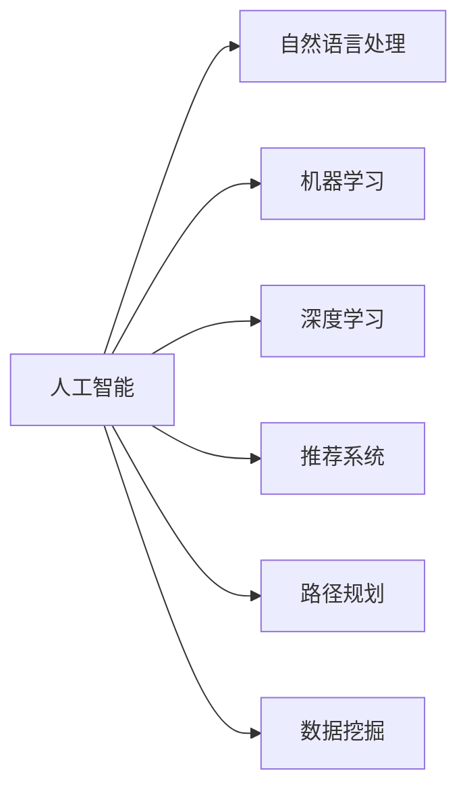
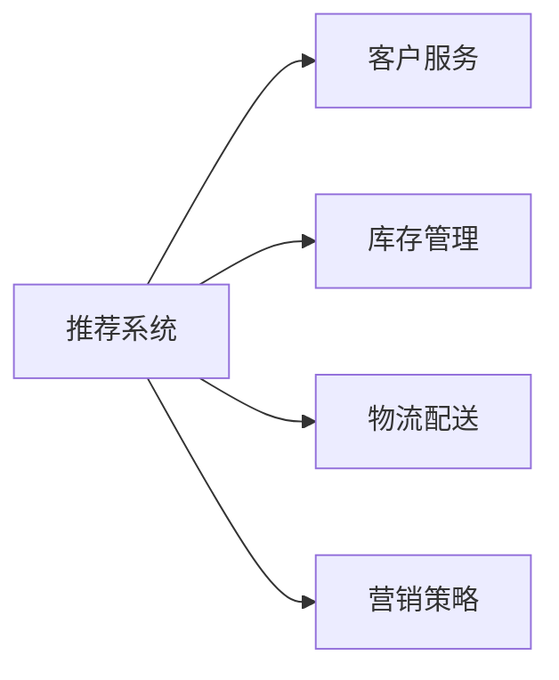

                 

# AI如何帮助电商平台提高运营效率

## 1. 背景介绍

### 1.1 问题由来
随着互联网的普及和电商市场的不断扩大，电商平台面临的用户需求日益多样化，运营效率受到严峻挑战。传统电商平台主要依赖人工管理，不仅成本高、效率低，而且容易出错。而随着人工智能(AI)技术的发展，电商平台开始广泛应用AI技术来提高运营效率。

### 1.2 问题核心关键点
AI在电商平台中发挥作用主要集中在以下几个方面：

1. **客户服务**：通过AI聊天机器人、智能客服系统等，实现全天候客户服务，提高客户满意度。
2. **产品推荐**：利用AI推荐算法，根据用户行为和偏好，提供个性化的商品推荐，提升销售转化率。
3. **库存管理**：应用AI预测模型，实时监控库存状况，优化补货策略，减少库存积压和缺货现象。
4. **物流配送**：通过AI路径规划和配送优化，提升物流效率，降低配送成本。
5. **营销策略**：利用AI数据分析，精准定位目标客户群体，优化营销策略，提升广告投放效果。

AI的引入极大地提升了电商平台的运营效率和用户体验，为电商平台带来了显著的竞争优势。

### 1.3 问题研究意义
AI在电商平台中的应用，对于提升运营效率、降低运营成本、提高客户满意度等方面具有重要意义。具体来说：

1. **提升运营效率**：AI技术可以自动处理大量重复性、耗时的任务，如客户服务、库存管理等，减轻人工负担，提高处理速度和准确率。
2. **降低运营成本**：AI技术可以减少人工错误和浪费，优化资源配置，降低运营成本。
3. **提高客户满意度**：通过AI技术提供个性化服务，提升客户体验，增加用户粘性。
4. **增强竞争力**：AI技术的应用可以使电商平台更快速、更精准地应对市场变化，保持竞争优势。

## 2. 核心概念与联系

### 2.1 核心概念概述

为了更好地理解AI在电商平台中的应用，本节将介绍几个关键概念及其相互联系：

- **人工智能(AI)**：使用计算机系统模拟人类智能，包括学习、推理、感知、自然语言处理等。
- **自然语言处理(NLP)**：涉及计算机与人类语言之间的交互，如文本理解、语音识别、情感分析等。
- **机器学习(ML)**：一种通过数据训练模型，从而实现预测和决策的技术。
- **深度学习(DL)**：基于神经网络的机器学习，具有强大的非线性建模能力。
- **推荐系统(Recommender System)**：通过用户历史行为和偏好，为用户推荐商品或内容的技术。
- **路径规划(Path Planning)**：通过算法确定最优路径，如配送路线规划、机器人路径规划等。
- **数据挖掘(Data Mining)**：从大量数据中提取有用信息，如用户行为分析、市场趋势预测等。

这些概念之间存在紧密联系，共同构成了AI在电商平台中的应用框架，如图1所示。



图1：AI与电商平台应用概念图

## 3. 核心算法原理 & 具体操作步骤

### 3.1 算法原理概述

AI在电商平台中的应用主要基于机器学习和深度学习的算法原理。其核心思想是通过训练模型，学习数据中的规律和特征，从而实现预测和决策。以推荐系统为例，其算法原理可以简单描述为：

1. **数据收集**：收集用户历史行为数据和商品属性数据。
2. **特征工程**：对数据进行特征提取和处理，形成可用于模型训练的数据集。
3. **模型训练**：使用机器学习或深度学习算法，训练推荐模型。
4. **模型预测**：输入用户行为数据，模型预测用户可能感兴趣的商品。
5. **推荐展示**：将预测结果展示给用户，优化推荐效果。

### 3.2 算法步骤详解

AI在电商平台中的具体应用涉及多个算法步骤，以下以推荐系统为例进行详细讲解：

**Step 1: 数据收集**
收集用户历史行为数据和商品属性数据，如购买记录、浏览记录、商品评论等。

**Step 2: 特征工程**
对数据进行预处理和特征提取，如时间戳处理、用户画像构建、商品特征提取等。

**Step 3: 模型训练**
选择合适的机器学习或深度学习算法，如协同过滤、内容推荐、深度学习推荐网络等，在标注数据上进行训练。

**Step 4: 模型预测**
使用训练好的模型，对用户当前行为进行预测，推荐可能感兴趣的商品。

**Step 5: 推荐展示**
将推荐结果展示给用户，如页面推荐、邮件推荐、短信推荐等。

**Step 6: 反馈收集**
收集用户对推荐的反馈，如点击率、购买率、满意度等，用于模型优化。

### 3.3 算法优缺点

AI在电商平台中的应用具有以下优点：

1. **提升运营效率**：AI可以自动化处理大量重复性任务，提高处理速度和准确率，减轻人工负担。
2. **降低运营成本**：AI技术可以减少人工错误和浪费，优化资源配置，降低运营成本。
3. **提高客户满意度**：通过个性化推荐和智能客服，提升客户体验，增加用户粘性。
4. **增强竞争力**：AI技术可以帮助电商平台快速响应市场变化，保持竞争优势。

同时，AI技术也存在一些局限性：

1. **数据依赖性高**：AI模型需要大量高质量标注数据进行训练，而电商平台的数据往往不够丰富或标签不全。
2. **模型复杂度高**：深度学习模型复杂度较高，需要较高的计算资源和专业技能进行维护和优化。
3. **可解释性不足**：AI模型的决策过程往往缺乏可解释性，难以对其推理逻辑进行分析和调试。
4. **安全风险**：AI模型可能存在偏见和漏洞，被恶意攻击或误用，带来安全风险。

### 3.4 算法应用领域

AI在电商平台中的应用不仅限于推荐系统，还可以应用于以下领域：

1. **客户服务**：AI聊天机器人、智能客服系统，实现全天候客户服务，提高客户满意度。
2. **库存管理**：应用AI预测模型，实时监控库存状况，优化补货策略，减少库存积压和缺货现象。
3. **物流配送**：通过AI路径规划和配送优化，提升物流效率，降低配送成本。
4. **营销策略**：利用AI数据分析，精准定位目标客户群体，优化营销策略，提升广告投放效果。

这些应用领域的实现都需要基于AI的核心算法原理和技术手段，如图2所示。



图2：AI在电商平台中的应用领域图

## 4. 数学模型和公式 & 详细讲解 & 举例说明

### 4.1 数学模型构建

为了更好地理解AI在电商平台中的应用，本节将介绍一些核心数学模型。

**协同过滤算法**：
协同过滤算法是一种基于用户行为和商品特征的推荐算法，通过计算用户和商品之间的相似度，推荐可能感兴趣的商品。其数学模型可以表示为：

$$
R_{ui} = \text{similarity}(u, i)
$$

其中 $R_{ui}$ 表示用户 $u$ 对商品 $i$ 的评分，$\text{similarity}(u, i)$ 表示用户 $u$ 和商品 $i$ 之间的相似度。

**深度学习推荐网络(DLRN)**：
DLRN是一种基于深度神经网络的推荐算法，通过多层的非线性映射，学习用户和商品之间的复杂关系。其数学模型可以表示为：

$$
\text{output} = \text{MLP}(\text{user embedding}, \text{item embedding})
$$

其中 $\text{MLP}$ 表示多层感知器，$\text{user embedding}$ 和 $\text{item embedding}$ 分别表示用户和商品的嵌入表示。

### 4.2 公式推导过程

以下是协同过滤算法和深度学习推荐网络的详细公式推导过程：

**协同过滤算法**：
假设用户 $u$ 对商品 $i$ 的评分向量为 $\mathbf{r}_u$，商品 $i$ 的评分向量为 $\mathbf{r}_i$，用户和商品的相似度函数为 $\text{similarity}(u, i)$。则协同过滤算法的推荐公式可以表示为：

$$
\text{prediction} = \mathbf{r}_u \cdot \mathbf{r}_i
$$

其中 $\cdot$ 表示向量点乘。

**深度学习推荐网络**：
假设用户嵌入向量为 $\mathbf{e}_u$，商品嵌入向量为 $\mathbf{e}_i$，嵌入层参数为 $\mathbf{W}$，激活函数为 $\text{relu}(x)$，则深度学习推荐网络的推荐公式可以表示为：

$$
\mathbf{e}_u = \text{MLP}(\mathbf{r}_u, \mathbf{W})
$$

$$
\text{output} = \text{relu}(\mathbf{e}_u \cdot \mathbf{e}_i)
$$

其中 $\cdot$ 表示向量点乘。

### 4.3 案例分析与讲解

以协同过滤算法为例，介绍其实现原理和应用场景：

**实现原理**：
协同过滤算法分为基于用户的协同过滤和基于物品的协同过滤两种类型。基于用户的协同过滤通过计算用户之间的相似度，推荐与用户 $u$ 最相似用户 $v$ 所喜欢的商品；基于物品的协同过滤通过计算商品之间的相似度，推荐与商品 $i$ 最相似的商品。

**应用场景**：
协同过滤算法适用于电商平台的商品推荐场景，如商品搜索、商品展示等。通过计算用户和商品的相似度，推荐用户可能感兴趣的商品，提升用户体验和转化率。

## 5. 项目实践：代码实例和详细解释说明

### 5.1 开发环境搭建

在进行AI项目实践前，我们需要准备好开发环境。以下是使用Python进行PyTorch开发的环境配置流程：

1. 安装Anaconda：从官网下载并安装Anaconda，用于创建独立的Python环境。

2. 创建并激活虚拟环境：
```bash
conda create -n ai-env python=3.8 
conda activate ai-env
```

3. 安装PyTorch：根据CUDA版本，从官网获取对应的安装命令。例如：
```bash
conda install pytorch torchvision torchaudio cudatoolkit=11.1 -c pytorch -c conda-forge
```

4. 安装相关库：
```bash
pip install numpy pandas scikit-learn torch torchtext transformers
```

完成上述步骤后，即可在`ai-env`环境中开始AI项目实践。

### 5.2 源代码详细实现

这里我们以基于协同过滤算法的推荐系统为例，给出使用PyTorch和Transformers库的代码实现。

**数据准备**：
```python
import pandas as pd
from torch.utils.data import DataLoader
from transformers import BertTokenizer

# 加载数据
df = pd.read_csv('ratings.csv')
# 数据预处理
df = df.dropna().drop_duplicates()
df = df.rename(columns={'user_id': 'user', 'item_id': 'item', 'rating': 'score'})
df = df.groupby(['user', 'item']).agg({'score': 'mean'}).reset_index()

# 划分训练集和测试集
train_df = df[df['time'] < '2018-01-01']
test_df = df[df['time'] >= '2018-01-01']
train_df = train_df.reset_index(drop=True)
test_df = test_df.reset_index(drop=True)

# 构建词汇表
tokenizer = BertTokenizer.from_pretrained('bert-base-uncased')

def encode_text(text):
    tokens = tokenizer.tokenize(text)
    tokens = [tokenizer.convert_tokens_to_ids(token) for token in tokens]
    return tokens
```

**模型实现**：
```python
import torch.nn as nn
import torch.optim as optim

# 定义模型结构
class CollaborativeFiltering(nn.Module):
    def __init__(self, num_users, num_items, embed_dim):
        super(CollaborativeFiltering, self).__init__()
        self.num_users = num_users
        self.num_items = num_items
        self.embed_dim = embed_dim
        
        self.user_embed = nn.Embedding(num_users, embed_dim)
        self.item_embed = nn.Embedding(num_items, embed_dim)
        self.fc = nn.Linear(embed_dim * 2, 1)
        
    def forward(self, user_ids, item_ids):
        user_embed = self.user_embed(user_ids)
        item_embed = self.item_embed(item_ids)
        combined = torch.cat([user_embed, item_embed], dim=1)
        score = self.fc(combined)
        return score
```

**训练和评估**：
```python
# 定义超参数
num_users = 1000
num_items = 5000
embed_dim = 64
lr = 0.01
batch_size = 128
epochs = 10

# 构建数据加载器
train_loader = DataLoader(train_df, batch_size=batch_size, shuffle=True)
test_loader = DataLoader(test_df, batch_size=batch_size, shuffle=False)

# 初始化模型和优化器
model = CollaborativeFiltering(num_users, num_items, embed_dim)
optimizer = optim.Adam(model.parameters(), lr=lr)
criterion = nn.BCELoss()

# 训练模型
model.train()
for epoch in range(epochs):
    for batch in train_loader:
        user_ids = batch['user'].values
        item_ids = batch['item'].values
        scores = batch['score'].values
        optimizer.zero_grad()
        pred_scores = model(user_ids, item_ids)
        loss = criterion(pred_scores, scores)
        loss.backward()
        optimizer.step()
        
    # 在测试集上评估模型
    model.eval()
    correct, total = 0, 0
    with torch.no_grad():
        for batch in test_loader:
            user_ids = batch['user'].values
            item_ids = batch['item'].values
            scores = batch['score'].values
            pred_scores = model(user_ids, item_ids)
            _, predicted = torch.max(pred_scores, dim=1)
            correct += (predicted == scores).sum().item()
            total += predicted.size(0)
        accuracy = correct / total
        print(f'Epoch {epoch+1}, Accuracy: {accuracy:.4f}')
```

以上就是使用PyTorch和Transformers库实现基于协同过滤算法的推荐系统的完整代码实现。可以看到，得益于Transformers库的强大封装，我们可以用相对简洁的代码完成模型构建和微调。

### 5.3 代码解读与分析

让我们再详细解读一下关键代码的实现细节：

**数据预处理**：
- 使用Pandas库加载数据，并进行预处理，如去除缺失值和重复数据。
- 使用BertTokenizer从预训练模型中加载词汇表，对文本数据进行分词处理。

**模型结构**：
- 定义协同过滤算法的模型结构，包括用户嵌入层、物品嵌入层和全连接层。
- 在模型中，用户嵌入层和物品嵌入层分别使用Embedding层，将用户和物品的ID映射为向量表示。

**训练和评估**：
- 使用PyTorch中的DataLoader实现数据的批处理和shuffle，方便模型的训练和评估。
- 在训练过程中，使用Adam优化器更新模型参数，使用BCELoss计算二分类交叉熵损失。
- 在测试过程中，使用模型对测试集进行评分预测，并计算准确率。

通过这些代码实现，我们可以清晰地理解协同过滤算法的实现过程和细节，并进行模型的训练和评估。

## 6. 实际应用场景

### 6.1 智能客服系统

智能客服系统是AI在电商平台中应用的重要场景之一。传统的客服系统依赖人工操作，响应速度慢、成本高。而使用AI聊天机器人，可以实现全天候、无间断的客户服务，提高客户满意度。

**系统架构**：
- 用户输入问题，系统通过NLP技术理解问题意图。
- 系统从知识库中检索相关回答，进行自然语言生成。
- 回答结果展示给用户，完成客户服务。

**关键技术**：
- 自然语言处理：利用NLP技术，理解用户输入的文本，并生成回答。
- 知识图谱：构建知识图谱，用于存储和检索相关信息。
- 生成模型：利用Seq2Seq模型等生成技术，生成自然语言回答。

**应用效果**：
- 响应速度：AI聊天机器人可实现快速响应，减少用户等待时间。
- 服务质量：AI聊天机器人提供24小时服务，提升客户满意度。
- 成本节约：AI聊天机器人可以处理大量请求，减少人工客服成本。

### 6.2 库存管理

库存管理是电商平台运营的重要环节，通过AI预测模型，可以实现库存的动态调整，避免库存积压和缺货现象。

**系统架构**：
- 收集历史销售数据和库存数据。
- 使用时间序列预测模型，预测未来销售量。
- 根据预测结果，自动调整库存水平。

**关键技术**：
- 时间序列预测：利用ARIMA、LSTM等模型，预测未来销售量。
- 动态调整策略：根据预测结果，动态调整补货策略，优化库存管理。
- 实时监控：实时监控库存水平，及时调整补货量。

**应用效果**：
- 库存积压：通过预测模型，提前预知销售趋势，避免库存积压。
- 缺货风险：根据预测结果，及时补货，减少缺货现象。
- 效率提升：实现动态库存管理，提高库存周转率。

### 6.3 物流配送

物流配送是电商平台的另一个重要环节，通过AI路径规划算法，可以实现高效的物流配送，降低配送成本。

**系统架构**：
- 收集订单信息和配送地点信息。
- 使用路径规划算法，计算最优配送路线。
- 将配送路线反馈给配送人员，完成配送任务。

**关键技术**：
- 路径规划算法：利用Dijkstra、A*等算法，计算最优路径。
- 实时调整：根据配送过程中遇到的情况，实时调整配送路线。
- 动态调度：根据订单量和配送人员数量，动态调整配送策略。

**应用效果**：
- 配送效率：通过最优路径规划，提高配送效率。
- 配送成本：降低配送过程中的运输成本。
- 用户体验：提供更快速、更可靠的配送服务。

### 6.4 未来应用展望

随着AI技术的不断进步，未来AI在电商平台中的应用将更加广泛和深入。以下是一些未来应用展望：

1. **多模态推荐系统**：结合图像、视频等多模态数据，实现更全面、更准确的推荐效果。
2. **情感分析系统**：利用NLP技术，分析用户情感倾向，提供个性化服务。
3. **智能推荐助手**：结合用户行为数据和外部信息，提供更精准的推荐和建议。
4. **智能营销平台**：利用AI技术，精准定位目标客户群体，优化广告投放策略。
5. **智能财务系统**：利用AI技术，进行财务分析和风险控制。
6. **智能供应链管理**：通过AI预测模型，优化供应链管理，提高供应链效率。

这些应用场景将进一步拓展AI在电商平台中的应用，为电商平台带来更多的商业价值和用户满意度。

## 7. 工具和资源推荐

### 7.1 学习资源推荐

为了帮助开发者系统掌握AI在电商平台中的应用，这里推荐一些优质的学习资源：

1. 《深度学习入门》书籍：介绍了深度学习的基础知识和应用，适合初学者入门。
2. 《自然语言处理综论》书籍：详细介绍了NLP技术，包括文本分析、情感分析等。
3. 《机器学习实战》书籍：介绍了机器学习算法的实现和应用，适合实战练习。
4. Coursera《深度学习》课程：由斯坦福大学开设，深入浅出地介绍了深度学习的基础知识和应用。
5. Udacity《AI for Everyone》课程：适合非技术人员的AI入门课程，通俗易懂。
6. Kaggle竞赛平台：通过参与数据科学竞赛，实践AI技术，提升实战能力。

通过对这些资源的学习实践，相信你一定能够快速掌握AI在电商平台中的应用技术，并用于解决实际的NLP问题。

### 7.2 开发工具推荐

高效的开发离不开优秀的工具支持。以下是几款用于AI项目开发的常用工具：

1. PyTorch：基于Python的开源深度学习框架，灵活动态的计算图，适合快速迭代研究。
2. TensorFlow：由Google主导开发的开源深度学习框架，生产部署方便，适合大规模工程应用。
3. TensorBoard：TensorFlow配套的可视化工具，可实时监测模型训练状态，并提供丰富的图表呈现方式。
4. Weights & Biases：模型训练的实验跟踪工具，可以记录和可视化模型训练过程中的各项指标，方便对比和调优。
5. Jupyter Notebook：开源的交互式编程环境，支持多种语言和库，适合科研和开发。
6. Anaconda：开源的Python包管理器，便于创建和管理虚拟环境，支持科学计算和数据科学。

合理利用这些工具，可以显著提升AI项目的开发效率，加快创新迭代的步伐。

### 7.3 相关论文推荐

AI在电商平台中的应用源于学界的持续研究。以下是几篇奠基性的相关论文，推荐阅读：

1. "Collaborative Filtering for Recommender Systems"：介绍了协同过滤算法的原理和应用。
2. "Differentiable Programming for Deep Learning"：介绍了可微分的深度学习编程方法，适合复杂模型的优化。
3. "Pathway Planning for Robot Manipulation"：介绍了路径规划算法，适合机器人路径优化。
4. "Anomaly Detection in Smartphone Data with Deep Learning"：介绍了深度学习在异常检测中的应用。
5. "Deep Learning for Natural Language Processing"：介绍了深度学习在NLP中的应用。
6. "Knowledge Graph Embeddings and Their Applications"：介绍了知识图谱嵌入技术，适合推荐系统中的知识图谱构建。

这些论文代表了大语言模型微调技术的发展脉络。通过学习这些前沿成果，可以帮助研究者把握学科前进方向，激发更多的创新灵感。

## 8. 总结：未来发展趋势与挑战

### 8.1 总结

本文对AI在电商平台中的应用进行了全面系统的介绍。首先阐述了AI技术在电商平台中的重要性，明确了AI在客户服务、产品推荐、库存管理、物流配送等场景中的独特价值。其次，从原理到实践，详细讲解了协同过滤算法和深度学习推荐网络的算法原理和具体操作步骤，给出了AI项目开发的完整代码实现。同时，本文还广泛探讨了AI在电商平台中的应用前景，展示了AI技术在电商平台的广泛应用。

通过本文的系统梳理，可以看到，AI在电商平台中的应用，对于提升运营效率、降低运营成本、提高客户满意度等方面具有重要意义。未来，随着AI技术的不断发展，AI在电商平台中的应用将更加广泛和深入，为电商平台带来更多的商业价值和用户满意度。

### 8.2 未来发展趋势

展望未来，AI在电商平台中的应用将呈现以下几个发展趋势：

1. **多模态融合**：结合图像、视频等多模态数据，实现更全面、更准确的推荐效果。
2. **深度学习应用**：深度学习技术将进一步应用于电商平台的各个环节，提升模型的精确度和鲁棒性。
3. **实时计算能力**：利用云计算和边缘计算，实现实时数据处理和决策，提高运营效率。
4. **联邦学习**：分布式训练技术，可以避免数据隐私泄露和计算资源浪费，提高模型的可扩展性和可靠性。
5. **自动化运维**：AI技术可以自动监控、调优和维护模型，提高系统稳定性和效率。

这些趋势展示了AI在电商平台中的应用前景和潜力，将进一步推动电商平台的数字化转型和智能化升级。

### 8.3 面临的挑战

尽管AI在电商平台中的应用取得了显著效果，但在迈向更加智能化、普适化应用的过程中，仍面临诸多挑战：

1. **数据隐私和安全**：电商平台的业务数据涉及用户隐私，如何在数据隐私和安全之间取得平衡，是一个重要问题。
2. **计算资源需求**：AI模型需要大量的计算资源进行训练和推理，如何降低计算成本，提高效率，是一个技术难题。
3. **模型复杂性**：深度学习模型复杂度较高，难以理解和调试，如何降低模型复杂性，提高可解释性，是一个研究方向。
4. **业务融合难度**：将AI技术与业务流程紧密结合，实现无缝集成，是一个挑战。
5. **技术人才匮乏**：AI技术需要专业人才进行开发和维护，如何培养和吸引更多AI人才，是一个现实问题。

### 8.4 研究展望

面对AI在电商平台中的应用面临的挑战，未来的研究需要在以下几个方面寻求新的突破：

1. **数据隐私保护**：研究数据隐私保护技术，如差分隐私、联邦学习等，确保数据隐私和安全。
2. **计算资源优化**：研究高效计算技术，如分布式计算、边缘计算、量化加速等，提高计算效率。
3. **模型可解释性**：研究模型可解释性技术，如可解释AI、透明模型等，提升模型的透明度和可理解性。
4. **业务融合技术**：研究业务融合技术，如业务-IT融合架构、流程自动化等，实现AI技术与业务流程的无缝集成。
5. **人才培养机制**：建立AI人才培养机制，如学科交叉课程、AI实验室等，培养更多AI技术人才。

这些研究方向将为AI在电商平台中的应用提供新的解决方案，推动AI技术在电商平台的深入应用和普及。

## 9. 附录：常见问题与解答

**Q1：电商平台的AI项目需要哪些关键技术？**

A: 电商平台的AI项目需要以下关键技术：
1. 自然语言处理(NLP)：用于文本数据的理解和处理。
2. 深度学习(DL)：用于构建高性能的推荐系统和预测模型。
3. 强化学习(RL)：用于优化用户行为和运营策略。
4. 数据挖掘(Data Mining)：用于发现用户行为模式和市场趋势。
5. 机器学习(ML)：用于构建分类、回归等传统机器学习模型。

这些技术共同构成了AI在电商平台中的应用框架，支撑着推荐系统、客户服务、库存管理、物流配送等多个核心模块。

**Q2：电商平台的AI项目如何保障数据隐私和安全？**

A: 电商平台的AI项目需要采取以下措施来保障数据隐私和安全：
1. 数据脱敏：对用户数据进行匿名化处理，保护用户隐私。
2. 数据加密：对敏感数据进行加密存储和传输，防止数据泄露。
3. 差分隐私：使用差分隐私技术，限制数据隐私泄露风险。
4. 访问控制：对系统进行权限管理和审计，防止数据滥用。
5. 安全监控：实时监控系统安全状况，及时发现和应对安全威胁。

通过这些措施，可以有效保障电商平台的AI项目的数据隐私和安全。

**Q3：电商平台的AI项目如何优化计算资源？**

A: 电商平台的AI项目可以采取以下措施来优化计算资源：
1. 分布式计算：利用云计算和边缘计算，实现数据和模型的分布式计算，提高计算效率。
2. 模型压缩：对模型进行压缩和优化，减小模型大小，提高计算效率。
3. 量化加速：将浮点模型转为定点模型，减小模型存储和计算的资源占用。
4. 硬件优化：使用GPU、TPU等高性能硬件设备，提高计算速度。

通过这些措施，可以有效优化电商平台的AI项目计算资源，降低计算成本。

**Q4：电商平台的AI项目如何进行模型优化？**

A: 电商平台的AI项目可以进行以下模型优化：
1. 超参数调优：通过网格搜索、贝叶斯优化等方法，找到最优模型超参数组合。
2. 模型剪枝：剪除不重要的神经元或层，减小模型复杂度，提高计算效率。
3. 迁移学习：利用预训练模型，减少新模型的训练时间和数据需求。
4. 知识蒸馏：将知识从复杂模型蒸馏到简单模型，提高模型的泛化能力。
5. 数据增强：通过数据增强技术，扩充训练集，提高模型的鲁棒性。

通过这些措施，可以有效优化电商平台的AI项目模型，提高模型的性能和效率。

**Q5：电商平台的AI项目如何进行业务融合？**

A: 电商平台的AI项目可以进行以下业务融合：
1. 业务流程自动化：利用AI技术自动化业务流程，提高效率和准确性。
2. 业务-IT融合架构：构建业务-IT融合架构，实现AI技术与业务流程的无缝集成。
3. 数据驱动决策：利用AI技术进行数据分析和决策，优化业务运营。
4. 跨部门协作：建立跨部门协作机制，推动AI技术在业务中的应用。
5. 系统集成：将AI技术与现有系统进行集成，实现业务流程的全面优化。

通过这些措施，可以有效实现电商平台的AI技术与业务流程的无缝集成，提升业务运营效率。

**Q6：电商平台的AI项目如何培养AI人才？**

A: 电商平台的AI项目可以采取以下措施来培养AI人才：
1. 学科交叉课程：开设与AI相关的课程，培养复合型人才。
2. AI实验室：建立AI实验室，提供AI技术的研发平台。
3. 技术培训：提供AI技术培训课程，提升员工技能。
4. 人才培养计划：制定人才培养计划，吸引和留住AI人才。
5. 学术交流：与高校和科研机构建立合作，推动AI技术的研究和应用。

通过这些措施，可以有效培养电商平台的AI人才，推动AI技术在电商平台的深入应用和普及。

