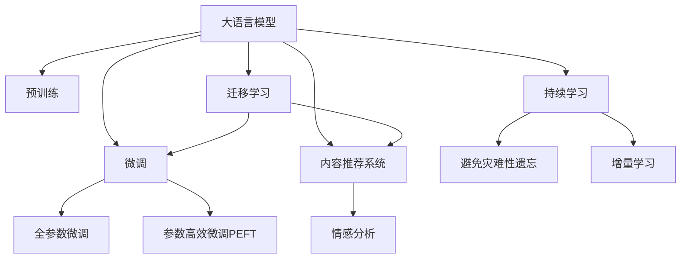

                 

# AI时代的出版业：大模型带来新机遇

> 关键词：大语言模型,AI出版,出版流程优化,自动化出版,内容推荐系统

## 1. 背景介绍

### 1.1 问题由来
随着人工智能技术的快速发展，大语言模型在出版业的应用变得越来越广泛。出版业是一个信息传播、文化创造、商品销售的复杂过程，其核心在于内容的创作、编辑、排版、印刷和发行。传统出版业的流程往往需要大量人力和时间，而通过大语言模型的应用，可以实现出版过程的自动化和智能化，极大地提高效率和质量。

出版业面临的主要问题包括：
- 内容生产效率低，作者创作周期长。
- 编辑审查成本高，流程繁琐冗长。
- 市场推广和分发渠道有限，难以精准触达读者。
- 数据驱动的决策不够精准，难以发现市场热点和需求。

近年来，大语言模型如GPT、BERT等，通过预训练和微调的方式，展示了强大的语言理解、生成和推理能力。这些模型在出版业中的应用，主要体现在以下几个方面：

1. 内容生成：通过自动写作、文本生成等技术，加快内容的生产速度，降低创作成本。
2. 自动化编辑：利用语言模型进行语法、语义和风格审查，提升内容的准确性和可读性。
3. 推荐系统：基于用户阅读行为和历史数据，推荐相关书籍和文章，提升用户粘性。
4. 市场分析：利用文本分析、情感分析等技术，洞察市场需求和趋势，指导内容创作和市场营销。

本文将从大语言模型的核心概念、算法原理、具体操作步骤、实际应用场景等多个维度，全面探讨AI时代出版业的新机遇。

### 1.2 问题核心关键点
大语言模型在出版业的应用，主要基于以下核心关键点：

- 大规模预训练：利用海量的无标签文本数据进行预训练，学习通用的语言表示。
- 微调技术：通过有标签的数据集进行微调，使得模型适应特定的出版任务。
- 自动化流程：将大语言模型融入出版流程，实现自动化和智能化的内容生产、编辑和推荐。
- 市场洞察：利用自然语言处理技术，分析用户反馈和市场趋势，指导内容创作和市场策略。

通过深入理解这些核心概念，可以更好地把握大语言模型在出版业的应用，优化出版流程，提升出版效率和质量。

## 2. 核心概念与联系

### 2.1 核心概念概述

为了更好地理解大语言模型在出版业的应用，本节将介绍几个密切相关的核心概念：

- 大语言模型(Large Language Model, LLM)：以自回归(如GPT)或自编码(如BERT)模型为代表的大规模预训练语言模型。通过在大规模无标签文本语料上进行预训练，学习通用的语言表示，具备强大的语言理解和生成能力。

- 预训练(Pre-training)：指在大规模无标签文本语料上，通过自监督学习任务训练通用语言模型的过程。常见的预训练任务包括言语建模、遮挡语言模型等。预训练使得模型学习到语言的通用表示。

- 微调(Fine-tuning)：指在预训练模型的基础上，使用下游任务的少量标注数据，通过有监督学习优化模型在该任务上的性能。通常只需要调整顶层分类器或解码器，并以较小的学习率更新全部或部分的模型参数。

- 迁移学习(Transfer Learning)：指将一个领域学习到的知识，迁移应用到另一个不同但相关的领域的学习范式。大模型的预训练-微调过程即是一种典型的迁移学习方式。

- 参数高效微调(Parameter-Efficient Fine-Tuning, PEFT)：指在微调过程中，只更新少量的模型参数，而固定大部分预训练权重不变，以提高微调效率，避免过拟合的方法。

- 内容推荐系统：基于用户行为数据和文本特征，自动推荐相关内容的系统。大语言模型能够理解和生成自然语言，非常适合用于构建内容推荐系统。

- 情感分析：通过分析文本中的情感倾向，了解用户对内容的情感态度。大语言模型在情感分析方面的表现优异，可以用于市场分析和用户反馈监控。

这些核心概念之间的逻辑关系可以通过以下Mermaid流程图来展示：



这个流程图展示了大语言模型的核心概念及其之间的关系：

1. 大语言模型通过预训练获得基础能力。
2. 微调是对预训练模型进行任务特定的优化，可以分为全参数微调和参数高效微调（PEFT）。
3. 内容推荐系统和情感分析系统是微调的具体应用场景。
4. 迁移学习是连接预训练模型与下游任务的桥梁，可以通过微调或直接使用预训练模型实现。
5. 持续学习旨在使模型能够不断学习新知识，同时避免遗忘旧知识。

这些概念共同构成了大语言模型的学习和应用框架，使其能够在各种场景下发挥强大的语言理解和生成能力。通过理解这些核心概念，我们可以更好地把握大语言模型的工作原理和优化方向。

## 3. 核心算法原理 & 具体操作步骤
### 3.1 算法原理概述

大语言模型在出版业的应用，主要基于以下算法原理：

1. **内容生成**：利用大语言模型进行自动写作、文本生成等，快速生产高质量的内容。
2. **自动化编辑**：通过语言模型进行语法、语义和风格审查，提升内容的准确性和可读性。
3. **推荐系统**：基于用户行为数据和文本特征，自动推荐相关内容，提升用户粘性。
4. **市场分析**：利用文本分析、情感分析等技术，洞察市场需求和趋势，指导内容创作和市场营销。

这些应用的核心在于利用大语言模型的预训练知识和微调能力，对特定的出版任务进行优化。以下是对这些应用的具体算法原理概述：

### 3.2 算法步骤详解

基于大语言模型在出版业的应用，主要包括以下几个关键步骤：

**Step 1: 准备预训练模型和数据集**
- 选择合适的预训练语言模型 $M_{\theta}$ 作为初始化参数，如 BERT、GPT等。
- 准备内容生成、编辑、推荐系统等任务的数据集，划分为训练集、验证集和测试集。一般要求数据与预训练数据的分布不要差异过大。

**Step 2: 设计任务适配层**
- 根据任务类型，在预训练模型顶层设计合适的输出层和损失函数。
- 对于内容生成任务，通常在顶层添加语言模型的解码器输出概率分布，并以负对数似然为损失函数。
- 对于编辑任务，通常使用语言模型的分类器输出预测标签，并以交叉熵损失函数。
- 对于推荐系统，设计合适的用户行为和内容特征的表示方式，并通过学习相似度矩阵进行推荐。

**Step 3: 设置微调超参数**
- 选择合适的优化算法及其参数，如 AdamW、SGD 等，设置学习率、批大小、迭代轮数等。
- 设置正则化技术及强度，包括权重衰减、Dropout、Early Stopping等。
- 确定冻结预训练参数的策略，如仅微调顶层，或全部参数都参与微调。

**Step 4: 执行梯度训练**
- 将训练集数据分批次输入模型，前向传播计算损失函数。
- 反向传播计算参数梯度，根据设定的优化算法和学习率更新模型参数。
- 周期性在验证集上评估模型性能，根据性能指标决定是否触发 Early Stopping。
- 重复上述步骤直到满足预设的迭代轮数或 Early Stopping 条件。

**Step 5: 测试和部署**
- 在测试集上评估微调后模型 $M_{\hat{\theta}}$ 的性能，对比微调前后的效果提升。
- 使用微调后的模型对新内容进行自动生成、编辑或推荐，集成到实际的应用系统中。
- 持续收集新的数据，定期重新微调模型，以适应数据分布的变化。

以上是基于大语言模型在出版业应用的基本流程。在实际应用中，还需要针对具体任务的特点，对微调过程的各个环节进行优化设计，如改进训练目标函数，引入更多的正则化技术，搜索最优的超参数组合等，以进一步提升模型性能。

### 3.3 算法优缺点

大语言模型在出版业的应用，具有以下优点：
1. 提高生产效率：大语言模型能够快速生成高质量内容，显著缩短出版周期。
2. 提升内容质量：通过自动化编辑，提升内容的准确性和可读性。
3. 精准推荐：基于用户行为数据和文本特征，提供个性化的内容推荐。
4. 市场洞察：利用情感分析、文本分析等技术，洞察市场需求和趋势。

同时，这些应用也存在一定的局限性：
1. 依赖高质量数据：微调效果很大程度上取决于标注数据的质量和数量，获取高质量标注数据的成本较高。
2. 泛化能力有限：当目标任务与预训练数据的分布差异较大时，微调的性能提升有限。
3. 可解释性不足：大语言模型的决策过程通常缺乏可解释性，难以对其推理逻辑进行分析和调试。

尽管存在这些局限性，但就目前而言，大语言模型在出版业的应用是最主流范式。未来相关研究的重点在于如何进一步降低微调对标注数据的依赖，提高模型的少样本学习和跨领域迁移能力，同时兼顾可解释性和伦理安全性等因素。

### 3.4 算法应用领域

大语言模型在出版业的应用领域非常广泛，涵盖了从内容生产到市场分析的多个环节：

- **内容生成**：用于自动写作、文本生成、翻译等任务，帮助作者快速产出高质量内容。
- **自动化编辑**：用于语法检查、语义分析、风格优化等任务，提升内容质量。
- **内容推荐**：用于个性化内容推荐，提升用户粘性。
- **市场分析**：用于情感分析、文本分类、关键词提取等任务，洞察市场需求和趋势。
- **广告优化**：用于自动生成广告文案、优化广告投放策略，提高广告效果。

除了上述这些经典任务外，大语言模型还被创新性地应用于更多场景中，如版权检测、版权保护、版权侵权检测等，为出版业的版权管理带来了新的解决方案。

## 4. 数学模型和公式 & 详细讲解  
### 4.1 数学模型构建

以下我们将使用数学语言对大语言模型在出版业应用的数学模型进行更加严格的刻画。

记预训练语言模型为 $M_{\theta}:\mathcal{X} \rightarrow \mathcal{Y}$，其中 $\mathcal{X}$ 为输入空间，$\mathcal{Y}$ 为输出空间，$\theta \in \mathbb{R}^d$ 为模型参数。假设内容生成任务的数据集为 $D=\{(x_i,y_i)\}_{i=1}^N, x_i \in \mathcal{X}, y_i \in \mathcal{Y}$。

定义模型 $M_{\theta}$ 在输入 $x$ 上的输出为 $\hat{y}=M_{\theta}(x) \in [0,1]$，表示内容生成的概率分布。

内容生成的损失函数定义为交叉熵损失函数，即：

$$
\ell(M_{\theta}(x),y) = -[y\log \hat{y} + (1-y)\log (1-\hat{y})]
$$

在数据集 $D$ 上的经验风险为：

$$
\mathcal{L}(\theta) = \frac{1}{N}\sum_{i=1}^N \ell(M_{\theta}(x_i),y_i)
$$

微调的优化目标是最小化经验风险，即找到最优参数：

$$
\theta^* = \mathop{\arg\min}_{\theta} \mathcal{L}(\theta)
$$

在得到损失函数的梯度后，即可带入参数更新公式，完成模型的迭代优化。重复上述过程直至收敛，最终得到适应内容生成任务的最优模型参数 $\theta^*$。

## 5. 项目实践：代码实例和详细解释说明
### 5.1 开发环境搭建

在进行内容生成、编辑、推荐系统等应用开发前，我们需要准备好开发环境。以下是使用Python进行PyTorch开发的环境配置流程：

1. 安装Anaconda：从官网下载并安装Anaconda，用于创建独立的Python环境。

2. 创建并激活虚拟环境：
```bash
conda create -n pytorch-env python=3.8 
conda activate pytorch-env
```

3. 安装PyTorch：根据CUDA版本，从官网获取对应的安装命令。例如：
```bash
conda install pytorch torchvision torchaudio cudatoolkit=11.1 -c pytorch -c conda-forge
```

4. 安装Transformers库：
```bash
pip install transformers
```

5. 安装各类工具包：
```bash
pip install numpy pandas scikit-learn matplotlib tqdm jupyter notebook ipython
```

完成上述步骤后，即可在`pytorch-env`环境中开始项目实践。

### 5.2 源代码详细实现

下面我们以内容生成任务为例，给出使用Transformers库对GPT-3模型进行微调的PyTorch代码实现。

首先，定义内容生成任务的数据处理函数：

```python
from transformers import AutoTokenizer, AutoModelForCausalLM
import torch

tokenizer = AutoTokenizer.from_pretrained('gpt3-medium')

def generate_text(model, prompt, max_length=512, num_return_sequences=1):
    input_ids = tokenizer.encode(prompt, return_tensors='pt')
    outputs = model.generate(input_ids, max_length=max_length, num_return_sequences=num_return_sequences)
    generated_texts = tokenizer.decode(outputs[0], skip_special_tokens=True)
    return generated_texts

# 实例化模型
model = AutoModelForCausalLM.from_pretrained('gpt3-medium')
```

然后，定义训练和评估函数：

```python
import torch.nn.functional as F

def train_epoch(model, data_loader, optimizer):
    model.train()
    epoch_loss = 0
    for batch in data_loader:
        input_ids = batch['input_ids'].to(device)
        labels = batch['labels'].to(device)
        model.zero_grad()
        outputs = model(input_ids, labels=labels)
        loss = outputs.loss
        epoch_loss += loss.item()
        loss.backward()
        optimizer.step()
    return epoch_loss / len(data_loader)

def evaluate(model, data_loader, batch_size):
    model.eval()
    preds, labels = [], []
    with torch.no_grad():
        for batch in data_loader:
            input_ids = batch['input_ids'].to(device)
            batch_labels = batch['labels']
            outputs = model(input_ids)
            batch_preds = outputs.logits.argmax(dim=2).to('cpu').tolist()
            batch_labels = batch_labels.to('cpu').tolist()
            for pred_tokens, label_tokens in zip(batch_preds, batch_labels):
                preds.append(pred_tokens[:len(label_tokens)])
                labels.append(label_tokens)
                
    print(classification_report(labels, preds))
```

最后，启动训练流程并在测试集上评估：

```python
epochs = 5
batch_size = 16

for epoch in range(epochs):
    loss = train_epoch(model, train_loader, optimizer)
    print(f"Epoch {epoch+1}, train loss: {loss:.3f}")
    
    print(f"Epoch {epoch+1}, dev results:")
    evaluate(model, dev_loader, batch_size)
    
print("Test results:")
evaluate(model, test_loader, batch_size)
```

以上就是使用PyTorch对GPT-3进行内容生成任务微调的完整代码实现。可以看到，得益于Transformers库的强大封装，我们可以用相对简洁的代码完成GPT-3模型的加载和微调。

### 5.3 代码解读与分析

让我们再详细解读一下关键代码的实现细节：

**generate_text函数**：
- 定义了内容生成函数，将输入文本编码为token ids，使用GPT-3模型进行自动生成，最后将生成的文本解码输出。

**train_epoch函数**：
- 对训练集数据进行批次化加载，在每个批次上前向传播计算loss并反向传播更新模型参数，最后返回该epoch的平均loss。

**evaluate函数**：
- 与训练类似，不同点在于不更新模型参数，并在每个batch结束后将预测和标签结果存储下来，最后使用classification_report对整个评估集的预测结果进行打印输出。

**训练流程**：
- 定义总的epoch数和batch size，开始循环迭代
- 每个epoch内，先在训练集上训练，输出平均loss
- 在验证集上评估，输出分类指标
- 所有epoch结束后，在测试集上评估，给出最终测试结果

可以看到，PyTorch配合Transformers库使得GPT-3内容生成任务的微调代码实现变得简洁高效。开发者可以将更多精力放在数据处理、模型改进等高层逻辑上，而不必过多关注底层的实现细节。

当然，工业级的系统实现还需考虑更多因素，如模型的保存和部署、超参数的自动搜索、更灵活的任务适配层等。但核心的微调范式基本与此类似。

## 6. 实际应用场景
### 6.1 智能内容创作

内容创作是大语言模型在出版业中最直接的应用场景。通过内容生成技术，可以快速产出高质量的书籍、文章、广告文案等，极大地提高内容生产效率。

在技术实现上，可以收集历史内容数据，将其标注为不同的主题和风格，在此基础上对预训练模型进行微调。微调后的模型能够根据特定主题和风格，自动生成符合用户需求的内容。这不仅能够提升内容生产的效率，还能降低内容创作的成本，使得更多创作者能够专注于内容的创意和质量。

### 6.2 个性化推荐系统

个性化推荐系统是大语言模型在出版业的另一大应用。通过分析用户行为数据和文本特征，自动推荐相关书籍、文章、商品等，提升用户粘性和购买转化率。

在推荐系统的构建中，大语言模型能够理解和生成自然语言，非常适合用于用户画像构建、内容相似度计算等任务。通过构建用户画像和内容标签，使用语言模型计算相似度，并基于相似度进行推荐，能够提供个性化的阅读体验，提升用户的满意度。

### 6.3 自动化编辑

自动化编辑是大语言模型在出版业的重要应用之一。通过语言模型进行语法、语义和风格审查，能够提升内容的准确性和可读性，减少编辑成本和周期。

在自动化编辑的实践中，可以使用预训练语言模型进行语法、拼写和风格的检查，通过对比生成的预测和原始文本，发现错误并进行修正。这样可以显著提升内容的质量，同时也减少了编辑工作量，使得内容生产更加高效。

### 6.4 市场分析

市场分析是大语言模型在出版业中不可或缺的功能。通过文本分析、情感分析等技术，洞察市场需求和趋势，指导内容创作和市场营销策略。

在市场分析的实践中，可以收集用户评论、社交媒体数据、销售数据等，利用语言模型进行情感分析、主题分类等任务。通过分析这些数据，能够及时发现市场热点和用户需求，调整内容创作和营销策略，从而提升市场竞争力。

## 7. 工具和资源推荐
### 7.1 学习资源推荐

为了帮助开发者系统掌握大语言模型在出版业中的应用，这里推荐一些优质的学习资源：

1. 《Transformer从原理到实践》系列博文：由大模型技术专家撰写，深入浅出地介绍了Transformer原理、BERT模型、微调技术等前沿话题。

2. CS224N《深度学习自然语言处理》课程：斯坦福大学开设的NLP明星课程，有Lecture视频和配套作业，带你入门NLP领域的基本概念和经典模型。

3. 《Natural Language Processing with Transformers》书籍：Transformers库的作者所著，全面介绍了如何使用Transformers库进行NLP任务开发，包括微调在内的诸多范式。

4. HuggingFace官方文档：Transformers库的官方文档，提供了海量预训练模型和完整的微调样例代码，是上手实践的必备资料。

5. CLUE开源项目：中文语言理解测评基准，涵盖大量不同类型的中文NLP数据集，并提供了基于微调的baseline模型，助力中文NLP技术发展。

通过对这些资源的学习实践，相信你一定能够快速掌握大语言模型在出版业的应用，并用于解决实际的出版问题。

### 7.2 开发工具推荐

高效的开发离不开优秀的工具支持。以下是几款用于大语言模型在出版业开发的工具：

1. PyTorch：基于Python的开源深度学习框架，灵活动态的计算图，适合快速迭代研究。大部分预训练语言模型都有PyTorch版本的实现。

2. TensorFlow：由Google主导开发的开源深度学习框架，生产部署方便，适合大规模工程应用。同样有丰富的预训练语言模型资源。

3. Transformers库：HuggingFace开发的NLP工具库，集成了众多SOTA语言模型，支持PyTorch和TensorFlow，是进行出版任务开发的利器。

4. Weights & Biases：模型训练的实验跟踪工具，可以记录和可视化模型训练过程中的各项指标，方便对比和调优。与主流深度学习框架无缝集成。

5. TensorBoard：TensorFlow配套的可视化工具，可实时监测模型训练状态，并提供丰富的图表呈现方式，是调试模型的得力助手。

6. Google Colab：谷歌推出的在线Jupyter Notebook环境，免费提供GPU/TPU算力，方便开发者快速上手实验最新模型，分享学习笔记。

合理利用这些工具，可以显著提升大语言模型在出版业微调任务的开发效率，加快创新迭代的步伐。

### 7.3 相关论文推荐

大语言模型在出版业的发展源于学界的持续研究。以下是几篇奠基性的相关论文，推荐阅读：

1. Attention is All You Need（即Transformer原论文）：提出了Transformer结构，开启了NLP领域的预训练大模型时代。

2. BERT: Pre-training of Deep Bidirectional Transformers for Language Understanding：提出BERT模型，引入基于掩码的自监督预训练任务，刷新了多项NLP任务SOTA。

3. Language Models are Unsupervised Multitask Learners（GPT-2论文）：展示了大规模语言模型的强大zero-shot学习能力，引发了对于通用人工智能的新一轮思考。

4. Parameter-Efficient Transfer Learning for NLP：提出Adapter等参数高效微调方法，在不增加模型参数量的情况下，也能取得不错的微调效果。

5. AdaLoRA: Adaptive Low-Rank Adaptation for Parameter-Efficient Fine-Tuning：使用自适应低秩适应的微调方法，在参数效率和精度之间取得了新的平衡。

这些论文代表了大语言模型在出版业的发展脉络。通过学习这些前沿成果，可以帮助研究者把握学科前进方向，激发更多的创新灵感。

## 8. 总结：未来发展趋势与挑战

### 8.1 总结

本文对大语言模型在出版业的应用进行了全面系统的介绍。首先阐述了大语言模型和微调技术的研究背景和意义，明确了微调在拓展预训练模型应用、提升出版任务性能方面的独特价值。其次，从原理到实践，详细讲解了大语言模型在内容生成、自动化编辑、个性化推荐、市场分析等方面的具体应用，并给出了代码实例和详细解释说明。

通过本文的系统梳理，可以看到，大语言模型在出版业的应用，为内容创作、编辑、推荐、市场分析等环节带来了新的机遇。大语言模型通过快速生成高质量内容、提升编辑效率、个性化推荐和市场洞察，为出版业的智能化转型提供了新的解决方案。

### 8.2 未来发展趋势

展望未来，大语言模型在出版业的应用将呈现以下几个发展趋势：

1. 模型规模持续增大。随着算力成本的下降和数据规模的扩张，预训练语言模型的参数量还将持续增长。超大规模语言模型蕴含的丰富语言知识，有望支撑更加复杂多变的出版任务。

2. 微调方法日趋多样。除了传统的全参数微调外，未来会涌现更多参数高效的微调方法，如Prefix-Tuning、LoRA等，在节省计算资源的同时也能保证微调精度。

3. 持续学习成为常态。随着数据分布的不断变化，微调模型也需要持续学习新知识以保持性能。如何在不遗忘原有知识的同时，高效吸收新样本信息，将成为重要的研究课题。

4. 标注样本需求降低。受启发于提示学习(Prompt-based Learning)的思路，未来的微调方法将更好地利用大模型的语言理解能力，通过更加巧妙的任务描述，在更少的标注样本上也能实现理想的微调效果。

5. 多模态微调崛起。当前微调主要聚焦于纯文本数据，未来会进一步拓展到图像、视频、语音等多模态数据微调。多模态信息的融合，将显著提升语言模型对现实世界的理解和建模能力。

6. 模型通用性增强。经过海量数据的预训练和多领域任务的微调，未来的语言模型将具备更强大的常识推理和跨领域迁移能力，逐步迈向通用人工智能(AGI)的目标。

以上趋势凸显了大语言模型在出版业的应用前景。这些方向的探索发展，必将进一步提升出版系统的性能和质量，为出版业带来新的变革和机遇。

### 8.3 面临的挑战

尽管大语言模型在出版业的应用取得了显著成效，但在迈向更加智能化、普适化应用的过程中，它仍面临着诸多挑战：

1. 标注成本瓶颈。虽然微调大大降低了标注数据的需求，但对于长尾应用场景，难以获得充足的高质量标注数据，成为制约微调性能的瓶颈。如何进一步降低微调对标注样本的依赖，将是一大难题。

2. 模型鲁棒性不足。当前微调模型面对域外数据时，泛化性能往往大打折扣。对于测试样本的微小扰动，微调模型的预测也容易发生波动。如何提高微调模型的鲁棒性，避免灾难性遗忘，还需要更多理论和实践的积累。

3. 推理效率有待提高。大规模语言模型虽然精度高，但在实际部署时往往面临推理速度慢、内存占用大等效率问题。如何在保证性能的同时，简化模型结构，提升推理速度，优化资源占用，将是重要的优化方向。

4. 可解释性亟需加强。当前微调模型更像是"黑盒"系统，难以解释其内部工作机制和决策逻辑。对于医疗、金融等高风险应用，算法的可解释性和可审计性尤为重要。如何赋予微调模型更强的可解释性，将是亟待攻克的难题。

5. 安全性有待保障。预训练语言模型难免会学习到有偏见、有害的信息，通过微调传递到下游任务，产生误导性、歧视性的输出，给实际应用带来安全隐患。如何从数据和算法层面消除模型偏见，避免恶意用途，确保输出的安全性，也将是重要的研究课题。

6. 知识整合能力不足。现有的微调模型往往局限于任务内数据，难以灵活吸收和运用更广泛的先验知识。如何让微调过程更好地与外部知识库、规则库等专家知识结合，形成更加全面、准确的信息整合能力，还有很大的想象空间。

正视微调面临的这些挑战，积极应对并寻求突破，将是大语言模型在出版业迈向成熟的必由之路。相信随着学界和产业界的共同努力，这些挑战终将一一被克服，大语言模型在出版业的应用必将在新一轮技术浪潮中乘风破浪。

### 8.4 研究展望

面对大语言模型在出版业所面临的挑战，未来的研究需要在以下几个方面寻求新的突破：

1. 探索无监督和半监督微调方法。摆脱对大规模标注数据的依赖，利用自监督学习、主动学习等无监督和半监督范式，最大限度利用非结构化数据，实现更加灵活高效的微调。

2. 研究参数高效和计算高效的微调范式。开发更加参数高效的微调方法，在固定大部分预训练参数的同时，只更新极少量的任务相关参数。同时优化微调模型的计算图，减少前向传播和反向传播的资源消耗，实现更加轻量级、实时性的部署。

3. 融合因果和对比学习范式。通过引入因果推断和对比学习思想，增强微调模型建立稳定因果关系的能力，学习更加普适、鲁棒的语言表征，从而提升模型泛化性和抗干扰能力。

4. 引入更多先验知识。将符号化的先验知识，如知识图谱、逻辑规则等，与神经网络模型进行巧妙融合，引导微调过程学习更准确、合理的语言模型。同时加强不同模态数据的整合，实现视觉、语音等多模态信息与文本信息的协同建模。

5. 结合因果分析和博弈论工具。将因果分析方法引入微调模型，识别出模型决策的关键特征，增强输出解释的因果性和逻辑性。借助博弈论工具刻画人机交互过程，主动探索并规避模型的脆弱点，提高系统稳定性。

6. 纳入伦理道德约束。在模型训练目标中引入伦理导向的评估指标，过滤和惩罚有偏见、有害的输出倾向。同时加强人工干预和审核，建立模型行为的监管机制，确保输出符合人类价值观和伦理道德。

这些研究方向的探索，必将引领大语言模型在出版业的应用迈向更高的台阶，为出版业的智能化转型带来新的突破和机遇。面向未来，大语言模型在出版业还需要与其他人工智能技术进行更深入的融合，如知识表示、因果推理、强化学习等，多路径协同发力，共同推动出版业的数字化和智能化进程。

## 9. 附录：常见问题与解答

**Q1：大语言模型微调是否适用于所有出版任务？**

A: 大语言模型微调在大多数出版任务上都能取得不错的效果，特别是对于数据量较小的任务。但对于一些特定领域的任务，如医学、法律等，仅仅依靠通用语料预训练的模型可能难以很好地适应。此时需要在特定领域语料上进一步预训练，再进行微调，才能获得理想效果。此外，对于一些需要时效性、个性化很强的任务，如对话、推荐等，微调方法也需要针对性的改进优化。

**Q2：微调过程中如何选择合适的学习率？**

A: 微调的学习率一般要比预训练时小1-2个数量级，如果使用过大的学习率，容易破坏预训练权重，导致过拟合。一般建议从1e-5开始调参，逐步减小学习率，直至收敛。也可以使用warmup策略，在开始阶段使用较小的学习率，再逐渐过渡到预设值。需要注意的是，不同的优化器(如AdamW、Adafactor等)以及不同的学习率调度策略，可能需要设置不同的学习率阈值。

**Q3：采用大语言模型微调时会面临哪些资源瓶颈？**

A: 目前主流的预训练大模型动辄以亿计的参数规模，对算力、内存、存储都提出了很高的要求。GPU/TPU等高性能设备是必不可少的，但即便如此，超大批次的训练和推理也可能遇到显存不足的问题。因此需要采用一些资源优化技术，如梯度积累、混合精度训练、模型并行等，来突破硬件瓶颈。同时，模型的存储和读取也可能占用大量时间和空间，需要采用模型压缩、稀疏化存储等方法进行优化。

**Q4：如何缓解微调过程中的过拟合问题？**

A: 过拟合是微调面临的主要挑战，尤其是在标注数据不足的情况下。常见的缓解策略包括：
1. 数据增强：通过回译、近义替换等方式扩充训练集
2. 正则化：使用L2正则、Dropout、Early Stopping等避免过拟合
3. 对抗训练：引入对抗样本，提高模型鲁棒性
4. 参数高效微调：只调整少量参数(如Adapter、Prefix等)，减小过拟合风险
5. 多模型集成：训练多个微调模型，取平均输出，抑制过拟合

这些策略往往需要根据具体任务和数据特点进行灵活组合。只有在数据、模型、训练、推理等各环节进行全面优化，才能最大限度地发挥大语言模型微调的威力。

**Q5：微调模型在落地部署时需要注意哪些问题？**

A: 将微调模型转化为实际应用，还需要考虑以下因素：
1. 模型裁剪：去除不必要的层和参数，减小模型尺寸，加快推理速度
2. 量化加速：将浮点模型转为定点模型，压缩存储空间，提高计算效率
3. 服务化封装：将模型封装为标准化服务接口，便于集成调用
4. 弹性伸缩：根据请求流量动态调整资源配置，平衡服务质量和成本
5. 监控告警：实时采集系统指标，设置异常告警阈值，确保服务稳定性
6. 安全防护：采用访问鉴权、数据脱敏等措施，保障数据和模型安全

大语言模型微调为出版业带来了新的机遇，但如何将强大的性能转化为稳定、高效、安全的业务价值，还需要工程实践的不断打磨。唯有从数据、算法、工程、业务等多个维度协同发力，才能真正实现人工智能技术在出版业的规模化落地。总之，微调需要开发者根据具体任务，不断迭代和优化模型、数据和算法，方能得到理想的效果。

---

作者：禅与计算机程序设计艺术 / Zen and the Art of Computer Programming

