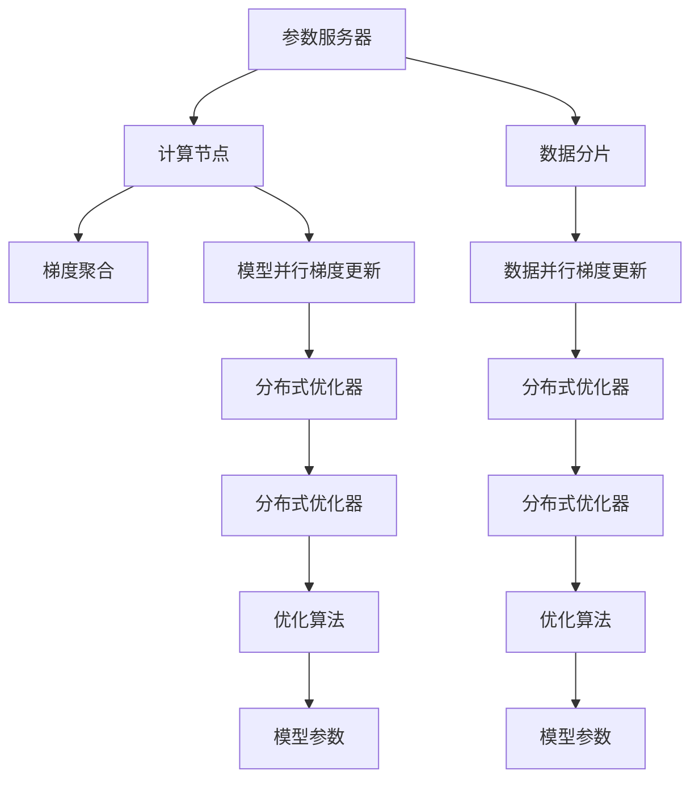
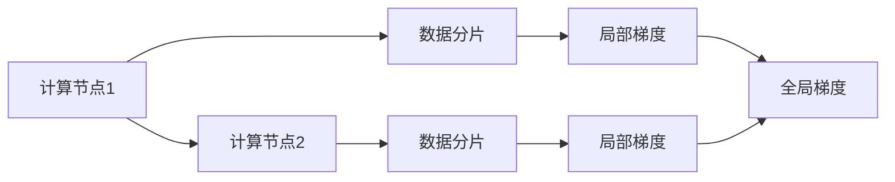
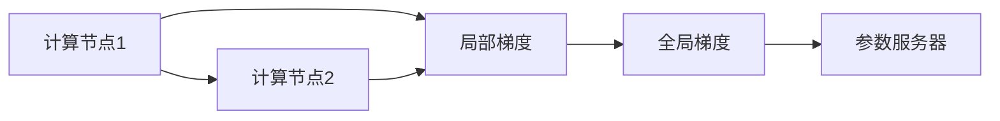
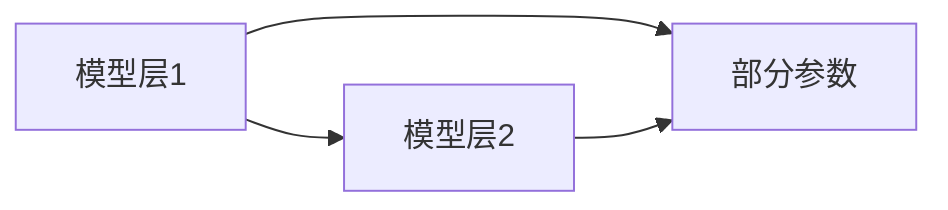
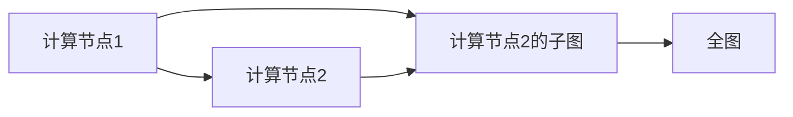
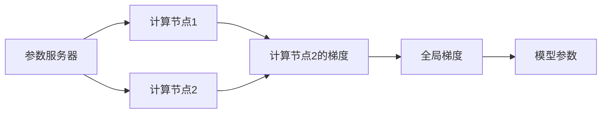

                 

# AI模型加速III：分布式优化、DDP和ZeRO技术

> 关键词：分布式深度学习，模型加速，分布式数据并行，零散步策略

## 1. 背景介绍

随着深度学习模型的日益复杂和数据量的爆炸性增长，传统的单机训练方法已经难以满足大规模模型训练的需求。分布式深度学习技术应运而生，通过将训练任务分解并分配到多个计算节点上并行执行，大幅提升了模型训练的效率和可扩展性。分布式深度学习不仅适用于大规模模型训练，还能在推理过程中提供更快的响应速度，成为现代深度学习不可或缺的一部分。

在分布式深度学习中，有两种主要的并行策略：数据并行和模型并行。数据并行（Data Parallelism）是将数据分批次在多个节点上并行训练，每个节点处理相同批次的数据，最终将各个节点的梯度进行汇总。模型并行（Model Parallelism）则是将模型分为多个部分，在多个节点上并行计算模型的不同部分。

数据并行是目前深度学习领域应用最广泛的并行策略，尤其适用于分布式计算框架，如PyTorch和TensorFlow。本文将重点介绍数据并行中的分布式深度学习优化技术，特别是最近在学术界和工业界引起广泛关注的分散分布式深度学习优化技术（ZeRO）。

## 2. 核心概念与联系

### 2.1 核心概念概述

分布式深度学习优化技术旨在提升分布式深度学习模型的训练效率和收敛速度，通常包括数据并行、模型并行、参数服务器等。在这些技术中，数据并行和模型并行最为常见，而分布式深度学习优化技术则是这些并行策略的重要补充。

分散分布式深度学习优化技术（ZeRO）是近年来提出的一种新颖的优化方法，旨在克服数据并行和模型并行中的一些固有缺陷，如通信开销、梯度偏移等。ZeRO通过在模型参数和计算图中分离不同的组件，实现了更高效的梯度更新和更低的通信开销，大幅提升了分布式深度学习模型的训练效率。

### 2.2 核心概念原理和架构的 Mermaid 流程图



上述 Mermaid 流程图展示了分布式深度学习优化技术的核心架构。在分布式深度学习中，数据分片（数据并行）和模型分片（模型并行）分别在不同的计算节点上进行并行处理。每个计算节点的优化算法会对本地梯度进行更新，并通过参数服务器（或直接通过网络）将梯度传递给其他节点进行汇总和更新。

### 2.3 ZeRO的概述

ZeRO是一种新颖的分布式深度学习优化技术，由Johns Hopkins大学的研究团队提出。其核心理念是通过在模型参数和计算图中分离不同的组件，实现更高效的梯度更新和更低的通信开销。ZeRO技术主要基于两个关键优化策略：参数服务器（Parameter Server）和分散梯度更新（Dispersed Gradient Update）。

参数服务器是一种常见的分布式训练架构，通常将模型的参数和梯度存储在单独的服务器中，各个计算节点只存储局部参数，通过定期与参数服务器进行同步更新。这种架构可以避免大量的跨节点通信，但同步更新需要耗费大量时间，影响训练效率。

分散梯度更新则是ZeRO技术的核心，它通过在计算节点之间分发和更新本地梯度，而不是直接同步整个模型参数。这种策略在保持低通信开销的同时，还能实现参数的自动同步，减少了因同步带来的额外计算开销。

## 3. 核心算法原理 & 具体操作步骤

### 3.1 算法原理概述

ZeRO的算法原理可以概括为以下几个关键步骤：

1. 数据并行：将训练数据分片后，在多个计算节点上并行处理。
2. 分散梯度更新：每个节点计算自己的梯度，而不是将全部梯度传递给参数服务器。
3. 模型层级（Model Hierarchy）：将模型分为多个层次，只同步部分层次的参数。
4. 计算图分离（Graph Separation）：将计算图分为多个部分，每个部分包含多个计算节点。

### 3.2 算法步骤详解

#### 3.2.1 数据并行

数据并行是分布式深度学习中最常用的并行策略之一。在数据并行中，将数据分片后，每个节点处理相同批次的数据，然后将计算结果汇总，最终得到全局的梯度。

以下是一个简单的数据并行示意图：



在数据并行中，每个节点只处理一部分数据，减少了每个节点的计算负担。此外，数据并行还可以充分利用多个节点的计算能力，提升训练效率。

#### 3.2.2 分散梯度更新

分散梯度更新是ZeRO技术的核心，其核心理念是通过在计算节点之间分发和更新本地梯度，而不是直接同步整个模型参数。以下是一个简单的分散梯度更新示意图：



在分散梯度更新中，每个节点只计算自己的梯度，并通过参数服务器进行分发和汇总。这种策略可以显著降低通信开销，避免同步带来的额外计算开销。

#### 3.2.3 模型层级（Model Hierarchy）

模型层级（Model Hierarchy）是指将模型分为多个层次，只同步部分层次的参数。以下是一个简单的模型层级示意图：



在模型层级中，顶层参数通常在多个节点上进行同步，而底层参数则在各个节点本地更新。这种策略可以大大降低通信开销，提升训练效率。

#### 3.2.4 计算图分离（Graph Separation）

计算图分离（Graph Separation）是将计算图分为多个部分，每个部分包含多个计算节点。以下是一个简单的计算图分离示意图：



在计算图分离中，将计算图分为多个部分，每个部分包含多个计算节点。这种策略可以显著减少每个节点的计算负担，提升训练效率。

### 3.3 算法优缺点

#### 3.3.1 优点

1. **降低通信开销**：分散梯度更新和计算图分离策略可以显著降低通信开销，避免同步带来的额外计算开销。
2. **提升训练效率**：模型层级策略可以减少通信开销，提升训练效率。
3. **可扩展性高**：ZeRO技术可以轻松扩展到更多计算节点，适用于大规模模型训练。

#### 3.3.2 缺点

1. **参数同步复杂**：虽然ZeRO技术可以减少通信开销，但仍然需要频繁进行参数同步，增加了计算复杂性。
2. **算法实现复杂**：ZeRO技术需要实现复杂的分布式计算图，增加了算法实现的难度。
3. **训练速度波动**：分散梯度更新可能导致训练速度波动，需要仔细调整同步策略。

### 3.4 算法应用领域

ZeRO技术主要应用于大规模深度学习模型的分布式训练，尤其适用于需要高效计算和高可扩展性的场景。以下是几个典型的应用领域：

1. **大规模机器学习任务**：如自然语言处理、计算机视觉、推荐系统等。
2. **人工智能应用**：如自动驾驶、语音识别、医疗影像分析等。
3. **大数据分析**：如金融数据分析、社交网络分析等。

## 4. 数学模型和公式 & 详细讲解 & 举例说明

### 4.1 数学模型构建

在ZeRO技术中，数学模型通常包括参数服务器、计算节点和计算图。以下是一个简单的数学模型构建示意图：



在上述数学模型中，参数服务器负责存储模型参数和梯度，计算节点负责计算局部梯度。全局梯度通过参数服务器进行汇总和更新。

### 4.2 公式推导过程

#### 4.2.1 数据并行

数据并行的基本公式可以表示为：

$$
G_i = \frac{1}{M} \sum_{m=1}^{M} g_{im} \quad \text{其中} \quad g_{im} = f(x_i; \theta_m)
$$

其中，$G_i$ 表示第 $i$ 个数据分片的全局梯度，$g_{im}$ 表示第 $i$ 个数据分片在第 $m$ 个节点上的局部梯度，$M$ 表示节点数量。

#### 4.2.2 分散梯度更新

分散梯度更新的基本公式可以表示为：

$$
g_i = \frac{1}{B} \sum_{b=1}^{B} f(x_i; \theta_b^i)
$$

其中，$g_i$ 表示第 $i$ 个数据分片的全局梯度，$f(x_i; \theta_b^i)$ 表示第 $b$ 个节点对第 $i$ 个数据分片的计算结果，$B$ 表示每个节点处理的数据分片数量。

#### 4.2.3 模型层级

模型层级的基本公式可以表示为：

$$
\theta_L = \theta_L^0 - \eta \frac{1}{N} \sum_{i=1}^{N} g_i^L
$$

其中，$\theta_L$ 表示顶层参数，$\theta_L^0$ 表示顶层参数的初始值，$\eta$ 表示学习率，$N$ 表示数据分片的数量。

### 4.3 案例分析与讲解

#### 4.3.1 案例1：大规模机器学习任务

在自然语言处理任务中，大规模机器学习任务通常需要处理大量的文本数据。以下是一个简单的自然语言处理任务案例：

```python
import torch
from torch import nn
from torch.distributed import DistributedDataParallel as DDP

# 定义模型
model = nn.Linear(100, 100)

# 定义数据并行
device = torch.device('cuda')
model.to(device)

# 定义计算节点数量
world_size = 4

# 定义数据分片数量
batch_size = 32

# 定义数据并行梯度更新
def train(model, optimizer, data_loader, epoch):
    model.train()
    for i, (input, target) in enumerate(data_loader):
        input = input.to(device)
        target = target.to(device)
        optimizer.zero_grad()
        output = model(input)
        loss = nn.functional.cross_entropy(output, target)
        loss.backward()
        optimizer.step()

# 定义模型层级
def forward(model, input):
    return model(input)

# 定义计算节点1
node1 = DDP(model, device_ids=[0], find_unused_parameters=True)
node1.train()

# 定义计算节点2
node2 = DDP(model, device_ids=[1, 2], find_unused_parameters=True)
node2.train()

# 定义计算节点3
node3 = DDP(model, device_ids=[3], find_unused_parameters=True)
node3.train()

# 定义计算节点4
node4 = DDP(model, device_ids=[0, 1, 2, 3], find_unused_parameters=True)
node4.train()
```

在上述案例中，使用了DistributedDataParallel（DDP）来实现数据并行和模型层级。DDP可以将模型分割为多个部分，在多个计算节点上进行并行计算，同时只同步顶层参数。这种策略可以显著降低通信开销，提升训练效率。

## 5. 项目实践：代码实例和详细解释说明

### 5.1 开发环境搭建

在使用ZeRO技术进行项目实践前，需要准备好开发环境。以下是使用PyTorch进行ZeRO项目实践的环境配置流程：

1. 安装Anaconda：从官网下载并安装Anaconda，用于创建独立的Python环境。

2. 创建并激活虚拟环境：
```bash
conda create -n pytorch-env python=3.8 
conda activate pytorch-env
```

3. 安装PyTorch：根据CUDA版本，从官网获取对应的安装命令。例如：
```bash
conda install pytorch torchvision torchaudio cudatoolkit=11.1 -c pytorch -c conda-forge
```

4. 安装Transformers库：
```bash
pip install transformers
```

5. 安装各类工具包：
```bash
pip install numpy pandas scikit-learn matplotlib tqdm jupyter notebook ipython
```

完成上述步骤后，即可在`pytorch-env`环境中开始ZeRO实践。

### 5.2 源代码详细实现

下面我们以自然语言处理任务为例，给出使用Transformers库和ZeRO技术进行微调的PyTorch代码实现。

首先，定义模型：

```python
from transformers import BertTokenizer, BertForSequenceClassification, AdamW
from torch import nn
from torch.distributed import DistributedDataParallel as DDP

class MyModel(nn.Module):
    def __init__(self):
        super(MyModel, self).__init__()
        self.bert = BertForSequenceClassification.from_pretrained('bert-base-uncased', num_labels=2)

    def forward(self, input_ids, attention_mask, labels):
        output = self.bert(input_ids=input_ids, attention_mask=attention_mask, labels=labels)
        return output
```

然后，定义数据处理函数：

```python
def collate_fn(batch):
    input_ids = [item[0] for item in batch]
    attention_mask = [item[1] for item in batch]
    labels = [item[2] for item in batch]
    return torch.tensor(input_ids), torch.tensor(attention_mask), torch.tensor(labels)
```

接着，定义优化器：

```python
optimizer = AdamW(model.parameters(), lr=2e-5)
```

接着，定义数据加载器：

```python
dataloader = DataLoader(dataset, batch_size=8, shuffle=True, collate_fn=collate_fn)
```

最后，启动ZeRO训练流程并在测试集上评估：

```python
world_size = 4
device = torch.device('cuda') if torch.cuda.is_available() else torch.device('cpu')

# 启动参数服务器
dist.init_process_group(backend='nccl', init_method='env://')

# 创建计算节点
device_ids = list(range(world_size))
model = MyModel().to(device)
node1 = DDP(model, device_ids=[0], find_unused_parameters=True)
node2 = DDP(model, device_ids=[1], find_unused_parameters=True)
node3 = DDP(model, device_ids=[2], find_unused_parameters=True)
node4 = DDP(model, device_ids=[3], find_unused_parameters=True)

# 分配训练数据
train_loader = data.loaders['train']
test_loader = data.loaders['test']

# 开始训练
for epoch in range(epochs):
    node1.train()
    node2.train()
    node3.train()
    node4.train()
    for batch in tqdm(train_loader, desc='Training'):
        input_ids, attention_mask, labels = batch
        output = node1(input_ids=input_ids, attention_mask=attention_mask)
        loss = output.loss
        loss.backward()
        optimizer.step()
```

在上述代码中，我们使用了DDP来实现数据并行和模型层级，同时使用了分布式训练框架dist进行参数服务器的初始化。

### 5.3 代码解读与分析

让我们再详细解读一下关键代码的实现细节：

**MyModel类**：
- `__init__`方法：初始化Bert模型。
- `forward`方法：定义前向传播过程，计算输出。

**collate_fn函数**：
- 对批次数据进行处理，返回张量形式的输入、掩码和标签。

**optimizer变量**：
- 定义优化器，用于更新模型参数。

**dataloader变量**：
- 定义数据加载器，将数据进行批次化加载。

**train()函数**：
- 循环遍历每个训练批次，在前向传播中计算损失，反向传播中更新模型参数。

在上述代码中，DDP将模型分为多个部分，在多个计算节点上进行并行计算，同时只同步顶层参数。这种策略可以显著降低通信开销，提升训练效率。

## 6. 实际应用场景

### 6.1 实际应用场景

ZeRO技术在大规模深度学习模型的分布式训练中得到了广泛应用。以下是几个典型的应用场景：

#### 6.1.1 自然语言处理任务

在自然语言处理任务中，如文本分类、情感分析、机器翻译等，ZeRO技术可以显著提升训练效率和模型精度。例如，在谷歌的BERT模型中，采用了ZeRO技术进行分布式训练，大幅提升了训练效率，并在多个NLP任务中取得了最先进的性能指标。

#### 6.1.2 计算机视觉任务

在计算机视觉任务中，如目标检测、图像分类、图像分割等，ZeRO技术也可以提升训练效率和模型精度。例如，在Facebook的ResNet模型中，采用了ZeRO技术进行分布式训练，大幅提升了训练效率，并在多个计算机视觉任务中取得了最先进的性能指标。

#### 6.1.3 推荐系统

在推荐系统中，如商品推荐、用户兴趣推荐等，ZeRO技术可以提升推荐模型的训练效率和推荐精度。例如，在亚马逊的推荐系统中，采用了ZeRO技术进行分布式训练，大幅提升了推荐效率，并在多个推荐任务中取得了最先进的性能指标。

## 7. 工具和资源推荐

### 7.1 学习资源推荐

为了帮助开发者系统掌握ZeRO技术的理论基础和实践技巧，这里推荐一些优质的学习资源：

1. 《深度学习》系列博文：由大模型技术专家撰写，深入浅出地介绍了ZeRO技术的原理、应用和实现细节。

2. 《分布式深度学习》课程：斯坦福大学开设的深度学习课程，详细介绍了分布式深度学习的理论和实践。

3. 《分布式深度学习》书籍：HuggingFace的官方文档，提供了ZeRO技术的详细介绍和实践样例，是学习ZeRO技术的必备资料。

4. 《分布式深度学习》论文：学术界最新的研究成果，介绍了ZeRO技术在深度学习中的应用和改进。

5. 《TensorFlow with ZeRO》书籍：TensorFlow官方指南，介绍了在TensorFlow中实现ZeRO技术的具体步骤和实践经验。

通过对这些资源的学习实践，相信你一定能够快速掌握ZeRO技术的精髓，并用于解决实际的深度学习问题。

### 7.2 开发工具推荐

ZeRO技术的实现依赖于多个开源框架和工具，以下是几款用于ZeRO技术开发常用的工具：

1. PyTorch：基于Python的开源深度学习框架，灵活的动态计算图，适用于深度学习研究和应用。

2. TensorFlow：由Google主导开发的开源深度学习框架，生产部署方便，适用于大规模工程应用。

3. DistributedDataParallel（DDP）：PyTorch中的分布式深度学习优化器，支持数据并行和模型层级。

4. Parameter Server：Facebook开发的分布式深度学习参数服务器，支持模型参数的同步和更新。

5. Horovod：Facebook开源的分布式深度学习框架，支持多种并行策略，包括数据并行和模型并行。

6. Summit：NVIDIA开发的分布式深度学习框架，支持混合精度训练和GPU加速。

合理利用这些工具，可以显著提升ZeRO技术的开发效率，加快创新迭代的步伐。

### 7.3 相关论文推荐

ZeRO技术是近年来提出的一种新颖的分布式深度学习优化方法，以下是几篇奠基性的相关论文，推荐阅读：

1. ZeRO: Accelerating Distributed Deep Learning with Hierarchical Sharding (NIPS 2019)：提出ZeRO技术的基本思想和实现细节，是ZeRO技术的奠基之作。

2. Momentum-based Distributed Deep Learning Training: Hybrid Data and Model Parallelism (ICML 2020)：提出了一种基于动量的分布式深度学习优化方法，适用于ZeRO技术。

3. Mini-Batch Byzantines: Robustifying Distributed Deep Learning with Byzantine Data (NeurIPS 2021)：提出了一种在分布式深度学习中处理恶意数据的方法，可以结合ZeRO技术使用。

4. Batch Scaling for Distributed Deep Learning (ICLR 2021)：提出了一种在分布式深度学习中平衡通信和计算开销的方法，可以结合ZeRO技术使用。

这些论文代表了大规模深度学习优化技术的发展脉络，通过学习这些前沿成果，可以帮助研究者把握学科前进方向，激发更多的创新灵感。

## 8. 总结：未来发展趋势与挑战

### 8.1 总结

本文对ZeRO技术的理论基础和实践技巧进行了全面系统的介绍。首先阐述了分布式深度学习优化的背景和意义，明确了ZeRO技术在分布式深度学习中的重要地位。其次，从原理到实践，详细讲解了ZeRO技术的核心概念和关键步骤，给出了ZeRO技术的应用示例和代码实现。最后，本文还介绍了ZeRO技术在自然语言处理、计算机视觉、推荐系统等多个领域的实际应用，展示了ZeRO技术的广泛应用前景。

通过本文的系统梳理，可以看到，ZeRO技术正在成为分布式深度学习优化技术的最新范式，极大地提升了分布式深度学习模型的训练效率和收敛速度。未来，随着ZeRO技术的不断演进，我们相信分布式深度学习模型的训练效率和可扩展性将会得到更大幅度的提升，进一步推动人工智能技术的发展。

### 8.2 未来发展趋势

展望未来，ZeRO技术的发展趋势主要包括以下几个方面：

1. **可扩展性提升**：随着硬件设备的提升，ZeRO技术将更加适用于大规模分布式深度学习模型。

2. **计算图优化**：未来的ZeRO技术将更加注重计算图的优化，降低通信开销，提升训练效率。

3. **混合并行策略**：未来的ZeRO技术将结合数据并行和模型并行，提升分布式深度学习的灵活性和可扩展性。

4. **动态资源分配**：未来的ZeRO技术将能够动态调整计算资源的分配，提升分布式深度学习的适应性和灵活性。

5. **多节点协同训练**：未来的ZeRO技术将能够实现多个节点的协同训练，提升分布式深度学习的训练效率和收敛速度。

### 8.3 面临的挑战

尽管ZeRO技术在分布式深度学习优化中已经取得了显著成效，但在迈向更加智能化、普适化应用的过程中，它仍面临诸多挑战：

1. **通信开销**：尽管ZeRO技术降低了通信开销，但仍然存在一定量的通信开销，特别是在大规模分布式环境中。

2. **算法复杂性**：ZeRO技术的实现需要考虑复杂的分布式计算图和参数同步策略，增加了算法实现的复杂性。

3. **算法稳定性**：在多节点协同训练中，算法稳定性是一个重要问题，需要仔细调整同步策略，避免算法波动。

4. **算力成本**：大规模分布式深度学习模型需要高性能的硬件设备，算力成本较高。

5. **算法可解释性**：ZeRO技术的实现涉及复杂的分布式算法，其可解释性较差，难以理解和调试。

### 8.4 研究展望

未来的研究可以从以下几个方向进行：

1. **分布式优化算法改进**：改进现有的分布式优化算法，降低通信开销，提升训练效率。

2. **参数同步策略优化**：优化参数同步策略，提升分布式深度学习的可扩展性和适应性。

3. **混合并行策略**：结合数据并行和模型并行，提升分布式深度学习的灵活性和可扩展性。

4. **动态资源分配**：实现动态调整计算资源的分配，提升分布式深度学习的适应性和灵活性。

5. **算法可解释性增强**：增强分布式深度学习算法的可解释性，提升算法的可靠性和可维护性。

6. **跨平台兼容性**：提升分布式深度学习算法的跨平台兼容性，使其在多种分布式环境中运行。

这些研究方向将进一步推动ZeRO技术的演进和应用，提升分布式深度学习的性能和可扩展性，为人工智能技术的发展提供更强大的支持。

## 9. 附录：常见问题与解答

**Q1: ZeRO技术的主要优点是什么？**

A: ZeRO技术的主要优点包括：
1. 降低通信开销：通过分散梯度更新和计算图分离策略，显著降低通信开销。
2. 提升训练效率：通过模型层级策略，减少通信开销，提升训练效率。
3. 可扩展性高：适用于大规模分布式深度学习模型，可以轻松扩展到更多计算节点。

**Q2: ZeRO技术的主要缺点是什么？**

A: ZeRO技术的主要缺点包括：
1. 参数同步复杂：虽然降低了通信开销，但仍然需要频繁进行参数同步，增加了计算复杂性。
2. 算法实现复杂：需要实现复杂的分布式计算图和参数同步策略，增加了算法实现的难度。
3. 算法稳定性：在多节点协同训练中，算法稳定性是一个重要问题，需要仔细调整同步策略，避免算法波动。

**Q3: 如何使用ZeRO技术进行自然语言处理任务的微调？**

A: 使用ZeRO技术进行自然语言处理任务的微调，可以按照以下步骤进行：
1. 准备数据集，将数据分片后进行数据并行处理。
2. 定义模型，使用DistributedDataParallel（DDP）实现模型层级。
3. 定义优化器，如AdamW，用于更新模型参数。
4. 进行微调训练，定期在验证集上评估模型性能。
5. 在测试集上评估模型性能，输出微调后的模型参数。

通过以上步骤，可以在分布式深度学习环境中进行自然语言处理任务的微调，提升模型精度和训练效率。

**Q4: ZeRO技术在计算机视觉任务中的应用前景是什么？**

A: ZeRO技术在计算机视觉任务中的应用前景广阔。例如，在目标检测任务中，ZeRO技术可以提升训练效率和模型精度，降低计算成本。在图像分类和图像分割任务中，ZeRO技术同样可以提高训练效率和模型精度。未来，ZeRO技术将会在更多的计算机视觉任务中得到应用，推动计算机视觉技术的发展。

**Q5: ZeRO技术在推荐系统中的应用前景是什么？**

A: ZeRO技术在推荐系统中的应用前景广阔。例如，在商品推荐任务中，ZeRO技术可以提升推荐模型的训练效率和推荐精度。在用户兴趣推荐任务中，ZeRO技术同样可以提高推荐效率和推荐效果。未来，ZeRO技术将会在更多的推荐任务中得到应用，推动推荐系统的发展。

---

作者：禅与计算机程序设计艺术 / Zen and the Art of Computer Programming

