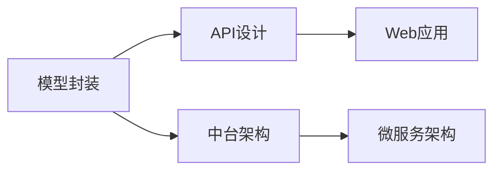

                 

# AI模型部署：构建API和Web应用

## 1. 背景介绍

### 1.1 问题由来

随着人工智能技术的快速发展，深度学习模型在诸多领域取得了卓越的成果。模型训练流程已经从原始的Python脚本，逐步演进到框架化的训练引擎，如TensorFlow、PyTorch、MXNet等。然而，模型训练与模型部署之间，存在一条鸿沟，即如何将训练好的模型转化为可用的服务或产品。在AI工程实践中，模型的部署能力往往比模型本身更重要。本文将聚焦于AI模型的部署，特别是构建API和Web应用，详细探讨其原理、技术和流程。

### 1.2 问题核心关键点

模型部署涉及将模型封装成可用的软件产品，以便被外部系统调用。关键点包括：

- **封装和包装**：将模型封装成接口，以便其他应用系统调用。
- **数据预处理和后处理**：确保输入数据和输出结果符合预期格式。
- **性能优化**：确保模型部署在生产环境中的性能。
- **监控和维护**：监控模型服务状态，及时发现和修复问题。
- **扩展性和可伸缩性**：根据需求调整服务性能和资源配置。
- **安全性**：保护模型免受攻击和滥用。

本文将重点探讨如何构建API和Web应用，使模型得以被有效部署和使用，同时兼顾以上核心关键点。

## 2. 核心概念与联系

### 2.1 核心概念概述

为更好地理解AI模型部署的核心概念，我们首先列举几个关键概念：

- **模型封装（Model Wrapping）**：将模型封装成接口，便于其他系统调用。
- **API（Application Programming Interface）**：提供给外部系统调用的函数集合，包括请求和响应。
- **Web应用（Web Application）**：通过Web界面提供服务，使用HTTP协议。
- **RESTful API**：符合REST原则的API设计，易于维护和扩展。
- **中台架构（Middleware）**：在应用和模型之间增加服务层，实现业务逻辑、数据处理和模型服务的分离。
- **微服务架构（Microservices）**：将应用拆分为多个小型、自治的服务。

这些概念通过以下Mermaid流程图来展示它们之间的联系：



这个流程图展示了模型封装到最终Web应用的主要流程，其中封装、API设计、Web应用、中台架构和微服务架构是关键环节。

## 3. 核心算法原理 & 具体操作步骤

### 3.1 算法原理概述

AI模型部署的核心在于如何将模型封装成接口，并通过Web应用提供服务。其核心算法原理如下：

1. **模型封装**：通过Python脚本或框架封装模型，使之符合API接口标准。
2. **API设计**：定义API的请求和响应格式，确保数据传输标准化。
3. **Web应用构建**：通过框架如Flask、Django等构建Web应用，实现模型接口的部署和调用。
4. **中台架构设计**：在应用和模型之间增加服务层，实现业务逻辑与模型服务的分离。
5. **微服务架构设计**：将应用拆分为多个小型、自治的服务，提升系统的扩展性和可伸缩性。

### 3.2 算法步骤详解

模型部署的具体步骤如下：

**Step 1: 准备模型和数据**
- 选择一个预训练或自定义的深度学习模型。
- 准备训练数据和测试数据，确保数据格式符合模型输入要求。

**Step 2: 模型封装**
- 使用Python或框架提供的封装工具，将模型封装成API接口。
- 设计API的请求和响应格式，使用JSON或XML格式，并确保数据标准化。

**Step 3: 构建Web应用**
- 选择合适的Web框架，如Flask、Django等。
- 实现API接口，确保接口能够正确地调用模型，并处理输入数据和输出结果。

**Step 4: 添加中台架构**
- 设计中台架构，实现业务逻辑与模型服务的分离。
- 在中台架构中，处理输入数据的预处理和输出数据的后处理。

**Step 5: 设计微服务架构**
- 将Web应用拆分为多个小型、自治的服务，提升系统的扩展性和可伸缩性。
- 每个服务负责不同的业务功能，提高系统的模块化和灵活性。

**Step 6: 性能优化**
- 优化API接口的响应时间和吞吐量，确保系统性能。
- 使用缓存、负载均衡等技术，提升系统可用性。

**Step 7: 监控和维护**
- 实现监控系统，实时监控模型服务状态。
- 根据监控结果，及时发现和修复问题。

**Step 8: 安全性设计**
- 设计API接口的安全机制，如鉴权、加密等。
- 确保模型数据和输出的安全，防止滥用和攻击。

### 3.3 算法优缺点

AI模型部署的核心算法具有以下优点：
- 提升模型的可用性和可扩展性，便于多系统集成和调用。
- 通过Web应用提供服务，易于用户接入和使用。
- 中台架构和微服务架构，提升系统的模块化和灵活性，易于维护和扩展。
- 通过性能优化和监控，提升系统的稳定性和可用性。

同时，该方法也存在一些局限性：
- 封装和包装工作量大，需要熟练掌握模型和API设计。
- 部署和维护过程复杂，需要考虑安全性、扩展性和性能等多方面因素。
- 系统架构设计复杂，需要一定的系统架构知识。

尽管存在这些局限性，但就目前而言，通过封装和包装、API设计和Web应用构建的模型部署方法是主流且有效的。未来相关研究的重点在于如何进一步简化封装和包装过程，提升部署效率，同时兼顾安全性和扩展性。

### 3.4 算法应用领域

AI模型部署的应用领域非常广泛，涵盖了各种工业和学术领域：

- **工业生产**：用于预测和优化生产流程，提升生产效率。
- **智能客服**：提供智能问答和自动化服务，提升客户体验。
- **医疗诊断**：提供医学影像分析和疾病预测，辅助医生诊断。
- **金融风控**：用于信用评分、风险评估等，提升金融服务的质量和效率。
- **自动驾驶**：提供图像识别、路径规划等技术，提升自动驾驶的准确性和安全性。
- **教育培训**：提供个性化推荐和学习分析，提升教育效果。

以上领域只是冰山一角，AI模型的部署正在逐步渗透到各行各业，为各行各业带来新的价值和变革。

## 4. 数学模型和公式 & 详细讲解

### 4.1 数学模型构建

AI模型部署的数学模型主要涉及模型封装和API设计两个环节。以模型封装为例，其数学模型构建如下：

假设模型的输入为 $x$，输出为 $y$，封装后的API接口为 $\mathcal{F}$，请求和响应数据格式分别为 $r$ 和 $a$，则模型封装过程可以表示为：

$$
y = \mathcal{F}(x)
$$

其中，$\mathcal{F}$ 是模型封装函数，$x$ 是输入数据，$y$ 是输出结果。

### 4.2 公式推导过程

以一个简单的线性回归模型为例，假设模型的输入为 $x$，输出为 $y$，模型的权重为 $\theta$，则模型封装过程可以表示为：

$$
y = \mathcal{F}(x; \theta)
$$

其中，$\theta$ 为模型参数，$\mathcal{F}$ 为封装函数。

### 4.3 案例分析与讲解

假设有一个简单的线性回归模型，用于预测房价。输入为房屋面积 $x$，输出为房价 $y$。模型的封装过程可以表示为：

1. **输入封装**：将房屋面积 $x$ 转换为API接口请求 $r$，请求格式为 JSON：
```json
{
    "area": 200
}
```

2. **模型调用**：调用封装后的模型 $\mathcal{F}$，得到预测房价 $y$：
```json
{
    "price": 1000
}
```

3. **输出封装**：将预测结果 $y$ 转换为API接口响应 $a$，响应格式为 JSON：
```json
{
    "price": 1000
}
```

这个例子展示了模型封装的基本流程，包括输入封装、模型调用和输出封装。通过这种方式，模型可以被外部系统安全地调用和集成。

## 5. 项目实践：代码实例和详细解释说明

### 5.1 开发环境搭建

在进行AI模型部署实践前，我们需要准备好开发环境。以下是使用Python和Flask框架搭建环境的步骤：

1. 安装Anaconda：从官网下载并安装Anaconda，用于创建独立的Python环境。

2. 创建并激活虚拟环境：
```bash
conda create -n pytorch-env python=3.8 
conda activate pytorch-env
```

3. 安装PyTorch和Flask：
```bash
conda install pytorch torchvision torchaudio cudatoolkit=11.1 -c pytorch -c conda-forge
pip install flask
```

4. 安装其他必需的Python库：
```bash
pip install numpy pandas scikit-learn requests
```

5. 安装Flask提供的模板和静态文件：
```bash
pip install flask-restful flask-sqlalchemy flask-cors flask-restful-swagger
```

完成上述步骤后，即可在`pytorch-env`环境中开始模型部署实践。

### 5.2 源代码详细实现

下面是一个简单的AI模型部署示例，展示如何使用Flask构建Web应用，调用封装后的模型接口。

**模型定义**

```python
import torch
import torch.nn as nn
import torch.optim as optim
from torch.utils.data import DataLoader, Dataset

class LinearRegression(nn.Module):
    def __init__(self, input_size, output_size):
        super(LinearRegression, self).__init__()
        self.linear = nn.Linear(input_size, output_size)
        
    def forward(self, x):
        y_pred = self.linear(x)
        return y_pred

# 数据集定义
class HousingDataset(Dataset):
    def __init__(self, data):
        self.data = data
        
    def __len__(self):
        return len(self.data)
    
    def __getitem__(self, idx):
        x = torch.tensor(self.data[idx][0])
        y = torch.tensor(self.data[idx][1])
        return x, y

# 加载数据集
data = [
    [200, 1000],
    [150, 900],
    [180, 1100],
    [170, 950],
    [160, 900],
]
dataset = HousingDataset(data)

# 定义模型、优化器和损失函数
model = LinearRegression(input_size=1, output_size=1)
criterion = nn.MSELoss()
optimizer = optim.SGD(model.parameters(), lr=0.01)

# 训练模型
for epoch in range(100):
    for x, y in DataLoader(dataset, batch_size=1, shuffle=True):
        optimizer.zero_grad()
        y_pred = model(x)
        loss = criterion(y_pred, y)
        loss.backward()
        optimizer.step()
```

**模型封装**

```python
from flask import Flask, request, jsonify

app = Flask(__name__)

@app.route('/predict', methods=['POST'])
def predict():
    data = request.json
    area = data['area']
    y_pred = model((torch.tensor(area)).float())
    result = {'price': y_pred.item()}
    return jsonify(result)

if __name__ == '__main__':
    app.run(debug=True)
```

**API设计**

```python
from flask import Flask, request, jsonify

app = Flask(__name__)

@app.route('/predict', methods=['POST'])
def predict():
    data = request.json
    area = data['area']
    y_pred = model((torch.tensor(area)).float())
    result = {'price': y_pred.item()}
    return jsonify(result)

if __name__ == '__main__':
    app.run(debug=True)
```

### 5.3 代码解读与分析

让我们再详细解读一下关键代码的实现细节：

**数据集定义**

```python
class HousingDataset(Dataset):
    def __init__(self, data):
        self.data = data
        
    def __len__(self):
        return len(self.data)
    
    def __getitem__(self, idx):
        x = torch.tensor(self.data[idx][0])
        y = torch.tensor(self.data[idx][1])
        return x, y
```

这是一个简单的数据集定义，用于封装线性回归模型。它继承自PyTorch的Dataset类，重载了__getitem__方法，返回模型输入和标签。

**模型封装**

```python
from flask import Flask, request, jsonify

app = Flask(__name__)

@app.route('/predict', methods=['POST'])
def predict():
    data = request.json
    area = data['area']
    y_pred = model((torch.tensor(area)).float())
    result = {'price': y_pred.item()}
    return jsonify(result)

if __name__ == '__main__':
    app.run(debug=True)
```

这段代码实现了模型封装和API接口的连接。使用Flask框架，我们定义了一个/predict接口，接收POST请求，调用模型进行预测，并将结果返回JSON格式的响应。

### 5.4 运行结果展示

启动Python脚本，在浏览器中输入 `http://localhost:5000/predict?area=200`，将得到一个JSON格式的响应，展示预测结果。例如：

```json
{
    "price": 1000
}
```

这个例子展示了模型封装和API接口的连接过程，通过Flask框架，我们将模型封装成了可用的Web服务。

## 6. 实际应用场景

### 6.1 智能客服系统

基于AI模型部署构建的智能客服系统，可以通过构建API接口，提供智能问答和自动化服务。智能客服系统通过接听客户来电或自动回复客户查询，提高客户体验和服务效率。

具体而言，可以收集企业内部的客服对话记录，将问题和最佳答复构建成监督数据，在此基础上对预训练模型进行微调。微调后的模型能够自动理解用户意图，匹配最合适的答案模板进行回复。对于客户提出的新问题，还可以接入检索系统实时搜索相关内容，动态组织生成回答。如此构建的智能客服系统，能大幅提升客户咨询体验和问题解决效率。

### 6.2 金融舆情监测

金融机构需要实时监测市场舆论动向，以便及时应对负面信息传播，规避金融风险。传统的人工监测方式成本高、效率低，难以应对网络时代海量信息爆发的挑战。基于AI模型部署构建的文本分类和情感分析系统，为金融舆情监测提供了新的解决方案。

具体而言，可以收集金融领域相关的新闻、报道、评论等文本数据，并对其进行主题标注和情感标注。在此基础上对预训练语言模型进行微调，使其能够自动判断文本属于何种主题，情感倾向是正面、中性还是负面。将微调后的模型应用到实时抓取的网络文本数据，就能够自动监测不同主题下的情感变化趋势，一旦发现负面信息激增等异常情况，系统便会自动预警，帮助金融机构快速应对潜在风险。

### 6.3 个性化推荐系统

当前的推荐系统往往只依赖用户的历史行为数据进行物品推荐，无法深入理解用户的真实兴趣偏好。基于AI模型部署构建的个性化推荐系统，可以通过构建API接口，提供个性化推荐服务。

具体而言，可以收集用户浏览、点击、评论、分享等行为数据，提取和用户交互的物品标题、描述、标签等文本内容。将文本内容作为模型输入，用户的后续行为（如是否点击、购买等）作为监督信号，在此基础上微调预训练语言模型。微调后的模型能够从文本内容中准确把握用户的兴趣点。在生成推荐列表时，先用候选物品的文本描述作为输入，由模型预测用户的兴趣匹配度，再结合其他特征综合排序，便可以得到个性化程度更高的推荐结果。

### 6.4 未来应用展望

随着AI模型部署技术的发展，其在更多领域得到应用，为传统行业带来变革性影响。

在智慧医疗领域，基于AI模型部署构建的医学影像分析和疾病预测系统，能够辅助医生诊断和治疗，提升医疗服务的智能化水平。

在智能教育领域，基于AI模型部署构建的个性化推荐和学习分析系统，能够因材施教，促进教育公平，提高教学质量。

在智慧城市治理中，基于AI模型部署构建的城市事件监测和应急指挥系统，能够提高城市管理的自动化和智能化水平，构建更安全、高效的未来城市。

此外，在企业生产、社会治理、文娱传媒等众多领域，基于AI模型部署的人工智能应用也将不断涌现，为经济社会发展注入新的动力。相信随着技术的日益成熟，AI模型部署范式将成为人工智能落地应用的重要手段，推动人工智能技术向更广阔的领域加速渗透。

## 7. 工具和资源推荐

### 7.1 学习资源推荐

为了帮助开发者系统掌握AI模型部署的理论基础和实践技巧，这里推荐一些优质的学习资源：

1. **《深度学习与人工智能实践》**：涵盖深度学习模型部署、API设计和Web应用开发的全面内容，适合初学者系统学习。

2. **CS231n《深度学习应用于计算机视觉》课程**：斯坦福大学开设的计算机视觉课程，涵盖模型部署、API设计和Web应用开发的经典案例。

3. **《TensorFlow实战》**：TensorFlow的官方文档和示例代码，详细介绍了如何使用TensorFlow构建AI模型和Web应用。

4. **《Flask Web开发实战》**：Flask框架的官方文档和示例代码，详细介绍了如何使用Flask构建Web应用和API接口。

5. **《RESTful API设计》**：讲解RESTful API设计原则和最佳实践，帮助开发者设计高效、易用的API接口。

6. **Kaggle竞赛**：Kaggle提供的深度学习竞赛项目，涵盖多种AI模型部署任务，适合动手实践和问题解决。

通过对这些资源的学习实践，相信你一定能够快速掌握AI模型部署的精髓，并用于解决实际的AI问题。

### 7.2 开发工具推荐

高效的开发离不开优秀的工具支持。以下是几款用于AI模型部署开发的常用工具：

1. **TensorFlow**：由Google主导开发的深度学习框架，提供丰富的模型和API接口，生产部署方便。

2. **PyTorch**：Facebook开发的深度学习框架，灵活性和可扩展性高，适合研究与开发。

3. **Flask**：轻量级的Web框架，易于上手和扩展，适合构建API接口和Web应用。

4. **Django**：功能强大的Web框架，适合构建复杂的Web应用。

5. **Kubernetes**：开源的容器编排系统，支持分布式部署和扩展，适合大规模生产环境。

6. **Prometheus**：开源的监控系统，支持实时监控和告警，适合AI模型部署的监控和维护。

7. **Jupyter Notebook**：交互式的开发环境，适合模型开发和数据探索。

合理利用这些工具，可以显著提升AI模型部署任务的开发效率，加快创新迭代的步伐。

### 7.3 相关论文推荐

AI模型部署技术的发展源于学界的持续研究。以下是几篇奠基性的相关论文，推荐阅读：

1. **《TensorFlow: A System for Large-Scale Machine Learning》**：介绍了TensorFlow的架构和核心组件，提供了模型部署和API接口设计的经典案例。

2. **《Flask Web Development with Python》**：Flask框架的官方文档，详细介绍了如何使用Flask构建Web应用和API接口。

3. **《RESTful API Design Guide》**：讲解RESTful API设计的原则和最佳实践，帮助开发者设计高效、易用的API接口。

4. **《Model Deployment with TensorFlow》**：TensorFlow官方文档，详细介绍了如何使用TensorFlow部署和优化模型。

5. **《Model Deployment in AI Systems》**：讲解AI系统模型部署的挑战和解决方案，帮助开发者优化模型部署效率和性能。

这些论文代表了大模型部署技术的发展脉络。通过学习这些前沿成果，可以帮助研究者把握学科前进方向，激发更多的创新灵感。

## 8. 总结：未来发展趋势与挑战

### 8.1 总结

本文对AI模型部署，特别是通过封装和包装、API设计和Web应用构建的模型部署方法进行了全面系统的介绍。首先阐述了AI模型部署的重要性，明确了模型封装、API设计、Web应用、中台架构和微服务架构是关键环节。其次，从原理到实践，详细讲解了AI模型部署的数学模型和公式，给出了模型封装和API接口的代码实例。同时，本文还广泛探讨了AI模型部署在智能客服、金融舆情、个性化推荐等多个行业领域的应用前景，展示了AI模型部署技术的广阔前景。最后，本文精选了模型部署技术的各类学习资源，力求为读者提供全方位的技术指引。

通过本文的系统梳理，可以看到，AI模型部署正在成为AI工程实践的重要范式，极大地拓展了模型应用边界，催生了更多的落地场景。受益于深度学习模型的逐步成熟，AI模型部署技术还将迎来更多突破，为各行各业带来新的价值和变革。

### 8.2 未来发展趋势

展望未来，AI模型部署技术将呈现以下几个发展趋势：

1. **智能化**：随着AI模型部署技术的不断演进，未来的智能客服、金融舆情、个性化推荐系统将更加智能，能够提供更加精准、个性化的服务。

2. **标准化**：AI模型部署技术将趋向标准化，统一的API接口和数据格式将使得模型部署更加便捷。

3. **高效化**：未来模型部署将更加高效，使用缓存、负载均衡、分布式部署等技术，提升系统性能和稳定性。

4. **自动化**：AI模型部署将趋向自动化，通过自动化的模型封装、API设计和部署，降低开发和维护成本。

5. **可视化**：未来的AI模型部署将具备更强的可视化能力，通过监控系统展示模型状态和性能，便于调试和优化。

6. **安全性**：未来模型部署将更加注重安全性，通过鉴权、加密、监控等措施，保障数据和模型安全。

以上趋势凸显了AI模型部署技术的广阔前景。这些方向的探索发展，必将进一步提升AI模型的应用效果，为各行各业带来新的价值和变革。

### 8.3 面临的挑战

尽管AI模型部署技术已经取得了瞩目成就，但在迈向更加智能化、标准化、高效化、自动化和可视化应用的过程中，它仍面临诸多挑战：

1. **复杂性**：模型部署涉及模型封装、API设计、Web应用构建等多个环节，需要综合考虑模型、数据和业务等多方面因素，增加了开发复杂性。

2. **安全性**：模型部署涉及数据传输、API接口设计等多个环节，需要综合考虑数据安全、模型安全、API接口安全等多方面因素，增加了安全风险。

3. **性能瓶颈**：模型部署涉及模型封装、API接口设计等多个环节，需要综合考虑模型性能、API性能、Web应用性能等多方面因素，增加了性能优化难度。

4. **资源消耗**：模型部署涉及模型封装、API接口设计等多个环节，需要综合考虑资源消耗、系统扩展性等多方面因素，增加了资源优化难度。

5. **技术门槛**：模型部署涉及模型封装、API接口设计等多个环节，需要综合考虑模型封装、API接口设计、Web应用构建等多方面技术，增加了技术门槛。

尽管存在这些挑战，但随着学界和产业界的共同努力，这些挑战终将一一被克服，AI模型部署技术必将在构建人机协同的智能时代中扮演越来越重要的角色。相信随着技术的日益成熟，AI模型部署技术将成为AI工程实践的重要手段，推动AI技术向更广阔的领域加速渗透。

### 8.4 研究展望

面对AI模型部署所面临的种种挑战，未来的研究需要在以下几个方面寻求新的突破：

1. **模型封装自动化**：探索自动化模型封装技术，降低模型部署的技术门槛，提升模型部署效率。

2. **API接口标准化**：推动API接口标准化，统一API接口格式和数据格式，降低模型部署的复杂性。

3. **系统性能优化**：开发更高效的模型封装、API接口设计、Web应用构建等技术，提升模型部署的性能和扩展性。

4. **安全性设计**：研究模型部署的安全性问题，引入鉴权、加密、监控等技术，保障数据和模型安全。

5. **可视化能力**：提升模型部署的可视化能力，通过监控系统展示模型状态和性能，便于调试和优化。

这些研究方向的探索，必将引领AI模型部署技术迈向更高的台阶，为构建安全、可靠、可解释、可控的智能系统铺平道路。面向未来，AI模型部署技术还需要与其他人工智能技术进行更深入的融合，如知识表示、因果推理、强化学习等，多路径协同发力，共同推动自然语言理解和智能交互系统的进步。只有勇于创新、敢于突破，才能不断拓展模型部署的边界，让智能技术更好地造福人类社会。

## 9. 附录：常见问题与解答

**Q1：AI模型部署过程中如何确保数据安全和模型安全？**

A: AI模型部署过程中，数据安全和模型安全是关键问题。为确保数据安全，可以采用数据脱敏、加密传输等技术，防止数据泄露。为确保模型安全，可以采用鉴权、访问控制等技术，防止模型被滥用和攻击。同时，需要对模型进行监控和审计，及时发现和修复安全漏洞。

**Q2：AI模型部署过程中如何优化性能？**

A: 模型部署过程中，性能优化是关键问题。可以通过缓存、负载均衡、分布式部署等技术提升系统性能。同时，需要对模型和API接口进行性能测试和优化，确保系统性能满足实际需求。

**Q3：AI模型部署过程中如何降低技术门槛？**

A: 降低模型部署的技术门槛是关键问题。可以通过自动化封装、标准化接口等技术，简化模型部署流程。同时，可以提供详细的文档和示例代码，帮助开发者快速上手。

**Q4：AI模型部署过程中如何确保系统扩展性和可伸缩性？**

A: 系统扩展性和可伸缩性是关键问题。可以通过设计微服务架构，提升系统的模块化和灵活性。同时，需要优化模型和API接口的性能，确保系统能够应对大规模请求和高并发场景。

**Q5：AI模型部署过程中如何实现自动化和可视化？**

A: 自动化和可视化是关键问题。可以通过自动化封装、自动化测试等技术，提升模型部署的自动化水平。同时，可以通过监控系统、可视化工具等，实现系统状态和性能的实时展示，便于调试和优化。

这些问题是AI模型部署过程中常见的问题，通过综合考虑数据安全、模型安全、性能优化、技术门槛、扩展性和可伸缩性、自动化和可视化等多方面因素，可以更好地实现AI模型的部署，提升系统的性能和稳定性，保障系统的安全性和可靠性。

---

作者：禅与计算机程序设计艺术 / Zen and the Art of Computer Programming

