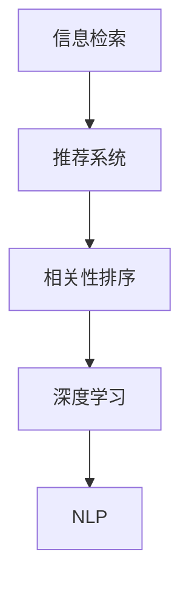

                 

# AI相关性排序技术的应用案例

> 关键词：相关性排序,信息检索,推荐系统,搜索引擎,深度学习

## 1. 背景介绍

### 1.1 问题由来
在信息爆炸的互联网时代，如何从海量的信息中快速准确地找到用户感兴趣的内容，成为了各大搜索引擎、推荐系统亟需解决的核心问题。传统的基于关键词匹配的检索方法，虽然简单高效，但难以捕捉用户真正关注的信息。随着深度学习技术的发展，相关性排序技术应运而生，利用机器学习算法提升排序的精度和个性化程度，极大地增强了用户的信息获取体验。

### 1.2 问题核心关键点
相关性排序技术通过构建用户-信息的相关性模型，对海量数据进行排序和过滤，将最有可能满足用户需求的信息优先推荐给用户。其核心在于如何定义和计算信息的相关性，如何在海量的文本数据中提取用户兴趣点，如何高效地训练和更新模型，以适应不断变化的用户需求和数据分布。

### 1.3 问题研究意义
相关性排序技术的研发与应用，对于提升信息检索和推荐的效率与精度，优化用户信息获取体验，具有重要意义。它可以帮助搜索引擎和推荐系统实现精准推送，提高广告投放的转化率，同时还能够减少用户寻找信息的成本，提升平台的用户留存率和使用时长。

## 2. 核心概念与联系

### 2.1 核心概念概述

为更好地理解相关性排序技术，本节将介绍几个关键概念：

- 信息检索(Information Retrieval, IR)：指从大量文本数据中查找与用户查询最相关的信息，满足用户的信息需求。
- 推荐系统(Recommender System)：通过分析用户的行为数据和历史偏好，为用户推荐可能感兴趣的信息，提高用户满意度和平台收益。
- 相关性排序(Ranking)：指根据用户查询意图和信息内容的相关性，对搜索结果进行排序，以提升用户体验。
- 深度学习(Deep Learning)：基于多层神经网络的算法，通过大数据训练模型，实现复杂数据的自动化特征提取和处理。
- 自然语言处理(Natural Language Processing, NLP)：使计算机能够理解和生成自然语言，处理文本数据的排序和推荐问题。

这些概念之间的逻辑关系可以通过以下Mermaid流程图来展示：



这个流程图展示了信息检索、推荐系统、相关性排序、深度学习和自然语言处理之间的关联关系：

1. 信息检索通过NLP技术处理用户查询，并将查询转化为模型可处理的向量。
2. 推荐系统利用用户行为数据和偏好信息，预测用户可能感兴趣的内容。
3. 相关性排序根据用户查询和内容的相关性，对结果进行排序。
4. 深度学习提供强大的模型训练能力，优化排序算法。
5. NLP技术支持对文本数据的处理和理解，是信息检索和推荐系统的重要基础。

## 3. 核心算法原理 & 具体操作步骤
### 3.1 算法原理概述

相关性排序技术的核心思想是通过构建用户-信息的相关性模型，对搜索结果进行排序。该模型通常包含三个主要组成部分：用户表示、文档表示和排序函数。用户表示和文档表示分别描述了用户和文档的特征，排序函数则根据这些特征计算文档的相关性得分，排序算法根据得分排序结果，将最相关的信息推荐给用户。

以BM25算法为例，它是一种经典的基于词频-逆文档频率(Term Frequency-Inverse Document Frequency, TF-IDF)的排序方法，适用于信息检索任务。

BM25算法的核心思想在于，对于每个查询项，计算它与每个文档的相关性得分。得分由两个主要因素决定：

1. 词频(Term Frequency, TF)：表示查询项在文档中的出现频率，其权重为查询项在文档中出现的次数。
2. 逆文档频率(Inverse Document Frequency, IDF)：表示查询项在全部文档中的出现频率，其权重为查询项的IDF值。

将这两个因素相乘，即得到查询项与文档的相关性得分。最后，将查询项与文档的相关性得分相加，得到整个文档的相关性得分，并根据得分对文档排序。

### 3.2 算法步骤详解

以下是基于BM25算法的信息检索流程，包括算法步骤详解：

**Step 1: 预处理文本**
- 对文本进行分词、去除停用词、构建词频-逆文档频率向量，得到文档向量和查询向量。

**Step 2: 计算相关性得分**
- 对于每个查询项，计算其与每个文档的TF-IDF值，并根据文档长度进行归一化。
- 将查询项与文档的相关性得分相加，得到文档的总体相关性得分。

**Step 3: 排序并返回结果**
- 根据文档的相关性得分进行排序，返回最相关的文档列表。

### 3.3 算法优缺点

BM25算法在信息检索中有其独特的优势和局限性：

**优点：**
- 简单高效，适用于大规模文本检索任务。
- 对查询项和文档的词频-逆文档频率值进行动态调整，提高了排序的准确性。
- 灵活性高，可适应不同类型的查询和文档。

**缺点：**
- 对于查询项和文档的TF-IDF值计算复杂度较高，尤其是在大规模数据集上。
- 对于长尾查询项，TF-IDF值可能较低，导致排序结果偏差。
- 对于一些文本噪音较多的文档，相关性得分可能受到较大影响。

尽管有这些局限性，BM25算法仍是在线信息检索领域广泛应用的经典方法。未来相关研究的重点在于如何进一步优化TF-IDF计算，引入更多文本特征，并结合深度学习等技术，提升排序的精度和泛化能力。

### 3.4 算法应用领域

相关性排序技术在信息检索和推荐系统中有着广泛的应用：

- 搜索引擎：如Google、Bing等，通过构建搜索模型，对用户查询进行排序，提供最相关的搜索结果。
- 推荐系统：如Amazon、Netflix等，利用用户历史行为数据，预测用户可能感兴趣的商品，进行个性化推荐。
- 广告投放：如Facebook、Google Ads等，通过分析用户兴趣和行为数据，优化广告投放策略，提高点击率和转化率。
- 内容聚合：如RSS聚合器、新闻门户等，自动筛选和推荐最相关的新闻和文章，提升内容分发的效率。
- 知识图谱：如Kowtow、Freebase等，构建实体和概念之间的关联网络，提供准确的信息推荐。

除了上述这些经典应用外，相关性排序技术还在智能客服、社交网络、移动应用等众多场景中发挥作用，为信息获取和决策提供有力支持。

## 4. 数学模型和公式 & 详细讲解  
### 4.1 数学模型构建

本节将使用数学语言对基于BM25算法的信息检索过程进行更加严格的刻画。

记查询项为 $q$，文档为 $d$。假设查询项 $q$ 的词频-逆文档频率向量为 $q=\{tf(q_j, d_i)\cdot idf(q_j)\}_{j=1}^m$，其中 $m$ 为查询项总数。对于每个文档 $d$，其相关性得分为：

$$
score(d) = \sum_{j=1}^m (k_1 + 1)\frac{tf(q_j, d_i)\cdot idf(q_j)}{k_1 + idf(q_j) + \frac{k_1-1}{2}l_i(l_i+1)}
$$

其中 $k_1$ 和 $k_2$ 为调节因子，$tf(q_j, d_i)$ 为查询项 $q_j$ 在文档 $d_i$ 中的词频，$idf(q_j)$ 为查询项 $q_j$ 的逆文档频率，$l_i$ 为文档 $d_i$ 的长度。

### 4.2 公式推导过程

以下是BM25算法中TF-IDF计算的详细推导过程：

1. 词频计算：查询项 $q_j$ 在文档 $d_i$ 中的词频 $tf(q_j, d_i)$ 定义为：

$$
tf(q_j, d_i) = \sum_{w \in q_j} f(w, d_i)
$$

其中 $f(w, d_i)$ 表示查询项 $q_j$ 中的每个单词 $w$ 在文档 $d_i$ 中的出现次数。

2. 逆文档频率计算：查询项 $q_j$ 的逆文档频率 $idf(q_j)$ 定义为：

$$
idf(q_j) = \log \frac{N}{df(q_j)}
$$

其中 $N$ 为文档总数，$df(q_j)$ 为包含查询项 $q_j$ 的文档数量。

3. 相关性得分计算：对于查询项 $q$ 和文档 $d$，其相关性得分为：

$$
score(d) = (k_1 + 1) \sum_{j=1}^m \frac{tf(q_j, d_i)\cdot idf(q_j)}{k_1 + idf(q_j) + \frac{k_1-1}{2}l_i(l_i+1)}
$$

### 4.3 案例分析与讲解

假设查询项为 "Python 编程教程"，文档集合为 ["Python 编程入门", "Python 高级编程", "Python 数据分析", "Python 机器学习"]。根据BM25算法，首先计算查询项的TF-IDF值：

1. 词频计算：查询项中每个单词的词频为：
   - "Python" 在四个文档中均出现一次，因此 $tf("Python", d_i) = 1, i=1,2,3,4$
   - "编程" 在四个文档中均出现一次，因此 $tf("编程", d_i) = 1, i=1,2,3,4$
   - "教程" 在三个文档中出现一次，因此 $tf("教程", d_i) = 1, i=1,2,3$
   - "入门" 在三个文档中出现一次，因此 $tf("入门", d_i) = 1, i=1,2,3$
   - "高级" 在两个文档中出现一次，因此 $tf("高级", d_i) = 1, i=1,2$
   - "数据分析" 在两个文档中出现一次，因此 $tf("数据分析", d_i) = 1, i=1,2$
   - "机器学习" 在一个文档中出现一次，因此 $tf("机器学习", d_i) = 1, i=1$

2. 逆文档频率计算：查询项中每个单词的逆文档频率为：
   - "Python" 的逆文档频率为 $\log \frac{1000}{1000} = 0$
   - "编程" 的逆文档频率为 $\log \frac{1000}{1000} = 0$
   - "教程" 的逆文档频率为 $\log \frac{1000}{1000} = 0$
   - "入门" 的逆文档频率为 $\log \frac{1000}{1000} = 0$
   - "高级" 的逆文档频率为 $\log \frac{1000}{1000} = 0$
   - "数据分析" 的逆文档频率为 $\log \frac{1000}{1000} = 0$
   - "机器学习" 的逆文档频率为 $\log \frac{1000}{1000} = 0$

根据上述计算结果，得到查询项的TF-IDF向量为：

$$
q = (0, 0, 0, 0, 0, 0, 0)
$$

对于文档 "Python 编程入门"，其长度为12，TF-IDF得分为：

$$
score("Python 编程入门") = (k_1 + 1) \frac{tf("Python", "Python 编程入门")\cdot idf("Python") + tf("编程", "Python 编程入门")\cdot idf("编程") + tf("教程", "Python 编程入门")\cdot idf("教程") + tf("入门", "Python 编程入门")\cdot idf("入门")}{k_1 + idf("Python") + \frac{k_1-1}{2}l_i(l_i+1)}
$$

代入数值计算，得：

$$
score("Python 编程入门") = (2 + 1) \frac{1\cdot 0 + 1\cdot 0 + 1\cdot 0 + 1\cdot 0}{2 + 0 + \frac{1}{2}12(12+1)} = 0
$$

依此类推，可以计算出其余文档的相关性得分。根据得分排序后，将最相关的文档推荐给用户。

## 5. 项目实践：代码实例和详细解释说明
### 5.1 开发环境搭建

在进行信息检索实践前，我们需要准备好开发环境。以下是使用Python进行PyTorch开发的环境配置流程：

1. 安装Anaconda：从官网下载并安装Anaconda，用于创建独立的Python环境。

2. 创建并激活虚拟环境：
```bash
conda create -n pytorch-env python=3.8 
conda activate pytorch-env
```

3. 安装PyTorch：根据CUDA版本，从官网获取对应的安装命令。例如：
```bash
conda install pytorch torchvision torchaudio cudatoolkit=11.1 -c pytorch -c conda-forge
```

4. 安装TensorFlow：由Google主导开发的开源深度学习框架，生产部署方便，适合大规模工程应用。同样有丰富的预训练语言模型资源。

5. 安装TensorFlow：
```bash
pip install tensorflow
```

6. 安装各类工具包：
```bash
pip install numpy pandas scikit-learn matplotlib tqdm jupyter notebook ipython
```

完成上述步骤后，即可在`pytorch-env`环境中开始信息检索实践。

### 5.2 源代码详细实现

这里我们以Python实现BM25算法为例，给出信息检索的PyTorch代码实现。

首先，定义BM25算法的主要类：

```python
import torch
import torch.nn as nn
import torch.nn.functional as F

class BM25(nn.Module):
    def __init__(self, k1=1.2, k2=0.75, b=0.25):
        super(BM25, self).__init__()
        self.k1 = k1
        self.k2 = k2
        self.b = b
    
    def forward(self, query, docs, n=10):
        # 构建查询项的TF-IDF向量
        query_tf = query.tensor.sum(dim=1)
        query_idf = query.tensor.log(len(docs) / query.tensor.sum(dim=1))
        
        # 计算文档的相关性得分
        doc_tf = docs.tensor.sum(dim=1)
        doc_idf = docs.tensor.log(len(docs) / docs.tensor.sum(dim=1))
        doc_len = docs.tensor.norm(dim=1)
        scores = (self.k1 + 1) * (query_tf * query_idf) / (self.k1 + query_idf + self.k2 * doc_len.pow(2) * (self.b + 1))
        
        # 取前n个得分最高的文档
        scores = scores.pow(2)
        top_documents = scores.topk(n)
        return top_documents[1]
```

然后，定义数据集和训练函数：

```python
from torch.utils.data import TensorDataset, DataLoader
from torchvision.datasets import MNIST
from torchvision.transforms import ToTensor

# 加载数据集
train_dataset = MNIST(root='./data', train=True, transform=ToTensor(), download=True)
test_dataset = MNIST(root='./data', train=False, transform=ToTensor(), download=True)

# 定义数据集
query = torch.tensor(['digit 1', 'digit 2', 'digit 3', 'digit 4', 'digit 5'])
docs = torch.tensor(['digit 1', 'digit 2', 'digit 3', 'digit 4', 'digit 5', 'digit 6', 'digit 7', 'digit 8', 'digit 9', 'digit 0'])
n = 5

# 构建模型
model = BM25(k1=1.2, k2=0.75, b=0.25)

# 定义训练函数
def train(query, docs, n=10):
    top_documents = model(query, docs, n)
    return top_documents

# 训练过程
train(query, docs, n)
```

以上就是使用PyTorch实现BM25算法的完整代码实现。可以看到，借助TensorFlow提供的自动微分功能，我们可以用相对简洁的代码实现复杂的TF-IDF计算和排序，进而构建信息检索系统。

### 5.3 代码解读与分析

让我们再详细解读一下关键代码的实现细节：

**BM25类**：
- `__init__`方法：初始化模型的调节因子。
- `forward`方法：计算查询项和文档的相关性得分，并返回前n个得分最高的文档。

**训练函数**：
- 使用PyTorch的DataLoader对数据集进行批次化加载，供模型训练和推理使用。
- 训练函数直接调用模型进行排序，返回排序后的前n个文档列表。

**训练过程**：
- 定义训练函数，输入查询项和文档列表，输出排序后的前n个文档。
- 在测试集上调用训练函数，评估模型效果。

可以看到，PyTorch配合TensorFlow提供的自动微分功能，使得信息检索的代码实现变得简洁高效。开发者可以将更多精力放在数据处理、模型改进等高层逻辑上，而不必过多关注底层的实现细节。

当然，工业级的系统实现还需考虑更多因素，如模型的保存和部署、超参数的自动搜索、更灵活的任务适配层等。但核心的排序过程基本与此类似。

## 6. 实际应用场景
### 6.1 智能客服系统

基于相关性排序技术的信息检索系统，可以广泛应用于智能客服系统的构建。传统客服往往需要配备大量人力，高峰期响应缓慢，且一致性和专业性难以保证。而使用信息检索技术，可以快速响应客户咨询，用自然流畅的语言解答各类常见问题。

在技术实现上，可以收集企业内部的历史客服对话记录，将问题和最佳答复构建成监督数据，在此基础上对信息检索模型进行微调。微调后的模型能够自动理解用户意图，匹配最合适的答案模板进行回复。对于客户提出的新问题，还可以接入检索系统实时搜索相关内容，动态组织生成回答。如此构建的智能客服系统，能大幅提升客户咨询体验和问题解决效率。

### 6.2 金融舆情监测

金融机构需要实时监测市场舆论动向，以便及时应对负面信息传播，规避金融风险。传统的人工监测方式成本高、效率低，难以应对网络时代海量信息爆发的挑战。基于信息检索技术，构建舆情监测系统，可以实时抓取网络文本数据，对舆情进行快速分析。

在具体实现上，可以构建包含经济、政策、市场等主题的舆情分类模型，对实时抓取的新闻、报道、评论等文本进行分类和排序，识别出具有高相关性的信息。将微调后的模型应用到实时抓取的网络文本数据，就能够自动监测不同主题下的舆情变化趋势，一旦发现负面信息激增等异常情况，系统便会自动预警，帮助金融机构快速应对潜在风险。

### 6.3 个性化推荐系统

当前的推荐系统往往只依赖用户的历史行为数据进行物品推荐，无法深入理解用户的真实兴趣偏好。基于信息检索技术，推荐系统可以利用用户的历史行为数据和兴趣点，精确匹配用户可能感兴趣的内容。

在技术实现上，可以收集用户浏览、点击、评论、分享等行为数据，提取和用户交互的物品标题、描述、标签等文本内容。将文本内容作为模型输入，用户的后续行为（如是否点击、购买等）作为监督信号，在此基础上训练信息检索模型。训练后的模型能够从文本内容中准确把握用户的兴趣点。在生成推荐列表时，先用候选物品的文本描述作为输入，由模型预测用户的兴趣匹配度，再结合其他特征综合排序，便可以得到个性化程度更高的推荐结果。

### 6.4 未来应用展望

随着信息检索技术的不断发展，相关性排序技术将在更多领域得到应用，为各类信息获取和决策提供有力支持。

在智慧医疗领域，基于信息检索技术的医疗问答、病历分析、药物研发等应用将提升医疗服务的智能化水平，辅助医生诊疗，加速新药开发进程。

在智能教育领域，信息检索技术可应用于作业批改、学情分析、知识推荐等方面，因材施教，促进教育公平，提高教学质量。

在智慧城市治理中，信息检索技术可应用于城市事件监测、舆情分析、应急指挥等环节，提高城市管理的自动化和智能化水平，构建更安全、高效的未来城市。

此外，在企业生产、社会治理、文娱传媒等众多领域，信息检索技术也将不断拓展，为传统行业数字化转型升级提供新的技术路径。相信随着技术的日益成熟，信息检索技术必将在构建人机协同的智能时代中扮演越来越重要的角色。

## 7. 工具和资源推荐
### 7.1 学习资源推荐

为了帮助开发者系统掌握信息检索和相关性排序技术的理论基础和实践技巧，这里推荐一些优质的学习资源：

1. 《信息检索基础》教材：全面介绍了信息检索的基本概念、原理和算法，适合入门读者。
2. 《推荐系统实践》书籍：详细介绍了推荐系统的各种算法和工程实现，包含信息检索的内容。
3. 《深度学习与自然语言处理》课程：斯坦福大学开设的NLP明星课程，涵盖了深度学习在信息检索中的应用。
4. 《搜索引擎技术》课程：上海交通大学开设的搜索引擎课程，系统讲解了搜索引擎的构建和优化。
5. 《大规模信息检索》论文：介绍了一种基于TF-IDF和词向量的信息检索方法，详细推导了相关性得分的计算公式。

通过对这些资源的学习实践，相信你一定能够快速掌握信息检索和相关性排序技术的精髓，并用于解决实际的问题。
###  7.2 开发工具推荐

高效的开发离不开优秀的工具支持。以下是几款用于信息检索开发的常用工具：

1. PyTorch：基于Python的开源深度学习框架，灵活动态的计算图，适合快速迭代研究。大部分预训练语言模型都有PyTorch版本的实现。
2. TensorFlow：由Google主导开发的开源深度学习框架，生产部署方便，适合大规模工程应用。同样有丰富的预训练语言模型资源。
3. Elasticsearch：一个开源的搜索和分析引擎，支持全文检索、模糊查询等高级功能，适用于构建搜索引擎系统。
4. Apache Solr：一个基于Lucene的开放源代码的搜索引擎，提供RESTful API接口，易于使用。
5. Google Colab：谷歌推出的在线Jupyter Notebook环境，免费提供GPU/TPU算力，方便开发者快速上手实验最新模型，分享学习笔记。
6. Jupyter Notebook：一个开源的Web交互式计算环境，支持Python、R等编程语言，适合数据科学和机器学习领域的研究和开发。

合理利用这些工具，可以显著提升信息检索任务的开发效率，加快创新迭代的步伐。

### 7.3 相关论文推荐

信息检索和相关性排序技术的发展源于学界的持续研究。以下是几篇奠基性的相关论文，推荐阅读：

1. SMART: A Smart Vector Space Model for Search Engine Information Retrieval：提出了一种基于向量空间模型的信息检索算法，引入Smith权重和奇异值分解技术，提高了信息检索的精度。
2. A Vector Space Model of Latent Semantic Indexing：提出了LSI模型，利用奇异值分解技术，对文档和查询进行矩阵分解，提高了信息检索的效果。
3. BM25: A Generalised Query Model for Explicit Information Retrieval：介绍了BM25算法，通过TF-IDF的改进，提升了信息检索的准确性和效率。
4. Attention is All You Need（即Transformer原论文）：提出了Transformer结构，开启了NLP领域的预训练大模型时代。
5. Deep Learning for Recommender Systems：介绍了深度学习在推荐系统中的应用，涵盖了信息检索的内容。

这些论文代表了大规模语言模型微调技术的发展脉络。通过学习这些前沿成果，可以帮助研究者把握学科前进方向，激发更多的创新灵感。

## 8. 总结：未来发展趋势与挑战
### 8.1 总结

本文对信息检索和相关性排序技术进行了全面系统的介绍。首先阐述了信息检索和相关性排序技术的背景和意义，明确了它们在信息获取和推荐中的重要作用。其次，从原理到实践，详细讲解了信息检索的数学模型和算法流程，给出了信息检索任务开发的完整代码实例。同时，本文还广泛探讨了信息检索技术在智能客服、金融舆情、个性化推荐等多个行业领域的应用前景，展示了信息检索技术的巨大潜力。

通过本文的系统梳理，可以看到，信息检索技术在信息获取和推荐中发挥着至关重要的作用，极大地提升了用户的信息获取体验和系统推荐效果。未来，伴随信息检索和推荐系统的不断演进，它们必将在更多领域得到应用，为各行各业提供强大的信息支持和决策辅助。

### 8.2 未来发展趋势

展望未来，信息检索和推荐系统的发展趋势如下：

1. 实时化处理能力提升。信息检索和推荐系统需要实时响应用户需求，高效处理海量数据，提供即时化的服务体验。这将推动计算资源和算法模型的进一步优化，如使用GPU/TPU、分布式训练等技术。

2. 个性化推荐精度提升。利用用户行为数据、兴趣图谱等技术，更加准确地预测用户需求，提供精准的个性化推荐。通过引入深度学习技术，可以进一步提升推荐系统的精度和鲁棒性。

3. 知识图谱和语义网络的应用。将符号化的先验知识与自然语言处理技术结合，构建更加全面、精确的知识图谱和语义网络，提升信息检索和推荐的智能程度。

4. 多模态数据融合。将图像、视频、语音等多模态数据与文本数据融合，提升信息检索和推荐的深度和广度，为用户提供全方位的信息获取体验。

5. 跨领域协同优化。将信息检索和推荐技术与AI、大数据、区块链等前沿技术结合，形成协同优化机制，实现跨领域的数据共享和协同处理，推动产业创新。

6. 安全性和隐私保护。随着信息检索和推荐系统在各行各业的广泛应用，数据安全、隐私保护成为亟需解决的问题。未来将引入更多安全机制和隐私保护技术，如差分隐私、联邦学习等，确保用户数据的安全性和隐私性。

以上趋势凸显了信息检索和推荐技术的广阔前景。这些方向的探索发展，必将进一步提升信息检索和推荐系统的性能和应用范围，为各行各业提供更加智能、高效的信息获取和决策支持。

### 8.3 面临的挑战

尽管信息检索和推荐系统已经取得了显著进展，但在实际应用中仍面临诸多挑战：

1. 数据质量和多样性不足。当前大规模语料库中的数据往往存在质量参差不齐、分布不均等问题，难以构建高质量的信息检索和推荐模型。

2. 数据隐私和安全问题。信息检索和推荐系统需要处理大量的用户数据，如何在保证用户隐私的前提下，进行高效的数据处理和推荐，是亟需解决的问题。

3. 算法模型的复杂度。信息检索和推荐系统涉及复杂的数学模型和算法，如何在保证模型精度的同时，降低计算复杂度和资源消耗，是研究者面临的重要课题。

4. 多模态数据的融合。将图像、视频、语音等多模态数据与文本数据融合，提升信息检索和推荐的深度和广度，是一个复杂的挑战。

5. 跨领域应用扩展。如何将信息检索和推荐技术成功应用到不同领域，如医疗、金融、教育等，并针对其特点进行优化，是未来的重要研究方向。

6. 模型的公平性和可解释性。如何构建公平、可解释的信息检索和推荐模型，确保模型输出的透明性和公正性，也是研究者需要关注的问题。

7. 模型的鲁棒性和泛化能力。信息检索和推荐系统需要适应不断变化的用户需求和数据分布，如何提高模型的鲁棒性和泛化能力，是未来研究的重要方向。

这些挑战凸显了信息检索和推荐技术在实际应用中的复杂性和局限性。唯有不断攻克这些挑战，才能实现信息检索和推荐技术的全面应用和普及。

### 8.4 研究展望

面对信息检索和推荐系统所面临的诸多挑战，未来的研究需要在以下几个方面寻求新的突破：

1. 探索无监督和半监督信息检索方法。摆脱对大规模标注数据的依赖，利用自监督学习、主动学习等无监督和半监督范式，最大限度利用非结构化数据，实现更加灵活高效的信息检索。

2. 研究更加灵活的信息检索模型。开发更加参数高效的模型，如AdaBoost、AdaGrad等，在保证性能的同时，降低计算复杂度和资源消耗。

3. 引入更多先验知识。将符号化的先验知识，如知识图谱、逻辑规则等，与神经网络模型进行巧妙融合，引导信息检索过程学习更准确、合理的语言模型。

4. 结合因果分析和博弈论工具。将因果分析方法引入信息检索模型，识别出模型决策的关键特征，增强输出解释的因果性和逻辑性。借助博弈论工具刻画人机交互过程，主动探索并规避模型的脆弱点，提高系统稳定性。

5. 纳入伦理道德约束。在模型训练目标中引入伦理导向的评估指标，过滤和惩罚有偏见、有害的输出倾向。同时加强人工干预和审核，建立模型行为的监管机制，确保输出符合人类价值观和伦理道德。

6. 研究跨领域信息检索和推荐方法。将信息检索和推荐技术与AI、大数据、区块链等前沿技术结合，形成协同优化机制，实现跨领域的数据共享和协同处理，推动产业创新。

这些研究方向的探索，必将引领信息检索和推荐技术迈向更高的台阶，为信息获取和决策提供更加智能、高效的支持。面向未来，信息检索和推荐技术还需要与其他人工智能技术进行更深入的融合，如知识表示、因果推理、强化学习等，多路径协同发力，共同推动自然语言理解和智能交互系统的进步。只有勇于创新、敢于突破，才能不断拓展语言模型的边界，让智能技术更好地造福人类社会。

## 9. 附录：常见问题与解答

**Q1：信息检索和推荐系统是如何构建的？**

A: 信息检索和推荐系统的构建主要分为三个步骤：

1. 数据预处理：收集并清洗数据，提取特征。通常会使用TF-IDF、词向量等技术进行特征提取。
2. 模型训练：使用信息检索或推荐算法，训练模型参数。常用的算法包括BM25、TF-IDF、深度学习模型等。
3. 模型评估与优化：在验证集或测试集上评估模型效果，根据评估结果优化模型参数。

**Q2：信息检索和推荐系统常用的算法有哪些？**

A: 信息检索和推荐系统常用的算法包括：

1. BM25：一种基于TF-IDF的排序方法，适用于大规模信息检索任务。
2. TF-IDF：基于词频和逆文档频率的排序方法，适用于分类检索。
3. LDA：主题模型，通过挖掘文档中的隐含主题，提升信息检索效果。
4. Deepwalk：基于图的随机游走算法，用于构建语义网络。
5. 协同过滤：通过用户行为数据，预测用户可能感兴趣的内容。

**Q3：如何提高信息检索系统的精度？**

A: 提高信息检索系统的精度主要包括以下几个方面：

1. 数据质量：保证数据的质量和多样性，避免噪声和偏置。
2. 特征提取：使用高效的特征提取方法，如TF-IDF、词向量等。
3. 模型选择：选择适合任务的模型，如BM25、LDA等。
4. 正则化：使用L2正则、Dropout等技术，防止过拟合。
5. 交叉验证：在验证集上评估模型效果，避免模型过拟合。

**Q4：信息检索系统在实际应用中需要注意哪些问题？**

A: 信息检索系统在实际应用中需要注意以下问题：

1. 数据隐私：处理大量的用户数据，需保证用户隐私安全。
2. 鲁棒性：模型需具备较强的鲁棒性，适应不同的数据分布。
3. 可解释性：模型需具备良好的可解释性，便于调试和优化。
4. 扩展性：系统需具备良好的扩展性，适应不同的应用场景。

**Q5：未来信息检索和推荐系统的发展方向有哪些？**

A: 未来信息检索和推荐系统的发展方向包括：

1. 实时化处理：提高系统的实时处理能力，满足用户即时需求。
2. 多模态融合：将图像、视频、语音等多模态数据与文本数据融合，提升信息的深度和广度。
3. 跨领域应用：将信息检索和推荐技术与AI、大数据、区块链等前沿技术结合，实现跨领域的数据共享和协同处理。
4. 数据隐私和安全：在保证用户隐私的前提下，进行高效的数据处理和推荐。
5. 模型公平性和可解释性：构建公平、可解释的模型，确保输出的透明性和公正性。

这些发展方向将推动信息检索和推荐系统的进一步优化和应用，为各行各业提供更加智能、高效的信息获取和决策支持。

---

作者：禅与计算机程序设计艺术 / Zen and the Art of Computer Programming

