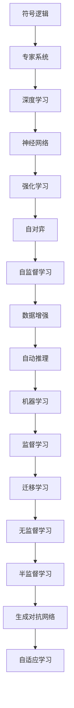

                 

## 1. 背景介绍

人工智能(AI)作为一项前沿科技，已经经历了几十年的发展历程。从早期的符号推理系统，到20世纪90年代起兴起的连接主义和符号混合的认知系统，再到21世纪初兴起的深度学习和大数据技术，AI研究的各个阶段都伴随着大量的理论突破和实践进展。本节将简要回顾AI研究的历程，同时展望未来趋势。

### 1.1 AI研究的历史演进

AI研究的历史可以追溯到上世纪50年代。1950年，阿兰·图灵发表了《计算机器与智能》一文，提出了著名的图灵测试，定义了机器智能的判别标准。1956年，达特茅斯会议标志着人工智能这一术语的诞生，将AI定位为"研究让机器表现出智能行为的科学"。

**1950s-1970s：符号推理时代**

这一时期的人工智能研究主要集中在基于规则的专家系统和逻辑推理上。专家系统通过设计一套规则和知识库，模拟人类专家的判断和决策过程。而逻辑推理系统则通过符号操作和规则推导，进行逻辑分析和问题解决。典型代表有Shakey和MYCIN等。

**1980s：专家系统蓬勃发展**

专家系统的广泛应用标志着AI研究进入了一个新的高峰。专家系统在医疗诊断、金融预测、航空调度等领域大放异彩。然而，专家系统的规则设计复杂且缺乏灵活性，难以应对复杂的现实问题。

**1990s：连接主义和符号混合**

为了解决专家系统的局限性，研究者开始引入神经网络和分布式知识存储。连接主义模型如回溯神经网络和神经模糊逻辑系统，试图模拟人类大脑的神经网络结构和认知功能。符号混合系统如SOAR和ACT-R，则结合了符号逻辑和知识表示与连接主义的计算能力。

**2000s-2010s：深度学习和大数据**

随着深度学习和大数据技术的发展，AI研究进入了一个新的高峰。深度神经网络模型通过多层非线性变换，实现了对复杂数据的高效处理。大数据技术使得模型能够利用大规模数据集进行训练，提升模型的泛化能力和鲁棒性。典型代表有卷积神经网络(CNN)、循环神经网络(RNN)和生成对抗网络(GAN)等。

**2010s至今：AI应用的井喷**

深度学习和大数据技术的融合，极大地提升了AI的实用价值。在计算机视觉、自然语言处理、机器翻译、语音识别等领域，AI系统逐渐超越了人类专家，成为工业界不可或缺的工具。AI的应用也不断拓展，渗透到了医疗、金融、交通、安全等多个行业，带来了前所未有的变革。

### 1.2 AI研究的重要里程碑

AI研究的发展过程中，有许多重要的里程碑事件。

- **1966年**：符号逻辑系统ELIZA，通过自动回复进行情感对话。
- **1977年**：专家系统DENDRAL，用于癌症分型诊断，展示了专家系统的实用价值。
- **1986年**：BP神经网络模型，开启了深度学习的研究序幕。
- **1997年**：IBM的Deep Blue，击败国际象棋世界冠军卡斯帕罗夫，展示了AI在决策推理上的能力。
- **2012年**：ImageNet大规模视觉识别挑战赛的胜利，标志着深度学习在计算机视觉领域的成功应用。
- **2018年**：AlphaGo Zero，通过自对弈进行强化学习，击败人类和AlphaGo，展示了AI在策略游戏上的强大能力。

## 2. 核心概念与联系

### 2.1 核心概念概述

为了更深入地理解AI研究的历史和未来趋势，本节将介绍几个核心概念，包括符号逻辑、连接主义、深度学习、强化学习等，并阐述它们之间的联系。

- **符号逻辑**：基于规则和符号的逻辑推理系统，用于模拟人类专家的推理过程。
- **连接主义**：通过神经网络进行分布式知识存储和计算的系统，模仿人类神经网络的结构和功能。
- **深度学习**：通过多层非线性变换进行复杂数据建模的系统，利用反向传播算法优化参数。
- **强化学习**：通过与环境互动，学习最优策略的系统，用于复杂决策和游戏。

这些概念之间的联系可以通过以下Mermaid流程图来展示：



## 3. 核心算法原理 & 具体操作步骤

### 3.1 算法原理概述

AI研究的核心算法原理涉及符号逻辑、连接主义、深度学习和强化学习等多个方向。其中，深度学习和强化学习近年来取得了显著进展，并逐渐成为AI研究的主流范式。

**符号逻辑**：基于规则和符号的逻辑推理系统，用于模拟人类专家的推理过程。其核心思想是：通过符号操作和规则推导，构建知识库和推理引擎，进行逻辑分析和问题解决。

**连接主义**：通过神经网络进行分布式知识存储和计算的系统，模仿人类神经网络的结构和功能。其核心思想是：通过神经元之间的连接权值，实现对输入数据的非线性变换和信息提取，模拟人类大脑的学习和推理过程。

**深度学习**：通过多层非线性变换进行复杂数据建模的系统，利用反向传播算法优化参数。其核心思想是：通过多层神经网络进行特征提取和表示学习，利用大规模数据集进行训练，提升模型的泛化能力和鲁棒性。

**强化学习**：通过与环境互动，学习最优策略的系统，用于复杂决策和游戏。其核心思想是：通过智能体与环境互动，根据奖惩机制进行策略学习，最大化长期奖励。

### 3.2 算法步骤详解

AI算法的实施一般包括以下关键步骤：

**Step 1: 数据预处理**

对原始数据进行清洗、归一化、特征提取等预处理，为后续建模提供干净、格式化的输入。

**Step 2: 模型构建**

根据任务类型和数据特点，选择合适的模型结构，并进行参数初始化。

**Step 3: 模型训练**

使用训练集对模型进行迭代优化，通过梯度下降等优化算法更新参数。

**Step 4: 模型评估**

在验证集上评估模型性能，选择最优模型进行测试。

**Step 5: 模型部署**

将训练好的模型部署到实际应用环境中，进行推理预测。

### 3.3 算法优缺点

**符号逻辑**的优点是：逻辑严谨，规则可解释性强。缺点是：处理复杂问题时，规则设计复杂，难以灵活应对。

**连接主义**的优点是：灵活性强，能处理非线性复杂数据。缺点是：难以解释内部推理过程，容易过拟合。

**深度学习**的优点是：可处理大规模数据，具有强大的泛化能力。缺点是：模型结构复杂，训练难度大。

**强化学习**的优点是：适用于复杂决策和游戏，模型鲁棒性好。缺点是：模型训练成本高，计算复杂度高。

### 3.4 算法应用领域

AI算法在各个领域都有着广泛的应用，涵盖计算机视觉、自然语言处理、机器翻译、语音识别、机器人控制等多个方向。

- **计算机视觉**：用于图像分类、目标检测、图像生成等任务，如TensorFlow、PyTorch等深度学习框架均有丰富的计算机视觉库。
- **自然语言处理**：用于文本分类、命名实体识别、机器翻译、情感分析等任务，如BERT、GPT等预训练模型在NLP领域取得了巨大的成功。
- **机器翻译**：用于跨语言文本转换，如Google的Google Translate。
- **语音识别**：用于语音转文本、语音合成等任务，如IBM的Watson。
- **机器人控制**：用于机器人路径规划、动作决策等任务，如OpenAI的TARS。

## 4. 数学模型和公式 & 详细讲解 & 举例说明

### 4.1 数学模型构建

AI研究的数学模型构建主要涉及概率模型、线性模型、非线性模型等多个方向。以神经网络和深度学习为例，数学模型可以表示为：

$$y = f(x; \theta)$$

其中 $x$ 为输入数据， $y$ 为输出结果， $\theta$ 为模型参数。在深度学习中， $f$ 通常为一组多层神经网络结构，利用反向传播算法进行优化。

### 4.2 公式推导过程

以神经网络为例，其反向传播算法公式为：

$$\frac{\partial L}{\partial \theta} = \frac{\partial L}{\partial z^{(L)}}\frac{\partial z^{(L)}}{\partial h^{(L-1)}} \cdots \frac{\partial h^{(1)}}{\partial z^{(0)}} \frac{\partial L}{\partial x}$$

其中 $L$ 为网络层数， $z^{(L)}$ 为第 $L$ 层的隐藏变量， $h^{(L-1)}$ 为第 $L-1$ 层的输出， $\frac{\partial L}{\partial x}$ 为损失函数对输入的导数。反向传播算法通过链式法则计算各层参数的梯度，进行模型优化。

### 4.3 案例分析与讲解

以卷积神经网络(CNN)为例，CNN通过卷积操作提取图像特征，通过池化操作进行特征降维，通过全连接层进行分类预测。其数学模型可以表示为：

$$y = \max_{k} (w_k \star z^{conv} + b_k)$$

其中 $w_k$ 为卷积核权重， $z^{conv}$ 为卷积层输出， $b_k$ 为偏置项， $\star$ 表示卷积操作。

## 5. 项目实践：代码实例和详细解释说明

### 5.1 开发环境搭建

在搭建开发环境时，需要考虑以下几个方面：

- **安装Python**：选择最新版本，并确保安装pip、numpy、scipy、matplotlib等常用库。
- **安装深度学习框架**：如TensorFlow、PyTorch等，并根据GPU支持情况安装相应版本的CUDA。
- **安装第三方库**：如Keras、TensorFlow等，用于快速构建深度学习模型。
- **安装数据集**：如CIFAR-10、MNIST等，用于模型训练和测试。

### 5.2 源代码详细实现

以下是一个简单的卷积神经网络(CNN)模型实现示例：

```python
import tensorflow as tf

class CNNModel(tf.keras.Model):
    def __init__(self):
        super(CNNModel, self).__init__()
        self.conv1 = tf.keras.layers.Conv2D(32, (3, 3), activation='relu')
        self.pool1 = tf.keras.layers.MaxPooling2D((2, 2))
        self.conv2 = tf.keras.layers.Conv2D(64, (3, 3), activation='relu')
        self.pool2 = tf.keras.layers.MaxPooling2D((2, 2))
        self.flatten = tf.keras.layers.Flatten()
        self.dense1 = tf.keras.layers.Dense(128, activation='relu')
        self.dense2 = tf.keras.layers.Dense(10, activation='softmax')
        
    def call(self, inputs):
        x = self.conv1(inputs)
        x = self.pool1(x)
        x = self.conv2(x)
        x = self.pool2(x)
        x = self.flatten(x)
        x = self.dense1(x)
        x = self.dense2(x)
        return x

model = CNNModel()
model.summary()
```

### 5.3 代码解读与分析

**定义模型类**：
- `__init__`方法：初始化各层结构，并进行参数初始化。
- `call`方法：定义模型的前向传播过程，通过各层函数的堆叠实现。

**训练过程**：
- 定义损失函数、优化器和评估指标。
- 使用训练集进行模型训练，设置迭代次数和批次大小。
- 在验证集上评估模型性能，选择最优模型进行测试。

**模型部署**：
- 将训练好的模型进行保存。
- 加载模型进行推理预测。

## 6. 实际应用场景

### 6.1 智能医疗

AI在智能医疗领域的应用非常广泛，包括疾病诊断、治疗方案生成、个性化医疗等。利用深度学习和大数据技术，AI模型可以分析患者病历、影像数据等，提供精准的诊断和治疗建议。例如，IBM的Watson用于乳腺癌诊断，Google Health用于遗传疾病预测。

### 6.2 自动驾驶

AI在自动驾驶领域的应用也取得了显著进展。通过计算机视觉、深度学习和强化学习技术，AI模型可以实时感知环境，进行路径规划和决策，提高行车安全性和效率。例如，Waymo、Tesla等公司都在积极开发自动驾驶系统。

### 6.3 金融风控

AI在金融风控领域的应用包括信用评估、欺诈检测、风险预警等。利用深度学习和大数据技术，AI模型可以分析交易数据、客户行为等，进行精准的信用评估和风险预警。例如，Alphacubo、Kensho等公司都在开发基于AI的风控系统。

### 6.4 未来应用展望

未来，AI将进一步渗透到各个领域，带来更深层次的应用变革。

- **智慧城市**：通过AI技术实现智能交通、智慧安防、环境监测等，提升城市管理效率。
- **农业**：利用AI进行精准农业、作物病害检测、农产品质量监测等，提升农业生产效率。
- **能源**：通过AI进行智能电网、能源消耗优化、能源生产调度等，提高能源利用效率。

## 7. 工具和资源推荐

### 7.1 学习资源推荐

- **Coursera**：提供大量AI相关课程，涵盖机器学习、深度学习、自然语言处理等多个方向。
- **edX**：提供MIT、Harvard等名校的AI课程，涵盖AI理论、实践等多个方面。
- **IEEE Xplore**：提供大量AI相关论文，涵盖最新研究和技术进展。
- **Google Scholar**：提供丰富的AI论文数据库，涵盖各种研究方向和技术热点。
- **ArXiv**：提供预印本论文，涵盖AI、计算机科学等多个领域。

### 7.2 开发工具推荐

- **TensorFlow**：谷歌开源的深度学习框架，支持GPU、TPU等多种计算平台。
- **PyTorch**：Facebook开源的深度学习框架，易于使用和调试。
- **Keras**：高层次的深度学习框架，易于上手。
- **Jupyter Notebook**：开源的交互式编程环境，支持Python等多种编程语言。
- **Google Colab**：谷歌提供的云环境，支持免费GPU使用，方便进行深度学习实验。

### 7.3 相关论文推荐

- **Deep Learning**：Ian Goodfellow、Yoshua Bengio、Aaron Courville合著，全面介绍深度学习原理和应用。
- **Pattern Recognition and Machine Learning**：Christopher Bishop合著，深入讲解机器学习算法和应用。
- **Natural Language Processing with Transformers**：Jacob Devlin、Ming-Wei Chang、Kenton Lee、Christopher D. Manning合著，介绍Transformer模型及其在NLP中的应用。
- **Reinforcement Learning: An Introduction**：Richard S. Sutton、Andrew G. Barto合著，介绍强化学习原理和算法。

## 8. 总结：未来发展趋势与挑战

### 8.1 研究成果总结

AI研究经过几十年的发展，已经取得了巨大的进步，涵盖了符号逻辑、连接主义、深度学习、强化学习等多个方向。深度学习和大数据技术近年来尤为突出，广泛应用于计算机视觉、自然语言处理、自动驾驶等多个领域，带来了前所未有的应用变革。

### 8.2 未来发展趋势

未来，AI将继续向更加智能化、普适化、安全化、透明化的方向发展。

- **智能化**：通过多模态融合、跨领域迁移等技术，提升AI的泛化能力和鲁棒性。
- **普适化**：通过普及AI技术，使其渗透到各个行业和领域，实现人工智能的普及化应用。
- **安全性**：通过隐私保护、数据脱敏、模型解释等技术，保障AI系统的安全性和可信度。
- **透明化**：通过可解释性模型、可视化工具等，提高AI系统的透明性和可解释性。

### 8.3 面临的挑战

尽管AI技术取得了显著进展，但仍面临诸多挑战。

- **数据瓶颈**：获取高质量标注数据成本高，难以支持大规模AI应用。
- **模型复杂性**：模型结构复杂，训练和推理难度大，难以实现高效部署。
- **伦理和隐私**：AI模型的偏见和歧视问题，隐私保护和数据安全问题，仍需解决。
- **计算资源**：AI模型对计算资源要求高，难以大规模部署。

### 8.4 研究展望

未来的AI研究需要在以下几个方向进行探索：

- **无监督学习**：开发更加高效的无监督学习方法，减少对标注数据的依赖。
- **小样本学习**：开发基于小样本数据的AI模型，提升模型的鲁棒性和泛化能力。
- **跨领域迁移**：开发跨领域迁移学习方法，提升模型在不同领域的应用效果。
- **多模态融合**：开发多模态融合算法，实现视觉、语音、文本等多模态信息的协同建模。
- **模型压缩**：开发高效的模型压缩技术，提升AI系统的计算效率和部署灵活性。

## 9. 附录：常见问题与解答

**Q1: AI的当前发展水平如何？**

A: AI经过几十年的发展，已经在多个领域取得了显著进展。深度学习和大数据技术在计算机视觉、自然语言处理、自动驾驶等领域表现出色，带来了前所未有的应用变革。但AI仍处于起步阶段，许多核心问题尚未解决。

**Q2: AI的未来发展趋势是什么？**

A: 未来，AI将继续向智能化、普适化、安全化、透明化的方向发展。通过多模态融合、跨领域迁移、无监督学习、小样本学习等技术，提升AI模型的泛化能力和鲁棒性，实现普及化和高效化应用。

**Q3: AI研究中面临的主要挑战是什么？**

A: 数据瓶颈、模型复杂性、伦理和隐私、计算资源等是当前AI研究的主要挑战。开发高效的无监督学习、小样本学习、跨领域迁移等方法，是未来研究的重要方向。

**Q4: 如何提升AI系统的透明度和可解释性？**

A: 通过可解释性模型、可视化工具等，提高AI系统的透明性和可解释性。例如，使用LIME、SHAP等方法进行局部可解释性，使用TorchVision等工具进行模型可视化。

**Q5: 如何保障AI系统的安全性？**

A: 通过隐私保护、数据脱敏、模型解释等技术，保障AI系统的安全性和可信度。例如，使用差分隐私技术保护数据隐私，使用可解释性模型提高系统的透明性和可信度。

---

作者：禅与计算机程序设计艺术 / Zen and the Art of Computer Programming

