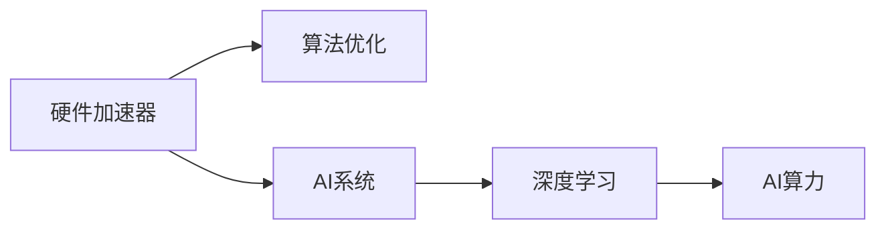
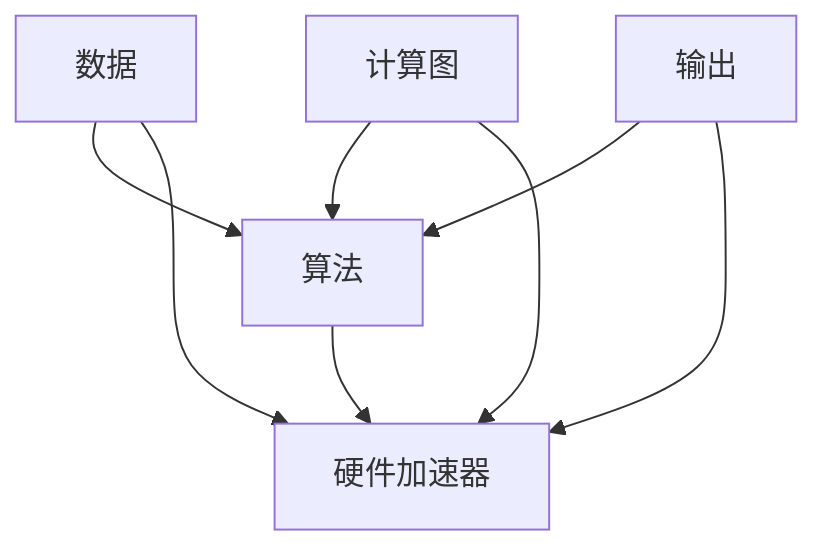

                 

## 1. 背景介绍

### 1.1 问题由来

近年来，随着人工智能（AI）技术的快速发展和广泛应用，硬件和算法之间的协同设计成为推动AI系统性能提升的重要方向。尤其是深度学习（Deep Learning）算法，其对计算资源的需求急剧增加，使得硬件和算法之间的协同设计更加关键。硬件提供了必要的计算能力，算法则利用这些能力进行数据处理和模型训练，二者之间的协同设计可以显著提升AI系统的性能和效率。

在AI系统的发展历程中，硬件和算法的协同设计始终是一个热门话题。早期的计算机需要手动调整电路以适应不同的算法需求，效率低下且成本高昂。随着半导体技术的发展，硬件加速器如GPU、FPGA和ASIC等成为AI算法的重要支撑，进一步提升了AI系统的计算能力。同时，AI算法也不断演进，从传统的神经网络到更复杂的深度学习模型，如卷积神经网络（CNN）、循环神经网络（RNN）、注意力机制等，这些算法的复杂度和技术难度都在不断提升，对硬件的要求也越来越高。

因此，硬件和算法的协同设计成为AI系统优化的关键所在。在硬件加速器的支持下，算法可以在更短的时间内训练和推理，同时也需要针对不同硬件架构设计更高效的算法。本文将从硬件和算法的协同设计出发，探讨其在AI系统中的重要性以及未来的发展方向。

### 1.2 问题核心关键点

硬件和算法的协同设计涉及多个方面，包括：

- 硬件架构与算法优化：如何设计硬件架构以适应不同的算法需求？
- 算法模型与硬件适配：如何优化算法模型以适应特定硬件加速器？
- 性能与效率平衡：如何在性能和效率之间找到最佳平衡点？
- 可扩展性与成本控制：如何在可扩展性与成本控制之间找到最佳平衡点？

这些关键点决定了AI系统的性能、效率和可扩展性，是硬件和算法协同设计的核心所在。本文将围绕这些关键点进行详细探讨。

## 2. 核心概念与联系

### 2.1 核心概念概述

在探讨硬件与算法协同设计之前，我们首先需要了解以下几个核心概念：

- **硬件加速器（Hardware Accelerator）**：指专门用于加速计算任务的硬件设备，如GPU、FPGA、ASIC等。硬件加速器提供了更高的计算性能和并行处理能力，显著提升了AI算法的训练和推理效率。

- **算法优化（Algorithm Optimization）**：指通过算法改进提升AI系统性能的过程。算法优化包括模型精简、计算图优化、并行计算优化等。

- **AI系统（AI System）**：由硬件和软件组成，通过算法实现特定功能的AI应用。AI系统包括从数据输入、模型训练、推理输出等各个环节。

- **深度学习（Deep Learning）**：一种基于神经网络的机器学习技术，通过多层神经网络实现复杂模式识别和预测任务。深度学习算法需要大量的计算资源，是硬件和算法协同设计的典型应用场景。

- **AI算力（AI Computational Power）**：指AI系统所需的计算资源。AI算力包括训练和推理所需的计算资源，通常由GPU、TPU等硬件加速器提供。

这些核心概念构成了硬件与算法协同设计的基础，下面我们将通过一个简单的流程图来展示它们之间的联系：



### 2.2 核心概念原理和架构的 Mermaid 流程图

在深入探讨算法原理之前，我们首先需要明确硬件与算法协同设计的核心原理和架构。以下是一个简单的Mermaid流程图，展示了硬件加速器与算法优化之间的关系：



这个流程图展示了算法如何通过硬件加速器进行计算，从输入数据到最终输出的全过程。硬件加速器负责加速算法中的计算密集型部分，而算法则负责数据的处理和模型的推理。

## 3. 核心算法原理 & 具体操作步骤

### 3.1 算法原理概述

硬件与算法协同设计的核心在于如何设计硬件架构以适应不同的算法需求，并在性能和效率之间找到最佳平衡点。以下是一些常用的算法原理：

- **卷积神经网络（CNN）**：主要用于图像和视频处理，通过卷积层、池化层等结构实现特征提取和分类。在硬件加速器中，可以使用专门针对CNN设计的GPU或ASIC来加速计算。

- **循环神经网络（RNN）**：主要用于序列数据处理，如语音识别、自然语言处理等。在硬件加速器中，可以使用FPGA或TPU等设备来实现RNN的并行计算。

- **注意力机制（Attention）**：主要用于处理长序列数据，如机器翻译、阅读理解等。在硬件加速器中，可以使用硬件实现注意力机制的矩阵乘法运算，提升计算效率。

- **深度学习模型压缩**：通过减少模型参数、优化计算图、剪枝等方法来降低模型的计算需求，提升模型推理速度。

### 3.2 算法步骤详解

以下是硬件与算法协同设计的主要步骤：

1. **需求分析**：分析AI系统的应用场景和性能要求，确定硬件加速器的需求和算法优化的方向。

2. **硬件选择**：根据需求选择合适的硬件加速器，如GPU、FPGA、ASIC等。

3. **算法优化**：根据硬件加速器的特点，对算法模型进行优化，如模型精简、计算图优化、并行计算优化等。

4. **模型训练与验证**：在选定的硬件上训练和验证优化后的模型，确保其性能和精度。

5. **部署与应用**：将训练好的模型部署到生产环境中，进行实际应用和性能监控。

6. **持续优化**：根据实际应用情况，持续优化硬件配置和算法模型，提升AI系统的性能和效率。

### 3.3 算法优缺点

硬件与算法协同设计的优点包括：

- **提升性能**：通过硬件加速器，算法可以在更短的时间内训练和推理，提升AI系统的性能。
- **降低成本**：硬件加速器可以重复利用，降低单次计算成本。
- **提高可扩展性**：硬件加速器具有较好的可扩展性，可以根据需求动态调整算力。

然而，硬件与算法协同设计也存在一些缺点：

- **开发复杂度**：硬件与算法协同设计需要考虑多方面的因素，开发复杂度较高。
- **兼容性问题**：不同硬件加速器可能存在兼容性问题，需要额外的适配工作。
- **灵活性不足**：硬件加速器的设计和选择可能在一定程度上限制算法的灵活性。

### 3.4 算法应用领域

硬件与算法协同设计在多个领域中得到了广泛应用，包括但不限于：

- **图像处理**：如人脸识别、图像分类、目标检测等。硬件加速器如GPU、TPU等可以加速CNN模型的训练和推理。
- **语音识别**：如语音转文本、语音识别等。硬件加速器如FPGA、ASIC等可以加速RNN模型的训练和推理。
- **自然语言处理（NLP）**：如机器翻译、文本分类、情感分析等。硬件加速器如GPU、TPU等可以加速注意力机制的计算。
- **自动驾驶**：如目标检测、路径规划等。硬件加速器如FPGA、ASIC等可以加速深度学习模型的训练和推理。
- **医疗影像**：如医学图像分析、病理诊断等。硬件加速器如GPU、TPU等可以加速卷积神经网络的训练和推理。

## 4. 数学模型和公式 & 详细讲解 & 举例说明

### 4.1 数学模型构建

在硬件与算法协同设计中，我们需要构建一个数学模型来描述硬件加速器和算法之间的关系。以下是一个简单的数学模型：

- **输入数据**：$x$
- **算法模型**：$y=f(x)$
- **硬件加速器**：$z=h(y)$
- **输出结果**：$z$

其中，$x$为输入数据，$y$为算法模型处理后的结果，$z$为硬件加速器处理后的输出结果。

### 4.2 公式推导过程

在上述数学模型中，我们可以进一步推导出硬件加速器和算法之间的关系：

$$
z = h(y) = h(f(x))
$$

其中，$h$为硬件加速器的计算函数，$f$为算法模型的计算函数。

以卷积神经网络为例，我们可以推导出CNN在GPU上的计算公式：

$$
z = h(y) = \sum_{i,j} w_{ij} y_{i,j}
$$

其中，$w_{ij}$为卷积核，$y_{i,j}$为卷积层输出。

### 4.3 案例分析与讲解

以图像分类为例，我们可以分析硬件与算法协同设计在图像分类任务中的应用：

- **硬件选择**：选择GPU作为硬件加速器。
- **算法优化**：对CNN模型进行优化，减少卷积核大小、增加并行计算等。
- **模型训练与验证**：在GPU上训练和验证优化后的CNN模型。
- **部署与应用**：将训练好的模型部署到生产环境中，进行实际应用和性能监控。

## 5. 项目实践：代码实例和详细解释说明

### 5.1 开发环境搭建

在进行硬件与算法协同设计实践之前，我们需要准备好开发环境。以下是使用Python进行TensorFlow开发的环境配置流程：

1. 安装Anaconda：从官网下载并安装Anaconda，用于创建独立的Python环境。

2. 创建并激活虚拟环境：
```bash
conda create -n tf-env python=3.8 
conda activate tf-env
```

3. 安装TensorFlow：根据CUDA版本，从官网获取对应的安装命令。例如：
```bash
conda install tensorflow tensorflow-gpu -c conda-forge
```

4. 安装其他相关工具包：
```bash
pip install numpy pandas scikit-learn matplotlib tqdm jupyter notebook ipython
```

完成上述步骤后，即可在`tf-env`环境中开始硬件与算法协同设计实践。

### 5.2 源代码详细实现

以下是一个使用TensorFlow进行图像分类任务硬件与算法协同设计的PyTorch代码实现。

首先，定义图像分类任务的数据处理函数：

```python
import tensorflow as tf
from tensorflow.keras.datasets import cifar10
from tensorflow.keras.preprocessing.image import ImageDataGenerator

def load_data():
    (x_train, y_train), (x_test, y_test) = cifar10.load_data()
    x_train = x_train / 255.0
    x_test = x_test / 255.0
    return x_train, y_train, x_test, y_test

def data_generator(x, y, batch_size=32):
    datagen = ImageDataGenerator(rescale=1./255)
    train_gen = datagen.flow(x, y, batch_size=batch_size)
    test_gen = datagen.flow(x, y, batch_size=batch_size)
    return train_gen, test_gen
```

然后，定义模型和优化器：

```python
from tensorflow.keras import layers, models

def build_model(input_shape):
    x = layers.Conv2D(32, (3, 3), activation='relu', padding='same', input_shape=input_shape)(x)
    x = layers.MaxPooling2D((2, 2))(x)
    x = layers.Conv2D(64, (3, 3), activation='relu', padding='same')(x)
    x = layers.MaxPooling2D((2, 2))(x)
    x = layers.Flatten()(x)
    x = layers.Dense(64, activation='relu')(x)
    output = layers.Dense(10, activation='softmax')(x)
    model = models.Model(inputs=x, outputs=output)
    return model

def compile_model(model):
    model.compile(optimizer=tf.keras.optimizers.Adam(learning_rate=0.001),
                  loss=tf.keras.losses.SparseCategoricalCrossentropy(from_logits=True),
                  metrics=[tf.keras.metrics.SparseCategoricalAccuracy()])

def train_model(model, train_gen, test_gen, epochs=10):
    model.fit(train_gen,
              epochs=epochs,
              steps_per_epoch=train_gen.samples // train_gen.batch_size,
              validation_data=test_gen,
              validation_steps=test_gen.samples // test_gen.batch_size)
    model.save('model.h5')

x_train, y_train, x_test, y_test = load_data()
input_shape = x_train.shape[1:]
model = build_model(input_shape)
compile_model(model)
train_model(model, train_gen(x_train, y_train), test_gen(x_test, y_test))
```

最后，输出训练后的模型性能：

```python
x_test, y_test = load_data()[2:]
x_test = x_test / 255.0
test_gen = data_generator(x_test, y_test)
model.load_weights('model.h5')
test_loss, test_acc = model.evaluate(test_gen, verbose=2)
print('Test accuracy:', test_acc)
```

### 5.3 代码解读与分析

让我们再详细解读一下关键代码的实现细节：

**load_data函数**：
- 加载CIFAR-10数据集，并对输入数据进行归一化处理。

**data_generator函数**：
- 定义数据生成器，用于将图像数据和标签按批次输入模型。

**build_model函数**：
- 定义卷积神经网络模型，包括卷积层、池化层、全连接层等。

**compile_model函数**：
- 编译模型，设置优化器、损失函数和评估指标。

**train_model函数**：
- 训练模型，指定训练和验证数据生成器，并设置训练轮数。

**test_model函数**：
- 测试模型，加载测试数据生成器，并计算模型精度。

以上代码展示了如何使用TensorFlow进行卷积神经网络的训练和测试，通过硬件加速器（如GPU）提升计算效率，同时优化算法模型（如卷积神经网络）以适应硬件加速器的特点。

## 6. 实际应用场景

### 6.1 智能制造

智能制造领域需要处理大量实时数据，如传感器数据、生产设备状态等。硬件与算法协同设计可以帮助智能制造系统实时分析和处理数据，提高生产效率和质量。

例如，可以使用GPU加速深度学习模型对传感器数据进行实时处理和分析，预测设备故障和维护需求。同时，可以根据设备状态和运行数据，优化生产计划和资源分配。通过硬件与算法的协同设计，智能制造系统可以实现更高效、更可靠的生产运营。

### 6.2 智能医疗

智能医疗领域需要处理大量的医学影像和患者数据，如CT扫描、MRI、电子病历等。硬件与算法协同设计可以帮助智能医疗系统实现快速、准确的诊断和治疗。

例如，可以使用GPU加速深度学习模型对医学影像进行实时分析，辅助医生进行病灶检测、诊断和手术规划。同时，可以根据患者的电子病历和基因数据，制定个性化的治疗方案。通过硬件与算法的协同设计，智能医疗系统可以实现更精准、更个性化的医疗服务。

### 6.3 自动驾驶

自动驾驶领域需要处理大量的实时数据，如传感器数据、地图数据、交通数据等。硬件与算法协同设计可以帮助自动驾驶系统实时分析和处理数据，提高行驶安全性和舒适度。

例如，可以使用GPU加速深度学习模型对传感器数据进行实时处理和分析，辅助自动驾驶系统进行路径规划和决策。同时，可以根据道路条件和交通情况，优化行驶策略和驾驶行为。通过硬件与算法的协同设计，自动驾驶系统可以实现更智能、更安全的驾驶体验。

### 6.4 未来应用展望

随着硬件与算法协同设计的不断发展，未来的应用场景将更加广泛和深入，以下是一些未来的应用方向：

- **边缘计算**：将深度学习模型部署在边缘设备上，实现本地推理和实时分析，减少网络延迟和带宽消耗。
- **联邦学习**：通过分布式计算和模型优化，实现多设备协同训练和推理，提升模型的泛化能力和安全性。
- **量子计算**：将深度学习模型与量子计算相结合，提升计算能力和处理速度，解决复杂计算问题。
- **自适应算法**：根据设备性能和环境条件，动态调整算法参数和计算资源，实现更高效、更灵活的计算。
- **跨模态计算**：将深度学习模型与多模态数据结合，实现图像、语音、文本等多种数据的协同处理和分析。

## 7. 工具和资源推荐

### 7.1 学习资源推荐

为了帮助开发者系统掌握硬件与算法协同设计的基本概念和实践技巧，这里推荐一些优质的学习资源：

1. **深度学习与AI硬件加速器**：该书详细介绍了深度学习在GPU、FPGA、ASIC等硬件加速器上的应用，涵盖模型训练、推理、优化等各方面内容。

2. **TensorFlow官方文档**：提供了TensorFlow的全面使用指南和API文档，是学习TensorFlow的最佳资源之一。

3. **Keras官方文档**：提供了Keras的全面使用指南和API文档，是学习Keras的最佳资源之一。

4. **Coursera深度学习课程**：斯坦福大学和DeepLearning.ai等机构开设的深度学习课程，覆盖深度学习的基本概念和实践技巧。

5. **GPU加速器技术**：介绍了GPU加速器的基本原理和应用场景，涵盖了GPU编程、优化等技术细节。

通过对这些资源的学习实践，相信你一定能够快速掌握硬件与算法协同设计的基本概念和实践技巧，并用于解决实际的AI问题。

### 7.2 开发工具推荐

高效的开发离不开优秀的工具支持。以下是几款用于硬件与算法协同设计开发的常用工具：

1. **TensorFlow**：由Google主导开发的深度学习框架，支持多种硬件加速器，适合大规模工程应用。

2. **Keras**：基于TensorFlow等深度学习框架，提供简单易用的API接口，适合快速原型开发。

3. **PyTorch**：由Facebook主导开发的深度学习框架，灵活性强，支持动态计算图，适合快速迭代研究。

4. **CUDA**：由NVIDIA开发的GPU编程工具，支持GPU加速器的编程和优化。

5. **CUDA Toolkit**：CUDA工具包，提供了丰富的API和示例代码，方便开发者进行GPU编程和优化。

合理利用这些工具，可以显著提升硬件与算法协同设计的开发效率，加快创新迭代的步伐。

### 7.3 相关论文推荐

硬件与算法协同设计的研究源于学界的持续研究。以下是几篇奠基性的相关论文，推荐阅读：

1. **《TensorFlow: A System for Large-Scale Machine Learning》**：介绍了TensorFlow的基本架构和应用场景，是了解深度学习框架的必备论文。

2. **《GPU Computing Gems 3: Optimizing GPU Code for Performance》**：详细介绍了GPU加速器的编程和优化技巧，是GPU编程的必备指南。

3. **《Training Deep Neural Networks on GPU using CUDA》**：介绍了使用CUDA进行深度学习模型训练和推理的技巧，是GPU加速器的经典案例。

4. **《FPGA-Accelerated Convolutional Neural Networks》**：介绍了使用FPGA加速卷积神经网络的方法，是FPGA加速器的经典案例。

5. **《ASIC-Based Neural Networks for Classification》**：介绍了使用ASIC加速神经网络的方法，是ASIC加速器的经典案例。

这些论文代表了大规模硬件与算法协同设计的发展脉络。通过学习这些前沿成果，可以帮助研究者把握学科前进方向，激发更多的创新灵感。

## 8. 总结：未来发展趋势与挑战

### 8.1 总结

本文对硬件与算法协同设计进行了全面系统的介绍。首先阐述了硬件与算法协同设计的重要性及其在AI系统中的作用，明确了硬件加速器和算法优化在提升AI系统性能和效率方面的关键作用。其次，从原理到实践，详细讲解了硬件与算法协同设计的核心算法、具体操作步骤和实现细节。最后，本文探讨了硬件与算法协同设计在多个领域的应用场景，并展望了其未来的发展方向。

通过本文的系统梳理，可以看到，硬件与算法协同设计已经成为推动AI系统性能提升的关键手段，其重要性不容忽视。随着硬件加速器和算法模型的不断进步，未来的AI系统将具备更强大的计算能力和更高效的算法性能，实现更广泛的应用和更深入的发展。

### 8.2 未来发展趋势

展望未来，硬件与算法协同设计将呈现以下几个发展趋势：

1. **硬件加速器多样化**：未来的硬件加速器将更加多样化，除了GPU、FPGA、ASIC等，还可能出现量子计算、光子计算等新型硬件。

2. **算法模型多样化**：未来的算法模型将更加多样化，除了深度学习模型，还可能出现符号计算、量子计算等新型算法。

3. **可扩展性和成本控制**：未来的AI系统将更加注重可扩展性和成本控制，通过硬件和算法的协同设计，实现更高效、更经济的计算资源配置。

4. **安全性与可靠性**：未来的AI系统将更加注重安全性与可靠性，通过硬件与算法协同设计，实现更稳定、更安全的计算环境。

5. **跨模态数据融合**：未来的AI系统将更加注重跨模态数据的融合，通过硬件与算法协同设计，实现图像、语音、文本等多种数据的协同处理和分析。

6. **联邦学习与边缘计算**：未来的AI系统将更加注重联邦学习和边缘计算，通过分布式计算和本地推理，实现更高效、更灵活的计算。

以上趋势凸显了硬件与算法协同设计的广阔前景。这些方向的探索发展，必将进一步提升AI系统的性能和效率，为人工智能技术的发展带来新的突破。

### 8.3 面临的挑战

尽管硬件与算法协同设计已经取得了瞩目成就，但在迈向更加智能化、普适化应用的过程中，它仍面临着诸多挑战：

1. **开发复杂度**：硬件与算法协同设计需要考虑多方面的因素，开发复杂度较高，特别是在新硬件和算法模型的适配上。

2. **兼容性问题**：不同硬件加速器和算法模型可能存在兼容性问题，需要额外的适配工作。

3. **资源消耗**：硬件加速器的高计算能力可能带来高资源消耗，需要在性能和资源消耗之间找到最佳平衡点。

4. **安全性与隐私保护**：硬件与算法协同设计需要在保证计算安全性的同时，保护数据的隐私和安全性。

5. **伦理道德**：硬件与算法协同设计需要考虑伦理道德问题，避免有偏见、有害的输出，确保系统的公平性和公正性。

6. **跨学科挑战**：硬件与算法协同设计涉及多个学科领域，需要在硬件、算法、数学等多个领域进行协同合作。

这些挑战需要开发者在实际应用中不断探索和优化，以实现更高效、更安全的计算环境。

### 8.4 研究展望

面对硬件与算法协同设计所面临的挑战，未来的研究需要在以下几个方面寻求新的突破：

1. **硬件加速器优化**：通过优化硬件加速器的设计和使用，提升其计算能力和能效比。

2. **算法模型优化**：通过优化算法模型的设计和使用，提升其计算效率和泛化能力。

3. **跨模态数据融合**：通过硬件与算法协同设计，实现跨模态数据的融合和协同分析。

4. **分布式计算优化**：通过硬件与算法协同设计，优化分布式计算环境，提升计算效率和系统可靠性。

5. **联邦学习与边缘计算**：通过硬件与算法协同设计，优化联邦学习和边缘计算，实现更高效、更灵活的计算。

6. **伦理道德约束**：通过硬件与算法协同设计，引入伦理道德约束，确保系统的公平性、公正性和安全性。

这些研究方向将推动硬件与算法协同设计向更深层次、更广领域发展，为构建智能、安全、可信的AI系统提供新的方法和手段。

## 9. 附录：常见问题与解答

**Q1：硬件加速器如何选择？**

A: 选择硬件加速器需要考虑多个因素，包括计算能力、能效比、编程难度等。一般而言，GPU适合通用计算和深度学习，FPGA适合自定义计算和低延迟应用，ASIC适合特定计算场景。根据具体需求选择合适的硬件加速器是关键。

**Q2：如何优化算法模型？**

A: 优化算法模型可以从以下几个方面入手：模型精简、计算图优化、并行计算优化、参数剪枝等。以深度学习模型为例，可以通过减少卷积核大小、增加并行计算等方法提升模型计算效率，同时通过剪枝等方法减少模型参数量，提升模型推理速度。

**Q3：硬件与算法协同设计面临哪些挑战？**

A: 硬件与算法协同设计面临的挑战包括开发复杂度、兼容性问题、资源消耗、安全性与隐私保护、伦理道德等。合理解决这些挑战是实现硬件与算法协同设计的关键。

**Q4：未来硬件与算法协同设计的发展方向是什么？**

A: 未来硬件与算法协同设计的发展方向包括硬件加速器多样化、算法模型多样化、可扩展性和成本控制、安全性与可靠性、跨模态数据融合、联邦学习与边缘计算等。这些方向将推动硬件与算法协同设计向更深层次、更广领域发展。

**Q5：硬件与算法协同设计的核心是什么？**

A: 硬件与算法协同设计的核心在于设计合适的硬件架构以适应不同的算法需求，并在性能和效率之间找到最佳平衡点。通过硬件加速器和算法优化的协同设计，实现更高效、更经济的计算资源配置。

以上问题与解答展示了硬件与算法协同设计的核心问题和解决方法，希望这些信息对读者有所帮助。

