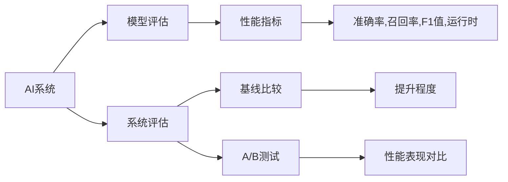

                 

# AI系统性能评估的实战方法

## 1. 背景介绍

随着人工智能(AI)技术的迅猛发展，各类AI系统在金融、医疗、智能制造等垂直行业中的应用日益广泛。但与软件和传统系统不同，AI系统复杂度高，涉及的算法、模型、数据、工程架构等多个环节，使得性能评估和优化成为一项系统性挑战。

本文聚焦于AI系统性能评估的实战方法，旨在帮助开发者和架构师构建、优化并评估AI系统，从而提升其在实际应用中的表现。通过系统梳理AI系统性能评估的流程、工具和实践，本文希望能为读者提供一套高效、系统、可靠的性能评估方法，助力AI技术的规模化落地。

## 2. 核心概念与联系

### 2.1 核心概念概述

为更好地理解AI系统性能评估，本节将介绍几个核心概念及其相互联系：

- **AI系统性能评估(AI System Performance Evaluation)**：对AI系统在不同场景下的表现进行量化和定性分析，以衡量其效率、准确性、鲁棒性等指标。

- **AI系统**：指基于机器学习、深度学习等算法开发的各类智能系统，包括推荐系统、聊天机器人、自动驾驶、自然语言处理(NLP)等。

- **性能指标**：用于衡量AI系统性能的关键量化指标，如准确率、召回率、F1值、运行时等。

- **模型评估**：基于验证集和测试集对模型性能进行评估，以选择最优模型。

- **系统评估**：在真实应用场景中，对AI系统的整体表现进行评估，以确保满足业务需求。

- **基线比较**：通过与基线系统的性能对比，衡量AI系统的提升程度。

- **A/B测试**：通过多组并行实验，对比不同系统或模型的性能表现。

以上概念相互联系，共同构成了AI系统性能评估的核心框架。通过系统地构建和评估这些概念，可以全面衡量AI系统的性能，为优化提供可靠依据。

### 2.2 核心概念原理和架构的 Mermaid 流程图



这个流程图展示了AI系统性能评估的基本流程和关键组件：

1. **AI系统**：作为评估对象，接受模型评估和系统评估。
2. **模型评估**：基于验证集和测试集，衡量模型的性能。
3. **系统评估**：在实际应用中，衡量系统的整体表现。
4. **性能指标**：用于量化模型和系统的表现，包括准确率、召回率、F1值、运行时等。
5. **基线比较**：通过与基线系统对比，评估AI系统的提升程度。
6. **A/B测试**：对比不同系统或模型的性能表现，选择最优解。

这些概念和组件相互关联，共同支撑AI系统性能评估的全面性和可靠性。

## 3. 核心算法原理 & 具体操作步骤
### 3.1 算法原理概述

AI系统性能评估的核心在于通过科学合理的评估方法，量化模型和系统的表现，识别性能瓶颈和优化方向。常用的评估方法包括模型评估和系统评估两种：

- **模型评估**：在验证集和测试集上，使用交叉熵、准确率、召回率、F1值等指标，评估模型的泛化能力和准确性。
- **系统评估**：在真实应用场景中，通过运行时、用户体验、业务价值等指标，评估系统的实际表现和业务价值。

### 3.2 算法步骤详解

基于上述原理，AI系统性能评估的具体操作步骤包括：

**Step 1: 数据准备**
- 收集标注数据和测试数据集。
- 划分训练集、验证集和测试集。
- 准备基线系统数据和A/B测试数据。

**Step 2: 模型训练与评估**
- 使用训练集对模型进行训练。
- 在验证集上评估模型性能，调整超参数。
- 在测试集上最终评估模型，选择最优模型。

**Step 3: 系统部署与评估**
- 将模型部署到生产环境。
- 在实际应用中收集系统性能数据。
- 通过A/B测试对比不同系统的表现。

**Step 4: 数据监控与优化**
- 持续监控系统性能指标。
- 根据监控数据进行系统优化。
- 定期更新训练数据和模型。

**Step 5: 评估报告撰写**
- 总结评估结果。
- 撰写详细的性能评估报告。
- 提出改进建议和优化方向。

### 3.3 算法优缺点

AI系统性能评估具有以下优点：
1. 全面性：通过模型评估和系统评估，可以全面衡量AI系统的性能。
2. 科学性：使用量化指标，避免主观判断，评估结果具有科学性。
3. 可比性：通过基线比较和A/B测试，可以明确评估系统的提升程度。
4. 及时性：通过实时监控和持续优化，确保系统性能稳定可靠。

同时，该方法也存在一些局限性：
1. 数据依赖：评估结果高度依赖标注数据和测试数据的质量和数量。
2. 复杂度：系统评估涉及多维度的性能指标，评估过程复杂。
3. 基线选择：基线系统的选择可能影响评估结果的准确性。
4. 环境差异：评估结果可能受环境差异影响，无法完全反映实际应用表现。
5. 模型泛化：模型泛化能力有限，评估结果可能与实际应用场景不符。

尽管存在这些局限性，但AI系统性能评估仍是当前最主流和有效的方法，可以帮助开发者和架构师系统化地优化AI系统，提升其在实际应用中的表现。

### 3.4 算法应用领域

AI系统性能评估的应用领域非常广泛，包括但不限于：

- **推荐系统**：通过点击率、转化率等指标，评估推荐模型的效果。
- **自然语言处理(NLP)**：通过BLEU、ROUGE等指标，评估文本生成、机器翻译等任务的表现。
- **图像识别**：通过分类准确率、检测率等指标，评估图像识别系统的性能。
- **智能客服**：通过用户满意度、响应时间等指标，评估聊天机器人的表现。
- **自动驾驶**：通过行驶距离、事故率等指标，评估自动驾驶系统的安全性。

这些领域的AI系统性能评估，不仅帮助开发者优化模型，还助力企业构建可靠、高效的AI系统，推动AI技术的广泛应用。

## 4. 数学模型和公式 & 详细讲解 & 举例说明
### 4.1 数学模型构建

AI系统性能评估涉及多个数学模型和公式，其中最关键的是模型的训练和评估公式。这里以推荐系统为例，构建模型评估的基本框架：

- **损失函数**：用于衡量模型预测值与真实标签的差异，常见形式包括交叉熵损失、均方误差损失等。
- **模型评估指标**：如准确率、召回率、F1值、平均绝对误差(MAE)、均方根误差(RMSE)等，用于量化模型的表现。

**推荐系统模型评估数学模型**：

$$
L(\theta) = \frac{1}{N}\sum_{i=1}^N L(x_i, y_i, \hat{y}_i)
$$

其中 $L(x_i, y_i, \hat{y}_i)$ 为损失函数，$\theta$ 为模型参数。

**推荐系统模型评估指标**：

- **准确率**：正确预测样本数占总样本数的比例。
- **召回率**：被正确预测为正样本的样本数占真实正样本数的比例。
- **F1值**：综合考虑准确率和召回率的指标。
- **MAE**：预测值与真实值差的绝对值之和的均值。
- **RMSE**：预测值与真实值差的平方和的均值的平方根。

### 4.2 公式推导过程

以推荐系统为例，推荐模型的目标函数为：

$$
\min_{\theta} \frac{1}{N}\sum_{i=1}^N L(x_i, y_i, \hat{y}_i) + \lambda R(\theta)
$$

其中 $R(\theta)$ 为正则化项，用于避免模型过拟合。

通过梯度下降等优化算法，可以求解上述优化问题，得到模型参数 $\theta$。常用的优化算法包括随机梯度下降(SGD)、Adam、Adagrad等。

### 4.3 案例分析与讲解

以一个简单的线性回归模型为例，进行性能评估的公式推导和应用讲解：

假设模型 $y = \theta_0 + \theta_1 x$，输入 $x$ 与真实标签 $y$ 之间的误差为 $e = y - \hat{y}$，则损失函数为：

$$
L(e) = \frac{1}{2}\sum_{i=1}^N e_i^2
$$

根据梯度下降算法，损失函数的梯度为：

$$
\nabla_{\theta} L(e) = \nabla_{\theta} \frac{1}{2}\sum_{i=1}^N (y_i - \theta_0 - \theta_1 x_i)^2
$$

根据以上公式，可以逐步更新模型参数 $\theta_0$ 和 $\theta_1$，最小化预测误差。

## 5. 项目实践：代码实例和详细解释说明
### 5.1 开发环境搭建

在进行AI系统性能评估的实践前，需要准备好开发环境。以下是使用Python进行TensorFlow和Keras开发的常见环境配置流程：

1. 安装Anaconda：从官网下载并安装Anaconda，用于创建独立的Python环境。

2. 创建并激活虚拟环境：
```bash
conda create -n tf-env python=3.8 
conda activate tf-env
```

3. 安装TensorFlow和Keras：
```bash
pip install tensorflow==2.4.1 keras==2.4.3
```

4. 安装各类工具包：
```bash
pip install numpy pandas scikit-learn matplotlib tqdm jupyter notebook ipython
```

完成上述步骤后，即可在`tf-env`环境中开始性能评估实践。

### 5.2 源代码详细实现

以下是一个简单的推荐系统性能评估示例代码：

```python
import numpy as np
from tensorflow.keras.models import Sequential
from tensorflow.keras.layers import Dense
from tensorflow.keras.optimizers import Adam
from sklearn.metrics import mean_squared_error, mean_absolute_error, r2_score

# 创建模型
model = Sequential()
model.add(Dense(1, input_dim=1, activation='linear'))
model.compile(optimizer=Adam(learning_rate=0.01), loss='mse', metrics=['mse', 'mae', 'r2'])
model.summary()

# 训练模型
X_train = np.random.rand(100, 1)
y_train = 0.5 * X_train + np.random.rand(100, 1)
model.fit(X_train, y_train, epochs=100, batch_size=10, verbose=0)

# 评估模型
X_test = np.random.rand(50, 1)
y_test = 0.5 * X_test + np.random.rand(50, 1)
y_pred = model.predict(X_test)
print('MAE:', mean_absolute_error(y_test, y_pred))
print('RMSE:', np.sqrt(mean_squared_error(y_test, y_pred)))
print('R2 Score:', r2_score(y_test, y_pred))
```

### 5.3 代码解读与分析

让我们再详细解读一下关键代码的实现细节：

**模型定义**：
- 使用Keras框架定义一个简单的线性回归模型，包含一个线性输出层。
- 使用Adam优化器和均方误差损失函数进行训练。

**数据准备**：
- 使用随机数生成训练集和测试集，确保样本分布一致。
- 使用均值回归方法生成真实标签。

**模型训练**：
- 使用训练集对模型进行100轮迭代训练。
- 每次迭代使用10个样本进行批处理训练。

**模型评估**：
- 使用测试集对模型进行性能评估。
- 计算均绝对误差(MAE)、均方根误差(RMSE)和R2得分。
- 打印评估结果。

以上代码展示了如何使用TensorFlow和Keras进行推荐系统的性能评估，从数据准备、模型训练到模型评估，每一步都有详细的解释和说明。

## 6. 实际应用场景
### 6.1 智能客服系统

智能客服系统通过AI系统性能评估，可以不断优化聊天机器人，提升用户体验和问题解决效率。

具体实现上，可以使用收集到的用户咨询历史数据，构建标注数据集，训练和评估聊天机器人模型。通过性能评估，可以识别出模型的强项和弱点，并进行针对性优化。例如，对于客户提出的常见问题，优化模型输出更准确的回答；对于处理复杂问题时，提供更灵活的上下文理解和错误处理机制。

### 6.2 金融舆情监测

金融舆情监测系统通过AI系统性能评估，可以快速识别市场舆情的变化趋势，预警潜在的风险。

在实际应用中，可以使用历史新闻、社交媒体评论等文本数据，训练和评估舆情分析模型。通过性能评估，可以实时监控舆情变化，及时响应负面舆情，保护金融机构免受舆情冲击。

### 6.3 个性化推荐系统

个性化推荐系统通过AI系统性能评估，可以不断优化推荐算法，提升用户满意度。

在实际应用中，可以使用用户行为数据和物品特征数据，训练和评估推荐模型。通过性能评估，可以不断优化推荐算法，提升推荐的相关性和多样性，使用户获得更满意的内容推荐。

### 6.4 未来应用展望

伴随AI技术的不断进步，AI系统性能评估将在更多领域得到应用，为各行各业带来变革性影响：

- **智慧医疗**：通过AI系统性能评估，优化医疗诊断系统，提高疾病诊断的准确率和效率。
- **智能教育**：通过AI系统性能评估，优化智能教育系统，提升个性化教育效果。
- **智慧城市**：通过AI系统性能评估，优化智慧城市治理，提升城市管理和公共服务水平。
- **智能制造**：通过AI系统性能评估，优化生产过程，提升制造业的自动化和智能化水平。

未来，AI系统性能评估将广泛应用于各类垂直行业，为各行各业提供高效、可靠的AI技术支持，推动社会数字化转型。

## 7. 工具和资源推荐
### 7.1 学习资源推荐

为了帮助开发者系统掌握AI系统性能评估的理论基础和实践技巧，这里推荐一些优质的学习资源：

1. **《深度学习》课程**：斯坦福大学开设的深度学习经典课程，全面讲解深度学习的基础知识和应用，包括性能评估方法。

2. **《机器学习实战》书籍**：详细介绍了机器学习算法的实现和评估方法，涵盖多种评估指标和技巧。

3. **Kaggle平台**：全球最大的数据科学竞赛平台，提供了大量基于AI性能评估的项目和案例，供开发者学习和实践。

4. **TensorFlow官方文档**：TensorFlow的官方文档，详细介绍了如何使用TensorFlow进行模型训练和评估，包括常用的性能评估指标。

5. **Kaggle Kernels**：Kaggle上的代码示例和数据分析竞赛，可以学习到多种AI系统性能评估的实践技巧。

通过这些学习资源，可以全面了解AI系统性能评估的理论和实践，为实际应用提供坚实基础。

### 7.2 开发工具推荐

高效的开发离不开优秀的工具支持。以下是几款用于AI系统性能评估开发的常用工具：

1. **TensorFlow**：由Google主导开发的深度学习框架，功能强大，适合大规模深度学习模型的训练和评估。

2. **Keras**：基于TensorFlow的高级API，提供了简单易用的模型定义和评估功能。

3. **Jupyter Notebook**：支持Python代码的在线编写和执行，方便快速迭代和测试。

4. **TensorBoard**：TensorFlow配套的可视化工具，可实时监控模型训练状态，提供丰富的图表展示。

5. **Weights & Biases**：模型训练的实验跟踪工具，记录和可视化模型训练过程中的各项指标，方便对比和调优。

6. **PyTorch**：由Facebook开发的深度学习框架，适合动态图模型和模型微调。

合理利用这些工具，可以显著提升AI系统性能评估的开发效率，加快创新迭代的步伐。

### 7.3 相关论文推荐

AI系统性能评估的研究始于学界的持续研究。以下是几篇奠基性的相关论文，推荐阅读：

1. **"Deep Learning" by Ian Goodfellow, Yoshua Bengio, Aaron Courville**：全面介绍深度学习的基本概念和算法，包括模型评估和性能优化方法。

2. **"Evaluation Metrics for Deep Learning" by David E. Rumelhart, Geoffrey E. Hinton, Ronald J. Williams**：系统介绍深度学习模型评估的常用指标和评估方法。

3. **"Performance Evaluation of Machine Learning Models" by Pedro Domingos**：详细讨论了机器学习模型评估的理论和方法，包括模型选择、性能对比等。

4. **"Evaluation of Recommendation Algorithms" by Yangqing Jia, Chunyuan Li**：介绍推荐系统性能评估的常用方法和指标，如召回率、点击率等。

5. **"Cross-Platform and Cross-Domain Evaluation of Chatbots" by Lei Sun, Bin Luo**：讨论了智能客服系统性能评估的方法和指标，包括用户满意度、响应时间等。

这些论文代表了大规模AI系统性能评估的发展脉络，通过学习这些前沿成果，可以帮助研究者把握学科前进方向，激发更多的创新灵感。

## 8. 总结：未来发展趋势与挑战
### 8.1 总结

本文对AI系统性能评估的实战方法进行了全面系统的介绍。首先阐述了AI系统性能评估的背景和意义，明确了性能评估在AI系统优化中的重要性。其次，从原理到实践，详细讲解了性能评估的数学模型和操作步骤，提供了代码实例和详细解释说明。同时，本文还探讨了性能评估在智能客服、金融舆情、个性化推荐等多个行业领域的应用前景，展示了性能评估范式的巨大潜力。

通过本文的系统梳理，可以看到，AI系统性能评估在提升AI系统性能、优化用户体验、确保业务价值等方面具有重要作用。未来，伴随AI技术的不断进步，性能评估方法也将进一步发展和优化，成为AI系统优化的重要手段。

### 8.2 未来发展趋势

展望未来，AI系统性能评估技术将呈现以下几个发展趋势：

1. **自动化评估**：通过自动化评估工具和框架，减少人工参与，提升评估效率。
2. **多维度评估**：结合业务价值、用户体验、技术指标等多维度进行综合评估，全面衡量AI系统性能。
3. **实时评估**：通过实时监控和反馈，动态优化AI系统，保持系统性能稳定可靠。
4. **跨平台评估**：在不同平台和环境上，进行一致性评估，确保系统在不同场景下的稳定表现。
5. **分布式评估**：利用分布式计算和存储技术，提升评估性能和可靠性。

这些趋势凸显了AI系统性能评估技术的广阔前景，为AI技术的广泛应用提供了坚实的基础。

### 8.3 面临的挑战

尽管AI系统性能评估技术已经取得了显著成果，但在迈向更加智能化、普适化应用的过程中，仍面临以下挑战：

1. **数据质量**：评估结果高度依赖标注数据和测试数据的质量，数据偏见可能导致评估结果失真。
2. **环境差异**：评估结果可能受环境差异影响，无法完全反映实际应用表现。
3. **模型泛化**：模型泛化能力有限，评估结果可能与实际应用场景不符。
4. **计算成本**：高性能评估可能导致计算成本增加，需要优化资源配置。
5. **系统复杂性**：系统评估涉及多维度的性能指标，评估过程复杂。

这些挑战需要开发者和研究者共同努力，通过优化数据质量、改进评估方法、提升计算效率等手段，逐步克服这些难题，确保AI系统性能评估的可靠性和实用性。

### 8.4 研究展望

面对AI系统性能评估面临的种种挑战，未来的研究需要在以下几个方面寻求新的突破：

1. **优化数据质量**：提升数据标注质量，使用数据增强、样本平衡等方法，减少数据偏见。
2. **改进评估方法**：开发更加自动化、可解释、可扩展的评估工具和框架，提升评估效率和可靠性。
3. **提升计算效率**：优化计算资源配置，采用分布式计算、模型压缩等方法，降低计算成本。
4. **拓展评估维度**：结合业务价值、用户体验、技术指标等多维度进行综合评估，全面衡量AI系统性能。
5. **增强可解释性**：通过模型解释方法和可视化工具，提升AI系统的可解释性和可信度。

这些研究方向的探索，必将引领AI系统性能评估技术迈向更高的台阶，为构建安全、可靠、可解释、可控的智能系统铺平道路。面向未来，性能评估技术还需要与其他人工智能技术进行更深入的融合，如知识表示、因果推理、强化学习等，多路径协同发力，共同推动AI技术的进步。

## 9. 附录：常见问题与解答

**Q1: 如何选择合适的性能指标？**

A: 选择合适的性能指标应根据具体任务和应用场景进行，常用的指标包括准确率、召回率、F1值、均方误差、均方根误差等。对于推荐系统，可以考虑点击率、转化率等指标；对于文本生成任务，可以使用BLEU、ROUGE等指标。

**Q2: 如何进行基线比较？**

A: 基线比较的关键是选择与AI系统性能相近的系统或模型作为基准，然后对比AI系统在相同条件下的表现。可以使用A/B测试方法，在相似条件下随机选择部分用户进行测试，对比新旧系统的性能差异。

**Q3: 如何进行A/B测试？**

A: A/B测试是通过多组并行实验，对比不同系统或模型的性能表现。具体步骤如下：
1. 将用户随机分配到A组和B组。
2. A组使用基线系统，B组使用AI系统。
3. 收集A组和B组的性能数据。
4. 使用统计方法（如卡方检验、t检验等）对比两组数据。

**Q4: 如何实时监控系统性能？**

A: 实时监控系统性能需要使用性能监控工具，如TensorBoard、Weights & Biases等。通过收集系统运行时的各项指标，如响应时间、内存占用、CPU利用率等，实时监测系统状态。

**Q5: 如何进行系统优化？**

A: 系统优化需要结合性能评估结果，进行针对性改进。例如，对于性能瓶颈，可以考虑增加计算资源或优化算法；对于模型泛化能力不足，可以重新收集数据、调整模型架构等。

通过合理选择性能指标、基线比较、A/B测试、实时监控和系统优化等方法，可以有效提升AI系统性能，确保其在实际应用中的稳定可靠表现。

