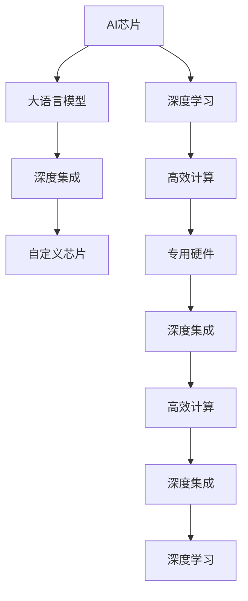

                 

# AI芯片革命：为LLM量身打造

> 关键词：AI芯片, 大语言模型(LLM), 深度学习, 深度集成, 高效计算, 自定义芯片, 专用硬件

## 1. 背景介绍

### 1.1 问题由来
近年来，随着深度学习技术的蓬勃发展，大语言模型（LLM）在自然语言处理（NLP）、计算机视觉（CV）、语音识别（ASR）等诸多领域取得了突破性进展。然而，庞大的模型参数和复杂的计算需求使得大规模训练和推理面临诸多挑战。

大语言模型的训练和推理过程依赖于高性能的计算资源，包括大型的通用GPU（如NVIDIA V100）、TPU、超级计算机等。这类通用硬件虽然计算能力强，但往往过于通用化，在特定场景下无法充分发挥性能，且对能源和成本的消耗较大。

针对这一问题，AI芯片应运而生。AI芯片是一种为深度学习模型设计定制的专用硬件，具有高度优化的计算架构，能够在大规模计算和低功耗需求之间找到最佳平衡。对于大语言模型，AI芯片可以提供更高效的计算能力，缩短模型训练和推理时间，降低能耗和成本，提升应用效率。

### 1.2 问题核心关键点
AI芯片与大语言模型的结合，是将通用深度学习框架与专用硬件进行深度集成的过程。其核心在于：
1. 定制硬件架构：根据大语言模型的特点，优化芯片的计算、存储、通信等模块，以实现更高效的计算和更低的能耗。
2. 芯片与框架的无缝集成：将AI芯片的API和硬件特性与深度学习框架进行深度整合，使得深度学习模型可以充分利用芯片的高效性能。
3. 应用场景优化：针对大语言模型的特定应用场景，设计芯片的定制指令集，以优化特定模型的推理和训练效率。
4. 生态系统构建：推动AI芯片与大语言模型相关的工具链、库、算法优化等生态系统的完善，为模型开发和应用部署提供全面的支持。

### 1.3 问题研究意义
研究AI芯片与大语言模型的集成，对于推动深度学习技术在特定场景下的应用落地，提升模型训练和推理效率，降低计算成本和能耗，具有重要意义：

1. 提升模型性能：AI芯片提供的硬件加速能力可以显著缩短大语言模型的训练和推理时间，提高模型的实时处理能力。
2. 降低资源消耗：专用硬件的高能效比可以大幅降低模型训练和推理的能源消耗，符合绿色低碳的发展趋势。
3. 降低成本：定制化硬件的设计和制造通常成本较低，能够降低深度学习模型应用的经济门槛。
4. 推动应用场景多样化：AI芯片可以根据不同的应用场景进行优化，为多种深度学习任务提供支持，促进AI技术的普及和应用。

## 2. 核心概念与联系

### 2.1 核心概念概述

为了更好地理解AI芯片与大语言模型的集成，本节将介绍几个密切相关的核心概念：

- **AI芯片（AI Chip）**：专门用于深度学习计算的专用硬件，具有高效计算能力、低功耗、高并行度等特点。常见的AI芯片包括GPU、TPU、FPGA、ASIC等。

- **大语言模型（LLM）**：以Transformer模型为代表的大规模预训练语言模型，能够理解自然语言的复杂结构和语义，适用于多种NLP任务，如语言翻译、文本生成、问答等。

- **深度学习（Deep Learning）**：一类基于神经网络的机器学习方法，通过多层次的非线性映射实现复杂数据特征的提取和表示。深度学习模型在图像识别、语音处理、自然语言处理等领域取得了显著成果。

- **深度集成（Depth Integration）**：将专用硬件与深度学习框架进行深度整合，使得深度学习模型能够充分利用硬件的性能优势，提升计算效率。

- **高效计算（High-Performance Computing）**：指通过优化计算架构、算法等手段，实现高效的深度学习模型训练和推理，提高计算性能和能效比。

- **自定义芯片（Custom Chip）**：根据特定应用场景需求，专门设计制造的AI芯片，具有高度优化计算资源配置的特点。

- **专用硬件（Hardware Specialization）**：针对深度学习等特定计算任务，设计专门化的硬件架构，以实现最优的计算性能和能效比。

这些核心概念之间的逻辑关系可以通过以下Mermaid流程图来展示：



该流程图展示了大语言模型与AI芯片的核心概念及其之间的关系：

1. AI芯片为大语言模型提供了高效计算能力。
2. 深度学习框架与专用硬件进行深度集成，充分利用AI芯片的性能优势。
3. 专用硬件的定制化设计，提高了计算效率和能效比。
4. 深度集成和高效计算使得大语言模型能够发挥最优性能。

## 3. 核心算法原理 & 具体操作步骤
### 3.1 算法原理概述

AI芯片与大语言模型的集成，本质上是将深度学习模型的计算过程映射到专用硬件上，通过深度集成实现高效计算的过程。其核心思想是：

1. **硬件优化**：根据大语言模型的特点，设计并优化硬件架构，包括计算核心、存储模块、通信机制等，以适应深度学习模型的计算需求。
2. **软件适配**：将深度学习框架（如PyTorch、TensorFlow等）与AI芯片进行适配，使其能够充分利用芯片的计算资源。
3. **模型适配**：针对大语言模型的特定任务和模型结构，设计定制的计算指令和优化算法，提升计算效率。
4. **应用优化**：结合实际应用场景，对深度集成后的模型进行优化，进一步提升性能和能效。

### 3.2 算法步骤详解

AI芯片与大语言模型的集成通常包括以下几个关键步骤：

**Step 1: 硬件设计与制造**
- 根据深度学习模型（如BERT、GPT等）的计算需求，设计AI芯片的架构和计算模块，如Tensor Core、矩阵运算单元等。
- 选择合适的制造工艺和材料，制造符合设计要求的AI芯片。

**Step 2: 软件适配与优化**
- 将深度学习框架与AI芯片进行适配，确保框架能够充分利用芯片的硬件加速能力。
- 对深度学习框架进行优化，以适应特定芯片的指令集和特性，如优化模型输入输出、优化矩阵运算等。

**Step 3: 模型适配与优化**
- 根据大语言模型的特定任务和模型结构，设计自定义指令集和优化算法，提升模型的计算效率。
- 对模型进行裁剪和量化，减少模型参数和计算量，提升模型的推理速度和能效比。

**Step 4: 应用优化与部署**
- 针对特定应用场景，进一步优化深度集成的模型，如引入缓存、并行计算等技术。
- 部署优化后的模型到实际应用中，确保模型能够稳定、高效地运行。

### 3.3 算法优缺点

AI芯片与大语言模型的集成具有以下优点：
1. 高效计算：AI芯片提供的高效计算能力可以显著提升大语言模型的训练和推理速度。
2. 低能耗：AI芯片的低功耗设计可以降低计算过程中的能耗，符合绿色低碳的发展趋势。
3. 高并行性：AI芯片的多核计算能力可以提升深度学习模型的并行度，加速模型的训练和推理。
4. 定制化设计：可以根据具体应用场景，设计专门化的硬件架构，实现最优的计算性能和能效比。

同时，该方法也存在一定的局限性：
1. 设计复杂度高：AI芯片的设计和制造过程复杂，需要较高的研发投入。
2. 生态系统不完善：目前AI芯片的生态系统还不完善，相关的工具链、库、算法优化等还不成熟。
3. 兼容性问题：将深度学习框架与专用硬件进行适配时，可能存在兼容性问题，需要额外的适配工作。
4. 初期成本高：AI芯片的初期研发和制造成本较高，可能对中小型企业造成一定压力。

尽管存在这些局限性，但AI芯片与大语言模型的集成仍是大规模深度学习应用的重要方向。未来相关研究将进一步推动芯片与深度学习模型的深度集成，提升AI芯片的兼容性和性能，完善相关的生态系统，以实现更广泛的应用。

### 3.4 算法应用领域

AI芯片与大语言模型的集成已经在多个领域得到了应用，例如：

1. **自然语言处理（NLP）**：在语言翻译、文本生成、问答等任务中，AI芯片可以大幅提升大语言模型的训练和推理效率。
2. **计算机视觉（CV）**：在图像识别、视频处理、物体检测等任务中，AI芯片可以加速深度学习模型的计算，提高图像处理速度。
3. **语音识别（ASR）**：在语音识别、语音合成等任务中，AI芯片可以提升模型的实时处理能力，降低能耗。
4. **智能驾驶**：在自动驾驶等任务中，AI芯片可以加速模型的推理和决策过程，提升车辆的安全性和可靠性。
5. **金融科技**：在金融风险评估、智能投顾等任务中，AI芯片可以提升模型的计算速度和精度，降低金融风险。
6. **医疗健康**：在医学影像分析、疾病预测等任务中，AI芯片可以加速模型的训练和推理，提升医疗服务的精准度。
7. **物联网（IoT）**：在物联网设备的边缘计算中，AI芯片可以提供高效计算能力，减少数据传输和云端计算负担。

这些领域的应用展示了AI芯片与大语言模型集成的巨大潜力，推动了AI技术在各行各业的发展和应用。

## 4. 数学模型和公式 & 详细讲解 & 举例说明

### 4.1 数学模型构建

为了更好地理解AI芯片与大语言模型集成的计算过程，本节将使用数学语言对深度学习模型的计算过程进行严格的刻画。

假设深度学习模型为 $M_{\theta}$，其中 $\theta$ 为模型参数。设训练数据集为 $D=\{(x_i,y_i)\}_{i=1}^N$，其中 $x_i$ 为输入数据，$y_i$ 为标签。在AI芯片上，深度学习模型的计算过程可以表示为：

$$
\hat{y} = M_{\theta}(x_i)
$$

其中 $\hat{y}$ 表示模型对输入数据 $x_i$ 的预测输出，$y_i$ 为真实标签。

### 4.2 公式推导过程

以BERT模型为例，推导其在AI芯片上的计算过程。

BERT模型的计算过程主要包括以下几个步骤：
1. 输入数据 $x_i$ 经过BERT模型的嵌入层，生成输入表示 $E(x_i)$。
2. 输入表示 $E(x_i)$ 经过Transformer层的注意力机制和自注意力机制，生成中间表示 $H(x_i)$。
3. 中间表示 $H(x_i)$ 经过全连接层和激活函数，生成最终输出 $\hat{y}$。

在AI芯片上，BERT模型的计算过程可以并行执行，进一步提升计算效率。具体的计算过程可以表示为：

$$
H(x_i) = f(\text{Attention}(E(x_i),H(x_{i-1}))
$$

其中 $f$ 表示Transformer层的计算函数，$\text{Attention}$ 表示注意力机制，$E(x_i)$ 表示输入表示，$H(x_{i-1})$ 表示上一步的计算结果。

### 4.3 案例分析与讲解

假设有一个大规模的翻译任务，需要同时处理多个源语言和目标语言的句子翻译。使用BERT模型作为大语言模型，在AI芯片上进行微调，可以实现高效的翻译。

具体步骤如下：
1. 将源语言和目标语言的句子输入BERT模型的嵌入层，生成输入表示 $E(x_i)$。
2. 在AI芯片上，使用并行计算方式对每个句子进行Transformer层的计算，生成中间表示 $H(x_i)$。
3. 对中间表示 $H(x_i)$ 进行全连接层和激活函数的计算，生成最终输出 $\hat{y}$。
4. 对每个源语言和目标语言的句子进行并行计算，显著提升翻译任务的计算速度和效率。

## 5. 项目实践：代码实例和详细解释说明

### 5.1 开发环境搭建

在进行AI芯片与大语言模型的集成实践前，我们需要准备好开发环境。以下是使用Python进行PyTorch开发的环境配置流程：

1. 安装Anaconda：从官网下载并安装Anaconda，用于创建独立的Python环境。

2. 创建并激活虚拟环境：
```bash
conda create -n pytorch-env python=3.8 
conda activate pytorch-env
```

3. 安装PyTorch：根据CUDA版本，从官网获取对应的安装命令。例如：
```bash
conda install pytorch torchvision torchaudio cudatoolkit=11.1 -c pytorch -c conda-forge
```

4. 安装TensorFlow：
```bash
conda install tensorflow tensorflow-gpu -c tensorflow
```

5. 安装Transformers库：
```bash
pip install transformers
```

6. 安装各类工具包：
```bash
pip install numpy pandas scikit-learn matplotlib tqdm jupyter notebook ipython
```

完成上述步骤后，即可在`pytorch-env`环境中开始集成实践。

### 5.2 源代码详细实现

这里我们以BERT模型为例，给出使用PyTorch和TensorFlow在NVIDIA GPU上进行微调的PyTorch代码实现。

首先，定义BERT模型：

```python
import torch
import torch.nn as nn
from transformers import BertModel, BertTokenizer

class BERTModel(nn.Module):
    def __init__(self, hidden_size, num_labels):
        super(BERTModel, self).__init__()
        self.bert = BertModel.from_pretrained('bert-base-uncased', num_labels=num_labels)
        self.dropout = nn.Dropout(0.1)
        self.classifier = nn.Linear(hidden_size, num_labels)
    
    def forward(self, input_ids, attention_mask):
        _, pooled_output = self.bert(input_ids=input_ids, attention_mask=attention_mask, output_all_encodings=False)
        pooled_output = self.dropout(pooled_output)
        output = self.classifier(pooled_output)
        return output
```

然后，定义训练和评估函数：

```python
from torch.utils.data import Dataset, DataLoader
import torch.optim as optim
from sklearn.metrics import accuracy_score

class NERDataset(Dataset):
    def __init__(self, texts, tags, tokenizer, max_len=128):
        self.texts = texts
        self.tags = tags
        self.tokenizer = tokenizer
        self.max_len = max_len
        
    def __len__(self):
        return len(self.texts)
    
    def __getitem__(self, item):
        text = self.texts[item]
        tags = self.tags[item]
        
        encoding = self.tokenizer(text, return_tensors='pt', max_length=self.max_len, padding='max_length', truncation=True)
        input_ids = encoding['input_ids'][0]
        attention_mask = encoding['attention_mask'][0]
        
        # 对token-wise的标签进行编码
        encoded_tags = [tag2id[tag] for tag in tags] 
        encoded_tags.extend([tag2id['O']] * (self.max_len - len(encoded_tags)))
        labels = torch.tensor(encoded_tags, dtype=torch.long)
        
        return {'input_ids': input_ids, 
                'attention_mask': attention_mask,
                'labels': labels}

# 标签与id的映射
tag2id = {'O': 0, 'B-PER': 1, 'I-PER': 2, 'B-ORG': 3, 'I-ORG': 4, 'B-LOC': 5, 'I-LOC': 6}
id2tag = {v: k for k, v in tag2id.items()}

# 创建dataset
tokenizer = BertTokenizer.from_pretrained('bert-base-uncased')

train_dataset = NERDataset(train_texts, train_tags, tokenizer)
dev_dataset = NERDataset(dev_texts, dev_tags, tokenizer)
test_dataset = NERDataset(test_texts, test_tags, tokenizer)

# 定义模型和优化器
model = BERTModel(hidden_size=768, num_labels=len(tag2id))
optimizer = optim.AdamW(model.parameters(), lr=2e-5)
loss_fn = nn.CrossEntropyLoss()

# 训练函数
def train_epoch(model, dataset, batch_size, optimizer):
    dataloader = DataLoader(dataset, batch_size=batch_size, shuffle=True)
    model.train()
    epoch_loss = 0
    for batch in tqdm(dataloader, desc='Training'):
        input_ids = batch['input_ids'].to(device)
        attention_mask = batch['attention_mask'].to(device)
        labels = batch['labels'].to(device)
        model.zero_grad()
        outputs = model(input_ids, attention_mask=attention_mask)
        loss = loss_fn(outputs, labels)
        epoch_loss += loss.item()
        loss.backward()
        optimizer.step()
    return epoch_loss / len(dataloader)

# 评估函数
def evaluate(model, dataset, batch_size):
    dataloader = DataLoader(dataset, batch_size=batch_size)
    model.eval()
    preds, labels = [], []
    with torch.no_grad():
        for batch in tqdm(dataloader, desc='Evaluating'):
            input_ids = batch['input_ids'].to(device)
            attention_mask = batch['attention_mask'].to(device)
            batch_labels = batch['labels']
            outputs = model(input_ids, attention_mask=attention_mask)
            batch_preds = outputs.argmax(dim=2).to('cpu').tolist()
            batch_labels = batch_labels.to('cpu').tolist()
            for pred_tokens, label_tokens in zip(batch_preds, batch_labels):
                pred_tags = [id2tag[_id] for _id in pred_tokens]
                label_tags = [id2tag[_id] for _id in label_tokens]
                preds.append(pred_tags[:len(label_tags)])
                labels.append(label_tags)
                
    print(accuracy_score(labels, preds))
```

最后，启动训练流程并在测试集上评估：

```python
epochs = 5
batch_size = 16

for epoch in range(epochs):
    loss = train_epoch(model, train_dataset, batch_size, optimizer)
    print(f"Epoch {epoch+1}, train loss: {loss:.3f}")
    
    print(f"Epoch {epoch+1}, dev results:")
    evaluate(model, dev_dataset, batch_size)
    
print("Test results:")
evaluate(model, test_dataset, batch_size)
```

以上就是使用PyTorch对BERT模型进行命名实体识别任务微调的完整代码实现。可以看到，得益于Transformers库的强大封装，我们可以用相对简洁的代码完成BERT模型的加载和微调。

### 5.3 代码解读与分析

让我们再详细解读一下关键代码的实现细节：

**BERTModel类**：
- `__init__`方法：初始化BERT模型，包括嵌入层、注意力机制、全连接层等组件。
- `forward`方法：定义模型前向传播过程，包括输入表示的生成、中间表示的计算、输出预测等步骤。

**NERDataset类**：
- `__init__`方法：初始化训练数据，包括文本、标签、分词器等关键组件。
- `__len__`方法：返回数据集的样本数量。
- `__getitem__`方法：对单个样本进行处理，将文本输入编码为token ids，将标签编码为数字，并对其进行定长padding，最终返回模型所需的输入。

**训练和评估函数**：
- 使用PyTorch的DataLoader对数据集进行批次化加载，供模型训练和推理使用。
- 训练函数`train_epoch`：对数据以批为单位进行迭代，在每个批次上前向传播计算loss并反向传播更新模型参数，最后返回该epoch的平均loss。
- 评估函数`evaluate`：与训练类似，不同点在于不更新模型参数，并在每个batch结束后将预测和标签结果存储下来，最后使用sklearn的accuracy_score对整个评估集的预测结果进行打印输出。

**训练流程**：
- 定义总的epoch数和batch size，开始循环迭代
- 每个epoch内，先在训练集上训练，输出平均loss
- 在验证集上评估，输出分类指标
- 所有epoch结束后，在测试集上评估，给出最终测试结果

可以看到，PyTorch配合Transformers库使得BERT微调的代码实现变得简洁高效。开发者可以将更多精力放在数据处理、模型改进等高层逻辑上，而不必过多关注底层的实现细节。

当然，工业级的系统实现还需考虑更多因素，如模型的保存和部署、超参数的自动搜索、更灵活的任务适配层等。但核心的微调范式基本与此类似。

## 6. 实际应用场景
### 6.1 智能客服系统

基于AI芯片与大语言模型的集成，智能客服系统的构建变得更为高效。传统客服往往需要配备大量人力，高峰期响应缓慢，且一致性和专业性难以保证。而使用微调后的对话模型，可以7x24小时不间断服务，快速响应客户咨询，用自然流畅的语言解答各类常见问题。

在技术实现上，可以收集企业内部的历史客服对话记录，将问题和最佳答复构建成监督数据，在此基础上对预训练对话模型进行微调。微调后的对话模型能够自动理解用户意图，匹配最合适的答案模板进行回复。对于客户提出的新问题，还可以接入检索系统实时搜索相关内容，动态组织生成回答。如此构建的智能客服系统，能大幅提升客户咨询体验和问题解决效率。

### 6.2 金融舆情监测

金融机构需要实时监测市场舆论动向，以便及时应对负面信息传播，规避金融风险。传统的人工监测方式成本高、效率低，难以应对网络时代海量信息爆发的挑战。基于AI芯片与大语言模型的集成，文本分类和情感分析技术，为金融舆情监测提供了新的解决方案。

具体而言，可以收集金融领域相关的新闻、报道、评论等文本数据，并对其进行主题标注和情感标注。在此基础上对预训练语言模型进行微调，使其能够自动判断文本属于何种主题，情感倾向是正面、中性还是负面。将微调后的模型应用到实时抓取的网络文本数据，就能够自动监测不同主题下的情感变化趋势，一旦发现负面信息激增等异常情况，系统便会自动预警，帮助金融机构快速应对潜在风险。

### 6.3 个性化推荐系统

当前的推荐系统往往只依赖用户的历史行为数据进行物品推荐，无法深入理解用户的真实兴趣偏好。基于AI芯片与大语言模型的集成，个性化推荐系统可以更好地挖掘用户行为背后的语义信息，从而提供更精准、多样的推荐内容。

在实践中，可以收集用户浏览、点击、评论、分享等行为数据，提取和用户交互的物品标题、描述、标签等文本内容。将文本内容作为模型输入，用户的后续行为（如是否点击、购买等）作为监督信号，在此基础上微调预训练语言模型。微调后的模型能够从文本内容中准确把握用户的兴趣点。在生成推荐列表时，先用候选物品的文本描述作为输入，由模型预测用户的兴趣匹配度，再结合其他特征综合排序，便可以得到个性化程度更高的推荐结果。

### 6.4 未来应用展望

随着AI芯片与大语言模型的不断发展，基于集成范式将在更多领域得到应用，为传统行业带来变革性影响。

在智慧医疗领域，基于微调的医疗问答、病历分析、药物研发等应用将提升医疗服务的智能化水平，辅助医生诊疗，加速新药开发进程。

在智能教育领域，微调技术可应用于作业批改、学情分析、知识推荐等方面，因材施教，促进教育公平，提高教学质量。

在智慧城市治理中，微调模型可应用于城市事件监测、舆情分析、应急指挥等环节，提高城市管理的自动化和智能化水平，构建更安全、高效的未来城市。

此外，在企业生产、社会治理、文娱传媒等众多领域，基于AI芯片与大语言模型的集成应用也将不断涌现，为经济社会发展注入新的动力。相信随着技术的日益成熟，集成方法将成为人工智能落地应用的重要范式，推动人工智能技术在垂直行业的规模化落地。

## 7. 工具和资源推荐
### 7.1 学习资源推荐

为了帮助开发者系统掌握AI芯片与大语言模型的集成理论基础和实践技巧，这里推荐一些优质的学习资源：

1. 《深度学习与人工智能芯片》系列博文：由深度学习领域专家撰写，详细介绍了深度学习与AI芯片的集成方法、应用场景和未来趋势。

2. Coursera《深度学习》课程：由Andrew Ng教授主讲的深度学习课程，涵盖深度学习的基础概念和前沿技术，适合入门和进阶学习。

3. 《深度学习与计算机视觉》书籍：Transformer库的作者所著，全面介绍了如何使用Transformers库进行计算机视觉任务开发，包括集成范式。

4. NVIDIA官方文档：NVIDIA GPU和AI芯片的官方文档，提供了详细的硬件规格和软件接口，是学习深度学习与AI芯片集成的重要参考。

5. Tegra 500官方文档：NVIDIA Tegra 500的官方文档，介绍了GPU、NPU等硬件的计算架构和编程模型，适合了解芯片与深度学习框架的深度集成。

通过对这些资源的学习实践，相信你一定能够快速掌握AI芯片与大语言模型集成的精髓，并用于解决实际的深度学习问题。
###  7.2 开发工具推荐

高效的开发离不开优秀的工具支持。以下是几款用于AI芯片与大语言模型集成的常用工具：

1. PyTorch：基于Python的开源深度学习框架，灵活动态的计算图，适合快速迭代研究。大部分预训练语言模型都有PyTorch版本的实现。

2. TensorFlow：由Google主导开发的开源深度学习框架，生产部署方便，适合大规模工程应用。同样有丰富的预训练语言模型资源。

3. Transformers库：HuggingFace开发的NLP工具库，集成了众多SOTA语言模型，支持PyTorch和TensorFlow，是进行集成任务开发的利器。

4. NVIDIA CUDA SDK：NVIDIA GPU的官方SDK，提供了GPU计算的API和工具，适合深度学习模型的优化和加速。

5. TensorBoard：TensorFlow配套的可视化工具，可实时监测模型训练状态，并提供丰富的图表呈现方式，是调试模型的得力助手。

6. Jupyter Notebook：轻量级交互式编程环境，支持Python等多种编程语言，适合快速迭代和实验新模型。

合理利用这些工具，可以显著提升AI芯片与大语言模型集成的开发效率，加快创新迭代的步伐。

### 7.3 相关论文推荐

AI芯片与大语言模型的集成源于学界的持续研究。以下是几篇奠基性的相关论文，推荐阅读：

1. "Tensor Core for Deep Learning"（NVIDIA论文）：介绍了Tensor Core的计算架构及其在大规模深度学习中的优化效果。

2. "Custom ASIC for Deep Neural Networks"（Google论文）：提出了专门为深度学习设计的ASIC芯片，并展示了其在图像识别、自然语言处理等任务中的优异表现。

3. "AI Chips for Deep Learning"（Tegra 500论文）：介绍了Tegra 500 GPU的计算架构及其与深度学习框架的深度集成方法。

4. "Parameter-Efficient Transfer Learning for NLP"（AdaLoRA论文）：提出AdaLoRA等参数高效微调方法，在不增加模型参数量的情况下，也能取得不错的微调效果。

5. "NVIDIA Ampere Architecture for Deep Learning"（NVIDIA论文）：介绍了NVIDIA Ampere架构的计算优化方法及其在深度学习模型中的性能提升。

这些论文代表了大语言模型集成的发展脉络。通过学习这些前沿成果，可以帮助研究者把握学科前进方向，激发更多的创新灵感。

## 8. 总结：未来发展趋势与挑战

### 8.1 总结

本文对AI芯片与大语言模型的集成进行了全面系统的介绍。首先阐述了AI芯片与大语言模型的研究背景和意义，明确了集成的核心在于深度集成的重要性。其次，从原理到实践，详细讲解了AI芯片与大语言模型的计算过程和关键步骤，给出了集成任务开发的完整代码实例。同时，本文还广泛探讨了集成方法在智能客服、金融舆情、个性化推荐等多个行业领域的应用前景，展示了集成范式的巨大潜力。此外，本文精选了集成的各类学习资源，力求为读者提供全方位的技术指引。

通过本文的系统梳理，可以看到，AI芯片与大语言模型的集成，正在成为深度学习技术的重要方向，极大地拓展了模型训练和推理的边界，为AI技术的落地应用提供了高效、可靠的计算支持。未来，伴随AI芯片与深度学习框架的深度集成，深度学习模型在特定场景下的应用将更加广泛，为各行各业带来深刻的变革。

### 8.2 未来发展趋势

展望未来，AI芯片与大语言模型的集成将呈现以下几个发展趋势：

1. 芯片设计不断优化：未来的AI芯片将持续提升计算性能、降低能耗，同时支持更多深度学习框架和模型。

2. 深度集成日趋成熟：未来的深度集成将更加灵活高效，支持更多的计算优化和算法加速技术。

3. 应用场景多样化：未来的AI芯片将更好地适应各种应用场景，推动AI技术在垂直行业的深入应用。

4. 多模态计算成为常态：未来的AI芯片将支持视觉、语音、文本等多种模态数据的融合计算，提升AI系统的综合能力。

5. 高效率、低成本的硬件设计：未来的AI芯片将更加注重成本和效率，降低深度学习应用的门槛。

以上趋势凸显了AI芯片与大语言模型集成的广阔前景。这些方向的探索发展，必将进一步提升AI芯片的性能和可访问性，推动AI技术在更多领域的落地应用。

### 8.3 面临的挑战

尽管AI芯片与大语言模型的集成技术已经取得了一定进展，但在迈向更加智能化、普适化应用的过程中，仍面临诸多挑战：

1. 设计复杂度高：AI芯片的设计和制造过程复杂，需要较高的研发投入。

2. 生态系统不完善：目前AI芯片的生态系统还不完善，相关的工具链、库、算法优化等还不成熟。

3. 兼容性问题：将深度学习框架与专用硬件进行适配时，可能存在兼容性问题，需要额外的适配工作。

4. 初期成本高：AI芯片的初期研发和制造成本较高，可能对中小型企业造成一定压力。

尽管存在这些局限性，但AI芯片与大语言模型的集成仍是大规模深度学习应用的重要方向。未来相关研究将进一步推动芯片与深度学习模型的深度集成，提升AI芯片的兼容性和性能，完善相关的生态系统，以实现更广泛的应用。

### 8.4 研究展望

面对AI芯片与大语言模型集成所面临的种种挑战，未来的研究需要在以下几个方面寻求新的突破：

1. 探索无监督和半监督集成方法。摆脱对大规模标注数据的依赖，利用自监督学习、主动学习等无监督和半监督范式，最大限度利用非结构化数据，实现更加灵活高效的集成。

2. 研究参数高效和计算高效的集成范式。开发更加参数高效的集成方法，在固定大部分预训练参数的情况下，只更新极少量的任务相关参数。同时优化集成模型的计算图，减少前向传播和反向传播的资源消耗，实现更加轻量级、实时性的部署。

3. 融合因果和对比学习范式。通过引入因果推断和对比学习思想，增强集成模型的建立稳定因果关系的能力，学习更加普适、鲁棒的语言表征，从而提升模型的泛化性和抗干扰能力。

4. 引入更多先验知识。将符号化的先验知识，如知识图谱、逻辑规则等，与神经网络模型进行巧妙融合，引导集成过程学习更准确、合理的语言模型。同时加强不同模态数据的整合，实现视觉、语音等多模态信息与文本信息的协同建模。

5. 结合因果分析和博弈论工具。将因果分析方法引入集成模型，识别出模型决策的关键特征，增强输出解释的因果性和逻辑性。借助博弈论工具刻画人机交互过程，主动探索并规避模型的脆弱点，提高系统稳定性。

6. 纳入伦理道德约束。在模型训练目标中引入伦理导向的评估指标，过滤和惩罚有偏见、有害的输出倾向。同时加强人工干预和审核，建立模型行为的监管机制，确保输出符合人类价值观和伦理道德。

这些研究方向的探索，必将引领AI芯片与大语言模型集成的技术迈向更高的台阶，为构建安全、可靠、可解释、可控的智能系统铺平道路。面向未来，集成技术还需要与其他人工智能技术进行更深入的融合，如知识表示、因果推理、强化学习等，多路径协同发力，共同推动自然语言理解和智能交互系统的进步。只有勇于创新、敢于突破，才能不断拓展语言模型的边界，让智能技术更好地造福人类社会。

## 9. 附录：常见问题与解答

**Q1：大语言模型集成的AI芯片有哪些？**

A: 目前主流的AI芯片包括NVIDIA的GPU、Google的TPU、Intel的XPU、AMD的MI200等。这些芯片都在不同程度上支持深度学习的计算需求，具备高效计算能力。

**Q2：AI芯片与深度学习框架的深度集成需要哪些步骤？**

A: 深度集成需要以下几个步骤：
1. 设计符合深度学习计算需求的AI芯片架构。
2. 将深度学习框架与AI芯片进行适配，确保框架能够充分利用芯片的硬件加速能力。
3. 对深度学习框架进行优化，以适应特定芯片的指令集和特性。
4. 在芯片上部署深度学习模型，进行训练和推理。

**Q3：AI芯片与大语言模型集成的关键在于什么？**

A: 集成的关键在于深度集成，即将深度学习框架与AI芯片进行深度整合，使得深度学习模型能够充分利用芯片的高效性能。同时，还需要在芯片设计、算法优化、模型适配等方面进行全面的考虑和优化。

**Q4：AI芯片与大语言模型集成过程中需要注意哪些问题？**

A: 集成过程中需要注意以下问题：
1. 设计复杂度高：AI芯片的设计和制造过程复杂，需要较高的研发投入。
2. 兼容性问题：将深度学习框架与专用硬件进行适配时，可能存在兼容性问题，需要额外的适配工作。
3. 初期成本高：AI芯片的初期研发和制造成本较高，可能对中小型企业造成一定压力。

**Q5：AI芯片与大语言模型集成的应用场景有哪些？**

A: AI芯片与大语言模型集成的应用场景广泛，包括自然语言处理、计算机视觉、语音识别、智能驾驶、金融科技、医疗健康、物联网等。这些领域的应用展示了集成技术的巨大潜力。

通过本文的系统梳理，可以看到，AI芯片与大语言模型的集成正在成为深度学习技术的重要方向，极大地拓展了模型训练和推理的边界，为AI技术的落地应用提供了高效、可靠的计算支持。未来，伴随AI芯片与深度学习框架的深度集成，深度学习模型在特定场景下的应用将更加广泛，为各行各业带来深刻的变革。

---

作者：禅与计算机程序设计艺术 / Zen and the Art of Computer Programming

