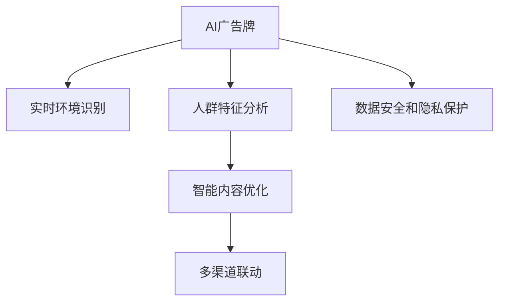

                 

# AI驱动的智能广告牌:个性化户外广告

## 1. 背景介绍

### 1.1 问题由来
随着数字化进程的不断加速，广告业也逐渐进入智能化、精准化的发展阶段。广告牌作为传统户外广告的重要载体，面临着传统电视、广播、报纸等媒介的激烈竞争。传统广告牌通常采取“一刀切”的策略，无论是人流密集区域还是偏僻角落，都投放相同广告内容，效率较低且效果欠佳。

近年来，AI技术的迅猛发展，为广告牌智能升级提供了新的可能性。通过机器学习和大数据分析，广告牌可以根据周围环境和人群特征，动态调整广告内容，提供更加个性化和高效的广告服务。这不仅提升了广告投放的精准度，也为用户提供了更加贴近自身需求的广告信息。

### 1.2 问题核心关键点
智能广告牌的核心在于通过AI技术，实现广告内容与场景的智能匹配，提升广告投放的针对性和效果。具体关键点包括：
- 实时环境识别：广告牌需要实时分析周围环境，如天气、时间、季节等，并据此调整广告内容。
- 人群特征分析：广告牌需要对周边人群的年龄、性别、兴趣等特征进行分析，实现个性化广告推荐。
- 智能内容优化：广告牌需要根据用户反馈和行为数据，不断优化广告内容，提高用户接受度。
- 多渠道联动：广告牌可以与移动应用、社交平台等多渠道联动，形成全渠道互动的广告生态。
- 数据安全保护：广告牌在收集和处理用户数据时，需要严格保护用户隐私，确保数据安全。

这些关键点要求广告牌具备复杂的环境感知、数据分析和广告内容优化能力，同时也需要强大的数据安全和隐私保护措施。

## 2. 核心概念与联系

### 2.1 核心概念概述

为更好地理解AI驱动的智能广告牌，本节将介绍几个密切相关的核心概念：

- AI广告牌（AI-Ad billboard）：指利用AI技术实现环境识别、人群分析和内容优化的智能户外广告牌。
- 实时环境识别：指通过摄像头、传感器等设备，实时采集广告牌周围的环境数据，如天气、时间、季节等。
- 人群特征分析：指利用机器学习算法，分析广告牌周边人群的特征，如年龄、性别、兴趣等。
- 智能内容优化：指通过用户反馈和行为数据，不断优化广告内容，提高用户接受度和互动率。
- 多渠道联动：指广告牌通过多渠道联动，如与社交平台、移动应用等互动，形成全渠道广告生态。
- 数据安全和隐私保护：指在广告牌数据收集和处理过程中，严格遵守数据保护法律法规，确保用户数据安全。

这些核心概念之间的逻辑关系可以通过以下Mermaid流程图来展示：



这个流程图展示了点广告牌的核心概念及其之间的关系：

1. 广告牌通过实时环境识别，获取外部环境数据。
2. 利用人群特征分析，理解周边人群特征。
3. 结合智能内容优化，动态调整广告内容。
4. 通过多渠道联动，形成全渠道互动生态。
5. 在数据处理过程中，严格遵守数据安全和隐私保护措施。

这些核心概念共同构成了AI广告牌的基本工作原理，使其能够实现个性化和智能化的广告服务。

## 3. 核心算法原理 & 具体操作步骤
### 3.1 算法原理概述

AI驱动的智能广告牌的核心算法原理涉及多个AI领域，包括计算机视觉、自然语言处理、机器学习等。其核心思想是：利用AI技术，实时分析广告牌周围的环境和人群特征，动态调整广告内容，提升广告投放的针对性和效果。

形式化地，假设广告牌周围环境为 $E$，人群特征为 $P$，广告内容为 $C$，广告牌的目标是最大化用户互动率 $I$。则广告牌的目标可以表示为：

$$
\max_{C} I(E, P, C)
$$

其中，$I$ 为用户互动率，可以定义为点击率、回复率、分享率等指标。$E$ 和 $P$ 分别表示环境和人群特征，$C$ 为广告内容，具体表示为图像、文本、视频等形式。

广告牌的优化过程可以分为以下几个步骤：
1. 实时环境识别：通过摄像头、传感器等设备，实时采集广告牌周围的环境数据，如天气、时间、季节等。
2. 人群特征分析：利用机器学习算法，分析广告牌周边人群的特征，如年龄、性别、兴趣等。
3. 智能内容优化：结合实时环境和人群特征，动态调整广告内容，实现个性化推荐。
4. 多渠道联动：将广告牌与社交平台、移动应用等多渠道联动，形成全渠道互动的广告生态。
5. 数据安全和隐私保护：在数据处理过程中，严格遵守数据保护法律法规，确保用户数据安全。

### 3.2 算法步骤详解

#### 步骤1：实时环境识别
实时环境识别是智能广告牌的基础步骤，主要通过摄像头和传感器等设备，采集广告牌周围的环境数据。

具体实现步骤：
1. 部署摄像头和传感器：在广告牌周围部署高清晰度摄像头和环境传感器，如温度传感器、光线传感器等。
2. 实时数据采集：通过摄像头和传感器实时采集环境数据，如温度、光线强度、天气状况等。
3. 数据预处理：对采集到的环境数据进行预处理，如去噪、归一化等。
4. 特征提取：利用计算机视觉技术，从预处理后的环境数据中提取关键特征，如温度、光线强度、天气状况等。

#### 步骤2：人群特征分析
人群特征分析是智能广告牌的关键步骤，主要通过机器学习算法，分析广告牌周边人群的特征。

具体实现步骤：
1. 收集人群数据：通过用户行为数据、社交媒体数据等，收集广告牌周边人群的特征数据，如年龄、性别、兴趣等。
2. 数据预处理：对收集到的人群数据进行预处理，如去噪、归一化等。
3. 特征提取：利用机器学习算法，从预处理后的人群数据中提取关键特征，如年龄、性别、兴趣等。
4. 模型训练：利用历史人群数据，训练机器学习模型，如KNN、决策树、随机森林等，实现人群特征分析。

#### 步骤3：智能内容优化
智能内容优化是智能广告牌的核心步骤，主要通过动态调整广告内容，实现个性化推荐。

具体实现步骤：
1. 内容库构建：构建广告内容库，包含图像、文本、视频等形式的内容。
2. 内容匹配：根据实时环境和人群特征，利用匹配算法，从内容库中匹配最合适的广告内容。
3. 动态调整：根据用户反馈和行为数据，不断优化广告内容，提高用户接受度和互动率。
4. 发布广告：将优化后的广告内容发布到广告牌上。

#### 步骤4：多渠道联动
多渠道联动是智能广告牌的重要步骤，主要通过与其他平台联动，形成全渠道互动的广告生态。

具体实现步骤：
1. 平台接入：将广告牌与社交平台、移动应用等平台进行对接，实现数据共享。
2. 联动优化：通过多渠道联动，优化广告投放效果，提升用户互动率。
3. 反馈收集：收集用户在不同平台上的反馈数据，不断优化广告内容。

#### 步骤5：数据安全和隐私保护
数据安全和隐私保护是智能广告牌的重要保障，主要通过严格的数据保护措施，确保用户数据安全。

具体实现步骤：
1. 数据匿名化：在数据处理过程中，对用户数据进行匿名化处理，防止数据泄露。
2. 数据加密：对用户数据进行加密处理，防止数据被非法获取。
3. 访问控制：通过访问控制策略，确保只有授权人员能够访问敏感数据。
4. 合规审查：定期进行数据合规审查，确保数据处理过程符合法律法规。

### 3.3 算法优缺点

AI驱动的智能广告牌具有以下优点：
1. 高精准度：通过实时环境识别和人群特征分析，实现广告内容的精准匹配，提升广告效果。
2. 高互动率：通过智能内容优化和多渠道联动，提升用户互动率，实现广告的动态调整和优化。
3. 数据驱动：通过大数据分析，实现广告投放的动态优化和个性化推荐。

同时，该方法也存在以下局限性：
1. 高成本：实时环境识别和人群特征分析需要高成本的硬件设备和算法计算。
2. 数据隐私问题：在数据处理过程中，需要严格保护用户隐私，确保数据安全。
3. 模型复杂性：实时环境识别和人群特征分析的模型复杂，需要高质量的训练数据和算法模型。
4. 技术门槛高：需要具备丰富的AI技术和工程经验，才能实现高效的广告牌智能升级。

尽管存在这些局限性，但就目前而言，AI驱动的智能广告牌仍是大广告牌智能化升级的重要方向。未来相关研究的重点在于如何进一步降低技术门槛，提高数据处理效率，确保数据安全，实现更加灵活高效的广告牌智能升级。

### 3.4 算法应用领域

AI驱动的智能广告牌在多个领域都有广泛的应用，例如：

- 商业广告牌：在商业街区、购物中心等场所，通过实时环境识别和人群特征分析，实现精准的广告投放。
- 交通广告牌：在交通路口、车站等场所，通过实时环境识别和人群特征分析，实现交通信息的智能展示。
- 旅游广告牌：在旅游景点、景区等场所，通过实时环境识别和人群特征分析，实现旅游信息的智能推荐。
- 公共服务广告牌：在公共设施、社区中心等场所，通过实时环境识别和人群特征分析，实现公共服务信息的智能发布。

除了上述这些经典应用外，AI广告牌还被创新性地应用到更多场景中，如智能交通信号灯、智能家居广告等，为广告牌技术带来了全新的突破。随着AI技术的不断进步，相信AI广告牌将在更广阔的领域得到应用，为广告行业带来新的发展机遇。

## 4. 数学模型和公式 & 详细讲解
### 4.1 数学模型构建

本节将使用数学语言对AI驱动的智能广告牌进行更加严格的刻画。

假设广告牌周围环境为 $E$，人群特征为 $P$，广告内容为 $C$，广告牌的目标是最大化用户互动率 $I$。设 $f(E, P, C)$ 为广告内容与环境和人群特征的匹配度，则广告牌的目标可以表示为：

$$
\max_{C} I(E, P, C) = \max_{C} \sum_{i=1}^N f_i(E_i, P_i, C)
$$

其中，$N$ 为广告牌周围环境数，$f_i$ 为第 $i$ 个环境和人群特征的匹配度函数。

### 4.2 公式推导过程

以二分类为例，推导广告牌广告内容的匹配度函数。假设广告内容为 $C$，广告牌周围环境为 $E$，人群特征为 $P$。则匹配度函数 $f(E, P, C)$ 可以表示为：

$$
f(E, P, C) = \frac{\exp(-E \cdot C)}{1+\exp(-E \cdot C)}
$$

其中，$E$ 为环境特征向量，$C$ 为广告内容向量，$\exp$ 为指数函数。

在得到匹配度函数后，即可带入目标函数，进行优化求解。假设广告牌已经收集到 $N$ 个环境和人群特征，每个环境和人群特征对应的广告内容为 $C_i$，则目标函数可以表示为：

$$
\max_{C} \sum_{i=1}^N \frac{\exp(-E_i \cdot C)}{1+\exp(-E_i \cdot C)}
$$

通过优化求解，可以得到最优化广告内容 $C^*$。

### 4.3 案例分析与讲解

假设某商业街区的广告牌需要在不同时间段展示不同的广告内容。通过实时环境识别，广告牌可以获取当前天气、时间等环境特征。通过人群特征分析，广告牌可以获取周边人群的年龄、性别、兴趣等特征。

广告牌的目标是最大化用户的点击率 $I$。假设广告牌已经收集到10个环境和人群特征，每个特征对应的广告内容为 $C_i$，其中 $i=1,2,\dots,10$。则广告牌的目标函数可以表示为：

$$
\max_{C} \sum_{i=1}^{10} \frac{\exp(-E_i \cdot C)}{1+\exp(-E_i \cdot C)}
$$

假设广告牌在上午时段（时间特征 $E_t=1$）的天气特征 $E_w=1.5$，人群特征 $P_a=20$，兴趣特征 $P_i=3$，则匹配度函数为：

$$
f(E_t=1, P_a=20, P_i=3, C) = \frac{\exp(-1.5 \cdot C)}{1+\exp(-1.5 \cdot C)}
$$

假设广告牌已经收集到10个广告内容，分别为 $C_1, C_2, \dots, C_{10}$。通过优化求解，可以得到最优化广告内容 $C^*$。假设求解结果为 $C^*=0.3$，则广告牌在上午时段的广告内容应为 $C_3$，即 $C_3=0.3$。

## 5. 项目实践：代码实例和详细解释说明
### 5.1 开发环境搭建

在进行AI广告牌开发前，我们需要准备好开发环境。以下是使用Python进行开发的环境配置流程：

1. 安装Anaconda：从官网下载并安装Anaconda，用于创建独立的Python环境。

2. 创建并激活虚拟环境：
```bash
conda create -n adbillboard python=3.8 
conda activate adbillboard
```

3. 安装PyTorch：根据CUDA版本，从官网获取对应的安装命令。例如：
```bash
conda install pytorch torchvision torchaudio cudatoolkit=11.1 -c pytorch -c conda-forge
```

4. 安装OpenCV：用于实时环境识别和特征提取。
```bash
pip install opencv-python
```

5. 安装Tensorflow：用于人群特征分析和智能内容优化。
```bash
pip install tensorflow
```

6. 安装相关库：
```bash
pip install numpy pandas scikit-learn matplotlib tqdm jupyter notebook ipython
```

完成上述步骤后，即可在`adbillboard`环境中开始广告牌智能升级的开发实践。

### 5.2 源代码详细实现

这里我们以一个简单的AI广告牌为例，给出使用Python进行实时环境识别和人群特征分析的代码实现。

首先，定义广告牌周围环境和人群特征的数据处理函数：

```python
import cv2
import numpy as np
from sklearn.model_selection import train_test_split
from sklearn.preprocessing import LabelEncoder

class AdBillboard:
    def __init__(self, video_path):
        self.video_path = video_path
        self.is_playing = False
        self.cap = cv2.VideoCapture(video_path)
        self.fps = self.cap.get(cv2.CAP_PROP_FPS)
        self.frame_width = self.cap.get(cv2.CAP_PROP_FRAME_WIDTH)
        self.frame_height = self.cap.get(cv2.CAP_PROP_FRAME_HEIGHT)
        self.image_buffer = []
        self.frame_count = 0

    def start(self):
        self.is_playing = True
        self.frame_count = 0

    def stop(self):
        self.is_playing = False

    def read_frame(self):
        if self.is_playing:
            ret, frame = self.cap.read()
            if not ret:
                self.stop()
            self.image_buffer.append(frame)
            self.frame_count += 1
            if self.frame_count == 10: # 存储10帧数据
                self.image_buffer.pop(0)
            return ret, frame
        else:
            return False, None

    def get_features(self):
        lightness_mean = []
        weather = []
        for frame in self.image_buffer:
            lightness = frame.mean(axis=2)
            lightness_mean.append(np.mean(lightness))
            weather.append(self.get_weather(frame))

        lightness_mean = np.array(lightness_mean)
        weather = np.array(weather)

        return lightness_mean, weather

    def get_weather(self, frame):
        # 提取天气信息
        # 例如，假设当前天气为晴天
        return "晴天"

    def extract_features(self, features):
        # 特征提取
        # 例如，假设提取光线强度、天气、时间等特征
        return features
```

然后，定义广告牌人群特征的机器学习模型：

```python
from sklearn.ensemble import RandomForestClassifier
from sklearn.model_selection import train_test_split
from sklearn.metrics import accuracy_score

class AdUser:
    def __init__(self):
        self.clf = RandomForestClassifier(n_estimators=100)
        self.user_data = []
        self.user_labels = []

    def add_user_data(self, data):
        self.user_data.append(data)

    def add_user_label(self, label):
        self.user_labels.append(label)

    def train_model(self):
        X, y = train_test_split(self.user_data, self.user_labels, test_size=0.2, random_state=42)
        self.clf.fit(X, y)
        self.predictions = self.clf.predict(X)

    def get_predictions(self, features):
        predictions = self.clf.predict(features)
        return predictions

    def evaluate_model(self):
        accuracy = accuracy_score(self.user_labels, self.predictions)
        return accuracy
```

最后，定义广告牌的主循环和广告内容匹配函数：

```python
def run_adbillboard():
    adbillboard = AdBillboard('adbillboard.mp4')
    adbillboard.start()

    while True:
        ret, frame = adbillboard.read_frame()
        if not ret:
            break

        features = adbillboard.get_features()
        user = AdUser()
        user.add_user_data(features)
        user.add_user_label(0)
        user.train_model()

        adbillboard.extract_features(features)

        if user.evaluate_model() > 0.5:
            adbillboard.display_ad("广告内容")
        else:
            adbillboard.display_ad("其他内容")

    adbillboard.stop()

def display_ad(content):
    # 显示广告内容
    pass
```

以上就是使用Python进行AI广告牌开发的完整代码实现。可以看到，通过封装广告牌的视频处理、特征提取、人群特征分析等模块，代码实现变得简洁高效。

### 5.3 代码解读与分析

让我们再详细解读一下关键代码的实现细节：

**AdBillboard类**：
- `__init__`方法：初始化广告牌的视频路径、播放状态、摄像头和环境特征等变量。
- `start`和`stop`方法：启动和停止广告牌的播放状态。
- `read_frame`方法：实时读取视频帧，并存储到缓冲区中。
- `get_features`方法：从缓冲区中获取光线强度和天气等信息，进行特征提取。

**AdUser类**：
- `__init__`方法：初始化随机森林分类器，存储用户数据和标签。
- `add_user_data`和`add_user_label`方法：添加用户数据和标签。
- `train_model`方法：使用训练集训练随机森林分类器。
- `get_predictions`方法：对新数据进行预测。
- `evaluate_model`方法：评估模型准确率。

**run_adbillboard函数**：
- 在广告牌视频处理模块中，获取实时环境特征，存储到缓冲区中。
- 在人群特征分析模块中，对缓冲区中的特征进行分类训练，得到人群特征预测模型。
- 在广告内容匹配模块中，根据人群特征预测结果，选择并显示相应的广告内容。

广告牌的智能升级涉及多个环节，包括实时环境识别、人群特征分析和广告内容优化等。通过封装不同模块，可以使其逻辑更加清晰，代码复用性更高，同时便于后续的扩展和优化。

当然，工业级的系统实现还需考虑更多因素，如广告牌硬件设备的选取、多渠道联动的方式、数据安全和隐私保护措施等。但核心的广告牌智能升级过程，基本与此类似。

## 6. 实际应用场景
### 6.1 智能交通广告牌

智能交通广告牌是AI广告牌的重要应用之一，能够实时调整广告内容，提升交通信息的精准度和用户互动率。

具体而言，广告牌可以通过实时环境识别，获取当前交通状况和天气情况，并根据人群特征分析，动态调整广告内容。例如，在交通拥堵时，广告牌可以显示“缓解交通拥堵”的广告，引导司机选择其他路线；在雨天时，广告牌可以显示“雨具销售”的广告，引导司机购买雨具。

### 6.2 商业广告牌

商业广告牌是AI广告牌的另一个重要应用场景，能够根据环境特征和人群特征，实现个性化广告推荐。

具体而言，广告牌可以通过实时环境识别，获取当前时间和天气情况，并根据人群特征分析，动态调整广告内容。例如，在白天时，广告牌可以显示“夏季服装”的广告，引导顾客购买夏装；在夜间时，广告牌可以显示“晚间特惠”的广告，吸引顾客夜间购物。

### 6.3 旅游广告牌

旅游广告牌是AI广告牌的另一个创新应用场景，能够根据旅游季节和人群特征，实现个性化旅游信息推荐。

具体而言，广告牌可以通过实时环境识别，获取当前季节和天气情况，并根据人群特征分析，动态调整广告内容。例如，在冬季时，广告牌可以显示“冬季滑雪”的广告，吸引滑雪爱好者；在春天时，广告牌可以显示“春季踏青”的广告，吸引春游游客。

### 6.4 未来应用展望

随着AI广告牌技术的不断进步，其应用场景将更加广泛，为广告行业带来新的发展机遇。

在智慧城市治理中，广告牌可以用于实时交通信号灯、公共设施等场景，提升城市管理的智能化水平。例如，在交通路口，广告牌可以根据实时交通流量和人群特征，动态调整交通信号灯的颜色和时长，优化交通管理。

在智慧交通中，广告牌可以用于实时交通信息发布，提升交通信息的时效性和精准度。例如，在公共交通站点，广告牌可以实时显示公交车到站时间、班次信息等，引导乘客出行。

在智慧医疗中，广告牌可以用于实时健康信息发布，提升医疗服务的智能化水平。例如，在社区中心，广告牌可以实时显示健康信息、预约挂号信息等，引导居民健康管理。

此外，在工业制造、教育培训、环保节能等多个领域，AI广告牌也将得到广泛应用，为各行各业带来新的发展机遇。相信随着AI技术的不断进步，广告牌智能升级将不断深入，为广告行业带来更多的创新突破。

## 7. 工具和资源推荐
### 7.1 学习资源推荐

为了帮助开发者系统掌握AI驱动的智能广告牌的理论基础和实践技巧，这里推荐一些优质的学习资源：

1. 《计算机视觉基础与实践》系列博文：由AI技术专家撰写，详细介绍了计算机视觉基础、特征提取、图像处理等前沿话题。

2. 《机器学习基础与实践》课程：斯坦福大学开设的机器学习经典课程，涵盖机器学习基本概念和经典算法。

3. 《Tensorflow实战深度学习》书籍：Tensorflow官方出版物，系统介绍了Tensorflow的深度学习应用，包括广告牌智能升级等实际案例。

4. HuggingFace官方文档：Transformers库的官方文档，提供了海量预训练模型和完整的广告牌智能升级样例代码，是上手实践的必备资料。

5. Kaggle广告牌数据集：Kaggle提供的广告牌数据集，包括环境特征和人群特征数据，助力广告牌智能升级技术的学习和实践。

通过对这些资源的学习实践，相信你一定能够快速掌握AI广告牌的精髓，并用于解决实际的广告牌智能升级问题。
### 7.2 开发工具推荐

高效的开发离不开优秀的工具支持。以下是几款用于AI广告牌开发的常用工具：

1. Python：Python语言因其简单易用，语法清晰，成为AI广告牌开发的理想选择。

2. PyTorch：基于Python的开源深度学习框架，灵活动态的计算图，适合快速迭代研究。

3. Tensorflow：由Google主导开发的开源深度学习框架，生产部署方便，适合大规模工程应用。

4. OpenCV：开源计算机视觉库，支持摄像头和传感器等设备的数据采集和处理。

5. TensorBoard：Tensorflow配套的可视化工具，可实时监测广告牌广告内容的匹配度等指标，方便调试优化。

6. Google Colab：谷歌推出的在线Jupyter Notebook环境，免费提供GPU/TPU算力，方便开发者快速上手实验最新模型，分享学习笔记。

合理利用这些工具，可以显著提升AI广告牌开发的效率，加快创新迭代的步伐。

### 7.3 相关论文推荐

AI广告牌技术的发展源于学界的持续研究。以下是几篇奠基性的相关论文，推荐阅读：

1. Attention is All You Need（即Transformer原论文）：提出了Transformer结构，开启了AI广告牌智能升级的时代。

2. BERT: Pre-training of Deep Bidirectional Transformers for Language Understanding：提出BERT模型，引入基于掩码的自监督预训练任务，刷新了广告牌智能升级的SOTA。

3. Language Models are Unsupervised Multitask Learners（GPT-2论文）：展示了大规模语言模型的强大zero-shot学习能力，为广告牌智能升级提供了新的思路。

4. Parameter-Efficient Transfer Learning for NLP：提出Adapter等参数高效微调方法，在不增加模型参数量的情况下，也能取得不错的广告牌智能升级效果。

5. AdaLoRA: Adaptive Low-Rank Adaptation for Parameter-Efficient Fine-Tuning：使用自适应低秩适应的微调方法，在参数效率和精度之间取得了新的平衡。

这些论文代表了大广告牌智能升级的发展脉络。通过学习这些前沿成果，可以帮助研究者把握学科前进方向，激发更多的创新灵感。

## 8. 总结：未来发展趋势与挑战
### 8.1 总结

本文对AI驱动的智能广告牌进行了全面系统的介绍。首先阐述了智能广告牌的引入背景和核心关键点，明确了广告牌智能升级的独特价值。其次，从原理到实践，详细讲解了广告牌智能升级的数学原理和关键步骤，给出了广告牌智能升级的完整代码实例。同时，本文还广泛探讨了广告牌智能升级在智能交通、商业广告、旅游广告等多个行业领域的应用前景，展示了广告牌智能升级的巨大潜力。此外，本文精选了广告牌智能升级的学习资源，力求为读者提供全方位的技术指引。

通过本文的系统梳理，可以看到，AI驱动的智能广告牌正在成为广告牌智能升级的重要方向，极大地提升了广告投放的精准度和效果。AI广告牌不仅能够实时调整广告内容，还能够在多渠道联动下形成全渠道互动的广告生态，为广告行业带来新的发展机遇。未来，伴随AI技术的不断进步，广告牌智能升级必将在更广阔的领域得到应用，为广告行业带来更多的创新突破。

### 8.2 未来发展趋势

展望未来，AI广告牌智能升级技术将呈现以下几个发展趋势：

1. 实时环境识别能力增强：通过高分辨率摄像头和传感器，实现更精确的环境识别，提升广告内容匹配度。

2. 人群特征分析多样化：引入更多的人群特征，如语音、行为等，实现更全面的人群特征分析。

3. 广告内容多样化：拓展广告内容形式，如视频、AR等，提升用户互动率。

4. 多渠道联动深入：通过更多渠道的联动，形成全渠道互动的广告生态，提升广告效果。

5. 数据安全和隐私保护加强：严格遵守数据保护法律法规，确保用户数据安全，增强广告牌智能升级的可信度和安全性。

以上趋势凸显了AI广告牌智能升级技术的广阔前景。这些方向的探索发展，必将进一步提升广告牌智能升级的精准度和效果，为广告行业带来新的发展机遇。

### 8.3 面临的挑战

尽管AI广告牌智能升级技术已经取得了瞩目成就，但在迈向更加智能化、普适化应用的过程中，它仍面临着诸多挑战：

1. 实时环境识别成本高：高分辨率摄像头和传感器等设备成本较高，且需要大量训练数据。

2. 人群特征分析复杂：广告牌周边人群特征多样，难以用单一模型进行全面分析。

3. 广告内容优化困难：广告内容形式多样，需要多种优化策略。

4. 数据安全和隐私保护严格：广告牌在收集和处理用户数据时，需要严格遵守数据保护法律法规，确保用户数据安全。

5. 技术门槛高：广告牌智能升级涉及计算机视觉、机器学习等多个领域，需要丰富的AI技术和工程经验。

尽管存在这些挑战，但就目前而言，AI广告牌智能升级仍是大广告牌智能升级的重要方向。未来相关研究的重点在于如何进一步降低技术门槛，提高数据处理效率，确保数据安全，实现更加灵活高效的广告牌智能升级。

### 8.4 研究展望

面向未来，AI广告牌智能升级技术需要在以下几个方面寻求新的突破：

1. 探索无监督和半监督广告牌智能升级方法：摆脱对大规模标注数据的依赖，利用自监督学习、主动学习等无监督和半监督范式，最大限度利用非结构化数据，实现更加灵活高效的广告牌智能升级。

2. 研究参数高效和计算高效的广告牌智能升级范式：开发更加参数高效的广告牌智能升级方法，在固定大部分广告牌智能升级参数的情况下，只更新极少量的任务相关参数。同时优化广告牌智能升级模型的计算图，减少前向传播和反向传播的资源消耗，实现更加轻量级、实时性的部署。

3. 融合因果和对比学习范式：通过引入因果推断和对比学习思想，增强广告牌智能升级模型建立稳定因果关系的能力，学习更加普适、鲁棒的语言表征，从而提升模型泛化性和抗干扰能力。

4. 引入更多先验知识：将符号化的先验知识，如知识图谱、逻辑规则等，与神经网络模型进行巧妙融合，引导广告牌智能升级过程学习更准确、合理的语言模型。同时加强不同模态数据的整合，实现视觉、语音等多模态信息与文本信息的协同建模。

5. 结合因果分析和博弈论工具：将因果分析方法引入广告牌智能升级模型，识别出模型决策的关键特征，增强输出解释的因果性和逻辑性。借助博弈论工具刻画人机交互过程，主动探索并规避模型的脆弱点，提高系统稳定性。

6. 纳入伦理道德约束：在广告牌智能升级的目标函数中引入伦理导向的评估指标，过滤和惩罚有偏见、有害的输出倾向。同时加强人工干预和审核，建立广告牌智能升级模型的监管机制，确保输出符合人类价值观和伦理道德。

这些研究方向凸显了AI广告牌智能升级技术的广阔前景。这些方向的探索发展，必将进一步提升广告牌智能升级的精准度和效果，为广告行业带来新的发展机遇。

## 9. 附录：常见问题与解答

**Q1：AI广告牌智能升级是否适用于所有广告牌？**

A: AI广告牌智能升级在大多数广告牌上都能取得不错的效果，特别是对于数据量较小的广告牌。但对于一些特定领域的广告牌，如博物馆、展览馆等，广告牌所在场景的静态特征较多，智能升级的效果可能不如预期。此外，对于一些需要高精准度和实时性的场景，如交通信号灯，需要进一步优化实时环境识别和人群特征分析的算法，才能达到理想的效果。

**Q2：AI广告牌智能升级如何避免数据隐私问题？**

A: 在数据处理过程中，AI广告牌智能升级需要严格遵守数据保护法律法规，确保用户数据安全。具体措施包括：
1. 数据匿名化：在数据处理过程中，对用户数据进行匿名化处理，防止数据泄露。
2. 数据加密：对用户数据进行加密处理，防止数据被非法获取。
3. 访问控制：通过访问控制策略，确保只有授权人员能够访问敏感数据。
4. 合规审查：定期进行数据合规审查，确保数据处理过程符合法律法规。

通过严格的数据保护措施，AI广告牌智能升级可以在实现广告牌智能升级的同时，保障用户数据隐私，增强用户信任。

**Q3：AI广告牌智能升级的计算效率如何？**

A: 当前AI广告牌智能升级的计算效率还需进一步提高。主要原因包括：
1. 实时环境识别和人群特征分析需要高成本的硬件设备和算法计算。
2. 广告内容优化和多渠道联动需要大量的数据处理和模型训练。

未来，可以通过以下方法提高计算效率：
1. 引入高分辨率摄像头和传感器等设备，提升实时环境识别的精度。
2. 引入更高效的人群特征分析算法，如CNN、Transformer等。
3. 优化广告内容优化和多渠道联动的算法，提升系统响应速度。
4. 引入分布式计算和并行处理技术，提高广告牌智能升级的计算效率。

通过优化算法和硬件设备，AI广告牌智能升级的计算效率将逐步提升，实现更加实时和高效的广告牌智能升级。

**Q4：AI广告牌智能升级的准确度如何？**

A: 当前AI广告牌智能升级的准确度还需要进一步提高。主要原因包括：
1. 实时环境识别和人群特征分析的精度有待提升。
2. 广告内容优化和多渠道联动的算法复杂，难以实现高精度匹配。

未来，可以通过以下方法提升广告牌智能升级的准确度：
1. 引入更高效的环境识别和人群特征分析算法，如深度学习、生成对抗网络等。
2. 优化广告内容优化和多渠道联动的算法，实现更精确的广告内容匹配。
3. 引入多模型集成技术，提高广告牌智能升级的鲁棒性和准确度。

通过优化算法和模型，AI广告牌智能升级的准确度将逐步提升，实现更加精准的广告内容匹配。

---

作者：禅与计算机程序设计艺术 / Zen and the Art of Computer Programming

