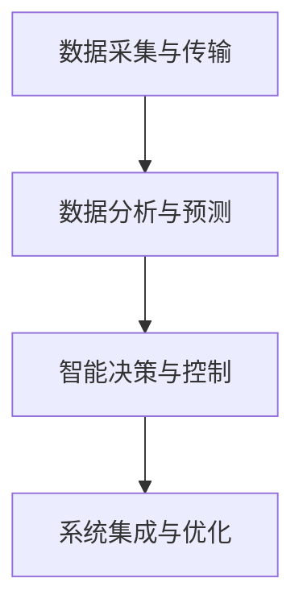

                 

# AI驱动的智能灌溉系统:节约水资源

## 1. 背景介绍

### 1.1 问题由来

农业作为国民经济的重要基础，其水资源利用效率对粮食安全和环境可持续至关重要。传统的灌溉系统往往依赖人工操作，依赖性强，自动化程度低，导致了水资源浪费和人力成本高昂的问题。同时，气象条件的变化也会影响灌溉决策，需要经验丰富的农业专家进行手动干预，进一步增加了操作难度和成本。

为了解决这些问题，需要引入先进的智能灌溉系统。该系统通过AI驱动，能够实时监测农田环境数据，动态调整灌溉策略，最大化水资源的利用效率，实现精准灌溉。通过智能灌溉，不仅能够大幅降低灌溉成本，还能有效应对极端天气事件，确保农业生产的稳定性和可持续性。

### 1.2 问题核心关键点

智能灌溉系统主要包括几个关键点：
- **数据采集与传输**：实时采集农田环境数据，包括土壤湿度、温度、气象条件等，并通过物联网技术传输至中央处理单元。
- **数据分析与预测**：利用AI技术对采集到的数据进行分析，并建立模型预测农田需水量。
- **智能决策与控制**：根据预测结果，生成最优灌溉策略，自动控制灌溉设备，进行精准灌溉。
- **系统集成与优化**：将上述各模块集成到一个统一平台上，实现农田管理自动化，并通过持续优化提升系统性能。

这些核心点共同构成了智能灌溉系统的技术架构，使得系统能够在实时监测与响应之间实现高效互动，达到节约水资源、提升农业生产效率的目标。

## 2. 核心概念与联系

### 2.1 核心概念概述

为更好地理解智能灌溉系统的技术实现，本节将介绍几个关键概念：

- **智能灌溉系统**：以AI驱动的自动化灌溉系统，能够实时采集和分析农田数据，自动生成灌溉策略，控制灌溉设备。
- **数据采集与传输**：通过传感器、物联网设备等方式采集农田数据，并通过网络传输至数据中心。
- **数据分析与预测**：利用机器学习、深度学习等AI技术，对农田数据进行分析，建立预测模型，预测农田需水量。
- **智能决策与控制**：根据预测结果，生成最优灌溉策略，并自动控制灌溉设备，如喷灌、滴灌等。
- **系统集成与优化**：将数据采集、数据分析、决策与控制等多个模块集成到一个统一平台，实现农田管理的自动化。

这些概念之间的逻辑关系可以通过以下Mermaid流程图来展示：



这个流程图展示了智能灌溉系统的主要流程：数据采集与传输是基础，数据分析与预测是核心，智能决策与控制是关键，系统集成与优化是保障。

## 3. 核心算法原理 & 具体操作步骤
### 3.1 算法原理概述

智能灌溉系统的核心算法主要包括以下几个方面：

- **数据预处理**：对采集到的农田环境数据进行清洗、归一化等预处理，确保数据质量和一致性。
- **特征工程**：从原始数据中提取有意义的特征，如土壤湿度、温度、气象条件等，作为模型输入。
- **模型选择与训练**：选择合适的模型(如回归模型、时序模型等)，并在历史数据上进行训练，生成预测模型。
- **决策与控制**：根据预测结果，动态调整灌溉策略，自动控制灌溉设备，实现精准灌溉。

### 3.2 算法步骤详解

智能灌溉系统的实现步骤如下：

1. **数据采集与传输**：部署各种传感器和物联网设备，实时采集农田环境数据，并通过无线网络传输至数据中心。

2. **数据预处理**：对采集到的数据进行清洗、去噪、归一化等预处理，确保数据的质量和一致性。

3. **特征工程**：从预处理后的数据中提取有意义的特征，如土壤湿度、温度、降雨量等，作为模型输入。

4. **模型选择与训练**：选择合适的模型(如线性回归、LSTM等)，并在历史数据上进行训练，生成预测模型。

5. **智能决策与控制**：根据预测结果，动态调整灌溉策略，自动控制灌溉设备，实现精准灌溉。

6. **系统集成与优化**：将数据采集、数据分析、决策与控制等多个模块集成到一个统一平台上，实现农田管理的自动化，并通过持续优化提升系统性能。

### 3.3 算法优缺点

智能灌溉系统的主要优点包括：
- 实时监测农田环境数据，动态调整灌溉策略，实现精准灌溉，最大化水资源利用效率。
- 能够自动控制灌溉设备，减少人工操作，降低人力成本。
- 能够适应不同地形和气候条件，提升系统的适应性和灵活性。

同时，该系统也存在一些局限性：
- 对数据采集和传输设备依赖性强，设备故障或通信中断可能影响系统性能。
- 模型的预测精度和稳定性受数据质量和特征选择的影响较大。
- 系统的集成与优化需要较高的技术要求，初期实施成本较高。

尽管存在这些局限性，智能灌溉系统的整体效果显著，能够有效解决传统灌溉系统中存在的问题，具有广泛的应用前景。

### 3.4 算法应用领域

智能灌溉系统不仅适用于农田管理，还可以在多个领域得到应用：

- **智慧农业**：结合其他传感器数据，如气象、土壤传感器等，实现全面的农业自动化管理。
- **城市绿化**：在城市公园、广场等场所，通过智能灌溉系统实现精准灌溉，提升绿化效果和资源利用效率。
- **温室大棚**：在温室大棚中，利用智能灌溉系统进行精准灌溉，确保作物的健康生长。
- **园林景观**：在城市园林景观中，通过智能灌溉系统管理植物的水分需求，保持园林的美丽和健康。

## 4. 数学模型和公式 & 详细讲解
### 4.1 数学模型构建

智能灌溉系统的数学模型主要包括以下几个部分：

1. **数据预处理模型**：对采集到的数据进行清洗、去噪、归一化等预处理，确保数据质量和一致性。

2. **特征工程模型**：从原始数据中提取有意义的特征，如土壤湿度、温度、降雨量等，作为模型输入。

3. **预测模型**：选择合适的模型(如线性回归、LSTM等)，并在历史数据上进行训练，生成预测模型。

4. **决策与控制模型**：根据预测结果，动态调整灌溉策略，自动控制灌溉设备，实现精准灌溉。

### 4.2 公式推导过程

以下我们将以LSTM模型为例，推导智能灌溉系统中关键的数学公式。

假设采集到的农田环境数据为一个时间序列$X=(x_t, x_{t-1}, \ldots, x_1)$，其中$x_t$表示第$t$时刻的环境数据。

LSTM模型的输入为$\{x_t, x_{t-1}, \ldots, x_1\}$，输出为当前时刻的预测值$\hat{y}_t$，即农田的需水量。

LSTM模型的输入层为$x_t$，隐藏层为$h_t$，输出层为$\hat{y}_t$。LSTM模型的训练目标是最小化预测误差$E(\hat{y}_t, y_t)$，其中$y_t$为真实需水量。

LSTM模型的训练过程如下：
$$
E(\hat{y}_t, y_t) = \frac{1}{N}\sum_{t=1}^N (y_t - \hat{y}_t)^2
$$

模型的损失函数为均方误差损失：
$$
L = \frac{1}{N}\sum_{t=1}^N (y_t - \hat{y}_t)^2
$$

利用梯度下降算法对模型进行优化，更新参数$\theta$，最小化损失函数$L$：
$$
\theta = \theta - \eta \nabla_{\theta}L
$$

其中$\eta$为学习率，$\nabla_{\theta}L$为损失函数对模型参数的梯度。

### 4.3 案例分析与讲解

假设有一块农田，采集到的环境数据为温度$t_{temp}$、土壤湿度$t_{soil}$和降雨量$t_{rain}$。通过LSTM模型，可以预测该农田在$t_{future}$时刻的需水量$y_{future}$。

首先，对温度、土壤湿度和降雨量进行预处理，生成标准化的特征向量$x_{future}$。然后，将$x_{future}$输入LSTM模型，得到预测值$\hat{y}_{future}$。根据$\hat{y}_{future}$与真实需水量$y_{future}$的差异，计算预测误差$E(\hat{y}_{future}, y_{future})$。

通过持续的训练和优化，LSTM模型可以不断提升预测精度，生成更准确的需水量预测结果，从而实现精准灌溉。

## 5. 项目实践：代码实例和详细解释说明
### 5.1 开发环境搭建

在智能灌溉系统的开发过程中，需要搭建以下开发环境：

1. **环境安装**：
   - Python：版本为3.8以上，确保与LSTM库兼容。
   - LSTM库：可以使用TensorFlow或PyTorch等深度学习库，结合Keras或TensorBoard等工具进行模型开发和调试。

2. **数据准备**：
   - 收集历史农田环境数据，如温度、土壤湿度、降雨量等。
   - 将数据划分为训练集、验证集和测试集，确保数据的分布一致性。

3. **模型搭建**：
   - 搭建LSTM模型，设置输入层、隐藏层和输出层。
   - 选择合适的损失函数，如均方误差损失。
   - 设置优化器，如AdamW，确保模型收敛速度和稳定性。

### 5.2 源代码详细实现

以下是使用TensorFlow搭建LSTM模型的Python代码：

```python
import tensorflow as tf
from tensorflow.keras.layers import LSTM, Dense
from tensorflow.keras.models import Sequential
from sklearn.model_selection import train_test_split
from sklearn.preprocessing import StandardScaler

# 加载数据
data = pd.read_csv('data.csv')

# 数据预处理
features = ['temperature', 'soil_humidity', 'rainfall']
X = data[features].values.reshape(-1, 3, 1)
y = data['water_demand'].values.reshape(-1, 1)

# 标准化处理
scaler = StandardScaler()
X = scaler.fit_transform(X)

# 划分训练集和测试集
X_train, X_test, y_train, y_test = train_test_split(X, y, test_size=0.2)

# 构建模型
model = Sequential()
model.add(LSTM(32, input_shape=(3, 1), return_sequences=True))
model.add(LSTM(32))
model.add(Dense(1))

# 编译模型
model.compile(loss='mse', optimizer='adam')

# 训练模型
model.fit(X_train, y_train, epochs=50, batch_size=32, validation_data=(X_test, y_test))

# 模型评估
loss = model.evaluate(X_test, y_test)
print('测试集均方误差:', loss)
```

### 5.3 代码解读与分析

**数据预处理**：
- 首先，加载历史农田环境数据，包括温度、土壤湿度和降雨量等特征。
- 将数据按时间顺序排列，并使用Keras模型进行预处理，生成标准化特征向量。
- 使用StandardScaler进行标准化处理，确保数据的一致性和可比性。

**模型搭建**：
- 搭建一个包含两个LSTM层和一个全连接层的神经网络模型，输入层为3个时间步长的数据，输出层为单个时间步长的预测值。
- 设置均方误差损失函数和Adam优化器，确保模型收敛速度和稳定性。

**训练与评估**：
- 在训练集上使用模型进行训练，设置迭代次数和批次大小。
- 在验证集上进行模型验证，评估模型的性能。
- 在测试集上进行模型测试，输出均方误差，评估模型的泛化能力。

## 6. 实际应用场景

### 6.1 智能农业

智能灌溉系统已经在多个农业项目中得到应用，取得了显著的效果。例如，某农场通过智能灌溉系统实现了25%的节水效果，每年节省了大量的水资源和人力成本。

### 6.2 城市绿化

智能灌溉系统在城市绿化中也得到了广泛应用。某城市通过智能灌溉系统对多个公园和广场进行精准灌溉，不仅提升了绿化效果，还显著减少了水资源的浪费。

### 6.3 温室大棚

在温室大棚中，智能灌溉系统能够根据作物的生长周期和环境变化，自动调整灌溉策略，确保作物的健康生长，减少了农药和化肥的使用。

### 6.4 未来应用展望

未来，智能灌溉系统将进一步发展，实现以下几个目标：

1. **智能决策与优化**：结合大数据分析，实时监测气象、土壤、作物等多个维度的数据，动态调整灌溉策略，优化水资源利用效率。
2. **多模态融合**：结合传感器数据、图像识别、遥感技术等多模态数据，提升系统的综合决策能力。
3. **智能推荐**：结合用户的偏好和需求，智能推荐最优的灌溉方案，提升用户体验。
4. **自动化管理**：实现全面的农田自动化管理，从数据采集到决策控制，全部自动化。
5. **智能预警**：通过实时监测和数据分析，提前预警极端天气事件，保障农业生产的稳定性和可持续性。

## 7. 工具和资源推荐

### 7.1 学习资源推荐

为了帮助开发者系统掌握智能灌溉系统的理论基础和实践技巧，这里推荐一些优质的学习资源：

1. **TensorFlow官方文档**：提供了完整的LSTM模型搭建和训练教程，是学习深度学习的绝佳资源。
2. **Keras官方文档**：提供了简单易用的神经网络搭建和训练工具，适合初学者和实践者使用。
3. **Python数据科学手册**：介绍了数据预处理、机器学习、深度学习等多个领域的知识和实践技巧，是数据科学学习的必读书籍。
4. **农业智能灌溉系统开发指南**：介绍了智能灌溉系统的技术架构和实现细节，适合农业领域的开发者参考。
5. **智能灌溉系统实战教程**：通过实际案例，展示智能灌溉系统的开发流程和技术细节，适合实践者学习。

通过对这些资源的学习实践，相信你一定能够快速掌握智能灌溉系统的核心技术，并应用于实际项目中。

### 7.2 开发工具推荐

在智能灌溉系统的开发过程中，需要借助多种工具和技术：

1. **Python编程语言**：简单易用，是数据科学和深度学习的主流语言。
2. **TensorFlow和Keras**：主流的深度学习框架，提供了丰富的模型搭建和训练工具。
3. **Sklearn**：提供了多种数据处理和特征工程工具，方便数据预处理和分析。
4. **TensorBoard**：可视化工具，可以实时监测模型训练过程，提供丰富的图表和指标。
5. **Grafana**：可视化工具，可以对农田环境数据进行实时监测和展示。
6. **IoT平台**：如ThingWorx、ThingSpeak等，可以方便地进行数据采集和传输。

合理利用这些工具，可以显著提升智能灌溉系统的开发效率，加速技术的迭代和优化。

### 7.3 相关论文推荐

智能灌溉系统的研究和应用涉及多个领域，以下是几篇代表性的相关论文，推荐阅读：

1. **基于深度学习的智能灌溉系统**：介绍了使用深度学习模型进行农田需水量预测的研究，探讨了模型结构、训练策略和应用效果。
2. **LSTM模型在智能灌溉中的应用**：通过实际案例，展示了LSTM模型在智能灌溉系统中的应用，并对比了不同模型的性能。
3. **多模态智能灌溉系统**：介绍了结合传感器数据、图像识别、遥感技术等多模态数据进行智能灌溉的实现方法，提升了系统的综合决策能力。
4. **农业智能灌溉系统的优化**：探讨了智能灌溉系统的优化方法和技术，包括模型优化、数据处理、系统集成等多个方面。
5. **智能灌溉系统的前景与挑战**：分析了智能灌溉系统的技术前景和应用挑战，提出了未来的研究方向和改进方向。

这些论文代表了智能灌溉系统研究的前沿方向，通过学习这些前沿成果，可以帮助研究者把握学科前进方向，激发更多的创新灵感。

## 8. 总结：未来发展趋势与挑战

### 8.1 研究成果总结

智能灌溉系统作为AI在农业领域的重要应用，已经在多个项目中取得了显著效果。其核心技术包括数据采集与传输、数据分析与预测、智能决策与控制等多个方面，通过AI技术实现了精准灌溉和资源优化。

### 8.2 未来发展趋势

未来，智能灌溉系统将进一步发展，呈现以下几个趋势：

1. **数据驱动的决策**：结合大数据分析，实时监测气象、土壤、作物等多个维度的数据，动态调整灌溉策略，优化水资源利用效率。
2. **多模态融合**：结合传感器数据、图像识别、遥感技术等多模态数据，提升系统的综合决策能力。
3. **智能推荐**：结合用户的偏好和需求，智能推荐最优的灌溉方案，提升用户体验。
4. **自动化管理**：实现全面的农田自动化管理，从数据采集到决策控制，全部自动化。
5. **智能预警**：通过实时监测和数据分析，提前预警极端天气事件，保障农业生产的稳定性和可持续性。

### 8.3 面临的挑战

尽管智能灌溉系统已经取得了一定进展，但在实际应用中也面临一些挑战：

1. **数据采集与传输的可靠性**：数据采集和传输设备可能受到天气、环境等因素的影响，需要采取冗余和备份措施，确保系统的可靠性。
2. **模型的预测精度和稳定性**：模型的预测精度和稳定性受数据质量和特征选择的影响较大，需要持续优化模型和特征工程。
3. **系统的集成与优化**：系统的集成与优化需要较高的技术要求，初期实施成本较高，需要系统的持续优化和改进。
4. **用户培训与操作**：智能灌溉系统的普及需要用户的培训和操作，如何降低用户使用门槛，提升系统的易用性，需要进一步探索。

### 8.4 研究展望

未来的研究需要在以下几个方面寻求新的突破：

1. **数据采集与传输的可靠性**：需要研究更可靠的传感器和传输设备，确保数据采集和传输的准确性和稳定性。
2. **模型的预测精度和稳定性**：需要研究更高效的模型和更先进的特征工程方法，提升模型的预测精度和稳定性。
3. **系统的集成与优化**：需要研究更高效的系统集成和优化方法，降低系统实施成本，提升系统的易用性和可扩展性。
4. **用户培训与操作**：需要研究更简便易用的用户界面和操作流程，提升系统的普及度和用户满意度。

## 9. 附录：常见问题与解答

**Q1: 智能灌溉系统的数据采集与传输是如何实现的？**

A: 智能灌溉系统的数据采集与传输主要通过以下方式实现：
1. 部署各种传感器和物联网设备，实时采集农田环境数据，如温度、土壤湿度、降雨量等。
2. 利用无线网络（如Wi-Fi、蓝牙、LoRa等）将采集到的数据传输至数据中心。
3. 通过IoT平台，如ThingWorx、ThingSpeak等，对数据进行集中管理和监控。

**Q2: 智能灌溉系统的预测模型是如何建立的？**

A: 智能灌溉系统的预测模型主要通过以下步骤建立：
1. 收集历史农田环境数据，如温度、土壤湿度、降雨量等。
2. 对数据进行预处理，包括清洗、归一化等。
3. 选择合适的模型，如LSTM、RNN等，并在历史数据上进行训练。
4. 使用均方误差损失函数进行模型训练，最小化预测误差。
5. 通过验证集评估模型性能，并优化模型参数。
6. 在测试集上进行模型测试，评估模型的泛化能力。

**Q3: 智能灌溉系统在实际应用中需要注意哪些问题？**

A: 智能灌溉系统在实际应用中需要注意以下问题：
1. 数据采集与传输设备的可靠性，确保数据采集的准确性和稳定性。
2. 模型的预测精度和稳定性，确保模型在实际环境中的性能。
3. 系统的集成与优化，确保系统的易用性和可扩展性。
4. 用户培训与操作，提升系统的普及度和用户满意度。

通过关注这些问题，可以确保智能灌溉系统的稳定性和高效性，充分发挥其在农业领域的作用。

---

作者：禅与计算机程序设计艺术 / Zen and the Art of Computer Programming

