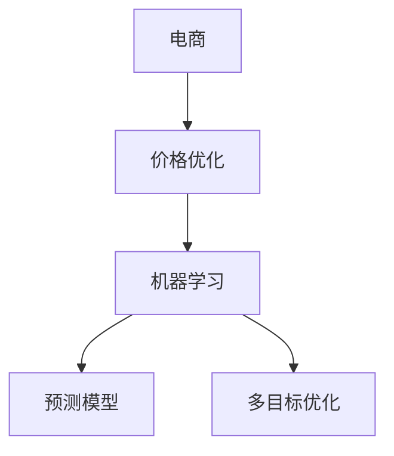

                 

# AI驱动的电商价格优化

> 关键词：电商, 价格优化, AI, 算法, 数学模型, 项目实践, 未来展望

## 1. 背景介绍

### 1.1 问题由来
随着电商行业的迅速发展，商家面临着日益激烈的市场竞争和复杂的价格管理挑战。合理的定价策略不仅能提升销售额，还能改善客户体验，增强市场竞争力。传统的手动定价方法耗时耗力，且难以兼顾多个维度的业务指标。因此，利用人工智能技术，自动化地进行电商价格优化，成为了电商企业的迫切需求。

### 1.2 问题核心关键点
电商价格优化是AI在电商领域的重要应用之一，其核心在于：
- 利用机器学习算法对海量历史交易数据进行分析，发现价格与销量、库存、竞品价格等关键因素之间的关联关系。
- 基于已有的关联关系，通过预测模型预测不同价格下的销量，找到最优价格。
- 考虑多个业务目标（如利润最大化、市场份额提升等）的综合影响，制定符合企业战略的价格优化方案。

### 1.3 问题研究意义
电商价格优化对于提升电商企业的运营效率和市场竞争力具有重要意义：
- 自动化的价格优化系统能实时响应市场变化，动态调整价格，增强企业的市场响应能力。
- 通过优化价格，商家可以最大化利润，提升销售额和市场份额。
- 精准的定价策略能提升客户满意度，降低退换货率，提高客户粘性。
- 对竞品价格进行监控和响应，有助于企业保持竞争优势。
- 能整合多渠道销售数据，进行跨平台的价格策略制定。

## 2. 核心概念与联系

### 2.1 核心概念概述

为更好地理解AI驱动的电商价格优化方法，本节将介绍几个密切相关的核心概念：

- 电商（Electronic Commerce）：指利用互联网平台进行商品买卖的交易方式，是现代商业的重要组成部分。
- 价格优化（Price Optimization）：指通过数学模型和算法，根据市场变化动态调整商品价格，以达到最优利润和客户满意度。
- 机器学习（Machine Learning）：指通过训练数据，让计算机系统具备自动识别和决策的能力。
- 预测模型（Prediction Model）：指通过历史数据训练得到，用于预测未来事件的模型，如线性回归、决策树、神经网络等。
- 多目标优化（Multi-objective Optimization）：指在考虑多个业务目标（如利润、客户满意度、市场份额等）时，找到最优的决策方案。

这些核心概念之间的逻辑关系可以通过以下Mermaid流程图来展示：



这个流程图展示了大语言模型的核心概念及其之间的关系：

1. 电商通过利用机器学习技术，进行价格优化。
2. 价格优化利用预测模型，预测不同价格下的销量，进而进行价格调整。
3. 多目标优化在考虑多种业务目标时，帮助制定最优价格策略。

这些概念共同构成了AI驱动的电商价格优化的学习和应用框架，使其能够在电商行业中发挥强大的决策辅助作用。通过理解这些核心概念，我们可以更好地把握AI驱动价格优化的工作原理和优化方向。

## 3. 核心算法原理 & 具体操作步骤
### 3.1 算法原理概述

AI驱动的电商价格优化，本质上是一种基于历史数据进行预测，并根据预测结果进行实时价格调整的方法。其核心思想是：通过机器学习算法，建立价格与销量、库存、竞品价格等关键变量之间的关系，然后利用预测模型进行价格预测，最后通过多目标优化策略，确定最优的价格。

形式化地，假设电商销售平台上有N种商品，每种商品的初始价格为 $p_i$，初始销量为 $s_i$，目标利润为 $P$，竞争对手价格为 $p_{comp_i}$。我们的目标是找到价格向量 $p^*$，使得总利润最大化。即：

$$
\max_{p_i} P = \sum_{i=1}^N p_i s_i - \sum_{i=1}^N c_i p_i
$$

其中 $c_i$ 为商品的固定成本。

### 3.2 算法步骤详解

AI驱动的电商价格优化一般包括以下几个关键步骤：

**Step 1: 数据收集与预处理**
- 收集电商平台历史交易数据，包括商品ID、价格、销量、库存、时间戳、用户行为等。
- 清洗数据，处理缺失值、异常值，并进行特征工程，提取对价格优化有用的特征。

**Step 2: 建模与训练**
- 选择合适的机器学习算法，如线性回归、决策树、随机森林、神经网络等，建立价格与销量、库存、竞品价格等关键变量之间的关系。
- 使用历史交易数据对模型进行训练，确保模型能够准确预测不同价格下的销量。

**Step 3: 价格预测**
- 输入当前商品的销量、库存、竞品价格等数据，利用训练好的预测模型，预测该商品在不同价格下的销量。

**Step 4: 多目标优化**
- 设定多个优化目标，如利润最大化、市场份额提升等。
- 使用多目标优化算法（如NSGA-II、Pareto前支配排序等），综合考虑多个目标，找到最优价格策略。

**Step 5: 动态调价**
- 根据预测结果，实时调整商品价格，并记录调价效果。
- 定期重新训练模型，确保预测准确度。

以上是AI驱动电商价格优化的基本流程。在实际应用中，还需要根据具体业务需求，对模型进行优化和调整，如引入时间序列分析、情感分析等高级技术。

### 3.3 算法优缺点

AI驱动的电商价格优化方法具有以下优点：
1. 高效实时：自动化系统可以实时响应市场变化，快速调整价格，提高市场响应速度。
2. 高精度：通过历史数据训练的预测模型，可以准确预测不同价格下的销量，实现更精准的价格优化。
3. 易于部署：模型训练和优化可以通过编程实现，容易集成到现有的电商系统中。
4. 可扩展性：系统可以根据业务需求灵活调整优化目标，适用于多种电商场景。

同时，该方法也存在一定的局限性：
1. 数据质量要求高：模型效果依赖于高质量的历史交易数据，数据缺失或噪声将严重影响预测结果。
2. 预测复杂性：电商环境复杂多变，预测模型难以完全捕捉所有影响因素，可能存在预测误差。
3. 模型黑盒性：预测模型的内部工作机制难以解释，难以进行调试和优化。
4. 算法复杂性：多目标优化算法计算复杂度较高，求解耗时较长，需考虑计算效率。

尽管存在这些局限性，但就目前而言，基于AI的电商价格优化方法仍是最主流的价格策略制定方式。未来相关研究的重点在于如何进一步降低数据依赖，提高模型的预测精度和可解释性，同时兼顾计算效率和复杂度。

### 3.4 算法应用领域

AI驱动的电商价格优化技术，在电商领域已经得到了广泛的应用，覆盖了几乎所有常见场景，例如：

- 商品定价策略：根据历史销量、库存、竞品价格等数据，预测不同价格下的销量，优化商品定价策略。
- 库存管理：通过预测模型，预测不同价格下的库存水平，进行动态调整，避免库存积压或短缺。
- 市场推广：利用价格优化模型，优化广告投放和促销活动，提升市场份额和销售收入。
- 竞品监控：实时监控竞争对手的价格变化，及时调整自身价格策略，保持市场竞争优势。
- 个性化定价：根据用户行为数据，预测不同用户对不同价格的反应，进行个性化定价，提升客户满意度。

除了上述这些经典场景外，AI驱动的电商价格优化还被创新性地应用到更多场景中，如跨平台价格协调、客户行为分析、情感分析等，为电商技术带来了全新的突破。随着AI技术的发展和电商系统的优化，相信电商价格优化将继续向更精准、更智能、更灵活的方向发展。

## 4. 数学模型和公式 & 详细讲解  
### 4.1 数学模型构建

本节将使用数学语言对AI驱动的电商价格优化过程进行更加严格的刻画。

记电商平台上商品的初始价格为 $p_i$，初始销量为 $s_i$，目标利润为 $P$，竞争对手价格为 $p_{comp_i}$。则总利润公式为：

$$
P = \sum_{i=1}^N p_i s_i - \sum_{i=1}^N c_i p_i
$$

其中 $c_i$ 为商品的固定成本。

### 4.2 公式推导过程

以下我们以线性回归模型为例，推导价格预测的公式及其梯度计算方法。

假设模型 $M_{\theta}:\mathcal{X} \rightarrow \mathcal{Y}$，其中 $\mathcal{X}$ 为特征向量空间，$\mathcal{Y}$ 为销量预测空间，$\theta$ 为模型参数。设训练集为 $\{(x_i,y_i)\}_{i=1}^N$，其中 $x_i$ 为价格、库存、竞品价格等特征，$y_i$ 为对应的销量。

定义模型 $M_{\theta}$ 在输入 $x_i$ 上的预测销量为 $\hat{y}_i=M_{\theta}(x_i)$。则线性回归模型的损失函数为：

$$
\ell(M_{\theta}(x_i),y_i) = \frac{1}{2}(y_i - \hat{y}_i)^2
$$

在求解最小化损失函数的过程中，可以使用梯度下降算法进行优化，具体公式为：

$$
\theta \leftarrow \theta - \eta \nabla_{\theta}\ell(\theta)
$$

其中 $\eta$ 为学习率，$\nabla_{\theta}\ell(\theta)$ 为损失函数对参数 $\theta$ 的梯度，可通过反向传播算法高效计算。

### 4.3 案例分析与讲解

以某电商平台商品A为例，我们分析价格优化模型在实际应用中的计算过程。

假设商品A的初始价格为 $p=100$，当前库存为 $s=1000$，竞争对手价格为 $p_{comp}=90$。根据历史数据，建立价格与销量之间的线性回归模型 $M_{\theta}(p)=\theta_0+\theta_1p$。

首先，使用历史数据 $\{(p_i,s_i)\}_{i=1}^N$ 对模型进行训练，得到最优参数 $\theta^*$。假设训练后模型参数为 $\theta^*=(\theta_0^*,\theta_1^*)$，则有：

$$
\hat{y}_i = \theta_0^*+\theta_1^*p_i
$$

接下来，利用当前价格 $p=100$，计算预测销量 $\hat{y}=M_{\theta^*}(p)=\theta_0^*+\theta_1^*p=200$。

然后，根据利润优化目标 $P$ 和成本 $c$，利用多目标优化算法，综合考虑销量、价格、成本等因素，找到最优价格 $p^*$。

最后，将预测的销量和利润与实际数据进行对比，评估模型效果。

## 5. 项目实践：代码实例和详细解释说明
### 5.1 开发环境搭建

在进行电商价格优化项目实践前，我们需要准备好开发环境。以下是使用Python进行PyTorch开发的环境配置流程：

1. 安装Anaconda：从官网下载并安装Anaconda，用于创建独立的Python环境。

2. 创建并激活虚拟环境：
```bash
conda create -n pytorch-env python=3.8 
conda activate pytorch-env
```

3. 安装PyTorch：根据CUDA版本，从官网获取对应的安装命令。例如：
```bash
conda install pytorch torchvision torchaudio cudatoolkit=11.1 -c pytorch -c conda-forge
```

4. 安装TensorFlow：由Google主导开发的开源深度学习框架，生产部署方便，适合大规模工程应用。同样有丰富的预训练语言模型资源。

5. 安装各类工具包：
```bash
pip install numpy pandas scikit-learn matplotlib tqdm jupyter notebook ipython
```

完成上述步骤后，即可在`pytorch-env`环境中开始电商价格优化实践。

### 5.2 源代码详细实现

这里我们以线性回归模型为例，给出使用PyTorch进行电商价格优化的Python代码实现。

首先，定义价格与销量之间的关系：

```python
import torch
import torch.nn as nn
import torch.optim as optim

class PriceRegressionModel(nn.Module):
    def __init__(self, input_dim=1):
        super(PriceRegressionModel, self).__init__()
        self.linear = nn.Linear(input_dim, 1)
    
    def forward(self, x):
        return self.linear(x)
```

然后，定义训练和评估函数：

```python
def train_model(model, train_data, test_data, learning_rate=0.01, epochs=100):
    train_loader = torch.utils.data.DataLoader(train_data, batch_size=64, shuffle=True)
    test_loader = torch.utils.data.DataLoader(test_data, batch_size=64, shuffle=False)
    
    optimizer = optim.SGD(model.parameters(), lr=learning_rate)
    loss_fn = nn.MSELoss()
    
    for epoch in range(epochs):
        model.train()
        for batch in train_loader:
            x, y = batch
            optimizer.zero_grad()
            y_pred = model(x)
            loss = loss_fn(y_pred, y)
            loss.backward()
            optimizer.step()
        
        model.eval()
        test_loss = 0
        with torch.no_grad():
            for batch in test_loader:
                x, y = batch
                y_pred = model(x)
                test_loss += loss_fn(y_pred, y).item()
        
        print(f'Epoch {epoch+1}, Train Loss: {train_loss:.3f}, Test Loss: {test_loss/len(test_loader):.3f}')
    
    return model
```

最后，启动训练流程并在测试集上评估：

```python
# 加载数据
train_data = ...
test_data = ...

# 训练模型
model = PriceRegressionModel()
model = train_model(model, train_data, test_data)

# 预测销量
p = 100
s = 1000
p_comp = 90
y_hat = model(torch.tensor([p]))
```

以上就是使用PyTorch进行电商价格优化的完整代码实现。可以看到，得益于PyTorch的强大封装，我们可以用相对简洁的代码完成价格预测。

### 5.3 代码解读与分析

让我们再详细解读一下关键代码的实现细节：

**PriceRegressionModel类**：
- `__init__`方法：初始化线性回归模型。
- `forward`方法：定义前向传播过程，输入特征向量 $x$，返回预测销量 $y$。

**训练和评估函数**：
- `train_model`方法：使用SGD优化算法，对模型进行训练，并计算训练集和测试集的损失。
- 数据加载器 `train_loader` 和 `test_loader`：分别对训练集和测试集进行批处理，供模型训练和推理使用。
- 损失函数 `loss_fn`：计算预测销量与实际销量的均方误差。

**训练流程**：
- 循环迭代 `epochs` 次，每次迭代在训练集上训练模型，在测试集上评估模型效果。
- 输出每次迭代后的训练损失和测试损失。

可以看到，PyTorch提供了简洁易用的API，可以快速搭建和训练价格预测模型。然而，这仅是价格优化系统的冰山一角，实际应用中还需要进一步扩展和优化。

## 6. 实际应用场景
### 6.1 智能推荐系统

智能推荐系统是电商平台的重要组成部分，通过预测用户对不同价格的反应，实现个性化定价，提升客户满意度。

具体而言，可以收集用户的历史浏览、购买记录，以及用户的搜索历史、点击行为等数据，作为模型输入，预测不同价格下的点击率和购买率。然后，根据预测结果，动态调整商品价格，进行个性化推荐。

### 6.2 价格动态调整

电商平台的商品价格往往是动态调整的，需要实时响应市场变化和用户需求。通过价格优化系统，可以自动化地进行价格调整，提高市场响应速度和精准度。

在实际应用中，可以根据商品的实时库存、竞争对手价格、季节性因素等，实时调整商品价格，确保价格策略始终与市场需求匹配。例如，当某商品库存不足时，可以提高价格吸引顾客，减少库存压力；当竞品价格下降时，可以相应降低本商品价格，保持市场竞争力。

### 6.3 市场份额提升

电商平台通过价格优化系统，可以提升市场份额和品牌影响力。通过精准定价，吸引更多用户购买商品，提升销量和市场份额。

例如，针对某热门商品，可以设计多种价格策略，满足不同消费水平和需求层次的用户。同时，结合促销活动和广告投放，可以进一步提升市场份额和用户粘性。

### 6.4 未来应用展望

随着AI技术的发展和电商系统的优化，基于AI的电商价格优化将继续向更精准、更智能、更灵活的方向发展。

在智慧零售领域，价格优化系统将与物联网、大数据、区块链等技术结合，实现全渠道、全过程的价格管理，提升运营效率和客户体验。

在绿色电商领域，价格优化系统将考虑环境因素，推动绿色商品和低碳营销，助力可持续发展。

在社交电商领域，价格优化系统将结合社交数据，优化社交媒体上的价格策略，提升社交影响力。

此外，在跨境电商、汽车电商等垂直领域，价格优化系统也将发挥重要作用，为电商企业带来新的业务增长点。

## 7. 工具和资源推荐
### 7.1 学习资源推荐

为了帮助开发者系统掌握电商价格优化的理论基础和实践技巧，这里推荐一些优质的学习资源：

1. 《机器学习实战》书籍：介绍机器学习的基本概念和算法，并结合电商领域实际案例进行讲解。
2. 《深度学习》课程：斯坦福大学开设的深度学习课程，讲解深度学习的基本原理和应用。
3. Coursera《数据科学导论》课程：涵盖数据收集、数据清洗、特征工程、模型训练等电商数据处理和建模的基本方法。
4. Kaggle平台：通过参加电商数据竞赛，实践电商价格优化和推荐系统算法。
5. PyTorch官方文档：详细的PyTorch教程和文档，供开发者快速上手价格优化项目开发。

通过对这些资源的学习实践，相信你一定能够快速掌握电商价格优化的精髓，并用于解决实际的电商问题。

### 7.2 开发工具推荐

高效的开发离不开优秀的工具支持。以下是几款用于电商价格优化开发的常用工具：

1. PyTorch：基于Python的开源深度学习框架，灵活动态的计算图，适合快速迭代研究。大部分预训练语言模型都有PyTorch版本的实现。
2. TensorFlow：由Google主导开发的开源深度学习框架，生产部署方便，适合大规模工程应用。同样有丰富的预训练语言模型资源。
3. Weights & Biases：模型训练的实验跟踪工具，可以记录和可视化模型训练过程中的各项指标，方便对比和调优。
4. Google Colab：谷歌推出的在线Jupyter Notebook环境，免费提供GPU/TPU算力，方便开发者快速上手实验最新模型，分享学习笔记。

合理利用这些工具，可以显著提升电商价格优化任务的开发效率，加快创新迭代的步伐。

### 7.3 相关论文推荐

电商价格优化技术的发展源于学界的持续研究。以下是几篇奠基性的相关论文，推荐阅读：

1. "Intelligent Pricing for Electronic Commerce"：介绍电商价格优化的基本方法和应用案例。
2. "Dynamic Pricing in E-commerce: A Survey"：对电商动态定价技术的全面综述，包括各种定价策略和算法。
3. "Deep Learning for Retail Price Optimization"：结合深度学习技术，提升电商价格优化的效果和精度。
4. "Price Optimization with Deep Neural Networks"：利用深度神经网络模型，预测电商价格优化中的销量和利润。
5. "Multi-Objective Optimization for Pricing and Inventory in E-commerce"：考虑多目标优化问题，提出电商定价和库存管理的综合性优化方案。

这些论文代表了大语言模型微调技术的发展脉络。通过学习这些前沿成果，可以帮助研究者把握电商价格优化的前进方向，激发更多的创新灵感。

## 8. 总结：未来发展趋势与挑战
### 8.1 总结

本文对AI驱动的电商价格优化方法进行了全面系统的介绍。首先阐述了电商价格优化的背景和意义，明确了价格优化在提升电商运营效率和市场竞争力方面的独特价值。其次，从原理到实践，详细讲解了电商价格优化的数学模型和算法步骤，给出了电商价格优化的完整代码实例。同时，本文还广泛探讨了价格优化方法在智能推荐、价格动态调整、市场份额提升等多个电商场景中的应用前景，展示了价格优化方法的巨大潜力。此外，本文精选了价格优化技术的各类学习资源，力求为读者提供全方位的技术指引。

通过本文的系统梳理，可以看到，AI驱动的电商价格优化方法正在成为电商企业的重要决策支持手段，极大地提升了电商运营的自动化水平和市场响应能力。未来，伴随AI技术的持续进步和电商系统的不断优化，相信电商价格优化将继续向更精准、更智能、更灵活的方向发展，为电商企业带来更大的业务价值和竞争优势。

### 8.2 未来发展趋势

展望未来，电商价格优化技术将呈现以下几个发展趋势：

1. 数据驱动：随着数据量的增长和数据质量的提升，电商价格优化将更加依赖于大数据和人工智能技术，实现更精准、更灵活的定价策略。
2. 实时化：电商价格优化系统将实现实时响应市场变化，快速调整商品价格，提高市场响应速度和精准度。
3. 个性化：通过分析用户行为和偏好，电商价格优化将实现更个性化、更智能的价格策略，提升客户满意度。
4. 跨渠道：电商价格优化将整合多渠道数据，实现跨平台、全渠道的价格策略优化，提升整体市场竞争力。
5. 智能化：结合AI技术，电商价格优化将实现更加智能化的决策，利用深度学习、强化学习等方法，提高价格优化的效果和效率。
6. 环境友好：考虑环境因素，推动绿色商品和低碳营销，实现可持续发展。

以上趋势凸显了电商价格优化的广阔前景。这些方向的探索发展，必将进一步提升电商运营的效率和客户体验，为电商企业带来更大的价值。

### 8.3 面临的挑战

尽管电商价格优化技术已经取得了瞩目成就，但在迈向更加智能化、普适化应用的过程中，它仍面临着诸多挑战：

1. 数据质量瓶颈：电商环境复杂多变，数据质量往往难以保证，数据缺失、噪声等问题将严重影响模型的预测效果。
2. 模型复杂性：电商价格优化的预测模型往往复杂多变，计算成本较高，求解复杂度较高。
3. 模型可解释性：预测模型的内部工作机制难以解释，难以进行调试和优化。
4. 业务目标协同：电商价格优化涉及多个业务目标，如何实现多目标协同优化，是一个重要的研究课题。
5. 实时计算要求：电商价格优化需要实时计算和动态调整，对计算资源和系统架构的要求较高。

尽管存在这些挑战，但通过持续的技术创新和实践探索，相信电商价格优化将继续向更高效、更智能、更灵活的方向发展，为电商企业带来更大的业务价值和市场竞争力。

### 8.4 研究展望

面对电商价格优化所面临的种种挑战，未来的研究需要在以下几个方面寻求新的突破：

1. 数据融合与清洗：提升数据质量和数据量，构建电商大数据平台，实现数据融合与清洗。
2. 实时计算技术：优化实时计算系统，实现高效的实时定价和库存管理。
3. 模型简化与优化：简化电商价格优化模型，提高计算效率，降低求解复杂度。
4. 模型可解释性：引入可解释性算法，增强模型的可解释性和透明性，便于调试和优化。
5. 多目标优化方法：研究多目标优化算法，实现多目标协同优化，提高模型效果。
6. 智能化决策支持：结合AI技术，提升电商价格优化的智能化决策支持能力。

这些研究方向的探索，必将引领电商价格优化技术迈向更高的台阶，为电商企业带来更大的业务价值和市场竞争力。面向未来，电商价格优化技术还需要与其他人工智能技术进行更深入的融合，如知识表示、因果推理、强化学习等，多路径协同发力，共同推动电商价格优化的进步。只有勇于创新、敢于突破，才能不断拓展电商价格优化的边界，让智能技术更好地造福电商行业。

## 9. 附录：常见问题与解答
**Q1：电商价格优化是否适用于所有电商场景？**

A: 电商价格优化在大多数电商场景上都能取得不错的效果，特别是对于数据量较小的场景。但对于一些特定领域的电商场景，如奢侈品、高端定制品等，价格策略的制定往往更多依赖于人工经验，因此模型的适用范围有所限制。

**Q2：电商价格优化如何考虑市场变化？**

A: 电商价格优化系统需要实时响应市场变化，通常采用以下方法：
1. 实时数据采集：通过API接口，实时获取市场数据，如竞品价格、促销活动、节假日等。
2. 动态调整价格：根据市场数据，动态调整商品价格，确保价格策略始终与市场需求匹配。
3. 多场景策略：针对不同场景，设计不同的价格策略，实现精准定价。

**Q3：电商价格优化如何考虑库存因素？**

A: 电商价格优化系统通常通过以下方法考虑库存因素：
1. 预测库存水平：利用历史数据和预测模型，预测商品的库存水平，确定最佳的库存量。
2. 动态定价：根据库存水平，动态调整商品价格，避免库存积压或短缺。
3. 库存优化：通过库存管理算法，优化库存配置，提高库存利用率。

**Q4：电商价格优化如何考虑用户需求？**

A: 电商价格优化系统通常通过以下方法考虑用户需求：
1. 用户画像分析：利用用户数据，构建用户画像，了解用户需求和购买偏好。
2. 个性化定价：根据用户画像，制定个性化定价策略，提升用户满意度。
3. 用户行为分析：利用用户行为数据，预测用户对不同价格的反应，进行动态调整。

**Q5：电商价格优化如何考虑市场竞争？**

A: 电商价格优化系统通常通过以下方法考虑市场竞争：
1. 竞品价格监控：实时监控竞品价格变化，及时调整自身价格策略。
2. 市场份额分析：利用市场数据，分析竞争对手的市场份额和定价策略，进行动态调整。
3. 竞争分析：通过竞争分析，制定差异化的价格策略，提升市场竞争力。

这些策略往往需要根据具体电商场景进行灵活组合。只有在数据、模型、业务等多个维度协同发力，才能真正实现电商价格优化的理想效果。总之，电商价格优化需要开发者根据具体业务需求，不断迭代和优化模型、数据和算法，方能得到理想的效果。

---

作者：禅与计算机程序设计艺术 / Zen and the Art of Computer Programming

