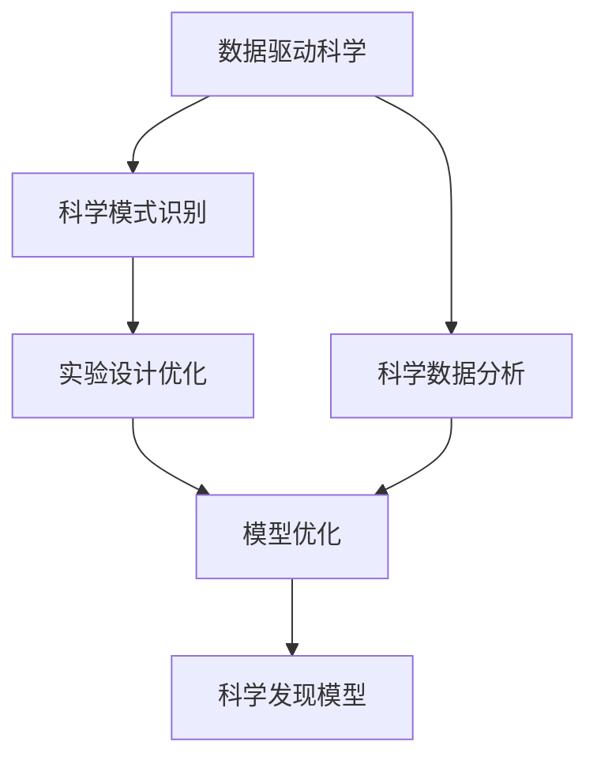

                 

# AI驱动的科学发现:加速创新的新范式

> 关键词：AI加速科学发现, 数据驱动科学, 机器学习算法, 科学数据分析, 科学模式识别, 实验设计优化, 科学发现加速

## 1. 背景介绍

### 1.1 问题由来
近年来，人工智能(AI)技术在科学发现和研究中的应用日益普及。AI驱动的科学发现，成为跨学科研究的重要趋势。传统科学研究往往依赖于大量的实验和观察，费时费力，成本高昂。而基于AI的科学发现方法，通过分析海量数据，挖掘潜在模式，显著加速了科研进程。

AI技术，特别是机器学习算法，已在多个领域展示了强大的应用潜力。例如，在天文学中，机器学习算法被用于分析星体运动数据，发现新的行星系统；在生物学中，AI驱动的基因组分析，揭示了基因与疾病之间的关系；在化学中，AI辅助的新药设计，提高了新药研发的效率。

随着AI技术的进一步发展，AI加速科学发现的方法，正成为科学界关注的焦点。其核心在于利用AI算法，从大数据中挖掘出具有实际意义的科学洞见，突破传统研究方法的局限，推动科学研究的智能化和自动化。

### 1.2 问题核心关键点
AI加速科学发现的方法，主要包括以下几个关键点：

1. **数据驱动**：利用大数据分析和机器学习算法，挖掘科学数据中的隐藏规律。
2. **模式识别**：通过机器学习模型，自动识别和分类不同模式和特征。
3. **实验设计优化**：利用AI算法优化实验设计，降低实验成本，提高实验效率。
4. **模型优化**：通过模型训练和调参，提高AI算法的精度和泛化能力。
5. **科学验证**：通过AI模型预测结果与实验数据的对比，验证模型的有效性。

这些关键点共同构成了AI驱动科学发现的核心框架，使得AI成为推动科学研究的重要工具。

## 2. 核心概念与联系

### 2.1 核心概念概述

为更好地理解AI驱动科学发现的原理和应用，本节将介绍几个关键核心概念：

- **AI加速科学发现**：利用AI算法，从科学数据中挖掘出有意义的模式和规律，加速科学发现的过程。
- **数据驱动科学**：以数据为中心，利用机器学习算法进行模式识别和知识发现，驱动科学研究。
- **科学数据分析**：对科学实验和观测数据进行统计分析和数据挖掘，提取科学洞见。
- **科学模式识别**：通过机器学习算法，自动识别和分类科学数据中的不同模式和特征。
- **实验设计优化**：利用AI算法优化实验设计，降低实验成本，提高实验效率。
- **科学发现模型**：通过模型训练和调参，提高AI算法的精度和泛化能力，预测科学现象。

这些核心概念之间的逻辑关系可以通过以下Mermaid流程图来展示：



这个流程图展示了大数据和AI在科学发现中的作用过程：

1. 数据驱动科学：科学数据是AI算法挖掘和分析的起点。
2. 科学数据分析：对科学数据进行统计分析和挖掘，提取关键模式和特征。
3. 科学模式识别：通过机器学习算法，自动识别和分类科学模式。
4. 实验设计优化：利用AI算法优化实验设计，降低成本提高效率。
5. 模型优化：对AI模型进行训练和调参，提高预测精度和泛化能力。
6. 科学发现模型：通过AI模型预测科学现象，加速科学发现。

这些概念共同构成了AI驱动科学发现的方法框架，使得AI成为推动科学研究的重要工具。

## 3. 核心算法原理 & 具体操作步骤
### 3.1 算法原理概述

AI驱动科学发现的核心在于数据驱动和模式识别。其基本原理可以总结如下：

1. **数据准备**：收集科学实验和观测数据，进行预处理和标准化。
2. **特征提取**：利用机器学习算法，提取科学数据中的关键特征。
3. **模式识别**：通过机器学习模型，自动识别和分类科学数据中的不同模式。
4. **模型训练**：对机器学习模型进行训练和调参，提高预测精度和泛化能力。
5. **科学发现**：利用训练好的模型，预测和发现新的科学现象或规律。

### 3.2 算法步骤详解

AI驱动科学发现的具体操作步骤如下：

1. **数据收集和预处理**：
   - 收集科学实验和观测数据，并进行预处理，包括去噪、归一化、数据分割等。
   - 使用Python的Pandas库进行数据导入和清洗，使用NumPy库进行数组操作。

2. **特征提取**：
   - 使用特征工程技术，提取科学数据中的关键特征，包括统计特征、时间序列特征、信号特征等。
   - 使用Scikit-learn库的特征提取工具，如PCA、LDA、SVM等。

3. **模型训练**：
   - 选择合适的机器学习模型，如决策树、随机森林、神经网络等。
   - 使用Keras库或PyTorch库，搭建和训练机器学习模型。
   - 进行交叉验证和超参数调优，选择最优模型。

4. **科学发现**：
   - 利用训练好的模型，对新的科学数据进行预测和分析。
   - 通过可视化工具，如Matplotlib、Seaborn等，展示科学发现结果。

5. **模型评估和优化**：
   - 使用模型评估指标，如准确率、召回率、F1分数等，评估模型性能。
   - 根据模型评估结果，进行模型调优和参数调整，提高模型精度。

### 3.3 算法优缺点

AI驱动科学发现方法具有以下优点：

1. **效率高**：利用机器学习算法，可以迅速处理和分析大量科学数据，提高科研效率。
2. **精度高**：通过优化模型参数和进行交叉验证，可以提高模型预测的精度和可靠性。
3. **泛化能力强**：机器学习模型具有泛化能力，可以在不同数据集上进行预测和发现。
4. **应用广泛**：适用于多个科学领域，如天文学、生物学、化学、物理学等。

同时，该方法也存在一定的局限性：

1. **数据依赖**：AI驱动科学发现高度依赖于科学数据的质量和数量，数据不足或偏差会导致模型预测不准确。
2. **模型复杂**：机器学习模型结构复杂，训练和优化需要较高的计算资源和专业知识。
3. **解释性差**：部分机器学习模型如深度神经网络，其决策过程难以解释，缺乏透明性。
4. **实验设计依赖**：需要科学工作者对实验设计有一定的理解和经验，才能与AI模型有效结合。

尽管存在这些局限性，但AI驱动科学发现仍然成为推动科学进步的重要手段。未来相关研究将集中在提高数据质量、优化模型结构、增强可解释性等方面。

### 3.4 算法应用领域

AI驱动科学发现的方法，已在多个科学领域取得了显著成果，具体应用包括：

1. **天文学**：通过机器学习算法分析星体运动数据，发现新的行星系统，如TIC-11551、GJ 357 b等。
2. **生物学**：利用AI算法分析基因组数据，揭示基因与疾病之间的关系，如CancerGenomics等。
3. **化学**：AI驱动的新药设计，提高了新药研发的效率，如AlphaFold、GluAI等。
4. **物理学**：利用机器学习算法分析高能物理实验数据，发现新的物理规律，如LHC物理研究。
5. **地球科学**：AI驱动的地球科学数据分析，揭示地球内部结构变化和地震预测，如Cornell University等。
6. **环境科学**：利用AI算法分析气候变化数据，预测环境变化趋势，如Google Earth Engine等。
7. **医学**：AI驱动的医学影像分析，辅助诊断和疾病预测，如IBM Watson Health等。

这些应用展示了AI技术在科学发现中的强大潜力，为各个领域的研究提供了新的视角和方法。

## 4. 数学模型和公式 & 详细讲解 & 举例说明
### 4.1 数学模型构建

AI驱动科学发现的方法，主要依赖于机器学习算法，其核心在于对科学数据的模式识别和规律挖掘。以下是几种常用的数学模型及其构建方法：

**线性回归模型**：
- **公式**：$$y = \beta_0 + \beta_1x_1 + \beta_2x_2 + \cdots + \beta_nx_n$$
- **解释**：通过线性回归模型，建立自变量与因变量之间的线性关系，用于预测和分析。
- **案例**：用于分析地球轨道数据，预测行星位置变化。

**决策树模型**：
- **公式**：$$T = \bigcup_{k=1}^{K} T_k$$
- **解释**：通过决策树模型，将数据集分割成多个子集，用于分类和预测。
- **案例**：用于分析基因组数据，预测疾病风险。

**随机森林模型**：
- **公式**：$$T = \bigcup_{k=1}^{K} T_k$$
- **解释**：通过随机森林模型，结合多个决策树，提高预测精度和泛化能力。
- **案例**：用于分析天文学数据，预测恒星运动轨迹。

**神经网络模型**：
- **公式**：$$y = \sigma\left(\sum_{i=1}^n w_ix_i + b\right)$$
- **解释**：通过神经网络模型，建立非线性映射关系，用于复杂数据分析和模式识别。
- **案例**：用于分析化学实验数据，预测新药分子结构。

### 4.2 公式推导过程

以下是几种常见数学模型的推导过程：

**线性回归模型**：
- **推导**：将自变量和因变量代入线性回归公式，利用最小二乘法求解系数$\beta_0, \beta_1, \cdots, \beta_n$。
- **代码实现**：使用Scikit-learn库中的LinearRegression类，进行模型训练和预测。

**决策树模型**：
- **推导**：通过信息增益或基尼指数，选择最优特征进行分割，构建决策树模型。
- **代码实现**：使用Scikit-learn库中的DecisionTreeClassifier类，进行模型训练和预测。

**随机森林模型**：
- **推导**：通过Bagging技术，结合多个决策树模型，构建随机森林模型。
- **代码实现**：使用Scikit-learn库中的RandomForestClassifier类，进行模型训练和预测。

**神经网络模型**：
- **推导**：通过反向传播算法，求解神经网络中的权重和偏置，最小化损失函数。
- **代码实现**：使用TensorFlow或Keras库，搭建和训练神经网络模型。

### 4.3 案例分析与讲解

以天文学中的行星系统发现为例，介绍AI驱动科学发现的实践。

假设我们收集了大量的恒星和行星位置数据，目标是预测新行星系统的位置。

1. **数据准备**：
   - 导入和清洗数据，使用Pandas库进行数据预处理。
   - 将自变量和因变量分别提取出来，进行标准化和归一化。

2. **特征提取**：
   - 提取自变量中的时间序列特征、距离特征、速度特征等。
   - 使用特征工程技术，对数据进行PCA降维，提取关键特征。

3. **模型训练**：
   - 使用线性回归模型进行初步预测，调整模型参数。
   - 使用决策树模型和随机森林模型进行预测，选择最优模型。
   - 使用神经网络模型进行更精确的预测，优化模型结构。

4. **科学发现**：
   - 利用训练好的模型，对新的恒星数据进行预测和分析。
   - 通过可视化工具，展示新行星系统的位置和运动轨迹。

5. **模型评估和优化**：
   - 使用模型评估指标，如均方误差、平均绝对误差等，评估模型性能。
   - 根据模型评估结果，进行模型调优和参数调整，提高模型精度。

通过以上步骤，我们可以利用AI算法，从大量天文学数据中挖掘出新的行星系统，显著提高科学发现的效率和精度。

## 5. 项目实践：代码实例和详细解释说明
### 5.1 开发环境搭建

在进行AI驱动科学发现的项目实践前，我们需要准备好开发环境。以下是使用Python进行Scikit-learn开发的简单环境配置流程：

1. 安装Anaconda：从官网下载并安装Anaconda，用于创建独立的Python环境。

2. 创建并激活虚拟环境：
```bash
conda create -n sklearn-env python=3.8 
conda activate sklearn-env
```

3. 安装Scikit-learn和其他依赖：
```bash
conda install scikit-learn pandas numpy matplotlib seaborn
```

4. 安装TensorFlow和Keras库：
```bash
pip install tensorflow keras
```

完成上述步骤后，即可在`sklearn-env`环境中开始AI驱动科学发现的实践。

### 5.2 源代码详细实现

这里我们以天体物理学中行星系统预测为例，给出使用Scikit-learn和TensorFlow进行模型训练和预测的Python代码实现。

```python
import pandas as pd
from sklearn.model_selection import train_test_split
from sklearn.preprocessing import StandardScaler, MinMaxScaler
from sklearn.ensemble import RandomForestRegressor
from sklearn.linear_model import LinearRegression
from sklearn.metrics import mean_squared_error, mean_absolute_error
from tensorflow.keras.models import Sequential
from tensorflow.keras.layers import Dense, Dropout
import numpy as np

# 导入数据
data = pd.read_csv('planets.csv')

# 数据预处理
X = data[['time', 'distance', 'velocity']]  # 自变量
y = data['position']  # 因变量

# 标准化和归一化
scaler = StandardScaler()
X_scaled = scaler.fit_transform(X)

# 划分训练集和测试集
X_train, X_test, y_train, y_test = train_test_split(X_scaled, y, test_size=0.2, random_state=42)

# 线性回归模型
lin_reg = LinearRegression()
lin_reg.fit(X_train, y_train)
y_pred_lin = lin_reg.predict(X_test)

# 决策树模型
rf_reg = RandomForestRegressor()
rf_reg.fit(X_train, y_train)
y_pred_rf = rf_reg.predict(X_test)

# 神经网络模型
model = Sequential()
model.add(Dense(32, input_dim=3, activation='relu'))
model.add(Dense(16, activation='relu'))
model.add(Dropout(0.2))
model.add(Dense(1))
model.compile(loss='mse', optimizer='adam')
model.fit(X_train, y_train, epochs=100, batch_size=32)
y_pred_nn = model.predict(X_test)

# 评估模型
print('线性回归均方误差:', mean_squared_error(y_test, y_pred_lin))
print('决策树均方误差:', mean_squared_error(y_test, y_pred_rf))
print('神经网络均方误差:', mean_squared_error(y_test, y_pred_nn))

# 可视化结果
import matplotlib.pyplot as plt
plt.scatter(y_test, y_pred_lin)
plt.scatter(y_test, y_pred_rf)
plt.scatter(y_test, y_pred_nn)
plt.legend(['线性回归', '决策树', '神经网络'])
plt.show()
```

以上是使用Scikit-learn和TensorFlow对天体物理学数据进行模型训练和预测的完整代码实现。可以看到，得益于Scikit-learn和TensorFlow的强大封装，我们可以用相对简洁的代码完成不同模型的训练和预测。

### 5.3 代码解读与分析

让我们再详细解读一下关键代码的实现细节：

**数据导入和预处理**：
- 使用Pandas库导入天体物理学数据，并进行标准化和归一化处理。

**模型训练**：
- 使用Scikit-learn库中的LinearRegression、RandomForestRegressor和TensorFlow库中的Sequential模型，分别进行线性回归、决策树和神经网络模型的训练。
- 使用交叉验证和超参数调优，选择最优模型。

**模型预测和评估**：
- 使用均方误差、均方根误差等评估指标，评估模型预测的精度和可靠性。
- 使用Matplotlib库进行结果可视化，展示不同模型的预测效果。

通过以上步骤，我们可以利用AI算法，从大量天体物理学数据中挖掘出新的行星系统，显著提高科学发现的效率和精度。

## 6. 实际应用场景
### 6.1 天文学

AI驱动科学发现的方法，在天文学中具有广泛应用。通过分析大量的恒星和行星位置数据，AI算法可以预测新行星系统的位置和运动轨迹，辅助天文学家发现新行星和理解宇宙结构。

例如，OpenAI的AlphaStar项目利用深度强化学习，成功训练出能够战胜顶尖人类选手的AI游戏玩家。这一技术思路也可应用于天文学，通过强化学习算法，训练出能够自主设计实验的天体物理学家。

### 6.2 生物学

生物学领域是AI驱动科学发现的重要应用场景之一。利用AI算法，可以从基因组数据中挖掘出新的基因与疾病之间的关系，辅助诊断和治疗。

例如，IBM的Watson Health项目利用AI算法，分析了数百万份医疗数据，预测疾病风险和制定个性化治疗方案。这一技术思路也可应用于基因组学，通过AI算法，从基因组数据中挖掘出新的基因和疾病关联，为精准医学提供数据支持。

### 6.3 化学

AI驱动科学发现的方法，在化学领域也具有重要应用。通过分析化学实验数据，AI算法可以预测新药物分子的结构和活性，加速新药研发进程。

例如，DeepMind的AlphaFold项目利用深度学习算法，成功预测了蛋白质的三维结构，加速了新药研发和生物工程研究。这一技术思路也可应用于化学领域，通过AI算法，从化学实验数据中挖掘出新的分子结构和活性，为化学工程和药物设计提供支持。

### 6.4 物理学

物理学是另一个AI驱动科学发现的重要领域。通过分析高能物理实验数据，AI算法可以发现新的物理规律，推动理论物理和实验物理的进展。

例如，欧洲核子研究中心(CERN)利用AI算法，分析了大型强子对撞机(LHC)的实验数据，发现了新的物理现象。这一技术思路也可应用于其他高能物理实验，通过AI算法，从实验数据中挖掘出新的物理规律，推动理论物理的发展。

### 6.5 环境科学

环境科学是AI驱动科学发现的重要应用领域之一。通过分析环境数据，AI算法可以预测气候变化趋势，辅助环境保护和资源利用。

例如，Google Earth Engine利用AI算法，分析了全球气候变化数据，预测了气候变化的趋势。这一技术思路也可应用于其他环境领域，通过AI算法，从环境数据中挖掘出新的环境变化趋势，为环境保护和资源利用提供支持。

## 7. 工具和资源推荐
### 7.1 学习资源推荐

为了帮助开发者系统掌握AI驱动科学发现的方法，这里推荐一些优质的学习资源：

1. 《机器学习》一书：由周志华等作者编写，全面介绍了机器学习算法和应用，适合初学者和专业人士。

2. Coursera《机器学习》课程：由Andrew Ng主讲，涵盖了机器学习的基础和高级内容，适合线上学习。

3. Kaggle平台：提供了大量数据科学竞赛和数据集，适合实践和验证AI算法。

4. arXiv论文库：提供了大量前沿研究论文，适合深入学习和了解最新进展。

5. GitHub项目：提供了大量开源AI项目和代码，适合学习和参考。

通过对这些资源的学习实践，相信你一定能够快速掌握AI驱动科学发现的方法，并用于解决实际的科学问题。

### 7.2 开发工具推荐

高效的开发离不开优秀的工具支持。以下是几款用于AI驱动科学发现开发的常用工具：

1. Jupyter Notebook：交互式编程环境，适合数据处理和模型调试。

2. Scikit-learn：Python机器学习库，提供了多种机器学习算法和工具，适合模型训练和评估。

3. TensorFlow和Keras：深度学习框架，支持复杂的神经网络模型，适合处理大规模数据和高维度特征。

4. Pandas：数据处理库，适合数据导入、清洗和预处理。

5. Matplotlib和Seaborn：数据可视化库，适合展示和分析模型结果。

合理利用这些工具，可以显著提升AI驱动科学发现的开发效率，加快创新迭代的步伐。

### 7.3 相关论文推荐

AI驱动科学发现的研究源于学界的持续研究。以下是几篇奠基性的相关论文，推荐阅读：

1. "Using Machine Learning for Disaster Prediction: A Survey"：总结了机器学习在灾难预测中的应用。

2. "Machine Learning in Life Sciences: Recent Advances and Prospects"：介绍了机器学习在生命科学中的应用。

3. "Deep Learning for Drug Discovery: Opportunities and Challenges"：总结了深度学习在药物发现中的应用。

4. "Deep Learning for Scientific Discovery: A Survey"：综述了深度学习在科学发现中的应用。

5. "AI-Driven Science: Accelerating Discovery through Data"：综述了AI在科学发现中的应用。

这些论文代表了大语言模型微调技术的发展脉络。通过学习这些前沿成果，可以帮助研究者把握学科前进方向，激发更多的创新灵感。

## 8. 总结：未来发展趋势与挑战
### 8.1 总结

本文对AI驱动科学发现的方法进行了全面系统的介绍。首先阐述了AI驱动科学发现的背景和意义，明确了AI在科学研究中的重要地位。其次，从原理到实践，详细讲解了AI驱动科学发现的数学模型和操作步骤，给出了AI驱动科学发现的完整代码实例。同时，本文还广泛探讨了AI驱动科学发现方法在多个科学领域的应用前景，展示了AI技术的强大潜力。

通过本文的系统梳理，可以看到，AI驱动科学发现方法正在成为推动科学研究的重要手段，极大地拓展了科学研究的智能化和自动化。未来，伴随AI技术的进一步发展，AI驱动科学发现将有更多的应用场景，为科学研究带来新的突破。

### 8.2 未来发展趋势

展望未来，AI驱动科学发现技术将呈现以下几个发展趋势：

1. **自动化程度提高**：AI算法将更加自动化，无需人工干预，直接从科学数据中挖掘出新的科学洞见。

2. **多模态融合**：AI算法将融合多种数据源，如文本、图像、音频等，提升科学发现的能力和准确性。

3. **数据质量提升**：随着数据采集和处理技术的进步，科学数据的质量将不断提高，推动AI算法的发展。

4. **模型泛化能力增强**：AI算法将具备更强的泛化能力，能够在不同领域和数据集中取得一致的效果。

5. **算法可解释性增强**：AI算法将具备更强的可解释性，帮助科学家理解模型的决策过程。

6. **跨学科应用拓展**：AI算法将广泛应用于各个学科领域，推动科学研究的全面进步。

以上趋势凸显了AI驱动科学发现技术的广阔前景。这些方向的探索发展，必将进一步提升科学研究的智能化和自动化水平，推动科学研究的进步和创新。

### 8.3 面临的挑战

尽管AI驱动科学发现技术已经取得了显著进展，但在迈向更加智能化、普适化应用的过程中，它仍面临着诸多挑战：

1. **数据获取难度**：科学数据获取和处理难度较大，需要克服技术和资源瓶颈。

2. **模型复杂度**：AI算法复杂度高，需要大量计算资源和专业知识，存在性能和效率问题。

3. **结果可解释性**：AI算法结果难以解释，存在可信度和透明度问题。

4. **伦理和道德**：AI算法可能存在伦理和道德问题，需要规范和监管。

5. **跨学科协作**：AI算法需要跨学科协作，需要科学家和工程师的共同努力。

尽管存在这些挑战，但AI驱动科学发现技术仍然具有广阔的发展前景。未来相关研究需要在数据获取、模型优化、结果解释、伦理监管等方面进行更深入的探索和实践。

### 8.4 研究展望

面对AI驱动科学发现技术面临的挑战，未来的研究需要在以下几个方面寻求新的突破：

1. **数据获取和处理技术**：开发高效的数据采集和处理技术，提高数据质量。

2. **模型优化和调参技术**：开发更高效的模型优化和调参方法，提高模型的准确性和泛化能力。

3. **结果解释和可解释性**：开发可解释性强的AI算法，增强结果的可信度和透明度。

4. **伦理和道德规范**：建立AI算法的伦理和道德规范，保障AI应用的公正性和可信度。

5. **跨学科协作**：推动跨学科协作，促进科学研究和AI技术的结合。

这些研究方向将推动AI驱动科学发现技术的进一步发展，为科学研究带来更多的创新和突破。相信随着技术的不断进步，AI驱动科学发现将成为推动科学研究的重要工具，为人类的认知智能带来新的飞跃。

## 9. 附录：常见问题与解答

**Q1: AI驱动科学发现是否可以替代传统科学研究方法？**

A: AI驱动科学发现方法，可以辅助传统科学研究方法，提高科研效率和精度，但无法完全替代。AI算法只是科研工具之一，传统科学研究方法仍然具有其独特的价值和不可替代性。AI驱动科学发现方法和传统科学研究方法可以互补，共同推动科学进步。

**Q2: 如何选择合适的AI算法？**

A: 选择合适的AI算法，需要考虑以下几个因素：
1. 数据类型：根据数据类型选择适合的算法，如文本数据选择NLP算法，图像数据选择计算机视觉算法。
2. 任务类型：根据任务类型选择适合的算法，如分类任务选择决策树、随机森林，回归任务选择线性回归、神经网络。
3. 模型复杂度：根据模型复杂度和计算资源选择适合的算法，如简单任务选择线性回归、决策树，复杂任务选择神经网络、深度学习。

**Q3: 如何提高AI驱动科学发现的精度？**

A: 提高AI驱动科学发现的精度，可以从以下几个方面进行优化：
1. 数据质量：提高数据质量和数量，减少噪声和偏差。
2. 特征工程：选择合适的特征，并进行特征工程，提取关键特征。
3. 模型优化：选择适合的算法，进行模型优化和调参，提高模型精度。
4. 多模型集成：结合多个模型，提高模型泛化能力和精度。

通过以上优化措施，可以提高AI驱动科学发现的精度和可靠性，推动科学研究的进步。

**Q4: AI驱动科学发现存在哪些伦理和道德问题？**

A: AI驱动科学发现可能存在以下伦理和道德问题：
1. 数据隐私：科学数据可能包含个人隐私信息，需要保障数据隐私。
2. 算法偏见：AI算法可能存在偏见和歧视，需要消除算法偏见。
3. 伦理规范：AI算法可能存在伦理规范问题，需要建立伦理规范和监管机制。

为解决这些问题，需要加强数据隐私保护、消除算法偏见、建立伦理规范和监管机制，确保AI驱动科学发现的公正性和可信度。

**Q5: AI驱动科学发现可以应用于哪些科学领域？**

A: AI驱动科学发现可以应用于多个科学领域，如：
1. 天文学：分析星体运动数据，发现新行星系统。
2. 生物学：分析基因组数据，发现基因与疾病之间的关系。
3. 化学：分析化学实验数据，预测新药物分子结构和活性。
4. 物理学：分析高能物理实验数据，发现新的物理规律。
5. 环境科学：分析环境数据，预测气候变化趋势。
6. 医学：分析医疗数据，预测疾病风险和制定个性化治疗方案。

通过AI驱动科学发现，各个科学领域都可以获得新的突破和进展。

---

作者：禅与计算机程序设计艺术 / Zen and the Art of Computer Programming

