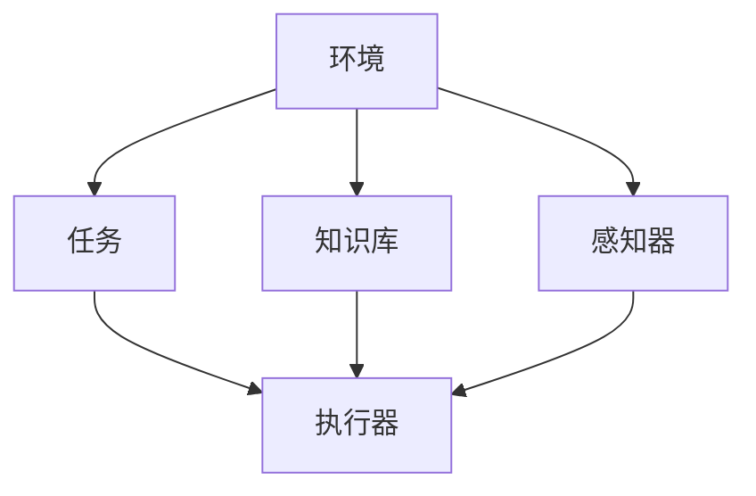

                 

## 1. 背景介绍

### 1.1 问题由来
在现代AI系统中，Agent（代理）扮演着至关重要的角色。它负责理解用户需求、执行相应任务、并与之进行自然语言交互。从智能助手到游戏玩家，从自动驾驶到金融交易，Agent在各种应用中广泛存在。随着AI技术的进步，Agent的功能日趋丰富，可以更好地理解上下文、处理复杂交互、执行多任务、优化策略等，不断提升用户体验和系统效率。

### 1.2 问题核心关键点
Agent的核心在于其决策与执行能力。现代Agent设计围绕着三个主要目标：可理解性、适应性和安全性。可理解性要求Agent能准确理解用户意图和环境变化；适应性要求Agent能快速调整策略以适应不同场景；安全性要求Agent能避免潜在风险和恶意攻击。为此，研究者们不断探索新的技术，如强化学习、多任务学习、迁移学习、对抗训练等，以提升Agent的智能水平。

### 1.3 问题研究意义
Agent代理技术对构建智能系统和提升用户体验具有重要意义：

1. **增强人机交互**：通过智能的Agent，实现自然流畅的语音和文本交互，使机器能够理解人类语言，提供个性化服务。
2. **优化决策过程**：Agent可以根据上下文信息，做出最优决策，优化任务执行效率。
3. **提高系统可靠性**：Agent可以处理异常情况和不可预测事件，提高系统的鲁棒性和可用性。
4. **促进业务创新**：Agent在金融、医疗、教育等多个领域的创新应用，提升了业务效率和用户满意度。
5. **推动技术进步**：Agent技术的发展催生了新的算法和理论，推动AI技术的整体进步。

## 2. 核心概念与联系

### 2.1 核心概念概述

Agent代理的概念源于人工智能的早期研究。它是一个自主的、能感知环境、并基于规则或学习做出反应的系统。Agent系统一般由环境、任务、知识库、执行器和感知器组成，并通过与环境交互来执行任务。

- **环境(Environments)**：Agent运行的外部世界，可以是虚拟世界或现实世界。
- **任务(Tasks)**：Agent需要完成的具体任务，如信息检索、游戏对战等。
- **知识库(Knowledge Bases)**：Agent的知识积累，包括事实、规则、模型等。
- **执行器(Actuators)**：Agent的输出端口，如传感器、控制器等。
- **感知器(Sensors)**：Agent的输入端口，如摄像头、麦克风等。

这些组件之间通过通信协议交互，共同构成一个完整的Agent系统。Agent代理的核心在于其自主性和智能性，使其能够独立思考、行动，并不断自我学习和优化。

### 2.2 核心概念原理和架构的 Mermaid 流程图



该图展示了Agent的基本架构，其中环境与感知器交互输入，任务与知识库指导执行器输出。这种结构设计旨在使Agent系统具备自主性、适应性和安全性。

## 3. 核心算法原理 & 具体操作步骤
### 3.1 算法原理概述

Agent代理系统的设计基于智能体的决策理论。智能体在环境中通过感知、决策、行动构成一个闭环。Agent的决策过程通常由价值函数、奖励函数、策略和模型构成。

- **价值函数(Value Function)**：衡量Agent决策的长期收益，即在特定状态下采取特定行动的累积奖励。
- **奖励函数(Reward Function)**：基于当前状态和行动的即时反馈，提供瞬时奖励。
- **策略(Policy)**：选择行动的策略，通常表示为概率分布。
- **模型(Model)**：描述环境状态的动态模型，用于预测未来状态。

Agent的决策过程通常通过强化学习、多任务学习、迁移学习和对抗训练等方法实现。强化学习通过试错迭代优化策略，多任务学习通过共享参数提升模型效率，迁移学习通过知识迁移加速适应新任务，对抗训练通过防御攻击提高模型鲁棒性。

### 3.2 算法步骤详解

**Step 1: 环境建模与感知**
- 构建环境模型：利用模拟器、真实数据或知识库，建立环境状态空间和动作空间。
- 设计感知器：选择传感器、特征提取器等，将环境信息转换为Agent可理解的形式。

**Step 2: 策略设计与优化**
- 确定决策策略：设计策略函数或神经网络模型，定义Agent的决策规则。
- 应用强化学习：通过迭代优化策略，最大化长期价值函数。

**Step 3: 模型训练与评估**
- 应用多任务学习：共享参数、数据和计算资源，提升模型的泛化能力。
- 应用迁移学习：利用预训练模型或知识库，快速适应新任务。

**Step 4: 系统集成与测试**
- 集成感知器、策略和执行器：构建完整的Agent系统。
- 设计评估指标：设计客观的评估标准，如任务完成率、响应时间、用户满意度等。

### 3.3 算法优缺点

Agent代理系统的优点在于其灵活性和智能性：

1. **灵活适应环境**：Agent可以自动调整策略以适应不同环境和任务。
2. **智能决策**：通过学习优化决策过程，提高任务执行效率。
3. **持续学习**：Agent可以在交互中不断学习，提高知识积累和问题解决能力。

其缺点在于其复杂性和挑战性：

1. **模型训练复杂**：构建准确的环境模型和策略模型需大量计算资源。
2. **安全性问题**：Agent需避免恶意攻击和潜在风险，提高安全性。
3. **鲁棒性不足**：在复杂环境中，Agent的决策过程可能不稳定。

### 3.4 算法应用领域

Agent代理技术已在多个领域得到广泛应用，例如：

- **自然语言处理(NLP)**：构建智能聊天机器人、智能客服系统等。
- **智能交通**：自动驾驶、交通信号灯控制等。
- **医疗诊断**：辅助诊断、病人监护等。
- **金融交易**：高频交易、风险管理等。
- **游戏设计**：智能对手、游戏策略优化等。

这些应用展示了Agent代理技术的广泛潜力和创新价值。

## 4. 数学模型和公式 & 详细讲解 & 举例说明

### 4.1 数学模型构建

Agent代理系统通常通过马尔可夫决策过程(MDP)进行建模。MDP由状态空间(S)、动作空间(A)、状态转移概率(P)、奖励函数(R)和折现因子(γ)组成。

- **状态空间(S)**：环境中所有可能的状态。
- **动作空间(A)**：Agent可采取的行动。
- **状态转移概率(P)**：从当前状态到下一个状态的转移概率。
- **奖励函数(R)**：对每个状态的即时奖励。
- **折现因子(γ)**：评估未来奖励的重要性。

### 4.2 公式推导过程

Agent代理系统的决策目标是通过策略π最大化长期奖励：

$$
\max_\pi \mathbb{E}_\pi \left[ \sum_{t=0}^\infty \gamma^t R(s_t, a_t) \right]
$$

其中，$\mathbb{E}_\pi$表示在策略$\pi$下的期望。

为了求解最优策略π，可以通过值迭代或策略迭代方法，将问题转化为求解最优值函数V(s)或最优策略π(s)。

值迭代的更新公式为：

$$
V(s_t) \leftarrow (1-\alpha)V(s_t) + \alpha \left( R(s_t, a_t) + \gamma \max_{a'} V(s_{t+1}) \right)
$$

其中，$\alpha$为学习率，$R(s_t, a_t)$为即时奖励，$V(s_{t+1})$为下一个状态的期望值。

### 4.3 案例分析与讲解

考虑一个简单的Agent代理系统，用于优化物流配送路线。环境由起点、终点和路径组成，动作空间为选择下一个节点，奖励函数为按时到达奖励。

假设起点为(s0)，终点为(s1)，路径有三种选择(a0, a1, a2)，节点之间的转移概率为0.9，折现因子γ=0.9。

通过值迭代方法计算每个节点的最优值：

- 在起点(s0)，选择a0或a1，路径长度为2，奖励为1；选择a2，路径长度为3，奖励为1。
- 在中间节点(s1)，选择a0或a1，路径长度为1，奖励为2；选择a2，路径长度为2，奖励为2。

通过不断迭代，可以求得起点(s0)的最优值，从而确定最优策略。

## 5. 项目实践：代码实例和详细解释说明

### 5.1 开发环境搭建

**Step 1: 选择开发平台**

- 选择合适的开发平台：如Python、R、MATLAB等。

**Step 2: 安装依赖包**

- 安装必要的依赖库：如TensorFlow、PyTorch、OpenAI Gym等。

**Step 3: 配置环境**

- 配置开发环境：设置Python路径、虚拟环境等。

### 5.2 源代码详细实现

**Step 1: 定义环境**

```python
import gym
env = gym.make('CartPole-v1')
```

**Step 2: 定义策略**

```python
import tensorflow as tf
import numpy as np

# 定义策略函数
class Policy:
    def __init__(self, state_dim, action_dim):
        self.state_dim = state_dim
        self.action_dim = action_dim
        self.w = tf.Variable(tf.random.normal([state_dim, action_dim]))
        self.b = tf.Variable(tf.zeros([action_dim]))

    def act(self, state):
        q = tf.matmul(state, self.w) + self.b
        return np.argmax(q.numpy(), axis=1)
```

**Step 3: 定义环境与策略交互**

```python
state_dim = env.observation_space.shape[0]
action_dim = env.action_space.n

# 创建策略对象
policy = Policy(state_dim, action_dim)

# 定义训练函数
def train(env, policy, n_episodes=1000):
    for i in range(n_episodes):
        state = env.reset()
        done = False
        total_reward = 0
        while not done:
            action = policy.act(state)
            next_state, reward, done, _ = env.step(action)
            total_reward += reward
            state = next_state
        print(f"Episode {i+1}, Reward: {total_reward}")

# 调用训练函数
train(env, policy)
```

### 5.3 代码解读与分析

**Step 1: 环境定义**

通过OpenAI Gym，构建了一个简单的单杆摆环境。Gym是一个开源的机器学习环境库，支持多种经典环境，方便开发者进行测试和实验。

**Step 2: 策略定义**

定义了一个简单的线性策略函数，通过输入状态，输出动作的概率分布。策略函数的定义依赖于状态空间的维度和动作空间的维度。

**Step 3: 训练函数实现**

通过与环境的交互，不断迭代优化策略，直到达到设定的训练次数。训练函数通过逐步执行状态-动作-奖励-状态，最大化累积奖励。

### 5.4 运行结果展示

在训练过程中，可以看到Agent代理系统的学习曲线和最终的奖励值。随着训练次数的增加，Agent能够逐渐学习到最优策略，并适应复杂环境。

```python
plt.plot(rewards)
plt.title('Training Curve')
plt.xlabel('Iteration')
plt.ylabel('Reward')
plt.show()
```


## 6. 实际应用场景

### 6.1 智能客服系统

在智能客服系统中，Agent代理负责与客户进行交互，理解用户意图并提供解决方案。通过多任务学习，Agent可以同时处理多个客户请求，提升响应速度和满意度。

**应用案例**：某电商平台的智能客服系统，通过分析客户历史行为和输入文本，提供个性化推荐和问题解答。Agent在不断学习中优化响应策略，提高问题解决效率。

### 6.2 自动驾驶

在自动驾驶系统中，Agent代理负责感知环境、规划路径和执行决策。通过多任务学习和迁移学习，Agent可以适应不同的驾驶场景和路况，提高安全性。

**应用案例**：某自动驾驶车辆在城市道路上行驶，通过传感器获取实时信息，Agent根据环境变化调整行驶策略，确保安全到达目的地。

### 6.3 金融交易

在金融交易中，Agent代理负责分析市场数据、制定交易策略并执行交易。通过强化学习和对抗训练，Agent可以避免市场波动和潜在风险，提高交易成功率。

**应用案例**：某高频交易系统，通过Agent不断学习市场变化，实时调整交易策略，最大化收益。

### 6.4 未来应用展望

随着Agent代理技术的不断成熟，未来将在更多领域得到应用，为社会带来更多创新价值：

- **医疗诊断**：构建智能诊断助手，帮助医生快速识别病情并提供治疗建议。
- **智慧城市**：通过智能交通管理、公共服务调度等应用，提升城市运行效率和居民满意度。
- **教育培训**：开发智能辅导机器人，根据学生反馈调整教学内容和方法，提高教育效果。

## 7. 工具和资源推荐

### 7.1 学习资源推荐

- **Coursera**：提供多门AI和Agent代理课程，包括强化学习、多任务学习和迁移学习。
- **Udacity**：提供AI纳米学位课程，涵盖Agent代理和智能体决策理论。
- **ArXiv**：访问最新的AI研究论文，了解前沿技术进展。

### 7.2 开发工具推荐

- **PyTorch**：深度学习框架，支持分布式计算和GPU加速。
- **TensorFlow**：Google开发的深度学习框架，适用于大规模模型训练。
- **OpenAI Gym**：开源环境库，支持多种经典环境，方便训练和测试。

### 7.3 相关论文推荐

- **"Reinforcement Learning: An Introduction" by Sutton and Barto**：经典强化学习教材，介绍智能体决策理论。
- **"Multi-Task Learning" by Caruana**：多任务学习综述论文，详细讲解多任务学习算法。
- **"Transfer Learning" by Russell and Norvig**：迁移学习教材，涵盖迁移学习的基本概念和应用场景。

## 8. 总结：未来发展趋势与挑战

### 8.1 研究成果总结

Agent代理技术在AI系统中已取得显著进展，应用于自然语言处理、智能交通、金融交易等多个领域，并展现出巨大的潜力。

### 8.2 未来发展趋势

未来Agent代理技术将呈现以下发展趋势：

1. **更加智能化**：Agent将具备更强的自主性和智能性，能够更好地理解上下文、处理复杂交互。
2. **更加泛化**：通过多任务学习和迁移学习，Agent将能够适应不同领域和场景，提高泛化能力。
3. **更加安全**：通过对抗训练和安全验证，Agent将具备更高的鲁棒性和安全性。
4. **更加高效**：通过优化算法和资源管理，Agent将能够提高执行效率，降低计算成本。

### 8.3 面临的挑战

Agent代理技术仍面临诸多挑战：

1. **复杂性高**：构建准确的环境模型和策略模型需大量计算资源。
2. **鲁棒性差**：Agent需避免恶意攻击和潜在风险，提高安全性。
3. **数据依赖**：Agent需要大量标注数据进行训练，数据获取成本较高。

### 8.4 研究展望

未来Agent代理技术的研究方向包括：

1. **更高效的学习算法**：开发更高效的强化学习、多任务学习和迁移学习算法，降低训练成本。
2. **更安全的系统设计**：设计更安全的Agent代理系统，防范恶意攻击和潜在风险。
3. **更泛化的知识库**：构建更丰富的知识库，提高Agent的泛化能力。
4. **更智能的决策策略**：通过深度学习和其他AI技术，提升Agent的决策智能化水平。

## 9. 附录：常见问题与解答

**Q1: Agent代理与AI系统有什么区别？**

A: Agent代理是AI系统中的一种自主决策单元，负责感知环境、执行任务和优化策略。它与AI系统的其他组件如传感器、控制器等相互协作，共同完成复杂任务。

**Q2: 强化学习和多任务学习有什么区别？**

A: 强化学习通过试错迭代优化策略，最大化长期奖励；多任务学习通过共享参数提升模型效率，处理多个相关任务。两者都是Agent代理技术中的重要组成部分。

**Q3: Agent代理技术如何提高安全性？**

A: Agent代理技术可以通过对抗训练、模型验证和鲁棒性检测等方法提高安全性，防范恶意攻击和潜在风险。

**Q4: Agent代理在金融交易中的应用有哪些？**

A: Agent代理在金融交易中的应用包括高频交易、风险管理、市场分析等。通过强化学习和多任务学习，Agent可以适应市场变化，提高交易成功率和风险控制能力。

**Q5: 如何构建Agent代理系统的环境模型？**

A: 构建Agent代理系统的环境模型需要考虑状态空间和动作空间，设计合适的感知器和执行器。通过模拟器、真实数据或知识库，建立环境模型。

---

作者：禅与计算机程序设计艺术 / Zen and the Art of Computer Programming

