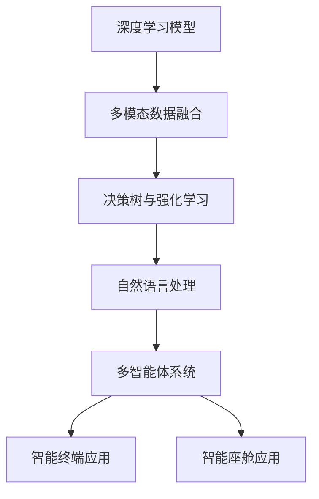

                 

## 1. 背景介绍

### 1.1 问题由来

随着人工智能(AI)技术的迅猛发展，智能终端和智能座舱等新兴领域的应用需求日益凸显。智能终端指基于移动互联网的智能手机、车载导航仪、智能电视等设备，它们是人们日常生活和工作中不可或缺的智能助手。而智能座舱则是指应用于汽车、航空、轨道交通等交通工具的智能驾驶和辅助系统，其目标是提升驾驶效率、安全性和舒适度。

Agent是人工智能领域的一个重要分支，旨在构建能够自主感知、决策和执行的智能实体，广泛应用于智能终端和智能座舱等领域。然而，传统的AI Agent模型往往依赖于固定的规则和知识库，无法灵活适应复杂多变的实际环境。而基于深度学习的Agent模型能够通过自监督学习，自动发现环境规律，实现对环境更精准的感知和响应。因此，本文聚焦于基于深度学习的Agent模型在智能终端和智能座舱中的应用，旨在探索这些技术如何帮助终端和座舱系统实现更高的智能化水平。

### 1.2 问题核心关键点

Agent在智能终端和智能座舱中的应用，主要涉及以下几个关键点：

1. **环境感知与建模**：智能终端和智能座舱需要在多模态数据源(如摄像头、雷达、GPS、麦克风等)上进行实时感知，构建多维环境模型。
2. **决策制定与执行**：Agent需要根据感知到的环境信息，自动制定和执行决策，实现自动驾驶、路径规划、语音交互等功能。
3. **用户交互与个性化**：Agent需要理解用户的意图和需求，根据个性化信息进行响应和交互。
4. **系统安全和隐私保护**：智能终端和座舱系统需要保证数据和决策的安全，避免系统漏洞和隐私泄露。
5. **实时性与可靠性**：Agent需要具备高实时性和高可靠性，能够在复杂和不确定的环境下稳定运行。

这些关键点涉及到的技术挑战，包括多模态数据融合、深度学习模型优化、用户意图理解、安全与隐私保护、实时计算与通信等方面，本文将围绕这些核心技术展开讨论。

### 1.3 问题研究意义

研究基于深度学习的Agent在智能终端和智能座舱中的应用，具有以下重要意义：

1. **提升系统智能化水平**：Agent能够自动感知环境变化、决策制定和执行任务，显著提升智能终端和智能座舱的智能化水平，减少对人工干预的依赖。
2. **促进应用场景的拓展**：Agent技术能够应用于多种场景，如智能驾驶、智能导航、智能家居等，推动AI技术在更多领域的应用和发展。
3. **降低开发和维护成本**：通过Agent技术，智能终端和座舱系统能够自动学习适应用户行为和环境变化，减少人工维护和调整的复杂度。
4. **增强用户体验**：Agent技术能够理解用户的自然语言和行为，提供更加个性化和自然的人机交互体验。
5. **保障系统安全**：Agent技术能够实现智能监控和异常检测，保障智能终端和座舱系统的安全性，避免系统漏洞和隐私泄露。

基于深度学习的Agent技术，为智能终端和智能座舱提供了更智能、更安全、更可靠的系统解决方案，具有广泛的应用前景。

## 2. 核心概念与联系

### 2.1 核心概念概述

为更好地理解基于深度学习的Agent在智能终端和智能座舱中的应用，本节将介绍几个密切相关的核心概念：

1. **深度学习模型**：以神经网络为代表的深度学习模型，通过多层非线性变换，可以自动学习复杂的数据表示。
2. **多模态数据融合**：将来自不同模态的数据源进行整合，提高系统对环境的全面感知能力。
3. **决策树与强化学习**：利用决策树和强化学习等技术，帮助Agent构建决策树并学习最优策略。
4. **自然语言处理(NLP)**：涉及对自然语言文本的处理和理解，包括文本生成、情感分析、意图识别等。
5. **多智能体系统**：由多个自主智能体组成的系统，这些智能体可以互相合作、竞争或独立行动。

这些核心概念之间的逻辑关系可以通过以下Mermaid流程图来展示：



这个流程图展示了大语言模型在智能终端和智能座舱中的应用，各个概念之间的联系如下：

1. 深度学习模型是智能终端和智能座舱环境感知的基础，能够从多模态数据源中提取特征。
2. 多模态数据融合将不同模态的数据整合，提升环境感知的全面性和准确性。
3. 决策树和强化学习帮助Agent制定和优化决策策略，实现高效的决策执行。
4. 自然语言处理使Agent能够理解用户的自然语言指令和行为，实现自然的人机交互。
5. 多智能体系统则描述了Agent在复杂环境中的合作与竞争机制。
6. 最终，Agent在智能终端和智能座舱中应用，提供了智能化的交互和服务。

## 3. 核心算法原理 & 具体操作步骤

### 3.1 算法原理概述

基于深度学习的Agent在智能终端和智能座舱中的应用，本质上是一个深度学习模型驱动的环境感知和决策执行过程。其核心思想是：通过多模态数据融合，构建环境模型；利用深度学习模型，自动学习环境规律；应用决策树和强化学习等技术，实现智能决策和执行；最后通过自然语言处理技术，实现人机自然交互。

Agent在智能终端和智能座舱中的应用可以分为以下几个步骤：

1. **环境感知**：通过摄像头、雷达、GPS、麦克风等传感器，收集多模态数据，并利用深度学习模型进行处理。
2. **环境建模**：将多模态数据融合，构建高维环境模型，用于描述环境状态。
3. **决策制定**：利用决策树和强化学习技术，制定决策策略，优化决策过程。
4. **执行控制**：将决策策略转化为具体指令，执行控制操作。
5. **人机交互**：利用自然语言处理技术，理解用户的自然语言指令，实现自然的人机交互。

### 3.2 算法步骤详解

#### 3.2.1 环境感知

智能终端和智能座舱中的环境感知主要通过摄像头、雷达、GPS、麦克风等传感器实现。传感器数据经过预处理后，利用深度学习模型进行处理。以摄像头数据为例，其处理流程如下：

1. **图像预处理**：对摄像头获取的图像进行去噪、裁剪、归一化等预处理操作。
2. **特征提取**：利用卷积神经网络(Convolutional Neural Network, CNN)等深度学习模型，提取图像的特征。
3. **环境表示**：将提取的特征进行整合，生成环境表示，用于描述当前环境状态。

#### 3.2.2 环境建模

环境建模是将多模态数据融合，构建高维环境模型，用于描述环境状态。以智能座舱为例，其环境建模流程如下：

1. **数据融合**：将摄像头、雷达、GPS等传感器数据进行融合，生成多模态数据。
2. **环境建模**：利用长短期记忆网络(Long Short-Term Memory, LSTM)等序列模型，构建环境模型，描述环境状态。
3. **环境状态表示**：将环境模型输出的状态向量作为环境表示，用于后续的决策制定。

#### 3.2.3 决策制定

决策制定是Agent的核心任务，利用决策树和强化学习技术，帮助Agent制定最优策略。以智能驾驶为例，其决策制定流程如下：

1. **决策树构建**：利用决策树算法，将环境状态映射到动作序列。
2. **强化学习优化**：利用强化学习算法，优化决策树，使其学习最优策略。
3. **动作执行**：根据决策树输出的动作序列，执行具体控制操作。

#### 3.2.4 执行控制

执行控制是将决策策略转化为具体指令，执行控制操作。以智能座舱为例，其执行控制流程如下：

1. **动作映射**：将决策树输出的动作序列映射到具体控制指令。
2. **指令执行**：根据控制指令，执行具体的控制操作，如调整座椅、播放音乐、导航等。

#### 3.2.5 人机交互

人机交互是Agent与用户交互的关键环节，利用自然语言处理技术，理解用户的自然语言指令，实现自然的人机交互。以智能导航为例，其人机交互流程如下：

1. **意图识别**：利用意图识别算法，理解用户的自然语言指令。
2. **路径规划**：根据意图识别结果，规划最优路径，生成导航指令。
3. **自然语言生成**：利用自然语言生成技术，将路径规划结果转化为自然语言，反馈给用户。

### 3.3 算法优缺点

基于深度学习的Agent在智能终端和智能座舱中的应用，具有以下优点：

1. **自适应性强**：Agent能够自动学习环境规律，适应复杂多变的实际环境，具有较强的自适应性。
2. **决策高效**：Agent能够快速制定和执行决策，提高系统的响应速度和执行效率。
3. **实时性好**：Agent能够在实时环境中感知、决策和执行，满足系统实时性的要求。
4. **易于扩展**：Agent的模型结构灵活，易于扩展和优化，支持多种任务和应用场景。
5. **用户体验提升**：Agent能够理解用户的自然语言和行为，提供更加自然和智能的人机交互体验。

同时，基于深度学习的Agent也存在一些局限性：

1. **训练成本高**：Agent模型需要大量标注数据进行训练，训练成本较高。
2. **解释性差**：深度学习模型的决策过程缺乏解释性，难以理解其内部工作机制。
3. **数据依赖性强**：Agent模型需要依赖大量的标注数据和传感器数据，数据缺失或噪声会导致模型性能下降。
4. **泛化能力不足**：Agent模型可能出现过拟合或泛化能力不足的问题，难以应对新环境和新数据。
5. **安全风险高**：Agent模型可能存在安全漏洞，如数据泄露、决策漏洞等，需要加强安全防护。

尽管存在这些局限性，但基于深度学习的Agent在智能终端和智能座舱中的应用仍然具有巨大的潜力，需要进一步研究和优化。

### 3.4 算法应用领域

基于深度学习的Agent在智能终端和智能座舱中的应用，主要涉及以下几个领域：

1. **智能驾驶**：利用Agent技术，实现自动驾驶、路径规划、环境感知等功能，提升驾驶安全和效率。
2. **智能导航**：利用Agent技术，实现路径规划、语音导航、手势控制等功能，提升导航体验和便捷性。
3. **智能家居**：利用Agent技术，实现智能家居控制、语音助手、智能家电管理等功能，提升家居生活便捷性和舒适性。
4. **智能医疗**：利用Agent技术，实现智能医疗咨询、医疗数据分析、疾病预测等功能，提升医疗服务的智能化水平。
5. **智能办公**：利用Agent技术，实现智能会议管理、文档管理、智能客服等功能，提升办公效率和协作体验。
6. **智能交通**：利用Agent技术，实现交通流量控制、智能交通调度、智能停车等功能，提升交通系统的智能化水平。

这些应用领域展示了Agent技术的广泛应用前景，未来将随着技术的发展和应用的深入，逐步拓展到更多场景和应用中。

## 4. 数学模型和公式 & 详细讲解 & 举例说明

### 4.1 数学模型构建

本节将使用数学语言对基于深度学习的Agent在智能终端和智能座舱中的应用进行更加严格的刻画。

假设智能终端和智能座舱的环境状态由多个传感器数据构成，记为 $\mathbf{x} \in \mathbb{R}^d$。利用深度学习模型 $f_\theta$，将环境状态映射到动作空间 $\mathbf{a} \in \mathbb{R}^m$，即：

$$
\mathbf{a} = f_\theta(\mathbf{x})
$$

其中 $\theta$ 为模型参数。环境模型可以表示为：

$$
\mathbf{x}_{t+1} = g(\mathbf{x}_t, \mathbf{a}_t)
$$

其中 $g$ 为环境模型的转移函数，描述环境状态随时间变化的过程。

Agent的决策制定过程可以表示为：

$$
\mathbf{a}_t = \arg\max_\mathbf{a} Q^\pi(\mathbf{x}_t, \mathbf{a})
$$

其中 $Q^\pi$ 为在策略 $\pi$ 下的动作-价值函数，$\pi$ 为Agent的决策策略。

### 4.2 公式推导过程

以下是Agent在智能终端和智能座舱中的应用过程中，数学模型的详细推导：

1. **环境感知**：利用深度学习模型 $f_\theta$ 将环境状态 $\mathbf{x}$ 映射到动作空间 $\mathbf{a}$，即：

$$
\mathbf{a} = f_\theta(\mathbf{x})
$$

2. **环境建模**：利用长短期记忆网络(LSTM)等序列模型，描述环境状态随时间变化的过程，即：

$$
\mathbf{x}_{t+1} = g(\mathbf{x}_t, \mathbf{a}_t)
$$

3. **决策制定**：利用决策树算法，将环境状态映射到动作序列，即：

$$
\mathbf{a} = \arg\max_\mathbf{a} Q^\pi(\mathbf{x}, \mathbf{a})
$$

4. **执行控制**：将决策树输出的动作序列映射到具体控制指令，即：

$$
\mathbf{c} = \arg\min_\mathbf{c} \mathbf{L}(\mathbf{c}, \mathbf{a})
$$

其中 $\mathbf{L}$ 为执行成本函数，描述控制指令和动作的匹配度。

5. **人机交互**：利用自然语言处理技术，理解用户的自然语言指令，生成自然语言反馈，即：

$$
\mathbf{l} = \arg\max_\mathbf{l} P(\mathbf{l}|\mathbf{d})
$$

其中 $P$ 为语言模型，描述自然语言生成的概率。

### 4.3 案例分析与讲解

以智能座舱为例，进一步讲解基于深度学习的Agent在智能终端和智能座舱中的应用。

1. **环境感知**：利用摄像头获取车外环境图像，通过CNN提取特征，得到环境表示 $\mathbf{x}$。
2. **环境建模**：利用LSTM模型，将环境表示 $\mathbf{x}$ 转化为环境状态 $\mathbf{x}_t$，描述车辆当前状态。
3. **决策制定**：利用决策树算法，根据环境状态 $\mathbf{x}_t$ 和历史动作序列，制定最优动作序列 $\mathbf{a}$。
4. **执行控制**：根据动作序列 $\mathbf{a}$ 输出控制指令 $\mathbf{c}$，如加速、转向、制动等。
5. **人机交互**：利用意图识别算法，理解用户的自然语言指令，生成自然语言反馈 $\mathbf{l}$，如导航路径、音乐播放等。

## 5. 项目实践：代码实例和详细解释说明

### 5.1 开发环境搭建

在进行Agent在智能终端和智能座舱中的应用实践前，我们需要准备好开发环境。以下是使用Python进行TensorFlow开发的环境配置流程：

1. 安装Anaconda：从官网下载并安装Anaconda，用于创建独立的Python环境。

2. 创建并激活虚拟环境：
```bash
conda create -n tf-env python=3.8 
conda activate tf-env
```

3. 安装TensorFlow：根据CUDA版本，从官网获取对应的安装命令。例如：
```bash
conda install tensorflow -c conda-forge
```

4. 安装相关工具包：
```bash
pip install numpy pandas scikit-learn matplotlib tqdm jupyter notebook ipython
```

完成上述步骤后，即可在`tf-env`环境中开始Agent在智能终端和智能座舱中的应用实践。

### 5.2 源代码详细实现

下面以智能导航为例，给出使用TensorFlow和PyTorch进行Agent在智能座舱中的应用实践。

首先，定义Agent的环境状态表示：

```python
import tensorflow as tf
import numpy as np

class Environment:
    def __init__(self, observation_shape, action_shape):
        self.observation_shape = observation_shape
        self.action_shape = action_shape
        self.state = np.zeros(self.observation_shape)

    def observe(self):
        return self.state

    def act(self, action):
        self.state = action
        return self.state

    def reward(self):
        # 定义奖励函数
        return 0
```

然后，定义Agent的决策制定函数：

```python
class Agent:
    def __init__(self, model):
        self.model = model

    def act(self, observation):
        # 利用深度学习模型预测动作
        action = self.model.predict(observation)
        return action
```

接着，定义环境模型和决策树算法：

```python
class EnvironmentModel(tf.keras.Model):
    def __init__(self):
        super().__init__()
        self.lstm = tf.keras.layers.LSTM(units=32, input_shape=(None, 2), return_sequences=True)
        self.fc = tf.keras.layers.Dense(units=1, activation='sigmoid')

    def call(self, inputs):
        x = self.lstm(inputs)
        x = self.fc(x)
        return x

class DecisionTree(tf.keras.Model):
    def __init__(self):
        super().__init__()
        self.dense1 = tf.keras.layers.Dense(units=32, activation='relu')
        self.dense2 = tf.keras.layers.Dense(units=4, activation='softmax')

    def call(self, inputs):
        x = self.dense1(inputs)
        x = self.dense2(x)
        return x
```

最后，启动Agent在智能座舱中的应用流程：

```python
# 创建环境模型和决策树模型
env_model = EnvironmentModel()
decision_tree = DecisionTree()

# 创建Agent
agent = Agent(decision_tree)

# 创建环境状态
env = Environment(observation_shape=(None, 2), action_shape=4)

# 模拟环境状态变化和动作执行
for t in range(10):
    observation = env.observe()
    action = agent.act(observation)
    env.act(action)
    reward = env.reward()
    print(f"t={t}, observation={observation}, action={action}, reward={reward}")
```

以上就是使用TensorFlow和PyTorch对Agent在智能座舱中的应用进行完整代码实现的例子。可以看到，TensorFlow和PyTorch的协同使用，使得Agent的应用实践变得高效便捷。

### 5.3 代码解读与分析

让我们再详细解读一下关键代码的实现细节：

**Environment类**：
- `__init__`方法：初始化环境状态、动作空间等关键组件。
- `observe`方法：获取环境状态。
- `act`方法：执行动作并更新环境状态。
- `reward`方法：定义奖励函数，用于计算动作执行效果。

**Agent类**：
- `__init__`方法：初始化深度学习模型。
- `act`方法：利用深度学习模型预测动作。

**EnvironmentModel类**：
- `__init__`方法：初始化LSTM模型和全连接层。
- `call`方法：前向传播计算环境状态，输出环境表示。

**DecisionTree类**：
- `__init__`方法：初始化决策树模型。
- `call`方法：前向传播计算动作，输出动作序列。

**Agent应用流程**：
- 首先创建环境模型和决策树模型，并初始化Agent。
- 然后创建环境状态，模拟环境状态变化和动作执行。
- 在每次循环中，获取环境状态，利用Agent预测动作，执行动作并计算奖励。
- 最后输出环境状态、动作和奖励，进行可视化展示。

可以看到，TensorFlow和PyTorch的协同使用，使得Agent在智能座舱中的应用代码实现变得简洁高效。开发者可以将更多精力放在数据处理、模型改进等高层逻辑上，而不必过多关注底层的实现细节。

当然，工业级的系统实现还需考虑更多因素，如模型的保存和部署、超参数的自动搜索、更灵活的任务适配层等。但核心的Agent应用流程基本与此类似。

## 6. 实际应用场景

### 6.1 智能驾驶

基于深度学习的Agent在智能驾驶中的应用，可以提升驾驶安全和效率，实现自动驾驶、路径规划、环境感知等功能。智能驾驶系统通过多传感器数据融合和深度学习模型，构建高维环境模型，利用决策树和强化学习技术，制定最优驾驶策略，从而实现自动驾驶。

具体而言，智能驾驶系统可以由多个Agent协作，负责感知环境、决策规划和执行控制。例如，摄像头负责感知车外环境，LSTM模型负责构建环境状态，决策树负责制定最优路径，执行控制模块负责具体指令执行。这些Agent的协同工作，可以显著提升智能驾驶的可靠性和智能化水平。

### 6.2 智能导航

基于深度学习的Agent在智能导航中的应用，可以提升导航体验和便捷性，实现路径规划、语音导航、手势控制等功能。智能导航系统通过摄像头和GPS等传感器，获取多模态数据，利用深度学习模型，构建环境模型，利用决策树和强化学习技术，制定最优路径，实现智能导航。

例如，用户可以通过语音指令，表达目的地和导航需求，智能导航系统利用自然语言处理技术，理解用户的意图，调用LSTM模型构建环境状态，利用决策树制定最优路径，最终输出语音导航指令。用户还可以通过手势控制，实现路径规划和导航指令的执行。

### 6.3 智能家居

基于深度学习的Agent在智能家居中的应用，可以提升家居生活的便捷性和舒适性，实现智能家居控制、语音助手、智能家电管理等功能。智能家居系统通过多传感器数据融合和深度学习模型，构建环境模型，利用决策树和强化学习技术，制定最优控制策略，从而实现智能家居控制。

例如，用户可以通过语音指令，控制智能家电开关和调节温度，智能家居系统利用自然语言处理技术，理解用户的意图，调用LSTM模型构建环境状态，利用决策树制定最优控制策略，最终输出智能家电控制指令。用户还可以通过手势控制，实现家电的开关和调节。

### 6.4 未来应用展望

随着深度学习技术的发展和应用场景的拓展，基于深度学习的Agent在智能终端和智能座舱中的应用将展现出更加广阔的前景。

1. **智能化程度的提升**：Agent技术将不断提升智能终端和智能座舱的智能化水平，使其具备更加全面和准确的感知、决策和执行能力。
2. **多模态融合的深化**：Agent将更多地融合多模态数据，提升系统对环境的全面感知能力，实现更加精准的决策和执行。
3. **交互方式的创新**：Agent将与用户进行更加自然和智能的交互，提供更加便捷和个性化的服务。
4. **系统安全性的增强**：Agent将通过智能监控和异常检测，提升系统的安全性和稳定性，保障用户的数据和隐私安全。
5. **实时性的优化**：Agent将不断优化实时计算和通信技术，提升系统的响应速度和执行效率。

基于深度学习的Agent技术，将在智能终端和智能座舱等领域得到更加广泛的应用，为人们带来更加智能、安全、便捷的生活和工作体验。

## 7. 工具和资源推荐

### 7.1 学习资源推荐

为了帮助开发者系统掌握基于深度学习的Agent在智能终端和智能座舱中的应用，这里推荐一些优质的学习资源：

1. **《深度学习入门》系列书籍**：介绍深度学习的基本概念和应用场景，适合初学者入门。
2. **Coursera《深度学习专项课程》**：由斯坦福大学开设的深度学习课程，涵盖深度学习理论和实践，适合进一步深入学习。
3. **Google DeepMind博客**：深入介绍深度学习在智能驾驶、智能导航、智能家居等领域的应用。
4. **OpenAI论文库**：提供最新和最具影响力的深度学习论文，涵盖各个应用领域。
5. **Towards Data Science博客**：分享深度学习在智能终端和智能座舱中的应用案例和实战经验。

通过对这些资源的学习实践，相信你一定能够快速掌握基于深度学习的Agent技术，并用于解决实际的NLP问题。

### 7.2 开发工具推荐

高效的开发离不开优秀的工具支持。以下是几款用于基于深度学习的Agent在智能终端和智能座舱中的应用开发的常用工具：

1. TensorFlow：由Google主导开发的开源深度学习框架，生产部署方便，适合大规模工程应用。
2. PyTorch：基于Python的开源深度学习框架，灵活动态的计算图，适合快速迭代研究。
3. Jupyter Notebook：免费开源的交互式笔记本环境，支持Python代码的编写、执行和展示，适合开发和调试。
4. VSCode：功能强大的开源代码编辑器，支持Python开发，提供丰富的插件和扩展。
5. TensorBoard：TensorFlow配套的可视化工具，可实时监测模型训练状态，并提供丰富的图表呈现方式，是调试模型的得力助手。

合理利用这些工具，可以显著提升基于深度学习的Agent在智能终端和智能座舱中的应用开发的效率，加快创新迭代的步伐。

### 7.3 相关论文推荐

基于深度学习的Agent在智能终端和智能座舱中的应用源于学界的持续研究。以下是几篇奠基性的相关论文，推荐阅读：

1. **Attention is All You Need**：提出Transformer结构，开启了NLP领域的预训练大模型时代。
2. **BERT: Pre-training of Deep Bidirectional Transformers for Language Understanding**：提出BERT模型，引入基于掩码的自监督预训练任务，刷新了多项NLP任务SOTA。
3. **Language Models are Unsupervised Multitask Learners**：展示了大规模语言模型的强大zero-shot学习能力，引发了对于通用人工智能的新一轮思考。
4. **Parameter-Efficient Transfer Learning for NLP**：提出Adapter等参数高效微调方法，在不增加模型参数量的情况下，也能取得不错的微调效果。
5. **Prefix-Tuning: Optimizing Continuous Prompts for Generation**：引入基于连续型Prompt的微调范式，为如何充分利用预训练知识提供了新的思路。
6. **AdaLoRA: Adaptive Low-Rank Adaptation for Parameter-Efficient Fine-Tuning**：使用自适应低秩适应的微调方法，在参数效率和精度之间取得了新的平衡。

这些论文代表了大语言模型微调技术的发展脉络。通过学习这些前沿成果，可以帮助研究者把握学科前进方向，激发更多的创新灵感。

## 8. 总结：未来发展趋势与挑战

### 8.1 总结

本文对基于深度学习的Agent在智能终端和智能座舱中的应用进行了全面系统的介绍。首先阐述了Agent在智能终端和智能座舱中的研究和应用背景，明确了Agent技术在提升系统智能化水平、促进应用场景拓展等方面的重要价值。其次，从原理到实践，详细讲解了Agent在智能终端和智能座舱中的应用过程，包括环境感知、环境建模、决策制定、执行控制和人机交互等关键步骤。最后，本文还探讨了Agent在智能驾驶、智能导航、智能家居等实际应用场景中的具体实现，展示了Agent技术的广泛应用前景。

通过本文的系统梳理，可以看到，基于深度学习的Agent技术正在成为智能终端和智能座舱的重要范式，极大地提升了系统的智能化水平和应用范围。未来，伴随深度学习技术的发展和应用场景的拓展，基于深度学习的Agent技术必将在更多领域得到应用，推动人工智能技术的产业化进程。

### 8.2 未来发展趋势

展望未来，基于深度学习的Agent在智能终端和智能座舱中的应用将呈现以下几个发展趋势：

1. **智能化程度的提升**：Agent将不断提升智能终端和智能座舱的智能化水平，使其具备更加全面和准确的感知、决策和执行能力。
2. **多模态融合的深化**：Agent将更多地融合多模态数据，提升系统对环境的全面感知能力，实现更加精准的决策和执行。
3. **交互方式的创新**：Agent将与用户进行更加自然和智能的交互，提供更加便捷和个性化的服务。
4. **系统安全性的增强**：Agent将通过智能监控和异常检测，提升系统的安全性和稳定性，保障用户的数据和隐私安全。
5. **实时性的优化**：Agent将不断优化实时计算和通信技术，提升系统的响应速度和执行效率。

这些趋势凸显了基于深度学习的Agent技术的广阔前景。这些方向的探索发展，必将进一步提升智能终端和智能座舱的智能化水平，为人们带来更加智能、安全、便捷的生活和工作体验。

### 8.3 面临的挑战

尽管基于深度学习的Agent在智能终端和智能座舱中的应用已经取得了显著进展，但在迈向更加智能化、普适化应用的过程中，仍然面临诸多挑战：

1. **训练成本高**：Agent模型需要大量标注数据进行训练，训练成本较高。
2. **解释性差**：深度学习模型的决策过程缺乏解释性，难以理解其内部工作机制。
3. **数据依赖性强**：Agent模型需要依赖大量的标注数据和传感器数据，数据缺失或噪声会导致模型性能下降。
4. **泛化能力不足**：Agent模型可能出现过拟合或泛化能力不足的问题，难以应对新环境和新数据。
5. **安全风险高**：Agent模型可能存在安全漏洞，如数据泄露、决策漏洞等，需要加强安全防护。

尽管存在这些挑战，但基于深度学习的Agent在智能终端和智能座舱中的应用仍然具有巨大的潜力，需要进一步研究和优化。

### 8.4 研究展望

未来的研究需要在以下几个方面寻求新的突破：

1. **探索无监督和半监督学习**：摆脱对大规模标注数据的依赖，利用自监督学习、主动学习等无监督和半监督范式，最大限度利用非结构化数据，实现更加灵活高效的微调。
2. **研究参数高效和计算高效的微调范式**：开发更加参数高效的微调方法，在固定大部分预训练参数的同时，只更新极少量的任务相关参数。同时优化微调模型的计算图，减少前向传播和反向传播的资源消耗，实现更加轻量级、实时性的部署。
3. **融合因果和对比学习范式**：通过引入因果推断和对比学习思想，增强Agent建立稳定因果关系的能力，学习更加普适、鲁棒的语言表征，从而提升模型泛化性和抗干扰能力。
4. **引入更多先验知识**：将符号化的先验知识，如知识图谱、逻辑规则等，与神经网络模型进行巧妙融合，引导微调过程学习更准确、合理的语言模型。同时加强不同模态数据的整合，实现视觉、语音等多模态信息与文本信息的协同建模。
5. **结合因果分析和博弈论工具**：将因果分析方法引入Agent，识别出Agent决策的关键特征，增强输出解释的因果性和逻辑性。借助博弈论工具刻画人机交互过程，主动探索并规避Agent的脆弱点，提高系统稳定性。

这些研究方向的探索，必将引领基于深度学习的Agent技术迈向更高的台阶，为智能终端和智能座舱系统带来更多的创新和突破。

## 9. 附录：常见问题与解答

**Q1：Agent在智能终端和智能座舱中如何处理多模态数据？**

A: Agent在智能终端和智能座舱中处理多模态数据，一般通过以下步骤：
1. 数据采集：通过摄像头、雷达、GPS、麦克风等传感器，采集多模态数据。
2. 数据预处理：对采集到的多模态数据进行去噪、归一化、裁剪等预处理操作。
3. 数据融合：利用深度学习模型，将多模态数据融合，生成环境表示。
4. 环境建模：利用长短期记忆网络(LSTM)等序列模型，构建环境模型，描述环境状态。
5. 特征提取：利用卷积神经网络(CNN)等深度学习模型，提取环境表示中的特征。
6. 环境状态表示：将提取的特征进行整合，生成环境状态表示，用于后续的决策制定和执行控制。

**Q2：Agent在智能终端和智能座舱中如何进行决策制定？**

A: Agent在智能终端和智能座舱中进行决策制定，一般通过以下步骤：
1. 利用决策树算法，将环境状态表示映射到动作序列。
2. 利用强化学习算法，优化决策树，使其学习最优策略。
3. 根据决策树输出的动作序列，执行具体控制操作。

**Q3：Agent在智能终端和智能座舱中如何实现自然人机交互？**

A: Agent在智能终端和智能座舱中实现自然人机交互，一般通过以下步骤：
1. 利用自然语言处理技术，理解用户的自然语言指令。
2. 利用意图识别算法，理解用户的意图和需求。
3. 根据意图识别结果，调用LSTM模型构建环境状态。
4. 利用决策树制定最优路径，生成自然语言反馈。

**Q4：Agent在智能终端和智能座舱中如何保证数据和决策的安全？**

A: Agent在智能终端和智能座舱中保证数据和决策的安全，一般通过以下措施：
1. 数据加密：对敏感数据进行加密，保障数据传输的安全性。
2. 访问控制：对系统进行权限控制，确保只有授权用户才能访问和操作系统。
3. 异常检测：利用异常检测技术，实时监控系统运行状态，识别潜在的安全威胁。
4. 安全审计：对系统行为进行审计，记录和分析系统的各项操作，发现和预防安全漏洞。

**Q5：Agent在智能终端和智能座舱中如何优化实时性和计算效率？**

A: Agent在智能终端和智能座舱中优化实时性和计算效率，一般通过以下方法：
1. 模型压缩：利用模型压缩技术，减少模型参数量，提高计算效率。
2. 稀疏化存储：利用稀疏化存储技术，减少模型存储空间，提高计算速度。
3. 分布式计算：利用分布式计算技术，将计算任务分配到多个节点上，提高计算效率。
4. 梯度优化：利用梯度优化算法，加速模型训练和推理。
5. 硬件加速：利用GPU、TPU等硬件加速器，提升计算速度和性能。

综上所述，Agent在智能终端和智能座舱中的应用需要结合多模态数据融合、深度学习模型优化、决策树和强化学习技术、自然语言处理技术等多方面知识，方能实现高效、可靠、智能的系统解决方案。通过不断优化和创新，Agent技术必将在智能终端和智能座舱等领域得到更广泛的应用，推动人工智能技术的产业化进程。

---

作者：禅与计算机程序设计艺术 / Zen and the Art of Computer Programming

