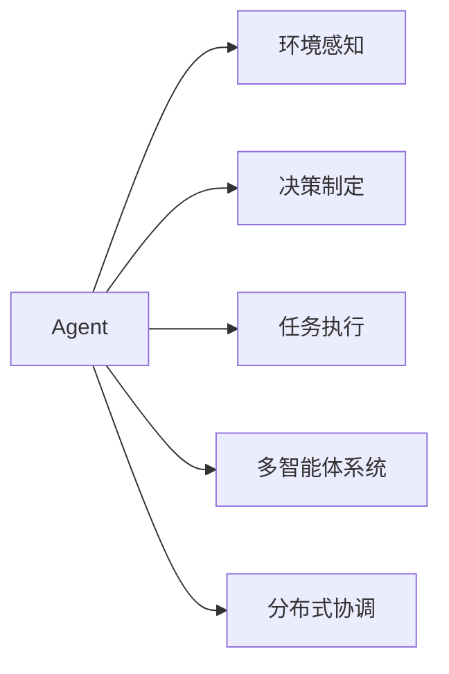

                 

# Agent在汽车自动驾驶和工业机器人中的应用

> 关键词：
> - 汽车自动驾驶
> - 工业机器人
> - 智能控制
> - 多智能体系统
> - 分布式协调

## 1. 背景介绍

在当今快速发展的科技时代，智能技术的应用领域日益广泛，其中汽车自动驾驶和工业机器人作为智能控制领域的两大重要分支，正引领着自动化、智能化技术的潮流。Agent（智能体）作为人工智能的重要组成单元，在汽车自动驾驶和工业机器人中扮演着关键角色，负责感知环境、做出决策、执行任务，是系统智能的核心实现者。本文将深入探讨Agent在汽车自动驾驶和工业机器人中的应用，探索其技术原理、核心算法及优化方法，以及未来发展的趋势和挑战。

## 2. 核心概念与联系

### 2.1 核心概念概述

为了更好地理解Agent在汽车自动驾驶和工业机器人中的应用，我们需要掌握几个核心概念及其之间的联系：

- **Agent**：智能体，通常是指能够自主感知环境、做出决策并执行任务的计算实体。在汽车自动驾驶和工业机器人中，Agent能够处理复杂环境下的各种信息，进行智能决策。

- **环境感知**：Agent通过传感器获取周围环境的信息，如汽车自动驾驶中的激光雷达、摄像头，工业机器人中的摄像头、力传感器等。

- **决策制定**：Agent根据感知到的信息，结合预定义的规则和算法，制定智能决策。如汽车自动驾驶中的路径规划、避障策略，工业机器人中的任务调度、路径规划等。

- **任务执行**：Agent根据决策输出控制执行器，如汽车自动驾驶中的转向、加速，工业机器人中的机械臂动作、流水线控制等。

- **多智能体系统**：由多个Agent组成的系统，它们通过通信和协作实现复杂任务。在汽车自动驾驶中，多个Agent协同工作，如车与车通信、车与路交互等。在工业机器人中，多个Agent协同完成装配、搬运等任务。

- **分布式协调**：多个Agent之间通过通信协议和协调算法，实现信息共享和任务协同。在汽车自动驾驶中，不同车辆通过通信协议交换位置和速度信息，进行智能调度。在工业机器人中，多个机器人通过分布式控制算法，协同完成任务。

这些概念之间的关系可以通过以下Mermaid流程图来展示：

通过这些核心概念，我们可以全面理解Agent在汽车自动驾驶和工业机器人中的应用，从而探讨其技术实现和应用前景。

## 3. 核心算法原理 & 具体操作步骤

### 3.1 算法原理概述

Agent在汽车自动驾驶和工业机器人中的应用，主要依赖于感知、决策和执行三大核心模块。感知模块通过传感器获取环境信息，决策模块根据感知信息制定智能策略，执行模块根据策略控制执行器完成具体任务。

**感知模块**：利用各种传感器获取环境信息，包括但不限于摄像头、激光雷达、超声波传感器等。这些传感器通过感知模块捕获周围环境的静态和动态信息，提供给决策模块进行分析。

**决策模块**：感知模块获取的信息经过处理后，通过预定义的算法和规则，制定出智能决策。在汽车自动驾驶中，决策模块需要处理交通信号、车辆行为、行人信息等复杂信息，制定出最优的驾驶策略。在工业机器人中，决策模块需要处理任务要求、机器状态、环境变化等，制定出最优的任务执行路径。

**执行模块**：根据决策模块的输出，控制执行器完成具体任务。在汽车自动驾驶中，执行模块控制车辆的转向、加速、制动等操作，实现路径跟随、避障等功能。在工业机器人中，执行模块控制机械臂、电动滑轨等执行器，完成装配、搬运、焊接等任务。

### 3.2 算法步骤详解

以下以汽车自动驾驶为例，详细介绍Agent的工作流程：

**Step 1: 环境感知**
- 通过激光雷达和摄像头获取周围环境的静态和动态信息，如道路标线、交通灯、车辆位置等。
- 传感器数据经过预处理，如去噪、校正等，生成感知信息。

**Step 2: 决策制定**
- 利用感知信息，结合地图和导航信息，进行路径规划和避障策略制定。
- 通过深度学习模型（如CNN、RNN、DRL等）进行状态估计和决策制定。

**Step 3: 任务执行**
- 根据决策输出，控制车辆转向、加速、制动等，实现路径跟随和避障。
- 利用自动驾驶套件（如ROS、VirtuAlDriver等）实现任务的自动执行。

**Step 4: 持续优化**
- 通过仿真环境和实际测试，不断优化感知、决策和执行模块的性能。
- 使用强化学习等方法，持续改进Agent的智能决策能力。

### 3.3 算法优缺点

Agent在汽车自动驾驶和工业机器人中的应用，具有以下优点：

- **高效性**：通过预训练和微调，Agent可以高效处理复杂环境，快速做出智能决策。
- **可扩展性**：Agent可以适应不同环境和任务需求，具有较好的灵活性和可扩展性。
- **自主性**：Agent能够自主感知和决策，减少对人类干预的依赖。

同时，Agent也存在一些缺点：

- **高复杂性**：Agent需要处理复杂环境信息，算法实现较为复杂。
- **数据需求大**：Agent的训练和优化需要大量的数据支持，数据收集和标注成本较高。
- **安全性问题**：Agent的智能决策依赖于模型和数据的质量，存在一定的安全风险。

### 3.4 算法应用领域

Agent在汽车自动驾驶和工业机器人中的应用，涵盖了多个领域，如汽车制造、物流运输、智能家居、医疗健康等。以下是几个典型的应用场景：

- **汽车自动驾驶**：利用Agent实现车辆的自主导航和避障，提高行车安全和效率。
- **工业机器人**：利用Agent实现智能调度、路径规划和任务执行，提高生产效率和自动化水平。
- **智能交通**：利用Agent实现智能交通管理，优化交通流量，提高道路通行效率。
- **智能家居**：利用Agent实现智能家电的自主控制和场景优化，提升居住体验。
- **医疗健康**：利用Agent实现智能诊疗、病患监控和健康管理，提高医疗服务的质量和效率。

## 4. 数学模型和公式 & 详细讲解 & 举例说明

### 4.1 数学模型构建

Agent在汽车自动驾驶和工业机器人中的应用，涉及多个数学模型，包括传感器模型、决策模型、执行模型等。这里以汽车自动驾驶为例，构建感知、决策和执行模块的数学模型。

**感知模块**：
- 激光雷达模型：$R_i = f(d_i)$，其中 $d_i$ 为激光雷达与障碍物之间的距离，$R_i$ 为雷达反射值。
- 摄像头模型：$I(x,y) = g(x,y)$，其中 $I(x,y)$ 为摄像头在位置 $(x,y)$ 的像素值，$g(x,y)$ 为摄像头成像函数。

**决策模块**：
- 深度学习模型：使用CNN、RNN、DRL等模型，将感知信息映射为决策向量，如$D = h(R, I)$，其中 $h$ 为决策模型。

**执行模块**：
- 控制模型：利用PID控制算法，根据决策向量控制车辆转向和加速，如$u(t) = k_1\Delta p + k_2\int_0^t\Delta v dt + k_3\Delta p_{\text{prev}}$，其中 $u(t)$ 为控制信号，$\Delta p$ 为位置偏差，$\Delta v$ 为速度偏差，$k_1$、$k_2$、$k_3$ 为控制参数。

### 4.2 公式推导过程

以决策模块的深度学习模型为例，进行公式推导。

**感知数据**：
- 激光雷达数据：$R = (R_1, R_2, ..., R_n)$，其中 $n$ 为激光雷达测点数量。
- 摄像头数据：$I = (I_{x_1,y_1}, I_{x_2,y_2}, ..., I_{x_m,y_m})$，其中 $m$ 为摄像头像素数量。

**特征提取**：
- 将激光雷达数据和摄像头数据进行特征提取，得到高维特征向量 $F$。

**决策向量**：
- 使用深度学习模型 $D = h(F)$，将特征向量映射为决策向量，其中 $h$ 为决策模型。

**动作输出**：
- 根据决策向量，使用控制模型 $u = f(D)$，输出控制信号，如转向、加速等。

### 4.3 案例分析与讲解

以汽车自动驾驶为例，分析Agent在实际应用中的案例。

**场景1: 红绿灯识别**
- 利用摄像头捕捉道路交通灯图像，通过深度学习模型提取特征。
- 利用决策模型判断交通灯状态，如绿灯、红灯、黄灯等。
- 根据交通灯状态，控制车辆加速或减速。

**场景2: 避障**
- 利用激光雷达感知周围障碍物位置和距离。
- 利用决策模型判断障碍物类型和威胁程度，如行人、车辆、障碍物等。
- 根据障碍物信息，控制车辆避障，选择最优路径。

## 5. 项目实践：代码实例和详细解释说明

### 5.1 开发环境搭建

为了进行Agent在汽车自动驾驶和工业机器人中的应用开发，我们需要搭建一个完整的开发环境。以下是开发环境搭建的步骤：

**Step 1: 安装Python和相关库**
- 安装Python 3.x
- 安装必要的库，如NumPy、Pandas、Matplotlib等。

**Step 2: 安装TensorFlow和PyTorch**
- 安装TensorFlow 2.x
- 安装PyTorch 1.5及以上版本

**Step 3: 安装ROS和VirtuAlDriver**
- 安装ROS（Robot Operating System）
- 安装VirtuAlDriver（虚拟驾驶员平台）

**Step 4: 搭建仿真环境**
- 搭建汽车自动驾驶仿真环境，如CARLA、Gazebo等。
- 搭建工业机器人仿真环境，如Gazebo、Simulink等。

### 5.2 源代码详细实现

以汽车自动驾驶为例，给出Agent的源代码实现。

**Step 1: 环境感知模块**
- 使用激光雷达数据和摄像头数据进行特征提取。
- 定义感知模块的类，实现数据处理和特征提取。

**Step 2: 决策制定模块**
- 利用深度学习模型进行状态估计和决策制定。
- 定义决策模块的类，实现深度学习模型的训练和推理。

**Step 3: 任务执行模块**
- 利用控制算法控制车辆转向和加速。
- 定义执行模块的类，实现控制算法的实现和应用。

### 5.3 代码解读与分析

以决策模块的深度学习模型为例，解读其源代码实现。

**代码1: 特征提取**
- 使用NumPy库对激光雷达数据和摄像头数据进行特征提取。
- 定义特征提取的类，实现数据的预处理和特征提取。

**代码2: 模型训练**
- 使用PyTorch库实现深度学习模型的训练。
- 定义模型训练的类，实现模型的训练和优化。

**代码3: 模型推理**
- 使用TensorFlow库实现深度学习模型的推理。
- 定义模型推理的类，实现模型的推理和应用。

### 5.4 运行结果展示

以下是汽车自动驾驶中Agent的运行结果展示：

**结果1: 红绿灯识别**
- 利用摄像头捕捉到交通灯图像。
- 深度学习模型识别出交通灯状态为绿灯，控制车辆加速。

**结果2: 避障**
- 利用激光雷达感知到前方障碍物。
- 深度学习模型识别出障碍物类型为行人，控制车辆避障。

## 6. 实际应用场景

### 6.1 汽车自动驾驶

汽车自动驾驶作为智能驾驶的重要应用，通过Agent实现车辆的自主导航和避障，显著提高了行车安全和效率。以下是Agent在汽车自动驾驶中的应用场景：

**场景1: 高速公路自动驾驶**
- 利用Agent实现车辆在高速公路上的自动巡航、自动换道和自动停车。
- 通过激光雷达和摄像头感知道路环境，决策模块进行路径规划和避障策略制定。
- 执行模块控制车辆的转向、加速和制动，实现自动驾驶。

**场景2: 城市道路自动驾驶**
- 利用Agent实现车辆在城市道路上的自动巡航和避障。
- 通过摄像头和传感器感知交通信号、行人、车辆等信息，决策模块进行智能决策。
- 执行模块控制车辆的转向、加速和制动，实现自动驾驶。

### 6.2 工业机器人

工业机器人在制造业中的应用日益广泛，通过Agent实现智能调度、路径规划和任务执行，提高了生产效率和自动化水平。以下是Agent在工业机器人中的应用场景：

**场景1: 智能搬运机器人**
- 利用Agent实现机器人在工厂内的智能搬运。
- 通过摄像头和传感器感知周围环境，决策模块进行路径规划和任务调度。
- 执行模块控制机械臂、电动滑轨等执行器，完成物料搬运。

**场景2: 智能装配机器人**
- 利用Agent实现机器人在生产线上的智能装配。
- 通过传感器感知机器状态和任务要求，决策模块进行任务规划和调度。
- 执行模块控制机械臂和电动工具，完成零件装配和质量检测。

## 7. 工具和资源推荐

### 7.1 学习资源推荐

为了帮助开发者掌握Agent在汽车自动驾驶和工业机器人中的应用，推荐以下学习资源：

**书籍推荐：**
1. 《深度学习》，Ian Goodfellow等著，全面介绍了深度学习的基本原理和应用。
2. 《机器人学：理论、算法与应用》，Sebastian Thrun等著，详细介绍了机器人的感知、决策和执行模块。

**课程推荐：**
1. 《深度学习基础》，Andrew Ng，斯坦福大学公开课，介绍了深度学习的基本原理和应用。
2. 《强化学习》，David Silver，UCL公开课，介绍了强化学习的基本原理和应用。

**资源推荐：**
1. ROS官方文档：https://www.ros.org/doc:ros2/latest/index.html，提供了ROS的详细文档和教程。
2. VirtuAlDriver官方文档：https://v-driver.org/documentation.html，提供了VirtuAlDriver的详细文档和教程。

### 7.2 开发工具推荐

为了进行Agent在汽车自动驾驶和工业机器人中的应用开发，推荐以下开发工具：

**Python和相关库：**
- NumPy：用于科学计算和数据处理。
- Pandas：用于数据处理和分析。
- Matplotlib：用于数据可视化。

**深度学习框架：**
- TensorFlow：用于深度学习模型的训练和推理。
- PyTorch：用于深度学习模型的训练和推理。

**仿真环境：**
- CARLA：用于汽车自动驾驶的仿真环境。
- Gazebo：用于工业机器人的仿真环境。

**控制算法库：**
- ROS：用于多智能体系统的协调和控制。
- VirtuAlDriver：用于虚拟驾驶员的控制和模拟。

### 7.3 相关论文推荐

为了深入了解Agent在汽车自动驾驶和工业机器人中的应用，推荐以下相关论文：

**汽车自动驾驶：**
1. "Learning to Drive: End-to-End Deep Reinforcement Learning for Self-Driving Cars"，Ian Goodfellow等，NIPS 2016。
2. "Object Detection with a Convoluational Neural Network"，Alexey Bochkovskiy等，ICCV 2015。

**工业机器人：**
1. "Learning to Plan via Model-based Optimal Control"，Egor Voskoboinikov等，Robotics: Science and Systems 2021。
2. "Adaptive Motion Planning for Autonomous Robot Navigation in Dynamic Environments"，Jianhui Lu等，IEEE Transactions on Robotics 2020。

## 8. 总结：未来发展趋势与挑战

### 8.1 总结

本文全面介绍了Agent在汽车自动驾驶和工业机器人中的应用，探讨了其核心算法原理和具体操作步骤，并给出了实际应用场景和未来展望。通过本文的系统梳理，可以全面了解Agent在智能控制领域的应用，明确其在技术实现和应用前景方面的潜力和挑战。

### 8.2 未来发展趋势

Agent在汽车自动驾驶和工业机器人中的应用，将呈现以下几个发展趋势：

**趋势1: 智能化的提升**
- 随着深度学习技术的进步，Agent的感知、决策和执行模块将更加智能，能够处理更加复杂的环境和任务。
- 未来的Agent将具备更强的自主性，能够进行更复杂的决策和执行。

**趋势2: 多智能体系统的协同**
- 未来的Agent将更多地采用多智能体系统，通过协同工作完成复杂任务。
- 多智能体系统的协调和通信技术将进一步发展，实现更高效的资源利用和任务分配。

**趋势3: 分布式控制**
- 未来的Agent将更多地采用分布式控制技术，实现资源的优化配置和任务的高效执行。
- 分布式控制技术将结合人工智能和优化算法，实现更高效的资源管理和任务调度。

**趋势4: 边缘计算的应用**
- 未来的Agent将更多地应用边缘计算技术，实现实时计算和数据处理。
- 边缘计算技术将结合AI和IoT，实现更高效的数据处理和任务执行。

### 8.3 面临的挑战

Agent在汽车自动驾驶和工业机器人中的应用，仍面临以下挑战：

**挑战1: 数据收集和标注**
- 数据收集和标注成本较高，难以获取高质量的数据集。
- 数据多样性和分布性较差，难以处理复杂环境。

**挑战2: 算法复杂性**
- 算法实现较为复杂，难以处理大规模数据和高维度特征。
- 算法可解释性和可调优性较差，难以进行深入研究和优化。

**挑战3: 安全性问题**
- 智能决策依赖于模型和数据的质量，存在一定的安全风险。
- 数据隐私和安全问题需要进一步研究和解决。

**挑战4: 高成本问题**
- 算法实现和部署成本较高，难以大规模应用。
- 硬件设备成本较高，难以在低端设备上应用。

### 8.4 研究展望

Agent在汽车自动驾驶和工业机器人中的应用，需要在以下几个方面进行深入研究：

**研究方向1: 数据收集和标注**
- 研究高效的数据收集和标注方法，降低数据收集和标注成本。
- 研究数据增强和数据合成技术，生成高质量的训练数据。

**研究方向2: 算法优化**
- 研究高效的算法实现方法，降低算法复杂度。
- 研究可解释性和可调优性较好的算法，提高算法的鲁棒性和可解释性。

**研究方向3: 安全性研究**
- 研究数据隐私和安全保护方法，确保数据的安全性。
- 研究算法和系统的安全性分析方法，确保系统的安全性和鲁棒性。

**研究方向4: 硬件优化**
- 研究高效的硬件部署方法，降低硬件成本。
- 研究边缘计算和分布式计算技术，提高系统的实时性和计算效率。

通过在这些方向上的深入研究，相信Agent在汽车自动驾驶和工业机器人中的应用将不断取得新的突破，推动智能控制技术的发展和应用。

## 9. 附录：常见问题与解答

**Q1: Agent在汽车自动驾驶中的应用是否仅限于感知、决策和执行模块？**

A: Agent在汽车自动驾驶中的应用不仅限于感知、决策和执行模块，还包括地图匹配、路径规划、避障策略等模块。这些模块协同工作，共同完成车辆的自主导航和避障。

**Q2: 在工业机器人中，Agent如何实现任务调度？**

A: 在工业机器人中，Agent通过传感器感知机器状态和任务要求，利用决策模型进行任务规划和调度。决策模型可以是规则库、深度学习模型或混合模型，根据任务的复杂程度选择不同的模型。

**Q3: 在多智能体系统中，Agent之间如何通信？**

A: 在多智能体系统中，Agent之间通过通信协议实现信息共享和协同工作。通信协议可以是TCP/IP、WebSocket等标准协议，也可以是通过自定义消息队列实现的协议。

**Q4: 如何在Agent的训练和优化过程中避免过拟合？**

A: 在Agent的训练和优化过程中，可以采用正则化、Dropout、Early Stopping等技术，防止模型过拟合。同时，可以采用模型裁剪和模型量化等技术，降低模型复杂度，提高模型泛化能力。

**Q5: 在Agent的实现中，如何平衡感知、决策和执行模块的性能？**

A: 在Agent的实现中，需要平衡感知、决策和执行模块的性能，以确保系统的整体性能。可以通过优化算法、调整硬件配置、改进数据处理方法等手段，平衡各模块的性能。

