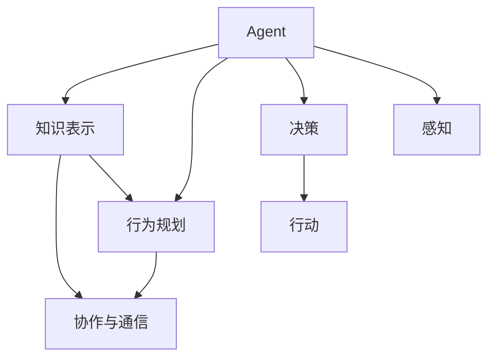

                 

# Agent技术的发展与应用

## 1. 背景介绍

在现代社会中，人们面临着越来越复杂的信息处理任务，需要高效自动化的解决方案。智能代理（Agent）技术正是为了解决这一问题而逐步发展起来的。Agent技术可以理解为一种可以自主运行的软件实体，它在无需人类干预的情况下，能够处理复杂的信息和任务，执行特定的逻辑功能，并在需要时与外界进行交互。

### 1.1 问题由来

随着互联网的普及和信息技术的飞速发展，智能代理技术已经从理论研究走向实际应用。从早期的基于规则的专家系统，到后来基于机器学习的决策系统，再到现今基于深度学习和强化学习的智能体，Agent技术已经逐步演进，成为了解决复杂决策和任务处理问题的强大工具。然而，在实际应用中，Agent技术仍面临许多挑战，如知识表示、行为规划、协作与通信等，这些都是需要深入研究和解决的问题。

### 1.2 问题核心关键点

Agent技术的核心关键点包括：

- **知识表示**：Agent需要能够表示和理解世界中的各种知识和信息，这是实现智能决策的基础。
- **行为规划**：Agent需要具备规划和执行目标行为的能力，这包括策略选择、路径规划等。
- **协作与通信**：Agent需要在复杂的环境中与其他Agent或人进行协作和通信，以达成共同目标。

这些关键点相互关联，共同构成了Agent技术的核心架构。

## 2. 核心概念与联系

### 2.1 核心概念概述

为了更好地理解Agent技术的发展与应用，本节将介绍几个关键概念：

- **Agent**：一种自主运行的软件实体，能够在无人类干预的情况下，处理信息和执行任务。
- **知识表示**：Agent对世界知识和信息的抽象和表示方式，如基于规则的表示、基于语义网络的表示等。
- **行为规划**：Agent规划和执行目标行为的能力，包括策略选择、路径规划等。
- **协作与通信**：Agent与其他Agent或人进行协作和信息交换的能力，这是实现复杂任务的基础。

这些概念之间的联系通过以下Mermaid流程图来展示：



这个流程图展示Agent技术的关键概念及其之间的逻辑关系：

1. **Agent**：作为主体，通过知识表示、行为规划和协作通信，进行决策和行动。
2. **知识表示**：提供Agent决策和行为规划的基础，是理解和处理环境信息的关键。
3. **行为规划**：指导Agent选择策略和规划路径，是实现目标行为的核心。
4. **协作与通信**：使得Agent能够与其他实体进行交互和信息共享，实现复杂任务的执行。
5. **决策**：基于知识表示和行为规划，Agent做出决策。
6. **行动**：Agent执行决策，并感知环境变化。

这些概念共同构成了Agent技术的核心架构，使得Agent能够在复杂环境中自主运行和完成任务。

## 3. 核心算法原理 & 具体操作步骤

### 3.1 算法原理概述

Agent技术的核心算法包括知识表示、行为规划、协作通信和决策推理等。下面将详细介绍这些算法的原理和操作步骤。

### 3.2 算法步骤详解

#### 3.2.1 知识表示

知识表示是Agent技术的基础。常见的知识表示方法包括基于规则的表示、基于框架的表示、基于语义网络的表示等。下面以基于语义网络的表示为例，介绍知识表示的详细步骤：

1. **定义语义网络**：语义网络由节点（实体）和边（关系）组成，用于表示知识的基本结构。
2. **构建知识库**：将具体领域的知识以语义网络的形式存储在知识库中。
3. **推理与推理引擎**：通过推理引擎对知识库中的知识进行推理，提取有用的信息。

#### 3.2.2 行为规划

行为规划是Agent技术的关键。常见的行为规划算法包括经典搜索算法（如深度优先搜索、广度优先搜索）、启发式搜索算法（如A*算法、SAT求解器）和基于学习的方法（如Q学习、强化学习）。下面以基于学习的方法为例，介绍行为规划的详细步骤：

1. **环境建模**：对环境进行建模，包括环境状态、动作、奖励等。
2. **选择算法**：选择适合的环境和任务的行为规划算法，如Q学习、强化学习等。
3. **训练模型**：使用历史数据训练行为规划模型，优化行为选择策略。
4. **执行策略**：在实际环境中执行行为规划模型，选择最优行为。

#### 3.2.3 协作与通信

协作与通信是Agent技术在复杂环境中的重要组成部分。常见的协作与通信算法包括分布式计算、多Agent系统、交互语言等。下面以多Agent系统为例，介绍协作与通信的详细步骤：

1. **环境建模**：对环境进行建模，包括Agent间的交互和通信机制。
2. **选择协作算法**：选择适合的多Agent协作算法，如合作游戏、协同进化等。
3. **协调策略**：设计Agent间的协调策略，确保协作的顺利进行。
4. **通信协议**：定义Agent间的信息交换协议，确保数据传输的可靠性和安全性。

#### 3.2.4 决策推理

决策推理是Agent技术的重要组成部分。常见的决策推理算法包括基于规则的推理、基于模型的推理、基于证据的推理等。下面以基于规则的推理为例，介绍决策推理的详细步骤：

1. **定义规则**：根据具体问题定义推理规则，形成推理规则库。
2. **规则匹配**：将输入信息与规则库中的规则进行匹配，提取有用的信息。
3. **推理计算**：根据匹配到的规则进行推理计算，得出推理结果。

### 3.3 算法优缺点

Agent技术在实际应用中表现出了显著的优点，同时也存在一些缺点：

#### 优点：

1. **自主性**：Agent能够在无人类干预的情况下自主运行，处理复杂的信息和任务。
2. **可扩展性**：Agent技术可以灵活扩展，适用于各种规模和复杂度的应用场景。
3. **灵活性**：Agent技术可以根据具体问题进行调整和优化，适应不同的应用需求。

#### 缺点：

1. **复杂性**：Agent技术的实现和维护相对复杂，需要较高的技术门槛。
2. **可解释性**：Agent技术的决策过程和行为规划往往难以解释，难以进行调试和优化。
3. **鲁棒性**：Agent技术在面对环境变化和噪声干扰时，鲁棒性可能不足，容易产生错误。

### 3.4 算法应用领域

Agent技术广泛应用于各种领域，包括智能交通、智能电网、智能家居、金融交易等。这些领域中，Agent技术可以发挥重要的作用：

- **智能交通**：在交通管理、车辆导航等方面，Agent技术可以通过协作与通信，实现交通流优化和车辆调度。
- **智能电网**：在电力管理、电力调度等方面，Agent技术可以通过协作与通信，实现电力资源的优化配置。
- **智能家居**：在家电控制、环境监测等方面，Agent技术可以通过感知和行为规划，实现智能化的家居管理。
- **金融交易**：在股票交易、风险管理等方面，Agent技术可以通过行为规划和决策推理，实现智能化的金融决策。

除了上述这些领域外，Agent技术还可以应用于医疗、教育、物流等更多场景，为各行各业带来新的变革。

## 4. 数学模型和公式 & 详细讲解 & 举例说明

### 4.1 数学模型构建

本节将使用数学语言对Agent技术的核心算法进行更加严格的刻画。

假设Agent需要在一个离散的状态空间 $S$ 中选择一个动作 $a$，以最大化累积奖励 $R$。常见的行为规划算法包括Q学习、强化学习等。以Q学习为例，其数学模型可以表示为：

$$
Q(s,a) = Q(s,a) + \alpha (r + \gamma \max Q'(s',a') - Q(s,a))
$$

其中 $Q(s,a)$ 表示在状态 $s$ 下执行动作 $a$ 的Q值，$\alpha$ 为学习率，$r$ 为即时奖励，$\gamma$ 为折扣因子，$Q'(s',a')$ 表示在下一个状态 $s'$ 下执行动作 $a'$ 的Q值。

### 4.2 公式推导过程

以Q学习算法为例，下面推导其更新公式：

设 $Q(s,a)$ 表示在状态 $s$ 下执行动作 $a$ 的Q值，则Q学习的更新公式为：

$$
Q(s,a) = Q(s,a) + \alpha (r + \gamma \max Q'(s',a') - Q(s,a))
$$

其中 $Q'(s',a')$ 表示在下一个状态 $s'$ 下执行动作 $a'$ 的Q值，$\alpha$ 为学习率。

假设 $Q(s,a)$ 的当前值为 $Q_0(s,a)$，则更新后的Q值为：

$$
Q(s,a) = Q_0(s,a) + \alpha [r + \gamma \max Q'(s',a') - Q_0(s,a)]
$$

通过不断迭代，Q值不断更新，直至收敛。

### 4.3 案例分析与讲解

以智能交通系统中的车流优化为例，介绍Agent技术的应用。

假设道路上的车辆数量可以用状态 $S$ 表示，车辆的速度可以用动作 $A$ 表示，每秒钟的奖励 $R$ 可以用燃油消耗和交通状况等指标表示。

1. **知识表示**：定义道路上的节点和边，表示交通网络的结构；定义车辆状态和速度，表示车辆行为。
2. **行为规划**：选择Q学习算法，通过历史数据训练Q值，优化车辆速度的选择。
3. **协作与通信**：设计车辆间的通信协议，实现信息共享和协作优化。
4. **决策推理**：根据道路状态和车辆状态，进行决策推理，优化车辆速度和行驶路径。

## 5. 项目实践：代码实例和详细解释说明

### 5.1 开发环境搭建

在进行Agent技术开发前，我们需要准备好开发环境。以下是使用Python进行PyTorch开发的环境配置流程：

1. 安装Anaconda：从官网下载并安装Anaconda，用于创建独立的Python环境。

2. 创建并激活虚拟环境：
```bash
conda create -n pytorch-env python=3.8 
conda activate pytorch-env
```

3. 安装PyTorch：根据CUDA版本，从官网获取对应的安装命令。例如：
```bash
conda install pytorch torchvision torchaudio cudatoolkit=11.1 -c pytorch -c conda-forge
```

4. 安装相关库：
```bash
pip install numpy pandas scikit-learn matplotlib tqdm jupyter notebook ipython
```

完成上述步骤后，即可在`pytorch-env`环境中开始Agent技术的开发。

### 5.2 源代码详细实现

下面以智能交通系统中的车流优化为例，给出使用PyTorch实现Q学习的代码：

```python
import torch
import torch.nn as nn
import torch.optim as optim
import numpy as np
from torch.distributions import Categorical

class QNetwork(nn.Module):
    def __init__(self, n_states, n_actions):
        super(QNetwork, self).__init__()
        self.n_states = n_states
        self.n_actions = n_actions
        self.fc1 = nn.Linear(n_states, 64)
        self.fc2 = nn.Linear(64, n_actions)
        
    def forward(self, x):
        x = torch.relu(self.fc1(x))
        x = torch.relu(self.fc2(x))
        return x
    
    def act(self, x):
        x = self.forward(x)
        action_probs = F.softmax(x, dim=1)
        action = Categorical(action_probs).sample()
        return action.item()

# 构建Q学习模型
n_states = 4
n_actions = 2
q_network = QNetwork(n_states, n_actions)

# 定义优化器和损失函数
optimizer = optim.Adam(q_network.parameters(), lr=0.001)
loss_fn = nn.MSELoss()

# 训练过程
def train_q_network():
    for i in range(10000):
        state = np.random.randint(n_states)
        action = np.random.randint(n_actions)
        next_state, reward, done = simulate(state, action)
        if not done:
            action_next = np.random.randint(n_actions)
        else:
            action_next = None
        
        q_next = q_network(torch.tensor([next_state])).detach().numpy()
        q_values = q_network(torch.tensor([state])).detach().numpy()
        q_values[action] = reward + gamma * np.max(q_next)
        
        optimizer.zero_grad()
        q_values = torch.tensor([q_values])
        loss = loss_fn(q_values, q_network(torch.tensor([state])))
        loss.backward()
        optimizer.step()
        
        if i % 100 == 0:
            print(f"Iteration: {i}, State: {state}, Action: {action}, Next State: {next_state}, Reward: {reward}, Next Action: {action_next}")

# 模拟函数
def simulate(state, action):
    next_state = (state + action) % n_states
    reward = -1
    done = False
    if next_state == 0:
        reward = 10
        done = True
    elif next_state == 2:
        reward = -10
        done = True
    return next_state, reward, done

# 训练模型
train_q_network()
```

### 5.3 代码解读与分析

让我们再详细解读一下关键代码的实现细节：

**QNetwork类**：
- `__init__`方法：定义网络的输入输出维度和网络结构。
- `forward`方法：前向传播计算Q值。
- `act`方法：根据当前状态选择动作。

**Q学习模型训练**：
- `q_network`：定义Q学习模型的网络结构。
- `optimizer`：定义优化器。
- `loss_fn`：定义损失函数。
- `train_q_network`函数：定义训练过程，使用Q学习算法更新模型参数。
- `simulate`函数：定义模拟环境，返回下一状态、即时奖励和是否终止的标志。

**模拟过程**：
- `train_q_network`函数调用`simulate`函数模拟环境，更新模型参数。
- `simulate`函数根据当前状态和动作，返回下一状态、即时奖励和是否终止的标志。

通过以上代码，我们实现了基于Q学习的智能交通系统车流优化。可以看到，Agent技术的实现可以借助深度学习框架和优化算法，实现相对简单的代码逻辑。

## 6. 实际应用场景

### 6.1 智能交通系统

Agent技术在智能交通系统中的应用可以显著提升交通管理效率和安全性。通过在车辆和交通管理系统中部署Agent，可以实现交通流优化、路径规划、避障等功能。

以车辆避障为例，Agent技术可以通过感知周围环境，根据交通规则和自身状态，选择最优的行驶路径。在实际应用中，可以通过传感器数据、GPS等手段获取车辆状态和环境信息，将其输入Agent模型进行处理，从而实现智能避障。

### 6.2 智能电网

Agent技术在智能电网中的应用可以优化电力资源的分配和调度。通过在电网设备中部署Agent，可以实现电力负荷预测、电网异常监测、故障检测等功能。

以电力负荷预测为例，Agent技术可以通过历史负荷数据和天气、季节等外部因素，预测未来的电力负荷。在实际应用中，可以通过传感器数据、天气预报等手段获取环境信息，将其输入Agent模型进行处理，从而实现精确的负荷预测。

### 6.3 智能家居

Agent技术在智能家居中的应用可以提升家居设备的智能化水平。通过在智能家居设备中部署Agent，可以实现语音控制、场景模式、节能管理等功能。

以节能管理为例，Agent技术可以通过感知家庭环境，根据用户的行为习惯和环境状态，调整家居设备的运行模式，实现节能减排。在实际应用中，可以通过传感器数据、智能设备等手段获取环境信息，将其输入Agent模型进行处理，从而实现智能化的家居管理。

### 6.4 未来应用展望

随着Agent技术的发展，其在更多领域的应用前景也将更加广阔。

在智慧医疗领域，Agent技术可以用于病历分析、诊断辅助、药物研发等。通过在医疗设备中部署Agent，可以实现病历数据的自动分析、诊断结果的智能推荐、药物效果的预测等功能。

在智能教育领域，Agent技术可以用于智能辅导、智能评估、智能推荐等。通过在教育设备中部署Agent，可以实现学生的个性化辅导、作业自动批改、课程推荐等功能。

在智慧城市治理中，Agent技术可以用于事件监测、舆情分析、应急指挥等。通过在城市管理系统中部署Agent，可以实现城市事件的自动监测、舆情动态的实时分析、紧急事件的快速响应等功能。

此外，在企业生产、社会治理、文娱传媒等更多领域，Agent技术也将得到广泛应用，为各行各业带来新的变革。

## 7. 工具和资源推荐

### 7.1 学习资源推荐

为了帮助开发者系统掌握Agent技术的基础理论和实际应用，这里推荐一些优质的学习资源：

1. **《人工智能基础》**：斯坦福大学公开课，涵盖了人工智能的基本概念和前沿技术，是了解Agent技术的入门必读。
2. **《多Agent系统》**：David Poole的著作，详细介绍了多Agent系统的理论基础和应用案例，是Agent技术的经典参考书。
3. **《强化学习》**：Richard S. Sutton和Andrew G. Barto的著作，介绍了强化学习的原理和应用，是Agent技术的理论基础之一。
4. **《Python多Agent系统》**：Python中多Agent系统的实用指南，提供了丰富的实践案例和代码示例。
5. **《AI未来之路》**：吴恩达的公开课，介绍了AI技术的发展历程和未来方向，是了解Agent技术的宏观视角。

通过对这些资源的学习实践，相信你一定能够快速掌握Agent技术的精髓，并用于解决实际的智能决策和任务处理问题。

### 7.2 开发工具推荐

高效的开发离不开优秀的工具支持。以下是几款用于Agent技术开发的常用工具：

1. **PyTorch**：基于Python的开源深度学习框架，灵活的计算图设计，适合快速迭代研究。
2. **TensorFlow**：由Google主导开发的开源深度学习框架，生产部署方便，适合大规模工程应用。
3. **TensorFlow Agents**：TensorFlow的Agent库，提供了丰富的Agent模型和训练工具，支持复杂的决策推理和协作通信。
4. **Rosetta**：Rosetta系统，提供了多Agent系统的模拟和实验平台，方便开发者进行Agent模型的测试和优化。
5. **MultiAgent CoopSys**：开源多Agent协作系统，支持多种协作协议和通信机制，适用于复杂的协作场景。

合理利用这些工具，可以显著提升Agent技术开发的效率，加快创新迭代的步伐。

### 7.3 相关论文推荐

Agent技术的发展源于学界的持续研究。以下是几篇奠基性的相关论文，推荐阅读：

1. **《Reinforcement Learning》**：Richard S. Sutton和Andrew G. Barto的著作，介绍了强化学习的原理和应用，是Agent技术的理论基础之一。
2. **《Multi-Agent Systems: Exploring Possibilities in Communications, Computing, and Control》**：J. Allen Jackson的著作，详细介绍了多Agent系统的理论基础和应用案例。
3. **《Intelligent Agents for the Common Sense Web》**：Sid Blackmore等人的论文，介绍了Agent技术在Web智能中的应用，是Agent技术的实践案例之一。
4. **《Model-Based Deep Reinforcement Learning》**：Saurabh V. Umapathi和Geoffrey J. Gordon的论文，介绍了模型基于的强化学习算法，适用于复杂的决策推理问题。
5. **《Distributed Multi-Agent Learning》**：Maynard C. Haar的论文，介绍了分布式多Agent学习算法，适用于协作和通信场景。

这些论文代表了大语言模型微调技术的发展脉络。通过学习这些前沿成果，可以帮助研究者把握学科前进方向，激发更多的创新灵感。

## 8. 总结：未来发展趋势与挑战

### 8.1 总结

本文对Agent技术的发展与应用进行了全面系统的介绍。首先阐述了Agent技术的研究背景和意义，明确了Agent技术在解决复杂决策和任务处理问题中的重要价值。其次，从原理到实践，详细讲解了Agent技术的核心算法和操作步骤，给出了Agent技术开发的完整代码实例。同时，本文还广泛探讨了Agent技术在智能交通、智能电网、智能家居等多个领域的应用前景，展示了Agent技术的巨大潜力。此外，本文精选了Agent技术的各类学习资源，力求为读者提供全方位的技术指引。

通过本文的系统梳理，可以看到，Agent技术已经从理论研究走向实际应用，在多个领域展现了显著的优势和潜力。随着技术的发展和应用的拓展，Agent技术必将在更多领域得到应用，为各行各业带来新的变革。

### 8.2 未来发展趋势

展望未来，Agent技术将呈现以下几个发展趋势：

1. **更加自主**：随着深度学习、强化学习等技术的发展，Agent将具备更加自主的决策和行动能力，实现更复杂的任务处理。
2. **更加智能**：随着知识表示、行为规划等技术的发展，Agent将具备更加智能的决策推理能力，实现更高级的智能决策。
3. **更加协作**：随着多Agent系统、协作协议等技术的发展，Agent将具备更加协作的通信和交互能力，实现更高效的群体决策。
4. **更加集成**：随着AI技术的融合发展，Agent将与其他AI技术如机器学习、计算机视觉等进行更深入的集成，提升整体智能化水平。
5. **更加安全**：随着安全技术的发展，Agent将具备更加安全的通信和协作能力，防止被攻击和误用。

以上趋势凸显了Agent技术的广阔前景。这些方向的探索发展，必将进一步提升Agent技术的性能和应用范围，为各行各业带来新的变革。

### 8.3 面临的挑战

尽管Agent技术已经取得了显著的进展，但在迈向更加智能化、普适化应用的过程中，仍面临诸多挑战：

1. **复杂性**：Agent技术在实现和维护方面相对复杂，需要较高的技术门槛。
2. **鲁棒性**：Agent技术在面对环境变化和噪声干扰时，鲁棒性可能不足，容易产生错误。
3. **可解释性**：Agent技术的决策过程和行为规划往往难以解释，难以进行调试和优化。
4. **安全性**：Agent技术在面对恶意攻击和误用时，安全性可能不足，需要进一步加强。
5. **资源消耗**：Agent技术的计算和存储需求较大，需要优化资源消耗以提升性能。

正视Agent技术面临的这些挑战，积极应对并寻求突破，将是大语言模型微调技术走向成熟的必由之路。相信随着学界和产业界的共同努力，这些挑战终将一一被克服，Agent技术必将在构建人机协同的智能时代中扮演越来越重要的角色。

### 8.4 研究展望

面对Agent技术面临的种种挑战，未来的研究需要在以下几个方面寻求新的突破：

1. **知识表示的自动化**：探索更加自动化的知识表示方法，减少人工干预，提升知识表示的效率和准确性。
2. **行为规划的优化**：开发更加高效的决策推理算法，提升行为规划的效率和效果。
3. **协作通信的增强**：研究更加高效的协作协议和通信机制，提升协作通信的效率和效果。
4. **安全性的保障**：研究安全技术，提升Agent的安全性和鲁棒性，防止恶意攻击和误用。
5. **资源消耗的优化**：研究资源优化技术，减少计算和存储的消耗，提升Agent的性能和可扩展性。

这些研究方向的探索，必将引领Agent技术迈向更高的台阶，为构建安全、可靠、可解释、可控的智能系统铺平道路。面向未来，Agent技术还需要与其他AI技术进行更深入的融合，如知识表示、因果推理、强化学习等，多路径协同发力，共同推动自然语言理解和智能交互系统的进步。只有勇于创新、敢于突破，才能不断拓展Agent技术的边界，让智能技术更好地造福人类社会。

## 9. 附录：常见问题与解答

**Q1：Agent技术是否适用于所有复杂决策和任务处理问题？**

A: Agent技术在处理复杂决策和任务处理问题时表现出了显著的优势和潜力，但并非适用于所有场景。对于一些需要高度人工干预和精细调整的任务，Agent技术可能无法完全替代人工。此外，Agent技术的实现和维护相对复杂，需要较高的技术门槛，因此在应用时需要进行综合考虑。

**Q2：如何选择合适的行为规划算法？**

A: 选择合适的行为规划算法需要考虑具体问题的特点和复杂度。常见的行为规划算法包括基于规则的推理、基于模型的推理、基于学习的算法等。对于规则明确的问题，可以使用基于规则的推理算法；对于复杂多变的问题，可以使用基于模型的推理算法；对于需要学习决策的动态问题，可以使用基于学习的算法。在实际应用中，需要根据具体问题进行选择和优化。

**Q3：Agent技术在面对复杂环境时，如何提升鲁棒性？**

A: 提升Agent技术的鲁棒性可以从以下几个方面入手：
1. **增加数据量**：增加训练数据量，提升模型泛化能力。
2. **引入正则化**：使用正则化技术，如L2正则、Dropout等，防止过拟合。
3. **引入对抗训练**：通过引入对抗样本，提升模型的鲁棒性。
4. **优化模型结构**：优化模型结构，减少参数量，提升模型的稳定性和鲁棒性。
5. **引入多模型集成**：通过集成多个Agent模型，提升整体的鲁棒性和抗干扰能力。

**Q4：Agent技术在实现过程中，如何保证安全性？**

A: 保证Agent技术的安全性可以从以下几个方面入手：
1. **引入安全技术**：引入安全技术，如加密、认证、访问控制等，防止恶意攻击和误用。
2. **设计安全协议**：设计安全协议，规范Agent之间的通信和协作，防止恶意攻击和信息泄露。
3. **加强监控和审计**：加强对Agent系统的监控和审计，及时发现和处理安全漏洞和异常行为。
4. **引入伦理约束**：在设计Agent系统的目标函数时，引入伦理约束，防止有害行为的出现。

这些措施可以帮助提升Agent技术的安全性和可靠性，保障其在实际应用中的安全性和稳定性。

**Q5：Agent技术在实现过程中，如何优化资源消耗？**

A: 优化Agent技术的资源消耗可以从以下几个方面入手：
1. **模型压缩**：使用模型压缩技术，减少模型参数量和计算量。
2. **量化加速**：将浮点模型转为定点模型，压缩存储空间，提高计算效率。
3. **资源管理**：优化资源管理，减少内存和存储的消耗，提升系统性能。
4. **分布式计算**：使用分布式计算技术，提升系统的并行计算能力，加速模型训练和推理。
5. **动态调整**：根据实际情况，动态调整资源配置，提升系统的灵活性和可扩展性。

这些措施可以帮助优化Agent技术的资源消耗，提升系统的性能和可扩展性。

---

作者：禅与计算机程序设计艺术 / Zen and the Art of Computer Programming

