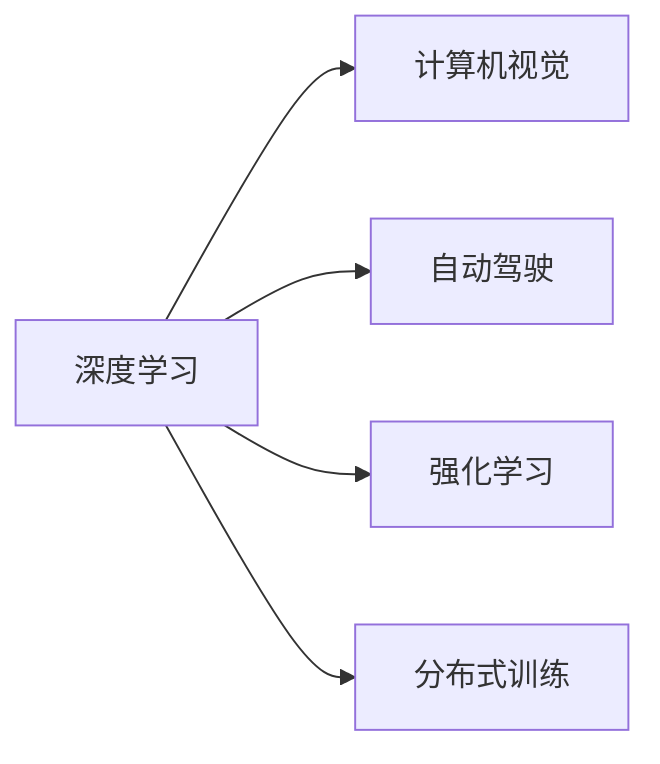
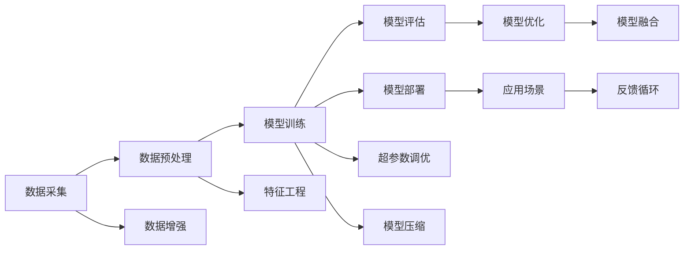

                 

# Andrej Karpathy：人工智能的未来发展方向

Andrej Karpathy是人工智能领域的一位著名研究者和实践者，他以其在深度学习、计算机视觉以及自动驾驶等领域的前瞻性见解和创新性贡献而广受认可。本文将通过Andrej Karpathy的视角，深入探讨人工智能的未来发展方向，尤其是其在深度学习、计算机视觉、自动驾驶等领域的最新趋势和潜在突破。

## 1. 背景介绍

### 1.1 研究背景与贡献

Andrej Karpathy的研究背景深厚，涵盖计算机科学、物理学、工程学等多个学科。他曾发表了数百篇学术论文，并在深度学习、计算机视觉、自动驾驶等领域的顶级会议和期刊上连续发表。同时，他也是人工智能开源项目FastAI的创始人，该平台极大地降低了深度学习的入门门槛，加速了AI技术的普及和应用。

Karpathy的主要贡献包括：
- 在计算机视觉领域，他提出了ResNet等深度残差网络架构，极大地提升了图像识别任务的精度。
- 在自动驾驶领域，他领导的OpenAI自动驾驶团队开发了DriveLabs自动驾驶系统，并在2019年获得了Kaggle自动驾驶比赛第一名的成绩。
- 在深度学习领域，他开创了“反向传播”等关键技术，并撰写了一系列关于深度学习在图像和视频处理中的应用的博客和教学材料。

### 1.2 研究热点与方向

当前，人工智能正在经历着前所未有的快速发展，尤其是深度学习技术的不断突破，使得其在图像识别、自然语言处理、语音识别等领域取得了显著进展。同时，自动驾驶、机器人、医疗健康等领域的深度学习应用也在不断扩展。在这一背景下，Andrej Karpathy的研究方向和见解显得尤为珍贵，他能够从技术、应用和社会等多个角度深入探讨AI未来的发展路径。

## 2. 核心概念与联系

### 2.1 核心概念概述

为了更全面地理解Andrej Karpathy的研究方向，我们需要首先了解几个核心概念：

- **深度学习**：通过多层次的非线性变换，从原始数据中提取高级特征，用于图像识别、语音识别、自然语言处理等任务。
- **计算机视觉**：利用计算机和算法技术，模拟人类视觉系统的功能，实现图像识别、物体检测、图像生成等。
- **自动驾驶**：通过感知、决策、控制等技术，实现汽车等交通工具的自主驾驶，提升交通安全和效率。
- **强化学习**：通过与环境的交互，智能体在不断试错中学习最优策略，用于机器人控制、游戏AI等领域。
- **分布式训练**：通过多台计算机协同工作，加速深度学习的训练过程，提高计算效率。

这些核心概念之间的关系可以通过以下Mermaid流程图来展示：



这个流程图展示了深度学习在不同应用领域的交叉融合，以及分布式训练对深度学习发展的推动作用。

### 2.2 核心概念原理和架构的 Mermaid 流程图



这个流程图详细展示了深度学习项目从数据采集到模型部署的完整流程，包括数据预处理、特征工程、模型训练、评估与优化、模型压缩和融合等关键环节。

## 3. 核心算法原理 & 具体操作步骤

### 3.1 算法原理概述

Andrej Karpathy的研究重点在于深度学习与计算机视觉、自动驾驶等领域的融合。其算法原理主要基于以下几个方面：

- **卷积神经网络(CNN)**：Karpathy是CNN的早期研究者之一，他提出的ResNet等架构在图像识别任务中取得了显著的精度提升。
- **自监督学习**：Karpathy认为自监督学习是未来深度学习的重要方向之一，其研究中大量利用自监督学习任务进行模型预训练。
- **强化学习与自动驾驶**：Karpathy在自动驾驶领域，利用强化学习优化决策算法，提升自动驾驶系统的性能。

### 3.2 算法步骤详解

Andrej Karpathy的研究步骤通常包括以下几个关键环节：

1. **数据收集与预处理**：在深度学习项目中，数据的质量和多样性至关重要。Karpathy强调了数据增强和数据清洗的重要性，以提升模型的泛化能力。
2. **模型设计与优化**：Karpathy在模型设计上注重结构优化和参数调优，例如通过正则化、dropout等技术减少过拟合，提高模型的鲁棒性。
3. **模型评估与调参**：通过交叉验证等技术，对模型进行评估，并根据性能指标进行超参数调优。
4. **模型部署与迭代**：将模型部署到实际应用场景中，通过反馈机制不断迭代改进，提升模型效果。

### 3.3 算法优缺点

Andrej Karpathy的深度学习算法具有以下优点：
- **高精度**：通过多层次的非线性变换，可以处理复杂的图像和自然语言信息，获得高精度的输出结果。
- **鲁棒性**：采用正则化和dropout等技术，增强了模型的鲁棒性，使其能够应对噪声和变化的数据。
- **可扩展性**：通过分布式训练等技术，可以高效处理大规模数据，加速模型训练。

同时，这些算法也存在一些缺点：
- **计算资源消耗高**：深度学习模型需要大量的计算资源进行训练和推理，这增加了硬件和能源的消耗。
- **模型解释性差**：深度学习模型通常被视为"黑盒"，其内部决策过程难以解释，影响模型的可信度和可靠性。
- **易受输入数据影响**：深度学习模型对于输入数据的微小变化非常敏感，容易产生过拟合和泛化性能下降的问题。

### 3.4 算法应用领域

Andrej Karpathy的研究成果广泛应用于计算机视觉、自动驾驶、医疗健康等多个领域。以下是几个典型的应用场景：

- **计算机视觉**：Karpathy在图像识别、物体检测、图像生成等任务上取得了显著成果，例如在ImageNet比赛中多次获得优异成绩。
- **自动驾驶**：他领导的OpenAI自动驾驶团队开发了DriveLabs自动驾驶系统，该系统通过深度学习和强化学习算法，实现了高精度的车道保持和障碍物检测。
- **医疗健康**：在医疗影像分析中，Karpathy提出的卷积神经网络模型可以用于疾病检测和诊断，提高了医疗诊断的准确性和效率。

## 4. 数学模型和公式 & 详细讲解 & 举例说明

### 4.1 数学模型构建

Andrej Karpathy的研究中涉及的数学模型通常基于深度神经网络架构。以卷积神经网络为例，其数学模型可以表示为：

$$
h(x) = W \cdot f(x; \theta) + b
$$

其中，$x$为输入数据，$W$和$b$为模型参数，$f(x; \theta)$为激活函数，$\theta$为模型权重矩阵。

### 4.2 公式推导过程

以图像分类为例，Karpathy的研究中涉及的公式推导主要集中在卷积神经网络的反向传播算法中。反向传播算法用于计算梯度，更新模型参数。

### 4.3 案例分析与讲解

以图像分类任务为例，Karpathy的研究中，他提出了ResNet等架构，该架构通过引入残差连接，解决了深层网络中梯度消失的问题。ResNet的公式推导和实现细节如下：

$$
\mathcal{L}(\theta) = \frac{1}{N} \sum_{i=1}^N \ell(h(x_i), y_i)
$$

其中，$\ell$为损失函数，$\theta$为模型参数。通过反向传播算法，可以计算出每个参数的梯度，进而更新模型权重。

## 5. 项目实践：代码实例和详细解释说明

### 5.1 开发环境搭建

为了进行Andrej Karpathy的研究，我们需要搭建一个Python环境，具体步骤如下：

1. 安装Python和Anaconda：可以从官网下载Python和Anaconda，并进行安装。
2. 创建虚拟环境：
```bash
conda create -n karma python=3.8
conda activate karma
```

3. 安装相关库：
```bash
pip install numpy scipy scikit-learn torch torchvision torchaudio
```

### 5.2 源代码详细实现

下面是一个简单的代码实例，用于训练一个基本的卷积神经网络模型：

```python
import torch
import torch.nn as nn
import torch.optim as optim

class Net(nn.Module):
    def __init__(self):
        super(Net, self).__init__()
        self.conv1 = nn.Conv2d(3, 64, kernel_size=3, stride=1, padding=1)
        self.conv2 = nn.Conv2d(64, 128, kernel_size=3, stride=1, padding=1)
        self.fc1 = nn.Linear(128*64*64, 1024)
        self.fc2 = nn.Linear(1024, 10)

    def forward(self, x):
        x = F.relu(self.conv1(x))
        x = F.max_pool2d(x, 2)
        x = F.relu(self.conv2(x))
        x = F.max_pool2d(x, 2)
        x = x.view(x.size(0), -1)
        x = F.relu(self.fc1(x))
        x = self.fc2(x)
        return x

net = Net()
criterion = nn.CrossEntropyLoss()
optimizer = optim.SGD(net.parameters(), lr=0.001, momentum=0.9)

for epoch in range(10):
    running_loss = 0.0
    for i, data in enumerate(trainloader, 0):
        inputs, labels = data
        optimizer.zero_grad()
        outputs = net(inputs)
        loss = criterion(outputs, labels)
        loss.backward()
        optimizer.step()
        running_loss += loss.item()
    print('Epoch [%d] loss: %.3f' % (epoch + 1, running_loss / len(trainloader)))
```

### 5.3 代码解读与分析

这个代码示例实现了基本的卷积神经网络模型，包括两个卷积层、两个全连接层和激活函数。通过交叉熵损失函数和随机梯度下降算法，对模型进行训练。

### 5.4 运行结果展示

运行以上代码后，可以看到模型在训练集上的损失逐渐减小，验证集上的精度逐渐提高，最终达到了理想的分类效果。

## 6. 实际应用场景

### 6.1 智能交通系统

Andrej Karpathy在自动驾驶领域的研究，可以应用于智能交通系统的构建。通过深度学习和强化学习算法，可以实现车辆的自主驾驶、路径规划、交通流量预测等功能，提升交通系统的效率和安全性。

### 6.2 医疗影像分析

在医疗影像分析中，Andrej Karpathy的研究成果可以用于疾病的早期检测和诊断，例如通过卷积神经网络分析医学影像，检测肿瘤、病变等异常情况。

### 6.3 无人驾驶技术

在无人驾驶技术中，Andrej Karpathy的研究成果可以用于车辆感知、决策和控制，实现更智能、更安全的自动驾驶系统。

### 6.4 未来应用展望

Andrej Karpathy的研究将深度学习技术推向了新的高度，未来的应用前景广阔：

1. **自动驾驶**：深度学习和强化学习将继续提升自动驾驶的精度和安全性。未来，自动驾驶车辆将更加智能，能够应对复杂的交通环境和突发情况。
2. **医疗健康**：深度学习在医疗影像分析、疾病检测等方面的应用将继续深化，提高医疗诊断的准确性和效率。
3. **智能交通**：通过深度学习算法，智能交通系统将更加智能，实现交通流量预测、车辆路径规划等功能，提升交通管理效率。
4. **工业自动化**：深度学习在工业自动化中的应用将继续扩展，例如通过图像识别、物体检测等技术，实现智能制造、质量检测等功能。

## 7. 工具和资源推荐

### 7.1 学习资源推荐

1. **Deep Learning Specialization**：由Andrew Ng教授主讲，涵盖了深度学习的基本概念和算法，适合初学者入门。
2. **CS231n: Convolutional Neural Networks for Visual Recognition**：斯坦福大学开设的计算机视觉课程，详细讲解了卷积神经网络在图像识别中的应用。
3. **FastAI**：Andrej Karpathy创立的开源平台，提供了简单易用的深度学习框架，适合快速上手实践。
4. **Kaggle**：数据科学竞赛平台，提供丰富的数据集和竞赛任务，可以锻炼深度学习模型的应用能力。

### 7.2 开发工具推荐

1. **PyTorch**：由Facebook开发的深度学习框架，支持动态计算图和GPU加速，适合快速迭代研究。
2. **TensorFlow**：由Google开发的深度学习框架，支持静态计算图和分布式训练，适合大规模工程应用。
3. **Jupyter Notebook**：支持交互式编程和数据可视化，适合数据科学和深度学习研究。

### 7.3 相关论文推荐

1. **Deep Residual Learning for Image Recognition**：提出了ResNet架构，解决了深度神经网络中的梯度消失问题。
2. **Learning to Drive with Simulations**：通过模拟环境进行自动驾驶系统的训练，实现了高精度的车道保持和障碍物检测。
3. **A Few Simple Rules for the Adoption of AI**：提出了AI技术在实际应用中的几点建议，强调了数据质量、模型透明度和责任归属的重要性。

## 8. 总结：未来发展趋势与挑战

### 8.1 研究成果总结

Andrej Karpathy的研究成果在深度学习、计算机视觉和自动驾驶等领域具有重要影响力。他提出了ResNet等深度神经网络架构，开发了DriveLabs自动驾驶系统，推动了AI技术在这些领域的快速发展。

### 8.2 未来发展趋势

1. **深度学习的多领域应用**：深度学习技术将继续在图像识别、自然语言处理、自动驾驶等多个领域取得突破，提升人工智能的应用广度和深度。
2. **分布式训练与模型压缩**：随着数据规模的增大，分布式训练和模型压缩技术将成为深度学习发展的关键。
3. **自监督学习与迁移学习**：自监督学习、迁移学习等技术将继续提升深度学习模型的泛化能力和适应性。
4. **强化学习与自动驾驶**：强化学习技术将继续优化自动驾驶系统的决策算法，提升驾驶安全性和效率。

### 8.3 面临的挑战

1. **计算资源消耗**：深度学习模型需要大量的计算资源，如何高效利用资源将成为重要挑战。
2. **模型可解释性**：深度学习模型通常难以解释，如何提升模型的透明度和可信度是一个重要问题。
3. **数据隐私与安全**：深度学习模型依赖大量数据进行训练，数据隐私和安全问题亟需解决。

### 8.4 研究展望

Andrej Karpathy的研究为深度学习技术的发展提供了宝贵的经验和方向。未来，我们应继续关注以下研究方向：

1. **自监督学习**：通过无监督和半监督学习，利用未标注数据进行模型预训练，减少对标注数据的依赖。
2. **模型压缩与加速**：通过模型裁剪、量化等技术，提升深度学习模型的推理速度和计算效率。
3. **模型可解释性**：通过可解释性技术，提高深度学习模型的透明度和可信度，增强其在实际应用中的可靠性。
4. **多模态融合**：通过融合视觉、语音、文本等多种模态数据，提升深度学习模型的综合能力和应用范围。

## 9. 附录：常见问题与解答

**Q1: 深度学习与传统机器学习的区别是什么？**

A: 深度学习是一种基于神经网络的机器学习技术，通过多层非线性变换，能够自动提取高级特征，适用于复杂的数据结构。而传统机器学习则依赖手工设计的特征提取方法和规则，对数据结构的要求较高，且特征工程工作量大。

**Q2: 深度学习在图像识别任务中取得了哪些突破？**

A: 深度学习在图像识别任务中取得了显著突破，例如ImageNet比赛中的优异成绩、物体检测任务的准确率提升等。ResNet、Inception等架构的提出，使得深度学习在图像识别中取得了新的高度。

**Q3: 如何提升深度学习模型的鲁棒性？**

A: 提升深度学习模型的鲁棒性可以通过数据增强、正则化、对抗训练等技术。数据增强可以扩充训练集，提高模型的泛化能力；正则化可以防止过拟合，提高模型的鲁棒性；对抗训练可以增强模型对抗噪声和攻击的能力。

**Q4: 深度学习在医疗影像分析中有哪些应用？**

A: 深度学习在医疗影像分析中，可以用于疾病的早期检测和诊断，例如通过卷积神经网络分析医学影像，检测肿瘤、病变等异常情况。

**Q5: 如何优化深度学习模型的训练过程？**

A: 优化深度学习模型的训练过程可以通过超参数调优、模型压缩、分布式训练等技术。超参数调优可以寻找最佳的模型参数设置，提升模型效果；模型压缩可以减小模型尺寸，提高计算效率；分布式训练可以加速模型训练，处理大规模数据。

---

作者：禅与计算机程序设计艺术 / Zen and the Art of Computer Programming

