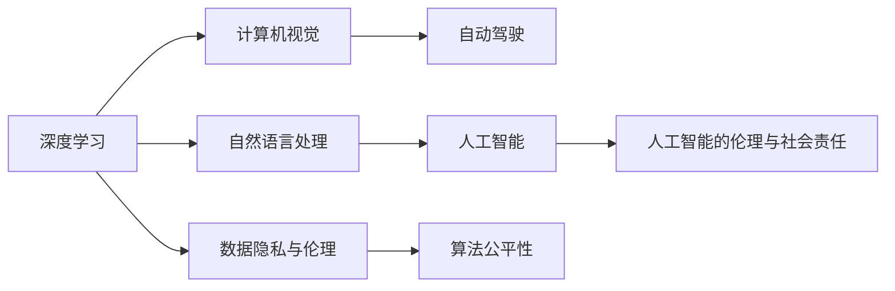

                 

## 1. 背景介绍

Andrej Karpathy，作为当今人工智能领域的领军人物之一，是深度学习先驱、计算机视觉和自动驾驶技术专家。他在深度学习算法、计算机视觉和自动驾驶等领域有着深远影响，并始终关注AI的伦理和社会责任。

近年来，随着深度学习技术的不断进步，人工智能在图像识别、语音识别、自然语言处理、自动驾驶等多个领域取得了显著的进展。但是，这些技术的发展同时也引发了人们对数据隐私、算法公平性、安全性等问题的深度关注。如何在技术进步的同时，保障社会公正和人类福祉，成为学界和业界亟需解决的问题。

Andrej Karpathy在这篇文章中深入探讨了人工智能的未来发展机遇和面临的挑战，提出了一系列前瞻性的观点和解决方案。他将从技术、社会伦理、教育与政策等多个层面，深入分析AI技术的发展方向和社会责任。

## 2. 核心概念与联系

### 2.1 核心概念概述

为了更好地理解Andrej Karpathy的见解，本节将介绍几个关键概念：

- **人工智能（AI）**：利用计算机算法，模拟和扩展人类的智能行为，包括学习、推理、决策、感知、语言处理等。

- **深度学习（Deep Learning）**：一种通过多层次神经网络，自动学习数据分布规律的技术。在图像识别、语音识别、自然语言处理等领域广泛应用。

- **计算机视觉（CV）**：使计算机能够理解、解释和处理图像和视频数据的技术，是自动驾驶、视频分析等领域的关键。

- **自动驾驶（Autonomous Driving）**：通过传感器、摄像头、雷达等设备，让车辆能够自主导航、避障、决策，最终实现无人驾驶。

- **数据隐私与伦理（Data Privacy and Ethics）**：在数据收集、处理和共享过程中，保护个人隐私，防止数据滥用，确保技术应用符合伦理道德。

- **算法公平性（Algorithmic Fairness）**：确保AI系统在决策过程中不产生偏见，平等对待各类人群，避免歧视和误判。

- **人工智能的伦理与社会责任（AI Ethics and Social Responsibility）**：探索AI技术在提升人类福祉、解决社会问题、维护社会公正等方面的责任和义务。

这些概念之间的联系紧密，共同构成了人工智能发展的广阔前景和重要挑战。

### 2.2 核心概念原理和架构的 Mermaid 流程图



这个流程图展示了各个关键概念之间的逻辑关系：

1. 深度学习为计算机视觉、自然语言处理等领域的突破提供了技术基础。
2. 计算机视觉和自然语言处理等技术推动了自动驾驶等复杂应用的发展。
3. 数据隐私与伦理、算法公平性等问题，与AI技术的普及和应用密切相关。
4. AI技术的广泛应用，也引发了对社会伦理和责任的深度思考。

## 3. 核心算法原理 & 具体操作步骤

### 3.1 算法原理概述

人工智能技术的发展，离不开深度学习的支撑。深度学习通过多层次神经网络，自动提取数据中的特征，学习数据分布规律，从而实现图像识别、语音识别、自然语言处理等复杂任务。

对于计算机视觉领域，Andrej Karpathy强调了深度卷积神经网络（CNN）的重要性。CNN通过卷积层、池化层等操作，捕捉图像中的空间关系，从而实现高精度的物体识别和分类。

在自然语言处理方面，Transformer模型因其自注意力机制，在语言生成、文本分类、机器翻译等任务中取得了显著进展。Transformer能够捕捉长距离依赖关系，同时避免传统RNN模型存在的梯度消失和爆炸问题。

自动驾驶技术则是计算机视觉和自然语言处理技术的综合应用。通过摄像头、雷达等传感器，实时获取环境数据，结合计算机视觉和自然语言处理技术，实现车辆的自主导航和决策。

### 3.2 算法步骤详解

深度学习的训练和应用通常包括以下几个步骤：

**Step 1: 数据准备**
- 收集和标注训练数据，确保数据质量和多样性。
- 将数据划分为训练集、验证集和测试集，以保证模型的泛化能力。

**Step 2: 模型设计**
- 选择合适的深度学习模型架构，如CNN、RNN、Transformer等。
- 设计损失函数、优化器、正则化等训练参数，以指导模型的学习过程。

**Step 3: 模型训练**
- 使用GPU/TPU等高性能设备，训练深度学习模型。
- 根据验证集性能，调整训练参数，避免过拟合和欠拟合。

**Step 4: 模型评估**
- 在测试集上评估模型性能，包括准确率、召回率、F1值等指标。
- 分析模型的误差来源，进行模型调优和改进。

**Step 5: 模型部署**
- 将训练好的模型部署到实际应用场景中，如自动驾驶车辆、智能音箱、智能监控系统等。
- 持续监测模型性能，更新模型参数，提升系统稳定性。

### 3.3 算法优缺点

深度学习算法在处理复杂任务方面具有显著优势，但也存在一些局限性：

**优点**：
- 强大的特征提取能力：自动从数据中学习特征，无需手动设计特征工程。
- 高精度：在图像识别、语音识别、自然语言处理等领域，深度学习模型取得了显著进展。
- 可扩展性：能够处理大规模数据，适应不同任务需求。

**缺点**：
- 数据依赖：需要大量标注数据进行训练，数据获取成本高。
- 计算资源需求高：深度学习模型通常需要高性能硬件支持，计算资源消耗大。
- 过拟合风险：在标注数据不足时，模型容易出现过拟合。
- 透明性不足：深度学习模型的决策过程难以解释，缺乏透明性。

### 3.4 算法应用领域

深度学习技术广泛应用于多个领域，包括但不限于：

- **计算机视觉**：图像分类、物体检测、图像生成等任务。
- **自然语言处理**：机器翻译、文本摘要、语音识别等任务。
- **自动驾驶**：智能交通、自动驾驶汽车、无人机等应用。
- **医疗健康**：医学影像分析、病理检测、药物研发等任务。
- **金融科技**：股票预测、风险管理、信用评分等任务。
- **工业制造**：质量检测、故障诊断、智能生产等任务。
- **智能家居**：语音助手、智能监控、智能温控等应用。

## 4. 数学模型和公式 & 详细讲解 & 举例说明

### 4.1 数学模型构建

在深度学习中，常用的数学模型包括卷积神经网络（CNN）、循环神经网络（RNN）和Transformer等。这里以CNN模型为例，介绍深度学习模型的数学建模过程。

假设输入图像为 $x$，输出为图像类别 $y$。CNN模型由卷积层、池化层、全连接层等组成。卷积层通过滤波器提取图像特征，池化层减少特征维度，全连接层进行分类。

模型的损失函数通常为交叉熵损失（Cross-Entropy Loss），表示模型预测与真实标签之间的差异。数学公式如下：

$$
\mathcal{L}(y,\hat{y}) = -\frac{1}{N} \sum_{i=1}^N y_i \log \hat{y}_i + (1-y_i) \log (1-\hat{y}_i)
$$

其中 $y_i$ 为真实标签，$\hat{y}_i$ 为模型预测值。

### 4.2 公式推导过程

以CNN模型为例，其推导过程如下：

1. 卷积层
   - 假设输入图像为 $x \in \mathbb{R}^{h \times w \times c}$，滤波器为 $k \times k \times c$。
   - 卷积操作可以表示为：
   $$
   z = \sum_{i=1}^k w_i * x_{i:h-w+k}
   $$
   其中 $w_i$ 为滤波器权重，$x_{i:h-w+k}$ 表示从输入图像中提取的 $k \times k$ 窗口。

2. 激活函数
   - 激活函数常用的有ReLU、sigmoid等，用于引入非线性特征。
   - ReLU函数可以表示为：
   $$
   a = \max(0,z)
   $$

3. 池化层
   - 常用的池化操作包括最大池化和平均池化。
   - 最大池化可以表示为：
   $$
   z' = \max(z_1,z_2,\ldots,z_n)
   $$

4. 全连接层
   - 全连接层将卷积和池化层的输出作为输入，通过线性变换和激活函数进行分类。
   - 分类器可以表示为：
   $$
   \hat{y} = \sigma(Wx+b)
   $$
   其中 $\sigma$ 为激活函数，$W$ 为权重矩阵，$b$ 为偏置向量。

### 4.3 案例分析与讲解

以图像分类为例，我们利用CNN模型进行图像识别。假设输入图像为 $x$，输出为类别标签 $y$。模型结构如图1所示：


模型训练过程如下：

1. 前向传播
   - 将输入图像 $x$ 输入卷积层 1，经过激活函数得到特征图 $z_1$。
   - 将 $z_1$ 输入池化层，得到池化后的特征图 $z_2$。
   - 将 $z_2$ 输入卷积层 2，经过激活函数得到特征图 $z_3$。
   - 将 $z_3$ 输入全连接层，经过线性变换和激活函数得到预测结果 $\hat{y}$。

2. 反向传播
   - 计算损失函数 $\mathcal{L}$，回传梯度。
   - 更新模型参数，使用梯度下降等优化算法。

3. 模型评估
   - 在测试集上评估模型性能，计算准确率、召回率、F1值等指标。

通过CNN模型的推导和应用，我们可以看到深度学习技术在图像识别领域的强大能力。类似地，在自然语言处理和自动驾驶等领域，深度学习技术也取得了显著进展。

## 5. 项目实践：代码实例和详细解释说明

### 5.1 开发环境搭建

要使用深度学习技术进行项目实践，首先需要搭建开发环境。以下是Python环境下深度学习项目开发的详细步骤：

1. 安装Anaconda：从官网下载并安装Anaconda，用于创建独立的Python环境。

2. 创建并激活虚拟环境：
```bash
conda create -n pytorch-env python=3.8 
conda activate pytorch-env
```

3. 安装深度学习库：
```bash
conda install torch torchvision torchaudio 
```

4. 安装各类工具包：
```bash
pip install numpy pandas scikit-learn matplotlib tqdm jupyter notebook ipython
```

5. 安装GPU加速库：
```bash
conda install pytorch torchvision torchaudio cudatoolkit=11.1 -c pytorch -c conda-forge
```

完成上述步骤后，即可在`pytorch-env`环境中开始项目开发。

### 5.2 源代码详细实现

这里我们以图像分类项目为例，展示深度学习模型在图像识别任务中的应用。

首先，定义数据处理函数：

```python
import torch
import torch.nn as nn
import torch.optim as optim
import torchvision
import torchvision.transforms as transforms

class Dataset(torch.utils.data.Dataset):
    def __init__(self, data_dir, transform=None):
        self.data_dir = data_dir
        self.transform = transform
        self.data, self.labels = self.load_data()
        
    def load_data(self):
        data = []
        labels = []
        for label in sorted(os.listdir(self.data_dir)):
            label_dir = os.path.join(self.data_dir, label)
            for img_path in os.listdir(label_dir):
                img = Image.open(os.path.join(label_dir, img_path))
                data.append(img)
                labels.append(label)
        return data, labels
    
    def __getitem__(self, index):
        img = self.data[index]
        label = self.labels[index]
        if self.transform:
            img = self.transform(img)
        return img, label
    
    def __len__(self):
        return len(self.data)
```

然后，定义模型和优化器：

```python
import torch.nn.functional as F

class Net(nn.Module):
    def __init__(self):
        super(Net, self).__init__()
        self.conv1 = nn.Conv2d(3, 32, kernel_size=3, padding=1)
        self.conv2 = nn.Conv2d(32, 64, kernel_size=3, padding=1)
        self.pool = nn.MaxPool2d(kernel_size=2, stride=2)
        self.fc1 = nn.Linear(64*8*8, 128)
        self.fc2 = nn.Linear(128, 10)
    
    def forward(self, x):
        x = self.conv1(x)
        x = F.relu(x)
        x = self.pool(x)
        x = self.conv2(x)
        x = F.relu(x)
        x = self.pool(x)
        x = x.view(-1, 64*8*8)
        x = self.fc1(x)
        x = F.relu(x)
        x = self.fc2(x)
        x = F.log_softmax(x, dim=1)
        return x

net = Net()
optimizer = optim.SGD(net.parameters(), lr=0.01)
criterion = nn.CrossEntropyLoss()
```

接着，定义训练和评估函数：

```python
import torch.optim.lr_scheduler as lr_scheduler
import torch.nn.functional as F
import torch.utils.data
import torchvision.transforms as transforms

def train_epoch(model, dataset, optimizer, criterion, device, epoch):
    model.train()
    running_loss = 0.0
    for i, (inputs, labels) in enumerate(dataset):
        inputs, labels = inputs.to(device), labels.to(device)
        optimizer.zero_grad()
        outputs = model(inputs)
        loss = criterion(outputs, labels)
        loss.backward()
        optimizer.step()
        running_loss += loss.item()
    epoch_loss = running_loss / len(dataset)
    print(f"Epoch {epoch+1}, loss: {epoch_loss:.3f}")
    
def evaluate(model, dataset, device):
    model.eval()
    running_loss = 0.0
    correct = 0
    with torch.no_grad():
        for inputs, labels in dataset:
            inputs, labels = inputs.to(device), labels.to(device)
            outputs = model(inputs)
            loss = criterion(outputs, labels)
            running_loss += loss.item()
            _, predicted = torch.max(outputs.data, 1)
            total = labels.size(0)
            correct += (predicted == labels).sum().item()
    epoch_loss = running_loss / len(dataset)
    accuracy = correct / total
    print(f"Test loss: {epoch_loss:.3f}, Accuracy: {accuracy:.3f}")
```

最后，启动训练流程并在测试集上评估：

```python
device = torch.device('cuda' if torch.cuda.is_available() else 'cpu')
train_dataset = Dataset(train_data_dir, transform=transforms.ToTensor())
test_dataset = Dataset(test_data_dir, transform=transforms.ToTensor())
train_loader = torch.utils.data.DataLoader(train_dataset, batch_size=64, shuffle=True)
test_loader = torch.utils.data.DataLoader(test_dataset, batch_size=64, shuffle=False)

epochs = 10
scheduler = lr_scheduler.StepLR(optimizer, step_size=7, gamma=0.1)

for epoch in range(epochs):
    train_epoch(net, train_loader, optimizer, criterion, device, epoch)
    scheduler.step()
    evaluate(net, test_loader, device)
```

以上就是使用PyTorch进行图像分类项目开发的完整代码实现。可以看到，通过Python和PyTorch的结合，我们可以快速搭建并训练深度学习模型，实现图像识别任务。

### 5.3 代码解读与分析

让我们再详细解读一下关键代码的实现细节：

**Dataset类**：
- `__init__`方法：初始化数据路径和转换函数。
- `load_data`方法：加载并标注数据集。
- `__getitem__`方法：返回指定索引的数据和标签。
- `__len__`方法：返回数据集大小。

**Net类**：
- `__init__`方法：定义卷积层、池化层和全连接层。
- `forward`方法：定义前向传播过程。

**train_epoch函数**：
- 对数据集进行迭代，前向传播计算损失，反向传播更新参数。
- 计算并输出每个epoch的平均损失。

**evaluate函数**：
- 对测试集进行评估，计算损失和准确率。
- 在测试集上评估模型性能，输出测试结果。

**训练流程**：
- 定义总epoch数和学习率调度器。
- 每个epoch内，先在训练集上训练，输出平均损失。
- 在测试集上评估，输出测试结果。
- 所有epoch结束后，训练流程结束。

可以看到，PyTorch结合Python使得深度学习项目开发变得简洁高效。开发者可以将更多精力放在模型设计、数据处理等高层逻辑上，而不必过多关注底层的实现细节。

当然，工业级的系统实现还需考虑更多因素，如模型的保存和部署、超参数的自动搜索、更灵活的任务适配层等。但核心的深度学习开发流程基本与此类似。

## 6. 实际应用场景

### 6.1 智能交通

计算机视觉技术在智能交通领域有着广泛应用。通过摄像头、雷达等设备，实时获取道路交通数据，结合深度学习技术，可以实现智能交通管理、自动驾驶等应用。

以自动驾驶为例，深度学习模型能够实时处理传感器数据，进行路径规划和决策，实现无人驾驶。在实际应用中，可以利用基于CNN的特征提取技术，对道路环境进行实时感知，识别行人、车辆等障碍物，保证行车安全。

### 6.2 医疗影像分析

在医疗影像分析领域，深度学习技术可以实现疾病诊断、病理检测、医学影像分割等任务。通过卷积神经网络，可以自动提取影像中的特征，帮助医生进行快速诊断。

以癌症检测为例，深度学习模型可以自动分析医学影像，识别癌细胞区域，辅助医生进行癌症筛查和诊断。在实际应用中，可以利用基于CNN的特征提取技术，对影像进行分类和分割，输出详细的病灶区域。

### 6.3 金融市场预测

在金融科技领域，深度学习技术可以实现股票预测、风险管理、信用评分等任务。通过深度学习模型，可以分析历史数据，预测股票走势，优化投资策略。

以股票预测为例，深度学习模型可以自动分析历史股价数据，识别市场趋势和波动规律，预测未来股价变化。在实际应用中，可以利用基于RNN的序列建模技术，对历史股价进行预测，输出未来股价趋势。

### 6.4 未来应用展望

随着深度学习技术的不断进步，人工智能技术将在更多领域得到应用，为人类生产和生活带来变革性影响。以下是一些未来应用场景的展望：

1. **智能制造**：通过深度学习技术，实现工业生产的自动化、智能化。可以自动检测产品缺陷，优化生产流程，提高生产效率和质量。

2. **智慧城市**：通过计算机视觉和自然语言处理技术，实现智慧交通、智能监控、智能垃圾分类等应用。提升城市管理的智能化水平，构建更安全、高效的未来城市。

3. **教育科技**：通过深度学习技术，实现个性化教育、智能辅助教学等应用。可以自动分析学生学习情况，推荐个性化学习内容，提高教学效果。

4. **智能家居**：通过深度学习技术，实现语音助手、智能监控、智能温控等应用。提升家居生活的智能化水平，提高生活质量。

5. **环境监测**：通过深度学习技术，实现智能环境监测、气象预测、灾害预警等应用。可以自动分析环境数据，识别异常情况，提高环境监测的准确性和及时性。

## 7. 工具和资源推荐

### 7.1 学习资源推荐

为了帮助开发者系统掌握深度学习技术，这里推荐一些优质的学习资源：

1. **《深度学习》（Goodfellow等著）**：经典的深度学习教材，系统讲解了深度学习的基本概念、算法和应用。

2. **《计算机视觉：模型、学习与推断》（Long等著）**：深度学习在计算机视觉领域的经典教材，详细介绍了CNN、RNN等模型。

3. **Coursera深度学习课程**：由Andrew Ng教授主讲，系统讲解了深度学习的基本原理和应用。

4. **CS231n：卷积神经网络课程**：斯坦福大学开设的深度学习课程，详细介绍了CNN模型的应用。

5. **PyTorch官方文档**：PyTorch的官方文档，提供了丰富的学习资源和样例代码，适合初学者和进阶开发者。

### 7.2 开发工具推荐

高效的开发离不开优秀的工具支持。以下是几款用于深度学习开发的常用工具：

1. **PyTorch**：基于Python的开源深度学习框架，灵活动态的计算图，适合快速迭代研究。

2. **TensorFlow**：由Google主导开发的开源深度学习框架，生产部署方便，适合大规模工程应用。

3. **Keras**：高级深度学习框架，封装了TensorFlow和Theano等后端，适合快速原型开发。

4. **MXNet**：高效的深度学习框架，支持多种编程语言和设备，适合跨平台开发。

5. **Jupyter Notebook**：交互式的Python开发环境，方便调试和展示代码结果。

6. **Weights & Biases**：模型训练的实验跟踪工具，可以记录和可视化模型训练过程中的各项指标，方便对比和调优。

7. **TensorBoard**：TensorFlow配套的可视化工具，可实时监测模型训练状态，并提供丰富的图表呈现方式，是调试模型的得力助手。

### 7.3 相关论文推荐

深度学习技术的不断发展，带来了众多前沿成果。以下是几篇经典论文，推荐阅读：

1. **AlexNet**：ImageNet大规模视觉识别挑战赛的冠军模型，首次展示了深度学习在图像分类任务中的强大能力。

2. **VGGNet**：通过增加网络深度，提升了图像分类的准确率，进一步验证了深度学习的效果。

3. **InceptionNet**：通过引入多尺度卷积和并行计算，提升了模型的计算效率和准确率。

4. **ResNet**：通过残差连接解决了深度网络的梯度消失问题，实现了更深的网络结构。

5. **Transformer**：通过自注意力机制，提升了序列建模的能力，应用于机器翻译和语音识别任务。

6. **BERT**：通过预训练和微调，提升了语言模型的泛化能力和推理能力，应用于自然语言处理任务。

以上论文代表了大深度学习的发展脉络。通过学习这些前沿成果，可以帮助研究者把握学科前进方向，激发更多的创新灵感。

## 8. 总结：未来发展趋势与挑战

### 8.1 总结

本文对深度学习技术的未来发展机遇和面临的挑战进行了深入探讨。首先介绍了深度学习的基本概念和技术原理，并通过Python和PyTorch展示了深度学习项目开发的完整流程。其次，通过具体应用场景的展示，揭示了深度学习技术的广泛应用前景。最后，通过对学习资源、开发工具和相关论文的推荐，为深度学习开发者提供了全面的学习资源和技术支持。

通过本文的系统梳理，可以看到，深度学习技术在计算机视觉、自然语言处理、自动驾驶等领域的强大能力，以及在智能交通、医疗影像、金融市场预测等实际应用中的广泛应用。未来，随着技术的不断进步，深度学习技术将进一步拓展应用范围，提升人类生产和生活水平。

### 8.2 未来发展趋势

深度学习技术的未来发展趋势包括以下几个方面：

1. **模型规模持续增大**：随着算力成本的下降和数据规模的扩张，深度学习模型的参数量还将持续增长。超大规模模型蕴含的丰富知识，有望支撑更加复杂多变的任务。

2. **模型鲁棒性提升**：深度学习模型面临的泛化性能不足和对抗样本攻击问题，将得到更深入的研究和解决。通过引入对抗训练、数据增强等技术，提升模型的鲁棒性和抗干扰能力。

3. **知识整合能力增强**：深度学习模型将更好地与外部知识库、规则库等专家知识结合，形成更加全面、准确的信息整合能力。

4. **跨模态深度学习**：深度学习技术将从单模态扩展到多模态，通过融合视觉、语音、文本等多种模态数据，提升模型的综合理解能力。

5. **深度强化学习**：结合深度学习和强化学习技术，实现智能体的自主学习和决策，应用于自动驾驶、机器人等复杂系统。

### 8.3 面临的挑战

尽管深度学习技术取得了显著进展，但在实际应用中仍面临诸多挑战：

1. **数据隐私与伦理问题**：深度学习模型需要大量标注数据进行训练，数据的隐私保护和伦理问题亟需解决。如何确保数据的安全和匿名，防止数据滥用，是一个重要的研究课题。

2. **算法公平性**：深度学习模型可能存在偏见，影响公平性和公正性。如何确保模型的公平性，避免对特定人群的歧视，是一个亟需解决的问题。

3. **计算资源消耗高**：深度学习模型对硬件资源的需求高，计算成本大。如何提高模型的计算效率，降低计算成本，是一个重要的研究方向。

4. **模型透明性不足**：深度学习模型的决策过程难以解释，缺乏透明性。如何提高模型的可解释性，增强用户信任，是一个重要的研究课题。

5. **模型安全性问题**：深度学习模型可能被恶意攻击，造成安全隐患。如何保障模型的安全性，防止恶意攻击，是一个重要的研究方向。

### 8.4 研究展望

面向未来，深度学习技术的发展方向可以从以下几个方面进行探索：

1. **无监督学习和半监督学习**：摆脱对大规模标注数据的依赖，利用自监督学习、主动学习等无监督和半监督范式，最大限度利用非结构化数据，实现更加灵活高效的深度学习。

2. **参数高效和计算高效**：开发更加参数高效和计算高效的深度学习模型，在固定大部分预训练参数的同时，只更新极少量的任务相关参数。同时优化计算图，减少前向传播和反向传播的资源消耗，实现更加轻量级、实时性的部署。

3. **因果学习和生成对抗网络**：引入因果学习和生成对抗网络思想，增强深度学习模型的因果关系建立能力和鲁棒性。

4. **多任务学习**：通过多任务学习技术，实现不同任务之间的知识迁移和共享，提升模型的泛化能力和应用范围。

5. **深度学习与自然语言处理融合**：将深度学习技术与自然语言处理技术相结合，提升模型的语言理解能力和生成能力。

## 9. 附录：常见问题与解答

**Q1：深度学习技术是否适用于所有任务？**

A: 深度学习技术在图像识别、语音识别、自然语言处理等领域表现优异，但在特定领域，如医学、金融等，由于数据获取和标注成本高，深度学习模型的效果可能不理想。此时需要在特定领域语料上进一步预训练，再进行微调，才能获得理想效果。

**Q2：如何缓解深度学习模型的过拟合问题？**

A: 缓解深度学习模型过拟合问题的方法包括：
1. 数据增强：通过回译、近义替换等方式扩充训练集。
2. 正则化：使用L2正则、Dropout、Early Stopping等技术。
3. 对抗训练：引入对抗样本，提高模型鲁棒性。
4. 模型裁剪：去除不必要的层和参数，减小模型尺寸。

**Q3：深度学习模型的计算资源需求高，如何解决？**

A: 通过优化模型结构、使用轻量级模型、采用模型并行、混合精度训练等技术，可以降低深度学习模型的计算资源需求。同时，通过模型裁剪和模型压缩等方法，可以进一步减小模型的计算量。

**Q4：如何提高深度学习模型的可解释性？**

A: 通过引入可解释性技术，如LIME、SHAP等，可以增强深度学习模型的可解释性。同时，通过可视化技术，如梯度热图、特征重要性分析等，可以直观展示模型的决策过程，提高用户信任。

**Q5：如何确保深度学习模型的安全性？**

A: 通过加密技术、访问鉴权、数据脱敏等措施，可以保障深度学习模型的安全性。同时，通过监控告警、异常检测等技术，可以及时发现和应对模型漏洞和攻击。

以上是对Andrej Karpathy关于人工智能未来发展机遇和挑战的深度思考和见解。面向未来，深度学习技术将迎来更加广阔的发展前景，同时也需要我们共同面对和解决面临的挑战。希望通过本文的学习和思考，能够进一步推动深度学习技术的发展，为构建更加智能化、普适化的未来社会贡献力量。

---

作者：禅与计算机程序设计艺术 / Zen and the Art of Computer Programming

