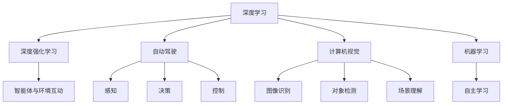

                 

# Andrej Karpathy：人工智能的未来方向

> 关键词：人工智能,深度学习,深度强化学习,自动驾驶,计算机视觉,机器学习

## 1. 背景介绍

### 1.1 问题由来
在AI领域，Andrej Karpathy 是一位举世瞩目的先锋人物，以其在计算机视觉、深度学习和自动驾驶等方面的突出贡献而闻名。在深度强化学习方面，Karpathy 的观点和研究对未来的AI发展方向有着重要影响。他的思想、研究成果和观点被广泛引述和传播，对行业内外产生了深远影响。本文将深入探讨 Andejs Karpathy 对未来人工智能发展的展望，探索其对深度学习、深度强化学习、自动驾驶、计算机视觉等关键领域的见解。

## 2. 核心概念与联系

### 2.1 核心概念概述

为了更深入理解 Andejs Karpathy 关于人工智能未来方向的观点，本节将介绍几个关键概念，并阐释它们之间的内在联系。

- **深度学习（Deep Learning）**：一种利用神经网络对数据进行学习和预测的技术，通过多层神经元提取数据特征，从而实现复杂的模式识别和决策。
- **深度强化学习（Deep Reinforcement Learning, DRL）**：一种结合了强化学习与深度学习的技术，通过智能体与环境的互动，使模型在不断的试错中优化策略，以实现特定目标。
- **自动驾驶（Autonomous Driving）**：利用AI技术实现车辆的自主驾驶，涵盖感知、决策、控制等多个环节。
- **计算机视觉（Computer Vision）**：研究如何让计算机“看”和“理解”图像、视频等视觉数据，实现图像识别、对象检测、场景理解等任务。
- **机器学习（Machine Learning）**：一种赋予计算机自主学习的能力，通过数据驱动的算法，使计算机能够不断优化和改进自己的行为。

这些概念构成了现代人工智能的基础，并通过复杂的相互作用和整合，推动AI技术不断向前发展。

### 2.2 核心概念原理和架构的 Mermaid 流程图



这个流程图展示了人工智能核心概念之间的内在联系：深度学习是基础，提供强大的模型和算法支持；深度强化学习在此基础上，结合智能体的决策能力，优化行为策略；自动驾驶、计算机视觉和机器学习都是基于深度学习发展起来的特定应用，每个领域内部又各自包含多个子任务。

## 3. 核心算法原理 & 具体操作步骤

### 3.1 算法原理概述

Andrej Karpathy 对未来人工智能的发展方向进行了深入的思考和预测，其核心观点包括以下几个方面：

- **深度学习的多样化发展**：深度学习将继续在图像识别、语音处理、自然语言处理等不同领域发挥作用，并与其他AI技术结合，产生更多跨领域的应用。
- **深度强化学习的突破**：DRL 将在自动驾驶、机器人控制等高度动态的领域取得重大进展，但需要解决稳定性、安全性、可解释性等问题。
- **自动驾驶技术的成熟**：自动驾驶技术将在未来几年内从辅助驾驶发展到高度自动驾驶，逐步实现大规模商业应用。
- **计算机视觉的突破性进展**：通过与深度学习和DRL的结合，计算机视觉技术将实现更强的感知和理解能力，突破传统视觉技术的瓶颈。
- **AI伦理和社会责任**：随着AI技术的不断进步，社会对于AI伦理和责任的关注度将持续提升，未来的AI发展需要在尊重伦理和责任的基础上进行。

### 3.2 算法步骤详解

1. **深度学习的多样化发展**：
   - **步骤1**：在多个领域应用深度学习，如图像处理、语音识别、自然语言处理等，实现多模态AI技术。
   - **步骤2**：将深度学习与计算机视觉、自动驾驶等技术结合，提升其在特定应用中的性能。

2. **深度强化学习的突破**：
   - **步骤1**：研究更加稳定的深度强化学习算法，提升智能体的决策能力。
   - **步骤2**：设计更具有可解释性的DRL模型，增强对行为决策的理解。
   - **步骤3**：在自动驾驶、机器人控制等领域应用DRL，实现复杂环境下的精准操作。

3. **自动驾驶技术的成熟**：
   - **步骤1**：开发先进的感知系统，实现环境感知和物体检测。
   - **步骤2**：研究先进的决策系统，提升路径规划和行为决策的准确性。
   - **步骤3**：在实际道路环境中进行大规模测试，验证技术的安全性和可靠性。

4. **计算机视觉的突破性进展**：
   - **步骤1**：利用深度学习提升图像识别、对象检测、场景理解等任务的准确性。
   - **步骤2**：将DRL引入计算机视觉领域，提升模型的感知能力和自主决策能力。
   - **步骤3**：将计算机视觉技术与自动驾驶、机器人等领域结合，实现更多智能化应用。

### 3.3 算法优缺点

深度学习在多个领域的应用已经取得显著成果，但同时面临以下挑战：

- **优点**：
  - **强大的表征学习能力**：深度学习可以处理非结构化数据，提取高级特征，实现复杂的模式识别。
  - **广泛的应用场景**：深度学习在图像处理、语音识别、自然语言处理等领域都有广泛应用，推动了AI技术的发展。

- **缺点**：
  - **计算资源需求高**：深度学习需要大量的计算资源和数据，训练时间较长，模型复杂度高。
  - **可解释性不足**：深度学习模型通常是“黑盒”系统，难以解释其内部决策逻辑。
  - **泛化能力差**：深度学习模型容易过拟合，在新场景下泛化能力有限。

### 3.4 算法应用领域

深度学习在以下几个领域的应用最为广泛：

- **图像处理**：在图像识别、物体检测、场景理解等任务上取得显著成果，推动了计算机视觉技术的发展。
- **语音处理**：在语音识别、语音合成、情感分析等任务上应用广泛，推动了自然语言处理技术的发展。
- **自然语言处理**：在机器翻译、文本分类、信息检索等任务上取得优异表现，提升了NLP技术的自动化水平。
- **自动驾驶**：在感知、决策、控制等环节中应用深度学习，推动了自动驾驶技术的进步。
- **机器人控制**：在机器人感知、决策、操作等环节中应用深度学习，提升了机器人的智能化水平。

## 4. 数学模型和公式 & 详细讲解

### 4.1 数学模型构建

深度学习模型的核心是神经网络，通过多层非线性变换实现对数据的建模。以卷积神经网络（CNN）为例，其数学模型构建如下：

设输入数据为 $x \in \mathbb{R}^{n \times m \times c}$，输出数据为 $y \in \mathbb{R}^{k \times m \times 1}$，网络结构如图：


其中，卷积层、池化层、全连接层等组成网络结构，权重矩阵为 $W \in \mathbb{R}^{C \times k \times k \times c}$，偏置向量为 $b \in \mathbb{R}^{k}$。

### 4.2 公式推导过程

卷积神经网络的前向传播过程如下：

$$
y = f(\sigma(z))
$$

其中，$z$ 表示网络输入，$z = W * x + b$，$*$ 表示卷积操作。$\sigma$ 为激活函数，常用的有ReLU、Sigmoid等。

后向传播过程中，计算梯度 $\nabla W$ 和 $\nabla b$：

$$
\nabla W = \frac{\partial L}{\partial W} = \frac{\partial L}{\partial z} \frac{\partial z}{\partial W}
$$

其中，$L$ 为损失函数，$\nabla z$ 表示对 $z$ 的梯度，可通过链式法则计算。

### 4.3 案例分析与讲解

以目标检测任务为例，深度学习模型通常使用Faster R-CNN、YOLO等架构，通过多阶段检测器实现目标的精确定位和分类。其核心流程包括：

1. **特征提取**：使用卷积神经网络提取图像特征，生成特征图。
2. **候选框生成**：通过锚点机制生成候选区域。
3. **目标分类与回归**：对候选区域进行分类和位置回归，确定目标类别和边界框。

## 5. 项目实践：代码实例和详细解释说明

### 5.1 开发环境搭建

为了实现深度学习模型的训练和推理，需要搭建合适的开发环境。以下是使用PyTorch搭建深度学习环境的示例：

```bash
# 安装PyTorch
pip install torch torchvision torchaudio

# 安装TensorFlow
pip install tensorflow

# 安装Keras
pip install keras

# 安装PyTorch的模型库
pip install torchvision

# 安装深度学习框架
pip install deep learning
```

### 5.2 源代码详细实现

以下是一个简单的卷积神经网络（CNN）模型的代码实现：

```python
import torch
import torch.nn as nn
import torch.optim as optim

# 定义卷积神经网络模型
class CNN(nn.Module):
    def __init__(self):
        super(CNN, self).__init__()
        self.conv1 = nn.Conv2d(3, 16, kernel_size=3, stride=1, padding=1)
        self.pool1 = nn.MaxPool2d(kernel_size=2, stride=2)
        self.conv2 = nn.Conv2d(16, 32, kernel_size=3, stride=1, padding=1)
        self.pool2 = nn.MaxPool2d(kernel_size=2, stride=2)
        self.fc1 = nn.Linear(32*8*8, 64)
        self.fc2 = nn.Linear(64, 10)

    def forward(self, x):
        x = self.pool1(F.relu(self.conv1(x)))
        x = self.pool2(F.relu(self.conv2(x)))
        x = x.view(-1, 32*8*8)
        x = F.relu(self.fc1(x))
        x = self.fc2(x)
        return x

# 训练模型
model = CNN()
criterion = nn.CrossEntropyLoss()
optimizer = optim.SGD(model.parameters(), lr=0.001, momentum=0.9)

for epoch in range(10):
    running_loss = 0.0
    for i, data in enumerate(trainloader, 0):
        inputs, labels = data
        optimizer.zero_grad()
        outputs = model(inputs)
        loss = criterion(outputs, labels)
        loss.backward()
        optimizer.step()
        running_loss += loss.item()
    print('Epoch %d loss: %.3f' % (epoch+1, running_loss/len(trainloader)))
```

### 5.3 代码解读与分析

这段代码实现了一个简单的卷积神经网络，并进行了训练。其核心步骤如下：

- **模型定义**：定义了一个包含两个卷积层、两个池化层和两个全连接层的CNN模型。
- **训练过程**：通过SGD优化器，使用交叉熵损失函数训练模型。
- **输出结果**：在每个epoch结束时，输出损失函数的结果。

## 6. 实际应用场景

### 6.1 智能客服系统

深度学习技术在智能客服系统中得到了广泛应用，通过语音识别、自然语言处理等技术，实现自动解答客户咨询，提升客服效率和服务质量。

### 6.2 金融舆情监测

深度学习在金融领域的应用主要体现在风险预测和舆情分析上，通过深度学习模型，实现对金融市场信息的分析和预测，提升金融机构的决策能力。

### 6.3 个性化推荐系统

深度学习在个性化推荐系统中也有着重要应用，通过分析用户行为数据和物品特征，实现精准推荐，提升用户体验和业务转化率。

### 6.4 未来应用展望

随着深度学习技术的不断进步，其在更多领域的应用前景也将不断扩展。未来，深度学习将在自动驾驶、机器人控制、医疗诊断等领域发挥重要作用，推动各行业智能化水平的提升。

## 7. 工具和资源推荐

### 7.1 学习资源推荐

为了深入了解Andrej Karpathy的研究和思想，推荐以下几个学习资源：

1. **《Deep Learning》书籍**：Ian Goodfellow、Yoshua Bengio和Aaron Courville合作编写的经典教材，全面介绍了深度学习的基本概念和算法。
2. **《Deep Reinforcement Learning with TensorFlow 2 and Keras》书籍**：Andrej Karpathy所著，介绍了深度强化学习的基本原理和应用，是理解DRL的必读书籍。
3. **DeepLearning.AI Coursera课程**：Andrej Karpathy主讲的深度学习课程，涵盖深度学习的核心概念和算法，适合初学者和进阶学习者。
4. **Google Deep Learning on Coursera课程**：Google开发的深度学习课程，涵盖了深度学习的基础知识和应用案例，适合初学者学习。

### 7.2 开发工具推荐

以下推荐几个常用的深度学习开发工具：

1. **PyTorch**：开源的深度学习框架，支持动态计算图，易于调试和优化。
2. **TensorFlow**：Google开发的深度学习框架，支持分布式训练和推理，适合大规模应用。
3. **Keras**：基于TensorFlow等深度学习框架的高级API，易于上手。
4. **MXNet**：Apache开发的深度学习框架，支持多种编程语言，适合跨平台应用。

### 7.3 相关论文推荐

Andrej Karpathy的论文和文章对深度学习领域的发展有着重要影响，以下是几篇重要的论文：

1. **《Convolutional Neural Networks for Sentence Classification》**：提出卷积神经网络在自然语言处理中的应用，实现了文本分类任务的高精度。
2. **《Deep Reinforcement Learning with TensorFlow 2 and Keras》**：介绍了深度强化学习的基本原理和应用，是理解DRL的必读书籍。
3. **《Neural Machine Translation with Attention》**：提出注意力机制，提升了机器翻译模型的性能。
4. **《Autonomous Driving with Deep Reinforcement Learning》**：介绍了深度强化学习在自动驾驶中的应用，推动了自动驾驶技术的发展。

## 8. 总结：未来发展趋势与挑战

### 8.1 总结

Andrej Karpathy对未来人工智能的发展方向进行了深入的分析和预测，其核心观点包括：

- **深度学习的多样化发展**：深度学习将继续在图像处理、语音处理、自然语言处理等领域发挥重要作用。
- **深度强化学习的突破**：DRL将在自动驾驶、机器人控制等领域取得重大进展，但需要解决稳定性、安全性等问题。
- **自动驾驶技术的成熟**：自动驾驶技术将在未来几年内逐步实现大规模商业应用。
- **计算机视觉的突破性进展**：通过与深度学习和DRL的结合，计算机视觉技术将实现更强的感知和理解能力。
- **AI伦理和社会责任**：未来的AI发展需要在尊重伦理和责任的基础上进行。

### 8.2 未来发展趋势

未来深度学习技术将在以下几个方面继续发展：

- **多模态AI技术**：深度学习将与计算机视觉、自然语言处理等技术结合，实现多模态AI技术，推动更多跨领域的应用。
- **深度强化学习的应用**：DRL将在自动驾驶、机器人控制等领域取得更多突破，推动这些领域的智能化水平提升。
- **自动驾驶技术的成熟**：自动驾驶技术将在未来几年内逐步实现大规模商业应用，推动交通方式的变革。
- **计算机视觉的突破**：通过深度学习和DRL的结合，计算机视觉技术将实现更强的感知和理解能力，突破传统视觉技术的瓶颈。

### 8.3 面临的挑战

尽管深度学习技术在许多领域取得了显著成果，但未来仍面临以下挑战：

- **计算资源需求高**：深度学习需要大量的计算资源和数据，训练时间较长，模型复杂度高。
- **可解释性不足**：深度学习模型通常是“黑盒”系统，难以解释其内部决策逻辑。
- **泛化能力差**：深度学习模型容易过拟合，在新场景下泛化能力有限。
- **安全性问题**：深度学习模型容易受到对抗样本攻击，存在安全隐患。

### 8.4 研究展望

为了应对未来挑战，深度学习技术需要在以下几个方面进行改进：

- **提高模型可解释性**：通过引入可解释性技术，如注意力机制、因果推断等，增强对模型决策的理解。
- **改进模型泛化能力**：通过正则化、迁移学习等方法，提升模型在新场景下的泛化能力。
- **提升模型安全性**：通过对抗样本检测、防御等技术，提高模型的安全性。
- **研究跨领域AI技术**：将深度学习与其他AI技术结合，推动跨领域AI技术的发展。

## 9. 附录：常见问题与解答

### Q1：深度学习模型为什么需要大量的数据？

A: 深度学习模型需要大量的数据来训练，主要是为了提高模型的泛化能力。大量的数据可以帮助模型学习到更多的模式和规律，从而更好地适应新的数据。

### Q2：深度学习模型容易过拟合，有哪些方法可以缓解？

A: 缓解深度学习模型过拟合的方法包括：

- **数据增强**：通过旋转、裁剪、缩放等方法扩充训练数据，增加数据的多样性。
- **正则化**：通过L1、L2正则化、Dropout等方法，减少模型参数，降低过拟合风险。
- **早停法**：在验证集上监控模型性能，一旦出现性能下降，立即停止训练，避免过拟合。

### Q3：深度学习模型如何处理文本数据？

A: 深度学习模型通常使用循环神经网络（RNN）、卷积神经网络（CNN）、Transformer等架构来处理文本数据。在文本分类、情感分析、机器翻译等任务上，这些模型均取得了显著成果。

### Q4：深度强化学习与传统强化学习有什么区别？

A: 深度强化学习与传统强化学习的区别在于：

- **网络结构**：深度强化学习使用深度神经网络代替传统的特征提取器，能够学习更复杂的特征表示。
- **训练效率**：深度强化学习能够利用GPU等高性能计算设备，加速训练过程。
- **模型复杂度**：深度强化学习的模型复杂度更高，能够处理更复杂的决策问题。

### Q5：自动驾驶技术的发展现状和未来趋势是什么？

A: 自动驾驶技术的发展现状包括：

- **感知系统**：通过摄像头、激光雷达等传感器实现环境感知和物体检测。
- **决策系统**：使用深度学习模型实现路径规划和行为决策。

未来趋势包括：

- **高度自动驾驶**：未来几年内，自动驾驶技术将逐步实现高度自动驾驶，大幅提升安全性和便捷性。
- **大规模应用**：自动驾驶技术将在物流、出租车、公交等领域实现大规模应用，改变出行方式。

---

作者：禅与计算机程序设计艺术 / Zen and the Art of Computer Programming

