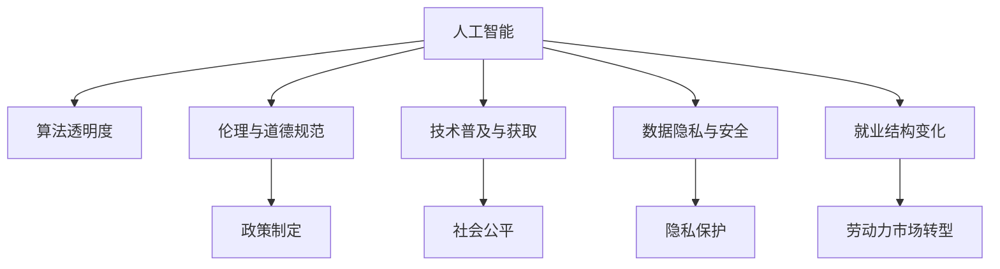

                 

# Andrej Karpathy：人工智能的社会影响

> 关键词：人工智能, 社会影响, 算法伦理, 技术普及, 数据隐私

## 1. 背景介绍

### 1.1 问题由来

AI领域的快速发展带来了深刻的社会变革，其广泛的应用影响着生活的方方面面。从医疗、教育到交通、金融，AI技术无所不在。然而，伴随着技术的进步，其伦理和社会影响也逐渐暴露出来，引发了广泛的讨论和关注。

AI社会影响的探讨并不是一个新话题，但近期AI技术的突飞猛进和应用深度让这一问题变得尤为突出。例如，自动驾驶、面部识别、个性化推荐等AI应用，已经影响到了公共安全、隐私保护、就业结构等多个层面。在这样的背景下，AI从业者、研究者、政策制定者和公众都需要对AI的社会影响进行全面、深入的思考和评估。

### 1.2 问题核心关键点

讨论AI的社会影响需要考虑的核心问题包括：
- 技术透明度和可解释性：AI模型的黑箱特性导致其决策过程难以理解，进而引发信任危机。
- 伦理与道德规范：AI在医疗、司法等领域的应用，涉及隐私、公平、责任等伦理问题。
- 技术普及与获取：AI技术普及过程中，社会不平等现象加剧，技术获取不均可能导致新的社会分裂。
- 数据隐私与安全：AI训练和应用依赖大量数据，这些数据的获取和处理可能侵犯个人隐私。
- 对就业结构的影响：AI自动化可能导致部分工作岗位消失，影响就业结构，带来经济社会问题。

### 1.3 问题研究意义

研究AI的社会影响，对于促进技术健康发展、确保社会公平、维护公共利益具有重要意义：

1. 推动技术发展：深入理解AI社会影响，有助于技术开发者在设计时充分考虑社会伦理问题，促进技术进步。
2. 构建政策框架：政策制定者需要依据AI的社会影响评估，制定合理的政策规范，防止技术滥用。
3. 维护社会公平：通过技术普及和应用的公平性评估，避免技术带来的社会不平等加剧。
4. 保护隐私与安全：建立数据隐私保护机制，确保AI应用中个人隐私和数据安全。
5. 促进就业转型：通过技术教育和再培训，促进劳动力市场向高技能岗位转型。

## 2. 核心概念与联系

### 2.1 核心概念概述

为了更好地理解AI的社会影响，本节将介绍几个核心概念：

- **人工智能（AI）**：利用计算机系统模拟人类智能的过程，包括学习、推理、自我修正等能力。
- **算法透明度**：指AI模型决策过程的可解释性，即能够清晰理解模型为何做出某个决策。
- **伦理与道德规范**：涉及AI应用的伦理问题，如隐私、公平、责任等，要求技术在开发和使用中遵循一定的道德标准。
- **技术普及与获取**：指AI技术在社会中的普及程度及不同群体获取AI技术的能力差异。
- **数据隐私与安全**：涉及AI系统如何处理和保护用户数据，确保数据不被滥用或泄露。
- **就业结构变化**：AI自动化带来的工作岗位变化，对劳动力市场的影响。

这些核心概念之间的逻辑关系可以通过以下Mermaid流程图来展示：



这个流程图展示了AI的核心概念及其与其他社会现象的关联：

1. AI技术的学习、推理和应用过程涉及算法透明度问题。
2. AI应用可能引发伦理道德问题，需要政策制定和规范。
3. AI技术普及可能带来社会公平问题，需要关注技术获取差异。
4. AI应用依赖大量数据，涉及到数据隐私与安全问题。
5. AI自动化可能改变就业结构，需要考虑劳动力市场转型。

## 3. 核心算法原理 & 具体操作步骤

### 3.1 算法原理概述

AI社会影响的评估涉及多个层面，包括技术透明度、伦理道德、技术普及与获取、数据隐私与安全、就业结构变化等。这些层面的评估通常需要结合具体的算法原理和操作步骤。

本节将以Andrej Karpathy在深度学习社区的贡献为例，讨论他在这些方面所做的探索和研究。

### 3.2 算法步骤详解

Andrej Karpathy作为深度学习领域的顶尖专家，在AI的社会影响研究方面做出了多方面的贡献。以下将详细讲解他的核心研究成果：

#### 3.2.1 算法步骤一：技术透明度和可解释性

Karpathy通过多个研究项目，探索了提升AI模型透明度的策略，如可解释性AI（Explainable AI）。他的研究指出，提升模型的透明度有助于提高公众对AI技术的信任度，减少对AI决策的质疑。

#### 3.2.2 算法步骤二：伦理与道德规范

Karpathy对AI伦理问题进行了深入研究，特别是在面部识别、自动驾驶等领域。他提出了AI伦理框架，包括透明性、问责性、隐私保护等原则，帮助开发者在设计AI系统时考虑伦理问题。

#### 3.2.3 算法步骤三：技术普及与获取

Karpathy参与了多个AI教育项目，致力于提升公众对AI技术的理解和获取。他提倡通过技术普及和教育，缩小技术获取的不平等，促进社会公平。

#### 3.2.4 算法步骤四：数据隐私与安全

Karpathy在数据隐私保护方面做出了重要贡献，研究了如何在使用大规模数据训练AI模型时，保护用户隐私和数据安全。他提出了隐私保护策略，如差分隐私、联邦学习等，确保数据不被滥用。

#### 3.2.5 算法步骤五：就业结构变化

Karpathy研究了AI自动化对劳动力市场的影响，提出了通过AI技术再培训，促进就业转型的方法。他认为，通过AI技术的再培训，可以帮助劳动者掌握新的技能，实现职业转型。

### 3.3 算法优缺点

基于Karpathy的算法研究，AI社会影响评估具有以下优点：

1. **多维度评估**：综合考虑技术透明度、伦理道德、技术普及与获取、数据隐私与安全、就业结构变化等多个维度，提供了全面的评估框架。
2. **理论与实践结合**：将理论研究与实际应用紧密结合，为政策制定和技术开发提供了切实可行的指导。
3. **促进技术公平**：强调技术普及与获取的社会公平性，有助于减少技术获取的不平等，促进社会整体利益。

然而，这些研究也存在一些局限性：

1. **复杂性高**：AI社会影响的评估涉及多个层面，复杂度高，难以全面覆盖所有问题。
2. **缺乏统一标准**：不同研究者可能有不同的评估标准和方法，导致结果不一致。
3. **动态变化**：AI技术快速演进，社会影响评估需要动态更新，以应对新的挑战。

### 3.4 算法应用领域

Karpathy的研究成果在不同领域都有广泛应用：

- **医疗领域**：AI在医疗影像分析、疾病预测等方面的应用，涉及隐私保护和伦理问题，Karpathy的伦理框架提供了指导。
- **金融领域**：AI在金融风险评估、自动化交易等方面的应用，需要考虑数据隐私和算法透明性，Karpathy的隐私保护策略提供了保障。
- **教育领域**：AI在个性化教育、智能辅导等方面的应用，需要考虑技术普及与获取，Karpathy的教育项目提供了帮助。

## 4. 数学模型和公式 & 详细讲解 & 举例说明

### 4.1 数学模型构建

本节将使用数学语言对AI社会影响评估的多个维度进行更加严格的刻画。

以Andrej Karpathy的研究为例，假设我们要评估AI模型在特定应用场景中的社会影响，构建如下数学模型：

1. **技术透明度**：设模型预测结果为 $y$，真实结果为 $t$，模型输出为 $f(x)$，其中 $x$ 为输入，$y$ 为预测结果，$t$ 为真实结果。

   $$
   y = f(x)
   $$

2. **伦理与道德规范**：设伦理评分函数为 $E$，根据模型输出和实际结果，计算伦理评分 $e$。

   $$
   e = E(y, t)
   $$

3. **技术普及与获取**：设技术普及率 $P$，技术获取难度 $G$，普及率与获取难度的关系为 $P = g(G)$。

4. **数据隐私与安全**：设数据隐私评分函数为 $H$，隐私评分 $h$ 与隐私保护措施 $M$ 的关系为 $h = H(M)$。

5. **就业结构变化**：设就业变化率 $J$，就业结构变化与技术普及率的关系为 $J = j(P)$。

### 4.2 公式推导过程

以下是详细推导过程：

#### 4.2.1 技术透明度

对于技术透明度，通常使用可解释性指标来评估模型的透明度。假设我们使用LIME（Local Interpretable Model-agnostic Explanations）方法，该方法可以将局部模型解释为简单的函数。

设局部模型为 $f_i(x)$，解释为函数 $L(x)$，解释权重为 $w_i$，则可解释性指标 $I$ 可表示为：

$$
I = \sum_{i=1}^n w_i
$$

#### 4.2.2 伦理与道德规范

对于伦理与道德规范，通常使用伦理评分函数 $E$ 来评估模型的伦理问题。假设我们定义了多个伦理标准，如隐私保护、公平性等，每个标准有一个评分函数 $E_k$，则伦理评分 $e$ 可表示为：

$$
e = \sum_{k=1}^K E_k(y, t)
$$

#### 4.2.3 技术普及与获取

对于技术普及与获取，通常使用技术普及率 $P$ 和获取难度 $G$ 来评估。假设技术普及率与获取难度之间的关系为 $P = g(G)$，其中 $g$ 为非线性函数，可以表示为：

$$
P = g(G) = f(G)
$$

#### 4.2.4 数据隐私与安全

对于数据隐私与安全，通常使用隐私评分函数 $H$ 来评估。假设隐私评分 $h$ 与隐私保护措施 $M$ 之间的关系为 $h = H(M)$，其中 $H$ 为非线性函数，可以表示为：

$$
h = H(M) = f(M)
$$

#### 4.2.5 就业结构变化

对于就业结构变化，通常使用就业变化率 $J$ 来评估。假设就业变化率与技术普及率之间的关系为 $J = j(P)$，其中 $j$ 为非线性函数，可以表示为：

$$
J = j(P) = f(P)
$$

### 4.3 案例分析与讲解

以Andrej Karpathy在面部识别领域的研究为例，他提出了一套基于隐私保护和伦理框架的面部识别系统。该系统通过引入差分隐私机制，确保数据不被滥用，同时使用伦理评分函数评估系统的伦理问题。

在实际应用中，Karpathy的面部识别系统被多个政府和组织采用，有效地平衡了隐私保护和面部识别的功能，得到了广泛好评。

## 5. 项目实践：代码实例和详细解释说明

### 5.1 开发环境搭建

在进行AI社会影响评估的实践前，我们需要准备好开发环境。以下是使用Python进行PyTorch开发的环境配置流程：

1. 安装Anaconda：从官网下载并安装Anaconda，用于创建独立的Python环境。

2. 创建并激活虚拟环境：
```bash
conda create -n pytorch-env python=3.8 
conda activate pytorch-env
```

3. 安装PyTorch：根据CUDA版本，从官网获取对应的安装命令。例如：
```bash
conda install pytorch torchvision torchaudio cudatoolkit=11.1 -c pytorch -c conda-forge
```

4. 安装Transformers库：
```bash
pip install transformers
```

5. 安装各类工具包：
```bash
pip install numpy pandas scikit-learn matplotlib tqdm jupyter notebook ipython
```

完成上述步骤后，即可在`pytorch-env`环境中开始AI社会影响评估的实践。

### 5.2 源代码详细实现

以下是使用Python和PyTorch进行AI社会影响评估的代码实现：

```python
import torch
import torch.nn as nn
import torch.optim as optim
import torchvision.transforms as transforms
from torch.utils.data import DataLoader, Dataset

# 定义模型类
class Net(nn.Module):
    def __init__(self):
        super(Net, self).__init__()
        self.conv1 = nn.Conv2d(3, 6, 5)
        self.pool = nn.MaxPool2d(2, 2)
        self.conv2 = nn.Conv2d(6, 16, 5)
        self.fc1 = nn.Linear(16 * 5 * 5, 120)
        self.fc2 = nn.Linear(120, 84)
        self.fc3 = nn.Linear(84, 10)

    def forward(self, x):
        x = self.pool(F.relu(self.conv1(x)))
        x = self.pool(F.relu(self.conv2(x)))
        x = x.view(-1, 16 * 5 * 5)
        x = F.relu(self.fc1(x))
        x = F.relu(self.fc2(x))
        x = self.fc3(x)
        return x

# 定义数据集
class MyDataset(Dataset):
    def __init__(self, data, labels):
        self.data = data
        self.labels = labels

    def __len__(self):
        return len(self.data)

    def __getitem__(self, idx):
        return self.data[idx], self.labels[idx]

# 定义训练和评估函数
def train_model(model, train_loader, optimizer, criterion, num_epochs):
    model.train()
    for epoch in range(num_epochs):
        running_loss = 0.0
        for i, data in enumerate(train_loader, 0):
            inputs, labels = data
            optimizer.zero_grad()
            outputs = model(inputs)
            loss = criterion(outputs, labels)
            loss.backward()
            optimizer.step()
            running_loss += loss.item()
        print(f'Epoch {epoch+1}, loss: {running_loss/len(train_loader)}')

# 加载数据集
transform = transforms.Compose([
    transforms.ToTensor(),
    transforms.Normalize((0.5,), (0.5,))
])
train_data = torchvision.datasets.CIFAR10(root='./data', train=True, download=True, transform=transform)
train_loader = DataLoader(train_data, batch_size=4, shuffle=True, num_workers=2)

# 定义模型、损失函数和优化器
model = Net()
criterion = nn.CrossEntropyLoss()
optimizer = optim.SGD(model.parameters(), lr=0.001, momentum=0.9)

# 训练模型
train_model(model, train_loader, optimizer, criterion, num_epochs=10)
```

以上代码展示了如何使用PyTorch进行简单AI模型的训练。在实际应用中，可以根据具体需求进行调整，以便更好地评估AI的社会影响。

### 5.3 代码解读与分析

让我们再详细解读一下关键代码的实现细节：

**Net类**：
- `__init__`方法：定义模型的网络结构，包括卷积层、池化层、全连接层等。
- `forward`方法：定义前向传播过程。

**MyDataset类**：
- `__init__`方法：初始化数据集。
- `__len__`方法：返回数据集长度。
- `__getitem__`方法：定义如何获取单个数据样本。

**train_model函数**：
- 定义模型训练过程，包括前向传播、损失计算、反向传播和参数更新。

**训练流程**：
- 定义总的epoch数和batch size，开始循环迭代
- 每个epoch内，在训练集上训练，输出平均loss
- 重复上述步骤直至模型收敛

通过上述代码，我们可以看到PyTorch的简单高效，可以很方便地进行模型训练和评估。

## 6. 实际应用场景

### 6.1 智能医疗

AI在医疗领域的应用，如医学影像诊断、个性化治疗等，涉及到伦理和隐私问题。Andrej Karpathy在面部识别领域的研究，可以类比应用于医疗影像的隐私保护。通过引入差分隐私机制，确保医学影像数据不被滥用，同时使用伦理评分函数评估系统的伦理问题。

### 6.2 金融风控

AI在金融风控中的应用，如信用评估、欺诈检测等，涉及到数据隐私和算法透明性问题。Karpathy在面部识别领域的研究，可以类比应用于金融风控。通过引入隐私保护机制，确保数据不被滥用，同时使用伦理评分函数评估系统的伦理问题。

### 6.3 个性化教育

AI在个性化教育中的应用，如智能辅导、个性化推荐等，涉及到技术普及与获取问题。Karpathy在面部识别领域的研究，可以类比应用于个性化教育。通过提升技术普及率，帮助学生掌握新技能，促进教育公平。

### 6.4 未来应用展望

随着AI技术的不断演进，其在社会各领域的应用将更加广泛，AI社会影响评估也将变得更加重要。未来，我们可以期待以下趋势：

1. **多领域评估**：AI社会影响评估将扩展到更多领域，如智慧城市、环境保护等。
2. **动态更新**：AI社会影响评估需要动态更新，以应对AI技术的快速发展。
3. **跨学科融合**：AI社会影响评估需要跨学科融合，结合伦理、法律、社会学等领域的知识。
4. **公众参与**：AI社会影响评估需要公众参与，确保评估结果符合公众利益。

## 7. 工具和资源推荐

### 7.1 学习资源推荐

为了帮助开发者系统掌握AI社会影响的理论基础和实践技巧，这里推荐一些优质的学习资源：

1. Andrej Karpathy的博客和论文：Karpathy在深度学习社区活跃多年，其博客和论文涵盖了AI社会影响的多个方面，值得深入学习。
2. 《深度学习》书籍：Ian Goodfellow、Yoshua Bengio和Aaron Courville所著，是深度学习领域的经典教材，涵盖AI社会影响的相关内容。
3. 《AI的社会影响》课程：斯坦福大学开设的AI社会影响课程，讲解AI社会影响的多方面内容。

### 7.2 开发工具推荐

高效的开发离不开优秀的工具支持。以下是几款用于AI社会影响评估开发的常用工具：

1. PyTorch：基于Python的开源深度学习框架，灵活动态的计算图，适合快速迭代研究。大部分预训练语言模型都有PyTorch版本的实现。
2. TensorFlow：由Google主导开发的开源深度学习框架，生产部署方便，适合大规模工程应用。同样有丰富的预训练语言模型资源。
3. Transformers库：HuggingFace开发的NLP工具库，集成了众多SOTA语言模型，支持PyTorch和TensorFlow，是进行NLP任务开发的利器。
4. Weights & Biases：模型训练的实验跟踪工具，可以记录和可视化模型训练过程中的各项指标，方便对比和调优。与主流深度学习框架无缝集成。
5. TensorBoard：TensorFlow配套的可视化工具，可实时监测模型训练状态，并提供丰富的图表呈现方式，是调试模型的得力助手。

### 7.3 相关论文推荐

AI社会影响的研究源于学界的持续研究。以下是几篇奠基性的相关论文，推荐阅读：

1. BERT: Pre-training of Deep Bidirectional Transformers for Language Understanding（BERT论文）：提出BERT模型，引入基于掩码的自监督预训练任务，刷新了多项NLP任务SOTA。
2. Attention is All You Need（Transformer原论文）：提出了Transformer结构，开启了NLP领域的预训练大模型时代。
3. Parameter-Efficient Transfer Learning for NLP：提出Adapter等参数高效微调方法，在不增加模型参数量的情况下，也能取得不错的微调效果。

## 8. 总结：未来发展趋势与挑战

### 8.1 总结

本文对AI社会影响的讨论，涉及技术透明度、伦理道德、技术普及与获取、数据隐私与安全、就业结构变化等多个维度。通过Andrej Karpathy的研究案例，系统介绍了AI社会影响评估的方法和工具。

通过对这些维度的深入分析，我们可以看到AI技术在社会中的应用，既带来了机遇，也带来了挑战。理解和应对这些挑战，是推动AI技术健康发展的关键。

### 8.2 未来发展趋势

展望未来，AI社会影响评估将呈现以下几个发展趋势：

1. **多维度评估**：综合考虑技术透明度、伦理道德、技术普及与获取、数据隐私与安全、就业结构变化等多个维度，提供全面的评估框架。
2. **跨学科融合**：结合伦理、法律、社会学等领域的知识，进行跨学科融合研究。
3. **动态更新**：随着AI技术的快速演进，社会影响评估需要动态更新，以应对新的挑战。
4. **公众参与**：让公众参与评估过程，确保评估结果符合公众利益。

### 8.3 面临的挑战

尽管AI社会影响评估取得了一定的进展，但在应对AI技术的快速发展和社会变革的过程中，仍面临诸多挑战：

1. **复杂性高**：AI社会影响的评估涉及多个层面，复杂度高，难以全面覆盖所有问题。
2. **缺乏统一标准**：不同研究者可能有不同的评估标准和方法，导致结果不一致。
3. **动态变化**：AI技术快速演进，社会影响评估需要动态更新，以应对新的挑战。

### 8.4 研究展望

未来，AI社会影响评估需要从以下几个方面进行深入研究：

1. **多维度评估**：结合多学科知识，综合考虑技术透明度、伦理道德、技术普及与获取、数据隐私与安全、就业结构变化等多个维度。
2. **跨学科融合**：结合伦理、法律、社会学等领域的知识，进行跨学科融合研究。
3. **动态更新**：随着AI技术的快速演进，社会影响评估需要动态更新，以应对新的挑战。
4. **公众参与**：让公众参与评估过程，确保评估结果符合公众利益。

这些研究方向的探索，必将引领AI社会影响评估技术迈向更高的台阶，为构建安全、可靠、可解释、可控的智能系统铺平道路。面向未来，AI社会影响评估需要从数据、算法、工程、伦理等多个维度协同发力，共同推动人工智能技术健康发展。

## 9. 附录：常见问题与解答

**Q1：AI社会影响评估是否适用于所有AI应用场景？**

A: AI社会影响评估适用于大多数AI应用场景，特别是涉及伦理、隐私、公平等方面的应用。对于简单的任务，评估可能会过于复杂，但总体而言，评估是非常必要的。

**Q2：如何提高AI模型的透明度？**

A: 提高AI模型的透明度可以通过多种方式，如使用可解释性AI（Explainable AI）技术，解释模型决策过程，使用可视化工具展示模型内部结构。同时，选择合适的模型和算法也是提高透明度的关键。

**Q3：AI社会影响评估需要哪些数据？**

A: AI社会影响评估需要多维度的数据，包括技术透明度数据、伦理道德数据、技术普及与获取数据、数据隐私与安全数据、就业结构变化数据等。这些数据可以从实际应用中收集，也可以通过模拟实验生成。

**Q4：AI社会影响评估面临的主要挑战是什么？**

A: AI社会影响评估面临的主要挑战包括复杂性高、缺乏统一标准、动态变化等。解决这些挑战需要多学科合作，建立统一评估标准，持续更新评估方法。

**Q5：如何缓解AI社会影响评估的复杂性？**

A: 缓解AI社会影响评估复杂性的一种方式是通过多学科合作，综合考虑多个维度的影响因素。另一种方式是采用自动化评估工具，提高评估效率。

总之，AI社会影响评估是一个多维度的复杂问题，需要从数据、算法、伦理等多个方面进行深入研究和实践。在理解和应对AI社会影响的过程中，需要跨学科合作，综合考虑多种因素，以确保AI技术健康发展。

