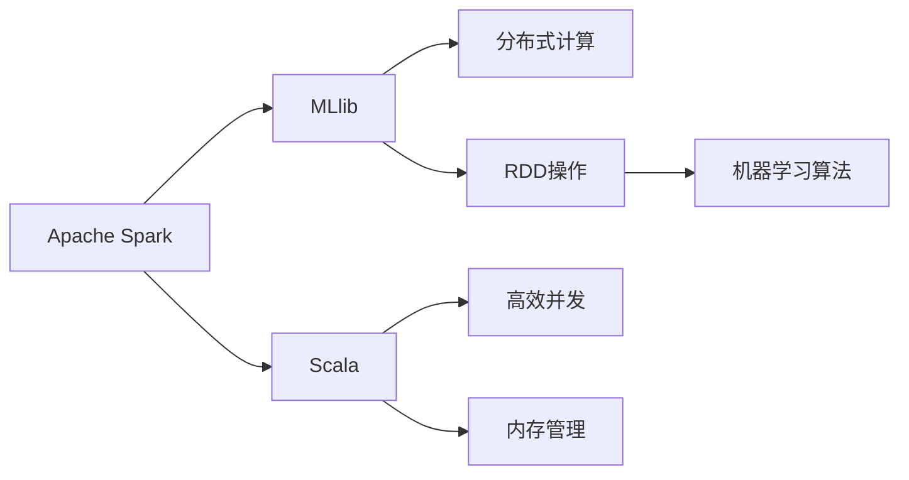

                 

# Apache Spark MLlib

> 关键词：Apache Spark, MLlib, 大数据, 机器学习, 分布式计算, Scala, RDD, 数据处理, 算法, Spark Streaming

## 1. 背景介绍

### 1.1 问题由来

随着大数据时代的到来，企业对处理大规模数据的效率和灵活性提出了更高要求。传统的数据处理方式，如MapReduce，在大数据处理方面存在诸多局限：

- 处理速度慢：MapReduce需要多次IO操作，延迟较大。
- 编程复杂：编程接口单一，难以高效开发。
- 扩展性差：难以根据任务需求动态调整资源。

面对这些问题，Apache Spark应运而生。Spark是一个快速、通用、可扩展的分布式计算系统，能够处理大规模数据集，支持多种数据源和多种计算模式。

而Apache Spark MLlib，作为Spark的核心组件之一，是一个高效、灵活的机器学习库，能够支持大规模分布式机器学习计算，并且可以轻松与Spark的其他组件进行集成。

## 2. 核心概念与联系

### 2.1 核心概念概述

为了深入理解Apache Spark MLlib，首先需要了解以下几个核心概念：

- **Apache Spark**：一个快速、通用、可扩展的分布式计算系统，支持多种数据源和计算模式，包括批处理、流处理、图计算等。
- **MLlib**：Apache Spark的机器学习库，提供了多种高效的机器学习算法和工具，支持分布式计算。
- **分布式计算**：通过将计算任务分配到多台计算机上进行并行处理，提升计算效率和处理能力。
- **RDD（弹性分布式数据集）**：Spark的核心数据结构，支持数据的弹性计算和分布式处理，能够进行快速的迭代和缓存。
- **Scala**：Apache Spark的编程语言，一种基于JVM的编程语言，具有高效的并发和内存管理特性。
- **RDD操作**：RDD提供了多种操作，如Map、Reduce、Filter、Join等，能够进行灵活的数据处理和计算。
- **机器学习算法**：包括分类、回归、聚类、协同过滤等算法，用于处理和分析大规模数据集。

这些核心概念之间的逻辑关系可以通过以下Mermaid流程图来展示：



这个流程图展示了Apache Spark MLlib的核心概念及其之间的关系：

1. Apache Spark作为分布式计算框架，提供了高效的数据处理能力。
2. MLlib作为Spark的核心组件，提供了多种高效的机器学习算法。
3. RDD是Spark的数据结构，支持分布式计算和弹性计算。
4. Scala作为Spark的编程语言，提供了高效的并发和内存管理特性。
5. 机器学习算法基于RDD操作，在分布式环境下进行高效的计算。

这些核心概念共同构成了Apache Spark MLlib的基础，使其能够在各种数据处理和机器学习任务中发挥强大的作用。

## 3. 核心算法原理 & 具体操作步骤

### 3.1 算法原理概述

Apache Spark MLlib的机器学习算法基于分布式计算和弹性数据集RDD。其核心思想是将大规模数据集划分为多个小数据块，并在多台计算机上并行处理，最终将结果合并得到全局结果。这种分布式计算方式，可以显著提升计算效率和处理能力。

Apache Spark MLlib的机器学习算法包括多种高效算法，如线性回归、逻辑回归、支持向量机(SVM)、随机森林等。这些算法能够处理大规模数据集，支持分布式计算，并且具有高效、灵活的特点。

### 3.2 算法步骤详解

Apache Spark MLlib的机器学习算法主要包括以下几个关键步骤：

**Step 1: 数据准备**

- 收集和清洗数据，将其划分为训练集和测试集。
- 将数据集转换为RDD，以便进行分布式计算。

**Step 2: 特征工程**

- 对原始数据进行特征提取和转换，生成适合机器学习算法的特征。
- 使用RDD的map、filter、reduce等操作进行特征处理。

**Step 3: 模型训练**

- 选择合适的机器学习算法，如线性回归、逻辑回归、支持向量机等。
- 使用RDD进行模型训练，并使用Spark的管道操作(pipeline)进行模型构建。

**Step 4: 模型评估**

- 在测试集上评估模型的性能，计算准确率、召回率、F1值等指标。
- 使用RDD进行数据划分，并进行模型评估。

**Step 5: 模型部署**

- 将训练好的模型保存为文件或RDD，并集成到实际应用中。
- 使用RDD进行模型预测和推理。

### 3.3 算法优缺点

Apache Spark MLlib的机器学习算法具有以下优点：

1. 高效处理大规模数据：支持分布式计算，能够处理海量数据，提升计算效率。
2. 灵活的编程接口：支持多种编程语言，如Scala、Python、Java等，使用灵活。
3. 支持多种算法：提供多种机器学习算法，满足不同场景需求。
4. 高效的内存管理：使用弹性内存管理，优化内存使用，提升计算效率。
5. 可扩展性强：支持水平扩展，根据任务需求动态调整资源。

同时，Apache Spark MLlib也存在以下缺点：

1. 学习曲线较陡：需要掌握Spark和MLlib的编程技巧，学习成本较高。
2. 资源消耗较大：Spark本身资源消耗较大，需要较高的硬件配置。
3. 延迟较高：Spark的延迟较高，不适合实时计算场景。
4. 单节点性能较差：Spark的单节点性能相对较差，需要多节点协同工作。

尽管存在这些缺点，Apache Spark MLlib仍然是大数据机器学习领域的重要工具，广泛应用于数据处理、特征工程、模型训练等多个环节。

### 3.4 算法应用领域

Apache Spark MLlib的机器学习算法，已经在多个领域得到了广泛应用，包括但不限于以下几个方面：

- 金融风险管理：使用Spark MLlib进行信用评分、违约预测、反欺诈检测等金融风险管理任务。
- 电商推荐系统：使用Spark MLlib进行用户行为分析、商品推荐、价格优化等电商推荐系统任务。
- 医疗健康管理：使用Spark MLlib进行疾病预测、患者分类、基因分析等医疗健康管理任务。
- 自然语言处理：使用Spark MLlib进行文本分类、情感分析、主题提取等自然语言处理任务。
- 社交网络分析：使用Spark MLlib进行社交关系分析、情感分析、兴趣推荐等社交网络分析任务。
- 图像处理：使用Spark MLlib进行图像分类、图像识别、图像分割等图像处理任务。

以上这些领域的应用，充分展示了Apache Spark MLlib的强大机器学习能力。随着Spark MLlib的不断发展和优化，其应用领域将更加广泛，推动大数据领域的不断进步。

## 4. 数学模型和公式 & 详细讲解 & 举例说明

### 4.1 数学模型构建

Apache Spark MLlib的机器学习算法，通常使用线性回归、逻辑回归、支持向量机等基本算法。以下是线性回归的数学模型构建过程：

设训练数据集为 $D=\{(x_i, y_i)\}_{i=1}^N$，其中 $x_i$ 为输入特征向量，$y_i$ 为输出标签。线性回归的模型为 $y=w^Tx+b$，其中 $w$ 为权重向量，$b$ 为偏置项。模型的损失函数为均方误差损失函数：

$$
\mathcal{L}(w,b) = \frac{1}{2N} \sum_{i=1}^N (y_i - w^Tx_i - b)^2
$$

### 4.2 公式推导过程

线性回归的梯度下降算法可以用于求解模型的权重 $w$ 和偏置项 $b$。其梯度下降公式为：

$$
w \leftarrow w - \eta \frac{\partial \mathcal{L}(w,b)}{\partial w}, \quad b \leftarrow b - \eta \frac{\partial \mathcal{L}(w,b)}{\partial b}
$$

其中 $\eta$ 为学习率，控制梯度下降的步长。使用梯度下降算法，可以不断迭代更新权重和偏置项，最小化损失函数，得到最终的线性回归模型。

### 4.3 案例分析与讲解

以Spark MLlib中的线性回归算法为例，分析其实现过程和应用场景：

**案例背景**：假设有一个电商网站，需要根据用户的浏览和购买历史，预测其下一步可能购买的商品。

**实现过程**：
1. 收集用户浏览和购买历史数据，将其划分为训练集和测试集。
2. 将数据集转换为RDD，并进行特征工程，提取用户历史购买、浏览次数等特征。
3. 使用Spark MLlib的线性回归算法进行模型训练，得到权重和偏置项。
4. 在测试集上评估模型性能，计算准确率、召回率等指标。
5. 使用训练好的模型对新用户进行预测，推荐可能购买的商品。

**应用场景**：这个案例展示了Spark MLlib在电商推荐系统中的应用。通过线性回归模型，可以根据用户的历史行为，预测其下一步购买意愿，提升推荐系统的准确性和个性化。

## 5. 项目实践：代码实例和详细解释说明

### 5.1 开发环境搭建

要进行Apache Spark MLlib的项目实践，首先需要搭建开发环境。以下是Python环境下Spark MLlib的开发环境配置步骤：

1. 安装Python：在Linux或Windows系统上安装Python 3.x。
2. 安装Spark：在Linux系统上安装Spark 3.x，在Windows系统上使用Docker进行安装。
3. 安装PySpark：在Python环境中安装PySpark，支持Spark的Python API。
4. 安装MLlib依赖包：安装Spark MLlib依赖包，如numpy、scikit-learn等。

### 5.2 源代码详细实现

以下是使用PySpark进行线性回归模型训练的代码实现：

```python
from pyspark.ml import Pipeline
from pyspark.ml.feature import VectorAssembler
from pyspark.ml.regression import LinearRegression
from pyspark.ml.evaluation import RegressionEvaluator

# 准备数据集
data = spark.read.format("libsvm").option("header", "true").load("data.txt")

# 特征工程
assembler = VectorAssembler(inputCols=["age", "income", "education"], outputCol="features")
data = assembler.transform(data)

# 划分数据集
(trainingData, testData) = data.randomSplit([0.7, 0.3])

# 定义模型
lr = LinearRegression(featuresCol="features", labelCol="salary", maxIter=10)

# 定义评估器
evaluator = RegressionEvaluator(labelCol="salary", predictionCol="prediction", metricName="rmse")

# 定义管道
pipeline = Pipeline(stages=[lr])

# 训练模型
model = pipeline.fit(trainingData)

# 评估模型
evaluator.evaluate(model.transform(testData))
```

### 5.3 代码解读与分析

**代码解读**：
1. 首先使用Spark的read方法读取数据集，将其转换为RDD格式。
2. 使用VectorAssembler进行特征工程，将age、income、education等特征组合成一个向量。
3. 使用LinearRegression进行模型训练，并使用RegressionEvaluator评估模型性能。
4. 最后使用Pipeline封装整个模型训练过程，并调用fit方法进行训练和评估。

**分析**：
1. 数据准备：将数据集划分为训练集和测试集，以便进行模型训练和评估。
2. 特征工程：使用VectorAssembler进行特征提取和转换，将多个特征组合成一个向量，方便后续模型处理。
3. 模型训练：使用LinearRegression进行模型训练，得到权重和偏置项。
4. 模型评估：使用RegressionEvaluator评估模型性能，计算RMSE等指标。
5. 模型部署：将训练好的模型集成到实际应用中，对新数据进行预测。

## 6. 实际应用场景

### 6.1 智能推荐系统

Apache Spark MLlib在智能推荐系统中的应用非常广泛。通过分析用户的历史行为数据，推荐系统能够为用户推荐其可能感兴趣的商品、新闻、视频等内容。

使用Spark MLlib进行推荐系统构建，可以显著提升推荐系统的准确性和个性化。Spark MLlib提供了多种算法，如协同过滤、内容推荐、混合推荐等，能够根据不同数据特点选择合适的算法。

### 6.2 金融风险管理

在金融风险管理领域，Spark MLlib的应用也非常广泛。使用Spark MLlib进行信用评分、违约预测、反欺诈检测等任务，可以显著提升风险管理的效率和精度。

Spark MLlib提供了多种机器学习算法，如逻辑回归、支持向量机、随机森林等，可以满足不同风险管理场景的需求。通过Spark MLlib，金融机构可以实时分析用户的风险水平，制定相应的风险控制策略。

### 6.3 医疗健康管理

在医疗健康管理领域，Spark MLlib可以用于疾病预测、患者分类、基因分析等任务。通过分析患者的病历数据、基因数据等，Spark MLlib可以预测患者的疾病风险，帮助医生制定相应的治疗方案。

Spark MLlib提供了多种机器学习算法，如支持向量机、随机森林、决策树等，可以处理不同类型的数据。通过Spark MLlib，医疗健康机构可以高效分析大量数据，提升疾病诊断和治疗的精准度。

### 6.4 未来应用展望

随着Apache Spark MLlib的不断发展和优化，其应用领域将更加广泛。未来，Spark MLlib将在以下几个方面得到进一步应用：

1. 实时计算：Spark Streaming和Spark Core的结合，使得Spark MLlib能够进行实时计算，满足数据实时处理的需求。
2. 分布式计算：Spark MLlib可以在大规模分布式环境下进行高效计算，处理海量数据。
3. 混合算法：Spark MLlib可以与其他机器学习算法结合，形成混合算法，提升模型的泛化能力和性能。
4. 自适应学习：Spark MLlib可以引入自适应学习算法，根据数据分布的变化自动调整模型参数，提升模型效果。
5. 多模态学习：Spark MLlib可以处理多种类型的数据，如图像、文本、时间序列等，支持多模态学习。
6. 跨领域应用：Spark MLlib可以应用于不同的领域，如图像识别、自然语言处理、金融分析等，推动各行各业的智能化发展。

## 7. 工具和资源推荐

### 7.1 学习资源推荐

为了帮助开发者深入掌握Apache Spark MLlib，以下是一些优质的学习资源：

1. Apache Spark官方文档：Spark官方文档提供了详细的API说明和示例代码，是学习Spark MLlib的重要资源。
2. MLlib官方文档：Spark MLlib官方文档提供了详细的算法说明和代码示例，适合深入学习。
3. Spark机器学习实战：一本实战型书籍，介绍了Spark MLlib的各个算法和应用场景，适合动手实践。
4. Udacity Spark和Hadoop课程：Udacity提供了Spark和Hadoop的在线课程，适合初学者学习。
5. Coursera机器学习课程：Coursera提供了由斯坦福大学开设的机器学习课程，涵盖多种机器学习算法和工具。
6. Kaggle竞赛：Kaggle是一个数据科学竞赛平台，提供了大量Spark MLlib竞赛题目，适合实战练习。

通过这些学习资源，开发者可以快速掌握Spark MLlib的核心思想和实现方法，提升自己在大数据领域的竞争力。

### 7.2 开发工具推荐

以下是几款用于Spark MLlib开发的常用工具：

1. PySpark：Python语言下的Spark API，支持Python语言的开发，灵活高效。
2. Scala：Spark的主语言，具有高效的并发和内存管理特性。
3. Spark Shell：Spark的交互式命令行界面，方便调试和实验。
4. Spark UI：Spark的用户界面，提供数据集、任务等详细信息，方便监控和调试。
5. Jupyter Notebook：Jupyter Notebook是一个交互式编程环境，支持多种语言，方便实验和分享。

这些工具可以显著提升Spark MLlib的开发效率，帮助开发者更快速、更便捷地实现数据处理和机器学习任务。

### 7.3 相关论文推荐

Apache Spark MLlib的发展得益于学界的持续研究。以下是几篇奠基性的相关论文，推荐阅读：

1. Spark: Cluster Computing with Fault Tolerance (2009)：Spark的原始论文，介绍了Spark的架构和设计理念。
2. Machine Learning in Spark: Fast and Distributed (2015)：介绍Spark MLlib的核心算法和应用场景。
3. Scalable machine learning with Spark (2014)：介绍Spark MLlib的实现方法和应用场景。
4. Parameter Tuning for Distributed Machine Learning (2015)：介绍Spark MLlib的超参数调优方法。
5. Accelerating Stochastic Gradient Descent Using Fast-Batch Sparse Gradient (2016)：介绍Spark MLlib的分布式梯度下降算法。

这些论文代表了大数据机器学习领域的研究进展，通过学习这些前沿成果，可以帮助研究者掌握Spark MLlib的最新进展，激发更多的创新灵感。

## 8. 总结：未来发展趋势与挑战

### 8.1 研究成果总结

Apache Spark MLlib作为Spark的核心组件之一，已经在多个领域得到了广泛应用。其主要贡献包括：

1. 提供高效、灵活的分布式机器学习算法，支持大规模数据处理。
2. 支持多种编程语言，方便开发和部署。
3. 提供弹性内存管理，提升计算效率。
4. 支持多种数据源和计算模式，满足不同场景需求。

### 8.2 未来发展趋势

未来，Spark MLlib将在以下几个方面继续发展：

1. 实时计算：Spark Streaming和Spark Core的结合，使得Spark MLlib能够进行实时计算，满足数据实时处理的需求。
2. 分布式计算：Spark MLlib可以在大规模分布式环境下进行高效计算，处理海量数据。
3. 混合算法：Spark MLlib可以与其他机器学习算法结合，形成混合算法，提升模型的泛化能力和性能。
4. 自适应学习：Spark MLlib可以引入自适应学习算法，根据数据分布的变化自动调整模型参数，提升模型效果。
5. 多模态学习：Spark MLlib可以处理多种类型的数据，如图像、文本、时间序列等，支持多模态学习。
6. 跨领域应用：Spark MLlib可以应用于不同的领域，如图像识别、自然语言处理、金融分析等，推动各行各业的智能化发展。

### 8.3 面临的挑战

尽管Spark MLlib已经取得了显著成就，但在应用过程中仍面临诸多挑战：

1. 资源消耗较大：Spark MLlib本身资源消耗较大，需要较高的硬件配置。
2. 学习曲线较陡：需要掌握Spark和MLlib的编程技巧，学习成本较高。
3. 延迟较高：Spark的延迟较高，不适合实时计算场景。
4. 单节点性能较差：Spark MLlib的单节点性能相对较差，需要多节点协同工作。

### 8.4 研究展望

未来的研究需要从以下几个方面进行突破：

1. 优化资源管理：研究如何优化Spark MLlib的资源管理，提升计算效率。
2. 改进算法性能：开发更高效、更准确的机器学习算法，提升模型效果。
3. 降低学习成本：设计更易用的API和工具，降低开发者学习成本。
4. 支持更多数据类型：研究如何支持更多类型的数据，如图像、视频、音频等。
5. 提高实时处理能力：研究如何提升Spark MLlib的实时处理能力，满足数据实时处理的需求。
6. 优化跨领域应用：研究如何优化Spark MLlib在跨领域应用中的性能，提升模型的泛化能力和性能。

总之，Apache Spark MLlib作为Spark的核心组件之一，将在未来继续发挥重要作用。通过持续的研究和优化，Spark MLlib必将推动大数据领域的不断进步，为各行各业带来新的变革。

## 9. 附录：常见问题与解答

**Q1：Spark MLlib可以处理哪些类型的数据？**

A: Spark MLlib可以处理多种类型的数据，包括文本、图像、视频、时间序列等。Spark MLlib提供了多种算法和工具，可以支持不同类型的数据处理。

**Q2：Spark MLlib如何实现分布式计算？**

A: Spark MLlib通过RDD（弹性分布式数据集）实现分布式计算。RDD将数据划分为多个小数据块，并在多台计算机上并行处理。通过RDD的map、reduce等操作，Spark MLlib可以在分布式环境下进行高效计算。

**Q3：Spark MLlib如何进行特征工程？**

A: Spark MLlib提供了多种特征工程工具，如VectorAssembler、PCA等。使用这些工具，可以对原始数据进行特征提取、转换和降维，生成适合机器学习算法的特征。

**Q4：Spark MLlib的机器学习算法有哪些？**

A: Spark MLlib提供了多种机器学习算法，包括分类、回归、聚类、协同过滤等。这些算法可以处理不同类型的任务，满足不同场景的需求。

**Q5：如何优化Spark MLlib的性能？**

A: 优化Spark MLlib的性能可以从以下几个方面入手：
1. 优化资源管理：调整Spark配置参数，优化内存和CPU使用。
2. 改进算法性能：选择更高效的算法，优化算法参数。
3. 降低学习成本：设计更易用的API和工具，降低开发者学习成本。
4. 支持更多数据类型：研究如何支持更多类型的数据，如图像、视频、音频等。
5. 提高实时处理能力：研究如何提升Spark MLlib的实时处理能力，满足数据实时处理的需求。

通过这些优化措施，可以提升Spark MLlib的性能和应用效果。

---

作者：禅与计算机程序设计艺术 / Zen and the Art of Computer Programming

