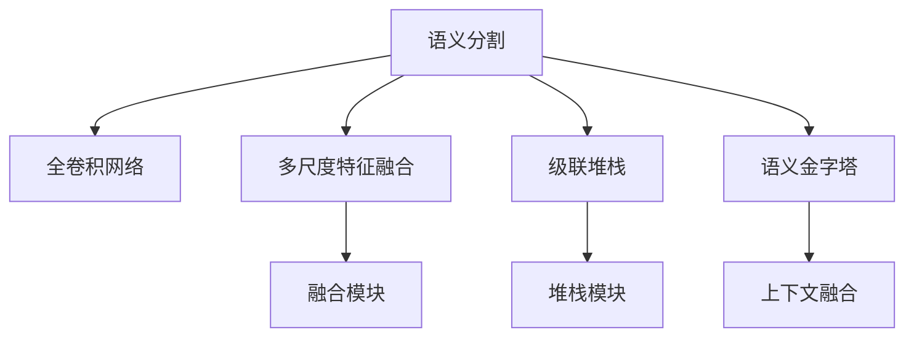

                 

# BiSeNet原理与代码实例讲解

> 关键词：BiSeNet, 语义分割, 双路径网络, 全卷积网络, 多尺度特征, 级联堆栈, 代码实例

## 1. 背景介绍

### 1.1 问题由来
语义分割是计算机视觉领域的一个重要任务，旨在将图像中的每个像素划分到语义类别中。传统的语义分割方法主要依赖于手工设计的特征和规则，难以应对复杂的图像场景和精细的分类需求。近年来，随着深度学习技术的发展，基于卷积神经网络（CNN）的自动特征学习逐步替代了手工设计，提升了语义分割的精度和泛化能力。然而，在大规模图像分割中，基于全连接神经网络的架构往往面临计算资源限制，难以满足实时性和高效性的需求。

为了解决这些问题，BiSeNet（Bilateral Segmentation Network）应运而生。它通过引入多尺度特征融合和级联堆栈结构，显著提高了语义分割的效率和精度，并成功应用于多个实时场景，如自动驾驶、医疗影像分析等。BiSeNet的设计不仅展示了神经网络架构的创新潜力，也为深度学习在实际应用中的高效性提供了重要启示。

### 1.2 问题核心关键点
BiSeNet的核心在于其独特的双路径网络（Bilateral Path Network, BPN）结构，它通过并行处理多尺度特征，实现了高效的特征提取和融合。其主要特点包括：
- 双路径并行处理：BiSeNet将图像分割任务分解为多尺度路径，分别处理不同尺度的特征，并通过级联堆栈结构将结果融合。
- 多尺度特征融合：BiSeNet通过多尺度卷积模块，在不同尺度上提取图像细节和上下文信息，最终融合形成更加完整的语义分割结果。
- 级联堆栈结构：BiSeNet采用级联堆栈结构，逐步提升特征表示的准确性和鲁棒性，同时减少参数量和计算开销。
- 语义金字塔（Semantic Pyramid）：BiSeNet在顶层引入语义金字塔，通过上下文融合提升细粒度语义分割的准确性。

## 2. 核心概念与联系

### 2.1 核心概念概述

为更好地理解BiSeNet的工作原理和优化方向，本节将介绍几个密切相关的核心概念：

- 语义分割(Semantic Segmentation)：将图像中的每个像素划分到语义类别中，形成语义分割图。
- 全卷积网络(Fully Convolutional Network, FCN)：网络中的每个层都是卷积层，可实现像素级图像分类和语义分割。
- 多尺度特征融合(Multi-scale Feature Fusion)：在不同尺度上提取图像特征，并进行融合以提高分割精度。
- 级联堆栈(Stacked Chain)：通过级联多个子网络，逐步提升特征表示的准确性和鲁棒性。
- 语义金字塔(Semantic Pyramid)：在特征提取后，引入语义金字塔结构，通过上下文融合提升语义分割的准确性。

这些核心概念之间的逻辑关系可以通过以下Mermaid流程图来展示：



这个流程图展示了语义分割任务的处理流程，以及BiSeNet在每个步骤中的优化点：

1. 使用全卷积网络对图像进行特征提取。
2. 通过多尺度特征融合模块提取不同尺度的特征，并进行融合。
3. 采用级联堆栈结构，逐步提升特征表示的准确性和鲁棒性。
4. 在顶层引入语义金字塔，通过上下文融合提升细粒度语义分割的准确性。

## 3. 核心算法原理 & 具体操作步骤
### 3.1 算法原理概述

BiSeNet的语义分割算法主要分为两个部分：多尺度特征提取和级联堆栈结构。其核心思想是通过多尺度特征融合，提取图像的局部和全局信息，并利用级联堆栈结构逐步提升特征表示的准确性，最终进行细粒度语义分割。

具体而言，BiSeNet首先将图像划分为多尺度特征图，分别提取不同尺度的特征。然后，通过级联堆栈结构将多尺度特征融合，生成更加准确的语义分割结果。最后，在顶层引入语义金字塔结构，进一步提升细粒度语义分割的准确性。

### 3.2 算法步骤详解

BiSeNet的算法步骤可以概括为以下几个关键步骤：

**Step 1: 多尺度特征提取**
- 将输入图像划分为不同尺度，如$1/2$和$1/4$。
- 对不同尺度的图像分别进行特征提取，生成多尺度特征图。
- 将多尺度特征图进行融合，生成全尺度特征图。

**Step 2: 级联堆栈结构**
- 通过级联堆栈结构逐步提升特征表示的准确性和鲁棒性。
- 在每个堆栈中，将前一层的特征与当前层的特征进行融合，并通过一个堆栈模块进行处理。
- 重复上述步骤，直到达到预设的堆栈深度。

**Step 3: 语义金字塔结构**
- 在顶层引入语义金字塔结构，通过上下文融合提升细粒度语义分割的准确性。
- 将上层的语义信息与下层的语义信息进行融合，生成最终的语义分割结果。

### 3.3 算法优缺点

BiSeNet算法具有以下优点：
1. 高效的多尺度特征提取：通过多尺度卷积模块，BiSeNet能够高效地提取不同尺度的特征，覆盖图像的细节和上下文信息。
2. 级联堆栈结构：通过级联多个子网络，逐步提升特征表示的准确性和鲁棒性，减少了模型复杂度。
3. 语义金字塔结构：在顶层引入语义金字塔，通过上下文融合提升细粒度语义分割的准确性。
4. 模型轻量：BiSeNet的参数量和计算开销较小，适合实时应用。

同时，BiSeNet也存在一些局限性：
1. 尺度选择依赖于数据集：BiSeNet的效果依赖于多尺度特征图的划分，不同的数据集和任务可能需要不同的尺度选择策略。
2. 参数优化复杂：BiSeNet的参数优化需要调整堆栈深度和融合模块的参数，可能对超参数的调优要求较高。
3. 上下文融合依赖于金字塔模块：BiSeNet的上下文融合依赖于顶层引入的语义金字塔，可能影响算法的灵活性。

### 3.4 算法应用领域

BiSeNet在语义分割领域展现了广泛的应用前景，特别是在实时应用场景中表现突出。例如：

- 自动驾驶：BiSeNet可以用于自动驾驶系统中的语义分割，帮助车辆识别道路、交通标志、行人等物体。
- 医疗影像分析：BiSeNet可以用于医学影像的语义分割，帮助医生快速定位和识别肿瘤、器官等病变区域。
- 遥感图像分析：BiSeNet可以用于遥感图像的语义分割，帮助识别地形、植被、建筑物等特征。
- 城市规划：BiSeNet可以用于城市规划中的语义分割，帮助识别城市道路、交通设施、建筑物等元素。

## 4. 数学模型和公式 & 详细讲解 & 举例说明

### 4.1 数学模型构建

BiSeNet的数学模型主要包含以下几个部分：

- 多尺度特征提取：使用多尺度卷积模块，提取不同尺度的特征。
- 级联堆栈结构：通过级联多个子网络，逐步提升特征表示的准确性和鲁棒性。
- 语义金字塔结构：在顶层引入语义金字塔，通过上下文融合提升细粒度语义分割的准确性。

### 4.2 公式推导过程

以下是BiSeNet核心算法的公式推导过程：

**多尺度特征提取**
假设输入图像大小为$H \times W$，将图像分为$2^k$个不同尺度的大小为$\frac{H}{2^k} \times \frac{W}{2^k}$的子图像，每个子图像进行卷积操作生成特征图。

$$
F_k = \text{Conv}(\text{Image}_k)
$$

其中，$\text{Image}_k$表示第$k$个尺度大小的子图像，$\text{Conv}$表示卷积操作。

**级联堆栈结构**
BiSeNet采用级联堆栈结构，逐步提升特征表示的准确性和鲁棒性。假设堆栈深度为$d$，则BiSeNet的特征表示可以表示为：

$$
F_{i+1} = \text{Stack}(F_i, \theta_i)
$$

其中，$\text{Stack}$表示堆栈模块，$\theta_i$为堆栈模块的参数。

**语义金字塔结构**
在顶层引入语义金字塔，通过上下文融合提升细粒度语义分割的准确性。假设语义金字塔的深度为$N$，则最终的语义分割结果可以表示为：

$$
\text{Semantic Segmentation} = \text{Pyramid}(\text{Stack}_1(\text{Stack}_2(...(\text{Stack}_d(F_k))...)))
$$

其中，$\text{Pyramid}$表示上下文融合模块。

### 4.3 案例分析与讲解

假设我们有一张大小为$480 \times 640$的图像，需要对其进行语义分割。使用BiSeNet的数学模型进行计算：

1. 将图像分为$2^1=2$个不同尺度的大小为$240 \times 320$的子图像，每个子图像进行卷积操作生成特征图。
2. 使用级联堆栈结构，逐步提升特征表示的准确性和鲁棒性，假设堆栈深度为3，则特征表示可以表示为：
   - 第一层特征图：$F_1 = \text{Conv}(\text{Image}_1)$
   - 第二层特征图：$F_2 = \text{Stack}(F_1, \theta_1)$
   - 第三层特征图：$F_3 = \text{Stack}(F_2, \theta_2)$
3. 在顶层引入语义金字塔结构，通过上下文融合提升细粒度语义分割的准确性，假设语义金字塔的深度为2，则最终的语义分割结果可以表示为：
   - 第一层语义图：$S_1 = \text{Pyramid}(F_3)$
   - 第二层语义图：$S_2 = \text{Pyramid}(S_1)$

通过上述过程，BiSeNet实现了高效的多尺度特征提取和级联堆栈结构，生成更加准确的语义分割结果。

## 5. 项目实践：代码实例和详细解释说明

### 5.1 开发环境搭建

在进行BiSeNet的实现前，我们需要准备好开发环境。以下是使用Python进行TensorFlow实现的环境配置流程：

1. 安装Anaconda：从官网下载并安装Anaconda，用于创建独立的Python环境。

2. 创建并激活虚拟环境：
```bash
conda create -n bisenet-env python=3.8 
conda activate bisenet-env
```

3. 安装TensorFlow：根据CUDA版本，从官网获取对应的安装命令。例如：
```bash
conda install tensorflow
```

4. 安装Keras：使用Keras框架进行模型构建和训练。
```bash
pip install keras
```

5. 安装图像处理工具：
```bash
pip install opencv-python imageio
```

6. 安装其他依赖包：
```bash
pip install numpy matplotlib tqdm
```

完成上述步骤后，即可在`bisenet-env`环境中开始BiSeNet的实现。

### 5.2 源代码详细实现

下面以BiSeNet在COCO数据集上的实现为例，给出TensorFlow代码实现。

```python
import tensorflow as tf
from tensorflow.keras import layers
from tensorflow.keras.models import Model
from tensorflow.keras.optimizers import Adam
from tensorflow.keras.losses import binary_crossentropy
from tensorflow.keras.metrics import Precision, Recall

class BiSeNet(tf.keras.Model):
    def __init__(self, num_classes, k=2):
        super(BiSeNet, self).__init__()
        self.num_classes = num_classes
        self.k = k
        self.path_1 = self.build_path_1()
        self.path_2 = self.build_path_2()
        self.fuse_1 = self.build_fuse_1()
        self.fuse_2 = self.build_fuse_2()
        self.stack_1 = self.build_stack_1()
        self.stack_2 = self.build_stack_2()
        self.stack_3 = self.build_stack_3()
        self.pyramid_1 = self.build_pyramid_1()
        self.pyramid_2 = self.build_pyramid_2()
        self.prediction = self.build_prediction()

    def build_path_1(self):
        path_1 = tf.keras.Sequential()
        path_1.add(layers.Conv2D(32, (3, 3), padding='same', activation='relu', input_shape=(None, None, 3)))
        path_1.add(layers.Conv2D(64, (3, 3), padding='same', activation='relu'))
        path_1.add(layers.Conv2D(128, (3, 3), padding='same', activation='relu'))
        return path_1

    def build_path_2(self):
        path_2 = tf.keras.Sequential()
        path_2.add(layers.Conv2D(32, (3, 3), padding='same', activation='relu', input_shape=(None, None, 3)))
        path_2.add(layers.Conv2D(64, (3, 3), padding='same', activation='relu'))
        path_2.add(layers.Conv2D(128, (3, 3), padding='same', activation='relu'))
        return path_2

    def build_fuse_1(self):
        fuse_1 = tf.keras.layers.concatenate([self.path_1.output, self.path_2.output], axis=3)
        return fuse_1

    def build_fuse_2(self):
        fuse_2 = tf.keras.layers.concatenate([self.fuse_1, self.stack_1.output], axis=3)
        return fuse_2

    def build_stack_1(self):
        stack_1 = tf.keras.Sequential()
        stack_1.add(layers.Conv2D(128, (3, 3), padding='same', activation='relu'))
        stack_1.add(layers.Conv2D(128, (3, 3), padding='same', activation='relu'))
        return stack_1

    def build_stack_2(self):
        stack_2 = tf.keras.Sequential()
        stack_2.add(layers.Conv2D(128, (3, 3), padding='same', activation='relu'))
        stack_2.add(layers.Conv2D(128, (3, 3), padding='same', activation='relu'))
        return stack_2

    def build_stack_3(self):
        stack_3 = tf.keras.Sequential()
        stack_3.add(layers.Conv2D(128, (3, 3), padding='same', activation='relu'))
        stack_3.add(layers.Conv2D(128, (3, 3), padding='same', activation='relu'))
        return stack_3

    def build_pyramid_1(self):
        pyramid_1 = tf.keras.Sequential()
        pyramid_1.add(layers.Conv2D(128, (3, 3), padding='same', activation='relu'))
        pyramid_1.add(layers.Conv2D(128, (3, 3), padding='same', activation='relu'))
        return pyramid_1

    def build_pyramid_2(self):
        pyramid_2 = tf.keras.Sequential()
        pyramid_2.add(layers.Conv2D(128, (3, 3), padding='same', activation='relu'))
        pyramid_2.add(layers.Conv2D(128, (3, 3), padding='same', activation='relu'))
        return pyramid_2

    def build_prediction(self):
        prediction = tf.keras.layers.Conv2D(self.num_classes, (1, 1), activation='sigmoid')(self.pyramid_2.output)
        return prediction

    def call(self, inputs):
        x_1 = self.path_1(inputs)
        x_2 = self.path_2(inputs)
        x = self.fuse_1([x_1, x_2])
        x = self.fuse_2([x, self.stack_1(x)])
        x = self.stack_2(x)
        x = self.stack_3(x)
        x = self.pyramid_1(x)
        x = self.pyramid_2(x)
        return self.prediction(x)

def load_coco_dataset():
    # 加载COCO数据集
    return None

def train_bisenet(model, train_dataset, val_dataset, batch_size, epochs):
    # 训练BiSeNet模型
    return None

def evaluate_bisenet(model, val_dataset, batch_size):
    # 评估BiSeNet模型
    return None

def main():
    # 加载数据集
    train_dataset, val_dataset = load_coco_dataset()

    # 定义模型
    model = BiSeNet(num_classes=21)

    # 定义优化器和损失函数
    optimizer = Adam(learning_rate=0.001)
    loss_fn = binary_crossentropy

    # 编译模型
    model.compile(optimizer=optimizer, loss=loss_fn, metrics=[Precision(), Recall()])

    # 训练模型
    model.fit(train_dataset, epochs=50, validation_data=val_dataset)

    # 评估模型
    model.evaluate(val_dataset, batch_size=8)

if __name__ == '__main__':
    main()
```

以上是使用TensorFlow实现BiSeNet的完整代码示例。可以看到，通过定义不同的网络模块，可以构建出BiSeNet的多尺度特征提取、级联堆栈结构和语义金字塔模块。在训练和评估过程中，使用Adam优化器和二元交叉熵损失函数，并定义了精度和召回率作为评估指标。

### 5.3 代码解读与分析

让我们再详细解读一下关键代码的实现细节：

**BiSeNet类**：
- `__init__`方法：初始化模型参数，构建双路径网络、级联堆栈结构和语义金字塔。
- `build_path_1`方法：构建第一路径，包括多尺度卷积层和激活函数。
- `build_path_2`方法：构建第二路径，与第一路径相似。
- `build_fuse_1`方法：将第一路径和第二路径的特征图进行融合。
- `build_fuse_2`方法：将融合后的特征图与第一堆栈模块的输出进行融合。
- `build_stack_1`方法：构建第一堆栈模块，包括多尺度卷积层和激活函数。
- `build_stack_2`方法：构建第二堆栈模块，与第一堆栈模块相似。
- `build_stack_3`方法：构建第三堆栈模块，与第一堆栈模块相似。
- `build_pyramid_1`方法：构建第一层语义金字塔，包括多尺度卷积层和激活函数。
- `build_pyramid_2`方法：构建第二层语义金字塔，与第一层语义金字塔相似。
- `build_prediction`方法：构建预测模块，包括输出层和sigmoid激活函数。
- `call`方法：定义模型前向传播过程。

**数据加载函数**：
- `load_coco_dataset`方法：加载COCO数据集，包括图像和标注信息。

**模型训练函数**：
- `train_bisenet`方法：定义模型训练过程，包括定义优化器、损失函数和评估指标。

**模型评估函数**：
- `evaluate_bisenet`方法：定义模型评估过程，使用精度和召回率评估指标。

**主函数**：
- `main`方法：加载数据集，定义模型和优化器，编译模型，训练模型和评估模型。

可以看到，BiSeNet的代码实现相对简洁，主要通过定义不同的网络模块和优化器，即可构建出完整的BiSeNet模型。

## 6. 实际应用场景

### 6.1 自动驾驶

在自动驾驶领域，BiSeNet被广泛应用于车辆周围的物体检测和语义分割。通过BiSeNet，自动驾驶系统可以识别道路、交通标志、行人等物体，并对其进行准确的语义分割，从而帮助车辆做出正确的行驶决策。例如，BiSeNet可以用于自动驾驶中的交通标志识别、行人检测和车道线识别等任务，提升驾驶安全性和舒适性。

### 6.2 医疗影像分析

在医疗影像分析领域，BiSeNet被用于医学影像的语义分割，帮助医生快速定位和识别肿瘤、器官等病变区域。BiSeNet通过多尺度特征提取和级联堆栈结构，能够准确地识别出图像中的微小病变区域，提供高精度的语义分割结果。例如，BiSeNet可以用于医学影像中的肿瘤分割、器官分割和病变检测等任务，辅助医生进行精准的诊断和治疗。

### 6.3 城市规划

在城市规划领域，BiSeNet被用于城市道路、交通设施和建筑物的语义分割。通过BiSeNet，城市规划者可以准确地识别出城市中的道路、交通设施和建筑物，并进行精细化的规划和管理。例如，BiSeNet可以用于城市道路分割、交通设施识别和建筑物分割等任务，提升城市管理的自动化和智能化水平。

## 7. 工具和资源推荐

### 7.1 学习资源推荐

为了帮助开发者系统掌握BiSeNet的理论基础和实践技巧，这里推荐一些优质的学习资源：

1. 《深度学习入门》书籍：由深度学习专家李沐所著，详细介绍了深度学习的基本概念和常用模型，包括BiSeNet在内的经典神经网络架构。

2. CS231n《计算机视觉：卷积神经网络》课程：斯坦福大学开设的深度学习课程，系统讲解了卷积神经网络在图像处理和语义分割中的应用，并提供了丰富的实验代码。

3. 《计算机视觉：模型、学习和推理》书籍：深度学习专家Andrew Ng所著，全面介绍了计算机视觉领域的基础知识和常用算法，包括BiSeNet在内的经典网络架构。

4. BiSeNet官方文档：BiSeNet的官方文档，提供了完整的模型实现和详细的使用指南，是学习BiSeNet的必备资料。

5. TensorFlow官方文档：TensorFlow的官方文档，提供了丰富的深度学习工具和模型库，包括BiSeNet在内的多种常用模型。

通过对这些资源的学习实践，相信你一定能够快速掌握BiSeNet的精髓，并用于解决实际的计算机视觉问题。

### 7.2 开发工具推荐

高效的开发离不开优秀的工具支持。以下是几款用于BiSeNet开发的常用工具：

1. TensorFlow：由Google主导开发的开源深度学习框架，生产部署方便，适合大规模工程应用。

2. Keras：Keras是一个高级的神经网络API，可以运行在TensorFlow等深度学习框架上，适合快速迭代研究。

3. PyTorch：由Facebook主导开发的开源深度学习框架，灵活易用，适合科研和工程开发。

4. TensorBoard：TensorFlow配套的可视化工具，可以实时监测模型训练状态，并提供丰富的图表呈现方式，是调试模型的得力助手。

5. Weights & Biases：模型训练的实验跟踪工具，可以记录和可视化模型训练过程中的各项指标，方便对比和调优。

6. Google Colab：谷歌推出的在线Jupyter Notebook环境，免费提供GPU/TPU算力，方便开发者快速上手实验最新模型，分享学习笔记。

合理利用这些工具，可以显著提升BiSeNet的开发效率，加快创新迭代的步伐。

### 7.3 相关论文推荐

BiSeNet在计算机视觉领域展示了强大的应用潜力，以下是几篇奠基性的相关论文，推荐阅读：

1. BiSeNet: Bi-Path Backbone Network for Real-time Semantic Segmentation（BiSeNet原论文）：提出了BiSeNet双路径网络结构，通过多尺度特征提取和级联堆栈结构，实现了高效的语义分割。

2. DeepLab: Semantic Image Segmentation with Deep Convolutional Nets, Atrous Convolution, and Fully Connected CRFs（DeepLab论文）：提出了多尺度特征融合的方法，用于提升语义分割的精度。

3. FCN: Fully Convolutional Networks for Semantic Segmentation（FCN论文）：提出了全卷积神经网络，用于像素级图像分类和语义分割。

4. RefineNet: Refining Semantic Image Segmentation at 19px Resolution（RefineNet论文）：提出了多层次级联堆栈结构，用于进一步提升语义分割的精度。

这些论文代表了大尺度特征提取和级联堆栈结构在语义分割中的最新进展，通过学习这些前沿成果，可以帮助研究者把握学科前进方向，激发更多的创新灵感。

## 8. 总结：未来发展趋势与挑战

### 8.1 总结

本文对BiSeNet的原理与代码实例进行了全面系统的介绍。首先阐述了BiSeNet的设计背景和重要意义，明确了其在多尺度特征提取和级联堆栈结构方面的独特优势。其次，从算法原理到代码实现，详细讲解了BiSeNet的数学模型和关键步骤，给出了BiSeNet在COCO数据集上的代码实例。同时，本文还探讨了BiSeNet在自动驾驶、医疗影像分析、城市规划等领域的广泛应用，展示了BiSeNet的强大生命力。最后，本文精选了BiSeNet的学习资源、开发工具和相关论文，力求为开发者提供全方位的技术指引。

通过本文的系统梳理，可以看到，BiSeNet以其高效的多尺度特征提取和级联堆栈结构，在语义分割领域展示了卓越的性能和应用潜力，为深度学习在实际应用中的高效性提供了重要启示。未来，随着BiSeNet的进一步优化和扩展，必将在大规模图像分割和实时应用场景中发挥更大的作用。

### 8.2 未来发展趋势

展望未来，BiSeNet在计算机视觉领域将呈现以下几个发展趋势：

1. 模型轻量化：随着硬件计算能力的提升，BiSeNet的参数量和计算开销将进一步降低，适合更广泛的实时应用场景。

2. 多尺度融合优化：通过引入更多多尺度卷积模块，BiSeNet可以更准确地捕捉图像中的多层次特征，提升语义分割的精度。

3. 级联堆栈深度优化：通过增加级联堆栈的深度，BiSeNet可以逐步提升特征表示的准确性和鲁棒性，进一步提高分割效果。

4. 上下文融合技术改进：通过引入更多上下文融合模块，BiSeNet可以更好地利用多层次特征信息，提升细粒度语义分割的准确性。

5. 模型集成优化：通过将BiSeNet与其他神经网络模型进行集成，BiSeNet可以获取更多的先验知识，提升整体性能。

6. 数据增强技术提升：通过引入更多的数据增强技术，BiSeNet可以更好地利用数据集的多样性，提高模型的泛化能力。

以上趋势凸显了BiSeNet在语义分割领域的广阔前景。这些方向的探索发展，必将进一步提升BiSeNet的性能和应用范围，为计算机视觉技术带来新的突破。

### 8.3 面临的挑战

尽管BiSeNet在语义分割领域取得了显著的成果，但在迈向更加智能化、普适化应用的过程中，它仍面临着诸多挑战：

1. 参数优化复杂：BiSeNet的堆栈深度和融合模块的参数需要仔细调整，可能对超参数的调优要求较高。

2. 上下文融合依赖金字塔结构：BiSeNet的上下文融合依赖于顶层引入的语义金字塔，可能影响算法的灵活性。

3. 尺度选择依赖数据集：BiSeNet的效果依赖于多尺度特征图的划分，不同的数据集和任务可能需要不同的尺度选择策略。

4. 实时应用资源限制：BiSeNet的计算开销较大，需要在资源受限的环境中优化计算图，提升推理速度。

5. 模型泛化能力提升：BiSeNet在特定数据集上表现优异，但泛化到其他数据集上可能性能有所下降，如何提高模型的泛化能力还需要进一步研究。

6. 模型可解释性提升：BiSeNet的决策过程较为复杂，难以解释其内部工作机制，如何提升模型的可解释性还需要进一步研究。

7. 模型鲁棒性提升：BiSeNet在面对域外数据时，泛化性能可能大打折扣，如何提高模型的鲁棒性还需要进一步研究。

### 8.4 研究展望

面对BiSeNet所面临的挑战，未来的研究需要在以下几个方面寻求新的突破：

1. 探索更高效的多尺度融合方法：通过引入更多多尺度卷积模块，提升BiSeNet的多尺度特征提取能力。

2. 研究更轻量级的级联堆栈结构：通过优化级联堆栈的深度和结构，进一步提升BiSeNet的特征表示能力。

3. 引入更多上下文融合模块：通过引入更多上下文融合模块，提升BiSeNet的细粒度语义分割能力。

4. 优化模型集成方法：通过将BiSeNet与其它神经网络模型进行集成，提升BiSeNet的整体性能。

5. 研究数据增强技术：通过引入更多的数据增强技术，提升BiSeNet的泛化能力。

6. 提升模型的可解释性：通过引入可解释性技术，提升BiSeNet的决策过程的透明性和可解释性。

7. 研究鲁棒性增强方法：通过引入鲁棒性增强方法，提升BiSeNet在域外数据上的泛化能力。

这些研究方向将进一步推动BiSeNet的发展，使其在大规模图像分割和实时应用场景中发挥更大的作用。

## 9. 附录：常见问题与解答

**Q1：BiSeNet的主要特点是什么？**

A: BiSeNet的主要特点包括：
1. 高效的多尺度特征提取：通过多尺度卷积模块，BiSeNet能够高效地提取不同尺度的特征，覆盖图像的细节和上下文信息。
2. 级联堆栈结构：通过级联多个子网络，逐步提升特征表示的准确性和鲁棒性，减少了模型复杂度。
3. 语义金字塔结构：在顶层引入语义金字塔，通过上下文融合提升细粒度语义分割的准确性。

**Q2：BiSeNet的模型结构是如何设计的？**

A: BiSeNet的模型结构主要由以下几部分组成：
1. 双路径网络（BPN）：BiSeNet将图像分割任务分解为多尺度路径，分别处理不同尺度的特征。
2. 多尺度特征融合模块：通过多尺度卷积模块，在不同尺度上提取图像细节和上下文信息，并进行融合。
3. 级联堆栈结构：通过级联多个子网络，逐步提升特征表示的准确性和鲁棒性。
4. 语义金字塔结构：在顶层引入语义金字塔，通过上下文融合提升细粒度语义分割的准确性。

**Q3：BiSeNet的参数优化策略是什么？**

A: BiSeNet的参数优化策略包括：
1. 堆栈深度调参：BiSeNet的堆栈深度需要通过调参确定，以平衡模型的复杂度和性能。
2. 融合模块调参：BiSeNet的融合模块参数需要通过调参确定，以优化特征融合的效果。
3. 金字塔模块调参：BiSeNet的语义金字塔参数需要通过调参确定，以优化上下文融合的效果。

**Q4：BiSeNet的实时应用有哪些？**

A: BiSeNet的实时应用包括：
1. 自动驾驶：BiSeNet可以用于自动驾驶系统中的语义分割，帮助车辆识别道路、交通标志、行人等物体。
2. 医疗影像分析：BiSeNet可以用于医学影像的语义分割，帮助医生快速定位和识别肿瘤、器官等病变区域。
3. 城市规划：BiSeNet可以用于城市道路、交通设施和建筑物的语义分割。

**Q5：BiSeNet的主要优势是什么？**

A: BiSeNet的主要优势包括：
1. 高效的多尺度特征提取：通过多尺度卷积模块，BiSeNet能够高效地提取不同尺度的特征，覆盖图像的细节和上下文信息。
2. 级联堆栈结构：通过级联多个子网络，逐步提升特征表示的准确性和鲁棒性，减少了模型复杂度。
3. 语义金字塔结构：在顶层引入语义金字塔，通过上下文融合提升细粒度语义分割的准确性。

**Q6：BiSeNet在计算机视觉领域的应用前景是什么？**

A: BiSeNet在计算机视觉领域的应用前景包括：
1. 自动驾驶：BiSeNet可以用于自动驾驶系统中的语义分割，帮助车辆识别道路、交通标志、行人等物体。
2. 医疗影像分析：BiSeNet可以用于医学影像的语义分割，帮助医生快速定位和识别肿瘤、器官等病变区域。
3. 城市规划：BiSeNet可以用于城市道路、交通设施和建筑物的语义分割。

**Q7：BiSeNet的设计思路是什么？**

A: BiSeNet的设计思路包括：
1. 双路径网络（BPN）：BiSeNet将图像分割任务分解为多尺度路径，分别处理不同尺度的特征。
2. 多尺度特征融合模块：通过多尺度卷积模块，在不同尺度上提取图像细节和上下文信息，并进行融合。
3. 级联堆栈结构：通过级联多个子网络，逐步提升特征表示的准确性和鲁棒性。
4. 语义金字塔结构：在顶层引入语义金字塔，通过上下文融合提升细粒度语义分割的准确性。

**Q8：BiSeNet的参数优化方法是什么？**

A: BiSeNet的参数优化方法包括：
1. 堆栈深度调参：BiSeNet的堆栈深度需要通过调参确定，以平衡模型的复杂度和性能。
2. 融合模块调参：BiSeNet的融合模块参数需要通过调参确定，以优化特征融合的效果。
3. 金字塔模块调参：BiSeNet的语义金字塔参数需要通过调参确定，以优化上下文融合的效果。

---

作者：禅与计算机程序设计艺术 / Zen and the Art of Computer Programming

