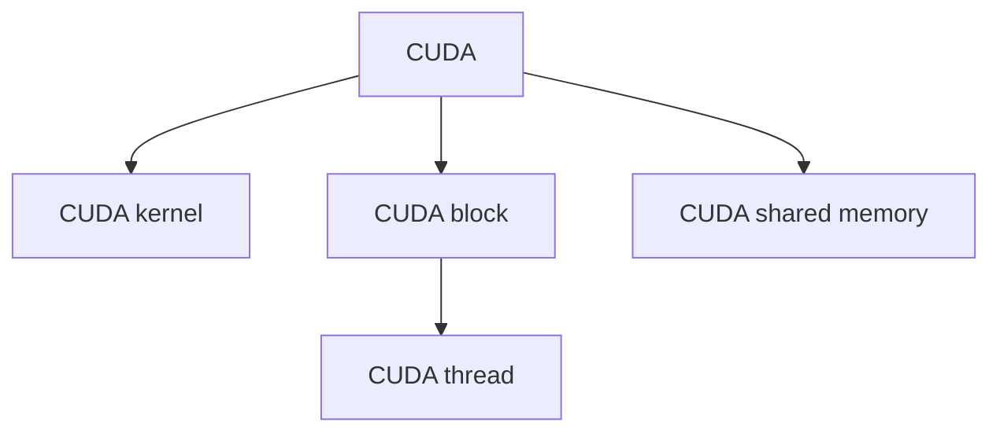

                 

## 1. 背景介绍

在现代AI计算中，GPU（图形处理器）已经成为了不可或缺的计算资源。它凭借其高并行计算能力、优化的浮点运算性能以及良好的能源效率，迅速成为深度学习模型的首选计算平台。特别是在深度学习领域，GPU已经成为了训练大型神经网络、实现大规模并行计算的核心工具。然而，要充分利用GPU的计算潜力，就需要了解并掌握CUDA编程的技术。

### 1.1 问题由来

随着深度学习技术的发展，对于计算资源的需求也在不断增长。GPU以其卓越的并行计算能力，成为处理复杂计算任务的重要工具。深度学习模型的训练和推理过程需要大量的浮点运算，而GPU能够高效地执行这些运算。因此，对于想要加速AI计算任务的技术人员来说，掌握CUDA编程成为了一项重要技能。

然而，尽管CUDA编程的重要性不言而喻，但对于许多AI开发者来说，CUDA编程仍然是一项较为复杂的任务。本文章将详细讲解CUDA编程的基本原理、操作步骤以及实际应用，帮助读者全面掌握这一重要技能。

### 1.2 问题核心关键点

要充分利用CUDA编程的优势，需要注意以下几个核心关键点：

- 理解CUDA架构：了解CUDA的计算模型、内存管理机制和并行计算特性，是编写高效CUDA程序的基础。
- 掌握CUDA编程技巧：熟悉CUDA编程中的关键概念，如CUDA内核、线程块、共享内存等，是编写高效CUDA程序的关键。
- 熟悉CUDA库和API：了解CUDA提供的各种库和API，如CUDA Math Library、CUDA Tensor Cores等，有助于编写高效、可移植的CUDA程序。
- 掌握性能调优技巧：理解并掌握CUDA程序性能调优的方法，如核函数优化、内存优化、异步计算等，是充分发挥CUDA计算潜力的重要手段。
- 了解CUDA开发工具：熟悉CUDA开发环境、调试工具和性能分析工具，如NVIDIA CUDA Toolkit、CUDA Debugger、Visual Studio等，有助于提高开发效率和程序质量。

## 2. 核心概念与联系

### 2.1 核心概念概述

为了更好地理解CUDA编程，本节将介绍几个关键的核心概念：

- CUDA（Compute Unified Device Architecture）：NVIDIA开发的并行计算平台和API，可以加速计算密集型应用，如深度学习模型训练。
- CUDA kernel：CUDA程序中的并行计算函数，能够利用GPU的并行计算能力，执行大规模计算任务。
- CUDA block：CUDA内核中的并行执行单元，包含了若干个线程。
- CUDA thread：CUDA kernel中的执行单元，负责执行具体的计算任务。
- CUDA shared memory：CUDA kernel中的共享内存区域，用于线程间的数据交换。

这些核心概念之间的逻辑关系可以通过以下Mermaid流程图来展示：



这个流程图展示了CUDA编程的核心概念及其之间的关系：

1. CUDA提供了一个并行计算平台，可以执行大规模计算任务。
2. CUDA kernel是并行计算的核心函数，能够利用GPU的并行计算能力。
3. CUDA block是并行执行的单元，包含了多个CUDA thread。
4. CUDA thread是执行具体计算任务的单元，能够并行执行。
5. CUDA shared memory是线程间的数据交换区域，用于提高程序性能。

## 3. 核心算法原理 & 具体操作步骤

### 3.1 算法原理概述

CUDA编程的基本原理是通过编写并行计算程序，利用GPU的并行计算能力，加速计算密集型任务。以下是CUDA编程的基本步骤：

1. 编写CUDA kernel函数：定义并实现CUDA kernel函数，描述具体的计算任务。
2. 创建CUDA kernel实例：创建CUDA kernel的实例，定义线程块和线程的数量。
3. 调用CUDA kernel：在主机端调用CUDA kernel实例，执行具体的计算任务。
4. 数据管理：管理CUDA kernel中的数据，包括共享内存和常量内存等。
5. 性能优化：优化CUDA kernel的性能，包括线程调度、共享内存使用和数据传输等。

### 3.2 算法步骤详解

CUDA编程的详细步骤包括：

#### 3.2.1 编写CUDA kernel函数

CUDA kernel函数是并行计算的核心，定义了具体的计算任务。以下是一个简单的CUDA kernel函数的示例：

```c
__global__ void kernel_func(int *data, int size) {
    int tid = blockIdx.x * blockDim.x + threadIdx.x;
    if (tid < size) {
        data[tid] = tid;
    }
}
```

这个CUDA kernel函数的功能是，将主机传入的数组数据，在每个线程中写回计算结果。

#### 3.2.2 创建CUDA kernel实例

CUDA kernel实例是CUDA kernel的运行实例，定义了线程块和线程的数量。以下是一个创建CUDA kernel实例的示例：

```c
int threads_per_block = 256;
dim3 block_dim(threads_per_block);
dim3 grid_dim(1);
kernel_func<<<grid_dim, block_dim>>>(buf, size);
```

这个示例中，创建了一个CUDA kernel实例，将数组数据`buf`作为输入，线程块大小为256，线程数量为1。

#### 3.2.3 调用CUDA kernel

调用CUDA kernel实例，执行具体的计算任务。以下是一个调用CUDA kernel的示例：

```c
int *dev_data = (int *) cuMemHostAlloc(cuMemAllocPitch(1, 4, size, 0));
if (cuMemHostAlloc(dev_data, 0) != CUDA_SUCCESS) {
    printf("Failed to allocate host memory for device data.\n");
}
cudaMemcpy(dev_data, buf, size, cudaMemcpyHostToDevice);
kernel_func<<<grid_dim, block_dim>>>(buf, size);
cudaMemcpy(buf, dev_data, size, cudaMemcpyDeviceToHost);
```

这个示例中，首先将主机内存`buf`中的数据复制到设备内存`dev_data`中，然后调用CUDA kernel函数`kernel_func`进行计算，最后将计算结果从设备内存复制回主机内存。

#### 3.2.4 数据管理

在CUDA kernel中，需要使用共享内存和常量内存等数据管理机制。以下是一个使用共享内存的示例：

```c
__shared__ int s_data[1024];
int tid = threadIdx.x;
s_data[tid] = tid;
__syncthreads();
int result = s_data[threadIdx.x];
```

这个示例中，定义了一个共享内存数组`s_data`，每个线程将计算结果写入共享内存中，然后使用`__syncthreads()`函数同步线程，最后每个线程从共享内存中读取结果。

#### 3.2.5 性能优化

CUDA kernel的性能优化包括线程调度、共享内存使用和数据传输等。以下是一个性能优化的示例：

```c
__global__ void kernel_func(int *data, int size) {
    int tid = blockIdx.x * blockDim.x + threadIdx.x;
    if (tid < size) {
        data[tid] = tid;
    }
}
```

这个示例中，将线程块大小设为256，线程数量为1，使用了共享内存来提高程序性能。

### 3.3 算法优缺点

CUDA编程具有以下优点：

- 并行计算能力强：CUDA可以利用GPU的并行计算能力，加速大规模计算任务。
- 优化能力强：CUDA提供了一系列的优化机制，如共享内存、线程调度等，可以优化程序性能。
- 跨平台性强：CUDA可以在NVIDIA GPU上运行，支持多种操作系统和编译器。

CUDA编程也存在以下缺点：

- 学习曲线较陡：CUDA编程需要掌握许多并行计算和数据管理的知识，对于初学者来说，学习曲线较陡。
- 硬件依赖性强：CUDA只能在NVIDIA GPU上运行，对于其他硬件平台不兼容。
- 编程复杂度高：CUDA编程需要考虑线程调度、数据传输等问题，编程复杂度较高。

### 3.4 算法应用领域

CUDA编程广泛应用于深度学习、图形处理、科学计算等领域。以下是一些CUDA编程的应用场景：

- 深度学习模型训练：利用CUDA加速深度学习模型的训练过程，提高训练速度。
- 图形处理：利用CUDA进行图像处理、视频编解码等图形处理任务。
- 科学计算：利用CUDA进行大规模科学计算任务，如计算流体动力学模拟、气候模拟等。
- 信号处理：利用CUDA进行音频、视频信号处理任务，如音频编解码、视频编码等。
- 数据库查询：利用CUDA进行大规模数据库查询任务，提高查询速度。

## 4. 数学模型和公式 & 详细讲解 & 举例说明

### 4.1 数学模型构建

在CUDA编程中，数学模型的构建通常涉及到矩阵运算、向量运算等，以下是一个矩阵乘法的CUDA实现：

```c
__global__ void matrix_mul(int *A, int *B, int *C, int m, int n, int k) {
    int i = blockIdx.y * blockDim.y + threadIdx.y;
    int j = blockIdx.x * blockDim.x + threadIdx.x;
    if (i < m && j < n) {
        int sum = 0;
        for (int p = 0; p < k; p++) {
            sum += A[i * k + p] * B[p * n + j];
        }
        C[i * n + j] = sum;
    }
}
```

这个示例中，定义了一个CUDA kernel函数`matrix_mul`，用于计算两个矩阵的乘积。

### 4.2 公式推导过程

CUDA编程的公式推导过程，通常涉及到矩阵运算、向量运算等，以下是一个矩阵乘法的公式推导：

设$A$为$m \times k$矩阵，$B$为$k \times n$矩阵，则$A \times B$的计算公式为：

$$
C_{i,j} = \sum_{p=0}^{k-1} A_{i,p} \times B_{p,j}
$$

这个公式表示，$C$矩阵中的每个元素$C_{i,j}$，是由$A$矩阵中的第$i$行和$B$矩阵中的第$j$列元素相乘并求和得到的。

### 4.3 案例分析与讲解

以下是一个CUDA矩阵乘法的实现案例：

```c
__global__ void matrix_mul(int *A, int *B, int *C, int m, int n, int k) {
    int i = blockIdx.y * blockDim.y + threadIdx.y;
    int j = blockIdx.x * blockDim.x + threadIdx.x;
    if (i < m && j < n) {
        int sum = 0;
        for (int p = 0; p < k; p++) {
            sum += A[i * k + p] * B[p * n + j];
        }
        C[i * n + j] = sum;
    }
}
```

这个示例中，定义了一个CUDA kernel函数`matrix_mul`，用于计算两个矩阵的乘积。

## 5. 项目实践：代码实例和详细解释说明

### 5.1 开发环境搭建

在进行CUDA编程实践前，我们需要准备好开发环境。以下是使用CUDA进行CUDA编程的环境配置流程：

1. 安装CUDA Toolkit：从NVIDIA官网下载并安装CUDA Toolkit，获取所需的CUDA库和开发工具。
2. 安装CUDA Driver：确保显卡驱动与CUDA Toolkit版本匹配，下载并安装NVIDIA CUDA Driver。
3. 安装CUDA Development Tools：在安装CUDA Toolkit时，安装CUDA Development Tools，包括CUDA compiler、调试工具等。
4. 设置环境变量：将CUDA Toolkit和CUDA Driver的安装路径添加到环境变量中。

完成上述步骤后，即可在CUDA环境中开始CUDA编程实践。

### 5.2 源代码详细实现

以下是一个CUDA kernel函数的实现示例：

```c
__global__ void matrix_mul(int *A, int *B, int *C, int m, int n, int k) {
    int i = blockIdx.y * blockDim.y + threadIdx.y;
    int j = blockIdx.x * blockDim.x + threadIdx.x;
    if (i < m && j < n) {
        int sum = 0;
        for (int p = 0; p < k; p++) {
            sum += A[i * k + p] * B[p * n + j];
        }
        C[i * n + j] = sum;
    }
}
```

这个示例中，定义了一个CUDA kernel函数`matrix_mul`，用于计算两个矩阵的乘积。

### 5.3 代码解读与分析

让我们再详细解读一下关键代码的实现细节：

**matrix_mul函数**：
- `__global__`：表示这是一个CUDA kernel函数。
- `int *A, int *B, int *C`：表示函数需要输入三个指针，指向A、B、C矩阵的数据。
- `int m, int n, int k`：表示A矩阵的维度、B矩阵的维度和C矩阵的维度。
- `int i = blockIdx.y * blockDim.y + threadIdx.y;`：表示线程在y轴上的位置。
- `int j = blockIdx.x * blockDim.x + threadIdx.x;`：表示线程在x轴上的位置。
- `if (i < m && j < n)`：表示当前线程在A矩阵和B矩阵的范围内。
- `for (int p = 0; p < k; p++)`：表示对A矩阵和B矩阵中的每个元素进行遍历。
- `sum += A[i * k + p] * B[p * n + j];`：表示计算A矩阵和B矩阵中对应元素的乘积并累加。
- `C[i * n + j] = sum;`：表示将计算结果写入C矩阵中。

这个示例中，通过CUDA kernel函数实现了矩阵乘法，展示了CUDA编程的基本原理和实现方法。

### 5.4 运行结果展示

以下是一个CUDA矩阵乘法的运行结果示例：

```c
// 输入：A、B矩阵
int A[] = {1, 2, 3, 4, 5, 6};
int B[] = {7, 8, 9, 10, 11, 12};
int C[] = {0, 0, 0, 0, 0, 0};
int m = 2;
int n = 2;
int k = 3;
// 输出：C矩阵
matrix_mul<<<1, 2>>>(&A[0], &B[0], &C[0], m, n, k);
cudaDeviceSynchronize();
```

这个示例中，将输入的A、B矩阵计算乘积，存储在C矩阵中。

## 6. 实际应用场景

### 6.1 智能视频分析

CUDA编程在智能视频分析领域有着广泛的应用。利用CUDA加速视频编码、解码和处理，可以实现实时视频分析、物体检测、人脸识别等任务。CUDA可以优化视频编码和解码算法，提升处理速度和效率，使得智能视频分析系统能够处理大规模视频数据，提高分析精度和实时性。

### 6.2 深度学习训练

CUDA编程在深度学习训练领域同样有着广泛的应用。利用CUDA加速深度学习模型的训练过程，可以显著提升训练速度和效率。通过CUDA并行计算，可以在大规模数据集上进行高效的模型训练，加速深度学习模型的收敛过程，提高模型的精度和泛化能力。

### 6.3 图像处理

CUDA编程在图像处理领域也有着广泛的应用。利用CUDA加速图像处理算法，可以实现实时图像处理、图像增强、图像识别等任务。CUDA可以优化图像处理算法，提高处理速度和效率，使得图像处理系统能够处理大规模图像数据，提高图像处理精度和实时性。

### 6.4 未来应用展望

随着CUDA编程技术的不断发展，未来CUDA编程将会在更多领域得到应用，为智能计算提供更强大的支持。CUDA编程将会在以下领域得到广泛应用：

- 智能计算：CUDA编程在智能计算领域有着广泛的应用，可以实现高效的计算密集型任务。
- 科学计算：CUDA编程在科学计算领域也有着广泛的应用，可以实现高效的科学计算任务。
- 图形处理：CUDA编程在图形处理领域也有着广泛的应用，可以实现高效的图形处理任务。
- 机器学习：CUDA编程在机器学习领域也有着广泛的应用，可以实现高效的机器学习任务。
- 计算机视觉：CUDA编程在计算机视觉领域也有着广泛的应用，可以实现高效的计算机视觉任务。

## 7. 工具和资源推荐

### 7.1 学习资源推荐

为了帮助开发者系统掌握CUDA编程的理论基础和实践技巧，这里推荐一些优质的学习资源：

1. NVIDIA CUDA开发者文档：NVIDIA官方提供的CUDA开发者文档，详细介绍了CUDA编程的各个方面，包括CUDA kernel、数据管理、性能优化等。
2. CUDA Programming Guide：NVIDIA官方提供的CUDA编程指南，涵盖了CUDA编程的基本概念和实践技巧。
3. Parallel Programming with CUDA：一本介绍CUDA编程的书籍，深入浅出地介绍了CUDA编程的基本原理和实践技巧。
4. NVIDIA CUDA Toolkit示例代码：NVIDIA官方提供的CUDA Toolkit示例代码，包含了大量的CUDA编程示例，便于开发者学习和实践。
5. NVIDIA CUDA开发者社区：NVIDIA官方提供的CUDA开发者社区，包含了大量的CUDA编程资源，包括文档、示例代码、技术论坛等。

通过对这些资源的学习实践，相信你一定能够快速掌握CUDA编程的精髓，并用于解决实际的计算密集型问题。

### 7.2 开发工具推荐

CUDA编程需要借助一些工具进行开发和调试。以下是几款常用的CUDA开发工具：

1. NVIDIA CUDA Toolkit：NVIDIA提供的CUDA开发环境，包含了CUDA编译器、调试工具、性能分析工具等。
2. Visual Studio：Microsoft提供的IDE，支持CUDA编程和调试。
3. Eclipse：一款流行的IDE，支持CUDA编程和调试。
4. Xcode：苹果提供的IDE，支持CUDA编程和调试。
5. Visual Studio Code：一款轻量级的IDE，支持CUDA编程和调试。

合理利用这些工具，可以显著提升CUDA编程的开发效率，加快创新迭代的步伐。

### 7.3 相关论文推荐

CUDA编程的相关论文代表了CUDA编程技术的发展脉络。以下是几篇奠基性的相关论文，推荐阅读：

1. CUDA Architecture Overview：NVIDIA官方提供的CUDA架构概述，详细介绍了CUDA架构的基本概念和特性。
2. CUDA Parallel Programming Guide：NVIDIA官方提供的CUDA并行编程指南，深入浅出地介绍了CUDA并行编程的基本原理和实践技巧。
3. CUDA Programming and Performance：NVIDIA官方提供的CUDA编程和性能优化指南，详细介绍了CUDA编程的各个方面，包括性能优化、数据管理等。
4. GPU Computing with CUDA：一本介绍CUDA编程的书籍，涵盖了CUDA编程的基本概念和实践技巧。
5. Parallel Programming for GPU Computing：一本介绍CUDA编程的书籍，深入浅出地介绍了CUDA编程的基本原理和实践技巧。

这些论文代表了CUDA编程技术的发展脉络。通过学习这些前沿成果，可以帮助研究者把握CUDA编程的前进方向，激发更多的创新灵感。

## 8. 总结：未来发展趋势与挑战

### 8.1 总结

本文对CUDA编程的基本原理、操作步骤以及实际应用进行了详细讲解。首先阐述了CUDA编程的重要性和发展历史，明确了CUDA编程在深度学习、图形处理、科学计算等领域的重要作用。其次，从原理到实践，详细讲解了CUDA编程的数学模型和公式推导，给出了CUDA编程任务开发的完整代码实例。同时，本文还广泛探讨了CUDA编程在智能视频分析、深度学习训练、图像处理等多个领域的应用前景，展示了CUDA编程的强大潜力。此外，本文精选了CUDA编程的学习资源，力求为读者提供全方位的技术指引。

通过本文的系统梳理，可以看到，CUDA编程已经成为深度学习、图形处理、科学计算等领域的重要工具，其强大的并行计算能力和优化机制，为大规模计算任务提供了有力支持。CUDA编程的未来发展前景广阔，将在更多领域得到应用，为智能计算带来更强大的支持。

### 8.2 未来发展趋势

展望未来，CUDA编程将呈现以下几个发展趋势：

1. 并行计算能力更强：随着CUDA架构的不断优化，未来CUDA编程的并行计算能力将更强，能够支持更大规模的计算任务。
2. 数据管理机制更丰富：CUDA编程的数据管理机制将更加丰富，包括共享内存、常量内存、全域变量等，可以更好地管理大规模数据。
3. 编程语言更丰富：未来CUDA编程将支持更多的编程语言，如C++、Python等，提升开发效率和可移植性。
4. 应用场景更广泛：CUDA编程将在更多的领域得到应用，如智能计算、科学计算、图形处理等。
5. 性能优化更高效：CUDA编程的性能优化将更加高效，能够更好地利用GPU的计算潜力，提高程序性能。
6. 编程工具更完善：CUDA编程的工具将更加完善，包括IDE、调试工具、性能分析工具等，提升开发效率和程序质量。

以上趋势凸显了CUDA编程的广阔前景。这些方向的探索发展，必将进一步提升CUDA编程的性能和应用范围，为智能计算提供更强大的支持。

### 8.3 面临的挑战

尽管CUDA编程已经取得了瞩目成就，但在迈向更加智能化、普适化应用的过程中，它仍面临着诸多挑战：

1. 学习曲线陡峭：CUDA编程需要掌握许多并行计算和数据管理的知识，对于初学者来说，学习曲线较陡。
2. 硬件依赖性强：CUDA只能在NVIDIA GPU上运行，对于其他硬件平台不兼容。
3. 编程复杂度高：CUDA编程需要考虑线程调度、数据传输等问题，编程复杂度较高。
4. 性能优化困难：CUDA编程的性能优化涉及多个方面，包括核函数优化、数据传输优化等，优化难度较大。
5. 工具链复杂：CUDA编程的工具链复杂，包括编译器、调试器、性能分析器等，需要较高的开发环境配置能力。

正视CUDA编程面临的这些挑战，积极应对并寻求突破，将使CUDA编程技术更加成熟，为智能计算提供更强大的支持。

### 8.4 研究展望

面对CUDA编程所面临的挑战，未来的研究需要在以下几个方面寻求新的突破：

1. 简化CUDA编程：通过开发更易用的编程工具和框架，简化CUDA编程的难度，降低学习门槛。
2. 优化CUDA性能：研究更高效的核函数和数据管理机制，优化CUDA编程的性能，提升计算效率。
3. 开发新编程语言：开发新编程语言，支持CUDA编程，提升开发效率和可移植性。
4. 引入更多优化技术：引入更多优化技术，如编译器优化、GPU硬件优化等，提升CUDA编程的性能。
5. 扩展应用场景：扩展CUDA编程的应用场景，使其能够支持更多的计算密集型任务，提升智能计算能力。
6. 提供更丰富的工具链：提供更丰富的工具链，提升CUDA编程的开发效率和程序质量。

这些研究方向将为CUDA编程带来新的突破，推动CUDA编程技术的持续发展和应用。总之，CUDA编程技术有着广阔的前景，必将为智能计算提供更强大的支持，推动AI技术的发展。

## 9. 附录：常见问题与解答

**Q1：CUDA编程需要学习哪些基本概念？**

A: CUDA编程需要学习以下基本概念：

1. CUDA kernel：CUDA编程中的并行计算函数，可以执行大规模计算任务。
2. CUDA block：CUDA编程中的并行执行单元，包含了多个CUDA thread。
3. CUDA thread：CUDA编程中的执行单元，负责执行具体的计算任务。
4. CUDA shared memory：CUDA编程中的共享内存区域，用于线程间的数据交换。
5. CUDA constant memory：CUDA编程中的常量内存区域，用于存储不经常变化的数据。
6. CUDA device memory：CUDA编程中的设备内存区域，用于存储计算数据。
7. CUDA host memory：CUDA编程中的主机内存区域，用于存储计算结果。
8. CUDA device function：CUDA编程中的设备函数，用于在设备内存中执行计算任务。
9. CUDA launch configuration：CUDA编程中的启动配置，用于指定CUDA kernel的线程块和线程数量。

这些概念是CUDA编程的基础，掌握这些概念是编写高效CUDA程序的关键。

**Q2：CUDA编程如何进行性能优化？**

A: CUDA编程的性能优化包括多个方面，以下是一些常用的性能优化技巧：

1. 核函数优化：通过优化核函数的计算逻辑，减少不必要的计算，提高程序效率。
2. 数据管理优化：通过优化数据的管理方式，减少数据传输和访问，提高程序效率。
3. 并行计算优化：通过优化线程的调度方式，提高并行计算的效率。
4. 数据传输优化：通过优化数据传输的方式，减少数据传输的延迟和带宽占用。
5. 异步计算优化：通过异步计算方式，提高计算效率和资源利用率。

这些优化技巧需要根据具体的计算任务和硬件平台进行灵活组合，以达到最佳的性能提升效果。

**Q3：CUDA编程有哪些应用场景？**

A: CUDA编程在以下几个方面有着广泛的应用：

1. 深度学习模型训练：利用CUDA加速深度学习模型的训练过程，提高训练速度和效率。
2. 图像处理：利用CUDA加速图像处理算法，实现实时图像处理、图像增强、图像识别等任务。
3. 科学计算：利用CUDA加速科学计算任务，如计算流体动力学模拟、气候模拟等。
4. 智能计算：利用CUDA加速智能计算任务，如智能视频分析、自然语言处理等。
5. 计算机视觉：利用CUDA加速计算机视觉任务，如物体检测、人脸识别等。
6. 图形处理：利用CUDA加速图形处理任务，如视频编解码、图形渲染等。

这些应用场景展示了CUDA编程的强大潜力和广泛应用，未来随着CUDA编程技术的不断发展，CUDA编程的应用场景将更加丰富多样。

**Q4：CUDA编程需要注意哪些编程技巧？**

A: CUDA编程需要注意以下几个编程技巧：

1. 使用正确的数据类型：使用正确的数据类型可以提高计算效率，减少数据传输的延迟。
2. 使用正确的内存分配方式：使用正确的内存分配方式可以减少内存占用和数据传输的延迟。
3. 使用正确的内存管理方式：使用正确的内存管理方式可以避免内存泄漏和数据访问错误。
4. 使用正确的线程调度方式：使用正确的线程调度方式可以提高并行计算的效率。
5. 使用正确的共享内存管理方式：使用正确的共享内存管理方式可以提高线程间的通信效率。
6. 使用正确的常量内存管理方式：使用正确的常量内存管理方式可以提高数据访问的效率。
7. 使用正确的异步计算方式：使用正确的异步计算方式可以提高计算效率和资源利用率。

这些编程技巧需要根据具体的计算任务和硬件平台进行灵活组合，以达到最佳的性能提升效果。

**Q5：CUDA编程如何进行调试和性能分析？**

A: CUDA编程的调试和性能分析可以通过以下工具进行：

1. CUDA Debugger：NVIDIA提供的调试工具，可以调试CUDA程序，查找程序错误和性能瓶颈。
2. NVIDIA Visual Profiler：NVIDIA提供的性能分析工具，可以分析CUDA程序的性能瓶颈，查找优化方向。
3. NVIDIA Nsight Systems：NVIDIA提供的性能分析工具，可以分析CUDA程序的性能瓶颈，查找优化方向。
4. NVIDIA Nsight Compute：NVIDIA提供的性能分析工具，可以分析CUDA程序的性能瓶颈，查找优化方向。
5. NVIDIA Jetson Debugger：NVIDIA提供的调试工具，可以在嵌入式设备上调试CUDA程序。

这些工具可以显著提升CUDA编程的调试和性能分析效率，帮助开发者更好地优化CUDA程序。

综上所述，CUDA编程是一项复杂而强大的技术，需要掌握许多并行计算和数据管理的知识。通过学习本文的介绍，相信你一定能够快速掌握CUDA编程的精髓，并用于解决实际的计算密集型问题。未来随着CUDA编程技术的不断发展，CUDA编程的应用场景将更加丰富多样，为智能计算提供更强大的支持。

---

作者：禅与计算机程序设计艺术 / Zen and the Art of Computer Programming

