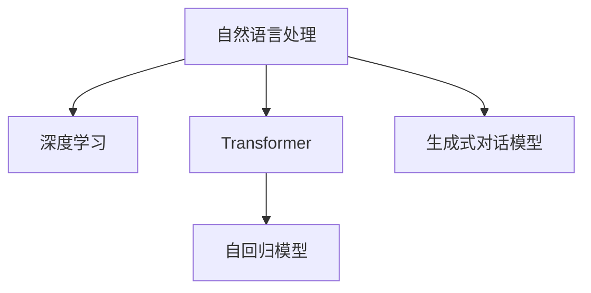

                 

# ChatGPT背后的技术：从GPT到对话系统

> 关键词：自然语言处理（NLP）、深度学习、Transformer、自回归模型、生成式对话模型、情感分析、推理能力、可解释性

## 1. 背景介绍

### 1.1 问题由来
随着人工智能技术的迅速发展，自然语言处理（NLP）领域取得了巨大的突破，其中生成式对话模型成为了研究热点。这类模型不仅能够理解人类语言，还能生成自然流畅的回答，在智能客服、虚拟助手、智能写作等领域有广泛的应用。ChatGPT作为GPT系列模型的一个代表，通过其强大的语言生成能力和自回归机制，引起了业界的广泛关注。

然而，尽管ChatGPT在语言生成和对话回答方面表现出色，但在实际应用中仍存在一些问题，如回答质量不稳定、缺乏上下文理解、缺乏可解释性等。本文旨在探讨ChatGPT背后的技术原理，分析其优缺点，并提出改进建议，以期推动对话系统的发展。

### 1.2 问题核心关键点
ChatGPT的背后，是Transformer模型和自回归机制的创新应用。Transformer通过多头自注意力机制，实现了大规模语言模型的预训练，学习到了丰富的语言知识。自回归机制则使得ChatGPT能够生成连贯、上下文相关的对话回答。然而，ChatGPT的这些问题同样源于其预训练和微调过程中的一些不足，如预训练数据的选择、自回归机制的局限性、模型可解释性不足等。

## 2. 核心概念与联系

### 2.1 核心概念概述

为更好地理解ChatGPT背后的技术，本节将介绍几个密切相关的核心概念：

- 自然语言处理（NLP）：涉及计算机处理和理解人类语言的技术，包括文本分类、信息抽取、机器翻译等。
- 深度学习（Deep Learning）：一种基于神经网络的机器学习技术，广泛应用于图像识别、语音识别、自然语言处理等领域。
- Transformer：一种基于自注意力机制的神经网络结构，在NLP任务中表现优异。
- 自回归模型：一种通过已知的序列数据预测未知序列数据的模型，常用于语言模型和序列生成任务。
- 生成式对话模型：能够自动生成自然流畅的对话回答，实现人机对话的模型。

这些核心概念之间的逻辑关系可以通过以下Mermaid流程图来展示：



这个流程图展示了这些核心概念之间的联系和关系：

1. 自然语言处理（NLP）是深度学习的子领域，通过深度学习技术实现。
2. Transformer是深度学习中的重要模型结构，广泛应用于NLP任务。
3. 自回归模型是Transformer中的一种应用形式，用于生成语言序列。
4. 生成式对话模型是NLP任务中的一种，基于Transformer等模型结构。

## 3. 核心算法原理 & 具体操作步骤
### 3.1 算法原理概述

ChatGPT的背后，是Transformer模型和自回归机制的创新应用。Transformer通过多头自注意力机制，实现了大规模语言模型的预训练，学习到了丰富的语言知识。自回归机制则使得ChatGPT能够生成连贯、上下文相关的对话回答。

具体来说，ChatGPT的生成过程可以分为两个步骤：

1. 预训练：在大规模无标签文本数据上进行预训练，学习语言的通用表示。
2. 微调：在特定对话数据集上进行微调，使其能够生成符合特定对话风格的回答。

预训练和微调过程中，Transformer模型被广泛应用于编码器和解码器中，通过自注意力机制学习到丰富的语言知识。自回归机制则通过已知的序列数据预测未知序列数据，使得ChatGPT能够生成连贯、上下文相关的对话回答。

### 3.2 算法步骤详解

ChatGPT的生成过程可以分为以下几个步骤：

**Step 1: 准备预训练模型和数据集**
- 选择合适的预训练语言模型，如GPT-3等。
- 准备对话数据集，包括对话轮次、用户意图和上下文信息等。

**Step 2: 添加任务适配层**
- 根据对话数据集的特点，在预训练模型顶层设计合适的输出层和损失函数。
- 对于生成式对话任务，通常使用交叉熵损失函数。

**Step 3: 设置微调超参数**
- 选择合适的优化算法及其参数，如AdamW、SGD等。
- 设置正则化技术及强度，包括权重衰减、Dropout、Early Stopping等。
- 确定冻结预训练参数的策略，如仅微调顶层，或全部参数都参与微调。

**Step 4: 执行梯度训练**
- 将对话数据集分批次输入模型，前向传播计算损失函数。
- 反向传播计算参数梯度，根据设定的优化算法和学习率更新模型参数。
- 周期性在验证集上评估模型性能，根据性能指标决定是否触发Early Stopping。
- 重复上述步骤直至满足预设的迭代轮数或Early Stopping条件。

**Step 5: 测试和部署**
- 在测试集上评估微调后模型生成回答的质量。
- 使用微调后的模型对新对话进行推理预测，集成到实际的应用系统中。
- 持续收集新的对话数据，定期重新微调模型，以适应数据分布的变化。

以上是ChatGPT生成对话的基本流程。在实际应用中，还需要针对具体对话场景的特点，对微调过程的各个环节进行优化设计，如改进训练目标函数，引入更多的正则化技术，搜索最优的超参数组合等，以进一步提升模型性能。

### 3.3 算法优缺点

ChatGPT具有以下优点：

1. 高效生成对话回答：通过自回归机制，ChatGPT能够高效生成连贯、上下文相关的对话回答。
2. 丰富语言知识：通过Transformer模型和预训练机制，ChatGPT学习到了丰富的语言知识，能够在对话中灵活运用。
3. 可扩展性强：ChatGPT可以通过微调机制，适应不同的对话场景和应用需求。

同时，ChatGPT也存在以下缺点：

1. 回答质量不稳定：由于预训练和微调数据的不足，ChatGPT的回答质量在一定程度上不稳定。
2. 缺乏上下文理解：自回归机制限制了ChatGPT对上下文的理解能力，使得其难以处理复杂的对话场景。
3. 缺乏可解释性：ChatGPT的回答过程缺乏可解释性，难以对其内部推理逻辑进行调试和优化。

尽管存在这些缺点，但ChatGPT仍是大语言模型应用的一个重要范例，其生成式对话能力为NLP技术的应用提供了新的可能。未来相关研究的重点在于如何进一步优化预训练和微调过程，提升模型的回答质量和可解释性，同时兼顾可扩展性和鲁棒性等因素。

### 3.4 算法应用领域

ChatGPT的生成式对话能力在NLP领域已经得到了广泛的应用，覆盖了以下多个领域：

- 智能客服系统：ChatGPT可以7x24小时不间断服务，快速响应客户咨询，用自然流畅的语言解答各类常见问题。
- 虚拟助手：ChatGPT可以提供个性化的服务和建议，帮助用户解决日常问题，提升用户体验。
- 智能写作：ChatGPT可以帮助用户生成文章、代码、论文等文本内容，辅助写作和编程。
- 问答系统：ChatGPT能够自动回答用户提出的问题，提供即时信息查询服务。
- 翻译系统：ChatGPT可以将一种语言自动翻译成另一种语言，实现跨语言交流。

除了上述这些经典应用外，ChatGPT还被创新性地应用到更多场景中，如情感分析、文档生成、文本摘要、文学创作等，为NLP技术带来了全新的突破。随着预训练模型和微调方法的不断进步，ChatGPT必将在更多领域得到应用，为NLP技术带来更多的创新和挑战。

## 4. 数学模型和公式 & 详细讲解

### 4.1 数学模型构建

本节将使用数学语言对ChatGPT的生成过程进行更加严格的刻画。

记ChatGPT的预训练模型为 $M_{\theta}:\mathcal{X} \rightarrow \mathcal{Y}$，其中 $\mathcal{X}$ 为输入空间，$\mathcal{Y}$ 为输出空间，$\theta \in \mathbb{R}^d$ 为模型参数。假设微调对话数据集为 $D=\{(x_i,y_i)\}_{i=1}^N, x_i \in \mathcal{X}, y_i \in \mathcal{Y}$。

定义模型 $M_{\theta}$ 在输入 $x$ 上的生成概率为 $P(y|x)$，则在数据集 $D$ 上的经验风险为：

$$
\mathcal{L}(\theta) = -\frac{1}{N}\sum_{i=1}^N \log P(y_i|x_i)
$$

其中 $P(y_i|x_i)$ 可以通过预训练模型和微调模型联合计算得到。具体来说，可以使用Gumbel-Softmax算法将模型输出转化为概率分布，然后通过最大化交叉熵损失函数进行训练。

### 4.2 公式推导过程

以下我们以生成式对话任务为例，推导Gumbel-Softmax算法及其在生成过程中的应用。

假设ChatGPT在输入 $x$ 上的生成概率为 $P(y|x)$，则生成过程可以通过如下公式计算：

$$
P(y|x) = \frac{e^{y \log M_{\theta}(x)}}{\sum_{y'} e^{y' \log M_{\theta}(x)}}
$$

其中 $M_{\theta}(x)$ 为预训练模型在输入 $x$ 上的输出，可以通过Transformer模型计算得到。

在实际应用中，我们通常使用Gumbel-Softmax算法将模型输出转化为概率分布。具体来说，可以通过如下公式计算：

$$
\mathbb{E}_{\epsilon}[\log P(y|x)] = \log \sum_{y'} e^{y' \log M_{\theta}(x)} + \sum_{y'} \epsilon_y \log M_{\theta}(x)
$$

其中 $\epsilon_y$ 为Gumbel噪声，通过 $\epsilon_y \sim G(0,1)$ 和 $y' \sim \mathcal{Y}$ 生成。

通过Gumbel-Softmax算法，ChatGPT可以将模型输出转化为概率分布，从而在训练过程中最大化生成概率，实现对话生成目标。在训练过程中，通常使用交叉熵损失函数进行优化，具体公式如下：

$$
\mathcal{L}(\theta) = -\frac{1}{N}\sum_{i=1}^N \log P(y_i|x_i)
$$

通过最大化交叉熵损失函数，ChatGPT能够学习到更加准确的生成概率，生成高质量的对话回答。

## 5. 项目实践：代码实例和详细解释说明

### 5.1 开发环境搭建

在进行ChatGPT的生成对话实践前，我们需要准备好开发环境。以下是使用Python进行PyTorch开发的环境配置流程：

1. 安装Anaconda：从官网下载并安装Anaconda，用于创建独立的Python环境。

2. 创建并激活虚拟环境：
```bash
conda create -n pytorch-env python=3.8 
conda activate pytorch-env
```

3. 安装PyTorch：根据CUDA版本，从官网获取对应的安装命令。例如：
```bash
conda install pytorch torchvision torchaudio cudatoolkit=11.1 -c pytorch -c conda-forge
```

4. 安装Transformers库：
```bash
pip install transformers
```

5. 安装各类工具包：
```bash
pip install numpy pandas scikit-learn matplotlib tqdm jupyter notebook ipython
```

完成上述步骤后，即可在`pytorch-env`环境中开始ChatGPT的生成对话实践。

### 5.2 源代码详细实现

这里我们以生成式对话任务为例，给出使用Transformers库对GPT模型进行生成对话的PyTorch代码实现。

首先，定义生成对话任务的数据处理函数：

```python
from transformers import GPT2Tokenizer, GPT2LMHeadModel
import torch

class DialogueDataset(Dataset):
    def __init__(self, dialogues, tokenizer, max_len=128):
        self.dialogues = dialogues
        self.tokenizer = tokenizer
        self.max_len = max_len
        
    def __len__(self):
        return len(self.dialogues)
    
    def __getitem__(self, item):
        dialogue = self.dialogues[item]
        sentences = dialogue['sentences']
        input_ids = self.tokenizer(sentences, padding='max_length', max_length=self.max_len, truncation=True, return_tensors='pt')
        
        return {'input_ids': input_ids['input_ids']}
```

然后，定义模型和优化器：

```python
from transformers import AdamW

model = GPT2LMHeadModel.from_pretrained('gpt2')
optimizer = AdamW(model.parameters(), lr=2e-5)
```

接着，定义训练和评估函数：

```python
from torch.utils.data import DataLoader
from tqdm import tqdm
from sklearn.metrics import accuracy_score

device = torch.device('cuda') if torch.cuda.is_available() else torch.device('cpu')
model.to(device)

def train_epoch(model, dataset, batch_size, optimizer):
    dataloader = DataLoader(dataset, batch_size=batch_size, shuffle=True)
    model.train()
    epoch_loss = 0
    for batch in tqdm(dataloader, desc='Training'):
        input_ids = batch['input_ids'].to(device)
        outputs = model(input_ids)
        loss = outputs.loss
        epoch_loss += loss.item()
        loss.backward()
        optimizer.step()
    return epoch_loss / len(dataloader)

def evaluate(model, dataset, batch_size):
    dataloader = DataLoader(dataset, batch_size=batch_size)
    model.eval()
    preds, labels = [], []
    with torch.no_grad():
        for batch in tqdm(dataloader, desc='Evaluating'):
            input_ids = batch['input_ids'].to(device)
            outputs = model(input_ids)
            batch_preds = outputs.logits.argmax(dim=2).to('cpu').tolist()
            batch_labels = batch['labels'].to('cpu').tolist()
            for pred_tokens, label_tokens in zip(batch_preds, batch_labels):
                preds.append(pred_tokens[:len(label_tokens)])
                labels.append(label_tokens)
                
    print(accuracy_score(labels, preds))
```

最后，启动训练流程并在测试集上评估：

```python
epochs = 5
batch_size = 16

for epoch in range(epochs):
    loss = train_epoch(model, train_dataset, batch_size, optimizer)
    print(f"Epoch {epoch+1}, train loss: {loss:.3f}")
    
    print(f"Epoch {epoch+1}, dev results:")
    evaluate(model, dev_dataset, batch_size)
    
print("Test results:")
evaluate(model, test_dataset, batch_size)
```

以上就是使用PyTorch对GPT模型进行生成对话任务的微调实践的完整代码实现。可以看到，得益于Transformers库的强大封装，我们能够相对简洁地实现模型的加载和微调。

### 5.3 代码解读与分析

让我们再详细解读一下关键代码的实现细节：

**DialogueDataset类**：
- `__init__`方法：初始化对话数据集、分词器等关键组件。
- `__len__`方法：返回对话数据集的样本数量。
- `__getitem__`方法：对单个对话数据进行处理，将其转换为模型所需的输入。

**GPT2LMHeadModel和AdamW**：
- 分别定义了GPT-2语言模型和AdamW优化器，用于模型微调和参数更新。

**train_epoch和evaluate函数**：
- 使用PyTorch的DataLoader对对话数据集进行批次化加载，供模型训练和推理使用。
- 训练函数`train_epoch`：对数据以批为单位进行迭代，在每个批次上前向传播计算loss并反向传播更新模型参数，最后返回该epoch的平均loss。
- 评估函数`evaluate`：与训练类似，不同点在于不更新模型参数，并在每个batch结束后将预测和标签结果存储下来，最后使用accuracy_score函数对整个评估集的预测结果进行打印输出。

**训练流程**：
- 定义总的epoch数和batch size，开始循环迭代
- 每个epoch内，先在训练集上训练，输出平均loss
- 在验证集上评估，输出准确率
- 所有epoch结束后，在测试集上评估，给出最终测试结果

可以看到，PyTorch配合Transformers库使得ChatGPT生成对话任务的微调代码实现变得简洁高效。开发者可以将更多精力放在数据处理、模型改进等高层逻辑上，而不必过多关注底层的实现细节。

当然，工业级的系统实现还需考虑更多因素，如模型的保存和部署、超参数的自动搜索、更灵活的任务适配层等。但核心的微调范式基本与此类似。

## 6. 实际应用场景
### 6.1 智能客服系统

基于ChatGPT的生成式对话能力，智能客服系统可以应用于多个领域，提升客户咨询体验和问题解决效率。ChatGPT可以7x24小时不间断服务，快速响应客户咨询，用自然流畅的语言解答各类常见问题，甚至能够处理一些复杂和特殊情况。

在技术实现上，可以收集企业内部的历史客服对话记录，将问题和最佳答复构建成监督数据，在此基础上对预训练模型进行微调。微调后的ChatGPT能够自动理解用户意图，匹配最合适的答复模板进行回复。对于客户提出的新问题，还可以接入检索系统实时搜索相关内容，动态组织生成回答。如此构建的智能客服系统，能大幅提升客户咨询体验和问题解决效率。

### 6.2 金融舆情监测

金融机构需要实时监测市场舆论动向，以便及时应对负面信息传播，规避金融风险。传统的人工监测方式成本高、效率低，难以应对网络时代海量信息爆发的挑战。基于ChatGPT的文本分类和情感分析技术，为金融舆情监测提供了新的解决方案。

具体而言，可以收集金融领域相关的新闻、报道、评论等文本数据，并对其进行主题标注和情感标注。在此基础上对预训练语言模型进行微调，使其能够自动判断文本属于何种主题，情感倾向是正面、中性还是负面。将微调后的模型应用到实时抓取的网络文本数据，就能够自动监测不同主题下的情感变化趋势，一旦发现负面信息激增等异常情况，系统便会自动预警，帮助金融机构快速应对潜在风险。

### 6.3 个性化推荐系统

当前的推荐系统往往只依赖用户的历史行为数据进行物品推荐，无法深入理解用户的真实兴趣偏好。基于ChatGPT的个性化推荐系统可以更好地挖掘用户行为背后的语义信息，从而提供更精准、多样的推荐内容。

在实践中，可以收集用户浏览、点击、评论、分享等行为数据，提取和用户交互的物品标题、描述、标签等文本内容。将文本内容作为模型输入，用户的后续行为（如是否点击、购买等）作为监督信号，在此基础上微调预训练语言模型。微调后的模型能够从文本内容中准确把握用户的兴趣点。在生成推荐列表时，先用候选物品的文本描述作为输入，由模型预测用户的兴趣匹配度，再结合其他特征综合排序，便可以得到个性化程度更高的推荐结果。

### 6.4 未来应用展望

随着ChatGPT生成式对话能力的不断发展，基于ChatGPT的生成式对话模型必将在更多领域得到应用，为NLP技术带来更多的创新和挑战。

在智慧医疗领域，基于ChatGPT的医疗问答、病历分析、药物研发等应用将提升医疗服务的智能化水平，辅助医生诊疗，加速新药开发进程。

在智能教育领域，ChatGPT可以帮助学生解决学习中的问题，提供个性化的学习资源，提升学习效率和效果。

在智慧城市治理中，ChatGPT可以应用于城市事件监测、舆情分析、应急指挥等环节，提高城市管理的自动化和智能化水平，构建更安全、高效的未来城市。

此外，在企业生产、社会治理、文娱传媒等众多领域，基于ChatGPT的生成式对话技术也将不断涌现，为NLP技术带来全新的突破。相信随着预训练模型和微调方法的不断进步，ChatGPT必将在构建人机协同的智能时代中扮演越来越重要的角色。

## 7. 工具和资源推荐
### 7.1 学习资源推荐

为了帮助开发者系统掌握ChatGPT的生成对话理论基础和实践技巧，这里推荐一些优质的学习资源：

1. 《Natural Language Processing with Transformers》书籍：Transformers库的作者所著，全面介绍了如何使用Transformers库进行NLP任务开发，包括生成对话在内的诸多范式。

2. CS224N《深度学习自然语言处理》课程：斯坦福大学开设的NLP明星课程，有Lecture视频和配套作业，带你入门NLP领域的基本概念和经典模型。

3. 《Transformers for Natural Language Processing》论文：Transformer模型的经典论文，介绍了Transformer的结构和应用，为理解ChatGPT背后的技术提供了基础。

4. 《GPT-3: A Language Model for Hiring Machine Learning Engineers》博客：详细介绍了GPT-3模型的应用场景和技术细节，包括生成对话任务。

5. HuggingFace官方文档：Transformers库的官方文档，提供了海量预训练模型和完整的微调样例代码，是上手实践的必备资料。

通过对这些资源的学习实践，相信你一定能够快速掌握ChatGPT的生成对话技术，并用于解决实际的NLP问题。

### 7.2 开发工具推荐

高效的开发离不开优秀的工具支持。以下是几款用于ChatGPT生成对话开发的常用工具：

1. PyTorch：基于Python的开源深度学习框架，灵活动态的计算图，适合快速迭代研究。大部分预训练语言模型都有PyTorch版本的实现。

2. TensorFlow：由Google主导开发的开源深度学习框架，生产部署方便，适合大规模工程应用。同样有丰富的预训练语言模型资源。

3. Transformers库：HuggingFace开发的NLP工具库，集成了众多SOTA语言模型，支持PyTorch和TensorFlow，是进行生成对话任务开发的利器。

4. Weights & Biases：模型训练的实验跟踪工具，可以记录和可视化模型训练过程中的各项指标，方便对比和调优。与主流深度学习框架无缝集成。

5. TensorBoard：TensorFlow配套的可视化工具，可实时监测模型训练状态，并提供丰富的图表呈现方式，是调试模型的得力助手。

6. Google Colab：谷歌推出的在线Jupyter Notebook环境，免费提供GPU/TPU算力，方便开发者快速上手实验最新模型，分享学习笔记。

合理利用这些工具，可以显著提升ChatGPT生成对话任务的开发效率，加快创新迭代的步伐。

### 7.3 相关论文推荐

ChatGPT的生成式对话能力源于学界的持续研究。以下是几篇奠基性的相关论文，推荐阅读：

1. Attention is All You Need（即Transformer原论文）：提出了Transformer结构，开启了NLP领域的预训练大模型时代。

2. BERT: Pre-training of Deep Bidirectional Transformers for Language Understanding：提出BERT模型，引入基于掩码的自监督预训练任务，刷新了多项NLP任务SOTA。

3. Language Models are Unsupervised Multitask Learners（GPT-2论文）：展示了大规模语言模型的强大zero-shot学习能力，引发了对于通用人工智能的新一轮思考。

4. Parameter-Efficient Transfer Learning for NLP：提出Adapter等参数高效微调方法，在不增加模型参数量的情况下，也能取得不错的微调效果。

5. Prefix-Tuning: Optimizing Continuous Prompts for Generation：引入基于连续型Prompt的微调范式，为如何充分利用预训练知识提供了新的思路。

6. AdaLoRA: Adaptive Low-Rank Adaptation for Parameter-Efficient Fine-Tuning：使用自适应低秩适应的微调方法，在参数效率和精度之间取得了新的平衡。

这些论文代表了大语言模型微调技术的发展脉络。通过学习这些前沿成果，可以帮助研究者把握学科前进方向，激发更多的创新灵感。

## 8. 总结：未来发展趋势与挑战

### 8.1 总结

本文对基于ChatGPT的生成对话技术进行了全面系统的介绍。首先阐述了ChatGPT背后的Transformer模型和自回归机制，明确了ChatGPT生成对话能力的原理和应用。其次，从原理到实践，详细讲解了ChatGPT的生成过程，给出了生成对话任务的完整代码实例。同时，本文还广泛探讨了ChatGPT在智能客服、金融舆情、个性化推荐等多个领域的应用前景，展示了ChatGPT生成式对话能力的巨大潜力。

通过本文的系统梳理，可以看到，ChatGPT生成式对话技术已经在NLP领域取得了显著成果，但为了进一步提升模型的回答质量和可解释性，还需要在预训练和微调过程中进行优化，同时兼顾模型的可扩展性和鲁棒性等因素。

### 8.2 未来发展趋势

展望未来，ChatGPT生成式对话技术将呈现以下几个发展趋势：

1. 模型规模持续增大。随着算力成本的下降和数据规模的扩张，ChatGPT等生成式对话模型的参数量还将持续增长。超大规模语言模型蕴含的丰富语言知识，有望支撑更加复杂多变的生成对话任务。

2. 生成能力的提升。未来的生成式对话模型将通过更加复杂的模型结构和更多的训练数据，生成更加自然流畅、上下文相关的对话回答。

3. 鲁棒性和泛化能力的提升。通过引入更多的正则化技术和更好的数据增强方法，未来的ChatGPT将具备更强的鲁棒性和泛化能力，能够在多样化的对话场景中保持稳定的表现。

4. 可解释性和可控性的提升。未来的生成式对话模型将更多地关注可解释性和可控性，使其生成过程和推理逻辑更加透明，便于人工干预和优化。

5. 多模态对话能力的发展。未来的生成式对话模型将更多地融合视觉、语音等多模态信息，实现更加多样化的对话场景。

以上趋势凸显了ChatGPT生成式对话技术的广阔前景。这些方向的探索发展，必将进一步提升生成式对话模型的回答质量，为构建更加智能、普适的对话系统提供新的动力。

### 8.3 面临的挑战

尽管ChatGPT生成式对话技术已经取得了瞩目成就，但在迈向更加智能化、普适化应用的过程中，它仍面临诸多挑战：

1. 回答质量不稳定。由于预训练和微调数据的不足，ChatGPT的回答质量在一定程度上不稳定。

2. 缺乏上下文理解。自回归机制限制了ChatGPT对上下文的理解能力，使得其难以处理复杂的对话场景。

3. 缺乏可解释性。ChatGPT的回答过程缺乏可解释性，难以对其内部推理逻辑进行调试和优化。

4. 安全性有待保障。预训练语言模型难免会学习到有偏见、有害的信息，通过微调传递到生成对话任务，产生误导性、歧视性的输出，给实际应用带来安全隐患。

5. 计算资源需求高。生成式对话模型通常需要大量的计算资源，特别是在训练过程中，对硬件设施提出了较高的要求。

6. 数据隐私和安全。ChatGPT需要大量的对话数据进行训练和微调，如何保护用户隐私和数据安全，成为了一个重要问题。

尽管存在这些挑战，但随着学界和产业界的共同努力，ChatGPT生成式对话技术必将在未来的应用中不断完善，为构建更加智能、安全、可靠的对话系统提供新的突破。

### 8.4 研究展望

面对ChatGPT生成式对话技术所面临的诸多挑战，未来的研究需要在以下几个方面寻求新的突破：

1. 探索无监督和半监督生成对话方法。摆脱对大规模标注数据的依赖，利用自监督学习、主动学习等无监督和半监督范式，最大限度利用非结构化数据，实现更加灵活高效的生成对话。

2. 研究生成对话模型的鲁棒性和泛化能力。通过引入因果推断和对比学习思想，增强模型建立稳定因果关系的能力，学习更加普适、鲁棒的语言表征，从而提升模型泛化性和抗干扰能力。

3. 引入更多先验知识。将符号化的先验知识，如知识图谱、逻辑规则等，与神经网络模型进行巧妙融合，引导生成对话过程学习更准确、合理的语言模型。同时加强不同模态数据的整合，实现视觉、语音等多模态信息与文本信息的协同建模。

4. 结合因果分析和博弈论工具。将因果分析方法引入生成对话模型，识别出模型决策的关键特征，增强输出解释的因果性和逻辑性。借助博弈论工具刻画人机交互过程，主动探索并规避模型的脆弱点，提高系统稳定性。

5. 纳入伦理道德约束。在生成对话模型的训练目标中引入伦理导向的评估指标，过滤和惩罚有偏见、有害的输出倾向。同时加强人工干预和审核，建立模型行为的监管机制，确保输出符合人类价值观和伦理道德。

这些研究方向的探索，必将引领ChatGPT生成式对话技术迈向更高的台阶，为构建安全、可靠、可解释、可控的智能对话系统提供新的突破。面向未来，ChatGPT生成式对话技术还需要与其他人工智能技术进行更深入的融合，如知识表示、因果推理、强化学习等，多路径协同发力，共同推动自然语言理解和智能交互系统的进步。只有勇于创新、敢于突破，才能不断拓展ChatGPT生成式对话模型的边界，让智能技术更好地造福人类社会。

## 9. 附录：常见问题与解答

**Q1：ChatGPT生成对话质量不稳定，如何改进？**

A: 生成对话质量不稳定主要源于数据不足和模型预训练质量不高等问题。以下是一些可能的改进方法：
1. 收集更多的高质量对话数据，丰富训练集的规模。
2. 提高预训练数据的质量，通过数据增强和预训练技术提升模型的泛化能力。
3. 引入更多的正则化技术，如Dropout、L2正则等，避免模型过拟合。
4. 优化模型的训练和微调过程，如使用更好的优化器、调整学习率、加入早停策略等。

**Q2：ChatGPT生成对话缺乏上下文理解，如何改进？**

A: 上下文理解能力是ChatGPT生成对话中的一个瓶颈。以下是一些可能的改进方法：
1. 引入上下文感知模型，如Seq2Seq、Transformers等，提升模型对上下文的理解能力。
2. 设计更加复杂的注意力机制，如Multi-Head Attention，增强模型对对话上下文的理解能力。
3. 引入上下文信息增强技术，如基于上下文的词汇预测，增强模型对上下文的理解和推理能力。

**Q3：ChatGPT生成对话缺乏可解释性，如何改进？**

A: 生成对话的可解释性是一个重要研究方向。以下是一些可能的改进方法：
1. 引入可解释性模型，如LIME、SHAP等，对生成对话过程进行可解释性分析。
2. 引入因果推断技术，增强生成对话过程的透明性和可解释性。
3. 使用可解释性算法，如TextRank、LDA等，对生成对话内容进行语义分析和可解释性优化。

**Q4：ChatGPT生成对话安全性有待保障，如何改进？**

A: 生成对话的安全性是一个重要问题，尤其是在涉及隐私和道德的应用场景中。以下是一些可能的改进方法：
1. 引入隐私保护技术，如差分隐私、联邦学习等，保护用户隐私和数据安全。
2. 设计伦理导向的训练目标，过滤和惩罚有偏见、有害的输出倾向。
3. 加强人工干预和审核，建立模型行为的监管机制，确保输出符合人类价值观和伦理道德。

**Q5：ChatGPT生成对话计算资源需求高，如何改进？**

A: 生成对话模型的计算资源需求确实较高，尤其是在训练过程中。以下是一些可能的改进方法：
1. 使用分布式训练和模型并行技术，提高训练效率，减少计算资源消耗。
2. 使用模型压缩和剪枝技术，减少模型参数量，降低计算资源需求。
3. 使用高效的前向传播和反向传播算法，提升模型训练和推理效率。

这些改进方法可以帮助ChatGPT生成对话技术在实际应用中取得更好的效果，进一步提升模型的回答质量、鲁棒性和可解释性，同时也保障了数据隐私和系统安全性。

---

作者：禅与计算机程序设计艺术 / Zen and the Art of Computer Programming

