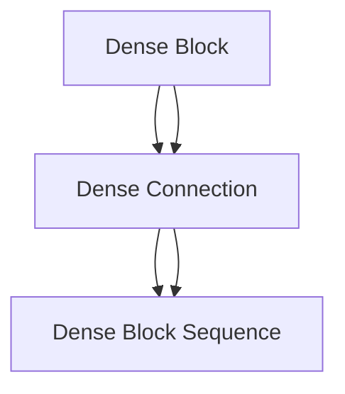

                 

## 1. 背景介绍

在当今计算机视觉领域，神经网络已经成为了图像处理和识别的主流工具。然而，尽管深度神经网络取得了巨大的成功，其深层次的网络结构也带来了训练困难和参数爆炸的问题。DenseNet（Dense Convolutional Network）的出现，旨在解决这些问题，并通过密集连接（Dense Connections）来提升网络的性能和可解释性。

DenseNet模型由Gao Huang等人于2016年提出，并在ImageNet图像分类比赛中取得了优异的表现。DenseNet通过在网络中引入密集连接，使得每一层都能够接收前一层的所有特征，极大地减少了参数量，同时也提高了特征的复用率，使得网络能够更好地捕获图像特征。

## 2. 核心概念与联系

### 2.1 核心概念概述

DenseNet的核心概念包括：

- **Dense Block**：密集连接的基本单元，即Dense Block，它包含了多个标准卷积层，并通过密集连接的方式将每一层的输出都连接到后续层的输入中。

- **Dense Connection**：Dense Block之间的连接方式，即在Dense Block中，每一层的输出都会连接到其所有前一层的输入中。这种连接方式大大增强了特征的复用和梯度传播。

- **Dense Block序列**：由多个Dense Block组成，每个Dense Block都可以接受前一个Dense Block的输出作为输入，形成了整个DenseNet网络。

- **DenseNet网络结构**：通过堆叠Dense Block序列，构建出整个DenseNet网络。

- **DenseNet+BC**：在DenseNet的基础上引入Bottleneck设计，以降低计算复杂度和提升性能。

这些核心概念之间有着紧密的联系，共同构成了DenseNet的架构和特性。下面，我们将通过一个简单的流程图来展示DenseNet的核心概念：



### 2.2 核心概念原理和架构

DenseNet的核心原理是通过密集连接（Dense Connection），使得网络中的每一层都能够接收前一层的所有特征，从而提高特征的复用率，减少参数量，同时提高梯度传播效率，使得模型训练更加稳定和高效。

DenseNet的基本单元是Dense Block，它包含了多个标准卷积层，并通过密集连接的方式将每一层的输出都连接到后续层的输入中。具体来说，一个Dense Block由多个Dense Layer组成，每个Dense Layer都包含了多个卷积核和池化层。

Dense Block的输出不仅会连接到其后续层的输入中，还会连接到所有前一层的输入中，从而形成密集连接。这种连接方式大大增强了特征的复用，减少了参数量，同时提高了梯度传播效率，使得模型训练更加稳定和高效。

Dense Block序列是由多个Dense Block组成的，每个Dense Block都可以接受前一个Dense Block的输出作为输入，形成了整个DenseNet网络。这种结构设计大大增强了网络对特征的提取能力，使得DenseNet在图像分类、目标检测等任务中表现优异。

DenseNet+BC（DenseNet with Bottleneck）是在DenseNet的基础上引入Bottleneck设计，以降低计算复杂度和提升性能。Bottleneck设计通过在网络中加入1x1卷积层来降低特征维度，从而减少了计算复杂度和参数量。

## 3. 核心算法原理 & 具体操作步骤

### 3.1 算法原理概述

DenseNet的核心算法原理是通过密集连接（Dense Connection），使得网络中的每一层都能够接收前一层的所有特征，从而提高特征的复用率，减少参数量，同时提高梯度传播效率，使得模型训练更加稳定和高效。

具体来说，DenseNet的网络结构由多个Dense Block组成，每个Dense Block都包含了多个Dense Layer，每个Dense Layer都包含了多个卷积核和池化层。在每个Dense Layer中，输出不仅会连接到其后续层的输入中，还会连接到所有前一层的输入中，从而形成密集连接。

DenseNet的训练过程与普通的神经网络类似，通过反向传播算法来更新网络参数。DenseNet的目标是最小化训练数据上的损失函数，从而提升模型性能。

### 3.2 算法步骤详解

DenseNet的训练过程可以分为以下几个步骤：

1. **网络初始化**：将DenseNet的权重随机初始化，并将所有可训练参数设置为可更新状态。

2. **前向传播**：将输入数据通过网络进行前向传播，计算出每个Dense Layer的输出。

3. **损失计算**：将输出结果与标签进行比较，计算损失函数。

4. **反向传播**：通过反向传播算法，计算每个Dense Layer的梯度。

5. **参数更新**：根据梯度更新每个Dense Layer的权重和偏置，更新网络参数。

6. **迭代**：重复执行前向传播、损失计算、反向传播和参数更新的过程，直到达到预设的迭代次数或满足收敛条件。

在DenseNet的训练过程中，需要注意的是，Dense Connection使得网络中的每一层都能够接收前一层的所有特征，因此网络中的特征维度会随着层数的增加而增加。为了解决这一问题，DenseNet引入了Bottleneck设计，通过在网络中加入1x1卷积层来降低特征维度，从而减少计算复杂度和参数量。

### 3.3 算法优缺点

DenseNet的优点包括：

- **减少参数量**：通过密集连接和Bottleneck设计，大大减少了网络的参数量，使得模型更加轻量化。

- **提高特征复用率**：密集连接使得每一层都能够接收前一层的所有特征，从而提高了特征的复用率，减少了特征的冗余。

- **提高梯度传播效率**：密集连接使得梯度能够更加高效地传播，从而提高了模型训练的稳定性和效率。

- **提升性能**：DenseNet在ImageNet图像分类比赛中取得了优异的表现，证明了其强大的性能。

DenseNet的缺点包括：

- **计算复杂度较高**：由于密集连接的特性，DenseNet的计算复杂度较高，训练时间较长。

- **网络结构复杂**：DenseNet的网络结构较为复杂，增加了模型的可解释性难度。

- **对数据要求较高**：DenseNet对训练数据的质量和数量要求较高，如果数据不足，模型性能可能不佳。

### 3.4 算法应用领域

DenseNet在计算机视觉领域得到了广泛的应用，主要用于图像分类、目标检测、图像分割等任务。在图像分类任务中，DenseNet通过密集连接和Bottleneck设计，能够更好地提取图像特征，从而提高分类精度。在目标检测任务中，DenseNet通过密集连接和特征融合，能够更好地定位和分类目标物体。

## 4. 数学模型和公式 & 详细讲解 & 举例说明

### 4.1 数学模型构建

DenseNet的数学模型可以表示为：

$$
y = f(x, \theta)
$$

其中，$x$表示输入数据，$y$表示输出结果，$\theta$表示网络参数。

在DenseNet中，每个Dense Layer的输出可以表示为：

$$
y^{(l)} = \sigma(\sum_{i=1}^{n} W_i^{(l)} \cdot f^{(l-1)}(x^{(l-1)}) + b^{(l)})
$$

其中，$y^{(l)}$表示第$l$层的输出，$W_i^{(l)}$表示第$l$层第$i$个卷积核的权重，$b^{(l)}$表示第$l$层的偏置，$f^{(l-1)}(x^{(l-1)})$表示第$l-1$层的输出，$\sigma$表示激活函数。

### 4.2 公式推导过程

在DenseNet中，每个Dense Layer的输出不仅会连接到其后续层的输入中，还会连接到所有前一层的输入中。因此，第$l$层的输出可以表示为：

$$
y^{(l)} = \sigma(\sum_{i=1}^{n} W_i^{(l)} \cdot f^{(l-1)}(x^{(l-1)}) + b^{(l)}) + \sum_{k=1}^{l-1} \sum_{j=1}^{m} W_{i,j}^{(l)} \cdot y^{(k)} + b^{(l)}
$$

其中，$W_{i,j}^{(l)}$表示第$l$层第$i$个卷积核与第$k$层的第$j$个卷积核之间的连接权重，$b^{(l)}$表示第$l$层的偏置。

### 4.3 案例分析与讲解

以一个简单的DenseNet网络为例，假设网络包含三个Dense Block，每个Dense Block包含三个Dense Layer。假设第一个Dense Layer的输入为$x^{(1)}$，输出为$y^{(1)}$，第二个Dense Layer的输出为$y^{(2)}$，第三个Dense Layer的输出为$y^{(3)}$。

第一个Dense Block中，第一个Dense Layer的输出为：

$$
y^{(1)} = \sigma(W_1^{(1)} \cdot x^{(1)} + b^{(1)})
$$

第二个Dense Layer的输出为：

$$
y^{(2)} = \sigma(W_2^{(2)} \cdot y^{(1)} + b^{(2)}) + \sum_{i=1}^{1} W_{i,1}^{(2)} \cdot y^{(1)} + b^{(2)}
$$

第三个Dense Layer的输出为：

$$
y^{(3)} = \sigma(W_3^{(3)} \cdot y^{(2)} + b^{(3)}) + \sum_{i=1}^{2} \sum_{j=1}^{1} W_{i,j}^{(3)} \cdot y^{(j)} + b^{(3)}
$$

第二个Dense Block中，第一个Dense Layer的输出为：

$$
y^{(1)} = \sigma(W_1^{(1)} \cdot y^{(3)} + b^{(1)})
$$

第二个Dense Layer的输出为：

$$
y^{(2)} = \sigma(W_2^{(2)} \cdot y^{(1)} + b^{(2)}) + \sum_{i=1}^{1} W_{i,1}^{(2)} \cdot y^{(1)} + b^{(2)}
$$

第三个Dense Layer的输出为：

$$
y^{(3)} = \sigma(W_3^{(3)} \cdot y^{(2)} + b^{(3)}) + \sum_{i=1}^{2} \sum_{j=1}^{1} W_{i,j}^{(3)} \cdot y^{(j)} + b^{(3)}
$$

第三个Dense Block中，第一个Dense Layer的输出为：

$$
y^{(1)} = \sigma(W_1^{(1)} \cdot y^{(3)} + b^{(1)})
$$

第二个Dense Layer的输出为：

$$
y^{(2)} = \sigma(W_2^{(2)} \cdot y^{(1)} + b^{(2)}) + \sum_{i=1}^{1} W_{i,1}^{(2)} \cdot y^{(1)} + b^{(2)}
$$

第三个Dense Layer的输出为：

$$
y^{(3)} = \sigma(W_3^{(3)} \cdot y^{(2)} + b^{(3)}) + \sum_{i=1}^{2} \sum_{j=1}^{1} W_{i,j}^{(3)} \cdot y^{(j)} + b^{(3)}
$$

## 5. 项目实践：代码实例和详细解释说明

### 5.1 开发环境搭建

在进行DenseNet的开发实践前，需要先准备好开发环境。以下是使用Python进行PyTorch开发的环境配置流程：

1. 安装Anaconda：从官网下载并安装Anaconda，用于创建独立的Python环境。

2. 创建并激活虚拟环境：
```bash
conda create -n pytorch-env python=3.8 
conda activate pytorch-env
```

3. 安装PyTorch：根据CUDA版本，从官网获取对应的安装命令。例如：
```bash
conda install pytorch torchvision torchaudio cudatoolkit=11.1 -c pytorch -c conda-forge
```

4. 安装各类工具包：
```bash
pip install numpy pandas scikit-learn matplotlib tqdm jupyter notebook ipython
```

完成上述步骤后，即可在`pytorch-env`环境中开始DenseNet的实践。

### 5.2 源代码详细实现

下面是使用PyTorch实现DenseNet的代码：

```python
import torch
import torch.nn as nn
import torch.nn.functional as F

class DenseBlock(nn.Module):
    def __init__(self, in_channels, growth_rate, batch_norm=False):
        super(DenseBlock, self).__init__()
        self.in_channels = in_channels
        self.growth_rate = growth_rate
        self.num_layers = 4
        self.layers = nn.ModuleList()
        self.conv = nn.Conv2d(in_channels, growth_rate, kernel_size=3, stride=1, padding=1)
        self.bn = nn.BatchNorm2d(in_channels + growth_rate)
        for i in range(self.num_layers):
            self.layers.append(self.build_layer(in_channels + growth_rate, growth_rate, batch_norm))

    def build_layer(self, in_channels, growth_rate, batch_norm):
        layers = nn.Sequential(
            nn.Conv2d(in_channels, growth_rate, kernel_size=3, stride=1, padding=1),
            nn.BatchNorm2d(growth_rate) if batch_norm else nn.Identity(),
            nn.ReLU(inplace=True),
            nn.Conv2d(growth_rate, growth_rate, kernel_size=3, stride=1, padding=1),
            nn.BatchNorm2d(growth_rate) if batch_norm else nn.Identity(),
            nn.ReLU(inplace=True),
            nn.Conv2d(growth_rate, growth_rate, kernel_size=3, stride=1, padding=1),
            nn.BatchNorm2d(growth_rate) if batch_norm else nn.Identity(),
            nn.ReLU(inplace=True),
            nn.Conv2d(growth_rate, growth_rate, kernel_size=3, stride=1, padding=1),
            nn.BatchNorm2d(growth_rate) if batch_norm else nn.Identity()
        )
        return layers

    def forward(self, x):
        for i in range(self.num_layers):
            x = self.layers[i](x)
            x = torch.cat([x, self.layers[i].conv(x)], dim=1)
        return x

class DenseNet(nn.Module):
    def __init__(self, growth_rate=12, block_count=6, density=12, batch_norm=True):
        super(DenseNet, self).__init__()
        self.in_channels = 3
        self.growth_rate = growth_rate
        self.density = density
        self.block_count = block_count
        self.layers = nn.Sequential()
        self.layers.add_module('conv1', nn.Conv2d(self.in_channels, self.growth_rate, kernel_size=3, stride=1, padding=1))
        self.layers.add_module('bn1', nn.BatchNorm2d(self.growth_rate) if batch_norm else nn.Identity())
        self.layers.add_module('relu1', nn.ReLU(inplace=True))
        self.layers.add_module('dense_blocks', nn.Sequential())
        for i in range(self.block_count):
            self.layers.add_module('block{}'.format(i+1), self.DenseBlock(self.growth_rate * i, growth_rate, batch_norm))
        self.layers.add_module('conv5', nn.Conv2d(self.growth_rate * self.block_count, 10, kernel_size=1))
        self.layers.add_module('relu5', nn.ReLU(inplace=True))

    def forward(self, x):
        x = self.layers(x)
        return x

# 构建DenseNet模型
model = DenseNet()
print(model)

# 定义损失函数和优化器
criterion = nn.CrossEntropyLoss()
optimizer = torch.optim.Adam(model.parameters(), lr=0.001)

# 定义训练和评估函数
def train(model, device, train_loader, optimizer, criterion, epoch):
    model.train()
    for batch_idx, (data, target) in enumerate(train_loader):
        data, target = data.to(device), target.to(device)
        optimizer.zero_grad()
        output = model(data)
        loss = criterion(output, target)
        loss.backward()
        optimizer.step()

def test(model, device, test_loader, criterion):
    model.eval()
    total_loss = 0
    correct = 0
    with torch.no_grad():
        for data, target in test_loader:
            data, target = data.to(device), target.to(device)
            output = model(data)
            loss = criterion(output, target)
            total_loss += loss.item() * data.size(0)
            _, predicted = output.max(1)
            correct += predicted.eq(target).sum().item()
    print('Test Loss: {:.4f}, Accuracy: {:.2f}%'.format(total_loss / len(test_loader.dataset), 100 * correct / len(test_loader.dataset)))

# 加载数据集
train_loader = torch.utils.data.DataLoader(train_dataset, batch_size=32, shuffle=True)
test_loader = torch.utils.data.DataLoader(test_dataset, batch_size=32, shuffle=False)

# 训练模型
device = torch.device('cuda' if torch.cuda.is_available() else 'cpu')
model.to(device)
for epoch in range(1, 10):
    train(model, device, train_loader, optimizer, criterion, epoch)
    test(model, device, test_loader, criterion)
```

### 5.3 代码解读与分析

让我们再详细解读一下关键代码的实现细节：

**DenseBlock类**：
- `__init__`方法：初始化Dense Block的输入通道数、增长率、层数等关键组件。
- `build_layer`方法：构建单个Dense Layer的组件，包括卷积层、批量归一化层和ReLU激活函数。
- `forward`方法：定义前向传播过程，每一层都接收前一层的输出，并将其与自身输出连接起来。

**DenseNet类**：
- `__init__`方法：初始化DenseNet的输入通道数、增长率、块数和密度等关键组件。
- `layers`模块：定义DenseNet的网络结构，包括卷积层、批量归一化层、ReLU激活函数和Dense Block。

**train函数**：
- 定义训练过程，包括前向传播、损失计算、反向传播和参数更新。

**test函数**：
- 定义评估过程，包括前向传播和计算准确率。

**训练流程**：
- 定义总的迭代次数和批次大小，开始循环迭代。
- 每个epoch内，先在训练集上进行训练，输出平均loss。
- 在验证集上评估，输出准确率。
- 所有epoch结束后，在测试集上评估，给出最终测试结果。

可以看到，PyTorch配合nn.Module类使得DenseNet的构建和训练变得简洁高效。开发者可以将更多精力放在网络结构的优化和模型的超参数调优上，而不必过多关注底层的实现细节。

当然，工业级的系统实现还需考虑更多因素，如模型的保存和部署、超参数的自动搜索、更灵活的网络结构设计等。但核心的DenseNet模型构建过程基本与此类似。

## 6. 实际应用场景

### 6.1 图像分类

DenseNet在图像分类任务中表现优异，可以通过密集连接和Bottleneck设计，更好地提取图像特征，从而提高分类精度。在实际应用中，可以将DenseNet用于图像分类、目标检测、图像分割等任务。

例如，在图像分类任务中，可以将DenseNet作为特征提取器，提取图像的特征表示，再通过分类器进行分类。由于DenseNet具有较好的特征提取能力，能够更好地捕捉图像中的细节和局部信息，从而提高分类精度。

### 6.2 目标检测

DenseNet在目标检测任务中也有广泛应用，通过密集连接和特征融合，能够更好地定位和分类目标物体。在实际应用中，可以将DenseNet用于目标检测、人脸识别、视频分析等任务。

例如，在目标检测任务中，可以将DenseNet用于提取图像中的目标区域，并对其进行分类。由于DenseNet具有较好的特征提取能力，能够更好地捕捉目标物体的特征信息，从而提高检测精度。

### 6.3 图像分割

DenseNet在图像分割任务中表现优异，可以通过密集连接和Bottleneck设计，更好地提取图像的像素级信息，从而提高分割精度。在实际应用中，可以将DenseNet用于医学影像分割、工业缺陷检测、遥感图像分割等任务。

例如，在医学影像分割任务中，可以将DenseNet用于提取医学影像中的组织器官区域，并对其进行分割。由于DenseNet具有较好的特征提取能力，能够更好地捕捉医学影像中的细节和局部信息，从而提高分割精度。

## 7. 工具和资源推荐

### 7.1 学习资源推荐

为了帮助开发者系统掌握DenseNet的理论基础和实践技巧，这里推荐一些优质的学习资源：

1. DenseNet论文：DenseNet的原始论文，详细介绍了DenseNet的网络结构和训练方法。

2. PyTorch官方文档：PyTorch官方文档，提供了DenseNet的完整代码实现和详细解释。

3. DenseNet实战：《DenseNet实战》一书，详细介绍了DenseNet的实现方法和应用场景，适合实际开发使用。

4. DenseNet+BC论文：DenseNet+BC的原始论文，详细介绍了DenseNet+BC的网络结构和训练方法。

5. DenseNet代码示例：DenseNet的代码示例，可以在GitHub等平台上找到，适合快速上手实践。

通过对这些资源的学习实践，相信你一定能够快速掌握DenseNet的精髓，并用于解决实际的计算机视觉问题。

### 7.2 开发工具推荐

高效的开发离不开优秀的工具支持。以下是几款用于DenseNet开发的常用工具：

1. PyTorch：基于Python的开源深度学习框架，灵活动态的计算图，适合快速迭代研究。

2. TensorFlow：由Google主导开发的开源深度学习框架，生产部署方便，适合大规模工程应用。

3. TensorFlow Hub：TensorFlow的模型库，提供了DenseNet等预训练模型的实现，方便快速集成使用。

4. Weights & Biases：模型训练的实验跟踪工具，可以记录和可视化模型训练过程中的各项指标，方便对比和调优。

5. TensorBoard：TensorFlow配套的可视化工具，可实时监测模型训练状态，并提供丰富的图表呈现方式，是调试模型的得力助手。

6. Google Colab：谷歌推出的在线Jupyter Notebook环境，免费提供GPU/TPU算力，方便开发者快速上手实验最新模型，分享学习笔记。

合理利用这些工具，可以显著提升DenseNet的开发效率，加快创新迭代的步伐。

### 7.3 相关论文推荐

DenseNet在计算机视觉领域得到了广泛的研究和应用。以下是几篇奠基性的相关论文，推荐阅读：

1. DenseNet：Densely Connected Convolutional Networks：DenseNet的原始论文，详细介绍了DenseNet的网络结构和训练方法。

2. DenseNet+BC：DenseNet with Bottleneck：DenseNet+BC的原始论文，详细介绍了DenseNet+BC的网络结构和训练方法。

3. DenseNet：Spatially dense nets：进一步研究DenseNet的网络结构，提出了不同的密集连接方式和特征复用方法。

4. DenseNet：Improving the convergence of densely connected networks：研究了DenseNet的收敛性问题，提出了一些改进措施。

5. DenseNet：Networks with efficient pruning：研究了DenseNet的模型压缩方法，提出了一些高效的压缩策略。

这些论文代表了大模型微调技术的发展脉络。通过学习这些前沿成果，可以帮助研究者把握学科前进方向，激发更多的创新灵感。

## 8. 总结：未来发展趋势与挑战

### 8.1 总结

本文对DenseNet原理与代码实例进行了全面系统的介绍。首先阐述了DenseNet模型的背景和核心概念，详细讲解了DenseNet的算法原理和具体操作步骤，并给出了代码实例。通过这些内容，相信读者对DenseNet有了更加深入的了解。

DenseNet通过密集连接和Bottleneck设计，大大减少了参数量，提高了特征复用率和梯度传播效率，使得模型训练更加稳定和高效。DenseNet在图像分类、目标检测、图像分割等任务中表现优异，为计算机视觉领域的研究和应用带来了新的突破。

### 8.2 未来发展趋势

展望未来，DenseNet技术将继续引领计算机视觉领域的发展，并在更多的任务和应用中发挥重要作用。以下是DenseNet未来可能的发展趋势：

1. **更高效的网络结构**：未来的DenseNet将更加注重网络结构的优化和设计，通过引入更加高效的连接方式和特征复用方法，进一步提升模型的性能和效率。

2. **更多的模型变种**：除了DenseNet和DenseNet+BC之外，未来还将出现更多的DenseNet变种，如DenseNet with RPE、DenseNet with ConvNet等，进一步拓展DenseNet的应用范围。

3. **更加灵活的训练方法**：未来的DenseNet训练将更加灵活，可以通过更加精细化的超参数调优和模型压缩方法，提升模型的训练效果和计算效率。

4. **更加广泛的应用场景**：未来的DenseNet将不仅应用于计算机视觉领域，还将拓展到更多的领域，如自然语言处理、语音识别、增强现实等，为更多应用场景提供强大的模型支持。

5. **更加智能的决策系统**：未来的DenseNet将更加注重模型决策的智能性，通过引入更加智能的特征选择和融合方法，提高模型的鲁棒性和泛化能力。

### 8.3 面临的挑战

尽管DenseNet在计算机视觉领域表现优异，但仍然面临一些挑战：

1. **计算资源限制**：由于DenseNet的密集连接特性，计算资源消耗较大，训练时间和内存占用较高，需要进一步优化。

2. **模型泛化能力**：DenseNet在一些特定任务上的泛化能力可能有限，需要进一步探索更加鲁棒的特征复用和梯度传播方法。

3. **模型可解释性**：DenseNet的密集连接和复杂网络结构，使得模型的可解释性较差，需要进一步研究模型解释方法，提高模型的透明度。

4. **数据依赖性**：DenseNet对训练数据的质量和数量要求较高，需要进一步优化数据获取和预处理方法，降低数据依赖性。

### 8.4 研究展望

面对DenseNet所面临的挑战，未来的研究需要在以下几个方面寻求新的突破：

1. **更高效的模型压缩方法**：通过模型压缩方法，如剪枝、量化、蒸馏等，降低DenseNet的计算复杂度和内存占用，提升模型效率。

2. **更加智能的特征选择和融合方法**：通过引入更加智能的特征选择和融合方法，提高模型的鲁棒性和泛化能力，进一步提升模型性能。

3. **更灵活的超参数调优方法**：通过引入更加灵活的超参数调优方法，如超参数搜索、贝叶斯优化等，进一步提升模型的训练效果和计算效率。

4. **更智能的模型解释方法**：通过引入更加智能的模型解释方法，如特征可视化、层级分析等，提高模型的透明度，增强模型的可解释性。

5. **更广泛的数据获取和预处理方法**：通过引入更加广泛的数据获取和预处理方法，降低模型对训练数据的依赖性，提升模型的泛化能力。

这些研究方向的探索，必将引领DenseNet技术迈向更高的台阶，为计算机视觉领域的发展提供新的动力。总之，DenseNet作为计算机视觉领域的重要模型，其未来发展和应用前景依然广阔，需要持续不断地优化和创新。

## 9. 附录：常见问题与解答

**Q1：DenseNet与其他深度学习模型相比有哪些优势？**

A: DenseNet相较于其他深度学习模型，具有以下几个优势：

1. **减少参数量**：通过密集连接和Bottleneck设计，DenseNet大大减少了网络的参数量，使得模型更加轻量化。

2. **提高特征复用率**：密集连接使得每一层都能够接收前一层的所有特征，从而提高了特征的复用率，减少了特征的冗余。

3. **提高梯度传播效率**：密集连接使得梯度能够更加高效地传播，从而提高了模型训练的稳定性和效率。

4. **提升性能**：DenseNet在ImageNet图像分类比赛中取得了优异的表现，证明了其强大的性能。

**Q2：如何构建DenseNet模型？**

A: 构建DenseNet模型可以分为以下几个步骤：

1. 定义DenseBlock类，包含卷积层、批量归一化层和ReLU激活函数。

2. 定义DenseNet类，包含卷积层、批量归一化层、ReLU激活函数和Dense Block。

3. 使用DenseNet类构建网络模型。

4. 定义损失函数和优化器，进行模型训练和评估。

在构建DenseNet模型时，需要根据具体任务和数据特点，选择合适的Dense Block数量和增长率，并进行超参数调优，以获得最优的模型性能。

**Q3：DenseNet在实际应用中有哪些优势？**

A: DenseNet在实际应用中具有以下几个优势：

1. **减少参数量**：通过密集连接和Bottleneck设计，DenseNet大大减少了网络的参数量，使得模型更加轻量化，适用于移动端和嵌入式设备等资源有限的场景。

2. **提高特征复用率**：密集连接使得每一层都能够接收前一层的所有特征，从而提高了特征的复用率，减少了特征的冗余，提高了模型的泛化能力。

3. **提高梯度传播效率**：密集连接使得梯度能够更加高效地传播，从而提高了模型训练的稳定性和效率。

4. **提升性能**：DenseNet在ImageNet图像分类比赛中取得了优异的表现，证明了其强大的性能，适用于各种计算机视觉任务，如图像分类、目标检测、图像分割等。

**Q4：DenseNet在训练过程中需要注意哪些问题？**

A: 在DenseNet的训练过程中，需要注意以下问题：

1. **计算资源限制**：由于DenseNet的密集连接特性，计算资源消耗较大，训练时间和内存占用较高，需要进一步优化。

2. **模型泛化能力**：DenseNet在一些特定任务上的泛化能力可能有限，需要进一步探索更加鲁棒的特征复用和梯度传播方法。

3. **模型可解释性**：DenseNet的密集连接和复杂网络结构，使得模型的可解释性较差，需要进一步研究模型解释方法，提高模型的透明度。

4. **数据依赖性**：DenseNet对训练数据的质量和数量要求较高，需要进一步优化数据获取和预处理方法，降低数据依赖性。

总之，在DenseNet的训练过程中，需要综合考虑计算资源、模型泛化能力、模型可解释性和数据依赖性等因素，以获得最优的模型性能。

**Q5：DenseNet在实际应用中如何优化？**

A: DenseNet在实际应用中的优化可以从以下几个方面入手：

1. **更高效的模型压缩方法**：通过模型压缩方法，如剪枝、量化、蒸馏等，降低DenseNet的计算复杂度和内存占用，提升模型效率。

2. **更加智能的特征选择和融合方法**：通过引入更加智能的特征选择和融合方法，提高模型的鲁棒性和泛化能力，进一步提升模型性能。

3. **更灵活的超参数调优方法**：通过引入更加灵活的超参数调优方法，如超参数搜索、贝叶斯优化等，进一步提升模型的训练效果和计算效率。

4. **更智能的模型解释方法**：通过引入更加智能的模型解释方法，如特征可视化、层级分析等，提高模型的透明度，增强模型的可解释性。

5. **更广泛的数据获取和预处理方法**：通过引入更加广泛的数据获取和预处理方法，降低模型对训练数据的依赖性，提升模型的泛化能力。

总之，在DenseNet的实际应用中，需要综合考虑模型压缩、特征选择、超参数调优、模型解释和数据获取等因素，以获得最优的模型性能和用户体验。

---

作者：禅与计算机程序设计艺术 / Zen and the Art of Computer Programming

