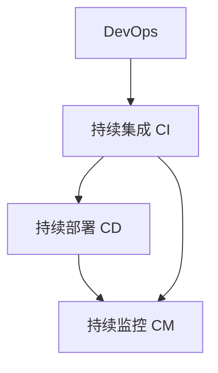
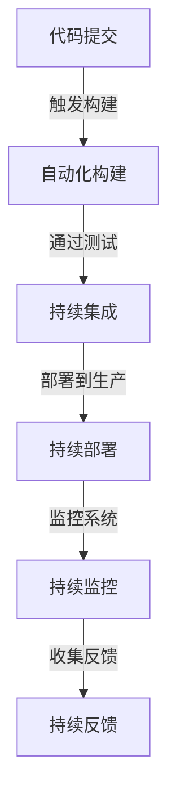

                 

## 1. 背景介绍

### 1.1 问题由来

随着软件行业的快速发展，软件开发已经从传统的瀑布式开发模式，演变为更加灵活、高效、敏捷的DevOps模式。DevOps不仅关注代码的开发和交付，还涉及到持续集成(Continuous Integration, CI)、持续部署(Continuous Deployment, CD)、持续监控(Continuous Monitoring, CM)等各个环节。高效的软件交付管道(Continuous Delivery Pipeline, CD Pipeline)，成为软件开发和运维工作的重要组成部分。

### 1.2 问题核心关键点

高效的软件交付管道是将软件开发、测试、部署、监控等环节整合起来，实现快速、稳定、可靠的交付流程。核心关键点包括：

- 自动化：通过自动化工具，实现从代码提交到发布全流程的自动化。
- 一致性：确保不同环境、不同用户之间软件交付的一致性。
- 可靠性：保证软件交付过程的稳定性和可重复性。
- 安全性：在交付过程中，防范代码注入、配置泄露等安全风险。
- 效率：提高软件开发和交付的效率，降低人力和时间成本。

构建高效的软件交付管道，不仅需要选择合适的DevOps工具链，还需要在流程设计和实践上下功夫。本文将详细阐述构建高效软件交付管道的核心概念、关键技术、实践步骤和未来展望。

## 2. 核心概念与联系

### 2.1 核心概念概述

为更好地理解DevOps工具链构建过程，本节将介绍几个关键概念：

- **持续集成(Continuous Integration, CI)**：通过自动化工具，将代码提交、测试、集成等环节集成起来，实现快速、频繁的软件构建和测试。
- **持续部署(Continuous Deployment, CD)**：在CI的基础上，自动将通过测试的代码部署到生产环境，实现无缝的软件交付。
- **持续监控(Continuous Monitoring, CM)**：实时监控软件在生产环境中的运行状态，确保系统的稳定性和安全性。
- **DevOps**：将软件开发和运维工作紧密结合，采用自动化工具和持续集成、持续部署、持续监控等实践，提升交付效率和质量。

这些概念之间的逻辑关系可以通过以下Mermaid流程图来展示：



这个流程图展示了一组DevOps核心概念及其之间的关系：

1. 持续集成将代码提交、测试、集成等环节自动化，快速构建和测试软件。
2. 持续部署在CI的基础上，自动将通过测试的代码部署到生产环境，实现无缝交付。
3. 持续监控实时监控软件运行状态，确保系统的稳定性和安全性。
4. DevOps将CI、CD、CM等环节整合起来，实现高效、可靠的软件交付。

## 3. 核心算法原理 & 具体操作步骤

### 3.1 算法原理概述

DevOps工具链构建的核心思想是采用自动化工具，实现从代码提交到软件交付全流程的自动化。通过自动化，确保每个环节的一致性、可靠性和安全性。

### 3.2 算法步骤详解

构建高效的软件交付管道主要包括以下关键步骤：

**Step 1: 环境准备**

1. **开发环境配置**：为开发者提供稳定的开发工具和库，如IDE、编译器、测试框架等。
2. **版本控制系统**：使用Git、SVN等版本控制系统，确保代码的备份和版本管理。
3. **构建工具**：安装Jenkins、Travis CI等构建工具，自动执行构建和测试任务。

**Step 2: 持续集成**

1. **自动化构建**：将代码提交到版本控制系统后，自动触发构建和测试流程。
2. **持续集成工具**：使用Jenkins、GitLab CI/CD、Travis CI等持续集成工具，实现自动化的构建和测试。
3. **代码分析**：集成静态代码分析工具，如SonarQube、Checkstyle等，检测代码质量和潜在问题。

**Step 3: 持续部署**

1. **自动化部署**：通过CI流程，将通过测试的代码自动部署到生产环境。
2. **部署工具**：使用Ansible、Docker、Kubernetes等自动化部署工具，实现无缝的代码交付。
3. **环境隔离**：使用容器技术如Docker、Kubernetes等，实现环境的隔离和复现，避免环境差异带来的问题。

**Step 4: 持续监控**

1. **实时监控**：集成ELK Stack、Grafana等监控工具，实时监控系统运行状态。
2. **日志收集**：使用Logstash、Fluentd等工具，收集和分析系统日志，及时发现和解决异常。
3. **性能监控**：使用Prometheus、New Relic等工具，监控系统的性能指标，如响应时间、资源使用率等。

**Step 5: 持续反馈**

1. **自动化测试**：集成单元测试、集成测试、端到端测试，确保软件质量。
2. **质量报告**：生成测试报告，如Junit报告、Allure报告等，提供详细的测试结果和覆盖率。
3. **反馈机制**：根据测试结果，自动通知开发者和运维人员，确保问题及时得到解决。

### 3.3 算法优缺点

DevOps工具链构建具有以下优点：

1. **高效**：自动化工具大大减少了手动操作，提高了交付速度和效率。
2. **一致性**：通过自动化和隔离，确保不同环境、不同用户之间的软件一致性。
3. **可靠性**：自动化流程保证了交付过程的稳定性和可重复性，减少了人为错误。
4. **安全性**：通过自动化和监控，防范了代码注入、配置泄露等安全风险。
5. **协作性**：DevOps模式促进了开发和运维之间的协作，提高了团队的协作效率。

同时，该方法也存在一定的局限性：

1. **复杂性**：构建和维护自动化流程需要较高的技术水平和工具积累。
2. **依赖性**：对工具的依赖可能导致工具链的兼容性和扩展性问题。
3. **成本**：构建和维护自动化流程需要一定的投入，包括工具采购和人员培训等。
4. **安全性**：自动化流程和部署中的安全性保障需要系统的设计和实施。
5. **维护性**：自动化流程的维护和更新需要持续的投入和优化。

尽管存在这些局限性，但就目前而言，DevOps工具链构建仍然是最主流的软件开发和交付方式。未来相关研究的重点在于如何进一步简化流程、优化工具，提高交付效率和质量。

### 3.4 算法应用领域

DevOps工具链构建在软件开发和运维的各个环节中都有广泛应用，例如：

- **软件开发**：自动化构建、测试、部署、发布等环节。
- **系统运维**：实时监控、日志分析、性能调优、故障排查等环节。
- **项目管理**：任务调度、进度跟踪、风险管理等环节。
- **数据管理**：数据备份、数据迁移、数据同步等环节。
- **安全管理**：自动化漏洞扫描、自动化配置检查、自动化安全测试等环节。

除了上述这些常见应用外，DevOps工具链还被创新性地应用于更多场景中，如云原生架构、微服务架构、DevSecOps等，为软件开发和运维提供了新的思路和解决方案。

## 4. 数学模型和公式 & 详细讲解 & 举例说明

### 4.1 数学模型构建

本节将使用数学语言对DevOps工具链构建过程进行更加严格的刻画。

记软件开发和运维流程为 $F$，其输入为软件需求 $D$，输出为软件产品 $P$。模型 $F$ 的输入和输出之间存在映射关系，即 $F(D) = P$。

在实践中，我们通常使用流程图来描述软件交付管道的各个环节，并使用状态转移图来描述各环节之间的依赖关系。例如：



这个状态转移图展示了从代码提交到持续反馈的整个流程，其中每个节点表示一个步骤，箭头表示依赖关系。

### 4.2 公式推导过程

在模型 $F$ 的构建过程中，我们需要定义每个步骤的输入和输出，以及它们之间的依赖关系。例如：

- 代码提交：输入为需求 $D$，输出为提交代码 $C$。
- 自动化构建：输入为提交代码 $C$，输出为构建结果 $B$。
- 持续集成：输入为构建结果 $B$，输出为通过测试的代码 $C'$。
- 持续部署：输入为通过测试的代码 $C'$，输出为部署结果 $D'$。
- 持续监控：输入为部署结果 $D'$，输出为监控结果 $E'$。
- 持续反馈：输入为监控结果 $E'$，输出为反馈信息 $F'$。

根据上述定义，我们可以推导出模型 $F$ 的映射关系：

$$
F(D) = C' \rightarrow B \rightarrow C' \rightarrow D' \rightarrow E' \rightarrow F'
$$

在实际应用中，我们需要根据具体场景，进一步细化每个步骤的输入和输出，以及它们之间的依赖关系。例如：

- 代码提交：输入为需求 $D$，输出为提交代码 $C$。
- 自动化构建：输入为提交代码 $C$，输出为构建结果 $B$。
- 持续集成：输入为构建结果 $B$，输出为通过测试的代码 $C'$。
- 持续部署：输入为通过测试的代码 $C'$，输出为部署结果 $D'$。
- 持续监控：输入为部署结果 $D'$，输出为监控结果 $E'$。
- 持续反馈：输入为监控结果 $E'$，输出为反馈信息 $F'$。

这些步骤的实现可以通过各种自动化工具和系统实现，如Jenkins、GitLab CI/CD、Travis CI、Docker、Kubernetes、ELK Stack、Grafana、Logstash、Fluentd、Prometheus、New Relic等。

### 4.3 案例分析与讲解

以GitHub和Jenkins为例，演示如何构建基于DevOps工具链的软件交付管道。

**步骤1: 环境准备**

1. **开发环境配置**：为开发者提供稳定的开发工具和库，如IDE、编译器、测试框架等。
2. **版本控制系统**：使用Git版本控制系统，确保代码的备份和版本管理。
3. **构建工具**：安装Jenkins构建工具，自动执行构建和测试任务。

**步骤2: 持续集成**

1. **自动化构建**：将代码提交到Git版本控制系统后，自动触发构建和测试流程。
2. **持续集成工具**：使用Jenkins持续集成工具，实现自动化的构建和测试。
3. **代码分析**：集成静态代码分析工具，如SonarQube、Checkstyle等，检测代码质量和潜在问题。

**步骤3: 持续部署**

1. **自动化部署**：通过CI流程，将通过测试的代码自动部署到生产环境。
2. **部署工具**：使用Docker容器技术，实现无缝的代码交付。
3. **环境隔离**：使用Kubernetes容器编排工具，实现环境的隔离和复现。

**步骤4: 持续监控**

1. **实时监控**：集成ELK Stack监控工具，实时监控系统运行状态。
2. **日志收集**：使用Logstash、Fluentd工具，收集和分析系统日志，及时发现和解决异常。
3. **性能监控**：使用Prometheus、New Relic工具，监控系统的性能指标，如响应时间、资源使用率等。

**步骤5: 持续反馈**

1. **自动化测试**：集成单元测试、集成测试、端到端测试，确保软件质量。
2. **质量报告**：生成测试报告，如Junit报告、Allure报告等，提供详细的测试结果和覆盖率。
3. **反馈机制**：根据测试结果，自动通知开发者和运维人员，确保问题及时得到解决。

## 5. 项目实践：代码实例和详细解释说明

### 5.1 开发环境搭建

在进行DevOps工具链构建实践前，我们需要准备好开发环境。以下是使用Jenkins进行持续集成和持续部署的环境配置流程：

1. **安装Jenkins**：从官网下载并安装Jenkins，用于构建和部署软件。

2. **安装插件**：
   - Git插件：用于Jenkins与Git版本控制系统的集成。
   - Docker插件：用于Jenkins与Docker容器的集成。
   - Kubernetes插件：用于Jenkins与Kubernetes容器编排工具的集成。

3. **配置构建流程**：
   - 在Jenkins中创建构建作业，配置代码库、构建脚本、测试脚本等。
   - 设置触发条件，如代码提交触发、定时触发等。

4. **配置部署流程**：
   - 在Jenkins中创建部署作业，配置部署脚本、容器配置、Kubernetes部署配置等。
   - 设置触发条件，如构建成功触发、定时触发等。

完成上述步骤后，即可在Jenkins中进行持续集成和持续部署实践。

### 5.2 源代码详细实现

下面我们以构建一个Web应用为例，给出使用Jenkins进行持续集成和持续部署的PyTorch代码实现。

**Jenkinsfile示例**

```python
pipeline {
    agent any
    stages {
        stage('Build') {
            steps {
                sh 'python build.py'
            }
        }
        stage('Test') {
            steps {
                sh 'python test.py'
            }
        }
        stage('Deploy') {
            steps {
                sh 'python deploy.py'
            }
        }
    }
}
```

**代码实现**

1. **构建作业**

```python
import requests

def build():
    # 构建Web应用
    # ...

    # 发送构建成功通知
    post_to_slack('Build succeeded')

def post_to_slack(message):
    # 发送Slack通知
    # ...
```

2. **测试作业**

```python
import requests

def test():
    # 测试Web应用
    # ...

    # 发送测试成功通知
    post_to_slack('Test succeeded')

def post_to_slack(message):
    # 发送Slack通知
    # ...
```

3. **部署作业**

```python
import requests

def deploy():
    # 部署Web应用到生产环境
    # ...

    # 发送部署成功通知
    post_to_slack('Deploy succeeded')

def post_to_slack(message):
    # 发送Slack通知
    # ...
```

**代码解读与分析**

1. **构建作业**

在`build.py`脚本中，我们编写了构建Web应用的核心逻辑，包括代码编译、依赖安装、静态资源构建等。完成构建后，通过`requests`模块向Slack发送构建成功的通知。

2. **测试作业**

在`test.py`脚本中，我们编写了测试Web应用的核心逻辑，包括单元测试、集成测试、端到端测试等。完成测试后，通过`requests`模块向Slack发送测试成功的通知。

3. **部署作业**

在`deploy.py`脚本中，我们编写了部署Web应用的核心逻辑，包括代码部署、数据库迁移、环境配置等。完成部署后，通过`requests`模块向Slack发送部署成功的通知。

### 5.3 运行结果展示

启动Jenkins后，我们将在Jenkins UI上看到持续集成和持续部署的流程，包括构建、测试和部署等环节。通过Jenkins，我们可以实时查看每个环节的运行状态，快速发现和解决异常。例如：

- 构建失败：Jenkins会自动回滚代码，并通知开发人员。
- 测试失败：Jenkins会自动回滚代码，并通知开发人员。
- 部署失败：Jenkins会自动回滚代码，并通知运维人员。

通过Jenkins等DevOps工具链的实践，我们可以实现从代码提交到软件交付全流程的自动化，大大提高开发和运维效率，确保软件交付的一致性和可靠性。

## 6. 实际应用场景

### 6.1 智能运维系统

基于DevOps工具链的智能运维系统，可以自动监控和管理大规模系统的运行状态，实时发现和解决异常。具体而言，可以实时收集系统的日志、性能数据、告警信息等，通过分析这些数据，自动生成故障报告、性能报告等，并触发自动修复和回滚流程。

在技术实现上，可以使用ELK Stack、Grafana、Logstash、Fluentd、Prometheus、New Relic等工具，构建智能运维系统。该系统将持续集成和持续部署与持续监控和持续反馈紧密结合，形成闭环反馈机制，确保系统稳定运行。

### 6.2 云计算平台

云计算平台需要高效、可靠、安全地管理大量的计算资源和数据资源，DevOps工具链可以大大提升其管理效率和自动化水平。具体而言，可以将云计算平台的操作自动化，如云资源创建、云资源部署、云资源监控、云资源回收等，通过CI/CD流程实现自动化和持续化。

在技术实现上，可以使用Docker、Kubernetes、Terraform等工具，构建云计算平台。通过DevOps工具链，可以快速部署和升级云计算资源，实时监控和管理云计算平台，确保其稳定性和安全性。

### 6.3 数据中心

数据中心需要高效、可靠地管理大量的服务器和网络设备，DevOps工具链可以大大提升其管理效率和自动化水平。具体而言，可以将数据中心的部署、运维、监控、备份等环节自动化，通过CI/CD流程实现自动化和持续化。

在技术实现上，可以使用Ansible、Puppet等工具，构建数据中心。通过DevOps工具链，可以快速部署和升级数据中心设备，实时监控和管理数据中心，确保其稳定性和安全性。

## 7. 工具和资源推荐

### 7.1 学习资源推荐

为了帮助开发者系统掌握DevOps工具链构建的理论基础和实践技巧，这里推荐一些优质的学习资源：

1. **《DevOps基础设施作为代码》**：Caucho首席架构师George Tsiptsikas开发的经典书籍，介绍了DevOps的基本概念和实践方法。
2. **《持续集成实践》**：Wes Bowler所著的畅销书籍，详细介绍了持续集成和持续部署的最佳实践。
3. **《Jenkins：持续集成和持续部署实践》**：Luckee C.和Shane W.所著的书籍，介绍了Jenkins工具的使用方法和实践经验。
4. **《Kubernetes：集群和编排》**：Kubernetes官方文档，详细介绍了Kubernetes工具的使用方法和实践经验。
5. **《ELK Stack：日志管理与监控》**：Elastic官方文档，详细介绍了ELK Stack工具的使用方法和实践经验。

通过对这些资源的学习实践，相信你一定能够快速掌握DevOps工具链构建的精髓，并用于解决实际的运维问题。

### 7.2 开发工具推荐

高效的开发离不开优秀的工具支持。以下是几款用于DevOps工具链构建的常用工具：

1. **Jenkins**：基于Java的开源持续集成和持续部署工具，支持插件扩展，实现功能丰富。
2. **GitLab**：基于Web的Git版本控制系统，集成了持续集成和持续部署功能，支持私有仓库。
3. **Travis CI**：基于云的持续集成工具，支持多种编程语言和平台，方便跨环境测试。
4. **Docker**：基于容器技术的开源平台，支持跨平台、跨环境部署，实现环境隔离。
5. **Kubernetes**：基于容器技术的开源平台，支持自动化运维和编排，实现高效资源管理。
6. **ELK Stack**：基于Elasticsearch、Logstash、Kibana的开源日志和监控平台，支持实时日志分析和可视化。
7. **Grafana**：基于Web的开源监控平台，支持多种数据源和插件，实现可视化监控。

合理利用这些工具，可以显著提升DevOps工具链构建的开发效率，加快创新迭代的步伐。

### 7.3 相关论文推荐

DevOps工具链构建在软件开发和运维的各个环节中都有广泛应用，相关研究也相当活跃。以下是几篇奠基性的相关论文，推荐阅读：

1. **《A Survey on DevOps：Benefits, Challenges, and Future Directions》**：Schneppenheim等人在IEEE上发表的综述论文，介绍了DevOps的基本概念和挑战。
2. **《Continuous Delivery: Practical Strategies for Success》**：James Yu和Sandi Metz在ACM SIGSOFT上发表的文章，介绍了持续交付的最佳实践。
3. **《Jenkins, The Limit》**：Brian David发表在Medium上的文章，介绍了Jenkins的优缺点和未来发展方向。
4. **《Kubernetes: Borg and Inception》**：Brendan Burns在Kubernetes官网上发表的文章，介绍了Kubernetes的架构和设计思想。
5. **《The Value of DevOps for Continuous Improvement》**：Kyle First和James Yu在ACM SIGSOFT上发表的文章，介绍了DevOps对持续改进的价值。

这些论文代表了大规模软件开发和运维的最新趋势，通过学习这些前沿成果，可以帮助研究者把握学科前进方向，激发更多的创新灵感。

## 8. 总结：未来发展趋势与挑战

### 8.1 总结

本文对DevOps工具链构建过程进行了全面系统的介绍。首先阐述了DevOps工具链构建的背景和意义，明确了其在软件开发和运维中不可替代的重要作用。其次，从原理到实践，详细讲解了持续集成、持续部署、持续监控等关键技术的核心算法和具体操作步骤，给出了DevOps工具链构建的完整代码实例。同时，本文还广泛探讨了DevOps工具链在智能运维、云计算平台、数据中心等多个领域的应用前景，展示了DevOps工具链的巨大潜力。

通过本文的系统梳理，可以看到，DevOps工具链构建已经成为软件开发和运维的重要手段，极大地提升了软件开发和运维的效率和质量。未来，伴随DevOps技术的不断发展，DevOps工具链必将在构建高效、可靠、可扩展的交付管道中发挥更加重要的作用。

### 8.2 未来发展趋势

展望未来，DevOps工具链构建将呈现以下几个发展趋势：

1. **自动化程度提高**：自动化工具将更加智能化和自动化，能够自主发现和解决问题，提高交付效率。
2. **容器化和云原生**：容器化技术将成为主流，云原生应用和微服务架构将成为趋势，提升系统可靠性和扩展性。
3. **多云管理**：支持多云管理，实现跨云平台的资源调度和管理，提高资源利用率。
4. **持续监控**：实时监控和数据分析将成为重要手段，帮助系统快速发现和解决问题。
5. **DevSecOps**：将安全融入DevOps流程，实现自动化安全测试和漏洞扫描，提高系统的安全性。
6. **持续反馈**：通过持续反馈机制，实现快速迭代和优化，提升交付质量。

以上趋势凸显了DevOps工具链构建的广阔前景。这些方向的探索发展，必将进一步提升软件开发和运维的效率和质量，为人工智能和软件开发带来新的机遇。

### 8.3 面临的挑战

尽管DevOps工具链构建已经取得了显著成就，但在迈向更加智能化、普适化应用的过程中，它仍面临诸多挑战：

1. **复杂性**：构建和维护自动化流程需要较高的技术水平和工具积累。
2. **依赖性**：对工具的依赖可能导致工具链的兼容性和扩展性问题。
3. **成本**：构建和维护自动化流程需要一定的投入，包括工具采购和人员培训等。
4. **安全性**：自动化流程和部署中的安全性保障需要系统的设计和实施。
5. **维护性**：自动化流程的维护和更新需要持续的投入和优化。

尽管存在这些挑战，但就目前而言，DevOps工具链构建仍然是最主流的软件开发和运维方式。未来相关研究的重点在于如何进一步简化流程、优化工具，提高交付效率和质量。

### 8.4 研究展望

面对DevOps工具链构建所面临的种种挑战，未来的研究需要在以下几个方面寻求新的突破：

1. **简化流程**：开发更加易于使用的自动化工具，降低流程的复杂性和维护成本。
2. **优化工具**：设计更加高效、灵活、可扩展的自动化工具，提高交付效率和质量。
3. **提高安全性**：加强自动化流程和部署中的安全性保障，防范代码注入、配置泄露等安全风险。
4. **自动化测试**：开发更加全面、高效、可靠的自动化测试工具，确保软件质量。
5. **持续监控**：开发更加实时、全面、精准的持续监控工具，实现对系统的实时监控和分析。
6. **持续反馈**：加强持续反馈机制，实现快速迭代和优化，提升交付质量。

这些研究方向的探索，必将引领DevOps工具链构建技术迈向更高的台阶，为软件开发和运维带来新的突破。面向未来，DevOps工具链需要与其他软件开发技术进行更深入的融合，如DevSecOps、DevOps-as-Code、云原生等，多路径协同发力，共同推动软件开发和运维的进步。只有勇于创新、敢于突破，才能不断拓展DevOps工具链的边界，让软件开发和运维技术更好地服务于企业和社会。

## 9. 附录：常见问题与解答

**Q1: DevOps工具链构建是否适用于所有软件项目？**

A: DevOps工具链构建在大多数软件开发项目中都能取得不错的效果，特别是对于大型和复杂的项目。但对于一些小型项目，可能会因为复杂性过高而无法实现完全自动化。因此，对于小型项目，可以根据实际需求选择合适的自动化程度。

**Q2: DevOps工具链构建是否会影响软件项目的开发效率？**

A: DevOps工具链构建在初期可能会增加一些开发成本，但在长远来看，能够显著提高软件开发和运维的效率。通过持续集成和持续部署，可以快速发现和解决问题，避免手动操作的错误，提高交付速度和质量。

**Q3: DevOps工具链构建是否需要投入大量资源？**

A: DevOps工具链构建需要一定的投入，包括工具采购、技术培训、流程设计等。但随着工具和技术的成熟，这些投入可以在后续的交付中获得回报。对于小型项目，可以先从小规模的自动化流程开始，逐步扩展和优化。

**Q4: DevOps工具链构建是否会带来安全风险？**

A: DevOps工具链构建如果设计不当，可能会带来安全风险。例如，自动化流程中缺少安全检测，部署过程中存在漏洞等。因此，需要结合DevSecOps的理念，在DevOps流程中引入安全检测和漏洞扫描，确保系统的安全性。

**Q5: DevOps工具链构建是否需要高水平的技术人员？**

A: DevOps工具链构建需要高水平的技术人员，包括软件开发、系统运维、流程设计等方面的人才。但随着工具和技术的普及，越来越多的人开始学习和使用DevOps工具链，高水平技术人员的需求也在逐渐减少。

综上所述，DevOps工具链构建已经成为软件开发和运维的重要手段，其未来的发展方向是更加智能化、自动化、安全化和持续化。只有在不断优化和改进DevOps工具链的过程中，才能更好地服务于企业和社会的数字化转型。

