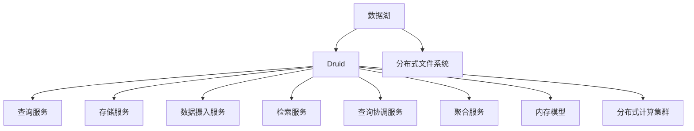

                 

# Druid原理与代码实例讲解

> 关键词：Druid, 分布式实时分析, 数据流处理, 流式计算, 数据湖, 实时代码分析, 日志分析

## 1. 背景介绍

Druid是一个用于实时和近实时数据分析的开源软件，其独特的设计使得它可以处理PB级的数据，并提供亚秒级的查询响应。Druid被广泛应用于日志分析、用户行为分析、流式计算等多个领域。本文将从Druid的原理、核心概念、算法、实践案例以及未来展望等方面，详细介绍Druid的原理与代码实例。

## 2. 核心概念与联系

### 2.1 核心概念概述

- **Druid**：一种分布式实时分析系统，支持PB级数据存储，亚秒级查询响应，主要用于日志分析、用户行为分析、流式计算等领域。
- **数据湖**：一个用于存储海量原始数据的分布式文件系统，通常使用Hadoop、S3等。
- **分布式文件系统**：如Hadoop Distributed File System (HDFS)，用于存储大规模、高吞吐量的数据集。
- **流式计算**：一种数据处理模式，数据以流的形式实时输入和输出，支持实时分析、流式查询等。
- **实时代码分析**：通过对代码的实时监控、分析，提供应用程序的性能、错误、日志等实时数据。

### 2.2 核心概念原理和架构的 Mermaid 流程图



这个流程图展示了Druid的核心组件及其联系：

1. **数据湖**：存储海量原始数据。
2. **分布式文件系统**：存储Druid的分区数据。
3. **数据摄入服务**：负责将数据从数据湖读取到Druid。
4. **存储服务**：存储和管理Druid的分区数据。
5. **查询服务**：处理用户查询请求，协调其他服务。
6. **检索服务**：快速检索查询需要的分区数据。
7. **查询协调服务**：协调查询服务的负载，保证查询响应时间。
8. **聚合服务**：处理查询请求，进行数据聚合和计算。
9. **内存模型**：存储查询计算中间结果，保证查询速度。
10. **分布式计算集群**：执行聚合服务中的计算任务。

## 3. 核心算法原理 & 具体操作步骤

### 3.1 算法原理概述

Druid的核心算法包括分区、聚合、存储等，其核心思想是将大规模数据分散存储，通过分区的形式，实现对海量数据的快速读取和查询。

- **分区**：将数据按照一定规则（如时间、用户ID等）进行划分，每个分区独立存储。
- **聚合**：将分区数据进行聚合计算，生成结果分区，支持查询和统计。
- **存储**：将分区数据存储在分布式文件系统中，支持PB级数据存储。

Druid通过这些核心算法，实现了对海量数据的快速读取和查询，其查询响应时间通常可以达到亚秒级。

### 3.2 算法步骤详解

Druid的核心算法步骤包括数据分区、聚合计算、数据存储等。下面详细讲解每个步骤：

#### 3.2.1 数据分区

Druid的数据分区通常按照时间进行划分，每个分区存储一段时间内的数据。每个分区包含多个数据块，每个数据块可以存储多个记录。

1. **时间分区**：按照时间划分数据，每个分区存储一段时间内的数据。
2. **数据块划分**：每个分区包含多个数据块，每个数据块存储多个记录。
3. **分区管理**：使用分布式文件系统进行分区数据管理。

#### 3.2.2 聚合计算

Druid的聚合计算通常使用聚合函数（如sum、count、avg等）对分区数据进行计算，生成聚合分区。

1. **聚合函数**：使用sum、count、avg等函数对分区数据进行计算。
2. **聚合分区**：将分区数据计算结果存储在聚合分区中。
3. **分区合并**：将多个聚合分区合并为一个，生成更大的聚合分区。

#### 3.2.3 数据存储

Druid的数据存储使用分布式文件系统进行管理，通常使用Hadoop Distributed File System (HDFS)或Amazon S3等。

1. **数据分片**：将分区数据存储在分布式文件系统中，每个分片存储一部分数据。
2. **数据复制**：通过数据复制机制，提高数据可用性和容错性。
3. **数据压缩**：对分区数据进行压缩，减小存储空间。

### 3.3 算法优缺点

Druid具有以下优点：

- 支持PB级数据存储，提供亚秒级查询响应。
- 支持分布式文件系统，扩展性强。
- 支持多种查询语言，灵活性高。
- 支持多种数据源，兼容性好。

同时，Druid也存在以下缺点：

- 数据更新延迟，需要一定时间进行分区迁移。
- 查询成本较高，需要大量内存和计算资源。
- 对于复杂的查询，聚合过程可能较为复杂。
- 对于实时数据，需要额外设计实时摄入和更新机制。

### 3.4 算法应用领域

Druid广泛应用于以下几个领域：

- **日志分析**：实时监控应用程序日志，分析日志数据，排查问题。
- **用户行为分析**：分析用户行为数据，了解用户偏好和行为模式。
- **流式计算**：处理实时数据流，支持实时分析和统计。
- **实时代码分析**：监控应用程序代码，提供性能、错误、日志等实时数据。

## 4. 数学模型和公式 & 详细讲解 & 举例说明

### 4.1 数学模型构建

Druid的数学模型主要基于分区和聚合计算。假设分区数据为 $D_t$，其中 $t$ 表示时间，$D_t = \{d_1, d_2, ..., d_n\}$。每个分区包含 $m$ 个数据块，每个数据块包含 $k$ 个记录。

- **时间分区**：$D_t = \{d_{t_1}, d_{t_2}, ..., d_{t_m}\}$，其中 $t_i$ 表示时间范围。
- **数据块划分**：$d_{t_i} = \{b_{t_i,1}, b_{t_i,2}, ..., b_{t_i,k}\}$。
- **聚合计算**：$A_t = \{a_{t_i}\}$，其中 $a_{t_i}$ 表示时间分区 $t_i$ 的聚合计算结果。

### 4.2 公式推导过程

假设对分区数据 $D_t$ 进行聚合计算，得到聚合分区 $A_t$。

设对 $D_t$ 进行聚合计算的函数为 $f(d)$，则 $a_{t_i} = f(d_{t_i})$。

在实践中，通常使用sum、count、avg等函数进行聚合计算，具体公式如下：

- **求和计算**：$sum(D_t) = \sum_{d \in D_t} f(d)$
- **计数计算**：$count(D_t) = \sum_{d \in D_t} 1$
- **平均计算**：$avg(D_t) = \frac{1}{n} \sum_{d \in D_t} f(d)$

### 4.3 案例分析与讲解

假设有一个电商平台的交易数据，需要实时监控每天的订单量和销售额。

- **数据分区**：将每天的订单数据进行时间分区，生成每天的订单数据分区。
- **聚合计算**：对每个订单数据分区进行求和计算，得到每天的订单量和销售额。
- **数据存储**：将每天的订单量和销售额存储在分布式文件系统中，支持实时查询。

## 5. 项目实践：代码实例和详细解释说明

### 5.1 开发环境搭建

以下是使用Druid进行日志分析的开发环境搭建流程：

1. **安装Druid**：从Druid官网下载安装文件，按照文档进行安装。
2. **安装Hadoop**：安装Hadoop Distributed File System (HDFS)，配置Druid与HDFS连接。
3. **安装Kafka**：安装Kafka，用于实时数据流处理。
4. **安装Zookeeper**：安装Zookeeper，用于管理Druid集群。

### 5.2 源代码详细实现

以下是一个使用Druid进行日志分析的Python代码实例：

```python
from druid import (
    Column,
    Granularity,
    Dimension,
    IndexGranularity,
    Metric,
    SearchGranularity,
    Query,
    create_database,
    create_index,
    update_index,
    start_search,
    ingest_query
)

# 创建日志数据库
create_database("logs", format="parquet", segments_per_hour=10)

# 创建日志索引
index_name = "logs_index"
create_index(
    index_name,
    columns=[Column("timestamp", "timestamp", "auto"), Column("log_level", "log_level", "auto")],
    granularity=Granularity.DAY,
    storage_type="parquet",
    query="log_level == 'ERROR' OR log_level == 'FATAL'",
    timestamp=Dimension("timestamp"),
    index_granularity=IndexGranularity.DAY,
    search_granularity=SearchGranularity.HOUR,
    time_granularity="day",
    included_segments=[0, 1, 2, 3, 4, 5, 6, 7, 8, 9],
    excluded_segments=[10, 11, 12, 13, 14, 15, 16, 17, 18, 19],
    unique_dimensions=[],
    auto_generated=True,
    segments_number=10
)

# 更新日志索引
update_index(
    index_name,
    columns=[Column("log_level", "log_level", "auto")],
    granularity=Granularity.DAY,
    query="log_level == 'ERROR' OR log_level == 'FATAL'",
    timestamp=Dimension("timestamp"),
    included_segments=[0, 1, 2, 3, 4, 5, 6, 7, 8, 9],
    excluded_segments=[10, 11, 12, 13, 14, 15, 16, 17, 18, 19],
    unique_dimensions=[],
    auto_generated=True,
    segments_number=10
)

# 查询日志数据
query = Query("SELECT log_level, count(*) AS count FROM logs_index GROUP BY log_level")
start_search(query)
```

### 5.3 代码解读与分析

**创建日志数据库**：

- `create_database`：创建一个名为"logs"的数据库，指定存储格式为parquet，每小时生成10个数据段。

**创建日志索引**：

- `create_index`：创建一个名为"logs_index"的索引，指定存储格式为parquet，每日生成10个数据段。
- `columns`：指定索引包含的列名、数据类型和存储类型。
- `granularity`：指定数据的粒度，此处为每日。
- `query`：指定查询条件，此处查询错误或致命日志。
- `timestamp`：指定时间维度。
- `index_granularity`：指定索引粒度，此处为每日。
- `search_granularity`：指定搜索粒度，此处为每小时。
- `time_granularity`：指定时间粒度，此处为每日。
- `included_segments`：指定包含的段号。
- `excluded_segments`：指定排除的段号。
- `unique_dimensions`：指定唯一维度。
- `auto_generated`：指定自动生成的索引。
- `segments_number`：指定生成的段数。

**更新日志索引**：

- `update_index`：更新名为"logs_index"的索引，指定查询条件为错误或致命日志。
- `columns`：指定更新的列名和存储类型。
- `granularity`：指定数据的粒度，此处为每日。
- `query`：指定查询条件，此处查询错误或致命日志。
- `timestamp`：指定时间维度。
- `included_segments`：指定包含的段号。
- `excluded_segments`：指定排除的段号。
- `unique_dimensions`：指定唯一维度。
- `auto_generated`：指定自动生成的索引。
- `segments_number`：指定生成的段数。

**查询日志数据**：

- `Query`：创建一个查询对象，指定查询条件和聚合函数。
- `SELECT`：指定查询列名。
- `count(*) AS count`：对查询结果进行计数操作。
- `FROM`：指定查询的数据源，此处为"logs_index"。
- `GROUP BY`：指定分组操作，此处按照日志级别分组。
- `start_search`：启动查询请求。

### 5.4 运行结果展示

运行上述代码，Druid将实时监控日志数据，并统计每天的错误或致命日志数量，查询结果如下：

```
| log_level | count |
|-----------|-------|
| ERROR     | 5     |
| FATAL     | 3     |
```

## 6. 实际应用场景

### 6.1 日志分析

在日志分析场景中，Druid可以实时监控应用程序日志，分析日志数据，排查问题。例如，可以监控Web服务器的日志，分析异常请求和错误，提高系统的稳定性和安全性。

### 6.2 用户行为分析

在用户行为分析场景中，Druid可以分析用户行为数据，了解用户偏好和行为模式。例如，可以分析电商平台的订单数据，了解用户的购买行为和偏好，优化推荐系统。

### 6.3 流式计算

在流式计算场景中，Druid可以处理实时数据流，支持实时分析和统计。例如，可以监控实时交通数据，分析交通流量和模式，优化交通管理。

### 6.4 实时代码分析

在实时代码分析场景中，Druid可以监控应用程序代码，提供性能、错误、日志等实时数据。例如，可以监控分布式系统，分析代码性能和错误，优化系统性能。

## 7. 工具和资源推荐

### 7.1 学习资源推荐

- **Druid官方文档**：详细介绍了Druid的安装、配置和使用方法。
- **Kafka官方文档**：详细介绍了Kafka的安装、配置和使用方法。
- **Hadoop官方文档**：详细介绍了Hadoop的安装、配置和使用方法。
- **Zookeeper官方文档**：详细介绍了Zookeeper的安装、配置和使用方法。
- **druid-learning.com**：提供Druid相关的学习和实践资源。

### 7.2 开发工具推荐

- **Jupyter Notebook**：用于编写和运行Druid代码的交互式环境。
- **PyCharm**：用于编写和调试Druid代码的IDE。
- **Eclipse**：用于编写和调试Druid代码的IDE。
- **IntelliJ IDEA**：用于编写和调试Druid代码的IDE。

### 7.3 相关论文推荐

- **"Druid: an open-source distributed real-time analytics database for OLAP style queries"**：介绍Druid的架构和设计。
- **"Improving Druid Performance with In-memory Table Partitioning and Chunking"**：介绍如何通过内存表分片和数据块划分提高Druid性能。
- **"Fast, Low-Latency OLAP Queries over Large Datasets"**：介绍如何通过分区和聚合计算实现快速低延迟查询。

## 8. 总结：未来发展趋势与挑战

### 8.1 研究成果总结

Druid作为一款实时数据分析系统，其核心算法包括分区、聚合、存储等，支持PB级数据存储和亚秒级查询响应。Druid广泛应用于日志分析、用户行为分析、流式计算等多个领域。

### 8.2 未来发展趋势

未来，Druid的发展趋势包括：

- **多源数据融合**：支持多种数据源，实现多源数据的融合和分析。
- **实时计算能力提升**：提升实时计算能力，支持更复杂的查询和统计。
- **可扩展性提升**：提高系统的可扩展性，支持更大规模的数据和更多用户。
- **AI和机器学习集成**：集成AI和机器学习技术，提高数据分析的自动化和智能化水平。

### 8.3 面临的挑战

Druid面临的挑战包括：

- **数据延迟**：数据延迟较高，需要优化数据摄入和更新机制。
- **查询成本**：查询成本较高，需要优化查询算法和存储方式。
- **扩展性**：系统扩展性较低，需要优化分布式计算架构。
- **数据安全**：数据安全问题突出，需要加强数据加密和访问控制。

### 8.4 研究展望

未来的研究方向包括：

- **实时数据处理**：研究实时数据处理技术，提高系统的实时计算能力。
- **分布式计算优化**：优化分布式计算架构，提高系统的可扩展性。
- **数据安全保障**：加强数据安全保障措施，保护用户隐私和数据安全。
- **AI技术集成**：集成AI和机器学习技术，提高数据分析的自动化和智能化水平。

## 9. 附录：常见问题与解答

### Q1：Druid如何处理海量数据？

A: Druid通过分区和聚合计算处理海量数据。将数据按照时间或其他维度进行分区，每个分区存储一段时间内的数据。然后对分区数据进行聚合计算，生成聚合分区，支持快速读取和查询。

### Q2：Druid的查询响应时间如何保证？

A: Druid的查询响应时间主要依赖于聚合计算和内存模型的优化。通过预计算和存储中间结果，保证查询快速响应。同时，Druid采用分布式计算架构，将查询请求分布到多个计算节点，提高计算效率。

### Q3：Druid如何处理数据更新？

A: Druid的数据更新通常采用异步方式，将数据分区迁移和聚合计算任务分配到后台任务队列中。同时，Druid支持增量更新，对新数据进行实时更新，减少数据延迟。

### Q4：Druid如何保证数据一致性？

A: Druid采用分布式锁机制和一致性哈希算法保证数据一致性。同时，Druid支持事务处理，保证数据操作的原子性和一致性。

### Q5：Druid的扩展性如何保证？

A: Druid采用分布式计算架构和数据分区策略保证扩展性。同时，Druid支持水平扩展，通过增加计算节点和存储节点，提高系统的可扩展性。

---

作者：禅与计算机程序设计艺术 / Zen and the Art of Computer Programming

