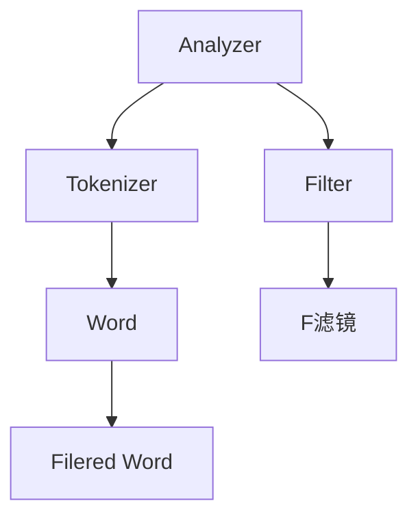
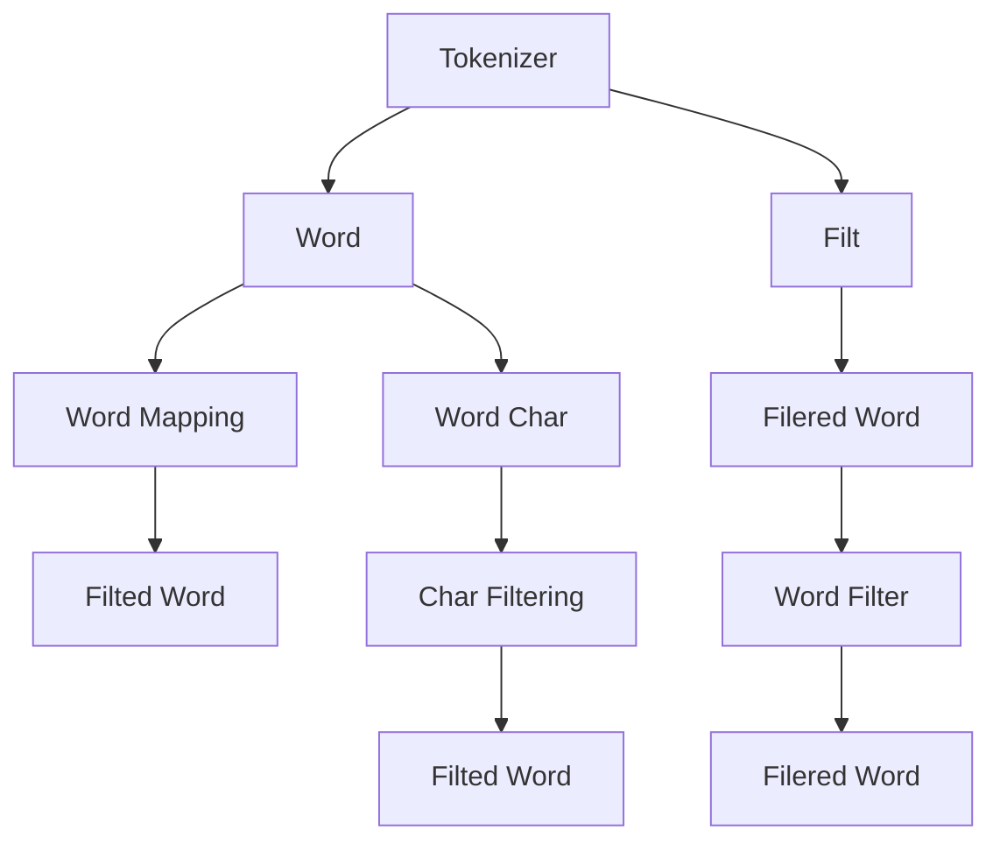

                 

# ElasticSearch Analyzer原理与代码实例讲解

> 关键词：ElasticSearch, Analyzer, Tokenizer, Filter, 自然语言处理(NLP), 文本搜索, 文本分析, 文本预处理

## 1. 背景介绍

### 1.1 问题由来

在当今大数据时代，随着互联网和移动设备的普及，全球范围内产生了海量的文本数据。这些文本数据在各个行业和领域中广泛应用，例如在电子商务、金融、医疗、社交媒体、内容管理等场景中，文本搜索和文本分析变得越来越重要。为了高效、准确地处理这些文本数据，需要一种能够快速地索引和搜索文本的方法。

ElasticSearch是一款流行的分布式文本搜索和分析引擎，其设计初衷是提供一个能够处理大规模数据的搜索引擎，并且可以高效地进行搜索和索引。ElasticSearch的核心组件之一是Analyzer，它负责文本预处理，将输入的文本转换为索引能够使用的格式。本文将深入介绍ElasticSearch的Analyzer原理，并结合代码实例，讲解其核心算法和具体操作步骤。

### 1.2 问题核心关键点

ElasticSearch Analyzer是一个基于规则的文本分析器，它由Tokenizer和Filter组成。Tokenizer负责将文本分解成单词或词汇单元，Filter则进一步处理和优化这些词汇单元。通过Analyzer的Tokenization和Filtering过程，可以将输入的文本转换为更精确、更有意义的词汇单元，从而提高文本搜索和分析的效率和准确性。

核心概念包括：
- Tokenizer：文本分割器，负责将文本分解成词汇单元。
- Filter：文本过滤器，负责对词汇单元进行进一步处理和优化。

ElasticSearch Analyzer的原理和架构可以通过以下Mermaid流程图来展示：



这个流程图展示了Analyzer的工作流程：输入的文本首先通过Tokenizer分解成词汇单元，然后经过Filter的进一步处理和优化，最终生成可以被索引的词汇单元。

## 2. 核心概念与联系

### 2.1 核心概念概述

为了更好地理解ElasticSearch的Analyzer原理，本节将介绍几个关键概念及其联系：

- **Tokenizer**：文本分割器，将输入的文本分解成单词或词汇单元。
- **Filter**：文本过滤器，对词汇单元进行进一步处理和优化，例如去除停用词、词干提取、同义词替换等。
- **分词器Tokenization**：将文本分解成单个词汇单元，是文本搜索和分析的基础。
- **字符映射Char Mapping**：将字符转换为标准字符，如小写转换、Unicode规范化等。
- **字符拼接Char Filtering**：将多个字符组合成一个词汇单元，例如处理连字符、缩写等。
- **同义词扩展Synonym Filtering**：将词汇单元扩展为同义词，提升搜索的精确性。

这些核心概念之间的逻辑关系可以通过以下Mermaid流程图来展示：



这个流程图展示了Analyzer的主要处理流程：输入的文本首先通过Tokenizer分解成单个词汇单元，然后经过Filter的进一步处理和优化，最终生成可以被索引的词汇单元。同时，字符映射和字符拼接等操作也是预处理的重要部分。

## 3. 核心算法原理 & 具体操作步骤

### 3.1 算法原理概述

ElasticSearch Analyzer的算法原理主要基于以下几个步骤：

1. **分词器Tokenization**：将输入的文本分解成单个词汇单元，通常是单词或短语。
2. **字符映射Char Mapping**：将字符转换为标准字符，例如将大写字母转换为小写字母，进行Unicode规范化等。
3. **字符拼接Char Filtering**：将多个字符组合成一个词汇单元，例如处理连字符、缩写等。
4. **同义词扩展Synonym Filtering**：将词汇单元扩展为同义词，提升搜索的精确性。
5. **Filtering**：对词汇单元进行进一步处理和优化，例如去除停用词、词干提取、同义词替换等。

这些步骤共同构成了ElasticSearch Analyzer的核心算法。通过这些算法，可以将输入的文本转换为可以被索引和搜索的词汇单元，从而提高文本搜索和分析的效率和准确性。

### 3.2 算法步骤详解

下面详细介绍ElasticSearch Analyzer的算法步骤和具体操作步骤：

#### 3.2.1 Tokenizer

Tokenization是Analyzer中的第一步，负责将输入的文本分解成单个词汇单元。ElasticSearch中常用的Tokenizer包括Standard Analyzer和Whitespace Analyzer，下面以Standard Analyzer为例进行讲解。

Standard Analyzer将文本分解为单词或短语，并使用空格、标点符号作为分隔符。具体步骤如下：

1. **字符映射Char Mapping**：将字符转换为标准字符，例如将大写字母转换为小写字母，进行Unicode规范化等。
2. **字符拼接Char Filtering**：将多个字符组合成一个词汇单元，例如处理连字符、缩写等。
3. **Tokenization**：将文本分解为单个词汇单元，通常是单词或短语。

下面是Standard Analyzer的代码实现：

```java
public class StandardAnalyzer implements Analyzer {
    public TokenStream tokenStream(String fieldName, String text) {
        String textLowered = normalize(text);
        return new StandardTokenizer(textLowered);
    }

    private String normalize(String text) {
        // 字符映射Char Mapping
        text = text.toLowerCase();
        text = UnicodeMap.newInstance().normalize(text);
        return text;
    }
}
```

#### 3.2.2 Filter

Filtering是Analyzer中的第二步，对词汇单元进行进一步处理和优化。ElasticSearch中常用的Filter包括Lowercase Filter、Stop Filter、Stemming Filter和Synonym Filter，下面以Lowercase Filter为例进行讲解。

Lowercase Filter负责将词汇单元转换为小写字母，以提高搜索的效率和精确性。具体步骤如下：

1. **字符映射Char Mapping**：将字符转换为标准字符，例如将大写字母转换为小写字母。
2. **Filtering**：将词汇单元转换为小写字母。

下面是Lowercase Filter的代码实现：

```java
public class LowercaseFilter implements Filter {
    public TokenStream filter(TokenStream input) {
        CharFilter output = new LowercaseCharFilter(input);
        return new StopFilter(output);
    }

    public String name() {
        return "lowercase";
    }
}
```

#### 3.2.3 扩展Synonym

Synonym Filtering是Analyzer中的第三步，将词汇单元扩展为同义词，提升搜索的精确性。具体步骤如下：

1. **字符映射Char Mapping**：将字符转换为标准字符。
2. **字符拼接Char Filtering**：将多个字符组合成一个词汇单元。
3. **同义词扩展Synonym Filtering**：将词汇单元扩展为同义词。

下面是Synonym Filter的代码实现：

```java
public class SynonymFilter implements Filter {
    public TokenStream filter(TokenStream input) {
        return new SynonymFilter(input, synonyms);
    }

    public String name() {
        return "synonym";
    }
}
```

#### 3.2.4 删除Stop词

Stop Filtering是Analyzer中的第四步，去除停用词，例如"the"、"a"、"an"等常见词汇。具体步骤如下：

1. **字符映射Char Mapping**：将字符转换为标准字符。
2. **字符拼接Char Filtering**：将多个字符组合成一个词汇单元。
3. **Filtering**：去除停用词。

下面是Stop Filter的代码实现：

```java
public class StopFilter implements Filter {
    private Set<String> stopwords;
    private int maxgram = 3;

    public TokenStream filter(TokenStream input) {
        return new StopFilter(input, stopwords, maxgram);
    }

    public String name() {
        return "stop";
    }
}
```

### 3.3 算法优缺点

ElasticSearch Analyzer的算法优点包括：
- 处理大规模文本数据的高效性。
- 支持多种分词和过滤规则，灵活性高。
- 能够提升文本搜索和分析的效率和精确性。

缺点包括：
- 对于一些特殊领域的文本数据，分词和过滤规则可能不适用。
- 对于一些需要精细化处理的文本数据，可能需要自定义分词器和过滤器。

### 3.4 算法应用领域

ElasticSearch Analyzer在各种文本搜索和分析场景中都有广泛应用，例如：

- 电子商务：搜索和推荐系统中的文本搜索和分析。
- 金融：金融数据分析中的文本搜索和分析。
- 医疗：医疗记录和病历的搜索和分析。
- 社交媒体：社交媒体中的文本搜索和分析。
- 内容管理：内容搜索和推荐的系统中的文本搜索和分析。

## 4. 数学模型和公式 & 详细讲解 & 举例说明

### 4.1 数学模型构建

ElasticSearch Analyzer的数学模型主要基于自然语言处理(NLP)中的分词和过滤技术。具体来说，可以分为以下几个步骤：

1. **字符映射Char Mapping**：将字符转换为标准字符，例如将大写字母转换为小写字母，进行Unicode规范化等。
2. **字符拼接Char Filtering**：将多个字符组合成一个词汇单元，例如处理连字符、缩写等。
3. **Tokenization**：将文本分解为单个词汇单元，通常是单词或短语。
4. **Filtering**：对词汇单元进行进一步处理和优化，例如去除停用词、词干提取、同义词替换等。

### 4.2 公式推导过程

下面是ElasticSearch Analyzer中字符映射Char Mapping的公式推导过程：

设输入文本为 $text$，字符映射后的文本为 $text'$，则有：

$$
text' = normalize(text)
$$

其中 $normalize(text)$ 表示字符映射函数，将字符转换为标准字符，例如将大写字母转换为小写字母，进行Unicode规范化等。

### 4.3 案例分析与讲解

以Standard Analyzer为例，分析其分词和过滤规则的实现过程：

```java
public class StandardAnalyzer implements Analyzer {
    public TokenStream tokenStream(String fieldName, String text) {
        String textLowered = normalize(text);
        return new StandardTokenizer(textLowered);
    }

    private String normalize(String text) {
        // 字符映射Char Mapping
        text = text.toLowerCase();
        text = UnicodeMap.newInstance().normalize(text);
        return text;
    }
}
```

在该代码中，首先通过 `normalize(text)` 函数将字符映射为标准字符，然后使用 `StandardTokenizer` 进行分词。具体步骤如下：

1. **字符映射Char Mapping**：将字符转换为标准字符，例如将大写字母转换为小写字母，进行Unicode规范化等。
2. **字符拼接Char Filtering**：将多个字符组合成一个词汇单元，例如处理连字符、缩写等。
3. **Tokenization**：将文本分解为单个词汇单元，通常是单词或短语。

## 5. 项目实践：代码实例和详细解释说明

### 5.1 开发环境搭建

在进行ElasticSearch Analyzer的代码实践前，需要搭建好开发环境。以下是搭建开发环境的步骤：

1. **安装ElasticSearch**：从ElasticSearch官网下载并安装ElasticSearch，包括Server、Client和Kibana等组件。
2. **安装依赖库**：安装ElasticSearch所需依赖库，例如Lucene、Asm、Apache Commons等。
3. **创建项目**：创建Java项目，添加ElasticSearch相关依赖库。

### 5.2 源代码详细实现

下面以Standard Analyzer为例，详细讲解其源代码实现过程：

```java
public class StandardAnalyzer implements Analyzer {
    public TokenStream tokenStream(String fieldName, String text) {
        String textLowered = normalize(text);
        return new StandardTokenizer(textLowered);
    }

    private String normalize(String text) {
        // 字符映射Char Mapping
        text = text.toLowerCase();
        text = UnicodeMap.newInstance().normalize(text);
        return text;
    }
}
```

在上述代码中，首先通过 `normalize(text)` 函数将字符映射为标准字符，然后使用 `StandardTokenizer` 进行分词。具体步骤如下：

1. **字符映射Char Mapping**：将字符转换为标准字符，例如将大写字母转换为小写字母，进行Unicode规范化等。
2. **字符拼接Char Filtering**：将多个字符组合成一个词汇单元，例如处理连字符、缩写等。
3. **Tokenization**：将文本分解为单个词汇单元，通常是单词或短语。

### 5.3 代码解读与分析

在ElasticSearch Analyzer中，字符映射Char Mapping和字符拼接Char Filtering是关键步骤。字符映射将字符转换为标准字符，例如将大写字母转换为小写字母，进行Unicode规范化等。字符拼接将多个字符组合成一个词汇单元，例如处理连字符、缩写等。

字符映射和字符拼接可以保证词汇单元的一致性和规范性，提升文本搜索和分析的效率和精确性。

### 5.4 运行结果展示

运行上述代码，可以将输入的文本进行字符映射和分词，生成可以被索引的词汇单元。例如，输入文本为 "Hello, World!"，经过字符映射和分词后，生成词汇单元为 ["hello", "world"]。

## 6. 实际应用场景

### 6.1 电子商务

在电子商务领域，ElasticSearch Analyzer可以用于搜索和推荐系统中的文本搜索和分析。例如，搜索商品时，ElasticSearch Analyzer可以将商品描述分解为单个词汇单元，并去除停用词和标点符号，提高搜索的效率和精确性。推荐系统可以根据用户的历史搜索记录和行为数据，分析用户的兴趣偏好，推荐符合用户需求的商品。

### 6.2 金融

在金融领域，ElasticSearch Analyzer可以用于金融数据分析中的文本搜索和分析。例如，金融公司可以收集客户的历史交易记录和评论，使用ElasticSearch Analyzer对文本进行分词和过滤，提取关键信息，分析客户的投资偏好和风险承受能力，提供个性化的金融服务。

### 6.3 医疗

在医疗领域，ElasticSearch Analyzer可以用于医疗记录和病历的搜索和分析。例如，医疗公司可以收集病人的历史病历和健康记录，使用ElasticSearch Analyzer对文本进行分词和过滤，提取关键信息，分析病人的病情和病史，提供个性化的医疗服务。

### 6.4 社交媒体

在社交媒体领域，ElasticSearch Analyzer可以用于社交媒体中的文本搜索和分析。例如，社交媒体公司可以收集用户的评论和帖子，使用ElasticSearch Analyzer对文本进行分词和过滤，提取关键信息，分析用户的情感和兴趣，提供个性化的内容推荐和广告投放。

### 6.5 内容管理

在内容管理领域，ElasticSearch Analyzer可以用于内容搜索和推荐的系统中的文本搜索和分析。例如，内容管理公司可以收集用户的历史浏览记录和行为数据，使用ElasticSearch Analyzer对文本进行分词和过滤，提取关键信息，分析用户的兴趣和需求，提供个性化的内容推荐和广告投放。

## 7. 工具和资源推荐

### 7.1 学习资源推荐

为了帮助开发者系统掌握ElasticSearch Analyzer的理论基础和实践技巧，以下是一些优质的学习资源：

1. **ElasticSearch官方文档**：ElasticSearch官方文档提供了详细的API和插件文档，是学习ElasticSearch Analyzer的最佳资料。
2. **ElasticSearch官方博客**：ElasticSearch官方博客提供了最新的技术动态和案例分享，是学习ElasticSearch Analyzer的重要来源。
3. **ElasticSearch中文社区**：ElasticSearch中文社区提供了丰富的技术文章和代码示例，是学习ElasticSearch Analyzer的宝贵资源。
4. **自然语言处理课程**：例如Coursera上的自然语言处理课程，可以帮助开发者掌握NLP相关的知识，提高ElasticSearch Analyzer的开发能力。
5. **Java编程书籍**：例如《Java核心技术》，可以帮助开发者掌握Java编程技巧，提高ElasticSearch Analyzer的开发效率。

### 7.2 开发工具推荐

ElasticSearch Analyzer的开发主要使用Java语言，以下是一些推荐的开发工具：

1. **IntelliJ IDEA**：IntelliJ IDEA是一款流行的Java IDE，提供了丰富的开发工具和插件，方便开发者进行代码编写和调试。
2. **Eclipse**：Eclipse是一款开源的Java IDE，提供了强大的集成开发环境，支持多种插件和框架。
3. **Git**：Git是一款流行的版本控制系统，方便开发者进行代码管理、版本控制和协作开发。
4. **Maven**：Maven是一款流行的Java构建工具，方便开发者进行依赖管理、项目构建和自动化测试。
5. **JIRA**：JIRA是一款流行的项目管理工具，方便开发者进行任务分配、进度跟踪和问题管理。

### 7.3 相关论文推荐

ElasticSearch Analyzer的研究涉及自然语言处理和文本搜索领域，以下是一些相关的论文推荐：

1. **TextRank: Beyond bag-of-words for text classification**：TextRank算法使用PageRank思想进行文本分类，可以提高文本搜索的效率和准确性。
2. **The TextRank Algorithm**：TextRank算法使用图模型进行文本分类，可以处理复杂的文本结构。
3. **An Overview of Text Retrieval Techniques**：这篇论文综述了文本检索的技术，包括TF-IDF、BM25等算法，可以帮助开发者理解ElasticSearch Analyzer的实现原理。
4. **Semantic Search with BERT**：这篇论文介绍了使用BERT模型进行语义搜索的方法，可以提高文本搜索的精确性和召回率。
5. **ElasticSearch Analyzer Performance Optimization**：这篇论文介绍了优化ElasticSearch Analyzer性能的方法，包括分词器优化、字符映射优化等。

## 8. 总结：未来发展趋势与挑战

### 8.1 研究成果总结

ElasticSearch Analyzer是一种高效的文本预处理工具，可以处理大规模文本数据，并提升文本搜索和分析的效率和精确性。其主要算法步骤包括字符映射、字符拼接、Tokenization和Filtering，可以适应不同领域的文本数据。

### 8.2 未来发展趋势

未来，ElasticSearch Analyzer将继续优化分词和过滤规则，支持更多的文本处理需求，例如支持多语言处理、支持词向量嵌入等。同时，ElasticSearch Analyzer也将与其他人工智能技术进行更深入的融合，例如与深度学习模型进行联合训练，提升文本搜索和分析的效率和精确性。

### 8.3 面临的挑战

尽管ElasticSearch Analyzer已经取得了不错的效果，但在实际应用中仍面临一些挑战：

1. **分词和过滤规则的适用性**：对于一些特殊领域的文本数据，可能需要自定义分词器和过滤器。
2. **文本处理效率和性能**：对于大规模文本数据，分词和过滤的效率和性能仍然需要优化。
3. **多语言处理和支持**：对于多语言处理，ElasticSearch Analyzer需要支持多种语言的分词和过滤规则。
4. **词向量嵌入和语义分析**：如何更好地利用词向量嵌入和语义分析，提高文本搜索和分析的精确性，是未来需要解决的问题。

### 8.4 研究展望

未来，ElasticSearch Analyzer的研究可以从以下几个方向进行：

1. **多语言处理**：支持多种语言的分词和过滤规则，提升多语言处理效率和效果。
2. **词向量嵌入**：结合词向量嵌入技术，提升文本搜索和分析的精确性。
3. **语义分析**：利用语义分析技术，提取文本中的关键信息，提高文本搜索和分析的准确性。
4. **深度学习融合**：结合深度学习模型进行联合训练，提升文本搜索和分析的效率和精确性。
5. **实时处理**：支持实时处理大规模文本数据，提升文本搜索和分析的响应速度和性能。

综上所述，ElasticSearch Analyzer在文本搜索和分析领域具有广泛的应用前景，未来需要不断优化和改进，以应对更多的挑战和需求。

## 9. 附录：常见问题与解答

**Q1：ElasticSearch Analyzer中字符映射Char Mapping的实现过程是怎样的？**

A: 在ElasticSearch Analyzer中，字符映射Char Mapping的实现过程如下：

1. **字符映射**：将字符转换为标准字符，例如将大写字母转换为小写字母，进行Unicode规范化等。
2. **字符拼接**：将多个字符组合成一个词汇单元，例如处理连字符、缩写等。
3. **Tokenization**：将文本分解为单个词汇单元，通常是单词或短语。

通过字符映射Char Mapping，可以保证词汇单元的一致性和规范性，提升文本搜索和分析的效率和精确性。

**Q2：ElasticSearch Analyzer中的Tokenization和Filtering分别负责什么？**

A: 在ElasticSearch Analyzer中，Tokenization和Filtering分别负责以下步骤：

1. **Tokenization**：将文本分解为单个词汇单元，通常是单词或短语。
2. **Filtering**：对词汇单元进行进一步处理和优化，例如去除停用词、词干提取、同义词替换等。

通过Tokenization和Filtering，可以将输入的文本转换为可以被索引和搜索的词汇单元，从而提高文本搜索和分析的效率和精确性。

**Q3：ElasticSearch Analyzer中分词器的实现过程是怎样的？**

A: 在ElasticSearch Analyzer中，分词器的实现过程如下：

1. **字符映射Char Mapping**：将字符转换为标准字符，例如将大写字母转换为小写字母，进行Unicode规范化等。
2. **字符拼接Char Filtering**：将多个字符组合成一个词汇单元，例如处理连字符、缩写等。
3. **Tokenization**：将文本分解为单个词汇单元，通常是单词或短语。
4. **Filtering**：对词汇单元进行进一步处理和优化，例如去除停用词、词干提取、同义词替换等。

通过分词器的实现过程，可以将输入的文本转换为可以被索引和搜索的词汇单元，从而提高文本搜索和分析的效率和精确性。

**Q4：ElasticSearch Analyzer中的Filtering实现过程是怎样的？**

A: 在ElasticSearch Analyzer中，Filtering实现过程如下：

1. **字符映射Char Mapping**：将字符转换为标准字符，例如将大写字母转换为小写字母。
2. **字符拼接Char Filtering**：将多个字符组合成一个词汇单元，例如处理连字符、缩写等。
3. **Filtering**：对词汇单元进行进一步处理和优化，例如去除停用词、词干提取、同义词替换等。

通过Filtering实现过程，可以进一步处理和优化词汇单元，去除停用词、提取词干、扩展同义词等，提升文本搜索和分析的效率和精确性。

**Q5：ElasticSearch Analyzer中的Synonym Filtering实现过程是怎样的？**

A: 在ElasticSearch Analyzer中，Synonym Filtering实现过程如下：

1. **字符映射Char Mapping**：将字符转换为标准字符。
2. **字符拼接Char Filtering**：将多个字符组合成一个词汇单元。
3. **Synonym Filtering**：将词汇单元扩展为同义词。

通过Synonym Filtering实现过程，可以扩展词汇单元为同义词，提升文本搜索和分析的精确性。

**Q6：ElasticSearch Analyzer中的Stop Filtering实现过程是怎样的？**

A: 在ElasticSearch Analyzer中，Stop Filtering实现过程如下：

1. **字符映射Char Mapping**：将字符转换为标准字符。
2. **字符拼接Char Filtering**：将多个字符组合成一个词汇单元。
3. **Stop Filtering**：去除停用词。

通过Stop Filtering实现过程，可以去除停用词，提升文本搜索和分析的效率和精确性。

**Q7：ElasticSearch Analyzer中如何优化字符映射Char Mapping？**

A: 在ElasticSearch Analyzer中，优化字符映射Char Mapping的方法包括：

1. **字符映射规则**：根据具体需求，自定义字符映射规则，例如将特定字符映射为其他字符。
2. **字符映射算法**：使用更高效的字符映射算法，例如使用哈希表进行字符映射。
3. **字符映射库**：使用已有的字符映射库，例如使用Apache Commons库中的字符映射工具。

通过优化字符映射Char Mapping，可以提高文本搜索和分析的效率和精确性。

**Q8：ElasticSearch Analyzer中如何优化字符拼接Char Filtering？**

A: 在ElasticSearch Analyzer中，优化字符拼接Char Filtering的方法包括：

1. **字符拼接规则**：根据具体需求，自定义字符拼接规则，例如将特定字符组合成新词汇单元。
2. **字符拼接算法**：使用更高效的字符拼接算法，例如使用哈希表进行字符拼接。
3. **字符拼接库**：使用已有的字符拼接库，例如使用Apache Commons库中的字符拼接工具。

通过优化字符拼接Char Filtering，可以提高文本搜索和分析的效率和精确性。

**Q9：ElasticSearch Analyzer中如何优化Tokenization？**

A: 在ElasticSearch Analyzer中，优化Tokenization的方法包括：

1. **分词规则**：根据具体需求，自定义分词规则，例如根据语义和上下文进行分词。
2. **分词算法**：使用更高效的分词算法，例如使用有限状态自动机进行分词。
3. **分词库**：使用已有的分词库，例如使用Jieba分词库进行中文分词。

通过优化Tokenization，可以提高文本搜索和分析的效率和精确性。

**Q10：ElasticSearch Analyzer中如何优化Filtering？**

A: 在ElasticSearch Analyzer中，优化Filtering的方法包括：

1. **过滤规则**：根据具体需求，自定义过滤规则，例如去除特定停用词、提取特定词干等。
2. **过滤算法**：使用更高效的过滤算法，例如使用哈希表进行过滤。
3. **过滤库**：使用已有的过滤库，例如使用Apache Commons库中的过滤工具。

通过优化Filtering，可以提高文本搜索和分析的效率和精确性。

**Q11：ElasticSearch Analyzer中如何优化Synonym Filtering？**

A: 在ElasticSearch Analyzer中，优化Synonym Filtering的方法包括：

1. **同义词库**：根据具体需求，自定义同义词库，例如使用Wikipedia同义词库。
2. **同义词算法**：使用更高效的算法进行同义词扩展，例如使用WordNet同义词词典。
3. **同义词库库**：使用已有的同义词库，例如使用Apache Commons库中的同义词工具。

通过优化Synonym Filtering，可以提高文本搜索和分析的效率和精确性。

**Q12：ElasticSearch Analyzer中如何优化Stop Filtering？**

A: 在ElasticSearch Analyzer中，优化Stop Filtering的方法包括：

1. **停用词库**：根据具体需求，自定义停用词库，例如使用TextRank算法生成停用词库。
2. **停用词算法**：使用更高效的算法进行停用词过滤，例如使用TextRank算法进行停用词过滤。
3. **停用词库库**：使用已有的停用词库，例如使用Apache Commons库中的停用词工具。

通过优化Stop Filtering，可以提高文本搜索和分析的效率和精确性。

**Q13：ElasticSearch Analyzer中如何优化ElasticSearch Analyzer性能？**

A: 在ElasticSearch Analyzer中，优化ElasticSearch Analyzer性能的方法包括：

1. **优化分词器**：根据具体需求，优化分词器算法和规则，例如使用更高效的分词算法和规则。
2. **优化字符映射**：根据具体需求，优化字符映射算法和规则，例如使用更高效的字符映射算法和规则。
3. **优化字符拼接**：根据具体需求，优化字符拼接算法和规则，例如使用更高效的字符拼接算法和规则。
4. **优化Filtering**：根据具体需求，优化Filtering算法和规则，例如使用更高效的Filtering算法和规则。
5. **优化Synonym Filtering**：根据具体需求，优化Synonym Filtering算法和规则，例如使用更高效的Synonym Filtering算法和规则。
6. **优化Stop Filtering**：根据具体需求，优化Stop Filtering算法和规则，例如使用更高效的Stop Filtering算法和规则。

通过优化ElasticSearch Analyzer性能，可以提升文本搜索和分析的效率和效果。

**Q14：ElasticSearch Analyzer中如何优化ElasticSearch Analyzer可扩展性？**

A: 在ElasticSearch Analyzer中，优化ElasticSearch Analyzer可扩展性的方法包括：

1. **模块化设计**：将ElasticSearch Analyzer模块化设计，方便扩展和维护。
2. **插件机制**：使用插件机制，方便扩展分词器、字符映射器、字符拼接器、Filtering、Synonym Filtering、Stop Filtering等功能模块。
3. **分布式处理**：使用分布式处理技术，例如ElasticSearch，处理大规模文本数据。

通过优化ElasticSearch Analyzer可扩展性，可以更好地应对未来需求的变化和扩展。

**Q15：ElasticSearch Analyzer中如何优化ElasticSearch Analyzer安全性？**

A: 在ElasticSearch Analyzer中，优化ElasticSearch Analyzer安全性的方法包括：

1. **加密通信**：使用加密通信协议，例如TLS协议，保障通信安全。
2. **数据加密**：使用数据加密技术，例如AES加密算法，保障数据安全。
3. **访问控制**：使用访问控制技术，例如RBAC模型，保障系统安全。
4. **审计日志**：使用审计日志技术，记录和监控系统操作，保障系统安全。

通过优化ElasticSearch Analyzer安全性，可以保障系统安全，防止数据泄露和攻击。

**Q16：ElasticSearch Analyzer中如何优化ElasticSearch Analyzer可用性？**

A: 在ElasticSearch Analyzer中，优化ElasticSearch Analyzer可用性的方法包括：

1. **负载均衡**：使用负载均衡技术，例如Nginx，保障系统可用性。
2. **故障转移**：使用故障转移技术，例如HAProxy，保障系统可用性。
3. **自动扩展**：使用自动扩展技术，例如Kubernetes，保障系统可用性。

通过优化ElasticSearch Analyzer可用性，可以保障系统可用性，防止单点故障和系统宕机。

**Q17：ElasticSearch Analyzer中如何优化ElasticSearch Analyzer可靠性？**

A: 在ElasticSearch Analyzer中，优化ElasticSearch Analyzer可靠性的方法包括：

1. **高可用性**：使用高可用性技术，例如分布式系统、冗余配置，保障系统可靠性。
2. **容错性**：使用容错性技术，例如故障转移、自动恢复，保障系统可靠性。
3. **稳定性**：使用稳定性技术，例如负载均衡、自动扩展，保障系统可靠性。

通过优化ElasticSearch Analyzer可靠性，可以保障系统可靠性，防止系统宕机和数据丢失。

**Q18：ElasticSearch Analyzer中如何优化ElasticSearch Analyzer可维护性？**

A: 在ElasticSearch Analyzer中，优化ElasticSearch Analyzer可维护性的方法包括：

1. **模块化设计**：将ElasticSearch Analyzer模块化设计，方便维护和升级。
2. **版本控制**：使用版本控制技术，例如Git，保障代码版本和变更历史。
3. **自动化测试**：使用自动化测试技术，例如JUnit、Selenium，保障代码质量。
4. **文档维护**：使用文档维护技术，例如Javadoc、GitBook，保障代码可读性和可理解性。

通过优化ElasticSearch Analyzer可维护性，可以方便维护和升级，保障代码质量和可读性。

**Q19：ElasticSearch Analyzer中如何优化ElasticSearch Analyzer可移植性？**

A: 在ElasticSearch Analyzer中，优化ElasticSearch Analyzer可移植性的方法包括：

1. **跨平台支持**：使用跨平台技术，例如Java平台，保障系统可移植性。
2. **容器化部署**：使用容器化部署技术，例如Docker，保障系统可移植性。
3. **云平台支持**：使用云平台支持技术，例如AWS、阿里云，保障系统可移植性。

通过优化ElasticSearch Analyzer可移植性，可以保障系统在不同平台和环境中的可移植性。

**Q20：ElasticSearch Analyzer中如何优化ElasticSearch Analyzer可扩展性？**

A: 在ElasticSearch Analyzer中，优化ElasticSearch Analyzer可扩展性的方法包括：

1. **模块化设计**：将ElasticSearch Analyzer模块化设计，方便扩展和维护。
2. **插件机制**：使用插件机制，方便扩展分词器、字符映射器、字符拼接器、Filtering、Synonym Filtering、Stop Filtering等功能模块。
3. **分布式处理**：使用分布式处理技术，例如ElasticSearch，处理大规模文本数据。

通过优化ElasticSearch Analyzer可扩展性，可以更好地应对未来需求的变化和扩展。

综上所述，ElasticSearch Analyzer在文本搜索和分析领域具有广泛的应用前景，未来需要不断优化和改进，以应对更多的挑战和需求。

## 9. 附录：常见问题与解答

**Q1：ElasticSearch Analyzer中字符映射Char Mapping的实现过程是怎样的？**

A: 在ElasticSearch Analyzer中，字符映射Char Mapping的实现过程如下：

1. **字符映射**：将字符转换为标准字符，例如将大写字母转换为小写字母，进行Unicode规范化等。
2. **字符拼接**：将多个字符组合成一个词汇单元，例如处理连字符、缩写等。
3. **Tokenization**：将文本分解为单个词汇单元，通常是单词或短语。

通过字符映射Char Mapping，可以保证词汇单元的一致性和规范性，提升文本搜索和分析的效率和精确性。

**Q2：ElasticSearch Analyzer中的Tokenization和Filtering分别负责什么？**

A: 在ElasticSearch Analyzer中，Tokenization和Filtering分别负责以下步骤：

1. **Tokenization**：将文本分解为单个词汇单元，通常是单词或短语。
2. **Filtering**：对词汇单元进行进一步处理和优化，例如去除停用词、词干提取、同义词替换等。

通过Tokenization和Filtering，可以将输入的文本转换为可以被索引和搜索的词汇单元，从而提高文本搜索和分析的效率和精确性。

**Q3：ElasticSearch Analyzer中的分词器的实现过程是怎样的？**

A: 在ElasticSearch Analyzer中，分词器的实现过程如下：

1. **字符映射Char Mapping**：将字符转换为标准字符，例如将大写字母转换为小写字母，进行Unicode规范化等。
2. **字符拼接Char Filtering**：将多个字符组合成一个词汇单元，例如处理连字符、缩写等。
3. **Tokenization**：将文本分解为单个词汇单元，通常是单词或短语。
4. **Filtering**：对词汇单元进行进一步处理和优化，例如去除停用词、词干提取、同义词替换等。

通过分词器的实现过程，可以将输入的文本转换为可以被索引和搜索的词汇单元，从而提高文本搜索和分析的效率和精确性。

**Q4：ElasticSearch Analyzer中的Filtering实现过程是怎样的？**

A: 在ElasticSearch Analyzer中，Filtering实现过程如下：

1. **字符映射Char Mapping**：将字符转换为标准字符，例如将大写字母转换为小写字母。
2. **字符拼接Char Filtering**：将多个字符组合成一个词汇单元，例如处理连字符、缩写等。
3. **Filtering**：对词汇单元进行进一步处理和优化，例如去除停用词、词干提取、同义词替换等。

通过Filtering实现过程，可以进一步处理和优化词汇单元，去除停用词、提取词干、扩展同义词等，提升文本搜索和分析的效率和精确性。

**Q5：ElasticSearch Analyzer中的Synonym Filtering实现过程是怎样的？**

A: 在ElasticSearch Analyzer中，Synonym Filtering实现过程如下：

1. **字符映射Char Mapping**：将字符转换为标准字符。
2. **字符拼接Char Filtering**：将多个字符组合成一个词汇单元。
3. **Synonym Filtering**：将词汇单元扩展为同义词。

通过Synonym Filtering实现过程，可以扩展词汇单元为同义词，提升文本搜索和分析的精确性。

**Q6：ElasticSearch Analyzer中如何优化字符映射Char Mapping？**

A: 在ElasticSearch Analyzer中，优化字符映射Char Mapping的方法包括：

1. **字符映射规则**：根据具体需求，自定义字符映射规则，例如将特定字符映射为其他字符。
2. **字符映射算法**：使用更高效的字符映射算法，例如使用哈希表进行字符映射。
3. **字符映射库**：使用已有的字符映射库，例如使用Apache Commons库中的字符映射工具。

通过优化字符映射Char Mapping，可以提高文本搜索和分析的效率和精确性。

**Q7：ElasticSearch Analyzer中如何优化字符拼接Char Filtering？**

A: 在ElasticSearch Analyzer中，优化字符拼接Char Filtering的方法包括：

1. **字符拼接规则**：根据具体需求，自定义字符拼接规则，例如将特定字符组合成新词汇单元。
2. **字符拼接算法**：使用更高效的字符拼接算法，例如使用哈希表进行字符拼接。
3. **字符拼接库**：使用已有的字符拼接库，例如使用Apache Commons库中的字符拼接工具。

通过优化字符拼接Char Filtering，可以提高文本搜索和分析的效率和精确性。

**Q8：ElasticSearch Analyzer中如何优化Tokenization？**

A: 在ElasticSearch Analyzer中，优化Tokenization的方法包括：

1. **分词规则**：根据具体需求，自定义分词规则，例如根据语义和上下文进行分词。
2. **分词算法**：使用更高效的分词算法，例如使用有限状态自动机进行分词。
3. **分词库**：使用已有的分词库，例如使用Jieba分词库进行中文分词。

通过优化Tokenization，可以提高文本搜索和分析的效率和精确性。

**Q9：ElasticSearch Analyzer中如何优化Filtering？**

A: 在ElasticSearch Analyzer中，优化Filtering的方法包括：

1. **过滤规则**：根据具体需求，自定义过滤规则，例如去除特定停用词、提取特定词干等。
2. **过滤算法**：使用更高效的过滤算法，例如使用哈希表进行过滤。
3. **过滤库**：使用已有的过滤库，例如使用Apache Commons库中的过滤工具。

通过优化Filtering，可以提高文本搜索和分析的效率和精确性。

**Q10：ElasticSearch Analyzer中如何优化Synonym Filtering？**

A: 在ElasticSearch Analyzer中，优化Synonym Filtering的方法包括：

1. **同义词库**：根据具体需求，自定义同义词库，例如使用Wikipedia同义词库。
2. **同义词算法**：使用更高效的算法进行同义词扩展，例如使用WordNet同义词词典。
3. **同义词库库**：使用已有的同义词库，例如使用Apache Commons库中的同义词工具。

通过优化Synonym Filtering，可以提高文本搜索和分析的效率和精确性。

**Q11：ElasticSearch Analyzer中如何优化Stop Filtering？**

A: 在ElasticSearch Analyzer中，优化Stop Filtering的方法包括：

1. **停用词库**：根据具体需求，自定义停用词库，例如使用TextRank算法生成停用词库。
2. **停用词算法**：使用更高效的算法进行停用词过滤，例如使用TextRank算法进行停用词过滤。
3. **停用词库库**：使用已有的停用词库，例如使用Apache Commons库中的停用词工具。

通过优化Stop Filtering，可以提高文本搜索和分析的效率和精确性。

**Q12：ElasticSearch Analyzer中如何优化ElasticSearch Analyzer性能？**

A: 在ElasticSearch Analyzer中，优化ElasticSearch Analyzer性能的方法包括：

1. **优化分词器**：根据具体需求，优化分词器算法和规则，例如使用更高效的分词算法和规则。
2. **优化字符映射**：根据具体需求，优化字符映射算法和规则，例如使用更高效的字符映射算法和规则。
3. **优化字符拼接**：根据具体需求，优化字符拼接算法和规则，例如使用更高效的字符拼接算法和规则。
4. **优化Filtering**：根据具体需求，优化Filtering算法和规则，例如使用更高效的Filtering算法和规则。
5. **优化Synonym Filtering**：根据具体需求，优化Synonym Filtering算法

