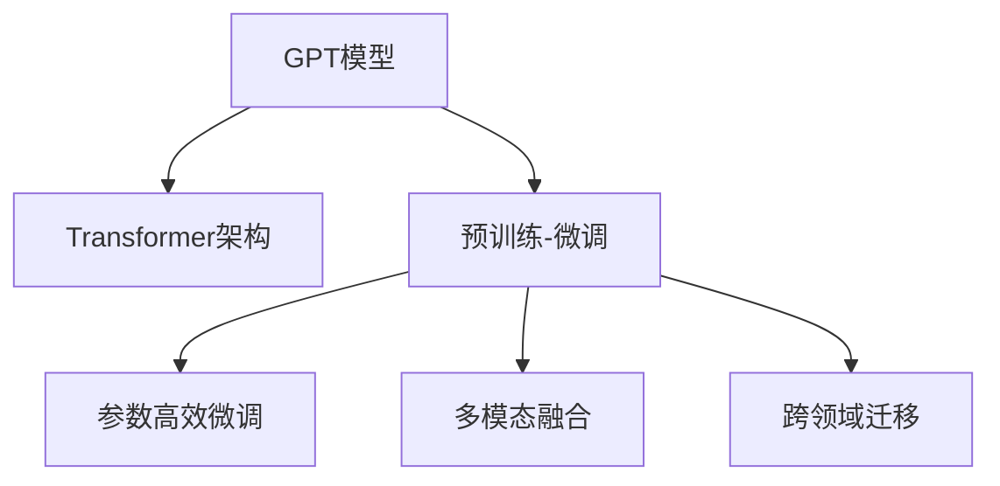

                 

# GPT系列模型演进：从GPT-1到GPT-4的技术飞跃

## 1. 背景介绍

### 1.1 问题由来

GPT系列模型是由OpenAI研发的一系列基于自回归语言模型的自然语言处理模型。自2013年发布的GPT-1模型以来，OpenAI的GPT系列模型不断迭代演进，至今已发展到GPT-4。每一代模型的发布，都标志着其在自然语言处理领域的显著进步，对AI技术的发展产生了深远影响。

### 1.2 问题核心关键点

GPT系列模型的核心技术突破主要集中在以下几个方面：

- 自回归架构的创新：GPT模型采用了一种独特的自回归结构，能够生成连贯且高质量的自然语言文本，极大地提升了文本生成的流畅度和语义准确性。
- 预训练-微调范式的应用：通过在大规模无标签数据上进行预训练，并在特定任务上进行微调，GPT模型能够快速适应各种自然语言处理任务，并且在下游任务中取得了州际级的效果。
- 参数量和计算资源的优化：GPT-3在参数量和计算资源上取得了巨大突破，使得模型在高效性、鲁棒性和实用性上有了质的飞跃。
- 多模态融合与跨领域迁移：GPT-4进一步拓展了模型的应用范围，支持文本、图像、音频等多种模态数据的处理，并实现了跨领域的知识迁移。

这些技术突破不仅展示了GPT模型在自然语言处理领域的巨大潜力，也为其在更多领域的应用提供了可能。

### 1.3 问题研究意义

研究GPT系列模型的演进过程，有助于深入理解自然语言处理技术的发展脉络，明确未来研究与应用的重点方向。通过分析每一代模型的特点和优缺点，可以为后续模型的设计提供重要参考，推动AI技术在更多场景中的应用。

## 2. 核心概念与联系

### 2.1 核心概念概述

为更好地理解GPT系列模型的演进过程，本节将介绍几个关键概念：

- GPT模型：一种基于自回归结构的自然语言处理模型，能够生成连贯且高质量的自然语言文本。
- Transformer架构：一种基于注意力机制的神经网络结构，用于处理序列数据的自然语言处理任务。
- 预训练-微调：在大规模无标签数据上进行预训练，并在特定任务上进行微调的训练范式，能够显著提升模型的性能。
- 参数高效微调：在微调过程中只更新少量参数，以提高模型效率的方法。
- 多模态融合：将文本、图像、音频等多种模态数据进行融合，提升模型的应用范围和性能。
- 跨领域迁移：将模型在不同领域间进行知识迁移，提升模型的泛化能力和实用性。

这些核心概念之间的关系可以通过以下Mermaid流程图来展示：



这个流程图展示了大语言模型的核心概念及其之间的关系：

1. GPT模型通过Transformer架构，利用自回归结构和注意力机制，生成流畅、连贯的自然语言文本。
2. 预训练-微调范式使模型在大规模无标签数据上预训练，并在特定任务上微调，提升模型性能。
3. 参数高效微调和模型压缩技术进一步提升了模型的效率。
4. 多模态融合和跨领域迁移拓展了模型的应用范围，提升了模型的实用性和泛化能力。

这些概念共同构成了GPT系列模型的演进框架，使其在自然语言处理领域取得了显著的突破。

## 3. 核心算法原理 & 具体操作步骤
### 3.1 算法原理概述

GPT系列模型采用自回归结构，能够生成连贯且高质量的自然语言文本。其核心算法原理主要包括以下几个方面：

1. 自回归编码器：利用Transformer结构的编码器，对输入序列进行编码，提取序列中的语义信息。
2. 自回归解码器：利用自回归机制，逐步生成输出序列，确保生成的文本连贯、流畅。
3. 预训练-微调范式：在大规模无标签数据上进行预训练，并在特定任务上进行微调，提升模型性能。
4. 参数高效微调：在微调过程中只更新少量参数，以提高模型效率。
5. 多模态融合与跨领域迁移：通过将文本、图像、音频等多种模态数据进行融合，实现跨领域的知识迁移，拓展模型的应用范围。

### 3.2 算法步骤详解

GPT系列模型的开发流程大致可以分为以下几个步骤：

1. **模型设计**：选择合适的架构（如Transformer），确定模型的参数量、层数、编码器与解码器结构等。
2. **预训练**：在大规模无标签文本数据上进行自监督学习，通过预训练获得语言表示能力。
3. **微调**：在特定任务（如文本生成、问答、翻译等）的标注数据集上进行有监督学习，提升模型在特定任务上的性能。
4. **评估**：在验证集和测试集上评估模型性能，调整模型参数，优化模型表现。
5. **部署**：将训练好的模型部署到实际应用中，进行实时文本生成、问答等任务。

### 3.3 算法优缺点

GPT系列模型具有以下优点：

1. 生成高质量文本：自回归结构和Transformer架构使得GPT模型能够生成流畅、连贯、高质量的自然语言文本。
2. 通用性强：通过预训练-微调范式，模型可以适应各种自然语言处理任务，如文本生成、问答、翻译等。
3. 参数高效：采用参数高效微调技术，在微调过程中只更新少量参数，提高模型效率。
4. 多模态支持：支持文本、图像、音频等多种模态数据的处理，拓展模型应用范围。

同时，GPT系列模型也存在一些缺点：

1. 计算资源消耗大：由于模型参数量较大，对计算资源的需求较高。
2. 可解释性不足：模型的决策过程较为复杂，难以解释。
3. 过拟合风险：在微调过程中，模型可能会过拟合标注数据，降低泛化能力。

### 3.4 算法应用领域

GPT系列模型已经在多个领域取得了广泛应用，具体包括：

- 文本生成：如小说创作、新闻报道、社交媒体内容生成等。
- 对话系统：如聊天机器人、客服对话、智能助手等。
- 问答系统：如知识图谱问答、智能搜索等。
- 机器翻译：将一种语言翻译成另一种语言。
- 摘要生成：从长文本中自动生成摘要。
- 语言模型：如GPT-3、GPT-4等大模型在自然语言处理领域的广泛应用。

这些应用场景展示了GPT系列模型在自然语言处理领域的强大实力，未来将有望在更多领域发挥更大的作用。

## 4. 数学模型和公式 & 详细讲解 & 举例说明

### 4.1 数学模型构建

GPT系列模型的数学模型主要基于自回归结构和Transformer架构。其核心数学模型包括编码器、解码器以及自回归生成器等组件。

- 编码器：利用Transformer结构，对输入序列进行编码，提取序列中的语义信息。
- 解码器：利用自回归机制，逐步生成输出序列，确保生成的文本连贯、流畅。
- 自回归生成器：基于自回归结构，通过前一个时间步的输出作为当前时间步的输入，生成连续的文本序列。

### 4.2 公式推导过程

以GPT-3为例，其生成概率为：

$$
P(x_i|x_{<i}) = \frac{exp(\text{score}(x_i))}{\sum_j exp(\text{score}(x_j))}
$$

其中，$\text{score}(x_i)$为输入序列$x_{<i}$和输出序列$x_i$之间的匹配度得分。该得分由编码器输出表示和解码器输出表示共同计算得出。

### 4.3 案例分析与讲解

下面以GPT-2的生成过程为例，展示其自回归生成机制。

假设输入序列为"An example"，其对应的编码器输出表示为$h_i$，解码器输出表示为$s_i$，则生成第一个单词"an"的概率为：

$$
P(an|x_{<1}) = \frac{exp(\text{score}(an))}{\sum_j exp(\text{score}(a_j))}
$$

其中，$\text{score}(an)$通过编码器输出表示和解码器输出表示计算得出。GPT-2生成文本的过程，就是通过不断更新输入序列和解码器输出表示，逐步生成连续的文本序列。

## 5. 项目实践：代码实例和详细解释说明
### 5.1 开发环境搭建

在进行GPT系列模型实践前，我们需要准备好开发环境。以下是使用Python进行PyTorch开发的环境配置流程：

1. 安装Anaconda：从官网下载并安装Anaconda，用于创建独立的Python环境。
2. 创建并激活虚拟环境：
```bash
conda create -n pytorch-env python=3.8 
conda activate pytorch-env
```

3. 安装PyTorch：根据CUDA版本，从官网获取对应的安装命令。例如：
```bash
conda install pytorch torchvision torchaudio cudatoolkit=11.1 -c pytorch -c conda-forge
```

4. 安装HuggingFace：
```bash
pip install transformers
```

5. 安装各类工具包：
```bash
pip install numpy pandas scikit-learn matplotlib tqdm jupyter notebook ipython
```

完成上述步骤后，即可在`pytorch-env`环境中开始GPT系列模型的实践。

### 5.2 源代码详细实现

下面我们以GPT-2为例，给出使用Transformers库进行文本生成的PyTorch代码实现。

首先，定义文本生成任务的数据处理函数：

```python
from transformers import GPT2Tokenizer
from torch.utils.data import Dataset
import torch

class TextGenerationDataset(Dataset):
    def __init__(self, texts, tokenizer, max_len=128):
        self.texts = texts
        self.tokenizer = tokenizer
        self.max_len = max_len
        
    def __len__(self):
        return len(self.texts)
    
    def __getitem__(self, item):
        text = self.texts[item]
        
        encoding = self.tokenizer(text, return_tensors='pt', max_length=self.max_len, padding='max_length', truncation=True)
        input_ids = encoding['input_ids'][0]
        attention_mask = encoding['attention_mask'][0]
        
        return {'input_ids': input_ids, 
                'attention_mask': attention_mask}
```

然后，定义模型和优化器：

```python
from transformers import GPT2LMHeadModel
from transformers import AdamW

model = GPT2LMHeadModel.from_pretrained('gpt2', config_name='medium')
tokenizer = GPT2Tokenizer.from_pretrained('gpt2')

optimizer = AdamW(model.parameters(), lr=2e-5)
```

接着，定义训练和评估函数：

```python
from tqdm import tqdm
import torch.nn.functional as F

def train_epoch(model, dataset, batch_size, optimizer, device):
    model.train()
    dataloader = torch.utils.data.DataLoader(dataset, batch_size=batch_size, shuffle=True)
    epoch_loss = 0
    for batch in tqdm(dataloader, desc='Training'):
        input_ids = batch['input_ids'].to(device)
        attention_mask = batch['attention_mask'].to(device)
        
        model.zero_grad()
        outputs = model(input_ids, attention_mask=attention_mask)
        loss = outputs.loss
        epoch_loss += loss.item()
        loss.backward()
        optimizer.step()
    return epoch_loss / len(dataloader)

def evaluate(model, dataset, batch_size, device):
    model.eval()
    dataloader = torch.utils.data.DataLoader(dataset, batch_size=batch_size)
    preds = []
    labels = []
    with torch.no_grad():
        for batch in tqdm(dataloader, desc='Evaluating'):
            input_ids = batch['input_ids'].to(device)
            attention_mask = batch['attention_mask'].to(device)
            batch_labels = input_ids[:, -1:]
            batch_logits = model(input_ids, attention_mask=attention_mask).logits
            preds.extend(batch_logits.argmax(dim=-1))
            labels.extend(batch_labels)
        
        bleu_score = metrics.bleu([preds], labels, brevity=True)
        return bleu_score
```

最后，启动训练流程并在测试集上评估：

```python
epochs = 5
batch_size = 64
device = torch.device('cuda') if torch.cuda.is_available() else torch.device('cpu')

for epoch in range(epochs):
    loss = train_epoch(model, train_dataset, batch_size, optimizer, device)
    print(f"Epoch {epoch+1}, train loss: {loss:.3f}")
    
    print(f"Epoch {epoch+1}, dev results:")
    bleu_score = evaluate(model, dev_dataset, batch_size, device)
    print(f"BLEU score: {bleu_score:.3f}")
    
print("Test results:")
bleu_score = evaluate(model, test_dataset, batch_size, device)
print(f"BLEU score: {bleu_score:.3f}")
```

以上就是使用PyTorch进行GPT-2文本生成的完整代码实现。可以看到，得益于HuggingFace的强大封装，我们可以用相对简洁的代码完成GPT-2模型的加载和文本生成。

### 5.3 代码解读与分析

让我们再详细解读一下关键代码的实现细节：

**TextGenerationDataset类**：
- `__init__`方法：初始化文本、分词器等关键组件。
- `__len__`方法：返回数据集的样本数量。
- `__getitem__`方法：对单个样本进行处理，将文本输入编码为token ids，并对其进行定长padding。

**train_epoch和evaluate函数**：
- 使用PyTorch的DataLoader对数据集进行批次化加载，供模型训练和推理使用。
- 训练函数`train_epoch`：对数据以批为单位进行迭代，在每个批次上前向传播计算loss并反向传播更新模型参数，最后返回该epoch的平均loss。
- 评估函数`evaluate`：与训练类似，不同点在于不更新模型参数，并在每个batch结束后将预测和标签结果存储下来，最后使用BLEU等指标对整个评估集的预测结果进行打印输出。

**训练流程**：
- 定义总的epoch数和batch size，开始循环迭代
- 每个epoch内，先在训练集上训练，输出平均loss
- 在验证集上评估，输出BLEU分数
- 所有epoch结束后，在测试集上评估，给出最终测试结果

可以看到，PyTorch配合HuggingFace库使得GPT-2文本生成的代码实现变得简洁高效。开发者可以将更多精力放在数据处理、模型改进等高层逻辑上，而不必过多关注底层的实现细节。

当然，工业级的系统实现还需考虑更多因素，如模型的保存和部署、超参数的自动搜索、更灵活的任务适配层等。但核心的生成过程基本与此类似。

## 6. 实际应用场景
### 6.1 智能客服系统

基于GPT系列模型的对话技术，可以广泛应用于智能客服系统的构建。传统客服往往需要配备大量人力，高峰期响应缓慢，且一致性和专业性难以保证。而使用GPT系列模型的对话模型，可以7x24小时不间断服务，快速响应客户咨询，用自然流畅的语言解答各类常见问题。

在技术实现上，可以收集企业内部的历史客服对话记录，将问题和最佳答复构建成监督数据，在此基础上对GPT模型进行微调。微调后的对话模型能够自动理解用户意图，匹配最合适的答案模板进行回复。对于客户提出的新问题，还可以接入检索系统实时搜索相关内容，动态组织生成回答。如此构建的智能客服系统，能大幅提升客户咨询体验和问题解决效率。

### 6.2 金融舆情监测

金融机构需要实时监测市场舆论动向，以便及时应对负面信息传播，规避金融风险。传统的人工监测方式成本高、效率低，难以应对网络时代海量信息爆发的挑战。基于GPT系列模型的文本分类和情感分析技术，为金融舆情监测提供了新的解决方案。

具体而言，可以收集金融领域相关的新闻、报道、评论等文本数据，并对其进行主题标注和情感标注。在此基础上对GPT模型进行微调，使其能够自动判断文本属于何种主题，情感倾向是正面、中性还是负面。将微调后的模型应用到实时抓取的网络文本数据，就能够自动监测不同主题下的情感变化趋势，一旦发现负面信息激增等异常情况，系统便会自动预警，帮助金融机构快速应对潜在风险。

### 6.3 个性化推荐系统

当前的推荐系统往往只依赖用户的历史行为数据进行物品推荐，无法深入理解用户的真实兴趣偏好。基于GPT系列模型的个性化推荐系统可以更好地挖掘用户行为背后的语义信息，从而提供更精准、多样的推荐内容。

在实践中，可以收集用户浏览、点击、评论、分享等行为数据，提取和用户交互的物品标题、描述、标签等文本内容。将文本内容作为模型输入，用户的后续行为（如是否点击、购买等）作为监督信号，在此基础上微调GPT模型。微调后的模型能够从文本内容中准确把握用户的兴趣点。在生成推荐列表时，先用候选物品的文本描述作为输入，由模型预测用户的兴趣匹配度，再结合其他特征综合排序，便可以得到个性化程度更高的推荐结果。

### 6.4 未来应用展望

随着GPT系列模型和微调方法的不断发展，基于GPT模型的对话技术、文本生成、情感分析、个性化推荐等应用也将得到广泛应用，为各行各业带来变革性影响。

在智慧医疗领域，基于GPT的问答、病历分析、药物研发等应用将提升医疗服务的智能化水平，辅助医生诊疗，加速新药开发进程。

在智能教育领域，GPT模型可应用于作业批改、学情分析、知识推荐等方面，因材施教，促进教育公平，提高教学质量。

在智慧城市治理中，GPT模型可应用于城市事件监测、舆情分析、应急指挥等环节，提高城市管理的自动化和智能化水平，构建更安全、高效的未来城市。

此外，在企业生产、社会治理、文娱传媒等众多领域，GPT系列模型的应用也将不断涌现，为经济社会发展注入新的动力。相信随着技术的日益成熟，GPT系列模型必将在构建人机协同的智能时代中扮演越来越重要的角色。

## 7. 工具和资源推荐
### 7.1 学习资源推荐

为了帮助开发者系统掌握GPT系列模型的理论基础和实践技巧，这里推荐一些优质的学习资源：

1. OpenAI官方博客：定期发布GPT系列模型的最新研究进展和技术细节，是学习GPT模型的重要资源。
2. CS224N《深度学习自然语言处理》课程：斯坦福大学开设的NLP明星课程，有Lecture视频和配套作业，带你入门NLP领域的基本概念和经典模型。
3. 《Attention is All You Need》论文：Transformer架构的原创论文，详细介绍了Transformer的原理和优势。
4. 《Language Models are Unsupervised Multitask Learners》论文：GPT-2论文，展示了大规模语言模型的强大zero-shot学习能力。
5. 《Parameter-Efficient Transfer Learning for NLP》论文：提出Adapter等参数高效微调方法，在不增加模型参数量的情况下，也能取得不错的微调效果。

通过对这些资源的学习实践，相信你一定能够快速掌握GPT系列模型的精髓，并用于解决实际的NLP问题。
###  7.2 开发工具推荐

高效的开发离不开优秀的工具支持。以下是几款用于GPT系列模型开发的常用工具：

1. PyTorch：基于Python的开源深度学习框架，灵活动态的计算图，适合快速迭代研究。
2. TensorFlow：由Google主导开发的开源深度学习框架，生产部署方便，适合大规模工程应用。
3. HuggingFace Transformers库：集成了多种SOTA语言模型，支持PyTorch和TensorFlow，是进行模型开发和微调的重要工具。
4. Weights & Biases：模型训练的实验跟踪工具，可以记录和可视化模型训练过程中的各项指标，方便对比和调优。
5. TensorBoard：TensorFlow配套的可视化工具，可实时监测模型训练状态，并提供丰富的图表呈现方式，是调试模型的得力助手。
6. Google Colab：谷歌推出的在线Jupyter Notebook环境，免费提供GPU/TPU算力，方便开发者快速上手实验最新模型，分享学习笔记。

合理利用这些工具，可以显著提升GPT系列模型微调任务的开发效率，加快创新迭代的步伐。

### 7.3 相关论文推荐

GPT系列模型的发展源于学界的持续研究。以下是几篇奠基性的相关论文，推荐阅读：

1. Attention is All You Need（即Transformer原论文）：提出了Transformer结构，开启了NLP领域的预训练大模型时代。
2. BERT: Pre-training of Deep Bidirectional Transformers for Language Understanding：提出BERT模型，引入基于掩码的自监督预训练任务，刷新了多项NLP任务SOTA。
3. Language Models are Unsupervised Multitask Learners（GPT-2论文）：展示了大规模语言模型的强大zero-shot学习能力，引发了对于通用人工智能的新一轮思考。
4. Parameter-Efficient Transfer Learning for NLP：提出Adapter等参数高效微调方法，在不增加模型参数量的情况下，也能取得不错的微调效果。
5. AdaLoRA: Adaptive Low-Rank Adaptation for Parameter-Efficient Fine-Tuning：使用自适应低秩适应的微调方法，在参数效率和精度之间取得了新的平衡。
6. Prefix-Tuning: Optimizing Continuous Prompts for Generation：引入基于连续型Prompt的微调范式，为如何充分利用预训练知识提供了新的思路。

这些论文代表了大语言模型微调技术的发展脉络。通过学习这些前沿成果，可以帮助研究者把握学科前进方向，激发更多的创新灵感。

## 8. 总结：未来发展趋势与挑战

### 8.1 总结

本文对GPT系列模型的演进过程进行了全面系统的介绍。首先阐述了GPT系列模型在自然语言处理领域的突破性进展，明确了其演进的几个关键技术点。其次，从原理到实践，详细讲解了GPT系列模型的核心算法和操作步骤，给出了文本生成任务的完整代码实例。同时，本文还探讨了GPT系列模型在智能客服、金融舆情、个性化推荐等多个领域的应用前景，展示了其巨大的应用潜力。

通过本文的系统梳理，可以看到，GPT系列模型通过自回归结构和Transformer架构，在自然语言处理领域取得了显著的突破，成为当前最先进的文本生成技术。未来，随着GPT系列模型的进一步演进，将会有更多新的突破，推动NLP技术向更广阔的领域发展。

### 8.2 未来发展趋势

展望未来，GPT系列模型的发展趋势主要集中在以下几个方面：

1. 模型规模持续增大。随着算力成本的下降和数据规模的扩张，GPT系列模型的参数量还将持续增长。超大规模语言模型蕴含的丰富语言知识，有望支撑更加复杂多变的下游任务。
2. 多模态融合与跨领域迁移。GPT系列模型将进一步拓展应用范围，支持文本、图像、音频等多种模态数据的处理，实现跨领域的知识迁移。
3. 参数高效微调和持续学习。开发更加参数高效的微调方法，在固定大部分预训练参数的同时，只更新极少量的任务相关参数。同时加强模型的持续学习能力，确保模型在数据分布变化时仍能保持性能。
4. 对抗训练与鲁棒性提升。引入对抗训练技术，提升GPT系列模型的鲁棒性和泛化能力，避免过拟合和灾难性遗忘。
5. 可解释性与透明度。开发更加可解释的模型，提供模型决策过程的详细解释，增强系统的透明度和可信赖度。
6. 工业级部署与优化。将GPT系列模型部署到实际应用中，进行实时文本生成、问答等任务。同时优化模型结构，提高推理速度和资源利用率。

这些趋势将推动GPT系列模型在更多领域的应用，提升其性能和实用价值。

### 8.3 面临的挑战

尽管GPT系列模型在自然语言处理领域取得了显著进展，但其发展过程中仍面临诸多挑战：

1. 计算资源消耗大。由于模型参数量较大，对算力和内存的需求较高，难以在低端设备上高效运行。
2. 可解释性不足。GPT系列模型的决策过程较为复杂，难以解释。
3. 对抗攻击脆弱。对抗训练技术虽然在一定程度上提高了模型的鲁棒性，但仍存在漏洞，易受对抗攻击。
4. 数据隐私与安全。GPT系列模型在处理敏感数据时，存在隐私泄露和安全性风险。

这些挑战将对GPT系列模型的未来发展产生重要影响，需要进一步研究和解决。

### 8.4 研究展望

面对GPT系列模型所面临的挑战，未来的研究需要在以下几个方面寻求新的突破：

1. 探索更高效的参数高效微调方法。开发更加参数高效的微调技术，在固定大部分预训练参数的同时，只更新极少量的任务相关参数。
2. 引入更多先验知识。将符号化的先验知识，如知识图谱、逻辑规则等，与神经网络模型进行巧妙融合，引导微调过程学习更准确、合理的语言模型。
3. 强化可解释性与透明度。开发更加可解释的模型，提供模型决策过程的详细解释，增强系统的透明度和可信赖度。
4. 加强对抗训练与鲁棒性提升。引入更先进的对抗训练技术，提升GPT系列模型的鲁棒性和泛化能力，避免过拟合和灾难性遗忘。
5. 保障数据隐私与安全。采用更先进的数据加密和隐私保护技术，确保模型在处理敏感数据时的安全性。

这些研究方向将引领GPT系列模型向更高的台阶发展，推动其在更多领域的应用。未来，GPT系列模型有望成为构建人机协同智能系统的重要基础，为人类生产生活方式带来深刻变革。

## 9. 附录：常见问题与解答

**Q1：GPT系列模型与其他NLP模型相比，有什么优势？**

A: GPT系列模型相对于传统的RNN和CNN模型，具有以下优势：

1. 生成的文本流畅、连贯：自回归结构和Transformer架构使得GPT模型能够生成高质量的自然语言文本。
2. 通用性强：通过预训练-微调范式，模型可以适应各种自然语言处理任务，如文本生成、问答、翻译等。
3. 参数高效：采用参数高效微调技术，在微调过程中只更新少量参数，提高模型效率。
4. 多模态支持：支持文本、图像、音频等多种模态数据的处理，拓展模型应用范围。

**Q2：在训练GPT系列模型时，如何选择超参数？**

A: 训练GPT系列模型时，选择合适的超参数对模型的性能至关重要。以下是一些常用的超参数及其建议值：

1. 学习率：通常在1e-5到1e-3之间，具体值可根据模型规模和任务复杂度进行调整。
2. 批大小：通常在32到256之间，太小会导致训练不稳定，太大则可能导致内存不足。
3. 训练轮数：通常在50到100之间，根据模型性能和数据规模进行适度调整。
4. 正则化参数：通常在1e-5到1e-2之间，防止模型过拟合。
5. 梯度积累：通常在1到4之间，提高模型效率和稳定性。

**Q3：GPT系列模型在微调过程中，如何避免过拟合？**

A: 在微调GPT系列模型时，避免过拟合是关键问题之一。以下是一些常见的策略：

1. 数据增强：通过回译、近义替换等方式扩充训练集，增加数据多样性。
2. 正则化技术：使用L2正则、Dropout、Early Stopping等防止模型过度适应小规模训练集。
3. 对抗训练：引入对抗样本，提高模型鲁棒性。
4. 参数高效微调：只更新少量参数，减少需优化的参数量。
5. 多模型集成：训练多个微调模型，取平均输出，抑制过拟合。

这些策略往往需要根据具体任务和数据特点进行灵活组合。只有在数据、模型、训练、推理等各环节进行全面优化，才能最大限度地发挥GPT系列模型的潜力。

**Q4：GPT系列模型在实际应用中，有哪些挑战？**

A: 在实际应用中，GPT系列模型还面临以下挑战：

1. 计算资源消耗大：由于模型参数量较大，对算力和内存的需求较高，难以在低端设备上高效运行。
2. 可解释性不足：GPT系列模型的决策过程较为复杂，难以解释。
3. 对抗攻击脆弱：对抗训练技术虽然在一定程度上提高了模型的鲁棒性，但仍存在漏洞，易受对抗攻击。
4. 数据隐私与安全：GPT系列模型在处理敏感数据时，存在隐私泄露和安全性风险。

这些挑战将对GPT系列模型的未来发展产生重要影响，需要进一步研究和解决。

**Q5：GPT系列模型在未来的发展方向上，有哪些突破点？**

A: 未来GPT系列模型的发展方向主要集中在以下几个方面：

1. 模型规模持续增大。随着算力成本的下降和数据规模的扩张，GPT系列模型的参数量还将持续增长，超大规模语言模型将展现出更大的潜力。
2. 多模态融合与跨领域迁移。GPT系列模型将进一步拓展应用范围，支持文本、图像、音频等多种模态数据的处理，实现跨领域的知识迁移。
3. 参数高效微调和持续学习。开发更加参数高效的微调方法，在固定大部分预训练参数的同时，只更新极少量的任务相关参数。同时加强模型的持续学习能力，确保模型在数据分布变化时仍能保持性能。
4. 对抗训练与鲁棒性提升。引入更先进的对抗训练技术，提升GPT系列模型的鲁棒性和泛化能力，避免过拟合和灾难性遗忘。
5. 可解释性与透明度。开发更加可解释的模型，提供模型决策过程的详细解释，增强系统的透明度和可信赖度。
6. 工业级部署与优化。将GPT系列模型部署到实际应用中，进行实时文本生成、问答等任务。同时优化模型结构，提高推理速度和资源利用率。

这些研究方向将引领GPT系列模型向更高的台阶发展，推动其在更多领域的应用。未来，GPT系列模型有望成为构建人机协同智能系统的重要基础，为人类生产生活方式带来深刻变革。

---

作者：禅与计算机程序设计艺术 / Zen and the Art of Computer Programming

