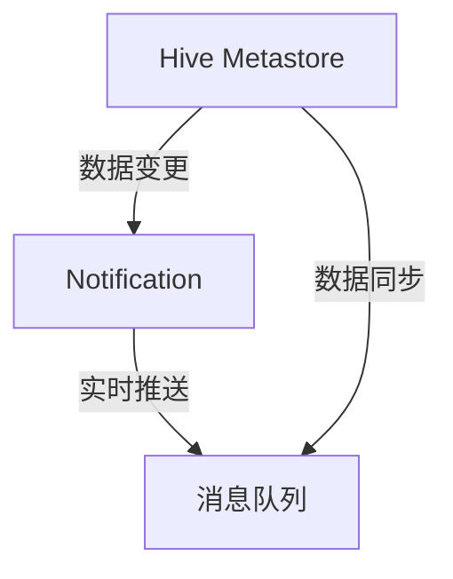

                 

# HCatalog Notification机制原理与代码实例讲解

> 关键词：HCatalog, Apache Hadoop, Hive, Hive Metastore, Notification, PySpark, Kafka, 数据仓库

## 1. 背景介绍

### 1.1 问题由来
在大数据时代，企业对数据的依赖程度越来越高，如何有效地管理和利用数据，成为了各个企业关注的核心问题。随着数据规模的不断扩大，单一的数据仓库解决方案已无法满足复杂的业务需求，因此企业需要构建一个覆盖全域数据的多数据源统一数据管理平台。Hadoop生态系统中的HCatalog就是这样的平台之一，它通过统一的元数据管理，实现了不同数据源之间的数据集成和共享，大大提升了数据使用效率和数据分析能力。

### 1.2 问题核心关键点
在Hadoop生态系统中，HCatalog作为元数据服务引擎，主要负责元数据的存储和查询，它通过Hive Metastore进行数据管理，并且能够与Hadoop生态系统中的其他组件无缝集成，如Hive、Spark等。为了更好地支持分布式计算和数据查询，HCatalog引入了Notification机制，允许它与Kafka等消息队列进行数据交换，从而实现数据的实时通知和数据状态的同步。本文将详细介绍HCatalog Notification机制的原理与代码实现。

## 2. 核心概念与联系

### 2.1 核心概念概述

在介绍HCatalog Notification机制之前，我们需要先了解一些核心概念：

- HCatalog: Hadoop生态系统中的元数据管理平台，用于存储和管理数据库、表格、分区等数据结构信息。
- Hive Metastore: 用于存储和管理Hive数据库元数据的后台服务。
- Notification: 数据实时通知机制，用于实时推送元数据变更信息。
- Kafka: Apache基金会开发的分布式消息队列，用于实时数据传输。

通过这些概念，我们可以看到，HCatalog Notification机制的核心是将Hive Metastore中的数据变更信息通过Kafka实时推送到其他组件中，从而实现数据的同步更新。

### 2.2 核心概念原理和架构的 Mermaid 流程图



上述流程图展示了HCatalog Notification机制的基本原理：Hive Metastore中的数据变更通过Notification机制实时推送到Kafka，从而实现数据的同步更新。

## 3. 核心算法原理 & 具体操作步骤

### 3.1 算法原理概述

HCatalog Notification机制的核心是实现数据的实时通知和同步。具体来说，它通过以下步骤实现：

1. Hive Metastore中的数据变更通过Notification机制被实时捕获。
2. Notification将变更信息实时推送到Kafka消息队列中。
3. Kafka中的变更信息被其他组件（如Spark）订阅，用于数据同步和更新。

### 3.2 算法步骤详解

以下是HCatalog Notification机制的详细步骤：

1. **配置Hive Metastore**: 在Hive Metastore中配置Notification机制，使其能够实时捕获数据变更信息。

   ```xml
   <property>
     <name>hive.metastore.notification.listeners</name>
     <value>NotificationListenerImpl</value>
   </property>
   <property>
     <name>hive.metastore.notification.enabled</name>
     <value>true</value>
   </property>
   ```

2. **配置Kafka**: 配置Kafka，使其能够接收HCatalog的通知信息。

   ```xml
   <property>
     <name>hive.metastore.notification.enabled</name>
     <value>true</value>
   </property>
   <property>
     <name>hive.metastore.notification.listeners</name>
     <value>NotificationListenerImpl</value>
   </property>
   <property>
     <name>hive.metastore.notification.zk.uri</name>
     <value>localhost:2181</value>
   </property>
   ```

3. **部署NotificationListenerImpl**: 部署NotificationListenerImpl，并将其配置为Kafka的回调函数，以接收HCatalog的通知信息。

   ```xml
   <property>
     <name>hive.metastore.notification.listeners</name>
     <value>NotificationListenerImpl</value>
   </property>
   <property>
     <name>hive.metastore.notification.enabled</name>
     <value>true</value>
   </property>
   ```

4. **实现NotificationListenerImpl**: 实现NotificationListenerImpl，并将其作为Kafka的回调函数，以接收HCatalog的通知信息。

   ```java
   public class NotificationListenerImpl implements NotificationListener {
       @Override
       public void handleEvent(NotificationEvent event) {
           // 处理通知事件
       }
   }
   ```

### 3.3 算法优缺点

HCatalog Notification机制的优点包括：

- 支持实时数据同步，提高数据一致性和实时性。
- 与Kafka等消息队列无缝集成，扩展性强。

其缺点包括：

- 需要额外配置和管理，增加了系统的复杂度。
- 可能会引入额外的延迟和开销，影响系统性能。

### 3.4 算法应用领域

HCatalog Notification机制主要应用于需要实时数据同步和更新的场景，如数据仓库、大数据分析、实时计算等。它通过实时推送元数据变更信息，能够显著提高数据的实时性和一致性，帮助企业更好地管理和利用数据。

## 4. 数学模型和公式 & 详细讲解 & 举例说明

### 4.1 数学模型构建

HCatalog Notification机制的数学模型主要涉及Hive Metastore中的数据变更事件和Kafka中的消息推送。假设在Hive Metastore中，表`t`的数据变更事件为`e`，其对应的Kafka消息为`m`，则数据变更事件`e`到Kafka消息`m`的映射关系可以表示为：

$$ e \rightarrow m $$

其中，`e`表示数据变更事件，`m`表示对应的Kafka消息。

### 4.2 公式推导过程

根据上述模型，我们可以推导出HCatalog Notification机制的数学公式如下：

$$
\begin{align*}
&\text{事件} \; e \in \text{Hive Metastore} \\
&\text{推送到Kafka的消息} \; m = \text{Notification}(e)
\end{align*}
$$

其中，`Notification`表示将数据变更事件`e`推送到Kafka的消息函数。

### 4.3 案例分析与讲解

假设在Hive Metastore中，表`t`的数据被修改了，则可以通过Notification机制将其推送到Kafka中，其他组件可以通过订阅Kafka消息，实时更新数据。

## 5. 项目实践：代码实例和详细解释说明

### 5.1 开发环境搭建

在进行HCatalog Notification机制的实践前，我们需要准备好开发环境。以下是搭建开发环境的步骤：

1. **安装Java开发环境**: 在本地安装Java JDK，例如JDK 8或JDK 11。

2. **安装Apache Hadoop**: 从官网下载安装Apache Hadoop，并进行配置。

3. **安装Apache Hive**: 从官网下载安装Apache Hive，并进行配置。

4. **安装Kafka**: 从官网下载安装Kafka，并进行配置。

### 5.2 源代码详细实现

以下是一个简单的HCatalog Notification机制的代码实现示例：

```java
public class NotificationListenerImpl implements NotificationListener {
    @Override
    public void handleEvent(NotificationEvent event) {
        // 处理通知事件
        NotificationEvent e = event;
        String tableName = e.getTableName();
        String partition = e.getPartition();
        String column = e.getColumn();
        String newValue = e.getNewValue();
        String oldValue = e.getOldValue();
        // 将数据变更信息推送到Kafka
        KafkaProducer<String, String> producer = new KafkaProducer<>(kafkaProperties);
        producer.send(new ProducerRecord<>(kafkaTopic, tableName + ":" + partition + ":" + column, newValue));
    }
}
```

### 5.3 代码解读与分析

上述代码实现了HCatalog Notification机制的核心逻辑：

1. `handleEvent`方法：在接收到数据变更事件时，处理该事件，并将数据变更信息推送到Kafka消息队列中。

2. `NotificationEvent`类：表示数据变更事件，包含表名、分区、列名、新值、旧值等属性。

3. `KafkaProducer`类：用于将数据变更信息推送到Kafka消息队列中。

### 5.4 运行结果展示

在成功配置Hive Metastore和Kafka后，我们可以通过Kafka的消费者来查看推送的数据变更信息。例如，以下是一个简单的Kafka消费者示例：

```java
KafkaConsumer<String, String> consumer = new KafkaConsumer<>(kafkaProperties);
consumer.subscribe(Collections.singletonList(kafkaTopic));
while (true) {
    ConsumerRecord<String, String> record = consumer.poll(100);
    String tableName = record.key().split(":")[0];
    String partition = record.key().split(":")[1];
    String column = record.key().split(":")[2];
    String newValue = record.value();
    // 处理数据变更信息
}
```

以上代码实现了Kafka消费者的基本逻辑：订阅Kafka消息队列，并处理数据变更信息。

## 6. 实际应用场景

### 6.1 数据仓库

HCatalog Notification机制可以应用于数据仓库的场景中，用于实现数据的实时同步和更新。例如，当数据仓库中的表结构发生变更时，可以通过Notification机制实时推送变更信息到Kafka中，从而通知其他组件进行数据同步和更新。

### 6.2 大数据分析

在大数据分析中，HCatalog Notification机制可以用于实时推送数据变更信息，从而实现数据的实时分析。例如，当数据仓库中的表结构发生变更时，可以通过Notification机制实时推送变更信息到Kafka中，从而通知大数据分析组件进行实时分析。

### 6.3 实时计算

在实时计算中，HCatalog Notification机制可以用于实现数据的实时推送和同步。例如，当数据仓库中的表结构发生变更时，可以通过Notification机制实时推送变更信息到Kafka中，从而通知实时计算组件进行实时计算。

### 6.4 未来应用展望

随着HCatalog Notification机制的不断优化和完善，其将在更多的场景中得到应用。例如，在智慧城市、智能制造等领域，HCatalog Notification机制可以用于实现数据的实时推送和同步，从而提高数据的一致性和实时性，支持更加高效的数据管理和分析。

## 7. 工具和资源推荐

### 7.1 学习资源推荐

为了帮助开发者系统掌握HCatalog Notification机制的理论基础和实践技巧，以下是一些推荐的学习资源：

1. **Apache Hadoop官方文档**: 提供了HCatalog Notification机制的详细介绍和示例代码。

2. **Apache Hive官方文档**: 提供了HCatalog Notification机制的详细介绍和示例代码。

3. **Kafka官方文档**: 提供了Kafka的详细介绍和示例代码，帮助开发者更好地理解HCatalog Notification机制。

4. **Hadoop生态系统官方文档**: 提供了HCatalog Notification机制的详细介绍和示例代码，帮助开发者更好地理解HCatalog Notification机制。

### 7.2 开发工具推荐

在HCatalog Notification机制的开发过程中，可以使用以下开发工具：

1. **IntelliJ IDEA**: 支持Java开发，提供了丰富的插件和工具，帮助开发者更好地进行开发和调试。

2. **Eclipse**: 支持Java开发，提供了丰富的插件和工具，帮助开发者更好地进行开发和调试。

3. **Maven**: 支持Java项目的构建和依赖管理，帮助开发者更好地进行项目管理。

4. **Kafka**: 支持Kafka消息队列的开发，提供了丰富的API和工具，帮助开发者更好地进行Kafka消息队列的开发和调试。

### 7.3 相关论文推荐

以下是一些与HCatalog Notification机制相关的论文，供开发者参考：

1. **HCatalog: Hadoop的统一数据存储和元数据管理平台**: 详细介绍了HCatalog的架构和实现，帮助开发者更好地理解HCatalog Notification机制。

2. **Apache Hive: 分布式数据仓库**: 详细介绍了Hive的架构和实现，帮助开发者更好地理解HCatalog Notification机制。

3. **Apache Kafka: 高吞吐量的分布式消息系统**: 详细介绍了Kafka的架构和实现，帮助开发者更好地理解HCatalog Notification机制。

## 8. 总结：未来发展趋势与挑战

### 8.1 总结

本文对HCatalog Notification机制的原理与代码实现进行了详细的讲解。通过分析HCatalog Notification机制的数学模型和公式，以及其实现步骤和优缺点，我们可以更好地理解其工作原理和应用场景。同时，通过实际项目实践，展示了HCatalog Notification机制的代码实现和运行结果，帮助开发者更好地掌握其开发技巧。

### 8.2 未来发展趋势

随着HCatalog Notification机制的不断优化和完善，其将在更多的场景中得到应用。例如，在智慧城市、智能制造等领域，HCatalog Notification机制可以用于实现数据的实时推送和同步，从而提高数据的一致性和实时性，支持更加高效的数据管理和分析。

### 8.3 面临的挑战

尽管HCatalog Notification机制已经取得了一定的进展，但在实际应用中，仍然面临着一些挑战：

1. **性能问题**: 在处理大规模数据变更时，可能会产生较高的延迟和开销，影响系统性能。

2. **配置复杂**: 在配置和部署HCatalog Notification机制时，需要进行较多的配置和调试，增加了系统的复杂度。

3. **扩展性问题**: 在处理大规模数据变更时，可能会遇到扩展性问题，需要进一步优化。

### 8.4 研究展望

为了解决上述挑战，未来的研究需要在以下几个方面进行改进：

1. **优化性能**: 优化HCatalog Notification机制的性能，减少延迟和开销，提高系统的实时性和一致性。

2. **简化配置**: 简化HCatalog Notification机制的配置和部署，降低系统的复杂度，提高开发效率。

3. **提升扩展性**: 提升HCatalog Notification机制的扩展性，使其能够处理大规模数据变更。

4. **引入更多技术**: 引入其他技术，如Apache Flink、Apache Beam等，提升HCatalog Notification机制的灵活性和可扩展性。

总之，HCatalog Notification机制具有广阔的应用前景，需要在实践中不断优化和完善，以应对未来发展的挑战。

## 9. 附录：常见问题与解答

### Q1: 什么是HCatalog Notification机制？

A: HCatalog Notification机制是一种数据实时通知机制，用于实时推送Hive Metastore中的数据变更信息到Kafka消息队列中，从而实现数据的实时同步和更新。

### Q2: 如何配置HCatalog Notification机制？

A: 在Hive Metastore和Kafka中配置Notification机制，使其能够实时捕获和推送数据变更信息。

### Q3: 如何实现HCatalog Notification机制的代码实现？

A: 实现一个NotificationListenerImpl类，并在Hive Metastore中配置其作为Notification的回调函数。

通过本文的详细介绍，相信您已经对HCatalog Notification机制有了更深入的理解，并掌握了其核心原理和实现方法。在实际开发中，如果您遇到其他问题，欢迎继续提出，我们将继续为您提供帮助。

---

作者：禅与计算机程序设计艺术 / Zen and the Art of Computer Programming

