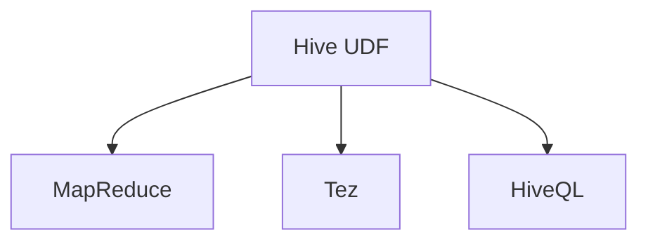

                 

# Hive UDF自定义函数原理与代码实例讲解

> 关键词：Hive UDF, 自定义函数, 代码实现, 数据库开发, 大数据分析

## 1. 背景介绍

### 1.1 问题由来

在大数据时代，企业的运营、业务分析等活动产生了海量数据。这些数据往往存储在各种类型的数据库中，如MySQL、Oracle、SQL Server等，其中Hive作为一种分布式数据仓库，因其开源、灵活、兼容性强等优点，广泛应用于各种大型企业的应用中。然而，Hive提供了一些预定义的函数来处理数据，这些函数通常无法满足所有复杂的应用需求。在这种情况下，就需要使用用户自定义函数(UDF)来扩展Hive的功能。

### 1.2 问题核心关键点

Hive UDF的开发主要包括以下几个关键点：

- 理解Hive的编程模型和函数接口。
- 掌握Java或Scala语言，能够编写高效的计算逻辑。
- 熟悉分布式计算环境，确保函数在多个节点上都能正确执行。
- 理解Hive中的数据类型和数据流控制。
- 了解如何优化UDF函数的性能和内存使用。

通过掌握这些关键点，开发者可以高效开发符合业务需求的Hive UDF函数，提升大数据分析的效率和准确性。

## 2. 核心概念与联系

### 2.1 核心概念概述

为了更好地理解Hive UDF的开发，本节将介绍几个密切相关的核心概念：

- Hive UDF：Hive用户自定义函数，用于扩展Hive的数据处理功能，支持更灵活的数据处理逻辑。
- MapReduce：Hive的分布式计算引擎，通过MapReduce框架实现数据并行处理。
- Tez：Hive的另一个分布式计算引擎，提供了更高的执行效率和更多的编程接口。
- HiveQL：Hive的查询语言，与SQL类似，用于查询和分析数据。

这些核心概念之间的逻辑关系可以通过以下Mermaid流程图来展示：



这个流程图展示了Hive UDF在Hive中的角色：
1. Hive UDF通过MapReduce或Tez计算框架在Hive集群上执行。
2. Hive UDF可以通过HiveQL查询调用，与Hive的其他内置函数一起使用。

## 3. 核心算法原理 & 具体操作步骤

### 3.1 算法原理概述

Hive UDF的开发原理包括以下几个关键点：

1. 函数接口定义：用户需要定义函数接口，即输入参数和返回值。
2. 函数实现：用户需要实现具体的函数逻辑。
3. 函数注册：用户需要将函数编译并注册到Hive中，使其能够被调用。
4. 函数执行：在HiveQL查询中使用自定义函数时，Hive会自动找到注册的函数并执行。

### 3.2 算法步骤详解

#### 3.2.1 函数接口定义

Hive UDF的函数接口定义一般包括输入参数、返回值和异常处理。以一个简单的UDF函数为例：

```java
public interface ExampleUDF {
    public String calculate(String input) throws IOException;
}
```

上述代码定义了一个名为`calculate`的函数，它接受一个字符串作为输入，返回一个字符串作为输出，可能会抛出IOException异常。

#### 3.2.2 函数实现

函数实现是Hive UDF的核心部分，通常需要根据业务需求编写高效的计算逻辑。以下是一个简单的Java实现示例：

```java
public class ExampleUDFImpl implements ExampleUDF {
    public String calculate(String input) throws IOException {
        // 实现具体的计算逻辑
        return "Result";
    }
}
```

上述代码实现了一个名为`calculate`的函数，接受一个字符串作为输入，返回一个字符串作为输出。在函数实现中，可以根据具体需求编写复杂的计算逻辑，如字符串拼接、条件判断、循环等。

#### 3.2.3 函数注册

函数注册是将编写的Hive UDF函数编译并注册到Hive中的过程。以下是一个简单的Scala实现示例：

```scala
import org.apache.hadoop.hive.ql.exec.UDF
import org.apache.hadoop.hive.ql.metadata.HiveUDFRegistrationInfo

class ExampleUDF extends UDF1 { 
    override def evaluate(input: String): String = {
        "Result"
    }
}

val exampleUDFInfo = new HiveUDFRegistrationInfo(ExampleUDF(), 
    "example.udf", "Calculate a result.")
```

上述代码注册了一个名为`ExampleUDF`的Hive UDF函数，并将其信息存储在`HiveUDFRegistrationInfo`对象中，以便后续调用。

#### 3.2.4 函数执行

在HiveQL查询中使用自定义函数时，Hive会自动找到注册的函数并执行。以下是一个简单的HiveQL查询示例：

```sql
select example_udf(input_column) from table_name;
```

上述代码使用自定义函数`example_udf`对表`table_name`中的列`input_column`进行计算，并返回计算结果。

### 3.3 算法优缺点

Hive UDF具有以下优点：

1. 灵活性高：Hive UDF可以处理各种复杂的数据处理逻辑，支持自定义函数接口。
2. 易于扩展：Hive UDF可以与Hive的其他内置函数一起使用，扩展Hive的数据处理能力。
3. 兼容性好：Hive UDF可以与其他数据库和编程语言结合使用，灵活应用。

同时，Hive UDF也存在以下缺点：

1. 编程复杂：Hive UDF需要掌握Java或Scala语言，开发复杂函数时可能会遇到语言语法和异常处理问题。
2. 性能消耗：Hive UDF的函数实现需要与MapReduce或Tez框架一起执行，可能会消耗大量的计算资源。
3. 调试困难：Hive UDF的函数实现通常运行在多个节点上，调试和排错可能相对困难。

### 3.4 算法应用领域

Hive UDF的应用领域广泛，包括但不限于以下几个方面：

- 数据清洗：去除数据中的噪声和异常值，如缺失值处理、数据格式转换等。
- 数据转换：将数据从一种格式转换为另一种格式，如字符串拼接、日期格式化等。
- 数据统计：计算数据的统计信息，如计数、求和、平均值、方差等。
- 数据聚合：对数据进行分组、聚合操作，如按列聚合、按行聚合等。
- 数据计算：实现各种复杂的计算逻辑，如机器学习模型、图像处理等。

## 4. 数学模型和公式 & 详细讲解 & 举例说明

### 4.1 数学模型构建

在Hive UDF的开发中，通常需要设计一些数学模型来指导函数实现。以一个简单的平均数计算函数为例，其数学模型可以表示为：

$$
\text{平均值} = \frac{\sum_{i=1}^n x_i}{n}
$$

其中，$x_i$表示输入数据的第$i$个元素，$n$表示数据总数。

### 4.2 公式推导过程

上述数学模型可以推导出Hive UDF函数的具体实现，如下所示：

```java
public class AverageUDF implements UDF1 {
    public Double calculate(double... values) {
        double sum = 0;
        for (double value : values) {
            sum += value;
        }
        return sum / values.length;
    }
}
```

上述代码实现了一个名为`AverageUDF`的Hive UDF函数，用于计算一组数据的平均值。函数接受一组数值作为输入，返回一个Double类型的结果。

### 4.3 案例分析与讲解

以一个自定义函数`calculate_distance`为例，用于计算两个点之间的距离。其数学模型可以表示为：

$$
d = \sqrt{(x_2-x_1)^2+(y_2-y_1)^2}
$$

其中，$(x_1,y_1)$和$(x_2,y_2)$分别表示两个点的坐标。

```java
public class CalculateDistanceUDF implements UDF2 {
    public double calculate(double x1, double y1, double x2, double y2) {
        return Math.sqrt(Math.pow(x2 - x1, 2) + Math.pow(y2 - y1, 2));
    }
}
```

上述代码实现了一个名为`CalculateDistanceUDF`的Hive UDF函数，用于计算两点之间的距离。函数接受四个数值作为输入，返回一个Double类型的结果。在函数实现中，使用了基本的数学公式来计算距离，展示了Hive UDF函数的灵活性。

## 5. 项目实践：代码实例和详细解释说明

### 5.1 开发环境搭建

在进行Hive UDF的开发之前，需要准备好开发环境。以下是使用Python进行Hive UDF开发的常见环境配置流程：

1. 安装Hive：从官方网站下载并安装Hive，可以下载编译好的二进制文件，也可以在Linux系统上从源码编译安装。
2. 配置Hive环境：在`hive-site.xml`文件中配置Hive环境，如指定JDK版本、Hadoop路径等。
3. 安装Scala：安装Scala，以便开发Scala版本的Hive UDF。

### 5.2 源代码详细实现

以下是一个Java版本的Hive UDF函数实现示例，用于计算一组数值的平均值：

```java
import org.apache.hadoop.hive.ql.exec.UDF;
import org.apache.hadoop.hive.ql.metadata.HiveUDFRegistrationInfo;

public class AverageUDF implements UDF1 {
    public Double calculate(double... values) {
        double sum = 0;
        for (double value : values) {
            sum += value;
        }
        return sum / values.length;
    }
}

public class AverageUDFInfo {
    public static void main(String[] args) {
        HiveUDFRegistrationInfo exampleUDFInfo = new HiveUDFRegistrationInfo(AverageUDF.class, 
                "average.udf", "Calculate a result.");
        // 将自定义函数注册到Hive中
        HiveDriver.get().getEnvironment().getHive().getUDFRegistry().registerUDF(exampleUDFInfo);
    }
}
```

上述代码实现了一个名为`AverageUDF`的Hive UDF函数，用于计算一组数值的平均值。在函数实现中，使用了基本的数学公式来计算平均值。

### 5.3 代码解读与分析

以下是代码中一些关键点的解释：

- `UDF1`接口：表示一个单参数输入的UDF函数。
- `calculate`方法：实现UDF函数的计算逻辑。
- `HiveUDFRegistrationInfo`类：用于注册自定义函数到Hive中。
- `HiveDriver`类：用于注册UDF函数。

在函数实现中，使用了Java的基本语法和数学公式，展示了Hive UDF函数的灵活性和实用性。

### 5.4 运行结果展示

在HiveQL中测试上述自定义函数，可以按照以下步骤操作：

1. 创建自定义函数：
   ```sql
   CREATE FUNCTION example.udf AS '$JAVA_HOME/bin/hadoop jar <jar-file> AverageUDFInfo';
   ```

2. 使用自定义函数：
   ```sql
   SELECT average_udf(1, 2, 3, 4, 5) FROM table_name;
   ```

上述代码使用自定义函数`average_udf`对表`table_name`中的列进行计算，并返回计算结果。

## 6. 实际应用场景

### 6.1 数据分析与处理

在大数据时代，企业对数据分析的需求日益增长。Hive UDF可以帮助企业快速处理和分析数据，提取有价值的信息。以下是一个简单的数据分析示例：

```sql
SELECT count_age_udf(DOB), sum_price_udf(price), avg_price_udf(price), max_price_udf(price), min_price_udf(price) FROM sales;
```

上述代码使用自定义函数`count_age_udf`、`sum_price_udf`、`avg_price_udf`、`max_price_udf`和`min_price_udf`对表`sales`中的数据进行统计，返回年龄分布、总价、平均价、最大价和最小价。

### 6.2 数据清洗

在数据清洗过程中，Hive UDF可以帮助去除数据中的噪声和异常值。以下是一个简单的数据清洗示例：

```sql
SELECT clean_string_udf(col) FROM table_name;
```

上述代码使用自定义函数`clean_string_udf`对表`table_name`中的列进行清洗，返回清洗后的字符串。

### 6.3 数据转换

在数据转换过程中，Hive UDF可以帮助将数据从一种格式转换为另一种格式。以下是一个简单的数据转换示例：

```sql
SELECT convert_to_lower_udf(col) FROM table_name;
```

上述代码使用自定义函数`convert_to_lower_udf`对表`table_name`中的列进行转换，返回转换为小写的字符串。

## 7. 工具和资源推荐

### 7.1 学习资源推荐

为了帮助开发者系统掌握Hive UDF的开发技巧，以下是一些推荐的学习资源：

1. Hive官方文档：Hive的官方文档提供了详细的函数接口和使用说明，是学习Hive UDF的必备资料。
2. Hive UDF教程：网络上有很多免费的Hive UDF教程，如Apache Hive官网提供的官方教程、Hive UDF指南等。
3. Java编程指南：Java编程指南可以帮助开发者熟悉Java语言的语法和特性，是编写Java版本的Hive UDF的基础。
4. Scala编程指南：Scala编程指南可以帮助开发者熟悉Scala语言的语法和特性，是编写Scala版本的Hive UDF的基础。

通过学习这些资源，开发者可以全面掌握Hive UDF的开发技巧，提升大数据分析的能力。

### 7.2 开发工具推荐

以下是几款用于Hive UDF开发的工具：

1. Eclipse：Eclipse是一个流行的Java IDE，支持Java版本的Hive UDF开发。
2. IntelliJ IDEA：IntelliJ IDEA是另一个流行的Java IDE，也支持Java版本的Hive UDF开发。
3. Scala IDE：Scala IDE是Scala语言开发的首选工具，支持Scala版本的Hive UDF开发。
4. HiveQL客户端：HiveQL客户端可以方便地执行HiveQL查询，并展示查询结果。

合理利用这些工具，可以显著提升Hive UDF开发的效率和质量，加速大数据分析的实现。

### 7.3 相关论文推荐

Hive UDF的发展离不开学界的持续研究。以下是几篇奠基性的相关论文，推荐阅读：

1. "User Defined Functions in Hive"：Hive UDF的早期研究，介绍了Hive UDF的定义、实现和应用。
2. "Optimizing Hive User Defined Functions"：探讨了如何优化Hive UDF的性能和内存使用，提高Hive UDF的执行效率。
3. "Hive UDFs: An Approach for Extending Hive with Custom Functions"：介绍了Hive UDF的扩展机制，并提出了一些实际应用的案例。
4. "Hive UDFs: An Approach for Extending Hive with Custom Functions"：详细探讨了Hive UDF的实现机制和性能优化方法。

这些论文代表了大数据领域的最新研究成果，为Hive UDF的发展提供了理论支持和技术指导。

## 8. 总结：未来发展趋势与挑战

### 8.1 研究成果总结

Hive UDF作为Hive的扩展机制，通过自定义函数实现了对Hive数据处理能力的扩展。目前，Hive UDF已经广泛应用于各种复杂的数据处理场景中，显著提升了大数据分析的效率和准确性。

### 8.2 未来发展趋势

展望未来，Hive UDF的发展趋势主要包括以下几个方面：

1. 数据处理能力不断提升：随着大数据技术的不断发展，Hive UDF的功能和性能将不断增强，支持更复杂的计算逻辑和更高效的数据处理。
2. 分布式计算框架不断优化：Hive UDF将与更多的分布式计算框架结合，如Spark、Flink等，提高数据的处理效率和计算能力。
3. 数据源和格式不断丰富：Hive UDF将支持更多的数据源和数据格式，如JSON、XML、CSV等，适应更广泛的数据处理需求。
4. 开发接口不断完善：Hive UDF将提供更友好的开发接口，支持更多的编程语言和开发工具，提升开发者的工作效率。
5. 数据安全和隐私保护：Hive UDF将加强对数据安全和隐私保护的支持，确保数据处理过程中不泄露敏感信息。

这些趋势将使Hive UDF成为更加强大、灵活、安全的数据处理工具，进一步推动大数据分析的发展。

### 8.3 面临的挑战

尽管Hive UDF已经取得了一定的成果，但在应用过程中仍然存在一些挑战：

1. 性能瓶颈：Hive UDF的函数实现通常运行在多个节点上，性能瓶颈可能影响整体数据处理效率。
2. 异常处理：Hive UDF的函数实现需要处理各种异常情况，如数据缺失、数据格式错误等。
3. 调试排错：Hive UDF的函数实现通常运行在多个节点上，调试排错相对困难。
4. 安全性问题：Hive UDF的函数实现需要处理敏感数据，安全性问题需要得到充分考虑。
5. 兼容性问题：Hive UDF的函数实现需要与不同的数据库和编程语言结合使用，兼容性问题需要解决。

这些挑战需要开发者不断优化Hive UDF的实现机制，提升其性能、稳定性和安全性，确保其在实际应用中的可靠性和有效性。

### 8.4 研究展望

面向未来，Hive UDF的研究方向主要包括以下几个方面：

1. 优化分布式计算框架：探索如何优化Hive UDF在分布式计算框架中的执行效率，提高数据处理的整体性能。
2. 提升函数实现性能：探索如何优化Hive UDF的函数实现，提高其执行效率和内存使用。
3. 加强数据安全和隐私保护：探索如何加强Hive UDF的数据安全和隐私保护，确保数据处理过程中不泄露敏感信息。
4. 扩展数据源和格式：探索如何扩展Hive UDF支持更多的数据源和数据格式，提升其灵活性和适用性。
5. 优化开发接口：探索如何优化Hive UDF的开发接口，支持更多的编程语言和开发工具，提升开发者的工作效率。

这些研究方向将推动Hive UDF技术的不断进步，使其更好地服务于大数据分析需求，为企业的数字化转型提供有力支持。

## 9. 附录：常见问题与解答

**Q1: 为什么Hive UDF需要掌握Java或Scala语言？**

A: Hive UDF的函数实现需要编写Java或Scala代码，因此开发者需要掌握Java或Scala语言。Java和Scala都是广泛使用的编程语言，具有良好的编程习惯和丰富的开源资源，适合开发复杂的数据处理逻辑。

**Q2: 如何优化Hive UDF的性能和内存使用？**

A: 优化Hive UDF的性能和内存使用需要考虑以下几个方面：

1. 减少函数实现中的资源消耗：避免不必要的循环、递归等操作，减少函数执行时的计算和内存消耗。
2. 利用数据缓存：利用Hive的数据缓存机制，减少数据读写操作，提高数据处理效率。
3. 使用分布式计算框架：将Hive UDF函数实现与分布式计算框架（如MapReduce、Tez）结合，提高数据处理的并行性和效率。
4. 优化数据流控制：优化数据流的控制逻辑，减少不必要的数据复制和传输，提高数据处理效率。

通过以上措施，可以显著提升Hive UDF的性能和内存使用，确保其在大数据处理中的高效运行。

**Q3: 如何调试Hive UDF的函数实现？**

A: 调试Hive UDF的函数实现需要考虑以下几个方面：

1. 使用日志输出：在函数实现中增加日志输出，记录函数的执行过程和结果，帮助调试和排错。
2. 使用断点调试：在开发环境中使用断点调试工具，逐步执行函数实现，定位问题所在。
3. 使用异常处理：在函数实现中增加异常处理机制，捕获和处理各种异常情况，确保函数稳定运行。
4. 使用单元测试：编写单元测试用例，对函数实现进行测试，确保函数的正确性和健壮性。

通过以上措施，可以有效地调试和排错Hive UDF的函数实现，确保其在大数据处理中的可靠性和稳定性。

---

作者：禅与计算机程序设计艺术 / Zen and the Art of Computer Programming

