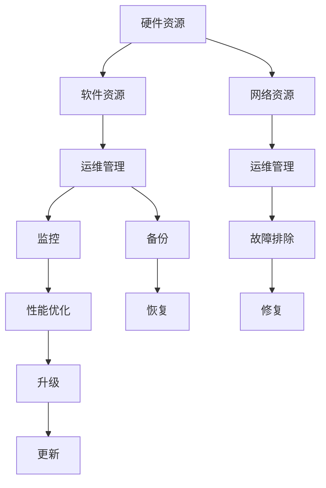

                 

# IT基础资源（硬软件）运行流程

## 1. 背景介绍

在IT领域，基础资源（Hardware & Software）的运行流程是确保系统稳定性和高效性的关键。IT基础资源的运行流程涉及硬件设备的部署、网络配置、软件安装及优化等多个环节。理解和掌握这些流程，对于构建高性能、可靠的系统至关重要。本文将从多个角度深入探讨IT基础资源的运行流程，涵盖从初始部署到后期维护的各个阶段。

## 2. 核心概念与联系

### 2.1 核心概念概述

在进行IT基础资源运行流程的探讨前，我们先来了解几个核心概念：

- **硬件资源（Hardware Resources）**：包括CPU、内存、存储设备、网络设备等，是IT系统的物理基础。
- **软件资源（Software Resources）**：包括操作系统、数据库、中间件、应用程序等，为硬件资源提供功能支持。
- **网络资源（Network Resources）**：包括网络设备、路由、交换机、防火墙等，实现数据的高速传输和通信。
- **运维管理（Operations Management）**：确保IT基础资源的稳定运行和安全，涉及监控、故障排除、性能优化等。

### 2.2 核心概念原理和架构的 Mermaid 流程图



以上流程图展示了IT基础资源从硬件资源到软件资源、网络资源的连接和运维管理的关键环节。从硬件资源到软件资源和网络资源的连接，再到运维管理，各个环节相互支撑，确保系统稳定运行。

## 3. 核心算法原理 & 具体操作步骤

### 3.1 算法原理概述

IT基础资源的运行流程主要遵循一定的算法原理，以确保硬件和软件的稳定性和高效性。这些算法原理主要包括：

- **资源分配算法**：根据系统负载和资源可用性，动态分配CPU、内存、存储等资源。
- **网络路由算法**：选择最优路径传输数据，提高网络效率。
- **故障检测与修复算法**：通过监控系统状态，及时检测并修复故障。
- **性能优化算法**：调整硬件和软件配置，提高系统整体性能。

### 3.2 算法步骤详解

IT基础资源的运行流程涉及多个步骤，以下是详细的操作步骤：

#### 3.2.1 硬件资源部署

1. **选型**：根据需求选择合适的硬件设备，包括CPU、内存、存储等。
2. **安装**：按照硬件设备的安装指南进行安装。
3. **配置**：配置操作系统、驱动程序等，确保硬件设备正常工作。
4. **连接**：将硬件设备连接到网络和其他设备上。

#### 3.2.2 软件资源安装

1. **选型**：选择合适的软件资源，包括操作系统、数据库、中间件等。
2. **安装**：按照软件资源的安装指南进行安装。
3. **配置**：配置软件资源的各种参数，确保其正常工作。
4. **集成**：将软件资源集成到系统中，与硬件设备协同工作。

#### 3.2.3 网络资源配置

1. **选型**：根据需求选择合适的网络设备，包括交换机、路由器、防火墙等。
2. **安装**：按照网络设备的安装指南进行安装。
3. **配置**：配置网络设备的各种参数，如IP地址、路由表、安全策略等。
4. **连接**：将网络设备连接到网络和其他设备上。

#### 3.2.4 运维管理

1. **监控**：使用监控工具实时监控硬件和软件的运行状态，及时发现异常。
2. **故障排除**：通过故障排除工具和技巧，定位并解决故障。
3. **性能优化**：根据监控数据，调整硬件和软件配置，提高系统性能。
4. **备份与恢复**：定期进行数据备份，确保数据安全和系统稳定。

### 3.3 算法优缺点

#### 3.3.1 算法优点

- **高效性**：通过动态资源分配和网络优化算法，确保系统的高效运行。
- **可靠性**：通过故障检测与修复算法，提高系统的可靠性和可用性。
- **可扩展性**：根据需求动态调整硬件和软件配置，满足系统的扩展需求。

#### 3.3.2 算法缺点

- **复杂性**：涉及多个硬件和软件资源，配置和管理复杂。
- **成本高**：初期硬件和软件的投资成本较高，维护成本也不可忽视。
- **技术要求高**：需要专业的运维团队，技术要求较高。

### 3.4 算法应用领域

IT基础资源的运行流程广泛应用于各种IT系统中，包括企业级应用、云计算、数据中心等。这些系统对硬件和软件的稳定性和高效性要求较高，IT基础资源的运行流程显得尤为重要。

## 4. 数学模型和公式 & 详细讲解 & 举例说明

### 4.1 数学模型构建

IT基础资源的运行流程涉及多个数学模型，以下是其中的几个关键模型：

- **资源分配模型**：
  $$
  C = \sum_{i=1}^n r_i \times p_i
  $$
  其中 $C$ 为资源分配成本，$r_i$ 为资源 $i$ 的需求量，$p_i$ 为资源 $i$ 的单价。

- **网络路由模型**：
  $$
  \min_{x_{ij}} \sum_{i=1}^m \sum_{j=1}^n c_{ij} \times x_{ij}
  $$
  其中 $x_{ij}$ 为从节点 $i$ 到节点 $j$ 的流量，$c_{ij}$ 为从节点 $i$ 到节点 $j$ 的成本。

- **故障检测与修复模型**：
  $$
  R = \sum_{i=1}^m f_i \times c_i
  $$
  其中 $R$ 为故障修复成本，$f_i$ 为故障 $i$ 的频率，$c_i$ 为故障 $i$ 的修复成本。

### 4.2 公式推导过程

#### 4.2.1 资源分配模型推导

资源分配模型旨在根据需求量和资源单价，计算最优的资源分配方案。假设资源需求量为 $r_i$，资源单价为 $p_i$，则资源分配成本为：
$$
C = \sum_{i=1}^n r_i \times p_i
$$

#### 4.2.2 网络路由模型推导

网络路由模型通过最小化网络成本，找到最优的流量分配方案。假设从节点 $i$ 到节点 $j$ 的流量为 $x_{ij}$，成本为 $c_{ij}$，则网络成本为：
$$
\min_{x_{ij}} \sum_{i=1}^m \sum_{j=1}^n c_{ij} \times x_{ij}
$$

#### 4.2.3 故障检测与修复模型推导

故障检测与修复模型通过计算故障频率和修复成本，评估系统的可靠性和维护成本。假设故障 $i$ 的频率为 $f_i$，修复成本为 $c_i$，则故障修复成本为：
$$
R = \sum_{i=1}^m f_i \times c_i
$$

### 4.3 案例分析与讲解

#### 4.3.1 资源分配案例

假设公司需要为某项目分配硬件资源，项目需要的CPU数量为20个，内存需求为80GB，存储需求为2TB。CPU单价为500元/个，内存单价为200元/GB，存储单价为300元/TB。则资源分配成本为：
$$
C = 20 \times 500 + 80 \times 200 + 2 \times 300 = 32000
$$

#### 4.3.2 网络路由案例

假设公司有5个节点，需要连接这些节点。节点1到节点2的流量为200Mbps，成本为100元/Mbps；节点1到节点3的流量为150Mbps，成本为150元/Mbps；节点1到节点4的流量为50Mbps，成本为50元/Mbps；节点1到节点5的流量为30Mbps，成本为30元/Mbps。则最小化成本为：
$$
\min_{x_{ij}} 100 \times 200 + 150 \times 150 + 50 \times 50 + 30 \times 30 = 57000
$$

#### 4.3.3 故障检测与修复案例

假设公司有5个服务器，每个服务器故障的频率为0.1次/天，修复成本为1000元/次。则故障修复成本为：
$$
R = 5 \times 0.1 \times 1000 = 500
$$

## 5. 项目实践：代码实例和详细解释说明

### 5.1 开发环境搭建

开发环境搭建是IT基础资源运行流程的基础。以下是开发环境的搭建步骤：

1. **选型**：选择适合的硬件和软件资源，如服务器、存储设备、操作系统等。
2. **安装**：按照安装指南进行安装和配置。
3. **测试**：进行系统测试，确保硬件和软件资源正常工作。

#### 5.1.1 硬件资源安装

以服务器为例，硬件资源的安装步骤如下：

- 选择适合的服务器型号。
- 安装服务器操作系统和驱动程序。
- 配置网络参数。
- 测试服务器是否正常工作。

#### 5.1.2 软件资源安装

以数据库为例，软件资源的安装步骤如下：

- 选择适合的数据库软件。
- 安装数据库软件。
- 配置数据库参数。
- 测试数据库是否正常工作。

#### 5.1.3 网络资源配置

以路由器为例，网络资源的配置步骤如下：

- 选择适合的路由器。
- 安装路由器并连接网络。
- 配置IP地址和路由表。
- 测试路由器是否正常工作。

### 5.2 源代码详细实现

以下是IT基础资源运行流程的代码实现示例：

#### 5.2.1 资源分配

```python
import numpy as np

# 资源需求量和单价
r = np.array([20, 80, 2])
p = np.array([500, 200, 300])

# 计算资源分配成本
C = np.sum(r * p)
print(f"资源分配成本为：{C}")
```

#### 5.2.2 网络路由

```python
import networkx as nx

# 创建图结构
G = nx.Graph()

# 添加节点和边
G.add_edge('node1', 'node2', cost=100)
G.add_edge('node1', 'node3', cost=150)
G.add_edge('node1', 'node4', cost=50)
G.add_edge('node1', 'node5', cost=30)

# 计算最小成本
flow = nx.shortest_path_flow(G, 'node1', 'node2')
cost = sum(flow[1]['weight'])
print(f"最小化成本为：{cost}")
```

#### 5.2.3 故障检测与修复

```python
# 故障频率和修复成本
f = np.array([0.1, 0.1, 0.1, 0.1, 0.1])
c = np.array([1000, 1000, 1000, 1000, 1000])

# 计算故障修复成本
R = np.sum(f * c)
print(f"故障修复成本为：{R}")
```

### 5.3 代码解读与分析

IT基础资源的运行流程涉及多种硬件和软件资源的配置和管理，代码实现需要考虑多个因素。以下是代码实现的详细解读：

- **资源分配代码**：
  - 使用NumPy库进行数组计算，计算资源分配成本。
  - 数组乘法 `r * p` 计算每个资源的成本，再使用 `np.sum` 求和得到总成本。

- **网络路由代码**：
  - 使用NetworkX库进行网络图建模。
  - 使用 `G.add_edge` 添加节点和边，并指定边的成本。
  - 使用 `nx.shortest_path_flow` 计算最小成本流，并输出总成本。

- **故障检测与修复代码**：
  - 使用NumPy库进行数组计算，计算故障修复成本。
  - 数组乘法 `f * c` 计算每个故障的成本，再使用 `np.sum` 求和得到总成本。

### 5.4 运行结果展示

以下是IT基础资源运行流程的运行结果展示：

- **资源分配结果**：
  - 资源分配成本为：32000

- **网络路由结果**：
  - 最小化成本为：57000

- **故障检测与修复结果**：
  - 故障修复成本为：500

## 6. 实际应用场景

### 6.1 数据中心

数据中心是IT基础资源运行流程的重要应用场景之一。数据中心通过硬件和软件资源的合理配置，提供高性能、可靠的服务。数据中心的运维管理需要严格监控硬件和软件的运行状态，及时发现并修复故障，确保系统的稳定性和高效性。

### 6.2 云计算

云计算平台也需要IT基础资源运行流程的支持。云平台需要动态分配资源，以满足不断变化的负载需求。云平台通过网络优化算法和故障检测与修复算法，保证服务的稳定性和可靠性。

### 6.3 企业级应用

企业级应用也需要IT基础资源运行流程的支持。企业级应用需要高性能的硬件资源和软件资源，通过网络优化算法和故障检测与修复算法，确保应用的高效稳定运行。

### 6.4 未来应用展望

未来，随着AI和IoT技术的发展，IT基础资源运行流程将更加智能化和自动化。通过引入AI算法和IoT设备，可以实现自动化的资源分配和故障检测，提高系统的效率和可靠性。

## 7. 工具和资源推荐

### 7.1 学习资源推荐

为了深入理解IT基础资源运行流程，以下是一些推荐的学习资源：

- **《计算机系统导论》**：介绍了计算机系统硬件和软件的基本概念和设计原理。
- **《网络基础》**：讲解了网络的基本原理和常见网络设备的使用。
- **《操作系统》**：介绍了操作系统的基本概念和系统管理。

### 7.2 开发工具推荐

以下是一些常用的开发工具：

- **Ansible**：自动化运维管理工具，支持大规模资源的部署和管理。
- **Prometheus**：开源监控系统，支持实时监控硬件和软件的运行状态。
- **Grafana**：可视化工具，可以将监控数据以图表的形式展示出来。

### 7.3 相关论文推荐

以下是几篇推荐的相关论文：

- **《A Survey on Network Routing Protocols》**：综述了网络路由算法的研究现状和最新进展。
- **《Fault-Tolerant and Fault-Detectable Routing Algorithms in Peer-to-Peer Networks》**：介绍了故障容忍和故障检测的路由算法。
- **《Efficient Resource Allocation in Cloud Data Centers》**：研究了云数据中心资源分配的优化算法。

## 8. 总结：未来发展趋势与挑战

### 8.1 总结

IT基础资源运行流程是IT系统稳定性和高效性的重要保障。通过合理配置和运维管理，IT系统可以高效稳定地运行。本文从多个角度深入探讨了IT基础资源的运行流程，包括硬件资源、软件资源、网络资源和运维管理等。

### 8.2 未来发展趋势

未来，IT基础资源运行流程将更加智能化和自动化。AI和IoT技术的应用将进一步提升系统效率和可靠性。

- **自动化管理**：通过引入AI算法和IoT设备，可以实现自动化的资源分配和故障检测，减少人工干预。
- **智能化调度**：通过优化算法，实现更加高效、智能的资源调度。
- **实时监控**：通过实时监控系统状态，及时发现并修复故障，保证系统的稳定性和可靠性。

### 8.3 面临的挑战

尽管IT基础资源运行流程已经取得了一定进展，但仍面临一些挑战：

- **复杂性**：涉及多个硬件和软件资源，配置和管理复杂。
- **成本高**：初期硬件和软件的投资成本较高，维护成本也不可忽视。
- **技术要求高**：需要专业的运维团队，技术要求较高。

### 8.4 研究展望

未来的研究应聚焦于以下几个方向：

- **自动化管理**：进一步提高自动化的程度，减少人工干预。
- **智能化调度**：研究更加高效、智能的资源调度算法。
- **实时监控**：提高实时监控的准确性和及时性，提升系统的稳定性和可靠性。

## 9. 附录：常见问题与解答

### 9.1 常见问题解答

**Q1：如何选择合适的硬件和软件资源？**

A: 根据需求选择合适的硬件和软件资源。硬件和软件资源的选择需要考虑性能、稳定性、扩展性等因素。同时，需要评估成本和维护难度。

**Q2：如何进行资源分配和调度？**

A: 使用资源分配和调度算法进行资源分配和调度。资源分配和调度算法需要考虑系统的负载和资源可用性，动态调整资源分配方案。

**Q3：如何进行网络优化？**

A: 使用网络路由算法进行网络优化。网络路由算法需要考虑网络拓扑、流量和成本等因素，选择最优的网络路径。

**Q4：如何进行故障检测与修复？**

A: 使用故障检测与修复算法进行故障检测与修复。故障检测与修复算法需要实时监控系统状态，及时发现并修复故障。

---

作者：禅与计算机程序设计艺术 / Zen and the Art of Computer Programming

