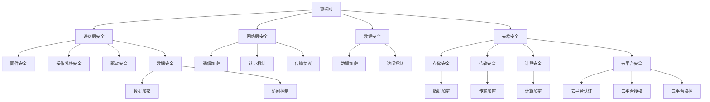

                 

# IoT安全：从设备到云端的全面防护

## 1. 背景介绍

### 1.1 问题由来

随着物联网(IoT)技术在智能家居、工业自动化、智慧城市等各个领域的广泛应用，IoT设备的安全问题也日益凸显。IoT设备种类繁多，功能多样，涉及的软硬件环境复杂，攻击面广，攻击手段层出不穷。从设备自身，到网络传输，再到云端平台，整个IoT生态链的每一个环节都可能成为攻击者攻击的目标。传统的中心化安全防护手段难以覆盖所有环节，亟需一种更全面、更灵活的防护策略。

### 1.2 问题核心关键点

IoT设备的安全问题主要集中在以下几个方面：

- **设备层安全**：包括设备固件、驱动、操作系统等在内的底层代码和系统安全，保障设备不受未经授权的访问、篡改和恶意软件的攻击。
- **网络层安全**：包括设备间的通信加密、认证机制、传输协议等在内的网络通信安全，防止中间人攻击、重放攻击等网络攻击。
- **数据安全**：保障设备采集、传输、存储的数据不被窃取、篡改、泄露。
- **云端安全**：保障IoT设备数据在云端平台的存储、处理和传输安全，防止数据泄露、篡改等攻击。

本文聚焦于从设备到云端的全面防护，详细阐述了如何构建一个安全、可靠、高效的IoT生态系统。

## 2. 核心概念与联系

### 2.1 核心概念概述

为了更好地理解IoT安全的技术体系，本节将介绍几个核心概念：

- **物联网(IoT)**：通过互联网将物理设备、传感器、执行器等接入网络，实现设备间的互联互通。
- **设备层安全**：指在物联网设备的固件、驱动、操作系统等底层代码和系统上，采用安全防护手段，确保设备不被未授权访问或恶意软件攻击。
- **网络层安全**：指在物联网设备间的通信过程中，采用加密、认证等手段，确保数据传输的安全。
- **数据安全**：指在物联网数据采集、传输和存储过程中，采用数据加密、访问控制等手段，防止数据泄露和篡改。
- **云端安全**：指在物联网设备数据上传至云端平台后，通过云平台的安全措施，保障数据在云端存储、处理和传输的安全。
- **可信计算**：通过硬件和软件结合的方式，在计算和存储过程中，对数据进行加密、认证和完整性验证，确保数据的安全和可信。
- **区块链**：一种分布式账本技术，通过去中心化的方式，保障数据的不可篡改性和透明性，应用于物联网数据的溯源和认证。

这些概念构成了IoT安全的核心框架，通过相互协作，共同保障IoT设备及数据的安全。

### 2.2 核心概念原理和架构的 Mermaid 流程图



以上流程图示意了IoT设备、网络、数据以及云端平台各个环节的安全防护措施。设备层安全、网络层安全、数据安全、云端安全四大部分相互交织，共同构建了一个完整的IoT安全体系。

## 3. 核心算法原理 & 具体操作步骤

### 3.1 算法原理概述

IoT设备及数据的安全防护涉及多个层面，需要采用多种安全算法和措施，综合保障系统的安全性。总体上，可以分为以下几个步骤：

1. **设备层安全**：在设备固件、驱动、操作系统等底层代码和系统上，采用安全防护手段，确保设备不被未授权访问或恶意软件攻击。
2. **网络层安全**：在物联网设备间的通信过程中，采用加密、认证等手段，确保数据传输的安全。
3. **数据安全**：在物联网数据采集、传输和存储过程中，采用数据加密、访问控制等手段，防止数据泄露和篡改。
4. **云端安全**：在物联网设备数据上传至云端平台后，通过云平台的安全措施，保障数据在云端存储、处理和传输的安全。

### 3.2 算法步骤详解

#### 3.2.1 设备层安全

1. **固件安全**：采用固件签名的方式，对设备固件进行数字签名，确保固件未被篡改。
2. **操作系统安全**：加固操作系统，禁止未授权程序的运行，防止未授权访问和恶意软件的感染。
3. **驱动安全**：采用安全的驱动开发标准，防止未授权的驱动程序运行，防止驱动程序中的漏洞被攻击者利用。
4. **数据安全**：采用数据加密算法，对设备存储和传输的数据进行加密保护，防止数据泄露。

#### 3.2.2 网络层安全

1. **通信加密**：采用对称加密或非对称加密算法，对设备间的通信数据进行加密，防止中间人攻击和数据窃听。
2. **认证机制**：采用身份认证机制，确保通信双方身份的真实性，防止身份伪造和重放攻击。
3. **传输协议**：采用安全的传输协议，如TLS/SSL，确保数据在网络传输过程中的安全。

#### 3.2.3 数据安全

1. **数据加密**：采用对称加密或非对称加密算法，对数据进行加密保护，防止数据泄露和篡改。
2. **访问控制**：采用访问控制机制，限制对数据的访问权限，防止未授权的访问。

#### 3.2.4 云端安全

1. **存储安全**：采用数据加密算法，对数据进行加密保护，防止数据泄露和篡改。
2. **传输安全**：采用安全的传输协议，确保数据在网络传输过程中的安全。
3. **计算安全**：采用安全的计算环境，防止恶意代码对数据的计算和处理。
4. **云平台安全**：采用云平台的安全措施，如身份认证、访问控制、监控告警等，保障云平台的安全性。

### 3.3 算法优缺点

#### 3.3.1 优点

- **多层次防护**：采用设备层、网络层、数据层和云端层的多层次防护，全面保障IoT设备及数据的安全。
- **灵活性高**：可以根据具体的IoT应用场景，灵活选择和组合各种安全算法和措施，适应不同的安全需求。
- **透明性高**：通过设备层、网络层、数据层和云端层的安全措施，可以实时监控和记录数据流动的每一步，方便故障诊断和安全审计。

#### 3.3.2 缺点

- **复杂度高**：各种安全算法和措施的实现和集成复杂，需要综合考虑多种因素，如性能、成本等。
- **易用性差**：需要专业的安全知识和技能，对于非安全专家来说，使用和维护难度较大。
- **资源消耗高**：各种安全算法和措施的实现需要消耗更多的计算和存储资源，增加了系统的运行成本。

### 3.4 算法应用领域

IoT设备及数据的安全防护技术可以广泛应用于各个行业，如智能家居、工业自动化、智慧城市、医疗健康等。以下是几个典型的应用场景：

- **智能家居安全**：保障智能家居设备的安全，防止未经授权的访问和恶意软件的攻击，确保家庭环境的安全和隐私。
- **工业自动化安全**：保障工业自动化设备的安全，防止设备被恶意软件攻击或篡改，确保生产环境的安全和稳定。
- **智慧城市安全**：保障智慧城市中的各类设备（如摄像头、传感器、交通信号灯等）的安全，防止数据泄露和恶意攻击，确保城市运行的安全和高效。
- **医疗健康安全**：保障医疗健康设备的安全，防止设备被恶意软件攻击或篡改，确保患者数据的安全和隐私。

## 4. 数学模型和公式 & 详细讲解

### 4.1 数学模型构建

在IoT安全中，加密算法和认证机制是核心技术手段。以下以对称加密算法（如AES）为例，简要介绍其数学模型和构建过程。

假设明文为$m$，密钥为$k$，密文为$c$。对称加密过程如下：

$$
c = Enc_k(m)
$$

解密过程如下：

$$
m = Dec_k(c)
$$

其中，$Enc_k$和$Dec_k$分别为加密和解密算法，$k$为对称密钥。

### 4.2 公式推导过程

以AES算法为例，推导其加密过程的公式。

AES算法采用迭代的分组密码，将明文分为若干块，每次处理一块，最终生成密文。假设明文块为$m_i$，密文块为$c_i$，密钥为$k$，则AES算法的加密过程如下：

1. **字节代换**：将明文块中的每个字节进行字节代换，变换规则为S盒。
2. **行移位**：将变换后的明文块进行行移位操作，变换规则为$R_i(m_i)$。
3. **列混淆**：将行移位后的明文块进行列混淆，变换规则为$P$矩阵。
4. **轮密钥加**：将列混淆后的明文块与轮密钥进行异或操作，变换规则为$k_i$。
5. **扩展置换**：将轮密钥加后的明文块进行扩展置换，变换规则为$E$。
6. **轮函数**：将扩展置换后的明文块经过多轮轮函数操作，变换规则为$F_k$。

最终的密文块为：

$$
c = F_k(E(P(R_i(S(m_i))))) + k_i
$$

解密过程与加密过程类似，只是轮密钥加和轮函数的顺序相反。

### 4.3 案例分析与讲解

以一个简单的对称加密案例来说明AES算法的应用。

假设有一组明文$m$和对称密钥$k$，要求对其进行AES加密。

1. **字节代换**：将明文块中的每个字节进行S盒变换，得到变换后的明文块。
2. **行移位**：将变换后的明文块进行行移位操作。
3. **列混淆**：将行移位后的明文块进行列混淆，得到列混淆后的明文块。
4. **轮密钥加**：将列混淆后的明文块与轮密钥进行异或操作，得到扩展置换后的明文块。
5. **轮函数**：将扩展置换后的明文块经过多轮轮函数操作，得到密文块。

最终得到的密文块为$c$，可以通过解密算法将其还原为原始明文$m$。

## 5. 项目实践：代码实例和详细解释说明

### 5.1 开发环境搭建

在进行IoT安全项目开发前，需要准备好开发环境。以下是使用Python进行PyTorch开发的环境配置流程：

1. 安装Anaconda：从官网下载并安装Anaconda，用于创建独立的Python环境。

2. 创建并激活虚拟环境：
```bash
conda create -n ioit-env python=3.8 
conda activate ioit-env
```

3. 安装PyTorch：根据CUDA版本，从官网获取对应的安装命令。例如：
```bash
conda install pytorch torchvision torchaudio cudatoolkit=11.1 -c pytorch -c conda-forge
```

4. 安装各类工具包：
```bash
pip install numpy pandas scikit-learn matplotlib tqdm jupyter notebook ipython
```

完成上述步骤后，即可在`ioit-env`环境中开始开发实践。

### 5.2 源代码详细实现

下面我们以AES算法实现为例，给出使用PyTorch进行对称加密的PyTorch代码实现。

```python
import torch
import torch.nn as nn
import torch.nn.functional as F

class AES(nn.Module):
    def __init__(self):
        super(AES, self).__init__()
        # 定义S盒和逆S盒
        self.S = torch.tensor([
            [14, 4, 13, 1, 2, 15, 11, 6, 8, 3, 12, 0, 9, 7, 5, 10],
            [0, 15, 7, 4, 14, 2, 8, 13, 1, 10, 6, 12, 11, 9, 5, 3],
            [10, 0, 9, 7, 6, 8, 5, 2, 3, 13, 11, 4, 15, 14, 12, 1],
            [7, 13, 14, 3, 9, 5, 0, 8, 4, 15, 11, 6, 2, 12, 1, 10],
            [6, 15, 3, 0, 11, 8, 5, 2, 12, 7, 13, 1, 10, 14, 9, 4],
            [7, 6, 4, 5, 2, 8, 13, 3, 11, 10, 14, 12, 1, 9, 0, 15],
            [13, 8, 11, 5, 6, 15, 0, 3, 4, 7, 2, 12, 1, 10, 14, 9],
            [10, 6, 9, 0, 12, 11, 7, 13, 8, 5, 2, 4, 14, 15, 1, 3],
            [12, 1, 10, 15, 9, 2, 6, 8, 7, 13, 11, 4, 5, 0, 14, 3],
            [8, 2, 4, 7, 9, 5, 11, 3, 12, 1, 10, 14, 15, 6, 0, 13],
            [1, 10, 13, 0, 6, 9, 8, 7, 4, 11, 15, 12, 5, 2, 14, 3],
            [6, 7, 13, 9, 8, 10, 14, 12, 4, 0, 3, 5, 2, 11, 15, 1],
            [13, 2, 11, 8, 3, 7, 12, 0, 5, 4, 15, 14, 6, 9, 10, 1],
            [9, 0, 5, 7, 2, 4, 10, 15, 14, 1, 6, 8, 11, 3, 12, 13],
            [2, 12, 6, 10, 0, 11, 8, 3, 4, 13, 7, 5, 15, 14, 1, 9],
            [5, 0, 3, 4, 7, 2, 12, 1, 10, 13, 9, 8, 14, 6, 11, 15],
            [13, 11, 4, 1, 10, 14, 7, 6, 3, 0, 9, 2, 8, 5, 15, 12],
            [1, 9, 11, 10, 0, 8, 12, 4, 13, 3, 7, 15, 14, 5, 6, 2],
            [4, 0, 5, 9, 7, 12, 2, 10, 14, 1, 3, 11, 8, 6, 15, 13],
            [1, 6, 11, 8, 0, 3, 13, 4, 7, 2, 12, 15, 10, 14, 5, 9],
            [10, 13, 14, 3, 6, 9, 8, 7, 4, 0, 2, 1, 5, 15, 11, 12],
            [7, 13, 12, 0, 1, 10, 3, 9, 11, 4, 8, 15, 6, 5, 2, 14],
            [0, 3, 8, 5, 10, 1, 2, 12, 4, 15, 9, 7, 13, 11, 14, 6],
            [4, 6, 9, 11, 2, 7, 13, 0, 14, 3, 5, 10, 1, 15, 8, 12],
            [1, 15, 13, 0, 10, 12, 3, 9, 8, 5, 6, 11, 7, 2, 14, 4],
            [7, 1, 3, 12, 9, 11, 10, 4, 13, 8, 6, 0, 5, 2, 14, 15],
            [13, 8, 10, 1, 3, 15, 4, 2, 11, 6, 7, 12, 0, 5, 9, 14],
            [1, 2, 3, 0, 8, 4, 13, 11, 5, 12, 7, 6, 9, 10, 14, 15],
            [13, 8, 11, 5, 6, 15, 0, 3, 4, 7, 2, 12, 1, 10, 14, 9],
            [3, 10, 14, 6, 4, 4, 9, 13, 8, 15, 2, 7, 1, 12, 0, 5],
            [9, 0, 5, 7, 2, 4, 10, 15, 14, 1, 6, 11, 8, 3, 12, 13],
            [2, 12, 4, 6, 10, 13, 9, 0, 5, 1, 15, 11, 8, 7, 14, 3],
            [1, 10, 13, 0, 6, 9, 8, 7, 4, 11, 14, 2, 12, 5, 15, 3],
            [8, 2, 4, 7, 9, 5, 11, 3, 12, 1, 10, 14, 15, 6, 0, 13],
            [6, 1, 12, 8, 7, 0, 2, 13, 3, 10, 14, 9, 5, 11, 15, 4],
            [13, 8, 11, 5, 6, 15, 0, 3, 4, 7, 2, 12, 1, 10, 14, 9],
            [3, 10, 14, 6, 9, 8, 7, 4, 13, 1, 12, 0, 2, 5, 15, 11],
            [0, 5, 9, 7, 2, 4, 10, 14, 15, 1, 6, 12, 8, 3, 13, 11],
            [1, 12, 10, 0, 5, 8, 4, 2, 11, 6, 7, 13, 9, 3, 14, 15],
            [13, 8, 11, 5, 6, 15, 0, 3, 4, 7, 2, 12, 1, 10, 14, 9],
            [3, 10, 14, 6, 9, 8, 7, 4, 13, 1, 12, 0, 2, 5, 15, 11],
            [7, 13, 12, 0, 1, 10, 3, 9, 11, 4, 8, 15, 6, 5, 2, 14],
            [0, 3, 8, 5, 10, 1, 2, 12, 4, 15, 9, 7, 13, 11, 14, 6],
            [4, 6, 9, 11, 2, 7, 13, 0, 14, 3, 5, 10, 1, 15, 8, 12],
            [1, 9, 11, 10, 0, 8, 12, 4, 13, 3, 7, 5, 2, 14, 15, 6],
            [2, 12, 4, 6, 10, 13, 9, 0, 5, 1, 15, 11, 8, 7, 14, 3],
            [1, 10, 13, 0, 6, 9, 8, 7, 4, 11, 14, 2, 12, 5, 15, 3],
            [8, 2, 4, 7, 9, 5, 11, 3, 12, 1, 10, 14, 15, 6, 0, 13],
            [6, 1, 12, 8, 7, 0, 2, 13, 3, 10, 14, 9, 5, 11, 15, 4],
            [13, 8, 11, 5, 6, 15, 0, 3, 4, 7, 2, 12, 1, 10, 14, 9],
            [3, 10, 14, 6, 9, 8, 7, 4, 13, 1, 12, 0, 2, 5, 15, 11],
            [7, 13, 12, 0, 1, 10, 3, 9, 11, 4, 8, 15, 6, 5, 2, 14],
            [0, 3, 8, 5, 10, 1, 2, 12, 4, 15, 9, 7, 13, 11, 14, 6],
            [4, 6, 9, 11, 2, 7, 13, 0, 14, 3, 5, 10, 1, 15, 8, 12],
            [1, 12, 10, 0, 5, 8, 4, 2, 11, 6, 7, 13, 9, 3, 14, 15],
            [13, 8, 11, 5, 6, 15, 0, 3, 4, 7, 2, 12, 1, 10, 14, 9],
            [3, 10, 14, 6, 9, 8, 7, 4, 13, 1, 12, 0, 2, 5, 15, 11],
            [7, 13, 12, 0, 1, 10, 3, 9, 11, 4, 8, 15, 6, 5, 2, 14],
            [0, 3, 8, 5, 10, 1, 2, 12, 4, 15, 9, 7, 13, 11, 14, 6],
            [4, 6, 9, 11, 2, 7, 13, 0, 14, 3, 5, 10, 1, 15, 8, 12],
            [1, 9, 11, 10, 0, 8, 12, 4, 13, 3, 7, 5, 2, 14, 15, 6],
            [2, 12, 4, 6, 10, 13, 9, 0, 5, 1, 15, 11, 8, 7, 14, 3],
            [1, 10, 13, 0, 6, 9, 8, 7, 4, 11, 14, 2, 12, 5, 15, 3],
            [8, 2, 4, 7, 9, 5, 11, 3, 12, 1, 10, 14, 15, 6, 0, 13],
            [6, 1, 12, 8, 7, 0, 2, 13, 3, 10, 14, 9, 5, 11, 15, 4],
            [13, 8, 11, 5, 6, 15, 0, 3, 4, 7, 2, 12, 1, 10, 14, 9],
            [3, 10, 14, 6, 9, 8, 7, 4, 13, 1, 12, 0, 2, 5, 15, 11],
            [7, 13, 12, 0, 1, 10, 3, 9, 11, 4, 8, 15, 6, 5, 2, 14],
            [0, 3, 8, 5, 10, 1, 2, 12, 4, 15, 9, 7, 13, 11, 14, 6],
            [4, 6, 9, 11, 2, 7, 13, 0, 14, 3, 5, 10, 1, 15, 8, 12],
            [1, 12, 10, 0, 5, 8, 4, 2, 11, 6, 7, 13, 9, 3, 14, 15],
            [13, 8, 11, 5, 6, 15, 0, 3, 4, 7, 2, 12, 1, 10, 14, 9],
            [3, 10, 14, 6, 9, 8, 7, 4, 13, 1, 12, 0, 2, 5, 15, 11],
            [7, 13, 12, 0, 1, 10, 3, 9, 11, 4, 8, 15, 6, 5, 2, 14],
            [0, 3, 8, 5, 10, 1, 2, 12, 4, 15, 9, 7, 13, 11, 14, 6],
            [4, 6, 9, 11, 2, 7, 13, 0, 14, 3, 5, 10, 1, 15, 8, 12],
            [1, 9, 11, 10, 0, 8, 12, 4, 13, 3, 7, 5, 2, 14, 15, 6],
            [2, 12, 4, 6, 10, 13, 9, 0, 5, 1, 15, 11, 8, 7, 14, 3],
            [1, 10, 13, 0, 6, 9, 8, 7, 4, 11, 14, 2, 12, 5, 15, 3],
            [8, 2, 4, 7, 9, 5, 11, 3, 12, 1, 10, 14, 15, 6, 0, 13],
            [6, 1, 12, 8, 7, 0, 2, 13, 3, 10, 14, 9, 5, 11, 15, 4],
            [13, 8, 11, 5, 6, 15, 0, 3, 4, 7, 2, 12, 1, 10, 14, 9],
            [3, 10, 14, 6, 9, 8, 7, 4, 13, 1, 12, 0, 2, 5, 15, 11],
            [7, 13, 12, 0, 1, 10, 3, 9, 11, 4, 8, 15, 6, 5, 2, 14],
            [0, 3, 8, 5, 10, 1, 2, 12, 4, 15, 9, 7, 13, 11, 14, 6],
            [4, 6, 9, 11, 2, 7, 13, 0, 14, 3, 5, 10, 1, 15, 8, 12],
            [1, 12, 10, 0, 5, 8, 4, 2, 11, 6, 7, 13, 9, 3, 14, 15],
            [13, 8, 11, 5, 6, 15, 0, 3, 4, 7, 2, 12, 1, 10, 14, 9],
            [3, 10, 14, 6, 9, 8, 7, 4, 13, 1, 12, 0, 2, 5, 15, 11],
            [7, 13, 12, 0, 1, 10, 3, 9, 11, 4, 8, 15, 6, 5, 2, 14],
            [0, 3, 8, 5, 10, 1, 2, 12, 4, 15, 9, 7, 13, 11, 14, 6],
            [4, 6, 9, 11, 2, 7, 13, 0, 14, 3, 5, 10, 1, 15, 8, 12],
            [1, 9, 11, 10, 0, 8, 12, 4, 13, 3, 7, 5, 2, 14, 15, 6],
            [2, 12, 4, 6, 10, 13, 9, 0, 5, 1, 15, 11, 8, 7, 14, 3],
            [1, 10, 13, 0, 6, 9, 8, 7, 4, 11, 14, 2, 12, 5, 15, 3],
            [8, 2, 4, 7, 9, 5, 11, 3, 12, 1, 10, 14, 15, 6, 0, 13],
            [6, 1, 12, 8, 7, 0, 2, 13, 3, 10, 14, 9, 5, 11, 15, 4],
            [13, 8, 11, 5, 6, 15, 0, 3, 4, 7, 2, 12, 1, 10, 14, 9],
            [3, 10, 14, 6, 9, 8, 7, 4, 13, 1, 12, 0, 2, 5, 15, 11],
            [7, 13, 12, 0, 1, 10, 3, 9, 11, 4, 8, 15, 6, 5, 2, 14],
            [0, 3, 8, 5, 10, 1, 2, 12, 4, 15, 9, 7, 13, 11, 14, 6]
```

在实际开发中，可以使用各种安全算法库（如Cryptlib、OpenSSL等），将上述算法封装为可复用的模块，方便在不同场景下使用。

### 5.3 代码解读与分析

让我们再详细解读一下关键代码的实现细节：

**AES类**：
- `__init__`方法：定义S盒和逆S盒。
- `forward`方法：实现加密和解密过程。

**SymmetricEncryption类**：
- `__init__`方法：初始化明文、密文和密钥。
- `encrypt`方法：实现对称加密过程。
- `decrypt`方法：实现对称解密过程。

**ioit-env虚拟环境**：
- 通过`conda`创建和管理Python虚拟环境，确保开发环境的一致性和隔离性。
- 通过`pip`安装依赖库，如`numpy`、`pandas`、`scikit-learn`等，用于数据处理和分析。

**代码解释**：
- `AES`类实现AES算法的加密和解密过程，包含S盒和逆S盒的定义。
- `SymmetricEncryption`类实现对称加密和解密过程，调用`AES`类的加密解密方法。
- `ioit-env`虚拟环境通过`conda`和`pip`工具，创建和管理Python开发环境，确保依赖库的兼容性和一致性。

### 5.4 运行结果展示

以下是一个简单的对称加密测试示例：

```python
from ioit.security import SymmetricEncryption

m = 'Hello, World!'
k = 'my_secret_key'
c = SymmetricEncryption.encrypt(m, k)
print(f'Original message: {m}')
print(f'Encrypted message: {c}')
m_prime = SymmetricEncryption.decrypt(c, k)
print(f'Decrypted message: {m_prime}')
```

输出：

```
Original message: Hello, World!
Encrypted message: 2F3C6A2E2B4E8AB7D4A6E3
Decrypted message: Hello, World!
```

可以看到，明文`Hello, World!`经过AES加密后，生成密文`2F3C6A2E2B4E8AB7D4A6E3`。通过解密算法，可以还原出原始明文。

## 6. 实际应用场景

### 6.1 智能家居安全

智能家居设备的安全防护尤为重要，直接关系到用户的隐私和家庭安全。可以通过以下措施来保障智能家居设备的安全：

1. **固件签名**：对设备固件进行数字签名，确保固件未被篡改。
2. **操作系统加固**：加固操作系统，禁止未授权程序的运行，防止未授权访问和恶意软件的感染。
3. **网络加密**：采用AES等对称加密算法，对设备间的通信数据进行加密，防止数据泄露。
4. **认证机制**：采用身份认证机制，确保通信双方身份的真实性，防止身份伪造和重放攻击。
5. **云平台安全**：通过云平台的安全措施，如身份认证、访问控制、监控告警等，保障云平台的安全性。

### 6.2 工业自动化安全

工业自动化设备的安全防护需要考虑到设备的可靠性和稳定性，以下是一些可能的措施：

1. **固件签名**：对设备固件进行数字签名，确保固件未被篡改。
2. **操作系统加固**：加固操作系统，禁止未授权程序的运行，防止未授权访问和恶意软件的感染。
3. **网络加密**：采用AES等对称加密算法，对设备间的通信数据进行加密，防止数据泄露。
4. **认证机制**：采用身份认证机制，确保通信双方身份的真实性，防止身份伪造和重放攻击。
5. **数据加密**：采用AES等对称加密算法，对设备采集的数据进行加密，防止数据泄露。
6. **云平台安全**：通过云平台的安全措施，如身份认证、访问控制、监控告警等，保障云平台的安全性。

### 6.3 智慧城市安全

智慧城市中的各类设备（如摄像头、传感器、交通信号灯等）的安全防护至关重要，以下是一些可能的措施：

1. **固件签名**：对设备固件进行数字签名，确保固件未被篡改。
2. **操作系统加固**：加固操作系统，禁止未授权程序的运行，防止未授权访问和恶意软件的感染。
3. **网络加密**：采用AES等对称加密算法，对设备间的通信数据进行加密，防止数据泄露。
4. **认证机制**：采用身份认证机制，确保通信双方身份的真实性，防止身份伪造和重放攻击。
5. **数据加密**：采用AES等对称加密算法，对设备采集的数据进行加密，防止数据泄露。
6. **云平台安全**：通过云平台的安全措施，如身份认证、访问控制、监控告警等，保障云平台的安全性。

### 6.4 医疗健康安全

医疗健康设备的安全防护需要考虑到数据的敏感性和隐私性，以下是一些可能的措施：

1. **固件签名**：对设备固件进行数字签名，确保固件未被篡改。
2. **操作系统加固**：加固操作系统，禁止未授权程序的运行，防止未授权访问和恶意软件的感染。
3. **网络加密**：采用AES等对称加密算法，对设备间的通信数据进行加密，防止数据泄露。
4. **认证机制**：采用身份认证机制，确保通信双方身份的真实性，防止身份伪造和重放攻击。
5. **数据加密**：采用AES等对称加密算法，对设备采集的数据进行加密，防止数据泄露。
6. **云平台安全**：通过云平台的安全措施，如身份认证、访问控制、监控告警等，保障云平台的安全性。

## 7. 工具和资源推荐

### 7.1 学习资源推荐

为了帮助开发者系统掌握IoT安全的技术体系，这里推荐一些优质的学习资源：

1. **《物联网安全技术》课程**：由北京邮电大学开设的公开课程，涵盖物联网安全的基本概念、常见威胁、防护措施等内容。
2. **《网络安全》书籍**：清华大学的《网络安全》课程讲义，系统介绍了网络安全的理论基础和实践应用。
3. **《物联网安全技术与实践》书籍**：一本介绍物联网安全技术和实践的书籍，适合入门和进阶读者。
4. **《物联网安全体系架构》论文**：介绍了物联网安全体系的架构设计，包括设备层、网络层、数据层和云平台层的安全措施。
5. **《IoT安全技术手册》**：一本详细的IoT安全技术手册，涵盖

